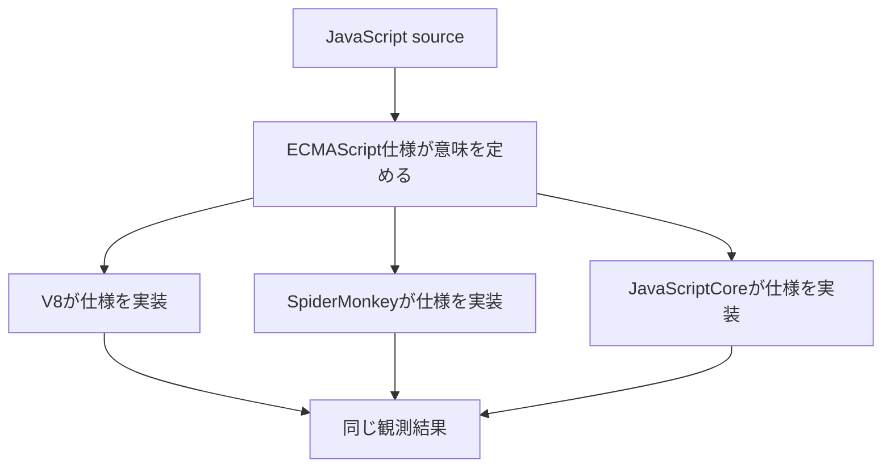
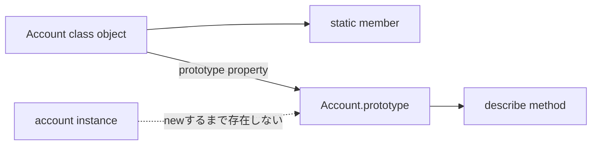
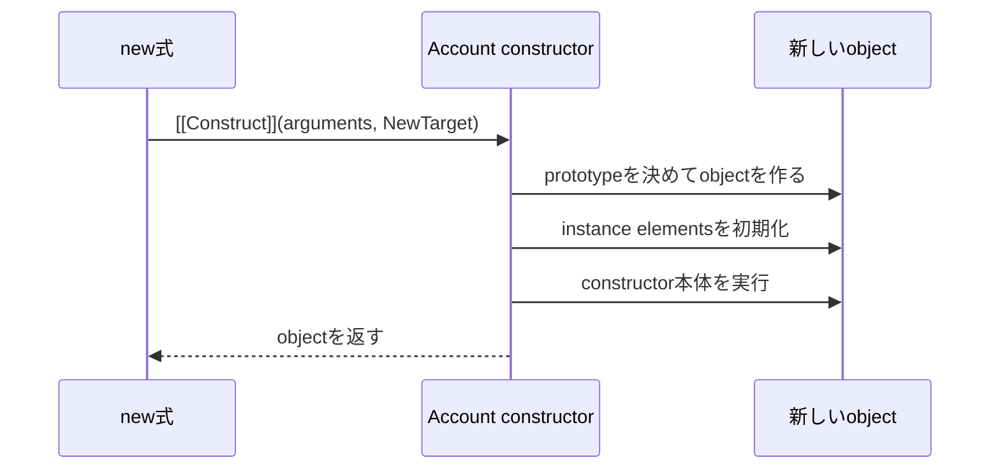
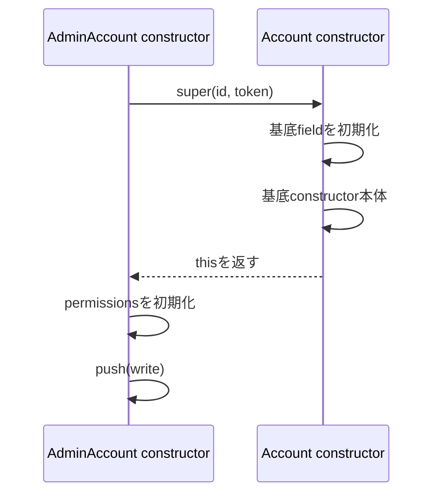
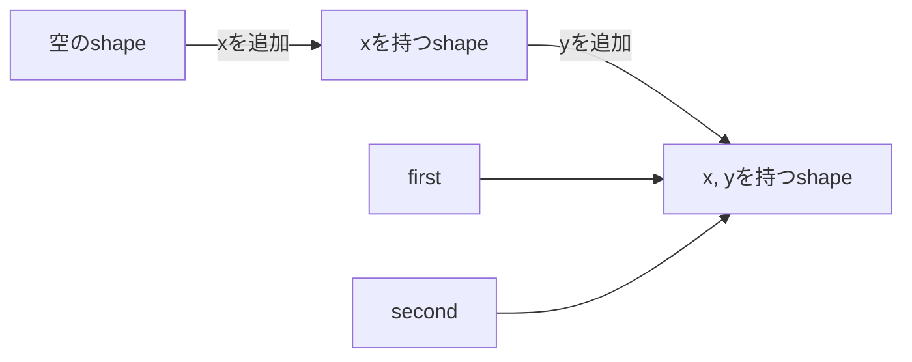

JavaScriptのクラスを深く調べると、ECMAScript仕様の `[[Construct]]`、`InitializeInstanceElements` と、V8の `Map`（Hidden Class、隠しクラス）、インラインキャッシュといった用語が同時に出てきます。ここで混乱しやすいのは、言語が保証する挙動と、特定エンジンの高速化手法を同じ説明へ混ぜることです。

ECMAScript仕様は「どの結果にならなければならないか」を定めます。V8実装は「その結果をどう高速に作るか」を選びます。この記事では、まず仕様上の生成順を追い、その後でV8がオブジェクトの形をどう扱うかを見ます。

## 2つの層は答える質問が違う

| 層 | 答える質問 | 代表的な用語 |
| --- | --- | --- |
| ECMAScript仕様 | JavaScriptとして何が観測されるか | `[[Construct]]`, `NewTarget`, フィールド初期化 |
| エンジン実装 | 仕様どおりの挙動をどう高速化するか | V8 `Map`, 要素, インラインキャッシュ, GC |



V8の `Map` やインオブジェクトプロパティはECMAScriptの語ではありません。逆に、`[[Construct]]` は概念上の内部メソッドであり、V8のソースコードに同じ名前の関数がそのまま存在するとは限りません。

この記事で繰り返し使う用語も、先に役割をそろえておきます。

| 用語 | この記事での意味 |
| --- | --- |
| `[[Construct]]` | `constructor` として呼ばれたときの仕様上の内部処理 |
| `NewTarget` | どの `constructor` を生成の起点として扱うかを示す値 |
| インスタンス要素 | 各インスタンスへ作る `public`・`private` フィールドなどの要素 |
| V8 `Map` | プロパティの構成など、オブジェクトの形状を表すV8内部の情報 |
| インラインキャッシュ | 過去のプロパティアクセス結果を使い、同じ形のオブジェクトを速く扱う仕組み |
| GC | 到達できなくなったメモリを回収するガベージコレクション |

用語を完全に暗記してから進む必要はありません。コードの実行順を知りたいときは仕様側、速度やメモリ配置を知りたいときはV8側を見る、という分類だけ保って読み進めてください。

## 観測対象のクラスを1つ決める

次のクラスを通して順序を追います。

```js
class Account {
  role = "member";
  label = `${this.id}:${this.role}`;
  #token;

  constructor(id, token) {
    this.id = id;
    this.#token = token;
  }

  describe() {
    return this.label;
  }
}

const account = new Account("user-42", "secret");
```

この例には、`public` フィールド、`private` フィールド、`constructor` 本体、`prototype` メソッドがあります。ソースに書かれた順序だけから結果を推測すると、初期化時点を誤ります。

`label` の初期化時点では、`constructor` 本体の `this.id = id` がまだ実行されていません。そのため、生成直後の `label` は `"undefined:member"` になります。後で `id` を設定しても、`label` は自動再計算されません。

この小さな結果を、仕様上の順序から説明していきます。

## クラス定義の評価では、インスタンスはまだ作られない

JavaScriptエンジンが `class Account { ... }` を評価すると、クラスコンストラクターとして使う関数オブジェクトと、そのプロトタイプオブジェクトを作ります。メソッド定義は `prototype` 側へ配置され、`static` 要素はクラス側で処理されます。



この段階で `role`、`label`、`#token` を持つ `Account` インスタンスが作られるわけではありません。インスタンスフィールドの定義はクラスに記録され、`new Account(...)` のたびに各インスタンスへ初期化されます。

`prototype` メソッドとフィールドの違いは、ここにあります。

| クラス本体の要素 | 主な配置・処理時点 |
| --- | --- |
| インスタンスメソッド | クラス評価時に `prototype` へ定義 |
| `static` メソッド | クラス評価時にクラスオブジェクトへ定義 |
| インスタンスフィールド | インスタンス生成ごとに初期化 |
| `private` インスタンスフィールド | インスタンス生成ごとに `private` 要素として初期化 |
| `static` フィールド | クラス評価時に初期化 |

## `new` から `constructor` の `[[Construct]]` へ進む

`new Account("user-42", "secret")` を評価すると、`Account` が `constructor` として呼べるかを確認し、引数とともに内部の構築処理へ進みます。

基底クラスでは、概念上おおむね次の順です。



この順序では、`public` フィールドと `private` フィールドの初期化が `constructor` 本体より前です。したがって `label` フィールドを初期化する時点で、`role` はすでに `"member"` ですが、`id` はまだ存在しません。

```js
const account = new Account("user-42", "secret");

console.log(account.id);       // "user-42"
console.log(account.role);     // "member"
console.log(account.label);    // "undefined:member"
console.log(account.describe()); // "undefined:member"
```

フィールド初期化子から `constructor` 引数を直接参照できない理由も同じです。引数は `constructor` 本体の環境で利用できますが、フィールド初期化子へ同名のローカル変数として渡されるわけではありません。

## `NewTarget` が作るオブジェクトの `prototype` を決める

通常の `new Account()` では、実行する `constructor` と `NewTarget` はどちらも `Account` です。継承や `Reflect.construct` では異なる場合があります。

オブジェクト作成時は、概念上 `NewTarget.prototype` が `prototype` 候補になります。これにより、基底 `constructor` の初期化処理を使いながら、派生側の `prototype` を持つオブジェクトを作れます。

```js
function Base(id) {
  this.id = id;
}

function Derived() {}
Derived.prototype.describe = function () {
  return this.id;
};

const value = Reflect.construct(Base, ["item-1"], Derived);

console.log(Object.getPrototypeOf(value) === Derived.prototype); // true
console.log(value.describe()); // "item-1"
```

`Target` は実行する `constructor`、`NewTarget` は主に生成するオブジェクトの `prototype` と、`constructor` 内の `new.target` に影響します。この分離は、派生クラスの生成規則を理解するうえで重要です。

## 派生クラスでは `super()` が `this` を用意する

派生クラスは、基底クラスと初期化順が違います。

```js
class AdminAccount extends Account {
  permissions = ["read"];

  constructor(id, token) {
    super(id, token);
    this.permissions.push("write");
  }
}
```

派生 `constructor` は、自分で最初のオブジェクトを作りません。`super()` を通じて基底 `constructor` の構築処理を実行し、返された `this` を受け取ります。その後、派生クラスのインスタンスフィールドを初期化し、`super()` より後の `constructor` 本体を続けます。



`super()` より前に `this` を使えないのは、まだ派生 `constructor` の `this` が初期化されていないためです。単に「親を先に呼ぶ決まり」と覚えるより、誰がオブジェクトを作るかを見ると理解しやすくなります。

## `public` フィールドは通常の代入と同じとは限らない

クラスフィールドの初期化は、概念上プロパティを定義する処理です。`constructor` 本体の `this.x = value` は通常、代入の規則に従います。この違いは、`prototype` 連鎖上にセッターがある場合に観測できます。

```js
class Base {
  set value(next) {
    console.log("setter", next);
  }
}

class WithField extends Base {
  value = 1;
}

class WithAssignment extends Base {
  constructor() {
    super();
    this.value = 1;
  }
}

new WithField();      // 通常、Baseのsetterを呼ばず自身のfieldを定義
new WithAssignment(); // Baseのsetterを呼ぶ
```

フィールド初期化子を「`constructor` の先頭へ代入文を移した構文糖」と説明すると、この差を表せません。普段のコードでは同じ結果に見えることが多いものの、プロパティ定義と代入は別の抽象操作です。

## `private` フィールドは文字列キーのプロパティではない

`#token` は、`account["#token"]` で読めるプロパティではありません。`private` 名に対応する内部要素として扱われ、宣言したクラスのコードからだけアクセスできます。

```js
console.log(Object.keys(account));
// id, role, labelなどは見えるが、#tokenは含まれない

console.log(account["#token"]); // undefined
```

`private` フィールドの存在確認は、通常の `in` や `Object.hasOwn` と同じ仕組みではありません。ECMAScript仕様上も、通常プロパティと `private` 要素は区別されています。

これはTypeScriptの `private` キーワードとも違います。TypeScriptの通常の `private` は主にコンパイル時のアクセス制御で、出力先や設定によっては通常プロパティとして実行されます。JavaScriptの `#private` はランタイムで強制されます。

## ここからV8実装：`Map` はオブジェクトの形状を表す

ECMAScript仕様は、プロパティをどのメモリレイアウトで保存するかを定めません。V8では、オブジェクトの構造を表すために `Map` と呼ばれる内部オブジェクトを使います。一般的な解説ではHidden Classとも呼ばれますが、JavaScriptの `Map` オブジェクトとは別物です。

概念的には、プロパティを同じ順序で追加したオブジェクトは、同じ形状の遷移をたどり、`Map` を共有しやすくなります。

```js
function Point(x, y) {
  this.x = x;
  this.y = y;
}

const first = new Point(1, 2);
const second = new Point(3, 4);
```



この図は理解用の概念図です。実際のV8内部表現はバージョンや最適化状況で変わり、ソース上の細部を恒久的な仕様として扱えません。

## プロパティの追加順を揃えると形状が安定しやすい

次のように条件によって追加順が変わると、同じ用途のオブジェクトでも異なる形状を持つ可能性があります。

```js
function createRecord(input) {
  const record = {};

  if (input.includeName) record.name = input.name;
  record.id = input.id;

  return record;
}
```

形状の安定だけを目的に、読みにくいコードへ変える必要はありません。ただし、同じ種類のオブジェクトなら `constructor` やFactoryで主要フィールドを同じ順序に初期化する設計は、読みやすさとエンジンの予測しやすさが一致します。

```js
function createRecord(input) {
  return {
    id: input.id,
    name: input.includeName ? input.name : undefined,
  };
}
```

性能差はワークロードやV8のバージョンに依存します。頻繁に実行される経路で問題が観測されていないのに、`Map` を想像して一般コードを最適化するのは避けます。まずプロファイルを取り、実際のボトルネックを確認します。

## プロパティの保存場所は1種類ではない

V8はプロパティの数や変更パターンに応じて、インスタンス内に保持する形、プロパティ用の補助ストレージ、辞書に近い形などを使い分けます。配列のインデックスに相当する要素も、通常の名前付きプロパティとは異なる経路で扱われます。

この分類は実装詳細です。JavaScriptから観測できるプロパティ探索や列挙順はECMAScript仕様に従いますが、メモリ上の置き場所をアプリケーションコードから前提にしてはいけません。

V8のデバッグ出力やブログで `in-object properties`、`properties`、`elements` という語を見たら、JavaScriptの意味の違いではなく、同じ仕様上のオブジェクトを効率よく表す内部配置の違いだと整理してください。

## インラインキャッシュは同じ形の繰り返しを速くする

`account.id` のようなプロパティアクセスを毎回一から一般的に探索するのは高コストです。V8は実行中に観測したオブジェクトの形状とアクセス結果を記録し、同じ形が続く場合に速い経路を使います。この仕組みの一部がインラインキャッシュです。

同じアクセス箇所へ多くの異なる形状が流れ込むと、単一形状向けの最適化を使いにくくなることがあります。ただし、何種類でどの状態へ変わるかは実装とバージョンに依存します。

「プロパティ順を統一すれば必ず速い」「クラスなら常に最適化される」と断定できません。性能を論じるときは、次の順で確認します。

1. 本番環境に近いワークロードでプロファイルを取る。
2. ボトルネックがプロパティアクセスか確認する。
3. オブジェクト形状の多様化が原因かエンジンツールで調べる。
4. 読みやすさを壊さない小さな変更でベンチマークする。

## 割り当てとGCは `constructor` 構文だけでは決まらない

`new` を使うとヒープ割り当てが必ず高コストになる、短命オブジェクトは必ずこの領域へ入る、といった説明も慎重に扱う必要があります。エンジンは逃避解析、世代別GC、オブジェクトレイアウトなどをバージョンごとに改善します。

ECMAScript仕様が保証するのは、オブジェクトの同一性やプロパティ操作として観測できる結果です。実際のメモリ確保や回収の時点はエンジンが決めます。V8の特定バージョンを調査した結果は、そのバージョンと条件を明記して実装知識として扱います。

## 標準APIとV8のデバッグ機能を使い分ける

通常の挙動確認には標準APIを使います。

```js
console.log(Object.getPrototypeOf(account) === Account.prototype);
console.log(Object.getOwnPropertyDescriptors(account));
console.log(Object.keys(account));
```

V8には内部状態を調べるデバッグ機能やフラグがありますが、通常のJavaScriptではなく、利用方法もバージョン依存です。本番コードへ組み込まず、エンジン調査用の隔離したスクリプトで使います。

| 調べたいこと | 使う情報源 |
| --- | --- |
| クラスフィールドの観測可能な順序 | ECMAScript仕様、標準API |
| `prototype` やプロパティ記述子 | `Object` API |
| V8の形状や最適化状況 | V8のドキュメント、デバッグツール |
| 実アプリのボトルネック | プロファイラー、ベンチマーク |

## 仕様が意味を定め、V8が速度を最適化する

`new Account()` の観測結果は、仕様上の順序から説明できます。オブジェクトを作り、インスタンス要素を初期化し、その後で基底 `constructor` 本体を実行するため、フィールド初期化子から `constructor` 代入前の `id` は見えません。

V8はその挙動を守りながら、`Map` で形状を表し、プロパティ配置やインラインキャッシュを使って高速化します。`Map` の遷移や保存場所はV8の選択であり、JavaScriptの意味そのものではありません。

内部構造を読むときは、用語に出会うたびに「これは仕様が保証する話か、特定エンジンが選ぶ話か」を分類してください。分類できれば、実装変更で古くなる知識と、JavaScriptコードの正しさを支える知識を混同せずに済みます。

## 参考資料

- [ECMAScript: Class Definitions](https://tc39.es/ecma262/multipage/ecmascript-language-functions-and-classes.html#sec-class-definitions)
- [ECMAScript: InitializeInstanceElements](https://tc39.es/ecma262/multipage/abstract-operations.html#sec-initializeinstanceelements)
- [ECMAScript: OrdinaryConstruct](https://tc39.es/ecma262/multipage/ordinary-and-exotic-objects-behaviours.html#sec-ecmascript-function-objects-construct-argumentslist-newtarget)
- [ECMAScript: PrivateElementFind](https://tc39.es/ecma262/multipage/abstract-operations.html#sec-privateelementfind)
- [V8: Fast properties](https://v8.dev/blog/fast-properties)
- [V8: Maps (Hidden Classes)](https://v8.dev/docs/hidden-classes)
- [V8: Elements kinds](https://v8.dev/blog/elements-kinds)
