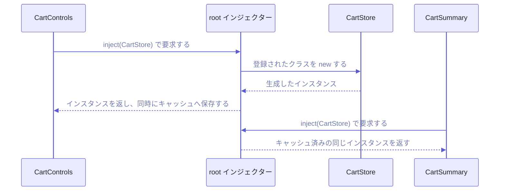
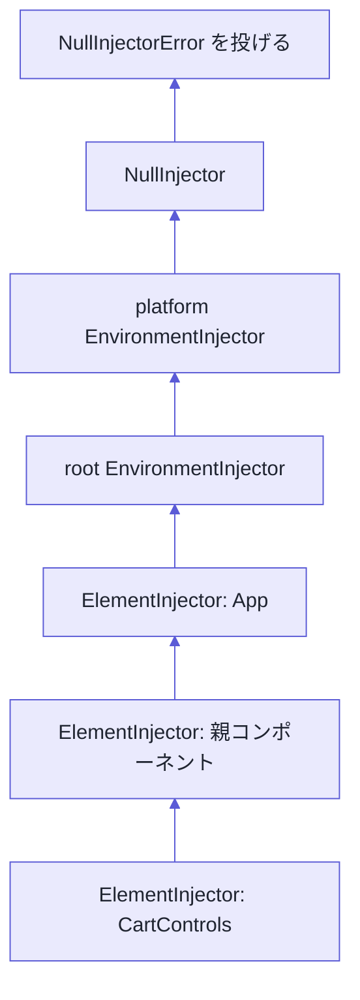
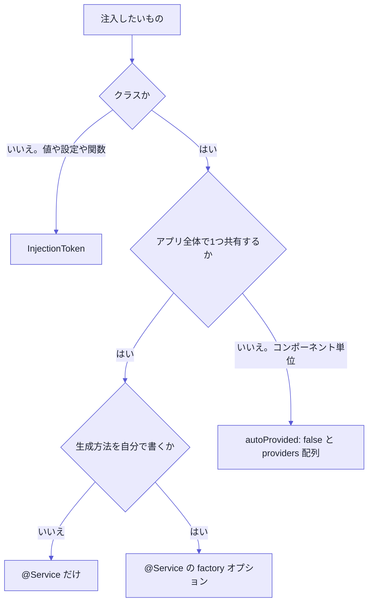

TypeScriptでクラスを使うときは、まずインスタンスを作ります。

```ts
const store = new CartStore();
store.increment();
```

ところがAngularのコンポーネントでは、この`new`をどこにも書きません。

```ts
export class CartControls {
  private readonly store = inject(CartStore);
}
```

それでも`store`には`CartStore`のインスタンスが入っています。しかも別のコンポーネントで同じように`inject(CartStore)`と書くと、そちらへ渡るのは同じインスタンスです。片方で数量を増やすと、もう一方の表示も変わります。

誰が、いつ作っているのか。作ったあと、それはどこに置かれているのか。

私はここを分からないまま数か月使っていました。動くので困らないんです。困るのは、状態が共有されると思っていたServiceが共有されていなかった日でした。

答えを持っているのはインジェクターです。

`inject()`は「作って」という命令ではありません。「**このトークンに対応するインスタンスをください**」という要求です。受け取ったインジェクターが、必要なら生成し、すでに持っていればそれを返す。

つまり`new`は消えていません。呼ぶ場所が、こちらからインジェクターへ移っただけです。

DIという考え方そのものは、Angularに限った話ではありません。フレームワークに依存しない仕組みは、別記事『DIとは？依存関係の注入をわかりやすく理解する』で扱っています。ここではAngular 22を前提に、`@Service()`と`inject()`を書いたとき、インスタンスがどこで生まれ、どの範囲で共有されるのかを追います。依存が見つからない場合の探索経路も確認します。

題材は小さな買い物カゴです。数量を持つ`CartStore`と、それを使う2つのコンポーネントだけで話を進めます。

## デコレーター1つで、クラスが「名前」になる

Angular 22で`@Service()`デコレーターが追加されました。`ng g service cart-store`で生成されるのも、いまはこの形です。

```ts:src/app/cart-store.ts
import { Service, signal } from '@angular/core';

@Service()
export class CartStore {
  private readonly _quantity = signal(0);
  readonly quantity = this._quantity.asReadonly();

  increment(): void {
    this._quantity.update((n) => n + 1);
  }
}
```

デコレーターを1つ付けただけで、`CartStore`は「注入できるもの」になります。正確には、`CartStore`というクラス自体が識別用の名前として、アプリのrootインジェクターへ登録されます。この識別用の名前をトークンと呼びます。

トークンといっても、ここでは`CartStore`というクラスそのものです。`inject(CartStore)`で渡しているのは型ではなく、実行時に存在するクラスオブジェクトです。インジェクターはこの値を鍵にしてインスタンスを探します。

### 従来の`@Injectable({ providedIn: 'root' })`との対応

Angular 21以前は、同じことを次のように書いていました。

```ts
@Injectable({ providedIn: 'root' })
export class CartStore {}
```

この2つはほぼ同じ意味です。`@Service()`は既定で`providedIn: 'root'`相当、つまりアプリ全体で共有される1つのインスタンスとして振る舞います。

追加された理由は、Angularチームのプルリクエストに書かれています。`@Injectable`はAngularの初期から存在するため多くの荷物を抱えており、「アプリ全体で使えるシングルトンのServiceを定義したい」という大多数の用途に対して余計なオーバーヘッドになっていた、という説明です。

| 書き方 | 位置づけ |
| --- | --- |
| `@Service()` | Angular 22以降の既定。アプリ全体のシングルトン |
| `@Injectable({ providedIn: 'root' })` | 従来の書き方。非推奨ではない |
| `@Injectable({ providedIn: 'platform' })` | 特殊なスコープ。今後も`@Injectable`を使う |

`@Injectable`が消えるわけではありません。`ng g service`に`--injectable`フラグを付ければ従来の形も生成されますし、`providedIn: 'platform'`のような特殊なスコープには今後も`@Injectable`を使います。既存コードを急いで書き換える必要もありません。

### コンストラクター注入は、もう使えない

`@Service()`には制約が1つあります。依存を受け取る手段が`inject()`関数だけに絞られており、コンストラクターの引数で受け取る古い書き方は使えません。

```ts
@Service()
export class CartStore {
  // これはエラーになる
  constructor(private readonly http: HttpClient) {}
}
```

依存が必要なら、フィールド初期化子で`inject()`を呼びます。

```ts:src/app/cart-store.ts
@Service()
export class CartStore {
  private readonly http = inject(HttpClient);
  // 数量を持つフィールドは変わらない
}
```

制約に見えますが、書き方が1つに決まるぶん扱いやすくなっています。

### オプションは`autoProvided`と`factory`の2つだけ

`@Service()`が受け取るオプションは2つです。

- `autoProvided: false` — 自動的な提供をやめ、自分で`providers`配列へ登録する
- `factory` — インスタンスの生成方法を差し替える関数

それぞれの使い方は後の節で扱います。

## インスタンスが作られるのは最初に注入されたとき

登録は済みました。では生成はいつ起きるのでしょうか。コンストラクターに`console.log`を1行足せば観測できます。

```ts:src/app/cart-store.ts
import { Service, signal } from '@angular/core';

@Service()
export class CartStore {
  private readonly _quantity = signal(0);
  readonly quantity = this._quantity.asReadonly();

  constructor() {
    console.log('CartStore を生成しました');
  }

  increment(): void {
    this._quantity.update((n) => n + 1);
  }
}
```

このServiceを2つのコンポーネントから使います。片方が数量を増やし、もう片方が数量を表示します。

```ts:src/app/cart-controls.ts
@Component({
  selector: 'app-cart-controls',
  template: `<button (click)="add()">カゴに入れる</button>`,
})
export class CartControls {
  private readonly store = inject(CartStore);

  add(): void {
    this.store.increment();
  }
}
```

```ts:src/app/cart-summary.ts
@Component({
  selector: 'app-cart-summary',
  template: `<p>カゴの中身: {{ quantity() }}点</p>`,
})
export class CartSummary {
  private readonly store = inject(CartStore);

  protected readonly quantity = this.store.quantity;
}
```

両方を画面に置いて動かすと、コンソールに出るログは1行だけです。`inject(CartStore)`は2か所にありますが、生成は1回しか起きません。

ボタンを押すと、`CartSummary`の表示も増えます。2つのコンポーネントは互いを知らないのに、同じ数量を見ています。同じインスタンスを共有しているからです。

インジェクターの仕事はここに集約されています。最初の要求で生成し、そのインスタンスを内部のキャッシュへ保存する。2回目以降の要求には、生成せずにキャッシュから返す。次の図では、`CartControls`が先に注入し、`CartSummary`が後から注入する順序を追ってください。



生成が最初の要求まで遅れる点にも意味があります。起動時に登録済みのServiceを一斉に作るわけではないので、一度も生成されないServiceが残ることもあります。一度も注入されないServiceは、本番ビルドのバンドルからも除外されます。登録しただけで容量を食うことはありません。

## 自分で `new` すると、何を失うか

仕組みが分かると、自分で`new`しても結果は同じでは、という気がしてきます。

```ts
// 避けたい形
export class CartControls {
  private readonly store = new CartStore();
}
```

このコードはコンパイルできます。動きもします。それでも困ることが3つ出てきます。

まず、共有が壊れます。`CartControls`と`CartSummary`がそれぞれ`new CartStore()`と書けば、インスタンスは2つできます。ボタンを押しても表示は動きません。シングルトンを保証していたのはインジェクターのキャッシュであって、クラスの書き方ではありません。

次に、依存の連鎖を末端まで自分でたどることになります。`CartStore`が`HttpClient`を使うようになったとしましょう。`new CartStore()`と書いた側は`HttpClient`のインスタンスを用意しなければならず、その`HttpClient`もまた別のものを必要とします。依存が1段増えるたびに、呼び出し側のコードを直す作業が発生します。`inject(CartStore)`なら、`CartStore`の内部で何を注入していても呼び出し側は無関係です。

### テストで差し替えられなくなる

3つ目が差し替えです。実際に効いてくるのはここです。

`inject(CartStore)`と書いたコンポーネントは、`CartStore`というトークンを要求しているだけで、どのインスタンスが返るかを決めていません。決めるのはインジェクターです。だからテストでは、同じトークンに別の実装を登録できます。

```ts:src/app/cart-summary.spec.ts
class FakeCartStore {
  readonly quantity = signal(3);
  increment(): void {}
}

it('カゴの点数を表示する', () => {
  TestBed.configureTestingModule({
    providers: [{ provide: CartStore, useClass: FakeCartStore }],
  });

  const fixture = TestBed.createComponent(CartSummary);
  fixture.detectChanges();

  expect(fixture.nativeElement.textContent).toContain('3点');
});
```

`CartSummary`のコードは1文字も変わっていません。`CartStore`というトークンに対する登録内容だけを差し替えました。テスト用のクラスがHTTPを呼ばなければ、通信を伴わないテストになります。

対して`new CartStore()`と書いたコンポーネントには、外から手を入れる余地がありません。テストのためにコンポーネント自身を書き換えるか、`CartStore`の中にモック用の分岐を持つしかなくなります。どちらも本番のコードをテストのために歪めます。

`new`を書かない理由は、記法の好みではありません。生成の決定権を呼び出し側から取り上げ、インジェクターへ預けるためです。見返りに、共有、依存の解決、差し替えの3つが手に入ります。

## 見つからないときインジェクターは階層を上る

`inject(CartStore)`を受けたインジェクターが、そのトークンを知らなかったらどうなるのでしょうか。すぐに諦めるわけではありません。親へ問い合わせます。

Angularのインジェクターには2つの系統があります。

1つはEnvironmentInjectorの階層です。`bootstrapApplication()`が`ApplicationConfig`から作るrootのEnvironmentInjectorがあり、その親としてplatformのEnvironmentInjectorがあります。さらにその上にNullInjectorが座っています。NullInjectorは何も持たないインジェクターで、ここへ到達したら探索は終わりです。

もう1つはElementInjectorの階層です。こちらはDOM要素ごとに暗黙に作られますが、`@Component`や`@Directive`の`providers`を設定しない限り中身は空のままです。

コンポーネントやディレクティブがトークンを要求すると、Angularは2段階で解決します。公式ガイドの説明では、まずElementInjector階層の親をたどり、次にEnvironmentInjector階層の親をたどります。次の図では、下から上へ探索が進む順序を見てください。



`@Service()`を付けたServiceが登録されるのはrootのEnvironmentInjectorです。図の下半分、つまりElementInjectorには何も置かれていません。だから探索はElementInjectorを素通りし、rootで見つかります。コンポーネントの深さに関係なく同じインスタンスが返るのは、このためです。

どこにも登録がなければ、探索はNullInjectorまで届いて例外になります。

```
NullInjectorError: No provider for UserClient!
Dependency path: App -> AuthClient -> UserClient
```

`Dependency path`の行を読んでください。`App`が`AuthClient`を注入し、その`AuthClient`が`UserClient`を注入しようとして失敗した、という連鎖が書かれています。エラーが出た場所は`App`ですが、直すべき場所は`UserClient`です。パスの右端が、登録されていないトークンです。

## 共有範囲を狭めたいとき

アプリ全体で1つ、という既定が合わない場合もあります。たとえばカゴを複数のタブで独立して持ちたい、あるいは編集フォームごとに下書きの状態を分けたい場合です。

コンポーネントの`providers`にクラスを書くと、そのコンポーネント用のElementInjectorへ登録されます。

```ts:src/app/cart-panel.ts
@Component({
  selector: 'app-cart-panel',
  providers: [CartStore],
  template: `
    <app-cart-controls />
    <app-cart-summary />
  `,
})
export class CartPanel {}
```

こう書くと、`CartPanel`とその子孫が`inject(CartStore)`したときは、ElementInjector側で先に見つかります。rootまで上がりません。`app-cart-panel`を画面に2つ置けば、`CartStore`のインスタンスも2つになります。

寿命も変わります。rootに登録されたインスタンスはアプリが動いているあいだ生き続けますが、コンポーネントの`providers`に置いたインスタンスは、そのコンポーネントが破棄されるときに一緒に捨てられます。タブを閉じれば下書きも消える、という挙動を自然に書けます。

### 自動提供を止めるのが`autoProvided: false`

ここで1つ気をつける点があります。`@Service()`は既定でrootへ自動登録されるので、上の例は「rootにも1つ、`CartPanel`ごとに1つ」という状態です。使われないインスタンスがrootに残るかもしれません。

コンポーネント単位でしか使わないと決めているなら、自動提供を切ります。

```ts:src/app/cart-store.ts
@Service({ autoProvided: false })
export class CartStore {
  private readonly _quantity = signal(0);
  readonly quantity = this._quantity.asReadonly();

  increment(): void {
    this._quantity.update((n) => n + 1);
  }
}
```

`autoProvided: false`にすると、rootへの登録がなくなります。`providers`配列へ書いた場所だけで注入できます。書き忘れると`NullInjectorError`になりますが、これは望ましい失敗です。意図しない場所からの注入が、実行時にすぐ分かります。

### `factory`は生成方法そのものを差し替える

もう1つのオプションが`factory`です。インスタンスをどう作るかを、関数として自分で書けます。公式ガイドは、設定によって実装を切り替える例を挙げています。

```ts
@Service({
  factory: () => (inject(ANALYTICS_ENABLED) ? new GoogleAnalytics() : new Analytics()),
})
export class Analytics {
  track(event: string, payload?: Record<string, unknown>) {
    // No-op by default.
  }
}
```

`Analytics`というトークンで注入すると、`ANALYTICS_ENABLED`の値に応じて`GoogleAnalytics`か何もしない`Analytics`のどちらかが返ります。利用側のコードは`inject(Analytics)`のままです。ファクトリ関数の実行中は注入コンテキストなので、必要な依存をその場で`inject()`できます。

`@Injectable`の時代に使い分けていた`useClass`、`useValue`、`useExisting`、`useFactory`は、`factory`という1つの関数へまとまりました。別のクラスを返せば`useClass`、固定のオブジェクトを返せば`useValue`、`inject()`した別のトークンを返せば`useExisting`に相当します。

## `inject()`が使えるのは注入コンテキストの中だけ

`inject()`はどこでも呼べる関数ではありません。呼び出した瞬間に「いまどのインジェクターが仕事をしているか」が分かる状態でなければ、要求の宛先が決まりません。この状態を注入コンテキストと呼びます。

`inject()`が許されるのは次の4か所です。

1. DIが生成するクラスのコンストラクターの実行中
2. そのクラスのフィールド初期化子
3. `useFactory`のファクトリ関数、および`InjectionToken`の`factory`
4. `runInInjectionContext(injector, () => ...)`に渡した関数の中

このうち日常的に使うのは2番で、現在の推奨もフィールド初期化子での呼び出しです。コンテキストの外で呼ぶと`NG0203`になります。メソッドの中やライフサイクルフックの中は対象外です。

```ts
export class CartSummary {
  private store!: CartStore;

  ngOnInit(): void {
    // NG0203 になる
    this.store = inject(CartStore);
  }
}
```

公式ドキュメントの案内は簡潔です。`inject`の呼び出しを許された場所へ移せば直る、たいていはクラスのコンストラクターかフィールド初期化子だ、と書かれています。フィールド初期化子はコンストラクターより前に評価されるので、コンストラクターの中で依存を使いたい場合もそのまま動きます。

どうしてもメソッドの中で解決したい場合は、`Injector`を注入しておき、`runInInjectionContext()`で囲みます。テストでは`TestBed.runInInjectionContext`が同じ役割を果たします。

もう1つ覚えておきたいのが`optional`です。`inject(Logger, { optional: true })`と書くと、登録が見つからないときに例外を投げず`null`が返ります。任意の機能を差し込めるようにしておきたいときに使います。

## クラス以外の値には`InjectionToken`で名前を付ける

ここまではクラスを注入してきました。クラス自身が名前になるので、トークンを別に用意する必要はありません。

ところが注入したいものは、いつもクラスとは限りません。APIのベースURL、機能フラグ、設定オブジェクト、単なる関数を配りたい場合もあります。文字列や真偽値には名前になれるだけの個性がないので、専用のトークンを作ります。

```ts:src/app/cart-config.ts
import { InjectionToken } from '@angular/core';

export interface CartConfig {
  readonly maxQuantity: number;
}

export const CART_CONFIG = new InjectionToken<CartConfig>('CART_CONFIG', {
  providedIn: 'root',
  factory: () => ({ maxQuantity: 10 }),
});
```

利用側はクラスと同じように書きます。

```ts
private readonly config = inject(CART_CONFIG);
```

`InjectionToken`を使うときに気をつけたいのが、識別の方法です。インジェクターが鍵にするのはオブジェクトの参照そのもので、名前の文字列は見ていません。コンストラクターへ渡した`'CART_CONFIG'`は、デバッグ時に読みやすくするためのラベルにすぎません。同じ文字列で2つのトークンを作れば、それは別々のトークンになります。だからトークンは1か所で`export`し、使う側はそれを`import`します。

上の例で渡している`providedIn: 'root'`と`factory`を書いておくと、一度も注入されなければバンドルから消えるトークンになります。クラスの`@Service()`と同じ性質です。

なお、同じトークンに`multi: true`で複数の値を登録すると、注入側は配列として受け取ります。HTTPインターセプターのように「登録された分だけ順に適用する」仕組みに向いています。

## 結局、どれを選ぶか

ここまでに出てきた選択肢を整理します。分岐は2つだけです。アプリ全体で共有するか、そして生成方法を自分で書くか。



表にすると次のようになります。

| やりたいこと | 書き方 | インスタンスの数 | 寿命 |
| --- | --- | --- | --- |
| アプリ全体で状態や処理を共有する | `@Service()` | 1つ | アプリと同じ |
| コンポーネントごとに分ける | `@Service({ autoProvided: false })`とコンポーネントの`providers` | コンポーネントの数だけ | コンポーネントと同じ |
| 条件で実装を切り替える | `@Service({ factory })` | 1つ | アプリと同じ |
| クラス以外の値を配る | `InjectionToken` | 登録した数だけ | 登録した場所に従う |
| テストで実装を差し替える | `TestBed`の`providers`に`useClass`や`useValue` | テストごとに1つ | テストと同じ |
| 特殊なスコープを指定する | `@Injectable({ providedIn: 'platform' })` | スコープごとに1つ | スコープと同じ |

迷ったときは、共有したい範囲から考えます。範囲がアプリ全体なら`@Service()`だけで足ります。範囲が画面やコンポーネントなら、そのコンポーネントの`providers`へ置きます。範囲を決めるのが先で、書き方は後から決まります。

## 症状別のトラブルシュート

DIの不具合は、エラーメッセージを読めばかなり絞り込めます。よく出る3つを挙げます。

### NullInjectorError: No provider for ...

```
NullInjectorError: No provider for UserClient!
Dependency path: App -> AuthClient -> UserClient
```

探索がNullInjectorまで到達したときのエラーです。`Dependency path`の右端にあるトークンが、どこにも登録されていません。

確認は3つです。そのクラスに`@Service()`か`@Injectable({ providedIn: 'root' })`が付いているか。`autoProvided: false`を指定しているなら、注入したいコンポーネントの`providers`に書き忘れていないか。`InjectionToken`なら`import`元が正しいか。同名のトークンを2か所で作っていると、型は通るのに実行時に見つかりません。

登録がないことを想定した設計なら、`inject(Token, { optional: true })`へ変えます。

### NG0203: inject() must be called from an injection context

```
NG0203: inject() must be called from an injection context
```

`inject()`を注入コンテキストの外で呼んだときに出ます。よくある場所は`ngOnInit()`、イベントハンドラー、`setTimeout()`のコールバック、`async`関数の`await`より後ろです。

直し方は、`inject()`をフィールド初期化子かコンストラクターへ移すことです。処理のタイミングを遅らせたい事情があるなら、`Injector`を先に注入しておき、必要な場所を`runInInjectionContext()`で囲みます。

### NG0200: Circular dependency in DI detected

```
NG0200: Circular dependency in DI detected for AuthClient
Dependency path: AuthClient -> UserClient -> AuthClient
```

AがBを注入し、BがAを注入している状態です。生成が終わらないので、インジェクターは循環を検出して止めます。

パスの両端が同じトークンになっている点を見てください。多くの場合、2つのServiceが担う責務の境界がずれています。共通部分を第3のServiceへ切り出すか、依存の向きを一方通行に直します。`optional: true`で例外だけを消しても、片方の依存が`null`になるだけで設計は直りません。

### エラーは出ないのに状態が共有されない

登録場所を疑います。コンポーネントの`providers`に書いたクラスは、そのコンポーネントの数だけインスタンスができます。共有したいServiceを`providers`へ書いていないか確認してください。

Angular DevToolsにはインジェクターツリーを表示する機能があります。どの階層にどのプロバイダーが登録されているか、インスタンスが複数できていないかを目で確認できます。

## 見る場所は、トークンの登録先ひとつ

- `@Service()`を付けると、そのクラス自体がトークンとしてrootのインジェクターへ登録されます。Angular 22の`ng g service`が生成する既定の形です
- `@Service()`はコンストラクター注入を使えません。依存はフィールド初期化子の`inject()`で受け取ります。オプションは`autoProvided`と`factory`の2つだけです
- インスタンスが作られるのは最初に`inject()`された瞬間です。以降はインジェクターのキャッシュから同じインスタンスが返ります
- `new`を書かない理由は、共有の保証、依存の自動解決、テストでの差し替えを手放さないためです
- 見つからないとき、探索はElementInjectorからEnvironmentInjectorへ、最後はNullInjectorまで上ります。`Dependency path`の右端が原因のトークンです
- 共有範囲を狭めるなら`autoProvided: false`と`providers`、生成方法を変えるなら`factory`、クラス以外の値なら`InjectionToken`を使います

冒頭の「共有されているはずのServiceが共有されていなかった」に戻ります。

原因は単純でした。そのServiceを、コンポーネントの`providers`に書いていたんです。書いた覚えはあったのに、それが**インスタンスの置き場所を変える宣言**だとは思っていませんでした。

`inject(CartStore)`という1行は、生成をインジェクターへ委ねる宣言です。誰がいつ作るかを手放す代わりに、共有範囲と差し替えの自由を受け取っている。

だからServiceの挙動が読めなくなったら、見る場所は1つです。

**そのトークンは、どのインジェクターに登録されているか。**

答えは、ほとんどそこにあります。

## 参考資料

- [Angular: Dependency injection](https://angular.dev/guide/di)
- [Angular: Creating and using services](https://angular.dev/guide/di/creating-and-using-services)
- [Angular: Defining dependency providers](https://angular.dev/guide/di/defining-dependency-providers)
- [Angular: Dependency injection context](https://angular.dev/guide/di/dependency-injection-context)
- [Angular: Hierarchical injectors](https://angular.dev/guide/di/hierarchical-dependency-injection)
- [Angular: Debugging and troubleshooting DI](https://angular.dev/guide/di/debugging-and-troubleshooting-di)
- [Angular: Service](https://angular.dev/api/core/Service)
- [Angular: inject](https://angular.dev/api/core/inject)
- [Angular: NG0203](https://angular.dev/errors/NG0203)
