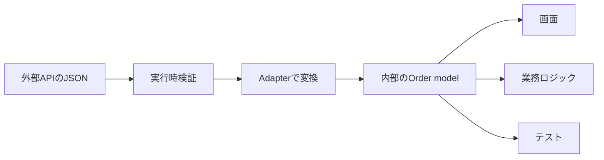

外部APIやlocalStorageのデータは、アプリ内部で使いたい形と一致するとは限りません。snake_case、null許容な値、文字列の日付、APIバージョンごとの違いをそのまま内部へ持ち込むと、画面や業務ロジックの至る所に変換処理が散ります。

Adapterパターンは、外部の契約を境界で受け取り、内部が理解する契約へ変換します。単なるキー名の置換ではなく、外部仕様の違いをどこまで内部へ見せるかを決める設計です。

DTO（Data Transfer Object）は、APIなどの境界を越えてデータを受け渡すための形式です。この記事では、APIレスポンスの形を表す `OrderDto` と、アプリ内部で使う `Order` を分けます。コード例はこの変換へ焦点を当て、HTTPクライアントなどの補助定義は省略します。

## 外部DTOをそのまま使うと、変更が内部へ伝播する

注文APIが次のJSONを返すとします。

```json
{
  "order_id": "order-42",
  "total_cents": 120000,
  "currency": "USD",
  "ordered_at": "2026-07-19T10:00:00Z",
  "status": "paid"
}
```

画面側が `order.total_cents / 100` を行い、別の処理が `new Date(order.ordered_at)` を行うと、外部形式の知識がアプリ全体へ広がります。APIの金額単位やフィールド名が変わったとき、利用箇所をすべて探さなければなりません。



Adapterを境界へ置くと、内部は一度決めたモデルだけを扱えます。

## DTOと内部モデルを別の型として定義する

```ts
type OrderDto = {
  order_id: string;
  total_cents: number;
  currency: "USD";
  ordered_at: string;
  status: "pending" | "paid" | "cancelled";
};

type Order = {
  id: string;
  total: { amount: number; currency: "USD" };
  orderedAt: Date;
  status: "pending" | "paid" | "cancelled";
};

function toOrder(dto: OrderDto): Order {
  return {
    id: dto.order_id,
    total: {
      amount: dto.total_cents / 100,
      currency: dto.currency,
    },
    orderedAt: new Date(dto.ordered_at),
    status: dto.status,
  };
}
```

型を分けることで、どこからどこまでが外部仕様か明確になります。`OrderDto` は通信形式を正確に表し、`Order` はアプリ内の意味を表します。

この変換は、次の3段階で読むと混同しません。

| 段階 | 扱う値 | ここで決めること |
| --- | --- | --- |
| APIから受信 | 型がまだ分からないJSON | 信頼せず `unknown` として受け取る |
| スキーマ検証後 | `OrderDto` | 必須キー、型、許可する通貨・状態を確認する |
| Adapter変換後 | `Order` | キー名、金額単位、日時型を内部表現へ変える |

`OrderDtoSchema.parse` が成功しても、`total_cents` はまだセント単位で、`ordered_at` も文字列です。`toOrder` を通した後に初めて、金額はドル単位の `amount` となり、日時は `Date` になります。検証済みであることと、内部で使いやすい形になったことは別です。

金額の変換には注意が必要です。この例では米ドルのcentをdollarへ変換しています。通貨によって小数桁は異なるため、実際の契約に合わせて最小通貨単位の整数を保つか、通貨を含むMoney型を使うかを決めてください。

## TypeScriptの型だけでは外部入力を検証できない

`response.json() as OrderDto` と書いても、実行時のデータは変わりません。APIが `total_cents: "120000"` を返しても、TypeScriptは実行時に検出できません。

外部入力は、Adapterへ渡す前にスキーマで検証します。以下は検証ライブラリを使う想定の形です。

```ts
const OrderDtoSchema = z.object({
  order_id: z.string().min(1),
  total_cents: z.number().int().nonnegative(),
  currency: z.literal("USD"),
  ordered_at: z.string().datetime(),
  status: z.enum(["pending", "paid", "cancelled"]),
});

async function fetchOrder(id: string): Promise<Order> {
  const response = await fetch(`/api/orders/${id}`);
  if (!response.ok) throw new Error(`HTTP ${response.status}`);

  const json: unknown = await response.json();
  const dto = OrderDtoSchema.parse(json);
  return toOrder(dto);
}
```

検証と変換は似ていますが役割が違います。検証は入力が外部契約を満たすか確認し、変換は有効な外部データを内部の意味へ写します。両方を1つの巨大な関数へ混ぜると、失敗理由が分かりにくくなります。

## 変換時に「意味」を決める

Adapterで判断が必要になるのは、名前の変換より、外部値と内部値の意味が一致しない場面です。

| 外部の表現 | Adapterで決めること |
| --- | --- |
| `null` | 不明、未設定、空のどれか |
| 日時文字列 | タイムゾーンを含む瞬間か、地域の時刻か |
| 数値コード | 内部の列挙型へどう対応するか |
| 欠落フィールド | 既定値を補うか、エラーにするか |
| 廃止済みの値 | 互換値へ移すか、拒否するか |

たとえば `display_name: null` を空文字列へ変えると、「名前が未設定」と「名前を空にした」を区別できなくなります。内部でその違いが必要なら、無理に同じ値へ潰しません。

Adapterはデータをきれいにする場所ではなく、境界を越えるときの意味を決める場所です。その判断はテストとコメントで残す価値があります。

## 変換のテストは代表例と境界値を固定する

```ts
describe("toOrder", () => {
  it("外部DTOを内部modelへ変換する", () => {
    const dto: OrderDto = {
      order_id: "order-42",
      total_cents: 120_000,
      currency: "USD",
      ordered_at: "2026-07-19T10:00:00Z",
      status: "paid",
    };

    expect(toOrder(dto)).toEqual({
      id: "order-42",
      total: { amount: 1_200, currency: "USD" },
      orderedAt: new Date("2026-07-19T10:00:00Z"),
      status: "paid",
    });
  });
});
```

キー名が合うことだけでなく、単位、日時、null許容値、未知の列挙型値を確認します。変換規則の変更が業務上の意味を変えるなら、単なるスナップショット更新で済ませず、期待値を読み直します。

実行時検証のテストと変換のテストは分けると、外部形式が不正なのか、変換規則が誤っているのかを切り分けられます。

## 書き込み方向も別のAdapterとして考える

内部モデルをAPIへ送るときも変換が必要です。

```ts
type CreateOrderRequest = {
  items: Array<{
    product_id: string;
    quantity: number;
  }>;
};

function toCreateOrderRequest(input: CreateOrderInput): CreateOrderRequest {
  return {
    items: input.items.map((item) => ({
      product_id: item.productId,
      quantity: item.quantity,
    })),
  };
}
```

読み取りと書き込みを1つの双方向変換へまとめても、実際のAPI契約は対称とは限りません。レスポンスと作成リクエストは項目も責務も違うことが多いため、方向ごとに関数を分ける方が明確です。

## APIバージョン差を境界へ閉じ込める

旧APIと新APIが一時的に共存する場合、利用側でバージョン分岐を繰り返さないようにします。

```ts
function adaptOrder(input: unknown, version: "v1" | "v2"): Order {
  switch (version) {
    case "v1":
      return fromV1Order(V1OrderSchema.parse(input));
    case "v2":
      return fromV2Order(V2OrderSchema.parse(input));
  }
}
```

内部モデルを1つに保てれば、移行中も画面や業務ロジックを二重化せずに済みます。ただし、v1とv2で意味そのものが違う場合、無理に同じモデルへ押し込むと情報を失います。共通化する範囲を見直し、別のユースケースとして扱う判断も必要です。

## オブジェクトAdapterが向く場面

変換だけなら関数で十分です。APIクライアント、設定、キャッシュなどの依存を持ち、複数の操作を同じ境界で提供するならクラスやオブジェクトが自然です。

```ts
class OrderApiAdapter implements OrderGateway {
  constructor(
    private readonly client: HttpClient,
    private readonly baseUrl: string,
  ) {}

  async find(id: string): Promise<Order> {
    const json = await this.client.get(`${this.baseUrl}/orders/${id}`);
    return toOrder(OrderDtoSchema.parse(json));
  }

  async create(input: CreateOrderInput): Promise<Order> {
    const json = await this.client.post(
      `${this.baseUrl}/orders`,
      toCreateOrderRequest(input),
    );
    return toOrder(OrderDtoSchema.parse(json));
  }
}
```

利用側はHTTP、URL、JSONの形を知らず、`OrderGateway` だけを使います。ここまで責務があるなら、単発の変換関数よりオブジェクトAdapterの方が境界を表しやすくなります。

## Adapterが必要かを見極める

| 直接使ってよい | Adapterを置く価値が高い |
| --- | --- |
| 外部と内部の形・意味が同じ | 命名、単位、nullの意味が違う |
| 利用箇所が1か所 | 複数の機能から使う |
| 外部仕様が安定している | バージョン移行や変更が多い |
| 変換が1行で明白 | 実行時検証や業務判断が必要 |

変換関数を作るだけでもAdapterの役割を果たせます。パターン名に合わせてクラスやインターフェースを増やす必要はありません。

Adapterの価値は、外部データを内部で使える形へ整えることだけではありません。外部仕様の知識を境界に集め、内部コードが業務上の言葉で書けるようにすることです。変換箇所が散り始めたら、名前・単位・日時・欠損値の意味を1か所で決められないか検討してください。

## 参考資料

- [Refactoring.Guru: Adapter](https://refactoring.guru/design-patterns/adapter)
- [TypeScript Handbook: The unknown Type](https://www.typescriptlang.org/docs/handbook/2/functions.html#unknown)
- [Zod Documentation](https://zod.dev/)
