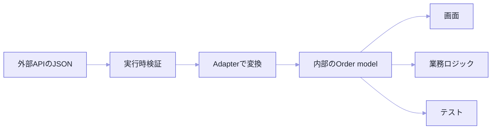

`order.total_cents / 100`

この式が、私のプロジェクトには11か所ありました。APIの金額単位がセントで返ってくるので、表示のたびに100で割っていたんです。

そしてある日、APIが金額を最小通貨単位ではなく小数で返すようになりました。11か所を探して回りました。

外部APIやlocalStorageのデータは、アプリの中で使いたい形と一致しません。snake_case、null許容、文字列の日付、バージョンごとの差。そのまま持ち込むと、変換処理が画面や業務ロジックの隅々まで散らばります。

Adapterパターンは、外部の契約を境界で受け取って、内部が理解する契約へ変換します。ただ、キー名を置き換える作業ではありません。**外部仕様の違いを、どこまで内部に見せるかを決める設計**です。

なお、DTO（Data Transfer Object）は境界を越えてデータを受け渡すための形式のことです。この記事ではAPIレスポンスを表す `OrderDto` と、内部で使う `Order` を分けます。コードは変換に集中するため、HTTPクライアントなどは省略しました。

## 外部の形が、そのまま内部の形になっている

注文APIがこのJSONを返すとします。

```json
{
  "order_id": "order-42",
  "total_cents": 120000,
  "currency": "USD",
  "ordered_at": "2026-07-19T10:00:00Z",
  "status": "paid"
}
```

画面が `order.total_cents / 100` を書き、別の処理が `new Date(order.ordered_at)` を書く。この時点で、外部形式の知識がアプリ全体に染み出しています。

フィールド名か金額単位が1つ変わったら、利用箇所を全部探すことになります。冒頭の11か所です。



Adapterを境界に置けば、内部は一度決めたモデルだけを見ていられます。

## 型を2つに分ける

```ts
type OrderDto = {
  order_id: string;
  total_cents: number;
  currency: "USD";
  ordered_at: string;
  status: "pending" | "paid" | "cancelled";
};

type Order = {
  id: string;
  total: { amount: number; currency: "USD" };
  orderedAt: Date;
  status: "pending" | "paid" | "cancelled";
};

function toOrder(dto: OrderDto): Order {
  return {
    id: dto.order_id,
    total: {
      amount: dto.total_cents / 100,
      currency: dto.currency,
    },
    orderedAt: new Date(dto.ordered_at),
    status: dto.status,
  };
}
```

型を分けた瞬間に、どこまでが外部仕様なのかが見えるようになります。`OrderDto` は通信の形を正確に写したもの。`Order` はアプリの中での意味を表したもの。

流れは3段階で読むと混ざりません。

| 段階 | 扱う値 | ここで決めること |
| --- | --- | --- |
| APIから受信 | 型がまだ分からないJSON | 信頼せず `unknown` として受け取る |
| スキーマ検証後 | `OrderDto` | 必須キー、型、許可する通貨・状態を確認する |
| Adapter変換後 | `Order` | キー名、金額単位、日時型を内部表現へ変える |

見落としやすいのが2段目です。`OrderDtoSchema.parse` が通っても、`total_cents` はまだセントのままですし、`ordered_at` も文字列のままです。

**検証済みであることと、内部で使いやすい形であることは、別の話です。**

金額の変換には一言添えておきます。この例では米ドルのcentをdollarに直していますが、小数桁は通貨ごとに違います。実際の契約に合わせて、最小通貨単位の整数を保つのか、通貨を含んだMoney型にするのかを決めてください。

## 型注釈は、実行時には何もしない

`response.json() as OrderDto` と書いても、届いたデータは1バイトも変わりません。

APIが `total_cents: "120000"` と文字列で返してきても、TypeScriptは何も言わずに通します。そして計算のどこかで、静かにおかしくなります。

外部入力は、Adapterへ渡す前に検証します。

```ts
const OrderDtoSchema = z.object({
  order_id: z.string().min(1),
  total_cents: z.number().int().nonnegative(),
  currency: z.literal("USD"),
  ordered_at: z.string().datetime(),
  status: z.enum(["pending", "paid", "cancelled"]),
});

async function fetchOrder(id: string): Promise<Order> {
  const response = await fetch(`/api/orders/${id}`);
  if (!response.ok) throw new Error(`HTTP ${response.status}`);

  const json: unknown = await response.json();
  const dto = OrderDtoSchema.parse(json);
  return toOrder(dto);
}
```

検証と変換は似て見えますが、役割が違います。検証は「外部の契約を満たしているか」を確認する。変換は「有効な外部データを内部の意味へ写す」。

これを1つの巨大な関数に混ぜると、失敗したときに何が悪かったのか分からなくなります。

## ここがAdapterの本番です

判断が要るのは、名前の付け替えではありません。外部と内部で**意味が一致しない**ときです。

| 外部の表現 | Adapterで決めること |
| --- | --- |
| `null` | 不明、未設定、空のどれか |
| 日時文字列 | タイムゾーンを含む瞬間か、地域の時刻か |
| 数値コード | 内部の列挙型へどう対応するか |
| 欠落フィールド | 既定値を補うか、エラーにするか |
| 廃止済みの値 | 互換値へ移すか、拒否するか |

たとえば `display_name: null` を空文字列に変換したとします。楽です。でもその瞬間、「名前が未設定」と「名前を空にした」の区別が永久に失われます。

内部でその違いが必要なら、同じ値に潰してはいけません。

Adapterはデータをきれいにする場所ではなく、**境界を越えるときの意味を決める場所**です。ここでの判断は、テストとコメントに残す価値があります。

## テストは代表例と、境界値

```ts
describe("toOrder", () => {
  it("外部DTOを内部modelへ変換する", () => {
    const dto: OrderDto = {
      order_id: "order-42",
      total_cents: 120_000,
      currency: "USD",
      ordered_at: "2026-07-19T10:00:00Z",
      status: "paid",
    };

    expect(toOrder(dto)).toEqual({
      id: "order-42",
      total: { amount: 1_200, currency: "USD" },
      orderedAt: new Date("2026-07-19T10:00:00Z"),
      status: "paid",
    });
  });
});
```

キー名が合っているかだけでなく、単位、日時、null、未知の列挙値。ここを見ます。

変換規則を変えたとき、それが業務上の意味を変えるなら、スナップショットの更新で済ませないでください。期待値を人間の目で読み直します。

実行時検証のテストと変換のテストは分けておくと、「外部の形が不正なのか」「変換規則が間違っているのか」を切り分けられます。

## 送る方向も、別の関数で

内部モデルをAPIへ送るときにも変換が要ります。

```ts
type CreateOrderRequest = {
  items: Array<{
    product_id: string;
    quantity: number;
  }>;
};

function toCreateOrderRequest(input: CreateOrderInput): CreateOrderRequest {
  return {
    items: input.items.map((item) => ({
      product_id: item.productId,
      quantity: item.quantity,
    })),
  };
}
```

読み書きを1つの双方向変換にまとめたくなりますが、API契約はたいてい対称ではありません。レスポンスと作成リクエストでは、項目も責務も違うことのほうが多い。

方向ごとに関数を分けたほうが、素直です。

## バージョン差は、境界で吸収する

旧APIと新APIが一時的に同居する時期があります。ここで利用側にバージョン分岐を書き始めると、移行が終わらなくなります。

```ts
function adaptOrder(input: unknown, version: "v1" | "v2"): Order {
  switch (version) {
    case "v1":
      return fromV1Order(V1OrderSchema.parse(input));
    case "v2":
      return fromV2Order(V2OrderSchema.parse(input));
  }
}
```

内部モデルが1つに保てれば、画面も業務ロジックも二重化せずに済みます。

ただし、v1とv2で意味そのものが変わっているなら話は別です。無理に同じモデルへ押し込むと情報が消えます。共通化する範囲を見直して、別のユースケースとして扱う判断も要ります。

## クラスにすべき場面

変換するだけなら、関数で足ります。

APIクライアント、設定、キャッシュといった依存を持って、複数の操作を同じ境界で提供する。そこまで来たらオブジェクトの出番です。

```ts
class OrderApiAdapter implements OrderGateway {
  constructor(
    private readonly client: HttpClient,
    private readonly baseUrl: string,
  ) {}

  async find(id: string): Promise<Order> {
    const json = await this.client.get(`${this.baseUrl}/orders/${id}`);
    return toOrder(OrderDtoSchema.parse(json));
  }

  async create(input: CreateOrderInput): Promise<Order> {
    const json = await this.client.post(
      `${this.baseUrl}/orders`,
      toCreateOrderRequest(input),
    );
    return toOrder(OrderDtoSchema.parse(json));
  }
}
```

利用側はHTTPもURLもJSONの形も知りません。`OrderGateway` だけを見ています。

## 置くべきか、置かなくていいか

| 直接使ってよい | Adapterを置く価値が高い |
| --- | --- |
| 外部と内部の形・意味が同じ | 命名、単位、nullの意味が違う |
| 利用箇所が1か所 | 複数の機能から使う |
| 外部仕様が安定している | バージョン移行や変更が多い |
| 変換が1行で明白 | 実行時検証や業務判断が必要 |

変換関数を1つ作るだけでも、Adapterの役目は果たせます。パターン名に合わせてクラスとインターフェースを揃える必要はありません。

---

冒頭の11か所に戻ります。

あれを直すのが大変だったのは、変換処理が多かったからではありませんでした。**外部仕様の知識が、内部のあちこちに住み着いていた**からです。

Adapterの価値は、データを内部で使える形に整えることだけではありません。外部仕様の知識を境界に集めて、**内部のコードを業務の言葉だけで書けるようにする**ことです。

変換が散り始めたと感じたら、そのタイミングです。名前・単位・日時・欠損値の意味を、1か所で決められないか考えてみてください。

## 参考資料

- [Refactoring.Guru: Adapter](https://refactoring.guru/design-patterns/adapter)
- [TypeScript Handbook: The unknown Type](https://www.typescriptlang.org/docs/handbook/2/functions.html#unknown)
- [Zod Documentation](https://zod.dev/)
