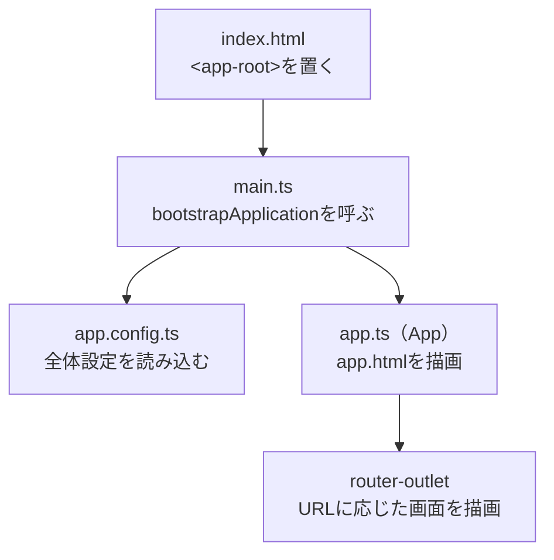
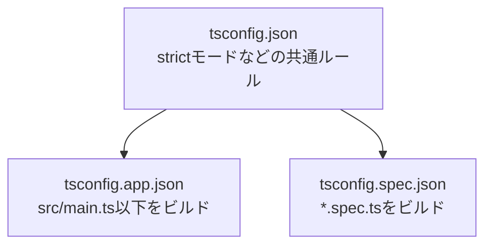

`ng new my-app`を実行すると、20を超えるファイルが一度に生成されます。

```text
my-app/
├── .vscode/
├── public/
├── src/
├── .editorconfig
├── .gitignore
├── angular.json
├── package.json
├── package-lock.json
├── README.md
├── tsconfig.app.json
├── tsconfig.json
└── tsconfig.spec.json
```

正直に言うと、最初に見たとき私は`tsconfig`が3つある時点で少し引きました。

最初に手を付けるのは`src/app/`の中だけです。残りは設定ファイルなので、必要になるまで開かなくても開発を始められます。

とはいえ、開かないファイルが何をしているか分からないままだと、エラーが出た瞬間に手が止まります。「どこを直せばいいのかが分からない」という止まり方です。

前提はAngular 22です。生成されたファイルを役割ごとに仕分けたうえで、ブラウザでURLを開いてから画面が表示されるまでの流れを追います。

## 3つの層に分けて読む

ファイルを上から順に眺めても、頭に入りません。「誰のためのファイルか」で3つに分けると整理できます。

| 層 | 場所 | 誰が読むか | 触る頻度 |
| --- | --- | --- | --- |
| アプリのコード | `src/app/` | あなたとチーム | 毎日 |
| 起動の土台 | `src/`直下、`public/` | ブラウザ、Angular | ときどき |
| 道具の設定 | ルート直下 | CLI、TypeScript、npm | まれ |

上から下へ行くほど、触る回数は減ります。そして下へ行くほど、壊れたときの影響が広くなります。

まずは毎日触る層から見ていきます。

## `src/app/` — アプリを作り込む場所

`ng new`直後の`src/app/`には、6つのファイルが入っています。

```text
src/app/
├── app.ts          … ルートComponentのクラス
├── app.html        … そのテンプレート
├── app.css         … そのスタイル
├── app.spec.ts     … そのテスト
├── app.config.ts   … アプリ全体の設定
└── app.routes.ts   … ルーティングの定義
```

前の4つはセットです。1つのComponentが、クラス・テンプレート・スタイル・テストの4ファイルに分かれています。残りの2つはアプリ全体に関わる設定です。

### `app.ts` — 最上位のComponent

```ts:src/app/app.ts
import { Component, signal } from '@angular/core';
import { RouterOutlet } from '@angular/router';

@Component({
  selector: 'app-root',
  imports: [RouterOutlet],
  templateUrl: './app.html',
  styleUrl: './app.css',
})
export class App {
  protected readonly title = signal('my-app');
}
```

`App`は、画面の一番外側に立つComponentです。これから作るすべての画面は、このComponentの内側に入ります。

`@Component`に渡している4つの設定を順に見ます。

`selector: 'app-root'`は、このComponentを呼び出すためのタグ名です。あとで`index.html`に`<app-root>`が出てきますが、そこと対応しています。

`imports: [RouterOutlet]`は、テンプレートの中で使う部品の宣言です。Angularでは、テンプレートで使う部品を各Componentが自分で宣言します。宣言し忘れると、`NG8001: 'router-outlet' is not a known element`のようなエラーが出ます。初心者が最もよく踏むエラーで、原因はたいてい`imports`への追加漏れです。

`templateUrl`と`styleUrl`は、HTMLとCSSを別ファイルに置く指定です。短いComponentなら、`template`と`styles`にその場で書くこともできます。

`title = signal('my-app')`は初期画面の表示に使われているだけなので、消して構いません。`signal()`はAngularが変化を追跡できる値で、詳しくは別記事『Angular Signals完全入門』で扱っています。

### `app.html` — ルートのテンプレート

`ng new`直後は、Angularのロゴや外部リンクが並んだ長いHTMLが入っています。最後の1行だけが本質です。

```html:src/app/app.html
<router-outlet></router-outlet>
```

`<router-outlet>`は、URLに応じた画面が差し込まれる穴です。`/users`を開けばユーザー一覧が、`/settings`を開けば設定画面が、この位置に描画されます。

初期画面のロゴが不要になったら、この1行を残して他は削除できます。

### `app.css` — このComponentだけのスタイル

`app.css`に書いたCSSは、`app.html`にしか効きません。あとで出てくる`src/styles.css`との違いがここにあります。

```css:src/app/app.css
h1 {
  color: crimson;
}
```

この`h1`は、`app.html`の中の`<h1>`だけを赤くします。他のComponentの`<h1>`には影響しません。Angularが、ビルド時に各要素へ固有の属性を付けてCSSを絞り込んでいるためです。

グローバルなCSSにありがちな「どこかのスタイルが意図せず効いてしまう」問題が起きにくくなっています。Componentごとに素直なセレクターを書けます。

### `app.spec.ts` — テスト

```ts:src/app/app.spec.ts
import { TestBed } from '@angular/core/testing';
import { App } from './app';

describe('App', () => {
  beforeEach(async () => {
    await TestBed.configureTestingModule({
      imports: [App],
    }).compileComponents();
  });

  it('should create the app', () => {
    const fixture = TestBed.createComponent(App);
    expect(fixture.componentInstance).toBeTruthy();
  });
});
```

`.spec.ts`で終わるファイルはテストです。`npm test`で実行され、ビルド成果物には含まれません。

`ng generate component`でComponentを作ると、`.spec.ts`も一緒に生成されます。最初は中身が「生成できること」を確かめるだけなので、書き足すのは自分の実装が入ってからで構いません。

:::message
Angular 21以降、新規プロジェクトのテストランナーはVitestです。それ以前はKarmaとJasmineでした。`describe`・`it`・`expect`を`import`せずに使えているのは、`tsconfig.spec.json`が型定義を読み込んでいるためです。
:::

### `app.config.ts` — アプリ全体の設定

```ts:src/app/app.config.ts
import { ApplicationConfig, provideBrowserGlobalErrorListeners } from '@angular/core';
import { provideRouter } from '@angular/router';
import { routes } from './app.routes';

export const appConfig: ApplicationConfig = {
  providers: [
    provideBrowserGlobalErrorListeners(),
    provideRouter(routes),
  ],
};
```

アプリ全体で使う機能を有効にする場所です。`providers`の配列に`provide〜`という関数を並べていきます。

`provideRouter(routes)`はルーティングを有効にします。`provideBrowserGlobalErrorListeners()`は、`window`の`error`と`unhandledrejection`を拾ってAngularのエラーハンドラーへ流す設定です。Angularの管理外で起きた例外を取りこぼさないために入っています。

HTTP通信を使いたくなったら、ここに`provideHttpClient()`を足します。アニメーションや国際化も同じ形です。「アプリ全体に1つあればいいもの」の登録先だと考えてください。

:::message
Angular 20以前に作られたプロジェクトでは、ここに`provideZonelessChangeDetection()`や`provideZoneChangeDetection()`が並んでいます。Angular 21からZonelessが既定になったため、新規プロジェクトでは書かなくてよくなりました。
:::

### `app.routes.ts` — URLと画面の対応表

```ts:src/app/app.routes.ts
import { Routes } from '@angular/router';

export const routes: Routes = [];
```

生成直後は空の配列です。画面を増やすたびに、URLとComponentの組を追加していきます。

```ts:src/app/app.routes.ts
import { Routes } from '@angular/router';

export const routes: Routes = [
  { path: '', component: Home },
  { path: 'users', component: UserList },
];
```

ここに書いたComponentが、`<router-outlet>`の位置に描画されます。

## 起動の流れを追う

ファイルの役割が分かったところで、これらがどうつながって画面になるかを見ます。



### `index.html` — ブラウザが最初に読むHTML

```html:src/index.html
<!doctype html>
<html lang="en">
  <head>
    <meta charset="utf-8">
    <title>MyApp</title>
    <base href="/">
    <meta name="viewport" content="width=device-width, initial-scale=1">
    <link rel="icon" type="image/x-icon" href="favicon.ico">
  </head>
  <body>
    <app-root></app-root>
  </body>
</html>
```

`<body>`の中身が`<app-root></app-root>`だけであることに注目してください。Angularアプリの画面は、すべてこのタグの内側に生成されます。

`ng build`すると、このファイルにJavaScriptとCSSを読み込む`<script>`と`<link>`が自動で追加されます。手で書く必要はありません。

`<base href="/">`は見落とされがちですが、Routerが動くために必要です。アプリをサブディレクトリに配置する場合は、ここを`/my-app/`のように変更します。

### `main.ts` — 起動の入口

```ts:src/main.ts
import { bootstrapApplication } from '@angular/platform-browser';
import { appConfig } from './app/app.config';
import { App } from './app/app';

bootstrapApplication(App, appConfig)
  .catch((err) => console.error(err));
```

アプリケーションの処理は、この`bootstrapApplication()`の呼び出しから始まります。

渡しているのは2つです。起点となるComponent（`App`）と、全体設定（`appConfig`）。この関数が、設定を有効にしたうえで`App`を生成し、`index.html`の`<app-root>`の位置へ描画します。

ここから先はAngularの世界です。Componentの描画、イベントの処理、画面の更新はすべてAngularが引き受けます。

## `src/`直下と`public/`

`src/app/`の外にも、いくつかファイルがあります。

```text
src/
├── app/
├── index.html   … ブラウザが最初に読むHTML
├── main.ts      … 起動の入口
└── styles.css   … アプリ全体のスタイル

public/
└── favicon.ico  … そのまま配信される静的ファイル
```

### `styles.css`と`app.css`の違い

同じCSSでも、置き場所で効く範囲が変わります。

| ファイル | 効く範囲 | 何を書くか |
| --- | --- | --- |
| `src/styles.css` | アプリ全体 | リセットCSS、フォント、CSS変数、`body`の設定 |
| `src/app/app.css` | `app.html`の中だけ | ルートComponentの見た目 |
| 各Componentの`.css` | そのテンプレートの中だけ | その部品の見た目 |

迷ったら、Componentのファイルに書きます。全体に効かせたいと確信があるものだけを`styles.css`へ置いてください。グローバルに書いたスタイルは、あとから影響範囲を追いにくくなります。

### `public/`はそのまま配信される

`public/`に置いたファイルは、ビルド時に加工されず、そのまま出力先へコピーされます。`public/logo.png`を置けば、`/logo.png`でアクセスできます。

```html

```

`robots.txt`や`favicon.ico`のように、パスが固定されていてほしいファイルの置き場所です。

一方、Componentの中で使う画像は`src/`側に置き、`import`して使うこともできます。この場合はファイル名にハッシュが付き、キャッシュを安全に効かせられます。

:::message
Angular 17以前のプロジェクトでは、静的ファイルの置き場所が`src/assets/`でした。v18から`public/`に変わっています。古い記事で`assets/`という記述を見かけたら、この`public/`のことだと読み替えてください。
:::

## ルート直下の設定ファイル

ここからは、ふだん開かないファイルです。それぞれ何を決めているかだけ押さえておきます。

| ファイル | 決めていること |
| --- | --- |
| `angular.json` | ビルドと開発サーバーの動作 |
| `package.json` | 依存ライブラリと`npm run`のコマンド |
| `package-lock.json` | 実際にインストールされたバージョン |
| `tsconfig.json` | TypeScriptの共通設定 |
| `tsconfig.app.json` | アプリ本体のコンパイル設定 |
| `tsconfig.spec.json` | テストのコンパイル設定 |
| `.editorconfig` | インデントや改行コードの統一 |
| `.gitignore` | Gitで追跡しないファイル |
| `.vscode/` | VS Code向けの推奨拡張機能とデバッグ設定 |

### `angular.json` — CLIの動作を決める

`ng serve`や`ng build`が何をするかは、このファイルに書かれています。

構造は入れ子になっています。`projects`の下にプロジェクト名が並び、その下の`architect`に`build`・`serve`・`test`といった実行対象が並びます。

```json:angular.json（抜粋）
{
  "projects": {
    "my-app": {
      "architect": {
        "build": {
          "builder": "@angular/build:application",
          "options": {
            "browser": "src/main.ts",
            "index": "src/index.html",
            "styles": ["src/styles.css"]
          }
        }
      }
    }
  }
}
```

`browser`が起動ファイル、`index`がベースのHTML、`styles`がグローバルCSSです。CSSフレームワークを追加するときに、`styles`の配列へ足すことがあります。

`build`の下には`configurations`という項目もあり、`production`と`development`で異なるオプションを持てます。`ng build`は既定で`production`を使い、最適化を有効にしてビルドします。

### `tsconfig`が3つに分かれている理由

TypeScriptの設定が3ファイルあるのは、アプリ本体とテストで必要なものが違うためです。



共通ルールを`tsconfig.json`に一本化し、差分だけを子のファイルが`extends`で受け取って上書きします。

`tsconfig.spec.json`にはテストランナーの型定義が指定されており、これによって`describe`や`expect`を`import`なしで書けます。アプリ本体側にはこの型定義が入っていないため、うっかり本番コードでテスト用の関数を呼ぶとコンパイルエラーになります。設定を分ける実利がここにあります。

### `package.json`のscripts

```json:package.json（抜粋）
{
  "scripts": {
    "ng": "ng",
    "start": "ng serve",
    "build": "ng build",
    "watch": "ng build --watch --configuration development",
    "test": "ng test"
  }
}
```

`npm start`は`ng serve`の別名です。`ng`コマンドを直接叩いても、`npm run`を経由しても結果は同じです。チームで実行方法を揃えたいときは、`package.json`側に寄せておくと迷いません。

`package.json`の他の項目については、別記事『package.jsonの読み方』で詳しく扱っています。

## 古い記事と食い違うところ

Angularは構成が段階的に変わってきたため、ネット上の情報と手元のファイルが一致しないことがあります。つまずきやすい4点を挙げておきます。

### `app.component.ts`がない

古いチュートリアルには`app.component.ts`と`AppComponent`が出てきます。手元にあるのは`app.ts`と`App`です。

これはAngular 20でファイル命名の方針が変わったためです。`.component`のような種類を表す接尾辞を付けなくなりました。`ng generate component user-profile`で作られるのは`user-profile.ts`であって、`user-profile.component.ts`ではありません。

指しているものは同じです。読み替えれば、古い記事も問題なく読めます。

なお、この変更は公式リファレンスにもまだ反映が追いついていない箇所があり、[File structureのページ](https://angular.dev/reference/configs/file-structure)は`app.component.ts`表記のままです。手元の生成結果のほうが新しいと考えてください。

チームの都合で旧来の命名を使いたい場合は、生成時にオプションを指定できます。

```bash
ng new my-app --file-name-style-guide=2016
```

### `app.module.ts`がない

`@NgModule`が出てくる記事も多くありますが、新規プロジェクトには`app.module.ts`が生成されません。

かつては、アプリで使う部品や設定を`AppModule`という1つのクラスにまとめて登録していました。いまはその役割が2か所に分かれています。

| 旧来（NgModule構成） | 現在（Standalone構成） |
| --- | --- |
| `app.module.ts`の`declarations`・`imports` | 各Componentの`imports` |
| `app.module.ts`の`providers` | `app.config.ts`の`providers` |
| `main.ts`が`bootstrapModule(AppModule)`を呼ぶ | `main.ts`が`bootstrapApplication(App, appConfig)`を呼ぶ |

部品の依存はComponentごとに、アプリ全体の設定は`app.config.ts`に。この対応を覚えておくと、`app.module.ts`が残っている既存プロジェクトを引き継いだときも読み解けます。

### `polyfills.ts`と`zone.js`がない

古い構成には`src/polyfills.ts`があり、`zone.js`を読み込んでいました。

`zone.js`は、Angularが「何かが変わったかもしれない」タイミングを検知するための仕組みでした。Angular 21からZonelessが既定になり、新規プロジェクトでは使いません。画面の更新はSignalからの通知で行われます。

`polyfills`の指定自体は`angular.json`へ移りました。ファイルとしては存在しません。

### `environments/`がない

環境ごとの設定値を`src/environments/environment.ts`に置く方法も、生成時には作られなくなりました。

必要であれば、CLIに生成させられます。

```bash
ng generate environments
```

`src/environments/`と、`angular.json`の`fileReplacements`（ビルド構成に応じてファイルを差し替える設定）がまとめて用意されます。ただし最近は、ビルド時に値を埋め込むより、起動時にサーバーから設定を取得する方法が選ばれることも増えています。

## ファイルを増やすときの置き場所

構成が読めるようになったら、次は自分でファイルを足していきます。

Componentは手で作らず、CLIに生成させます。

```bash
ng generate component users/user-list
```

`src/app/users/user-list/`に、クラス・テンプレート・スタイル・テストの4ファイルが作られます。短縮形は`ng g c`です。

フォルダの分け方について、公式スタイルガイドは種類別ではなく機能別を推奨しています。

```text
# 推奨されない（種類で分ける）
src/app/
├── components/
├── services/
└── models/

# 推奨される（機能で分ける）
src/app/
├── users/
│   ├── user-list/
│   ├── user-detail/
│   └── user-store.ts
└── orders/
    ├── order-list/
    └── order-store.ts
```

種類で分けると、1つの機能を直すたびに離れた3つのフォルダを行き来することになります。機能で分けておけば、関係するファイルが1か所にまとまります。機能ごと削除するのも簡単です。

`ng generate`で何が作られるか事前に確認したいときは、`--dry-run`（短縮形は`-d`）を付けます。ファイルは作られず、一覧だけが表示されます。

```bash
ng generate component users/user-list --dry-run
```

## SSRを有効にすると増えるファイル

`ng new`の質問でSSR（サーバーサイドレンダリング）を有効にすると、ファイルがいくつか増えます。

| ファイル | 役割 |
| --- | --- |
| `src/main.server.ts` | サーバー側の起動の入口 |
| `src/app/app.config.server.ts` | サーバー側だけの設定 |
| `src/app/app.routes.server.ts` | ルートごとの描画方法の指定 |
| `src/server.ts` | Node.jsのHTTPサーバー |

ブラウザ側とサーバー側で、起動の入口と設定がそれぞれ用意される形です。学習の段階では無効のままで構いません。

## ファイルの担当が分かれば、必要な場所から読める

- 毎日触るのは`src/app/`だけです。他は設定ファイルで、しばらく開く必要はありません
- `app.ts`・`app.html`・`app.css`・`app.spec.ts`は1つのComponentの4つの側面です
- `app.config.ts`はアプリ全体の設定、`app.routes.ts`はURLと画面の対応表です
- 起動は`index.html`の`<app-root>`から始まり、`main.ts`が`bootstrapApplication()`を呼びます
- CSSは`styles.css`が全体、Componentの`.css`はそのテンプレートだけに効きます
- 古い記事の`app.component.ts`・`AppComponent`・`app.module.ts`・`assets/`は、現在の構成へ読み替えてください
- フォルダは種類別ではなく機能別に分けます

冒頭の「`tsconfig`が3つあって引いた」に戻ります。

あれが怖かったのは、数が多いからではありませんでした。**どれが自分の担当で、どれが道具の担当なのか**が分からなかったからです。

生成されたファイルを、一度に理解する必要はありません。「これはどの層のファイルか」さえ分かれば、必要になった日に開けます。

まずは`src/app/`だけ。設定ファイルは、触る用事ができてから読めば十分です。

## 参考資料

- [Angular: Project file structure](https://angular.dev/reference/configs/file-structure)
- [Angular: Coding style guide](https://angular.dev/style-guide)
- [Angular: Workspace configuration](https://angular.dev/reference/configs/workspace-config)
- [Angular: Bootstrapping](https://angular.dev/api/platform-browser/bootstrapApplication)
- [Angular: Component styling](https://angular.dev/guide/components/styling)
- [Angular: Zoneless](https://angular.dev/guide/zoneless)
