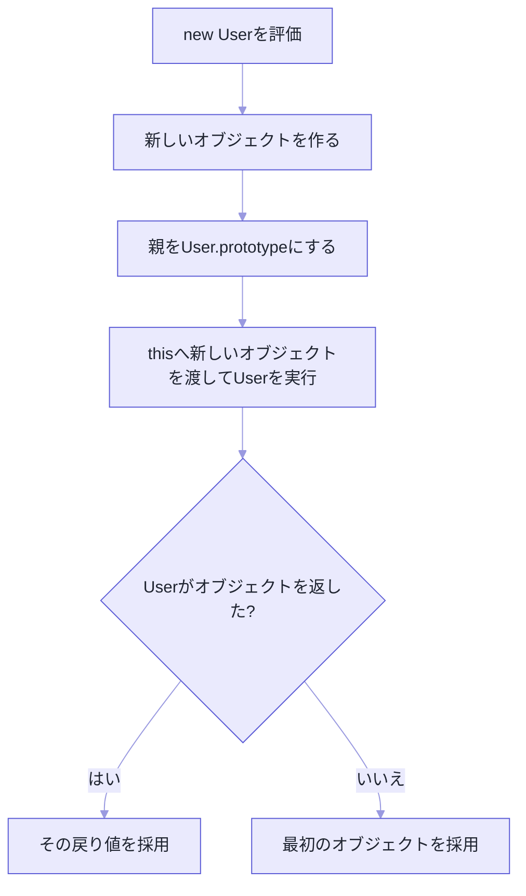

`constructor` の中に `return` を書いていないのに、なぜインスタンスが返ってくるのか。

考えてみたら不思議じゃないですか。`this.name = name` と書いただけの関数から、ちゃんとオブジェクトが返ってくる。

答えは `new` のほうが持っていました。`new User("Aki")` という短い式の中では、オブジェクトの作成、`prototype` の設定、`constructor` の実行、戻り値の選択という4つの仕事が順に進んでいます。

この4つに分解すると、`prototype`、`this`、`instanceof`、クラス。ばらばらに覚えていたものが、一本につながります。

## `new` がやっている4つのこと

通常の関数を `constructor` として呼ぶ例から始めます。

```js
function User(name) {
  this.name = name;
}

User.prototype.greet = function () {
  return `Hello, ${this.name}`;
};

const user = new User("Aki");
console.log(user.greet()); // "Hello, Aki"
```

`new User("Aki")` を追ってみます。

まず、空の受け皿になるオブジェクトを作ります。その親を `User.prototype` に設定します。次に、その受け皿を `this` として `User("Aki")` の本体を走らせるので、`this.name = name` によって受け皿に `name: "Aki"` が入る。そして `User` は別のオブジェクトを返していないので、最後にその受け皿が `user` へ渡されます。

**受け皿を先に用意しているのは `new` のほうです。** だから `return` が要らなかった。

ちなみに `greet` は、この時点で `user` 自身にはありません。`user.greet()` を呼んだとき、プロパティ探索が `User.prototype` まで登って関数を見つけています。

生成とメソッド共有が別々の段階で成立している。だから `new`、`prototype`、`this` を一続きの話として説明できます。



近い動きを手で書くと、こうなります。仕様を完全に再現したものではありませんが、掴むには十分です。

```js
function construct(Constructor, args) {
  const instance = Object.create(Constructor.prototype);
  const returned = Constructor.apply(instance, args);

  const isObject =
    returned !== null &&
    (typeof returned === "object" || typeof returned === "function");

  return isObject ? returned : instance;
}
```

4段階のうち、**オブジェクトの作成と `constructor` 本体の実行を分けて見る**こと。ここが要点です。

`constructor` は、ゼロからオブジェクトを組み立てて返す普通のfactoryとして呼ばれているわけではありません。`new` 側が先に受け皿を作って、それを `this` として渡している。

`prototype` の設定も本体より手前で終わっているので、本体に `prototype` を組み立てるコードを書く必要もありません。

## `.prototype` は、インスタンスではない

`User.prototype` は `user` のことではありません。`new User()` で作るオブジェクトの `[[Prototype]]` に使われる、親候補です。

```js
console.log(Object.getPrototypeOf(user) === User.prototype); // true
console.log(user instanceof User); // true
```

この関係があるから、`user` に `greet` が無くても `User.prototype.greet` にたどり着けます。

| 対象 | 主に置かれるもの |
| --- | --- |
| `user` | `name` など、個体ごとの状態 |
| `User.prototype` | `greet` など、共有するメソッド |
| `User` | `constructor` 本体、`static` メンバー |

インスタンスごとに同じ関数を作らずに済む。共有の正体はこれです。

## `return` を書くと、結果が乗っ取られる

`constructor` からプリミティブ値を返しても、無視されます。ところがオブジェクトか関数を返すと、そちらが `new` 式の結果になります。

```js
function KeepGenerated() {
  this.value = "generated";
  return 123;
}

function ReplaceGenerated() {
  this.value = "generated";
  return { value: "replaced" };
}

console.log(new KeepGenerated().value);    // "generated"
console.log(new ReplaceGenerated().value); // "replaced"
```

差し替えられた側は、`instanceof` も `prototype` メソッドも失っています。特別な理由がないかぎり、`constructor` から別オブジェクトを返さないでください。用意された `this` を初期化するだけのほうが、ずっと読めます。

そしてこの規則には、読む側にとっての意味もあります。**`constructor` のコードだけを見ても、最終的に何が返るか断定できない**ということです。

明示的に `return` しているコンストラクターを見つけたら、呼び出し側がどの `prototype` とメソッドを期待しているかまで確認してください。クラスの派生 `constructor` では戻り値にさらに制約があるので、こちらはなおさら避けたほうが安全です。

## `new` で呼べない関数がある

すべての関数が `constructor` になれるわけではありません。

| 関数の種類 | 通常呼び出し | `new` |
| --- | --- | --- |
| 通常の関数宣言・関数式 | できる | 多くの場合できる |
| クラス | できない | できる |
| アロー関数 | できる | できない |
| メソッド構文 | できる | できない |
| バインド済み関数 | 元の関数による | 元の関数による |

```js
const createUser = (name) => ({ name });

createUser("Aki");     // 動く
new createUser("Aki"); // TypeError
```

アロー関数が `[[Construct]]` という内部能力を持っていないからです。

ここでひとつ注意があります。`.prototype` プロパティが有るか無いかで `constructor` かどうかを判定するのは、不十分です。

## `new.target` で、呼ばれ方が分かる

通常の関数の中では、`new` 付きで呼ばれたかどうかを確認できます。

```js
function User(name) {
  if (!new.target) {
    throw new TypeError("Userはnewとともに呼び出してください");
  }
  this.name = name;
}
```

クラスは最初から通常呼び出しを禁止しているので、これが要るのは関数 `constructor` のほうです。

ただし、ここで親切心を出さないでください。書き間違いを自動で直そうとして `return new User(name)` にすると、呼び出し規約が曖昧になります。

`constructor` なら `new` を要求する。factoryなら通常の関数として、名前と戻り値でそう示す。どちらかにします。

## `Reflect.construct` は、2つを分離する

通常の `new Target()` では、実行する `constructor` と `new.target` が同じです。`Reflect.construct(Target, args, NewTarget)` は、これを分けられます。

```js
function Base(name) {
  this.name = name;
}

function Derived() {}
Derived.prototype.describe = function () {
  return `name=${this.name}`;
};

const value = Reflect.construct(Base, ["Aki"], Derived);

console.log(value.name); // "Aki"
console.log(Object.getPrototypeOf(value) === Derived.prototype); // true
```

初期化には `Base` を使い、作るオブジェクトの親には `Derived.prototype` を選んでいます。

`value.name` は `Base` の本体が入れた値です。`value.describe()` が見つかるのは、親に `Derived.prototype` を選んだから。この例では `Derived.prototype` と `Base.prototype` をつないでいないので、初期化に `Base` を使ったという事実だけでは `value instanceof Base` は真になりません。

**実行するコンストラクターと、生成物の親。この2つは別物です。**

日常のコードで頻繁に使うAPIではありませんが、継承や組み込みオブジェクトの生成規則を理解する足がかりになります。

## クラスでも、やっていることは同じ

```js
class User {
  constructor(name) {
    this.name = name;
  }

  greet() {
    return `Hello, ${this.name}`;
  }
}
```

クラスは、`constructor` 関数と `prototype` メソッドを整理して書くための構文です。通常関数と違って `User("Aki")` という呼び方は禁止されますし、派生クラスでは `super()` が基底の `constructor` を実行して `this` を用意します。

土台は、ここまで見てきたものと同じです。

## クラスか、factoryか

| `constructor` / クラスが向く | factory関数が向く |
| --- | --- |
| インスタンスの型を `instanceof` で表したい | 返す具体型を隠したい |
| `prototype` メソッドを共有したい | キャッシュ済みの値を返したい |
| 継承関係が設計に必要 | 失敗をResult型で返したい |
| `new Type()` が自然な語彙 | 非同期初期化が必要 |

factoryはただの関数なので、毎回新しいオブジェクトを返す義務がありません。その自由がほしいならfactory。明確な型と共有メソッドを持つならクラス。

選ぶときは、生成コードの見た目ではなく、**利用側が何を頼みたいのか**で考えてください。

「Userという型の新しいインスタンスがほしい」なら `new User()` が自然です。「入力を解析して適切な結果がほしい」「あればキャッシュを使ってほしい」なら、`parseUser()` や `getUser()` のほうが、実際の契約を正しく表しています。

## 調べるときの順番

1. 対象の関数が `new` で呼べる種類か確認する。
2. `Object.getPrototypeOf(instance)` を見る。
3. `constructor` が別オブジェクトを `return` していないか確認する。
4. メソッドがインスタンス自身か `prototype` のどちらにあるか調べる。
5. 継承がある場合は `new.target` と `super()` の関係を見る。

---

冒頭の疑問に戻ります。

`return` を書かなくてもインスタンスが返るのは、`new` が先に受け皿を作って、それを `this` として渡していたからでした。

`new` は「関数を呼ぶ演算子」ではありません。共有メソッドにつながるオブジェクトを作り、それを `this` として初期化させ、最後に戻り値を選ぶ。**生成のためのプロトコル**です。

この順番で追えるようになると、クラスも関数 `constructor` も、同じ土台の上に並びます。

## 参考資料

- [ECMAScript: The new Operator](https://tc39.es/ecma262/multipage/ecmascript-language-expressions.html#sec-new-operator)
- [ECMAScript: OrdinaryConstruct](https://tc39.es/ecma262/multipage/ordinary-and-exotic-objects-behaviours.html#sec-ecmascript-function-objects-construct-argumentslist-newtarget)
- [ECMAScript: Reflect.construct](https://tc39.es/ecma262/multipage/reflection.html#sec-reflect.construct)
- [MDN: new operator](https://developer.mozilla.org/ja/docs/Web/JavaScript/Reference/Operators/new)
