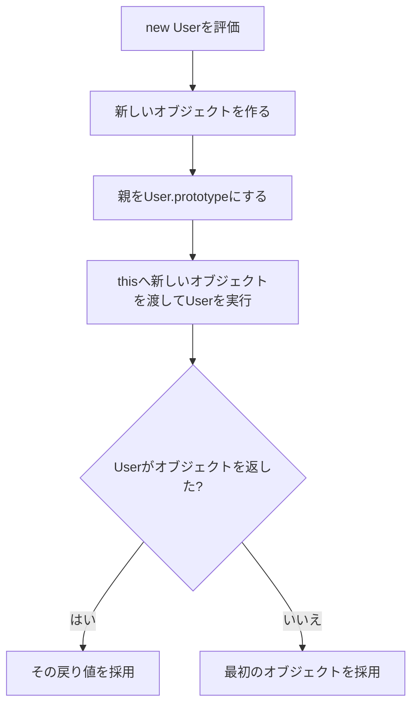

`new User("Aki")` は短い式ですが、内部ではオブジェクトの作成、`prototype` の設定、`constructor` の実行、戻り値の選択が行われます。

この流れを分解すると、`prototype`、`this`、`instanceof`、クラスの関係を一度に整理できます。

## `new` が行う4つの処理

通常の関数を `constructor` として呼ぶ例から始めます。

```js
function User(name) {
  this.name = name;
}

User.prototype.greet = function () {
  return `Hello, ${this.name}`;
};

const user = new User("Aki");
console.log(user.greet()); // "Hello, Aki"
```

概念上、`new User("Aki")` は次の順に進みます。

冒頭の例へ当てはめると、最初に空の受け皿となるオブジェクトを作り、その親を `User.prototype` に設定します。次に、その受け皿を `this` として `User("Aki")` の本体を実行するため、`this.name = name` によって受け皿へ `name: "Aki"` が追加されます。`User` は別のオブジェクトを返していないので、最後にその受け皿が `user` へ代入されます。

`greet` はこの時点で `user` 自身にはありません。`user.greet()` を呼ぶと、プロパティ探索が `User.prototype` まで進んで関数を見つけます。オブジェクトの生成とメソッド共有が別の段階で成り立っているため、`new`、`prototype`、`this` を一続きの処理として説明できます。



手書きで近い動きを表すと、次のようになります。実際の仕様を完全に再現するコードではありませんが、基本の理解には役立ちます。

```js
function construct(Constructor, args) {
  const instance = Object.create(Constructor.prototype);
  const returned = Constructor.apply(instance, args);

  const isObject =
    returned !== null &&
    (typeof returned === "object" || typeof returned === "function");

  return isObject ? returned : instance;
}
```

4段階のうち、オブジェクトの作成と `constructor` 本体の実行を分けて考えることが重要です。`constructor` はゼロからオブジェクトを返す普通のfactoryとして呼ばれているわけではありません。`new` 側が先に受け皿を用意し、その受け皿を `this` として `constructor` へ渡します。

この違いがあるため、`constructor` 内で `this.name = name` と書くだけで、明示的に `return this` しなくてもインスタンスを受け取れます。また、`prototype` の設定は `constructor` 本体より手前で決まるため、本体に `prototype` を作るコードは必要ありません。

## `.prototype` は作られるオブジェクトの親候補

`User.prototype` は、`user` 自身ではありません。`new User()` で作るオブジェクトの `[[Prototype]]` に使われます。

```js
console.log(Object.getPrototypeOf(user) === User.prototype); // true
console.log(user instanceof User); // true
```

この関係があるため、`user` 自身に `greet` がなくても `User.prototype.greet` を見つけられます。

| 対象 | 主に置かれるもの |
| --- | --- |
| `user` | `name` など、個体ごとの状態 |
| `User.prototype` | `greet` など、共有するメソッド |
| `User` | `constructor` 本体、`static` メンバー |

各インスタンスへ同じメソッドを作る必要がないため、振る舞いを共有できます。

## `constructor` がオブジェクトを返すと結果が差し替わる

`constructor` がプリミティブ値を `return` しても、通常は無視されます。オブジェクトまたは関数を `return` すると、そちらが `new` 式の結果になります。

```js
function KeepGenerated() {
  this.value = "generated";
  return 123;
}

function ReplaceGenerated() {
  this.value = "generated";
  return { value: "replaced" };
}

console.log(new KeepGenerated().value);    // "generated"
console.log(new ReplaceGenerated().value); // "replaced"
```

明示的な差し替えは、`instanceof` や `prototype` メソッドの利用を壊すことがあります。特別な理由がなければ、`constructor` から別オブジェクトを返さず、生成された `this` を初期化する設計が読みやすくなります。

この規則は、`constructor` のコードだけを読んでも最終的な型を断定できないことを意味します。オブジェクトを明示的に `return` している `constructor` を見つけたら、呼び出し側がどの `prototype` とメソッドを期待しているかも確認してください。クラスの派生 `constructor` では戻り値にさらに制約があるため、通常は明示 `return` を避ける方が安全です。

## 呼び出せる関数と、`new` で生成できる関数は同じではない

すべての関数が `constructor` になれるわけではありません。

| 関数の種類 | 通常呼び出し | `new` |
| --- | --- | --- |
| 通常の関数宣言・関数式 | できる | 多くの場合できる |
| クラス | できない | できる |
| アロー関数 | できる | できない |
| メソッド構文 | できる | できない |
| バインド済み関数 | 元の関数による | 元の関数による |

```js
const createUser = (name) => ({ name });

createUser("Aki");     // 動く
new createUser("Aki"); // TypeError
```

アロー関数は `[[Construct]]` という内部能力を持たないためです。`.prototype` プロパティの有無だけで `constructor` かどうかを判定するのは不十分です。

## `new.target` で生成の起点を確認できる

通常関数の中では、`new.target` を使って `new` 付きで呼ばれたかを確認できます。

```js
function User(name) {
  if (!new.target) {
    throw new TypeError("Userはnewとともに呼び出してください");
  }
  this.name = name;
}
```

クラスは最初から通常呼び出しを許さないため、この確認は主に関数 `constructor` で使います。ただし、利用者の書き間違いを自動修正するために `return new User(name)` とする設計は、呼び出し規約を曖昧にします。`constructor` なら `new` を要求し、factoryなら通常関数として名前と戻り値で示す方が明確です。

## `Reflect.construct` は `constructor` と `new.target` を分ける

通常の `new Target()` では、実行する `constructor` と `new.target` は同じです。`Reflect.construct(Target, args, NewTarget)` を使うと分けられます。

```js
function Base(name) {
  this.name = name;
}

function Derived() {}
Derived.prototype.describe = function () {
  return `name=${this.name}`;
};

const value = Reflect.construct(Base, ["Aki"], Derived);

console.log(value.name); // "Aki"
console.log(Object.getPrototypeOf(value) === Derived.prototype); // true
```

ここでは初期化処理に `Base` を使い、作るオブジェクトの `prototype` には `Derived.prototype` を使っています。通常のアプリケーションコードで頻繁に必要になるAPIではありませんが、継承や組み込みオブジェクトの生成規則を理解する助けになります。

結果の `value.name` は `Base` 本体が設定した値です。一方、`value.describe()` が見つかるのは、親として `Derived.prototype` を選んだからです。この例では `Derived.prototype` と `Base.prototype` をつないでいないため、初期化に `Base` を使った事実だけで `value instanceof Base` が真になるわけではありません。実行するコンストラクターと、生成物の親を分けて考える必要があります。

## クラスでも基本の流れは同じ

```js
class User {
  constructor(name) {
    this.name = name;
  }

  greet() {
    return `Hello, ${this.name}`;
  }
}
```

クラスは `constructor` 関数と `prototype` メソッドを整理して書く構文です。通常関数と異なり、`User("Aki")` のような呼び出しは禁止されます。また、派生クラスでは `super()` が基底クラスの `constructor` を実行し、`this` を利用できる状態にします。

## `constructor` とfactoryを選ぶ基準

| `constructor` / クラスが向く | factory関数が向く |
| --- | --- |
| インスタンスの型を `instanceof` で表したい | 返す具体型を隠したい |
| `prototype` メソッドを共有したい | キャッシュ済みの値を返したい |
| 継承関係が設計に必要 | 失敗をResult型で返したい |
| `new Type()` が自然な語彙 | 非同期初期化が必要 |

factoryは普通の関数なので、常に新しいオブジェクトを返す必要はありません。この柔軟さが必要ならfactoryが合います。一方、明確な型と共有メソッドを持つオブジェクトならクラスが読みやすい場合があります。

選択時には、生成コードの見た目だけでなく、利用側が何を頼みたいかを考えます。「Userという型の新しいインスタンスを作る」なら `new User()` が自然です。「入力を解析して適切な結果を得る」「キャッシュがあれば再利用する」なら、`parseUser()` や `getUser()` のようなfactoryの方が実際の契約を表します。

## 挙動を調べるときの確認順

1. 対象の関数が `new` で呼べる種類か確認する。
2. `Object.getPrototypeOf(instance)` を見る。
3. `constructor` が別オブジェクトを `return` していないか確認する。
4. メソッドがインスタンス自身か `prototype` のどちらにあるか調べる。
5. 継承がある場合は `new.target` と `super()` の関係を見る。

`new` の中心は、「関数を呼ぶこと」だけではありません。共有メソッドへつながるオブジェクトを作り、そのオブジェクトを `this` として初期化し、最後に戻り値を選ぶ生成プロトコルです。この順序で追えば、クラスも関数 `constructor` も同じ土台から理解できます。

## 参考資料

- [ECMAScript: The new Operator](https://tc39.es/ecma262/multipage/ecmascript-language-expressions.html#sec-new-operator)
- [ECMAScript: OrdinaryConstruct](https://tc39.es/ecma262/multipage/ordinary-and-exotic-objects-behaviours.html#sec-ecmascript-function-objects-construct-argumentslist-newtarget)
- [ECMAScript: Reflect.construct](https://tc39.es/ecma262/multipage/reflection.html#sec-reflect.construct)
- [MDN: new operator](https://developer.mozilla.org/ja/docs/Web/JavaScript/Reference/Operators/new)
