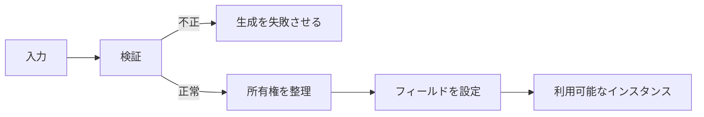
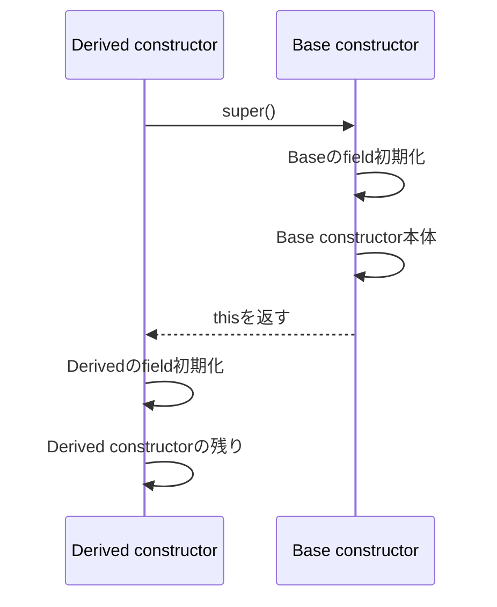

`constructor` の仕事は、引数をフィールドへ代入することだけではありません。生成が正常に終わった時点で、そのオブジェクトを安全に使える状態へ整えることです。

この基準から考えると、入力検証、デフォルト値、配列のコピー、非同期処理をどこへ置くべきかが見えてきます。

## 生成直後にメソッドを呼べる状態にする

次の `Order` は、IDと明細が揃って初めて有効です。

```ts
type OrderItem = {
  productId: string;
  unitPrice: number;
  quantity: number;
};

class Order {
  readonly id: string;
  readonly items: readonly OrderItem[];

  constructor(id: string, items: readonly OrderItem[]) {
    if (id.trim() === "") {
      throw new TypeError("idは空にできません");
    }
    if (items.length === 0) {
      throw new TypeError("itemsには1件以上必要です");
    }

    this.id = id;
    this.items = items.map((item) => ({ ...item }));
  }

  total(): number {
    return this.items.reduce(
      (sum, item) => sum + item.unitPrice * item.quantity,
      0,
    );
  }
}
```

`new Order(...)` が成功したなら、`total()` は追加の初期化なしで呼べます。半端な状態を作ってからセッターで埋める設計では、利用側が正しい呼び出し順まで知る必要があります。

この性質は、`constructor` の外側にも効きます。利用側は「itemsを設定したか」「状態を初期化したか」を毎回確認せず、Order型を受け取った時点で契約が成立していると考えられます。確認コードが各画面へ散らばらないため、正常系の処理も短くなります。

反対に、空配列を一度許して後から埋める必要があるなら、それは注文とは別の状態かもしれません。`OrderDraft` と `Order` を分ける、builderを使うなど、状態遷移を型や名前へ表すと、`constructor` だけへ無理な柔軟性を持たせずに済みます。



## `constructor` へ置く処理と、置かない処理

| `constructor` へ置く | 別の場所へ分ける |
| --- | --- |
| 必須入力の検証 | HTTP・DB・ファイルの読み込み |
| 不変条件の確立 | 重い非同期初期化 |
| デフォルト値の決定 | メール送信やログ記録 |
| 入力のコピー・正規化 | 利用者との対話が必要な処理 |
| すぐ使う小さな派生値 | 失敗後の再試行を伴う処理 |

`constructor` は同期的に呼ばれます。非同期処理を始めても `await` できず、「生成済みだが準備中」という状態が生まれます。

副作用を避ける理由は同期性だけではありません。`new User()` を読んだだけでは、ネットワーク通信やメール送信が起きると予測しにくいためです。生成式は値を準備する操作として読める範囲に保ち、外部へ影響する処理は `save()` や `send()` のような明示的な名前へ出します。

## フィールド初期化子と `constructor` 本体の順序

基底クラスでは、インスタンスフィールドの初期化後に `constructor` 本体が実行されます。

```ts
class Cart {
  items: string[] = [];
  status = "draft";

  constructor(initialItems: string[]) {
    console.log(this.status); // "draft"
    this.items = [...initialItems];
  }
}
```

派生クラスでは、`super()` が戻った後に派生側のフィールドが初期化され、その後の `constructor` 本体へ進みます。

短い例を実行順に追ってみます。

```ts
class Base {
  baseState = "base field";

  constructor() {
    console.log("Base body", this.baseState);
  }
}

class Derived extends Base {
  derivedState = "derived field";

  constructor() {
    super();
    console.log("Derived body", this.derivedState);
  }
}

new Derived();
```

実行は次の順です。最初に `super()` が基底クラスの生成処理へ入り、`baseState` を初期化してから基底 `constructor` 本体が `Base body base field` を出力します。`super()` が戻ると派生側の `derivedState` が初期化され、最後に派生 `constructor` の残りが `Derived body derived field` を出力します。派生側のフィールドは、基底 `constructor` 本体の実行中にはまだ初期化されていません。



そのため、派生クラスでは `super()` より前に `this` を使えません。派生側が使うインスタンスをまだ受け取っていないことが、この構文上の制限の理由です。

## TypeScriptのパラメータープロパティは単純な代入に使う

TypeScriptでは、`constructor` 引数へアクセス修飾子を付けると、フィールド宣言と代入をまとめられます。

```ts
class User {
  constructor(
    readonly id: string,
    private displayName: string,
  ) {}

  rename(name: string): void {
    if (name.trim() === "") throw new TypeError("nameは空にできません");
    this.displayName = name;
  }
}
```

短い値オブジェクトには便利です。ただし、検証、正規化、コピーが必要な値まで引数プロパティへ押し込むと、何を保証しているか見えにくくなります。処理があるフィールドは明示的に代入する方が読みやすくなります。

## 引数が増えたら意味のまとまりを作る

位置引数が増えると、呼び出し側で値の意味を判別できません。

```ts
new User("user-1", "Aki", true, "ja-JP", "Asia/Tokyo");
```

オプションオブジェクトなら、値にラベルが付きます。

```ts
type UserOptions = {
  id: string;
  displayName: string;
  active?: boolean;
  locale?: string;
  timeZone?: string;
};

class User {
  readonly id: string;
  readonly displayName: string;
  readonly active: boolean;
  readonly locale: string;
  readonly timeZone: string;

  constructor(options: UserOptions) {
    const displayName = options.displayName.trim();
    if (displayName === "") {
      throw new TypeError("displayNameは空にできません");
    }

    this.id = options.id;
    this.displayName = displayName;
    this.active = options.active ?? true;
    this.locale = options.locale ?? "ja-JP";
    this.timeZone = options.timeZone ?? "Asia/Tokyo";
  }
}
```

同じ概念としてまとまるか、任意項目が多いか、同じ型の値が並んで取り違えやすいかを見ます。引数の数は、その判断材料の1つにすぎません。

## 変更可能な入力は所有権を決める

配列やオブジェクトをそのまま保存すると、呼び出し側の変更がインスタンス内部へ反映されます。

```ts
const items = [{ productId: "p-1", unitPrice: 100, quantity: 1 }];
const order = new Order("order-1", items);

items[0].quantity = 999;
```

`constructor` で浅いコピーを作れば、配列と各明細の直接変更を分離できます。ただし、明細の中にさらに変更可能なオブジェクトがある場合は、どの深さまでコピーするかを決める必要があります。

選択肢は次の3つです。

- 入力をコピーし、インスタンスが独自に所有する。
- 変更できない値だけを受け取り、安全に共有する。
- 共有することを契約として明示する。

何となく参照を保持するのが最も危険です。

## 非同期初期化は静的Factoryへ分ける

外部データが必要なら、Promiseを返すfactoryで準備を終えてから `constructor` を呼びます。

```ts
type UserProfile = { id: string; displayName: string };

class UserProfileService {
  private constructor(private readonly profile: UserProfile) {}

  static async load(id: string, api: ProfileApi): Promise<UserProfileService> {
    const profile = await api.fetch(id);
    if (!profile) throw new Error(`User not found: ${id}`);
    return new UserProfileService(profile);
  }

  displayName(): string {
    return this.profile.displayName;
  }
}
```

利用側は `await UserProfileService.load(...)` が成功した後、準備済みのインスタンスだけを受け取ります。loading状態をオブジェクト内部へ持ち込まずに済みます。

## 例外とResultは利用側の分岐で選ぶ

入力がプログラミング上の前提に反するなら、`constructor` で例外を投げる設計が自然です。一方、利用者入力の不備が頻繁に起き、画面上で複数のエラーを表示したい場合は、factoryがResult型を返す方が扱いやすいことがあります。

| 失敗の性質 | 合う表現 |
| --- | --- |
| 呼び出し側のバグ、契約違反 | 例外 |
| 日常的に起きる入力エラー | `Result` / 検証エラー |
| 存在しないことが通常の検索 | `undefined` / `Option` |
| 外部I/Oの失敗 | Promiseの `reject` またはResult |

`constructor` だけで、すべての失敗表現を引き受ける必要はありません。

どの方法を選んでも、「失敗した後に半端なインスタンスを返さない」という点は共通です。例外ならインスタンスを返さず、Resultなら成功側にだけインスタンスを入れます。利用側が `order.isInitialized` を確認し続ける設計は、生成と利用の境界が曖昧になっている合図です。

## 初期化設計を確認するチェックリスト

1. 生成直後に公開メソッドを安全に呼べるか。
2. 必須値が後からセッターで埋められる設計になっていないか。
3. 変更可能な入力をコピーするか共有するか決めているか。
4. `constructor` 内で外部I/Oを始めていないか。
5. 引数の意味が呼び出し側から分かるか。
6. 失敗方法が利用側の期待と合っているか。

`constructor` はオブジェクトの利用開始地点です。値をフィールドへ詰めるだけで終わりません。成功したインスタンスはすぐ使え、準備できない場合は生成そのものを失敗させる。この境界を守ると、利用側に初期化順を覚えさせずに済みます。

## 参考資料

- [ECMAScript: Class Definitions](https://tc39.es/ecma262/multipage/ecmascript-language-functions-and-classes.html#sec-class-definitions)
- [ECMAScript: InitializeInstanceElements](https://tc39.es/ecma262/multipage/abstract-operations.html#sec-initializeinstanceelements)
- [MDN: constructor](https://developer.mozilla.org/ja/docs/Web/JavaScript/Reference/Classes/constructor)
- [TypeScript: Classes](https://www.typescriptlang.org/docs/handbook/2/classes.html)
