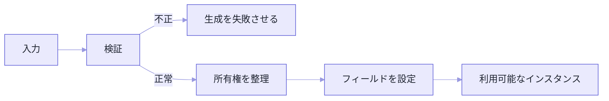
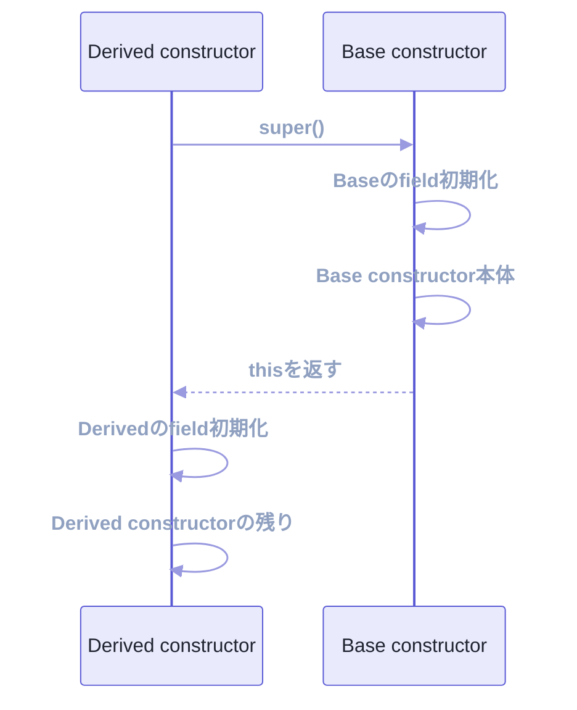

```ts
if (order.isInitialized) {
  // ...
}
```

こういう行を書いた記憶、ありませんか。私はあります。しかも複数の画面に書きました。

あれは、`constructor` の設計が失敗しているサインでした。

`constructor` の仕事は、引数をフィールドに詰めることではありません。**生成が正常に終わった時点で、そのオブジェクトを安全に使える状態にすること**です。

この基準で見ると、入力検証、デフォルト値、配列のコピー、非同期処理。それぞれの置き場所が決まってきます。

## 生成できた＝もう使える、にする

次の `Order` は、IDと明細が揃って初めて意味を持ちます。

```ts
type OrderItem = {
  productId: string;
  unitPrice: number;
  quantity: number;
};

class Order {
  readonly id: string;
  readonly items: readonly OrderItem[];

  constructor(id: string, items: readonly OrderItem[]) {
    if (id.trim() === "") {
      throw new TypeError("idは空にできません");
    }
    if (items.length === 0) {
      throw new TypeError("itemsには1件以上必要です");
    }

    this.id = id;
    this.items = items.map((item) => ({ ...item }));
  }

  total(): number {
    return this.items.reduce(
      (sum, item) => sum + item.unitPrice * item.quantity,
      0,
    );
  }
}
```

`new Order(...)` が通ったなら、`total()` はそのまま呼べます。追加の初期化は要りません。

半端な状態を作ってからセッターで埋める設計だと、利用側が正しい呼び出し順まで覚える羽目になります。

この性質は、クラスの外側にも効きます。利用側は「itemsを入れたっけ」「初期化したっけ」を毎回確かめず、**Order型を受け取った時点で契約が成立している**と思っていい。冒頭の `isInitialized` が要らなくなるのは、これが理由です。

逆に、空の状態を一度許して後から埋める必要が本当にあるなら、それは注文とは別のものかもしれません。`OrderDraft` と `Order` に分ける、builderを使う。状態遷移を型や名前で表せば、`constructor` 1つに無理な柔軟さを背負わせずに済みます。



## 置くもの、置かないもの

| `constructor` へ置く | 別の場所へ分ける |
| --- | --- |
| 必須入力の検証 | HTTP・DB・ファイルの読み込み |
| 不変条件の確立 | 重い非同期初期化 |
| デフォルト値の決定 | メール送信やログ記録 |
| 入力のコピー・正規化 | 利用者との対話が必要な処理 |
| すぐ使う小さな派生値 | 失敗後の再試行を伴う処理 |

`constructor` は同期的に呼ばれます。中で非同期処理を始めても `await` できないので、「生成は済んだけど準備中」という宙ぶらりんな状態が生まれます。

ただ、副作用を避ける理由は同期性だけではありません。

`new User()` という行を読んで、そこでネットワーク通信やメール送信が走ると予想する人はいないからです。生成式は値を用意する操作として読める範囲に留めて、外へ影響する処理は `save()` や `send()` という名前に出します。

## 順番は、思っているのと違うかもしれない

基底クラスでは、インスタンスフィールドの初期化が終わってから `constructor` 本体が動きます。

```ts
class Cart {
  items: string[] = [];
  status = "draft";

  constructor(initialItems: string[]) {
    console.log(this.status); // "draft"
    this.items = [...initialItems];
  }
}
```

派生クラスになると、もう一段ややこしくなります。

```ts
class Base {
  baseState = "base field";

  constructor() {
    console.log("Base body", this.baseState);
  }
}

class Derived extends Base {
  derivedState = "derived field";

  constructor() {
    super();
    console.log("Derived body", this.derivedState);
  }
}

new Derived();
```

実行順はこうです。まず `super()` が基底の生成処理に入り、`baseState` を初期化してから `Base body base field` を出力します。`super()` が戻ってきて、そこで初めて `derivedState` が初期化され、最後に `Derived body derived field`。

つまり、**基底 `constructor` の本体が走っている最中、派生側のフィールドはまだ存在していません。**



派生クラスで `super()` より前に `this` を使えないのも、同じ話です。使うインスタンスを、まだ受け取っていないからです。

## パラメータープロパティは、単純な代入だけに

TypeScriptでは、`constructor` の引数にアクセス修飾子を付けると、宣言と代入をまとめられます。

```ts
class User {
  constructor(
    readonly id: string,
    private displayName: string,
  ) {}

  rename(name: string): void {
    if (name.trim() === "") throw new TypeError("nameは空にできません");
    this.displayName = name;
  }
}
```

短い値オブジェクトには気持ちいいくらい合います。

ただし、検証や正規化やコピーが要る値まで押し込まないでください。何を保証しているクラスなのかが見えなくなります。処理を伴うフィールドは、明示的に代入したほうが読めます。

## 引数が5個になったら

```ts
new User("user-1", "Aki", true, "ja-JP", "Asia/Tokyo");
```

この `true` が何なのか、呼び出し側からは分かりません。

```ts
type UserOptions = {
  id: string;
  displayName: string;
  active?: boolean;
  locale?: string;
  timeZone?: string;
};

class User {
  readonly id: string;
  readonly displayName: string;
  readonly active: boolean;
  readonly locale: string;
  readonly timeZone: string;

  constructor(options: UserOptions) {
    const displayName = options.displayName.trim();
    if (displayName === "") {
      throw new TypeError("displayNameは空にできません");
    }

    this.id = options.id;
    this.displayName = displayName;
    this.active = options.active ?? true;
    this.locale = options.locale ?? "ja-JP";
    this.timeZone = options.timeZone ?? "Asia/Tokyo";
  }
}
```

判断材料は数だけではありません。同じ概念としてまとまるか。任意項目が多いか。同じ型の値が並んでいて取り違えやすいか。

引数の個数は、そのうちの1つにすぎません。

## その配列、誰のものですか

配列やオブジェクトをそのまま保存すると、外から中身を書き換えられます。

```ts
const items = [{ productId: "p-1", unitPrice: 100, quantity: 1 }];
const order = new Order("order-1", items);

items[0].quantity = 999;
```

`order` は何もしていないのに、中身が変わりました。

`constructor` で浅いコピーを取れば、配列と各明細の直接変更を切り離せます。ただし明細の中にさらに変更可能なオブジェクトがあるなら、どこまでコピーするかを決める必要があります。

選択肢は3つです。

- 入力をコピーし、インスタンスが独自に所有する。
- 変更できない値だけを受け取り、安全に共有する。
- 共有することを契約として明示する。

いちばん危ないのは、**何となく参照を持っておくこと**です。

## 非同期は、静的Factoryへ逃がす

外部データが必要なら、Promiseを返すfactoryで準備を終えてから `constructor` を呼びます。

```ts
type UserProfile = { id: string; displayName: string };

class UserProfileService {
  private constructor(private readonly profile: UserProfile) {}

  static async load(id: string, api: ProfileApi): Promise<UserProfileService> {
    const profile = await api.fetch(id);
    if (!profile) throw new Error(`User not found: ${id}`);
    return new UserProfileService(profile);
  }

  displayName(): string {
    return this.profile.displayName;
  }
}
```

`constructor` を `private` にしているのがポイントです。準備を飛ばして生成する経路を、そもそも塞いでいます。

利用側は `await UserProfileService.load(...)` が成功したあと、準備済みのインスタンスだけを受け取ります。loading状態をオブジェクトの中に抱え込まずに済みます。

## 例外か、Resultか

入力がプログラム上の前提に反しているなら、`constructor` で例外を投げるのが自然です。一方、利用者の入力ミスが日常的に起きて、画面に複数のエラーを並べたいなら、factoryがResult型を返すほうが扱いやすい。

| 失敗の性質 | 合う表現 |
| --- | --- |
| 呼び出し側のバグ、契約違反 | 例外 |
| 日常的に起きる入力エラー | `Result` / 検証エラー |
| 存在しないことが通常の検索 | `undefined` / `Option` |
| 外部I/Oの失敗 | Promiseの `reject` またはResult |

`constructor` だけで、全部の失敗表現を引き受ける必要はありません。

どれを選んでも共通しているのは1点です。**失敗したあとに、半端なインスタンスを返さない。** 例外ならインスタンスを返さない。Resultなら成功側にだけ入れる。

## 確認する6つ

1. 生成直後に公開メソッドを安全に呼べるか。
2. 必須値が後からセッターで埋められる設計になっていないか。
3. 変更可能な入力をコピーするか共有するか決めているか。
4. `constructor` 内で外部I/Oを始めていないか。
5. 引数の意味が呼び出し側から分かるか。
6. 失敗方法が利用側の期待と合っているか。

---

冒頭の `order.isInitialized` に戻ります。

あれを書いていたということは、`Order` 型を受け取っても安心できなかったということです。生成と利用の境界が、ぼやけていました。

`constructor` はオブジェクトの利用開始地点です。値を詰めて終わりではありません。

**成功したインスタンスはすぐ使える。準備できないなら、生成そのものを失敗させる。**

この線を守るだけで、利用側に初期化順を覚えさせずに済みます。

## 参考資料

- [ECMAScript: Class Definitions](https://tc39.es/ecma262/multipage/ecmascript-language-functions-and-classes.html#sec-class-definitions)
- [ECMAScript: InitializeInstanceElements](https://tc39.es/ecma262/multipage/abstract-operations.html#sec-initializeinstanceelements)
- [MDN: constructor](https://developer.mozilla.org/ja/docs/Web/JavaScript/Reference/Classes/constructor)
- [TypeScript: Classes](https://www.typescriptlang.org/docs/handbook/2/classes.html)
