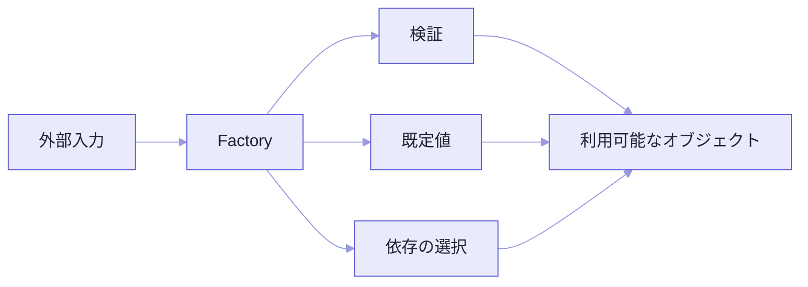

同じ `Order` のはずなのに、注文画面から作ったものと管理画面から作ったもので、初期状態が違っていました。

バグとしては地味です。ただ、原因を探すのに時間がかかりました。どちらも `new Order(...)` としか書いていないので、パッと見は同じに見えるんです。

生成が `new` 1行で終わらなくなると、こういうことが起きます。入力検証、既定値、依存の組み立て、実装の選択。全部が利用側へ散っていく。

Factoryは、その判断を関数やオブジェクトへ集めます。`constructor` を隠すことが目的ではありません。**「正しいものを作る手順」を、利用側に何度も書かせない**ための設計です。

コードは生成規則を説明するための抜粋で、`Clock` や `OrderItem` などの補助型は省いています。

## 同じ名前の、別物ができる

```ts
// 注文画面
const order = new Order(id, items, "draft", new Date());

// 管理画面
const order = new Order(id, items, "pending", new Date());

// バッチ
const order = new Order(id, items, "draft", clock.now());
```

3か所とも、初期状態と時刻の作り方を自分で決めています。

これで「初期状態を `pending` に統一しよう」という仕様変更が来たら、生成箇所を全部見つけ出さないといけません。1つ漏らせば、また同じ調査が始まります。



## まずは、ただの関数で

```ts
type CreateOrderInput = {
  id: string;
  items: readonly OrderItem[];
};

function createOrder(
  input: CreateOrderInput,
  clock: Clock,
): Order {
  if (input.items.length === 0) {
    throw new TypeError("itemsには1件以上必要です");
  }

  return new Order({
    id: input.id,
    items: input.items,
    status: "pending",
    createdAt: clock.now(),
  });
}
```

利用側は、初期状態も時刻の取り方も知りません。関数名からも「新規注文を作る」という意図が読めます。

さっきの3か所から、何が消えたのかを並べてみます。

| 呼び出し元から取り除けた判断 | Factoryでの決定 |
| --- | --- |
| 初期状態は `draft` か `pending` か | `pending` に統一する |
| 現在時刻をどう得るか | 注入された `Clock` を使う |
| 明細0件を許可するか | 生成前に拒否する |
| `constructor` へ何番目の引数で渡すか | 名前付きの入力へまとめる |

呼び出し元に残るのは「どのIDと明細で作るか」だけになりました。

そして仕様変更が来ても、直すのはFactoryとそのテストだけです。

**コードが短くなることより、生成結果がばらつかなくなることのほうが本題です。**

なお、Factoryを名乗るために `OrderFactory` クラスを立てる必要はありません。状態を持たず1種類だけ作るなら、関数がいちばん分かりやすい形です。

## 検証と生成は、別の仕事

HTTPのbodyやJSONは、実行時に何が来るか分かりません。一方、内部の `Order` は不変条件を満たしたものだけにしたい。

```ts
function parseCreateOrderInput(value: unknown): CreateOrderInput {
  return CreateOrderInputSchema.parse(value);
}

function handleCreateOrder(body: unknown): Order {
  const input = parseCreateOrderInput(body);
  return createOrder(input, systemClock);
}
```

分けると、責任の線が見えます。

| 段階 | 責任 |
| --- | --- |
| `parse` / `validate` | 外部データが必要な形か確認する |
| Factory | 既定値や生成規則を適用する |
| `constructor` | インスタンス自身の不変条件を守る |

同じ検証をFactoryと `constructor` の両方に書く必要はありません。外部形式に固有の検証は境界へ。どの生成経路でも守るべき不変条件は `constructor` へ。

## 失敗が日常なら、Resultで

利用者の入力ミスが通常の分岐として起きるなら、例外よりResultのほうが扱いやすいことがあります。

```ts
type CreateOrderResult =
  | { ok: true; order: Order }
  | {
      ok: false;
      errors: Array<{ field: string; message: string }>;
    };

function tryCreateOrder(input: CreateOrderInput, clock: Clock): CreateOrderResult {
  const errors = validateOrderInput(input);
  if (errors.length > 0) return { ok: false, errors };

  return {
    ok: true,
    order: new Order({
      ...input,
      status: "pending",
      createdAt: clock.now(),
    }),
  };
}
```

どちらが正しいかは、失敗の意味で決まります。プログラムの契約違反なら例外。利用者が直せる入力エラーなら `Result`。見つからないのが普通なら `Option`。

呼び出し側がそのあと何をするか。そこに合わせます。

## 実装を選ぶFactory

通知チャネルのように、入力から実装を決める場面でも使えます。

```ts
interface Notifier {
  send(message: string): Promise<void>;
}

function createNotifier(
  config: NotificationConfig,
  dependencies: NotificationDependencies,
): Notifier {
  switch (config.type) {
    case "email":
      return new EmailNotifier(dependencies.emailClient, config.from);
    case "slack":
      return new SlackNotifier(dependencies.httpClient, config.webhookUrl);
    case "disabled":
      return new NoopNotifier();
  }
}
```

利用側は具体クラスを知りません。`Notifier` の契約だけを見ています。

ここで一言。**Factoryの中の `switch` が育つこと自体は、失敗ではありません。** むしろ実装の一覧が1か所で見られる利点があります。

分割を考えるのは、各 `case` の中身が長くなってきてからで十分です。

## 依存を、勝手に作らせない

Factoryが内部で依存を `new` し始めると、せっかく集めた依存がまた隠れます。

```ts
// 依存が見えない
function createOrderService() {
  return new OrderService(
    new HttpOrderRepository(process.env.API_URL!),
    new EmailNotifier(process.env.EMAIL_KEY!),
  );
}
```

アプリ全体の構成に関わる生成は、コンポジションルートへ。機能の中のFactoryには、必要な依存を引数で渡します。

```ts
function createOrderService(deps: {
  repository: OrderRepository;
  notifier: Notifier;
}): OrderService {
  return new OrderService(deps.repository, deps.notifier);
}
```

Factoryが依存を選ぶのか受け取るのかは、変更の責任で決めます。環境ごとの実装選択はコンポジションルート、ドメイン上の生成規則は機能内のFactory。これは一例です。

## 非同期は、準備済みだけを返す

DB接続や外部設定の読み込みが要るオブジェクトは、`constructor` の中で初期化できません。Promiseを返すFactoryへ出します。

```ts
class ProductCatalog {
  private constructor(private readonly products: readonly Product[]) {}

  static async load(source: ProductSource): Promise<ProductCatalog> {
    const products = await source.fetchAll();
    return new ProductCatalog(products);
  }

  find(id: string): Product | undefined {
    return this.products.find((product) => product.id === id);
  }
}
```

`await ProductCatalog.load()` が通ったなら、手元にあるのは読み込み済みのカタログです。「インスタンスはあるけど、まだ使えない」という中間状態が存在しません。

ひとつ付け加えると、接続やファイルハンドルを持つ場合は、生成だけでなく破棄も契約に入れてください。Factoryが開いたのに誰が閉じるか決まっていない。それは生成責任の片手落ちです。

## どの形で書くか

| 手段 | 向いている場面 |
| --- | --- |
| `public` `constructor` | 生成規則が単純で1種類 |
| 静的Factory | 生成する型と強く結び付き、名前付き生成が欲しい |
| 独立した関数 | クラス外の依存を使う、複数型を返す |
| Factoryオブジェクト | 設定や依存を保持し、繰り返し生成する |

どれもFactoryの役割を果たせます。パターン名より、**生成規則をどこから見つけられるか**を優先してください。

## 置く価値があるか

このどれかに当てはまるなら、集める効果が出ます。

- 初期値や正規化規則が複数の利用側へ重複している。
- 入力に応じて具体実装を選ぶ。
- 生成時に複数の依存を組み立てる。
- 非同期準備が終わった値だけ返したい。
- キャッシュやプールから既存値を返す可能性がある。

逆に、`new User(id, name)` で足りるものを `UserFactoryFactory` のような層で包んでも、読む場所が1つ増えるだけです。

---

冒頭の「同じ `Order` のはずなのに」に戻ります。

あれは、生成規則がどこにも書かれていなかったから起きました。3か所の呼び出し元が、それぞれ独自に判断していただけです。

Factoryパターンの本質は、`new` を隠すことではありません。**生成時に守る規則と、作り方の選択を1か所へ集めること**です。

利用側で同じ初期値や同じ分岐を書き始めたら、そこが合図です。まずは小さな関数へ抜き出すところから。

## 参考資料

- [TypeScript Handbook: Classes](https://www.typescriptlang.org/docs/handbook/2/classes.html)
- [Martin Fowler: Composition Root](https://blog.ploeh.dk/2011/07/28/CompositionRoot/)
