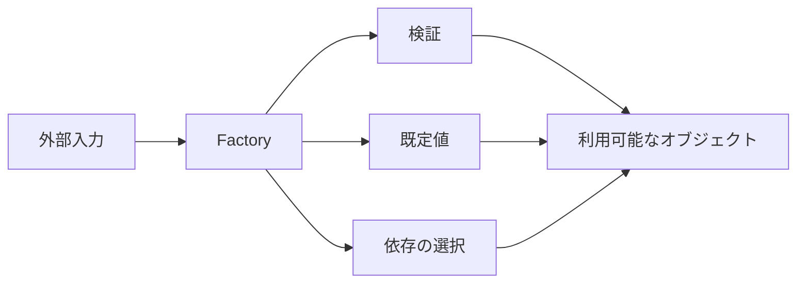

オブジェクト生成が `new` 1行で終わらなくなると、入力検証、既定値、依存の組み立て、実装の選択が利用側へ散り始めます。同じ型を作っているはずなのに、呼び出し元ごとに初期状態が違う、といった不具合も起きます。

Factoryは、生成に関する判断を関数やオブジェクトへ集めます。`constructor` を隠すこと自体が目的ではありません。「正しいものを作る手順」を、利用側が繰り返さなくて済むようにする設計です。

以下のコードは生成規則を説明するための抜粋です。`Clock` や `OrderItem` など、主題から外れる補助型の定義は省略しています。

## 生成コードが散ると、同じ名前の別物ができる

```ts
// 注文画面
const order = new Order(id, items, "draft", new Date());

// 管理画面
const order = new Order(id, items, "pending", new Date());

// バッチ
const order = new Order(id, items, "draft", clock.now());
```

呼び出し側が初期状態と時刻の作り方を決めています。仕様変更で初期状態を `pending` に統一しても、すべての生成箇所を正しく見つけなければなりません。



## 最小のFactoryは普通の関数でよい

```ts
type CreateOrderInput = {
  id: string;
  items: readonly OrderItem[];
};

function createOrder(
  input: CreateOrderInput,
  clock: Clock,
): Order {
  if (input.items.length === 0) {
    throw new TypeError("itemsには1件以上必要です");
  }

  return new Order({
    id: input.id,
    items: input.items,
    status: "pending",
    createdAt: clock.now(),
  });
}
```

利用側は、初期状態や時刻の設定方法を知りません。Factoryの名前からも「新規注文を作る」という意図が読めます。

Factoryを置く前は、注文画面・管理画面・バッチの各呼び出し元が、`constructor` 引数の並び、初期状態、現在時刻の取得方法を決めていました。`createOrder` を通すようにすると、呼び出し元に残る判断は「どのIDと明細で注文を作るか」だけです。

| 呼び出し元から取り除けた判断 | Factoryでの決定 |
| --- | --- |
| 初期状態は `draft` か `pending` か | `pending` に統一する |
| 現在時刻をどう得るか | 注入された `Clock` を使う |
| 明細0件を許可するか | 生成前に拒否する |
| `constructor` へ何番目の引数で渡すか | 名前付きの入力へまとめる |

仕様変更で初期状態が変わっても、修正箇所はFactoryとそのテストへ絞れます。呼び出し元のコードが短くなることより、生成結果のばらつきを防げることが重要です。

Factoryパターンを使うために、`OrderFactory` クラスを作る必要はありません。状態を持たず、1種類だけ生成するなら関数が最も分かりやすい形です。

## 外部入力の検証と、内部オブジェクトの生成を分ける

HTTP bodyやJSONは実行時に不正な可能性があります。一方、内部の `Order` は不変条件を満たした状態だけにしたいものです。

```ts
function parseCreateOrderInput(value: unknown): CreateOrderInput {
  return CreateOrderInputSchema.parse(value);
}

function handleCreateOrder(body: unknown): Order {
  const input = parseCreateOrderInput(body);
  return createOrder(input, systemClock);
}
```

検証と生成を分けると、次の境界が見えます。

| 段階 | 責任 |
| --- | --- |
| `parse` / `validate` | 外部データが必要な形か確認する |
| Factory | 既定値や生成規則を適用する |
| `constructor` | インスタンス自身の不変条件を守る |

同じ検証をFactoryと `constructor` へ二重に書く必要はありません。外部形式に固有の検証は境界へ、どの生成経路でも守るべき不変条件は `constructor` へ置きます。

## 失敗が日常的ならResultで返す

利用者入力の不備が通常の分岐として起きるなら、例外よりResultが扱いやすい場合があります。

```ts
type CreateOrderResult =
  | { ok: true; order: Order }
  | {
      ok: false;
      errors: Array<{ field: string; message: string }>;
    };

function tryCreateOrder(input: CreateOrderInput, clock: Clock): CreateOrderResult {
  const errors = validateOrderInput(input);
  if (errors.length > 0) return { ok: false, errors };

  return {
    ok: true,
    order: new Order({
      ...input,
      status: "pending",
      createdAt: clock.now(),
    }),
  };
}
```

例外と `Result` のどちらが正しいかは、失敗の意味で決まります。プログラムの契約違反なら例外、利用者が修正できる入力エラーなら `Result`、見つからないことが通常なら `Option` など、呼び出し側が行う処理に合わせます。

## 複数の具体型を選ぶFactory

通知チャネルのように、入力から実装を選ぶ場合もFactoryが使えます。

```ts
interface Notifier {
  send(message: string): Promise<void>;
}

function createNotifier(
  config: NotificationConfig,
  dependencies: NotificationDependencies,
): Notifier {
  switch (config.type) {
    case "email":
      return new EmailNotifier(dependencies.emailClient, config.from);
    case "slack":
      return new SlackNotifier(dependencies.httpClient, config.webhookUrl);
    case "disabled":
      return new NoopNotifier();
  }
}
```

利用側は具体クラスを知らず、`Notifier` の契約だけを使います。実装選択が設定へ依存する場合、その分岐をアプリケーションの入口へ集められます。

ただし、Factory内部の `switch` が大きくなること自体は失敗ではありません。実装の一覧を1か所で見られる利点があります。各 `case` の詳細な生成処理まで長くなったら、分岐ごとの補助Factoryへ分けます。

## 依存の組み立てはコンポジションルートとの境界を意識する

Factoryが依存を内部で勝手に `new` すると、再び隠れた依存を作ります。

```ts
// 依存が見えない
function createOrderService() {
  return new OrderService(
    new HttpOrderRepository(process.env.API_URL!),
    new EmailNotifier(process.env.EMAIL_KEY!),
  );
}
```

アプリ全体の構成を決める生成は、コンポジションルートへ置く方が追いやすくなります。機能内のFactoryには、必要な依存を引数で渡します。

```ts
function createOrderService(deps: {
  repository: OrderRepository;
  notifier: Notifier;
}): OrderService {
  return new OrderService(deps.repository, deps.notifier);
}
```

Factoryが依存を選ぶのか、受け取るのかは、変更の責任で決めます。環境ごとの実装選択はコンポジションルート、ドメイン上の生成規則は機能内のFactoryという分け方が一例です。

## 非同期Factoryは準備済みの値だけを返す

DB接続や外部設定の読み込みが必要なオブジェクトは、`constructor` 内で非同期初期化できません。Promiseを返すFactoryへ分けます。

```ts
class ProductCatalog {
  private constructor(private readonly products: readonly Product[]) {}

  static async load(source: ProductSource): Promise<ProductCatalog> {
    const products = await source.fetchAll();
    return new ProductCatalog(products);
  }

  find(id: string): Product | undefined {
    return this.products.find((product) => product.id === id);
  }
}
```

`await ProductCatalog.load()` が成功したなら、利用側は読み込み済みのcatalogを受け取ります。「インスタンスはあるがまだ使えない」という中間状態を避けられます。

接続やファイルハンドルを持つ場合は、生成だけでなく破棄も契約に含めます。Factoryがリソースを開いたのに、誰が閉じるか決まっていない設計は、生成責任が片手落ちです。

## `constructor`・静的Factory・独立関数を選ぶ

| 手段 | 向いている場面 |
| --- | --- |
| `public` `constructor` | 生成規則が単純で1種類 |
| 静的Factory | 生成する型と強く結び付き、名前付き生成が欲しい |
| 独立した関数 | クラス外の依存を使う、複数型を返す |
| Factoryオブジェクト | 設定や依存を保持し、繰り返し生成する |

どの形もFactoryの役割を持てます。パターンの名前より、生成規則をどこから見つけられるかを優先します。

## Factoryを置く価値があるか

次のどれかがあるなら、生成を集める効果が出ます。

- 初期値や正規化規則が複数の利用側へ重複している。
- 入力に応じて具体実装を選ぶ。
- 生成時に複数の依存を組み立てる。
- 非同期準備が終わった値だけ返したい。
- キャッシュやプールから既存値を返す可能性がある。

反対に、`new User(id, name)` で十分なものを `UserFactoryFactory` のような層で包んでも、読む場所が増えるだけです。

Factoryパターンの本質は、`new` を隠すことではありません。生成時に守る規則と、具体的な作り方の選択を1か所へ集めることです。利用側で同じ初期値や分岐を繰り返し始めたら、まず小さな関数へ抜き出すところから始めてください。

## 参考資料

- [TypeScript Handbook: Classes](https://www.typescriptlang.org/docs/handbook/2/classes.html)
- [Martin Fowler: Composition Root](https://blog.ploeh.dk/2011/07/28/CompositionRoot/)
