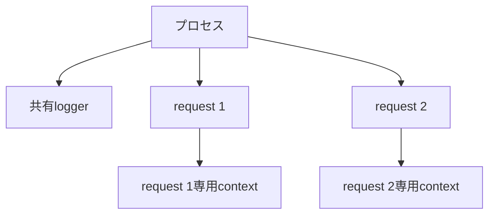
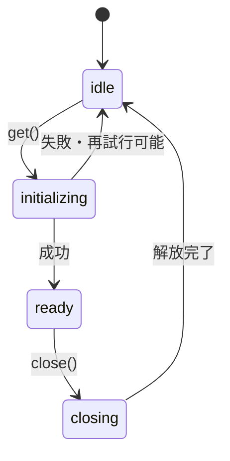

Singletonは「インスタンスを1つだけ作るパターン」と説明されます。しかし、実務で難しいのは1つにする方法ではありません。誰の間で1つなのか、いつ作り、いつ破棄するのかを決めることです。

ブラウザーの1タブ、Node.jsの1プロセス、SSRの1リクエスト、テストの1ケースでは、「1つ」の範囲が違います。範囲を決めずに共有すると、グローバル状態と同じ問題が起きます。

コード例は共有と破棄の仕組みへ焦点を当てた抜粋です。データベースドライバーなど、題意に直接関係しない型や接続処理は省略しています。

## まず「何の間で共有するか」を決める

| スコープ | 1つを共有する範囲 | 例 |
| --- | --- | --- |
| アプリケーション | アプリケーション全体 | 設定、接続プール |
| プロセス | Node.jsプロセス | ロガー、メトリクス クライアント |
| ブラウザーのタブ | 1つのタブ | クライアント側キャッシュ |
| リクエスト | 1回のHTTPリクエスト | 認証情報、トランザクション |
| テスト | 1テスト | メモリ内リポジトリ |

Singletonを検討するときは、「この値の正しいスコープは何か」と問い直します。パターン名を当てるのは、その後です。



ロガーはプロセス共有でも、利用者情報はリクエストごとに分ける必要があります。同じ「よく使う値」でもスコープは異なります。

## ES Modulesはモジュール評価ごとに値を共有する

小さなアプリケーションでは、古典的なSingletonクラスを作らず、モジュールから1つのインスタンスを `export` するだけで足ります。

```ts
// logger.ts
export class Logger {
  info(event: string, context: object = {}): void {
    console.info(event, context);
  }
}

export const logger = new Logger();
```

同じモジュール インスタンスを `import` するコードは、通常同じ `logger` を参照します。生成方法が単純で、遅延初期化も不要なら最も読みやすい形です。

ただし、モジュールが常に世界で1つという意味ではありません。別のRealm、Worker、Node.jsプロセス、バンドル、モジュールキャッシュの分離などにより複数存在し得ます。Singletonは分散システム全体の一意性を保証しません。

## コンポジションルートで1つ作り、必要な場所へ渡す

共有する値でも、グローバル `import` にせず、アプリケーションの入口で1つ作る方法があります。

```ts
const logger = new Logger(config.logLevel);
const queryClient = new QueryClient();
const orderRepository = new HttpOrderRepository(config.apiUrl, logger);

startApplication({
  logger,
  queryClient,
  orderRepository,
});
```

この方法では、生成数はコンポジションルートが管理します。利用側は依存を明示的に受け取るため、テストで別実装を渡しやすくなります。

| モジュールから直接 `import` | コンポジションルートから注入 |
| --- | --- |
| 記述が短い | 依存関係が見える |
| どこからでも同じ値へ到達 | スコープを組み立て時に決められる |
| テストで差し替えに工夫が必要 | テスト ダブルを渡しやすい |
| 小さな固定サービス向き | 成長するアプリ向き |

共有数を1にすることと、グローバル アクセスを許すことは別の判断です。

## 遅延初期化は同時呼び出しを考える

高価なリソースを最初に必要になった時点で作る場合、Promise自体を共有します。

```ts
class DatabaseProvider {
  private connectionPromise: Promise<Database> | undefined;
  private closePromise: Promise<void> | undefined;

  get(): Promise<Database> {
    if (this.closePromise) {
      return Promise.reject(new Error("データベース接続を終了しています"));
    }

    this.connectionPromise ??= connectDatabase().catch((error) => {
      this.connectionPromise = undefined;
      throw error;
    });
    return this.connectionPromise;
  }

  close(): Promise<void> {
    if (this.closePromise) return this.closePromise;

    const current = this.connectionPromise;
    if (!current) return Promise.resolve();

    this.closePromise = (async () => {
      try {
        const connection = await current;
        await connection.close();
      } finally {
        if (this.connectionPromise === current) {
          this.connectionPromise = undefined;
        }
        this.closePromise = undefined;
      }
    })();

    return this.closePromise;
  }
}
```

接続完了後の値だけを保存すると、完了前に2回 `get()` されたとき、接続処理が二重に始まる可能性があります。最初の呼び出しで作ったPromiseを保存すれば、進行中の初期化も共有できます。

一方、初期化に失敗したPromiseを残すと、以後の `get()` がすべて同じ失敗を返します。再試行を許すなら、失敗時にPromiseをクリアするか、backoffを含む状態機械を設計します。遅延初期化は単なる `if (!instance)` では終わりません。

## 生成だけでなく破棄まで所有する

接続、タイマー、購読を持つSingletonは、終了時に解放が必要です。



アプリケーション終了時、ホットリロード、テスト終了時に誰が `close()` を呼ぶかを決めます。生成場所と破棄場所を同じライフサイクルへ置くと、リソースリークを防ぎやすくなります。

## SSRで利用者状態をプロセス共有しない

サーバー上のES Moduleは、複数リクエストから同じプロセス内で使われます。次のような共有ストアへ利用者情報を入れると、別のリクエストへ漏れる可能性があります。

```ts
// 危険: process内で共有される可能性がある
export const sessionStore = {
  currentUser: undefined as User | undefined,
};
```

リクエストごとにコンテキストやストアを作り、ハンドラーへ渡します。

```ts
async function handleRequest(request: Request): Promise<Response> {
  const context = createRequestContext({
    user: await authenticate(request),
    requestId: crypto.randomUUID(),
  });

  return renderApplication({ request, context });
}
```

アプリ全体で1つに見えるキャッシュ ライブラリでも、SSRではリクエストごとにクライアントを作るべき場合があります。利用しているフレームワークとライブラリのサーバー向けガイドを確認してください。

## テストの順序依存を防ぐ

変更可能なSingletonは、テスト間で状態が残ります。

```ts
beforeEach(() => {
  featureFlags.reset();
});
```

リセットAPIを用意する方法もありますが、本番コードへテスト都合の操作を増やします。より安全なのは、テストごとに新しいインスタンスを作って注入する設計です。

並列テストでは、1つの共有インスタンスをリセットしても別テストと競合します。変更可能な状態は、リクエストやテストスコープへ狭められないか検討します。アプリケーションSingletonを選ぶのは、広い共有が本当に必要な場合です。

## 「1つで十分」と「1つしか許さない」は違う

ロガーやクエリ クライアントは、通常は1つで十分かもしれません。しかし、複数あっても論理的に壊れないなら、クラス自体で生成を禁止する必要はありません。コンポジションルートが1つだけ作れば目的を満たせます。

`constructor` を `private` にして `getInstance()` だけを公開するclassical Singletonは、複数インスタンスが存在してはいけない強い制約を型へ持ち込みます。テスト、複数tenant、段階的移行で2つ必要になったとき、設計変更が大きくなります。

| 状況 | 選択 |
| --- | --- |
| 通常は1つで十分 | コンポジションルートで1つ作る |
| モジュール内で固定の軽量値 | モジュールから `export` |
| 生成コストが高い | 遅延プロバイダーを検討 |
| リクエストごとに状態が違う | リクエストスコープ |
| 分散環境で世界に1つ必要 | DB制約・lock・leader electionなど |

## Singletonを選ぶ前の質問

1. 何の範囲で1つなのか。
2. その範囲を越えて共有すると何が漏れるか。
3. いつ初期化し、失敗時に再試行するか。
4. 誰が破棄するか。
5. テストや将来の要件で複数必要にならないか。
6. 1つにする責任をクラスではなくコンポジションルートへ置けないか。

Singletonの本質は、共有範囲とライフサイクルを1つに定めることです。`getInstance()` は実装方法の1つにすぎません。特に変更可能な状態は、最も狭い正しいスコープへ置いてください。広い共有は便利でも、テスト順序やSSRの情報混在という代償を伴います。

## 参考資料

- [Refactoring.Guru: Singleton](https://refactoring.guru/design-patterns/singleton)
- [MDN: JavaScript modules](https://developer.mozilla.org/ja/docs/Web/JavaScript/Guide/Modules)
- [Node.js: Modules caching](https://nodejs.org/api/modules.html#caching)
- [TanStack Query: SSR](https://tanstack.com/query/latest/docs/framework/react/guides/ssr)
