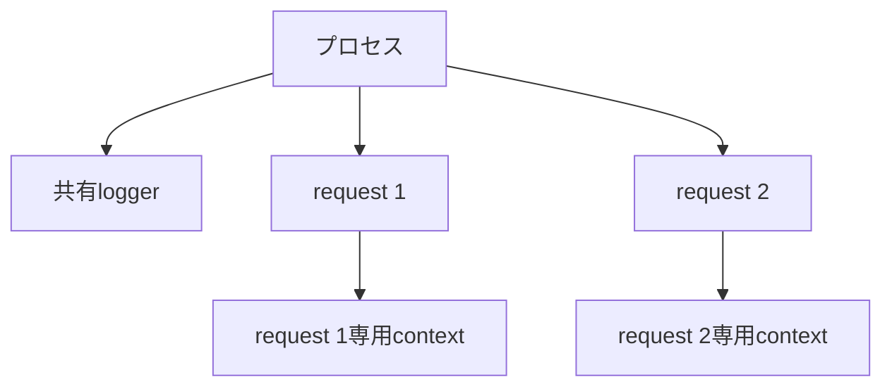
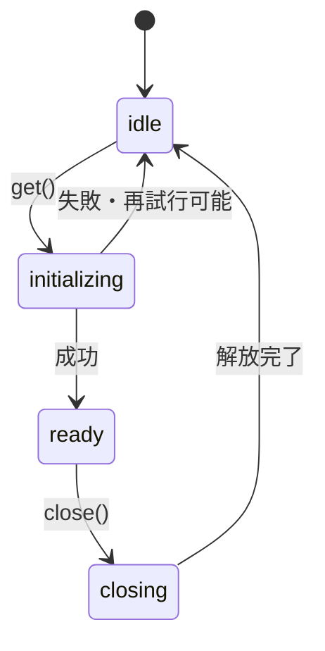

「インスタンスを1つだけ作るパターンです」

Singletonの説明は、たいていこれで終わります。そして実装も `getInstance()` を書けば終わります。簡単なパターンだと思っていました。

難しいのは、1つにする方法ではありませんでした。**誰の間で1つなのか。いつ作って、いつ壊すのか。** ここです。

ブラウザーの1タブ。Node.jsの1プロセス。SSRの1リクエスト。テストの1ケース。「1つ」の意味が全部違います。範囲を決めずに共有すると、名前がSingletonになっただけのグローバル変数ができあがります。

コードは共有と破棄に焦点を当てた抜粋で、データベースドライバーなどの接続処理は省いています。

## 最初の質問は「何の間で」

| スコープ | 1つを共有する範囲 | 例 |
| --- | --- | --- |
| アプリケーション | アプリケーション全体 | 設定、接続プール |
| プロセス | Node.jsプロセス | ロガー、メトリクス クライアント |
| ブラウザーのタブ | 1つのタブ | クライアント側キャッシュ |
| リクエスト | 1回のHTTPリクエスト | 認証情報、トランザクション |
| テスト | 1テスト | メモリ内リポジトリ |

パターン名を当てるのは後です。先に「この値の正しいスコープは何か」を問います。



ロガーはプロセスで共有していい。でも利用者情報はリクエストごとに分けないといけない。

どちらも「よく使う値」ですが、スコープは別物です。

## だいたいはモジュールで足りる

小さなアプリなら、Singletonクラスを書かずに、モジュールから1つ `export` するだけで済みます。

```ts
// logger.ts
export class Logger {
  info(event: string, context: object = {}): void {
    console.info(event, context);
  }
}

export const logger = new Logger();
```

同じモジュールを `import` するコードは、通常は同じ `logger` を見ます。生成が単純で遅延初期化も不要なら、これが一番読みやすい形です。

ただし誤解しないでください。**モジュールは世界に1つ、ではありません。** 別のRealm、Worker、Node.jsプロセス、バンドル、モジュールキャッシュの分離。いくらでも複数存在し得ます。

Singletonは、分散システム全体の一意性を保証する道具ではありません。

## 「1つにする」と「どこからでも触れる」は別

共有する値でも、グローバルな `import` にせず、入口で1つ作って配る方法があります。

```ts
const logger = new Logger(config.logLevel);
const queryClient = new QueryClient();
const orderRepository = new HttpOrderRepository(config.apiUrl, logger);

startApplication({
  logger,
  queryClient,
  orderRepository,
});
```

この形だと、生成数を管理しているのはコンポジションルートです。利用側は依存を明示的に受け取るので、テストで別実装を渡すのも簡単になります。

| モジュールから直接 `import` | コンポジションルートから注入 |
| --- | --- |
| 記述が短い | 依存関係が見える |
| どこからでも同じ値へ到達 | スコープを組み立て時に決められる |
| テストで差し替えに工夫が必要 | テストダブルを渡しやすい |
| 小さな固定サービス向き | 成長するアプリ向き |

共有数を1にすること。グローバルアクセスを許すこと。この2つは別の判断です。

## 遅延初期化は `if (!instance)` では終わらない

高価なリソースを、最初に必要になった時点で作りたい。よくある要求です。

ここで保存するのは、**完成したインスタンスではなくPromiseのほう**です。

```ts
class DatabaseProvider {
  private connectionPromise: Promise<Database> | undefined;
  private closePromise: Promise<void> | undefined;

  get(): Promise<Database> {
    if (this.closePromise) {
      return Promise.reject(new Error("データベース接続を終了しています"));
    }

    this.connectionPromise ??= connectDatabase().catch((error) => {
      this.connectionPromise = undefined;
      throw error;
    });
    return this.connectionPromise;
  }

  close(): Promise<void> {
    if (this.closePromise) return this.closePromise;

    const current = this.connectionPromise;
    if (!current) return Promise.resolve();

    this.closePromise = (async () => {
      try {
        const connection = await current;
        await connection.close();
      } finally {
        if (this.connectionPromise === current) {
          this.connectionPromise = undefined;
        }
        this.closePromise = undefined;
      }
    })();

    return this.closePromise;
  }
}
```

接続が終わってからの値だけを保存していると、完了前に `get()` が2回来たときに接続処理が二重に始まります。最初の呼び出しで作ったPromiseを持っておけば、進行中の初期化も共有できる。

もうひとつ。失敗したPromiseをそのまま残すと、以降の `get()` が永遠に同じ失敗を返します。再試行を許すなら、失敗時にクリアするか、backoffを含む状態機械を設計してください。

## 作った人が、壊す責任も持つ

接続、タイマー、購読。これらを持つSingletonは、終わるときに解放が要ります。



アプリの終了時、ホットリロード時、テストの終了時。誰が `close()` を呼ぶのかを決めます。

生成する場所と破棄する場所を同じライフサイクルに置いておくと、リークしにくくなります。

## SSRでいちばん危ないやつ

サーバー上のES Moduleは、複数のリクエストから同じプロセス内で使われます。

```ts
// 危険: process内で共有される可能性がある
export const sessionStore = {
  currentUser: undefined as User | undefined,
};
```

**ここに利用者情報を入れると、別の人のリクエストへ漏れます。**

リクエストごとにコンテキストを作って、ハンドラーへ渡してください。

```ts
async function handleRequest(request: Request): Promise<Response> {
  const context = createRequestContext({
    user: await authenticate(request),
    requestId: crypto.randomUUID(),
  });

  return renderApplication({ request, context });
}
```

アプリ全体で1つに見えるキャッシュライブラリでも、SSRではリクエストごとにクライアントを作るべき場合があります。使っているフレームワークとライブラリの、サーバー向けガイドを確認してください。

## テストが順番で落ちるようになったら

書き換え可能なSingletonは、テストをまたいで状態を持ち越します。

```ts
beforeEach(() => {
  featureFlags.reset();
});
```

リセットAPIを生やす手はあります。ただ、本番コードにテスト都合の操作が増えていきます。

より安全なのは、テストごとに新しいインスタンスを作って注入する設計です。

そもそも並列テストでは、1つの共有インスタンスをリセットしても他のテストとぶつかります。書き換わる状態は、リクエストやテストのスコープまで狭められないかを先に検討してください。

アプリケーション全体のSingletonを選ぶのは、広い共有が本当に必要なときだけです。

## 「1つで十分」と「1つしか許さない」

ロガーやクエリクライアントは、たぶん1つで足ります。

でも、2つあっても論理的に壊れないなら、クラス自体で生成を禁止する必要はありません。コンポジションルートが1つだけ作れば、目的は達成できます。

`constructor` を `private` にして `getInstance()` だけ公開する古典的なSingletonは、「複数あってはならない」という強い制約を型に刻みます。テストで、マルチテナントで、段階的移行で。2つ必要になった日の変更が大きくなります。

| 状況 | 選択 |
| --- | --- |
| 通常は1つで十分 | コンポジションルートで1つ作る |
| モジュール内で固定の軽量値 | モジュールから `export` |
| 生成コストが高い | 遅延プロバイダーを検討 |
| リクエストごとに状態が違う | リクエストスコープ |
| 分散環境で世界に1つ必要 | DB制約・lock・leader electionなど |

## 書く前の6つの質問

1. 何の範囲で1つなのか。
2. その範囲を越えて共有すると何が漏れるか。
3. いつ初期化し、失敗時に再試行するか。
4. 誰が破棄するか。
5. テストや将来の要件で複数必要にならないか。
6. 1つにする責任をクラスではなくコンポジションルートへ置けないか。

---

冒頭の「簡単なパターンだと思っていた」に戻ります。

`getInstance()` は実装方法の1つでしかありませんでした。Singletonの本質は、**共有範囲とライフサイクルを1つに定めること**です。

とくに書き換わる状態は、正しく動く範囲のうち**いちばん狭いスコープ**に置いてください。広く共有すると便利です。その便利さの代金を、テストの順序依存とSSRの情報混在で払うことになります。

## 参考資料

- [Refactoring.Guru: Singleton](https://refactoring.guru/design-patterns/singleton)
- [MDN: JavaScript modules](https://developer.mozilla.org/ja/docs/Web/JavaScript/Guide/Modules)
- [Node.js: Modules caching](https://nodejs.org/api/modules.html#caching)
- [TanStack Query: SSR](https://tanstack.com/query/latest/docs/framework/react/guides/ssr)
