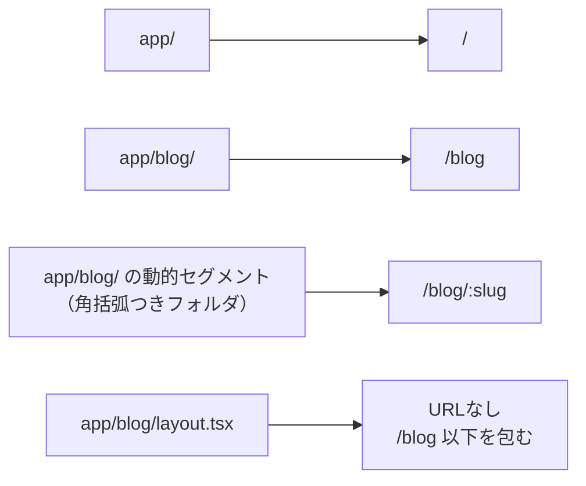
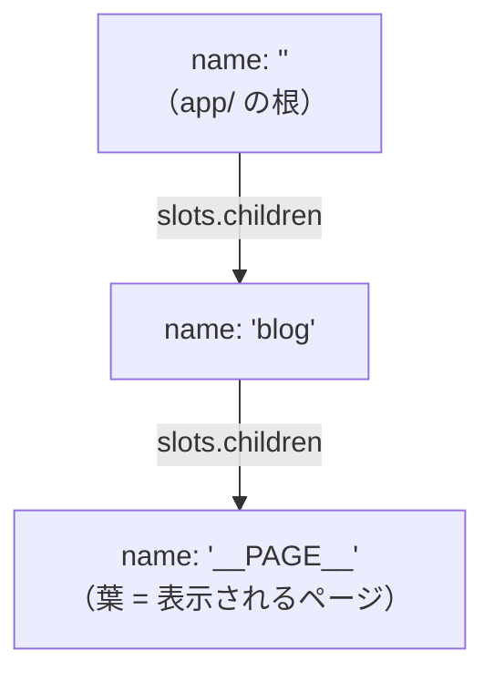
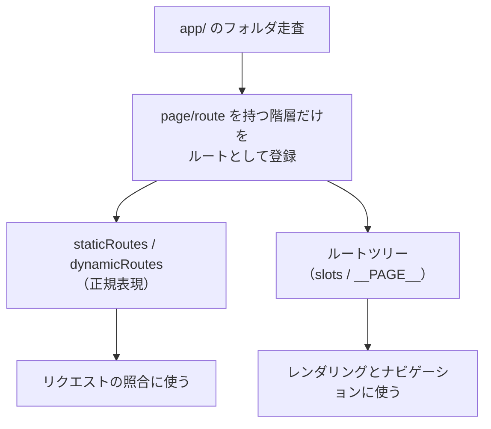
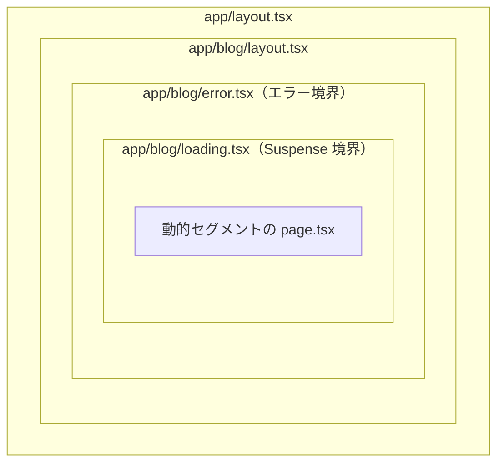
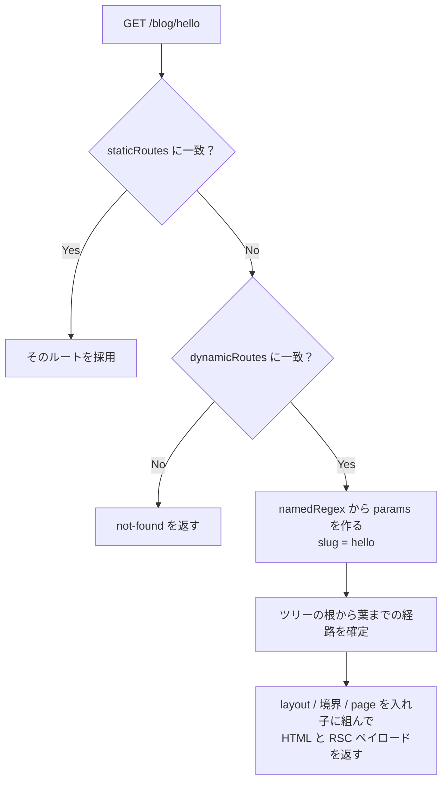
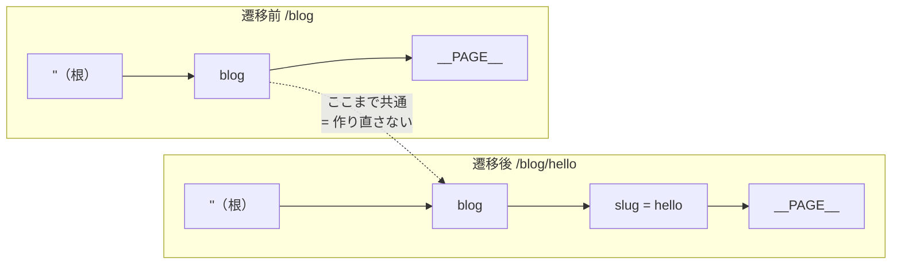
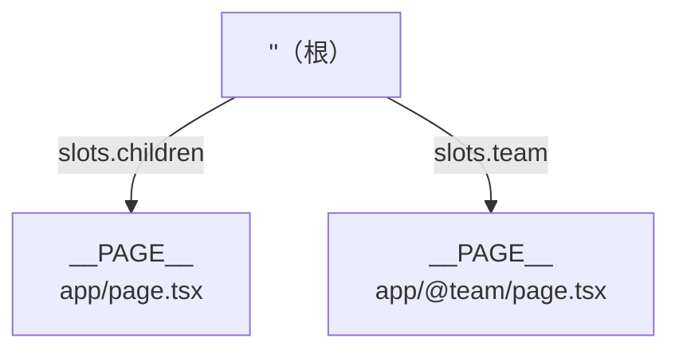
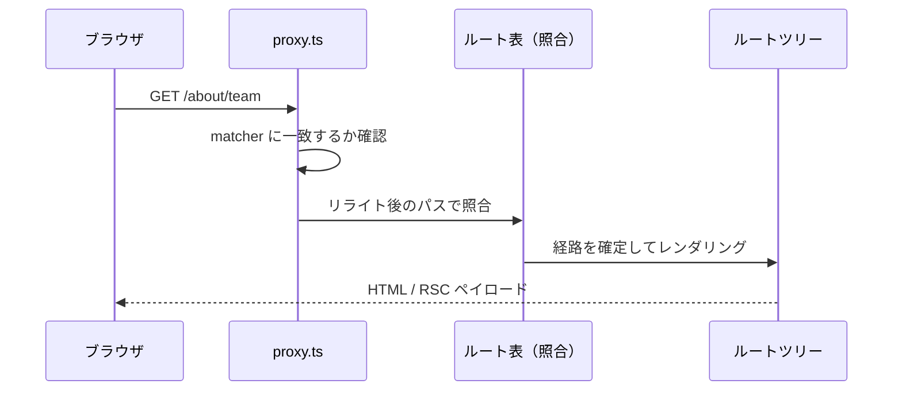
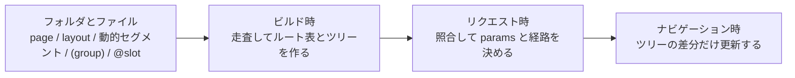

`app/blog/[slug]/page.tsx` を置くと `/blog/hello` が表示されます。この対応は覚えやすいのですが、覚えただけでは答えられない疑問がいくつも残ります。リンクで移動したとき `layout.tsx` の状態が保持されるのはなぜか。`(marketing)` フォルダがURLから消えるのはなぜか。並列ルートで `default.tsx` を置かないとエラーになるのはなぜか。

これらが答えにくいのは、規約を「フォルダとURLの対応表」として覚えているからです。実際のNext.jsは、ビルド時にフォルダ構造を1つのルートツリーへ変換し、そこから作った照合表でリクエストを解決し、クライアント遷移ではツリーの差分だけを更新します。段階は3つあり、個々の規約はそのどこかへの入力にすぎません。

この記事は Next.js 16.2 の App Router を対象に、最小のアプリを1つ用意して3段階を順に追います。ビルド生成物とHTTPレスポンスは、そのアプリで実際に得たものをそのまま載せます。

## 題材を1つ決める

以降はこのアプリだけを追います。ファイルは5つです。

```
app/
├─ layout.tsx
├─ page.tsx
└─ blog/
   ├─ layout.tsx
   ├─ page.tsx
   └─ [slug]/
      └─ page.tsx
```

```tsx:app/layout.tsx
export default function RootLayout({ children }: { children: React.ReactNode }) {
  return (
    <html lang="ja">
      <body>{children}</body>
    </html>
  );
}
```

```tsx:app/blog/layout.tsx
export default function BlogLayout({ children }: { children: React.ReactNode }) {
  return <section>{children}</section>;
}
```

```tsx:app/blog/[slug]/page.tsx
export default async function Post({ params }: { params: Promise<{ slug: string }> }) {
  const { slug } = await params;
  return <h1>{slug}</h1>;
}
```

残りの `app/page.tsx` と `app/blog/page.tsx` は、それぞれ次の階層へのリンクを1つ返すだけです。

規約の出発点は2つだけです。**フォルダがURLセグメントを決め、ファイルがそのセグメントで何を出すかを決めます**。そして公式ドキュメントの言い方を借りると、ルートは `page.js` か `route.js` が置かれるまで公開されません。フォルダを掘っただけではURLは生えません。



この「公開されるまではただのフォルダ」という性質が、コンポーネントやテストを使う場所の隣に置ける理由でもあります。Next.js側から見れば、走査したときに `page` も `route` も見つからない階層は、ルートとして登録されないだけです。

## ビルド時：ツリーがルート表になる

`next build` を実行すると、まず何がルートとして認識されたかが表示されます。

```
Route (app)
┌ ○ /
├ ○ /_not-found
├ ○ /blog
└ ƒ /blog/[slug]

○  (Static)   prerendered as static content
ƒ  (Dynamic)  server-rendered on demand
```

**観測ポイント1**はここです。5つのファイルから4つのルートが登録され、`app/blog/layout.tsx` は1行も現れていません。レイアウトは登録の対象外で、ルートを包む部品として扱われます。`/_not-found` はこちらが書いていないルートで、Next.jsが自動で足したものです。

より重要な生成物は `.next/` にあります。ビルドは走査結果を静的なJSONに落とします。

```json:.next/app-path-routes-manifest.json
{
  "/_global-error/page": "/_global-error",
  "/_not-found/page": "/_not-found",
  "/blog/[slug]/page": "/blog/[slug]",
  "/blog/page": "/blog",
  "/page": "/"
}
```

左がファイル上の位置、右がURLパターンです。同じ対応が、実行するモジュールの位置つきでもう一度記録されます。

```json:.next/server/app-paths-manifest.json
{
  "/blog/[slug]/page": "app/blog/[slug]/page.js",
  "/blog/page": "app/blog/page.js",
  "/page": "app/page.js"
}
```

そして照合そのものに使われるのが `routes-manifest.json` です。ここで角括弧が正規表現になります。

```json:.next/routes-manifest.json（抜粋）
"staticRoutes": [
  { "page": "/",     "regex": "^/(?:/)?$" },
  { "page": "/blog", "regex": "^/blog(?:/)?$" }
],
"dynamicRoutes": [
  {
    "page": "/blog/[slug]",
    "regex": "^/blog/([^/]+?)(?:/)?$",
    "routeKeys": { "nxtPslug": "nxtPslug" },
    "namedRegex": "^/blog/(?<nxtPslug>[^/]+?)(?:/)?$"
  }
]
```

「ファイルベースルーティング」の実体はこの表です。`[slug]` というフォルダ名は `([^/]+?)` というマッチャに変換され、名前つきキャプチャ `nxtPslug` を通じて `params` へ渡る値の取り出し口になります。静的ルートと動的ルートが別の配列に分かれている点も、あとで優先順位の話につながります。

もう1つ、ツリーそのものが保存された生成物があります。`/blog` を事前レンダリングした結果の隣に置かれるファイルです。

```json:.next/server/app/blog.segments/_tree.segment.rsc
{
  "tree": {
    "name": "",
    "param": null,
    "slots": {
      "children": {
        "name": "blog",
        "param": null,
        "slots": {
          "children": { "name": "__PAGE__", "param": null, "slots": null }
        }
      }
    }
  },
  "staleTime": 300,
  "buildId": "MsLE48x65hnaAFrUsCGKG"
}
```

読み方は素直です。根が空文字（`app/` そのもの）、その `children` が `blog`、さらにその `children` が `__PAGE__` という葉です。図にすると次の形です。



フォルダの入れ子が、そのままスロットの入れ子として直列化されています。枝の名前が `children` であること、葉に `__PAGE__` という特別な名前が使われていることは、あとで並列ルートを説明するときに効いてきます。

ここで押さえておきたいのは、実行時のNext.jsはもうフォルダを走査していないことです。走査はビルドで終わっており、実行時に残るのはルート表とツリーだけです。



## 初回アクセス：`/blog/hello` を1回追う

ブラウザのアドレスバーに `/blog/hello` を入れたときに何が起きるかを、上の表とツリーだけで説明できます。

まずパスが照合されます。順序には規則があり、静的ルートが動的ルートより先に試されます。これは表が別配列に分かれていることと対応します。実際に `app/blog/authors/page.tsx`（静的）と `app/blog/[...rest]/page.tsx`（catch-all）を足した状態で、3つのURLを叩くと次のようになりました。

| URL | 一致したルート |
| --- | --- |
| `/blog/authors` | `app/blog/authors/page.tsx` |
| `/blog/hello` | `app/blog/[slug]/page.tsx` |
| `/blog/a/b` | `app/blog/[...rest]/page.tsx` |

静的セグメントが最優先で、次に単一の動的セグメント、最後にcatch-allです。`/blog/hello` は `[...rest]` にもマッチしますが、より具体的な `[slug]` が勝ちます。

この優先順位は「具体的なほうが勝つ」という一言で済みますが、区別できない組み合わせは最初から作れません。同じ階層に `[slug]` と `[id]` を並べてビルドすると、パターンが同一になるため失敗します。

```
Error: Ambiguous app routes detected:

Ambiguous route pattern "/blog/[*]" matches multiple routes:
  - /blog/[id]
  - /blog/[slug]

These routes cannot be distinguished from each other when matching URLs.
```

一方 `[slug]` と `[...rest]` は共存できました。前者は1セグメント、後者は1つ以上のセグメントにマッチするため、正規表現として区別がつくからです。

ルートが決まると、値の取り出しが起きます。`namedRegex` のキャプチャから `hello` が取れ、`params` として渡されます。ここで `params` が Promise である点に触れておきます。

```tsx
export default async function Post({ params }: { params: Promise<{ slug: string }> }) {
  const { slug } = await params;
  return <h1>{slug}</h1>;
}
```

Next.js 14以前は同期的なオブジェクトでした。15以降はPromiseになり、`await` か React の `use()` で開く必要があります。値そのものは照合時点で確定していますが、リクエスト時のデータへのアクセスを非同期の境界として扱うことで、ページ全体をブロックせずに静的な外枠を先に返せる設計になっています。

最後にレンダリングです。**経路上のレイアウトは、ツリーの根から葉までを辿って決まります**。`/blog/hello` の場合は `app/layout.tsx` → `app/blog/layout.tsx` → `app/blog/[slug]/page.tsx` の順に入れ子になります。`app/blog/layout.tsx` は `/blog` のためのファイルではなく、`blog` セグメント以下すべてを包むノードだからです。

同じ階層に特殊ファイルを増やしたときの包み方も、この経路の上で決まります。公式ドキュメントが挙げている階層は次の順です。

1. `layout.js`
2. `template.js`
3. `error.js`（React のエラー境界）
4. `loading.js`（React の Suspense 境界）
5. `not-found.js`（not found 用のエラー境界）
6. `page.js` または入れ子の `layout.js`

つまり `loading.tsx` を置く行為は、その階層に Suspense 境界を1つ張ることと同じです。境界の位置がフォルダの位置で決まる、というのがファイルベースの効き方です。ネストしたルートでは、この階層が親セグメントの内側に再帰的に入ります。題材のアプリに `loading.tsx` と `error.tsx` を1つずつ足すと、包まれ方はこうなります。



ここまでを1本の流れに戻すと、初回アクセスの処理は次のように進みます。



## 2回目：`/blog` からリンクで入る

同じ `/blog/hello` に、今度は `/blog` のリンク経由で入ります。結果の画面は同じですが、通信とレンダリングは別物です。

`next/link` は、リンクがビューポートに入った時点で遷移先を先読みします。そして遷移時に取りに行くのは、Server Componentのレンダリング結果です。**観測ポイント2**として、そのリクエストを手元で再現できます。

```
$ curl -s -D - -H "RSC: 1" http://localhost:3111/blog/hello
Content-Type: text/x-component
Vary: rsc, next-router-state-tree, next-router-prefetch, next-router-segment-prefetch, Accept-Encoding

1:"$Sreact.fragment"
2:I[90132,["/_next/static/chunks/288kjjkvap1x6.js", ...],"default"]
...
```

`text/x-component` がRSCペイロードです。返ってくるのは、ツリーの一部を差し替えるためのデータだけです。ページ全体のHTMLは取り直しません。`Vary` に並んでいるヘッダー名は、このレスポンスがルーターの状態（`next-router-state-tree`）や先読みかどうか（`next-router-prefetch`）によって変わることを示しています。クライアントは自分が今持っているツリーをサーバーへ伝え、必要な部分だけを受け取ります。

ここで、レイアウトの挙動が説明できます。`/blog` と `/blog/hello` のツリーを並べると、違いは葉だけです。



根と `blog` セグメントは共通で、差分は葉の側にしかありません。共通の接頭辞が保たれるため、`app/layout.tsx` と `app/blog/layout.tsx` は再レンダリングされず、状態も保持されます。ドキュメントの「レイアウトはナビゲーションをまたいで状態を保持し、再レンダリングされない」という記述は、このツリーの差分更新の言い換えです。

同じ理由で `template.tsx` の存在意味も決まります。こちらは遷移ごとに新しいインスタンスとして再マウントされます。「保持したいなら layout、リセットしたいなら template」という選択は、差分更新の対象に含めるかどうかの指定にほかなりません。

そしてスロットです。ツリーのノードが持っていた `slots.children` は、暗黙のスロットです。ドキュメントは `app/page.js` が `app/@children/page.js` と等価だと明記しています。`@folder` を作ると、この暗黙のスロットの隣に名前つきスロットが増えます。

```
app/
├─ layout.tsx        ← children と team の2つを props で受け取る
├─ page.tsx
└─ @team/
   └─ page.tsx
```



`@team` はURLセグメントになりません。ツリーに枝が1本増えるだけです。ここまで来ると `default.tsx` が必要になる理由も、差分更新の裏返しとして読めます。クライアント遷移では、Next.jsはスロットごとに「いまどのサブページが有効か」を覚えています。ところがリロード（ハードナビゲーション）ではその状態が失われ、URLに一致しないスロットに何を表示すべきか決められません。そこで置かれるフォールバックが `default.tsx` で、これがないと名前つきスロットは404やエラーになります。

インターセプトルートの `(.)` `(..)` `(...)` も同じ土台です。相対パスに似ていますが、基準はファイルシステムではなくルートセグメントです。だから `@modal` のようなスロットは段数に数えません。ファイル階層では2つ上にあるルートが、セグメントとしては1つ上なので `(..)` で届く、という現象が起きます。

なお、クライアント側のキャッシュ（訪問済み・先読み済みのペイロードを保持する仕組み）にも保持期間や無効化の規則がありますが、ルーティングの解決とは別の話題なのでここでは扱いません。

## ツリーにあるがURLに出ないもの

ここまでで「フォルダ＝セグメント」を前提にしてきましたが、走査規則には例外があります。例外はどれも、ツリーには現れるがURLには出ない（あるいはツリーにも入らない）という形をとります。

| 書き方 | 走査時の扱い | URL |
| --- | --- | --- |
| `(marketing)` | 整理用のグループ。中のルートは親階層に属する | 出ない |
| `_components` | ルーティングから除外。配下すべてが対象外 | 出ない |
| `@modal` | 名前つきスロットとしてツリーに入る | 出ない |
| `src/app` | `app` の置き場所を1段深くする | 影響なし |

ルートグループが効くのは、URLを変えずにレイアウトを分けられる点です。`(marketing)/layout.tsx` と `(shop)/layout.tsx` は同じURL階層に別のレイアウトを与えます。ルート直下の `layout.tsx` を削ってグループごとに置けば、`<html>` と `<body>` を持つルートレイアウトを複数持つこともできます。

アンダースコアのフォルダは、走査から明示的に外す指定です。前述のとおり `page` を置かなければ公開されないので、コロケーション目的では必須ではありません。将来の特殊ファイル名との衝突を避けたい場合や、エディタ上で並び順を分けたい場合に使います。ちなみに `_` で始まるURLセグメントが必要なときは、URLエンコードした `%5F` を頭につけます。

## 照合の外側：`proxy.ts`

ここまでの照合より前に動く層が1つあります。Next.js 16で `middleware.ts` から改名された `proxy.ts` です。プロジェクトルート（`app` と同じ階層。`src` を使う場合はその中）に1ファイルだけ置けます。

```ts:proxy.ts
import { NextResponse } from 'next/server'
import type { NextRequest } from 'next/server'

export function proxy(request: NextRequest) {
  return NextResponse.redirect(new URL('/home', request.url))
}

export const config = {
  matcher: '/about/:path*',
}
```

役割はリクエストが完了する前に割り込むことです。ヘッダーの書き換え、リダイレクト、リライトを担います。



ルーティングの観点でおさえたいのは、リライトを書くとURLとルート表の対応が意図的にずれることです。`/about` に来たリクエストを別のルートへ流せば、ブラウザに見えるURLと実際に照合されたツリー上の経路は一致しません。フォルダ構造だけを見て「このURLはこのファイル」と言い切れなくなる唯一の場所なので、`proxy.ts` の有無は最初に確認する価値があります。

改名の理由は、ネットワーク境界を明示することだそうです。ドキュメントには、遅いデータ取得の置き場所として使わないこと、セッション管理や認可をここだけで完結させないことが明記されています。

## 付録：ファイル規約の早見表

ここまでに出てきたファイルを、役割ごとに1枚にまとめます。

| ファイル | 役割 |
| --- | --- |
| `page` | そのセグメントを公開し、固有のUIを返す |
| `route` | そのセグメントをAPIエンドポイントとして公開する |
| `layout` | 配下を包む。遷移をまたいで保持される |
| `template` | 配下を包む。遷移ごとに再マウントされる |
| `loading` | その階層にSuspense境界を張る |
| `error` | その階層にエラー境界を張る |
| `global-error` | ルートレイアウトを含む全体のエラー境界 |
| `not-found` | not found 時のUI |
| `default` | 並列ルートで復元できないスロットのフォールバック |

「ファイルを置くとそれが出力になる」という発想は、ルーティング以外にも同じ形で使われています。`sitemap.ts` / `robots.ts` は生成されたテキストを返すエンドポイントになり、`opengraph-image` / `icon` / `apple-icon` は画像を返すエンドポイントになります。静的ファイルとして置いても、コードで生成しても構いません。

Pages Routerから来た場合の対応は次のとおりです。

| Pages Router | App Router |
| --- | --- |
| `pages/index.tsx` | `app/page.tsx` |
| `pages/blog/[slug].tsx` | `app/blog/[slug]/page.tsx` |
| `pages/_app.tsx` | `app/layout.tsx` |
| `pages/_document.tsx` | `app/layout.tsx`（`<html>` と `<body>` を含む） |
| `pages/404.tsx` | `app/not-found.tsx` |
| `pages/api/foo.ts` | `app/api/foo/route.ts` |
| `getStaticProps` / `getServerSideProps` | Server Component 内で直接取得 |
| `middleware.ts` | `proxy.ts` |

最大の違いは、ルートの単位がファイルからフォルダに変わったことです。Pages Routerでは1ファイルが1ルートでした。App Routerではフォルダが1セグメントで、その中の複数のファイルが役割分担します。だからこそ、レイアウトや境界を階層に紐づけられます。

## まとめ

App Routerのファイル規約は、3つの段階への入力として整理できます。



- **ビルド時**：`app/` を走査し、`page` または `route` を持つ階層をルートとして登録する。角括弧は正規表現になり、フォルダの入れ子はスロットの入れ子として直列化される。
- **リクエスト時**：静的 → 動的 → catch-all の順に照合し、キャプチャから `params` を作る。経路が決まると、根から葉までのレイアウトと境界も決まる。
- **ナビゲーション時**：クライアントが持つツリーとの差分だけを更新する。共通接頭辞が保たれるのでレイアウトは再レンダリングされず、`template` は再マウントされ、一致しないスロットには `default` が要る。

新しい規約を覚えるときは、対応表に1行足すのをやめて、この3段階のどこに効く指定なのかを置き直してみてください。フォルダ構造から挙動を読めるようになります。手元で確かめたいときに見る場所は3つです。`next build` の出力、`.next/routes-manifest.json`、そして `RSC: 1` を付けたリクエスト。この記事の主張は全部そこに書かれています。
