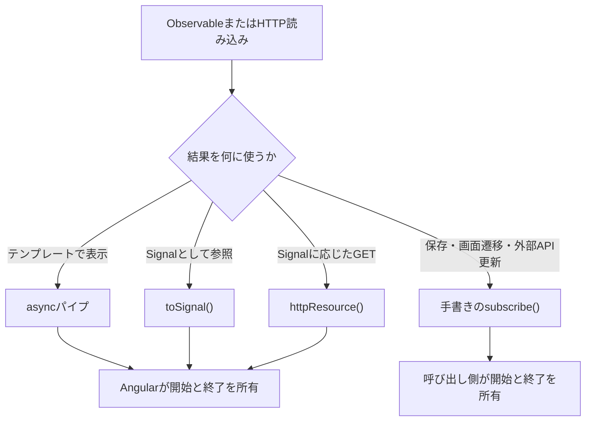
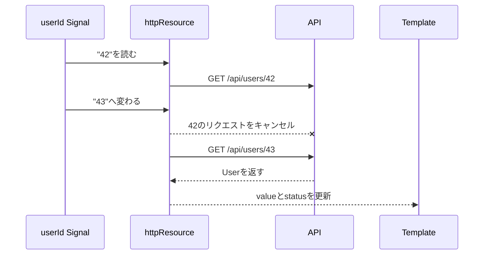

AngularでAPIからデータを取得するとき、次のようなコードを書いた経験はないでしょうか。

```ts
this.http.get<User>('/api/users/42').subscribe((user) => {
  this.user.set(user);
});
```

動きます。ちゃんと表示されます。だから私はこれを何十回も書きました。

問題は、その後に来ます。

画面に値を出したいだけで`subscribe()`して、受け取った値を別の`Signal`（Angularが変更を追跡する状態）やプロパティへ移す。この形にした瞬間、購読解除も、エラーとローディングの状態管理も、再取得の面倒も、全部コンポーネントが引き受けることになります。

だからといって、`subscribe()`が不要になったわけではありません。`HttpClient`が返す`Observable`でHTTPリクエストを始めるには、購読が必要です。ここは変わりません。考えるべきなのは、**誰が購読を所有し、開始と終了に責任を持つか**です。

この記事では、Angular 22を前提に、`async`パイプ、`toSignal()`、`httpResource()`、手書きの`subscribe()`を使い分けます。読み終えると、コンポーネントにある`subscribe()`を見て、残すべきかAngularへ任せるべきか判断できるようになります。

## 購読は要る。自分で書くかは別

`HttpClient`の各メソッドは`Observable`を返します。`Observable`は、時間とともに届く値、エラー、完了を受け取る仕組みです。

`HttpClient`が返す`Observable`は、購読されるまで処理を始めないCold Observableです。購読されるまで、何も始まりません。`get()`を呼んだだけでは通信は発生せず、購読するたびに独立したHTTPリクエストが送られます。

```ts
const user$ = this.http.get<User>('/api/users/42');

// この時点では、まだリクエストは送られていない
```

通信を始めるには、どこかに購読者が必要です。手書きとは限りません。Angularには、用途に応じて購読と後始末を引き受ける仕組みがあります。



利用目的から購読の所有者を決めます。用途が先、手段は後です。テンプレートや`Signal`が値を読むなら、Angularへ購読を任せられます。保存完了後の画面遷移など、値の計算以外に別の処理を起こす「副作用」を呼び出し側が所有するときだけ、手書きの`subscribe()`を残します。

## 表示するだけなら、書かなくていい

まず、ユーザー情報を取得するサービスを用意します。この記事のコード例では、次の`User`型と`UserService`を共通で使います。

```ts:src/app/user.service.ts
import { HttpClient } from '@angular/common/http';
import { inject, Injectable } from '@angular/core';
import { Observable } from 'rxjs';

export interface User {
  id: string;
  name: string;
  email: string;
}

export type UserUpdate = Pick<User, 'name' | 'email'>;

@Injectable({ providedIn: 'root' })
export class UserService {
  private readonly http = inject(HttpClient);

  getUser(id: string): Observable<User> {
    return this.http.get<User>(`/api/users/${id}`);
  }

  updateUser(id: string, update: UserUpdate): Observable<User> {
    return this.http.put<User>(`/api/users/${id}`, update);
  }
}
```

`getUser()`はリクエストを送らず、`Observable`を返すところまでを担当します。利用側が購読した時点でGETが始まり、レスポンスは`User`として流れます。`User`という型引数はTypeScript上の期待を示すだけで、実行時にレスポンスの構造を検証するものではありません。

取得結果をテンプレートで表示するだけなら、`AsyncPipe`が購読者になれます。表示だけなら、手書きは不要です。

```ts:src/app/user-profile.component.ts
import { AsyncPipe } from '@angular/common';
import { Component, inject } from '@angular/core';
import { UserService } from './user.service';

@Component({
  selector: 'app-user-profile',
  imports: [AsyncPipe],
  template: `
    @if (user$ | async; as user) {
      <h1>{{ user.name }}</h1>
      <p>{{ user.email }}</p>
    }
  `,
})
export class UserProfileComponent {
  private readonly users = inject(UserService);

  protected readonly user$ = this.users.getUser('42');
}
```

テンプレートの`user$ | async`が`Observable`を購読し、届いた最新値を返します。値が届くと、`AsyncPipe`はコンポーネントを変更検知の対象としてマークします。コンポーネントが破棄されたときや、渡された`Observable`の参照が変わったときは、古い購読を自動で解除します。

このコンポーネントには、`user`を保持する別のフィールドがありません。購読と表示の寿命がテンプレートにそろうため、`ngOnDestroy`も不要です。

同じ`Observable`へ複数の`async`パイプを適用すると、それぞれが購読者になります。HTTPのCold Observableなら、購読数と同じ回数のリクエストが発生します。テンプレートの複数箇所で使う場合は、`@let`で一度だけ値を取り出すと意図が明確です。

```html
@let user = user$ | async;

@if (user) {
  <h1>{{ user.name }}</h1>
  <p>{{ user.email }}</p>
}
```

`async`パイプが引き受けるのは、購読と最新値の受け渡しです。ローディング表示もエラー表示も、別に設計します。たとえば`user$ | async`は最初の値が届くまで`null`を返しますが、「読み込み中」や「取得失敗」という表示用の状態は作りません。画面で状態を分けるなら、`catchError()`などで表示用の`Observable`へ整えるか、状態をまとめて扱える`httpResource()`を検討します。

`async`パイプは、表示のための購読に向いています。コンポーネントの処理から現在値を同期的に読みたい場合は、次の`toSignal()`が候補になります。

## コンポーネントから現在値を読むなら`toSignal()`へ変換する

`toSignal()`は`Observable`を購読し、最新値を`Signal`として公開します。この例のようにコンポーネントの注入コンテキストで作ると、コンポーネントが破棄されたときに内部の購読も自動で解除されます。寿命もそろいます。

```ts:src/app/user-profile.component.ts
import { Component, computed, inject } from '@angular/core';
import { toSignal } from '@angular/core/rxjs-interop';
import { UserService } from './user.service';

@Component({
  selector: 'app-user-profile',
  template: `
    @if (user(); as currentUser) {
      <h1>{{ currentUser.name }}</h1>
      <p>{{ currentUser.email }}</p>
      <p>{{ label() }}</p>
    }
  `,
})
export class UserProfileComponent {
  private readonly users = inject(UserService);

  protected readonly user = toSignal(this.users.getUser('42'));
  protected readonly label = computed(
    () => this.user()?.email ?? 'メールアドレスを取得中',
  );
}
```

`toSignal()`は呼び出された時点で`Observable`を購読します。HTTPレスポンスが届く前は、`user()`が`undefined`を返します。例のように`computed()`内でも現在値を読めるため、取得結果をほかの`Signal`と組み合わせやすくなっています。

ここで、`toSignal()`をメソッドやテンプレートから繰り返し呼ばないでください。呼ぶたびに新しい購読が作られ、同じHTTPリクエストが重複します。フィールド初期化などで一度だけ変換し、返された`Signal`を再利用します。

エラーの扱いにも注意が必要です。失敗時は挙動が変わります。変換元の`Observable`がエラーを流すと、`toSignal()`はそのエラーを`Signal`の読み取り時に投げます。画面へエラー状態を表示するなら、変換前に`catchError()`で表示用の状態へ変えるか、値・ローディング・エラーをまとめて持つ`httpResource()`を検討します。

`toSignal()`が向くのは、既存のサービスが`Observable`を公開しており、その結果を`Signal`中心のコンポーネントへ接続したい場面です。GETの条件自体が`Signal`で変化するなら、`httpResource()`を使うと、コンポーネントが担う責務を減らせます。

## `Signal`に応じたGETは`httpResource()`が状態まで所有する

ユーザーIDが変わるたびにプロフィールを取り直す画面を考えます。手書きの`subscribe()`では、古いリクエストのキャンセル、ローディング、エラー、最新値を個別に管理する必要があります。

`httpResource()`は、HTTPレスポンスとリクエスト状態を`Signal`としてまとめて公開します。次の例では、コンポーネントの入力として受け取った`userId`からURLを作ります。

```ts:src/app/user-profile.component.ts
import { httpResource } from '@angular/common/http';
import { Component, input } from '@angular/core';
import { User } from './user.service';

@Component({
  selector: 'app-user-profile',
  template: `
    @if (userResource.isLoading()) {
      <p>読み込み中です</p>
    } @else if (userResource.error()) {
      <p>ユーザー情報を取得できませんでした</p>
    } @else if (userResource.hasValue()) {
      <h1>{{ userResource.value().name }}</h1>
      <p>{{ userResource.value().email }}</p>
    }
  `,
})
export class UserProfileComponent {
  readonly userId = input.required<string>();

  protected readonly userResource = httpResource<User>(
    () => `/api/users/${this.userId()}`,
  );
}
```

`httpResource<User>()`の型引数も、実行時のレスポンスを検証しません。型だけでは足りません。外部APIの応答を実行時に検証したい場合は、`parse`オプションへスキーマのパーサーを渡します。

`httpResource()`へ渡した関数は、評価中に読み取った`Signal`を依存関係として記録します。この例では`userId()`が変わるとURLが再計算され、新しいGETが始まります。前のリクエストが処理中なら、Angularがそのリクエストをキャンセルしてから次を送ります。

次の図では、`userId`が42から43へ変わったとき、古いGETを中止してから新しいGETを送る順序を見てください。



テンプレートは、`isLoading()`、`error()`、`hasValue()`を読んで状態を分岐します。たとえばGETが404で失敗した後に`value()`を読むと、実行時に例外が投げられます。例のように`hasValue()`で確認してから値を読みます。

この例のリソースは、コンポーネントの注入コンテキストで作られます。コンポーネントと同じ寿命で扱われ、リソースが破棄されると処理中のリクエストも中止されます。必要なら`destroy()`を呼び、明示的に破棄することもできます。

開始時期も違います。`HttpClient`は購読されるまで通信しませんが、`httpResource()`は作成時にリクエストを開始します。テンプレートで値を読んでいなくてもGETが始まるため、ユーザー操作まで通信を遅らせたい処理には合いません。

また、`httpResource()`は主にデータの読み込みに使います。公式ガイドは、POSTやPUTのようにサーバーの状態を変える処理には、直接`HttpClient`を使うよう案内しています。使いどころは別です。

## 残していい`subscribe()`もある

ユーザーが「保存」ボタンを押したときだけPUTを送り、成功したら詳細画面へ移動する処理を考えます。ボタンが起点です。これは現在値として存在し続けるデータではなく、利用者が明示的に起こす操作です。

`HttpClient`の更新系メソッドが返す`Observable`も、購読しなければリクエストを送りません。保存結果に応じて画面遷移やエラー表示を行うなら、手書きの`subscribe()`が実行の境界になります。

```ts:src/app/user-edit.component.ts
import { Component, DestroyRef, inject, signal } from '@angular/core';
import { takeUntilDestroyed } from '@angular/core/rxjs-interop';
import { Router } from '@angular/router';
import { finalize } from 'rxjs';
import { UserService, UserUpdate } from './user.service';

@Component({
  selector: 'app-user-edit',
  template: `<!-- フォームの詳細は省略 -->`,
})
export class UserEditComponent {
  private readonly users = inject(UserService);
  private readonly router = inject(Router);
  private readonly destroyRef = inject(DestroyRef);

  protected readonly saving = signal(false);
  protected readonly errorMessage = signal<string | null>(null);

  save(update: UserUpdate): void {
    if (this.saving()) return;

    this.saving.set(true);
    this.errorMessage.set(null);

    this.users
      .updateUser('42', update)
      .pipe(
        takeUntilDestroyed(this.destroyRef),
        finalize(() => this.saving.set(false)),
      )
      .subscribe({
        next: (user) => void this.router.navigate(['/users', user.id]),
        error: () => this.errorMessage.set('保存に失敗しました'),
      });
  }
}
```

コード例は購読の責務へ焦点を当てた抜粋です。フォーム入力とテンプレート上のエラー表示は省略しています。

処理は次の順序で進みます。

1. `saving()`が`true`なら、二重送信を防ぐため何もしない。
2. 保存中とエラーなしの状態へ更新する。
3. `subscribe()`によってPUTを開始する。
4. 成功したら、返されたユーザーIDを使って画面を移動する。
5. 失敗したら、コンポーネントが表示するエラーメッセージを設定する。
6. 成功、失敗、購読解除のどの経路でも、`finalize()`が`saving`を`false`へ戻す。

`takeUntilDestroyed()`は、コンポーネントが破棄されたときに購読を終了します。通常のHTTP `Observable`はレスポンス後に完了しますが、画面を離れた時点で処理中なら、購読解除によってリクエストを中止できます。破棄済みのコンポーネントへコールバックが戻ることも防げます。

この`subscribe()`には、PUTを開始し、成功時と失敗時の画面動作を決める役割があります。値を別のフィールドへコピーするだけの購読とは、責務が違います。

同じ考え方は、`Observable`の値を命令的なAPIへ渡す場所にも当てはまります。WebSocketで受け取った価格を外部のチャートへ渡す、音声を再生する、監査ログを送るといった処理です。テンプレートのデータバインディングで表現できない副作用なら、境界に`subscribe()`を置く意味があります。

`firstValueFrom()`で`Observable`を`Promise`へ変換し、`await`する書き方もあります。見た目から`subscribe()`は消えますが、内部では購読が行われます。キャンセルやエラーを誰が扱うかという設計課題は残ります。

## `subscribe()`の中へ`subscribe()`を重ねない

手動購読が必要でも、`subscribe()`の中で別の`Observable`を購読すると、キャンセルとエラーの経路が分かれます。構造が二重になります。次の例は購読構造だけを示す抜粋です。`selectedUserId$`は選択されたIDを流す`Observable`で、`showUser()`の定義は省略しています。

```ts
// 避けたい形
this.selectedUserId$.subscribe((id) => {
  this.users.getUser(id).subscribe((user) => {
    this.showUser(user);
  });
});
```

外側の購読を解除しても、すでに始まった内側の購読を別に管理しなければなりません。IDが素早く変わったときに、古いレスポンスが後から届く可能性もあります。

`Observable`同士の依存関係は、`switchMap()`などの演算子で一つの流れにまとめます。表示に使うなら`async`パイプか`toSignal()`へ渡し、副作用を起こすなら最後に一度だけ`subscribe()`します。

```ts
import { Observable, switchMap } from 'rxjs';
import { User, UserService } from './user.service';

function loadSelectedUser(
  selectedUserId$: Observable<string>,
  users: UserService,
): Observable<User> {
  return selectedUserId$.pipe(
    switchMap((id) => users.getUser(id)),
  );
}
```

`switchMap()`は新しいIDが流れると、前の内側`Observable`を購読解除します。`HttpClient`では購読解除が処理中のHTTPリクエストの中止につながるため、古いレスポンスとの競合も避けられます。

## 使い分けは購読の所有者で決める

ここまでの選択肢を、目的と所有者で整理します。

判断の軸は、購読の所有者。

| 目的                                     | 選ぶ手段                     | 購読の所有者                           | 手書きの`subscribe()` |
| ---------------------------------------- | ---------------------------- | -------------------------------------- | --------------------- |
| `Observable`をテンプレートで表示する     | `async`パイプ                | テンプレート                           | 不要                  |
| `Observable`の最新値を`Signal`として読む | `toSignal()`                 | 作成したコンポーネントまたはサービス   | 不要                  |
| `Signal`に応じてGETし、状態も表示する    | `httpResource()`             | リソース                               | 不要                  |
| POST・PUT・DELETEを操作として実行する    | `HttpClient`                 | 操作を開始するコンポーネントやサービス | 候補になる            |
| 外部ライブラリへ値を渡す                 | RxJSと`takeUntilDestroyed()` | 副作用の境界                           | 候補になる            |

「`subscribe()`を書いているか」だけでは、設計の良し悪しは決まりません。見るのは責任の置き場所です。購読を始める責任や、エラー・終了を扱う責任を、その用途に最も近い場所へ置けているかを確認します。

## 困ったときは購読数・終了条件・変更通知を確認する

非同期処理の不具合には、調べる順番があります。`subscribe()`の有無だけで判断せず、次の順序で切り分けます。

### リクエストが送られないときは購読者を探す

まずブラウザーの開発者ツールでネットワークパネルを確認します。`get()`や`post()`を呼んだのに通信がなければ、その`Observable`に購読者がいるかを探します。

`async`パイプ、`toSignal()`、手書きの`subscribe()`は購読を作ります。`httpResource()`は例外で、作成時にリクエストを始めます。

### 複数回送られるときは購読数を数える

同じHTTP `Observable`を何回購読しているか確認します。`async`パイプを複数箇所で使ったり、`toSignal()`を繰り返し呼んだりすると、購読ごとに新しいリクエストが発生します。

表示だけなら`@let`で一度だけ値を取り出します。複数の購読者で同じ実行結果を共有する必要がある場合は、`shareReplay()`も候補になります。ただし、キャッシュの寿命と再取得条件を決めてから使います。

### 画面を離れた後も動くなら終了条件を確認する

長時間続く`Observable`や処理中のHTTP購読に、終了条件があるかを確認します。テンプレートなら`async`パイプ、コンポーネントの注入コンテキストで作った`toSignal()`、手動購読なら`takeUntilDestroyed()`でコンポーネントの寿命へ結び付けられます。

HTTP `Observable`は通常レスポンス後に完了するため、解除漏れが直ちに永続的なメモリリークになるとは限りません。それでも、破棄後のコールバック実行や、不要になったリクエストを避けるために終了条件を持たせます。

### 画面が更新されないときは変更通知を確認する

Angular 21以降はZonelessが既定です。Zonelessでは、Angularが通知を受けて変更検知を実行します。テンプレートから読まれている`Signal`の更新や、`AsyncPipe`による`markForCheck()`は通知になります。

手動購読の中で通常のプロパティへ代入するだけでは、Angularが変更を検知できない場合があります。表示する状態は`Signal`へ置くか、`AsyncPipe`を使います。命令的な連携で通常のプロパティを使う必要があるなら、`ChangeDetectorRef.markForCheck()`を呼ぶ場所を明示します。

## 既存の`subscribe()`は3つの質問で見直す

既存コードを見直すときは、`subscribe()`を機械的に削除しないでください。次の3点を確認します。

1. この購読は、値をどこへ渡すためにあるか。
2. 購読の終了を誰が決めるか。
3. `async`パイプ、`toSignal()`、リソースへ所有権を移せるか。

答えは用途で変わります。`HttpClient`の`Observable`からレスポンスを受け取るには購読者が必要です。ただし、テンプレート表示のために値をコピーするだけなら、Angularへ購読を任せられます。保存後の画面遷移や外部API更新など、命令的な副作用を呼び出し側が所有するときだけ、手書きの`subscribe()`を残します。

冒頭の3行に戻ります。

あれが良くなかったのは、`subscribe()`を使ったからではありませんでした。**表示のために値をコピーするという、Angularに任せられる仕事を自分で抱えていた**からです。

移せる購読はAngularへ渡す。副作用の境界だけを手元に残す。

この分け方ができると、`subscribe()`の数を減らすゲームから降りられます。見るのは数ではなく、非同期処理の責任がどこにあるかです。

## 参考資料

- [Angular: Making HTTP requests](https://angular.dev/guide/http/making-requests)
- [Angular: AsyncPipe](https://angular.dev/api/common/AsyncPipe)
- [Angular: RxJS interop with Angular signals](https://angular.dev/ecosystem/rxjs-interop)
- [Angular: Reactive data fetching with httpResource](https://angular.dev/guide/http/http-resource)
- [Angular: HttpResourceOptions](https://angular.dev/api/common/http/HttpResourceOptions)
- [Angular: ResourceRef](https://angular.dev/api/core/ResourceRef)
- [Angular: takeUntilDestroyed](https://angular.dev/api/core/rxjs-interop/takeUntilDestroyed)
- [Angular: Zoneless](https://angular.dev/guide/zoneless)
