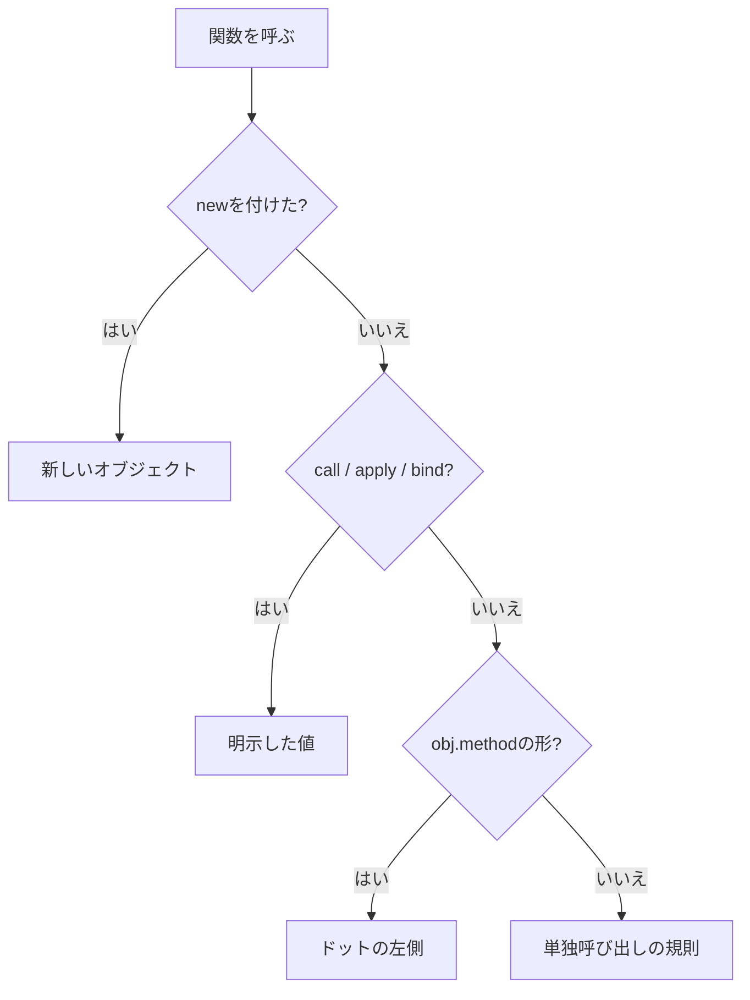

JavaScriptの `this` は、関数を定義した場所だけでは決まりません。通常の関数では「その関数をどう呼び出したか」が値を決めます。

まず呼び出し式の形を分類し、最後にアロー関数だけを別ルールとして扱うと整理できます。

## 呼び出し式を5種類に分ける

| 呼び出し方 | 例 | `this` |
| --- | --- | --- |
| メソッド呼び出し | `user.greet()` | `user` |
| 単独呼び出し | `greet()` | strict modeでは `undefined` |
| 明示的な指定 | `greet.call(user)` | 第1引数 |
| bind済み関数 | `bound()` | `bind` 時に固定した値 |
| `constructor` 呼び出し | `new User()` | 新しく作られるオブジェクト |

アロー関数はこの表の決め方を使わず、外側の `this` をそのまま参照します。



この分類は、規則の優先順位としても使えます。`new`、明示指定、メソッド呼び出し、単独呼び出しのどれに当たるかを外側から確認し、アロー関数ならその分類を止めて定義時の外側を見ます。`this` の値を推測で補わず、呼び出し式の記号から機械的に絞るのがコツです。

デバッガーで関数本体へ入ったときだけ `this` を見ると、なぜその値になったかは分かりません。Call Stackを1段戻り、実際の呼び出し式を探してください。フレームワークが呼び出している場合は、そのフレームワークのコールバック契約が呼び出し方を決めています。

## メソッド呼び出しではドットの左側を見る

```js
const user = {
  name: "Aki",
  greet() {
    return `Hello, ${this.name}`;
  },
};

console.log(user.greet()); // "Hello, Aki"
```

`greet` がどこで定義されたかより、`user.greet()` の形で呼ばれたことが重要です。`prototype` から見つけたメソッドでも同じです。

```js
const base = {
  greet() {
    return `Hello, ${this.name}`;
  },
};

const member = Object.create(base);
member.name = "Mika";

console.log(member.greet()); // "Hello, Mika"
```

関数は `base` にありますが、呼び出しの受け手は `member` なので `this === member` です。

## メソッドを取り出すと、オブジェクトとの関係が外れる

よくある不具合は、メソッドを変数やコールバックへ渡したときに起きます。

```js
const greet = user.greet;
greet(); // strict modeではthisがundefined

setTimeout(user.greet, 0); // user.greet()としては呼ばれない
```

`user.greet` を読み取った結果は関数オブジェクトです。変数 `greet` には「元はuserのメソッドだった」という情報が残りません。

これは、関数とオブジェクトの結び付きがプロパティアクセスの瞬間に固定されるわけではないためです。`const greet = user.greet` は、配列から数値を取り出すのと同じく値を読み取る操作です。その関数を後でどう呼ぶかは別の式が決めます。

対処は、呼び出し時にオブジェクトとの関係を保つことです。

```js
setTimeout(() => user.greet(), 0);

const boundGreet = user.greet.bind(user);
setTimeout(boundGreet, 0);
```

どちらも動きますが、意味は少し違います。ラッパー関数は呼び出し時に `user` を参照し、`bind` は作成時に `this` を固定した新しい関数を返します。

## `call`・`apply`・`bind` の違い

| API | 実行のタイミング | 引数の渡し方 | 戻り値 |
| --- | --- | --- | --- |
| `call` | その場で実行 | 個別 | 元の関数の結果 |
| `apply` | その場で実行 | 配列風の値 | 元の関数の結果 |
| `bind` | 後で実行 | 一部を事前指定できる | 新しい関数 |

```js
function introduce(prefix, suffix) {
  return `${prefix}${this.name}${suffix}`;
}

const person = { name: "Aki" };

introduce.call(person, "Hello, ", "!");
introduce.apply(person, ["Hello, ", "!"]);

const greetAki = introduce.bind(person, "Hello, ");
greetAki("!");
```

`bind` 済みの関数へ `call` で別の `this` を渡しても、固定された値は変わりません。必要以上にbindすると、呼び出し側から受け手を変更できなくなるため、所有者が明確な場面に限ります。

## アロー関数は外側の `this` を使う

アロー関数は、自分専用の `this` を作りません。定義された外側のスコープから `this` を参照します。

```js
class Timer {
  seconds = 0;

  start() {
    setInterval(() => {
      this.seconds += 1;
    }, 1_000);
  }
}
```

コールバック内のアロー関数は、`start()` の `this` を使います。通常関数に変えると、タイマーがどのように呼び出すかに依存します。

一方、オブジェクトのメソッド自体をアロー関数で書くのは注意が必要です。

```js
const user = {
  name: "Aki",
  greet: () => `Hello, ${this.name}`,
};
```

このアロー関数の `this` は `user` ではありません。オブジェクトリテラルは新しい `this` を作らないからです。状態の所有者を受け手にしたいなら、メソッド構文を使います。

## クラスのメソッドも自動ではbindされない

クラスのメソッドも、取り出して呼ぶと `this` を失います。

```js
class Counter {
  count = 0;

  increment() {
    this.count += 1;
  }
}

const counter = new Counter();
button.addEventListener("click", counter.increment); // thisがcounterではない
```

代表的な選択肢は2つです。

```js
button.addEventListener("click", () => counter.increment());

const increment = counter.increment.bind(counter);
button.addEventListener("click", increment);
```

解除が必要なイベントでは、登録時と同じ関数参照を保持します。`bind` やアロー関数を解除時にもう一度作っても、別の関数なので削除できません。

## `new` では新しいオブジェクトが `this` になる

通常の関数を `new` とともに呼ぶと、新しいオブジェクトが作られ、関数内の `this` に渡されます。

```js
function User(name) {
  this.name = name;
}

const user = new User("Aki");
console.log(user.name); // "Aki"
```

`call` や `bind` より `new` の規則が優先される場面があります。関数が `constructor` として使われる設計なら、通常呼び出しと混ぜず、クラスや命名で用途を明確にします。

## DOMイベントでは `target` と `currentTarget` を区別する

DOMイベントリスナーを通常関数で登録した場合、`this` は一般に `currentTarget` と同じ要素です。ただし、イベントが実際に発生した子要素は `target` です。

| 値 | 指すもの |
| --- | --- |
| `event.target` | イベントが発生した最も内側の要素 |
| `event.currentTarget` | 現在リスナーを実行している要素 |
| `this` | 通常関数では多くの場合 `currentTarget` |

アロー関数では `this` が要素にならないため、DOMコードでは `event.currentTarget` を明示して使うと、関数形式を変えても意味が残ります。

## `this` を使わない方が読みやすい場面もある

関数が必要とする値を引数で受け取れるなら、`this` を使わない方が依存関係が明確です。

```js
function calculateTotal(order) {
  return order.items.reduce(
    (sum, item) => sum + item.price * item.quantity,
    0,
  );
}
```

`this` が向くのは、オブジェクトが状態の所有者であり、`object.method()` という読み方が自然な場面です。単なる計算関数やコールバックまで `this` に依存させる必要はありません。

引数で受け取る関数は、必要な値がシグネチャに現れます。`this` を使うメソッドは、受け手のオブジェクトを暗黙の引数として受け取る、と考えられます。暗黙の関係が業務上自然ならメソッド、呼び出し元ごとに対象を明示したいなら通常関数を選ぶと、コードレビューでも依存を確認しやすくなります。

## 期待した値にならないときの確認順

1. アロー関数か、通常関数かを確認する。
2. 定義ではなく、実際の呼び出し式を見る。
3. メソッドを変数やコールバックへ取り出していないか探す。
4. `call`、`apply`、`bind`、`new` が使われていないか確認する。
5. DOMイベントなら `target` と `currentTarget` を分ける。
6. そもそも引数で渡した方が明確ではないか検討する。

`this` は「現在のオブジェクト」を自動で指す特別な変数ではありません。通常関数では呼び出し方、アロー関数では外側の環境が値を決めます。関数の定義場所だけを見ず、呼び出し式を分類する習慣を付けると予測できるようになります。

## 参考資料

- [ECMAScript: ResolveThisBinding](https://tc39.es/ecma262/multipage/executable-code-and-execution-contexts.html#sec-resolvethisbinding)
- [ECMAScript: Function.prototype.call](https://tc39.es/ecma262/multipage/fundamental-objects.html#sec-function.prototype.call)
- [ECMAScript: Bound Function Exotic Objects](https://tc39.es/ecma262/multipage/ordinary-and-exotic-objects-behaviours.html#sec-bound-function-exotic-objects)
- [MDN: this](https://developer.mozilla.org/ja/docs/Web/JavaScript/Reference/Operators/this)
