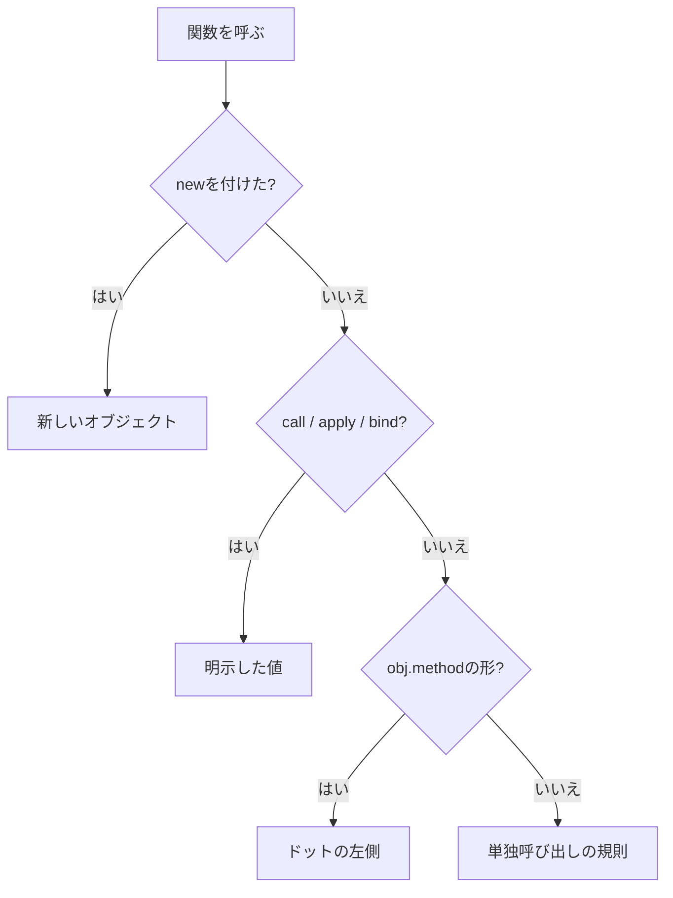

```js
setTimeout(user.greet, 0);
```

これで `this` が `undefined` になったとき、私はコードを何度も見返しました。`greet` は間違いなく `user` のメソッドです。渡す前も後も、そこにあります。

でも `this` は決まっていませんでした。

JavaScriptの `this` は、関数を書いた場所では決まりません。通常の関数では、**その関数をどう呼び出したか**が値を決めます。上のコードには `user.greet()` という呼び出しが、どこにも存在していなかったんです。

通常の関数は呼び出し式の形から分類し、アロー関数だけを別の規則として扱います。

## 呼び出し方は5種類しかない

| 呼び出し方 | 例 | `this` |
| --- | --- | --- |
| メソッド呼び出し | `user.greet()` | `user` |
| 単独呼び出し | `greet()` | strict modeでは `undefined` |
| 明示的な指定 | `greet.call(user)` | 第1引数 |
| bind済み関数 | `bound()` | `bind` 時に固定した値 |
| `constructor` 呼び出し | `new User()` | 新しく作られるオブジェクト |

アロー関数は、この表を使いません。外側の `this` をそのまま持ってきます。



この分岐は、そのまま優先順位です。`new` か、明示指定か、メソッド呼び出しか、単独呼び出しか。外側から順に当てはめていって、アロー関数だったらそこで止めて定義時の外側を見る。

コツは、推測で補わないことです。**呼び出し式の記号だけを見て、機械的に絞る。**

もうひとつ。デバッガーで関数本体に入って `this` を眺めても、なぜその値なのかは分かりません。Call Stackを1段戻って、実際の呼び出し式を探してください。フレームワークが呼んでいるなら、そのコールバック契約が呼び出し方を決めています。

## ドットの左側が答え

```js
const user = {
  name: "Aki",
  greet() {
    return `Hello, ${this.name}`;
  },
};

console.log(user.greet()); // "Hello, Aki"
```

`greet` がどこで定義されたかは関係ありません。`user.greet()` という形で呼ばれたこと。それだけです。

`prototype` から見つけたメソッドでも同じです。

```js
const base = {
  greet() {
    return `Hello, ${this.name}`;
  },
};

const member = Object.create(base);
member.name = "Mika";

console.log(member.greet()); // "Hello, Mika"
```

関数の実体は `base` にあります。でも呼び出しの受け手は `member` なので、`this === member` になります。

## 取り出した瞬間、関係が切れる

冒頭のコードの話です。

```js
const greet = user.greet;
greet(); // strict modeではthisがundefined

setTimeout(user.greet, 0); // user.greet()としては呼ばれない
```

`user.greet` を読み取った結果は、ただの関数オブジェクトです。変数 `greet` の中に、「元は `user` のメソッドだった」という情報は1ビットも残りません。

**関数とオブジェクトの結び付きは、プロパティアクセスの瞬間に固定されないんです。**

`const greet = user.greet` は、配列から数値を取り出すのと同じ、値を読むだけの操作でした。その関数をどう呼ぶかは、また別の式が決めます。

対処は、呼び出す瞬間に関係を復活させることです。

```js
setTimeout(() => user.greet(), 0);

const boundGreet = user.greet.bind(user);
setTimeout(boundGreet, 0);
```

どちらも動きます。ただ意味は違って、ラッパー関数は呼ばれたときに `user` を見にいく。`bind` は作った時点で `this` を固定した別の関数を返す。

## `call`・`apply`・`bind`

| API | 実行のタイミング | 引数の渡し方 | 戻り値 |
| --- | --- | --- | --- |
| `call` | その場で実行 | 個別 | 元の関数の結果 |
| `apply` | その場で実行 | 配列風の値 | 元の関数の結果 |
| `bind` | 後で実行 | 一部を事前指定できる | 新しい関数 |

```js
function introduce(prefix, suffix) {
  return `${prefix}${this.name}${suffix}`;
}

const person = { name: "Aki" };

introduce.call(person, "Hello, ", "!");
introduce.apply(person, ["Hello, ", "!"]);

const greetAki = introduce.bind(person, "Hello, ");
greetAki("!");
```

`bind` 済みの関数に `call` で別の `this` を渡しても、固定された値は動きません。

便利なので使いたくなりますが、必要以上にbindすると呼び出し側から受け手を変えられなくなります。所有者がはっきりしている場面に限ってください。

## アロー関数だけ、ルールが違う

アロー関数は自分専用の `this` を作りません。定義された外側から借りてきます。

```js
class Timer {
  seconds = 0;

  start() {
    setInterval(() => {
      this.seconds += 1;
    }, 1_000);
  }
}
```

このコールバックの `this` は `start()` の `this` です。通常関数に書き換えると、タイマーがどう呼ぶかに左右されて壊れます。

ただし、逆に噛みつかれる場所もあります。

```js
const user = {
  name: "Aki",
  greet: () => `Hello, ${this.name}`,
};
```

この `this` は `user` ではありません。オブジェクトリテラルは新しい `this` を作らないからです。

状態の所有者を受け手にしたいなら、メソッド構文を使ってください。

## クラスでも、自動bindはされない

```js
class Counter {
  count = 0;

  increment() {
    this.count += 1;
  }
}

const counter = new Counter();
button.addEventListener("click", counter.increment); // thisがcounterではない
```

クラスにしたから安心、ということはありません。取り出せば同じように関係が切れます。

```js
button.addEventListener("click", () => counter.increment());

const increment = counter.increment.bind(counter);
button.addEventListener("click", increment);
```

ここで1つ注意です。解除が必要なイベントでは、登録したときと**同じ関数参照**を持っておいてください。解除時に `bind` やアロー関数をもう一度作っても、それは別の関数なので削除できません。

## `new` のとき

通常の関数を `new` で呼ぶと、新しいオブジェクトが作られて `this` に入ります。

```js
function User(name) {
  this.name = name;
}

const user = new User("Aki");
console.log(user.name); // "Aki"
```

`call` や `bind` より `new` の規則が優先される場面があります。`constructor` として使う設計なら、通常呼び出しと混ぜないこと。クラスにするか、名前で用途をはっきりさせます。

## DOMでは `currentTarget` を書く

イベントリスナーを通常関数で登録した場合、`this` はたいてい `currentTarget` と同じ要素です。ただし、実際にイベントが起きた子要素は `target` のほうです。

| 値 | 指すもの |
| --- | --- |
| `event.target` | イベントが発生した最も内側の要素 |
| `event.currentTarget` | 現在リスナーを実行している要素 |
| `this` | 通常関数では多くの場合 `currentTarget` |

アロー関数にすると `this` は要素になりません。だからDOMのコードでは、最初から `event.currentTarget` と書いておく。そうすれば、関数の形式を変えても意味が残ります。

## そもそも使わない、という手

必要な値を引数で受け取れるなら、`this` を使わないほうが依存関係は明確です。

```js
function calculateTotal(order) {
  return order.items.reduce(
    (sum, item) => sum + item.price * item.quantity,
    0,
  );
}
```

`this` が向いているのは、オブジェクトが状態の持ち主で、`object.method()` という読み方が自然な場面です。ただの計算やコールバックまで `this` に依存させる必要はありません。

言い換えると、引数で受け取る関数は必要な値がシグネチャに出ています。`this` を使うメソッドは、受け手のオブジェクトを**暗黙の引数**として受け取っている。

その暗黙の関係が業務上自然ならメソッド。呼び出しごとに対象を明示したいなら通常関数。この基準で選ぶと、レビューでも依存が確認しやすくなります。

## おかしいときの確認順

1. アロー関数か、通常関数かを確認する。
2. 定義ではなく、実際の呼び出し式を見る。
3. メソッドを変数やコールバックへ取り出していないか探す。
4. `call`、`apply`、`bind`、`new` が使われていないか確認する。
5. DOMイベントなら `target` と `currentTarget` を分ける。
6. そもそも引数で渡した方が明確ではないか検討する。

---

冒頭の `setTimeout(user.greet, 0)` に戻ります。

あそこに足りなかったのは、`user.greet()` という呼び出しでした。渡していたのは関数の中身だけで、**誰のメソッドとして呼ぶか**を一緒に渡していなかった。

`this` は「現在のオブジェクト」を自動で指してくれる便利な変数ではありません。通常関数なら呼び出し方が、アロー関数なら外側の環境が、値を決めています。

定義場所を見つめるのをやめて、呼び出し式を分類する。この習慣がつくと、`this` は予測できるようになります。

## 参考資料

- [ECMAScript: ResolveThisBinding](https://tc39.es/ecma262/multipage/executable-code-and-execution-contexts.html#sec-resolvethisbinding)
- [ECMAScript: Function.prototype.call](https://tc39.es/ecma262/multipage/fundamental-objects.html#sec-function.prototype.call)
- [ECMAScript: Bound Function Exotic Objects](https://tc39.es/ecma262/multipage/ordinary-and-exotic-objects-behaviours.html#sec-bound-function-exotic-objects)
- [MDN: this](https://developer.mozilla.org/ja/docs/Web/JavaScript/Reference/Operators/this)
