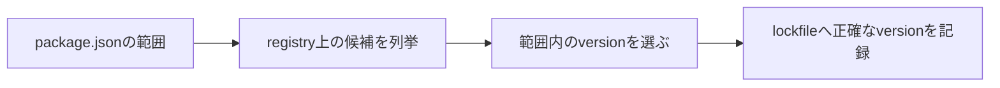

「`package.json` は1行も変えてないのに、バージョンが変わった」

これを言ったことがあるなら、原因はたぶん `^` の読み方です。私はそうでした。

`^1.4.2` や `~1.4.2` は、インストールするバージョンを1つに決めている記法ではありません。**パッケージマネージャーが選んでいい、バージョンの集合**を表しています。

この「範囲」と、`package-lock.json` が持つ「結果」を混同すると、冒頭のような疑問が生まれます。逆側の「ロックファイルがあるのに更新できない」も、同じ勘違いの裏返しです。

SemVerの意味を確認してから、`^`と`~`をバージョンの範囲として読み解きます。

## 数字に意味を持たせる約束

Semantic Versioningでは、バージョンを `MAJOR.MINOR.PATCH` で表します。

```text
2.7.3
│ │ └─ PATCH: 互換性を保つ不具合修正
│ └─── MINOR: 互換性を保つ機能追加
└───── MAJOR: 互換性を壊す変更
```

| 変更 | バージョンの例 | 意味 |
| --- | --- | --- |
| `PATCH` | `2.7.3` → `2.7.4` | 既存APIと互換な修正 |
| `MINOR` | `2.7.3` → `2.8.0` | 互換な機能追加 |
| `MAJOR` | `2.7.3` → `3.0.0` | 破壊的変更を含み得る |

ここで大事なのは、これが**公開者と利用者の約束**であって、システムが自動で保証してくれる規則ではないということです。

公開者がバージョン付けを間違えることもあります。型や環境の違いで、互換なはずの更新が壊れることもあります。

SemVerは「`PATCH` と `MINOR` なら絶対安全」という保証書ではありません。更新のリスクを話すための、共通の言葉です。

## 記号ではなく、不等式で読む

`^` と `~` は、許可する下限と上限を短く書くための記法です。



展開すると、違いが一目で分かります。

| 指定 | 許可する範囲 | 例として許可 | 許可しない例 |
| --- | --- | --- | --- |
| `1.4.2` | `=1.4.2` | `1.4.2` | `1.4.3` |
| `~1.4.2` | `>=1.4.2 <1.5.0` | `1.4.9` | `1.5.0` |
| `^1.4.2` | `>=1.4.2 <2.0.0` | `1.9.0` | `2.0.0` |
| `>=1.4 <2` | 明示した比較範囲 | `1.8.5` | `2.0.0` |

`~` は指定した `MINOR` 系列の中で `PATCH` の更新を許す。`^` は左端の0でない要素を固定して、それより右の更新を許す。

## チルダは、系列を動かさない

```text
~1.4.2  =  >=1.4.2 <1.5.0
```

1.4系列を保ったまま、1.4.2以上を許します。

不具合修正は自動で取り込みたい。でも新機能が入る `MINOR` 更新は自分の目で確認したい。そういうときの指定です。

ひとつ落とし穴があって、指定が粗いと範囲も広がります。`~1.4` は通常 `>=1.4.0 <1.5.0`、`~1` は `>=1.0.0 <2.0.0` と読まれる。

記号の見た目で判断せず、下限と上限に展開して確認してください。

## キャレットの本当のルール

`MAJOR` が1以上なら、次の `MAJOR` 未満までを許します。

```text
^1.4.2  =  >=1.4.2 <2.0.0
```

SemVer上、1.xの `MINOR` と `PATCH` は後方互換のはずなので、互換な機能追加と修正を取り込む指定になります。

ところが、0.xでは話が変わります。SemVerでは `MAJOR` 0が初期開発段階とされていて、公開APIが安定している前提を置けないからです。

| 指定 | npmでの範囲 |
| --- | --- |
| `^0.4.2` | `>=0.4.2 <0.5.0` |
| `^0.0.5` | `>=0.0.5 <0.0.6` |
| `^0.4` | `>=0.4.0 <0.5.0` |

「キャレットは次の `MAJOR` まで」と覚えていると、ここで必ず外します。

**「左端の0ではない要素を変えない」**。この読み方なら、0.xでも1.xでも一貫します。

## `beta` は勝手に入ってこない

`2.0.0-beta.1` のようなバージョンはプレリリースです。

```text
2.0.0-beta.1
      └──── betaというprerelease識別子
```

安定版の範囲を書いただけでは、同じ数直線上にあるプレリリースが選ばれるとは限りません。試したいなら、範囲へ明示的に含めます。

安定版より先に新機能を触れる代わりに、API変更と不具合を受け入れることになります。

なお `+build.5` のようなビルドメタデータは、優先順位に一切影響しません。プレリリースとは役割が別です。

## 2つのファイルは、別の質問に答えている

```json
{
  "dependencies": {
    "example-library": "^1.4.2"
  }
}
```

`package.json` は方針です。「どの範囲を受け入れるか」。

`package-lock.json` は結果です。「今回どのバージョンと依存ツリーを選んだか」。

| ファイル | 答える質問 |
| --- | --- |
| `package.json` | 将来のインストールで、どこまで許可するか |
| `package-lock.json` | 現在のインストールを、どのツリーで再現するか |

ロックファイルがある通常のインストールでは、範囲を満たすかぎり記録済みのバージョンが使われます。依存を追加したり明示的に更新したりしてロックファイルが動いたとき、新しいバージョンが選ばれます。

アプリでは両方コミットして、レビューでも一緒に見てください。`package.json` だけでは許可方針しか分からず、ロックファイルだけでは**その変更を許可した意図**が分かりません。

## `install` と `ci` を使い分ける

| コマンド | 主な用途 | ロックファイル |
| --- | --- | --- |
| `npm install` | 開発、依存追加、更新 | 変更し得る |
| `npm ci` | CI、再現可能なクリーンインストール | `package.json` と不一致なら失敗 |

CIで `npm ci` を使うと、ロックファイルの更新をコミットし忘れた状態を検出できます。

逆もまた真です。依存を上げたいときに `npm ci` を何回叩いても、バージョンは1ミリも動きません。

## `npm outdated` の3列

```sh
npm outdated
```

| 列 | 意味 |
| --- | --- |
| current | 現在インストールされているバージョン |
| `wanted` | `package.json` の範囲内で選べるバージョン |
| `latest` | レジストリの `latest` tagが示すバージョン |

`wanted` と `latest` が違っていたら、それは範囲の外に新しいものがあるという意味です。

ここでキャレットやチルダを外して `latest` に飛びつく前に、`MAJOR` 変更の内容、Node.jsの要件、移行手順を確認してください。

## 更新は、差分を小さく

1. なぜ更新するかを決める。脆弱性、不具合修正、機能、保守期限では確認点が違う。
2. 現在値、`wanted`、`latest` を確認する。
3. リリースノートと移行ガイドを読む。
4. 対象パッケージだけを更新する。
5. `package.json` とロックファイルの差分を見る。
6. 型検査、テスト、ビルド、主要な動作確認を行う。

```sh
npm outdated
npm install example-library@^1.6.0
git diff -- package.json package-lock.json
npm test
npm run build
```

ロックファイルの差分が異様に大きいときは、パッケージマネージャーのバージョン変更、ロックファイル形式の変更、別パッケージの同時更新が混ざっていないかを疑ってください。

依存更新とツールチェーン更新を1つのプルリクに詰めると、問題が起きたときに原因を切り分けられなくなります。

## どれを選ぶか

| 指定 | 向いている考え方 | 代償 |
| --- | --- | --- |
| キャレット | 互換な機能追加と修正を取り込みたい | 範囲内の変化が広い |
| チルダ | `PATCH` 修正を中心に取り込みたい | `MINOR` 更新を手動で行う |
| 固定バージョン | 更新を明示的に制御したい | 修正の取り込みも手動 |
| 広い比較範囲 | プラグインなどで互換範囲を表したい | 実際の検証範囲を保つ必要 |

ロックファイルをコミットしているアプリなら、キャレットを使っても各環境が毎回バラバラのバージョンになることはありません。範囲は次の更新で許す幅、ロックファイルは今の再現性。担当が分かれています。

公開ライブラリだと事情が違います。依存や `peerDependencies` の範囲が、利用者側の解決に直接効くからです。狭すぎれば不要な重複インストールや競合を生み、広すぎれば未検証のバージョンを「互換です」と宣言することになります。

実際にテストした範囲と、SemVer上の期待。両方を見て決めてください。

## よくある3つの誤解

**「`^` は最新版を入れる」** — 違います。上限があります。しかもロックファイルがあれば、解決結果まで固定されています。

**「`MINOR` と `PATCH` なら壊れない」** — 保証ではありません。SemVerは公開者の宣言であって、こちらの環境や使い方までは知りません。テストは要ります。

**「ロックファイルがあれば `package.json` は要らない」** — 要ります。ロックファイルは現在のツリー、`package.json` は直接依存と許容範囲を、人間とツールへ伝えるためのものです。

---

冒頭の「1行も変えてないのにバージョンが変わった」に戻ります。

変わったのは `package.json` ではなく、その範囲の中でどれを選ぶかという解決結果のほうでした。

だから、記号を名前で覚えないでください。**不等式に展開する。** そして、範囲・解決結果・`latest` を3つの別々の概念として扱う。

これができると、どこまでが自動更新の領域で、どこからが移行作業なのかを、自分で線引きできるようになります。

## 参考資料

- [Semantic Versioning 2.0.0](https://semver.org/)
- [npm Docs: About semantic versioning](https://docs.npmjs.com/about-semantic-versioning/)
- [node-semver](https://github.com/npm/node-semver)
- [npm Docs: package-lock.json](https://docs.npmjs.com/cli/configuring-npm/package-lock-json)
- [npm Docs: npm ci](https://docs.npmjs.com/cli/commands/npm-ci)
- [npm Docs: npm outdated](https://docs.npmjs.com/cli/commands/npm-outdated)
