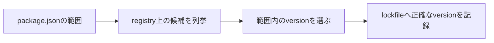

`package.json` にある `^1.4.2` や `~1.4.2` は、インストールするバージョンを1つに固定しているのではありません。パッケージマネージャーが選んでよいバージョンの集合を表します。

この範囲と `package-lock.json` の役割を混同すると、「`package.json` は変えていないのにバージョンが変わった」「ロックファイルがあるのに更新できない」といった疑問が生まれます。まずSemVerの意味を確認し、その後でキャレットとチルダを範囲として読みます。

## SemVerはバージョン番号へ変更の意味を持たせる

Semantic Versioningでは、バージョンを `MAJOR.MINOR.PATCH` で表します。

```text
2.7.3
│ │ └─ PATCH: 互換性を保つ不具合修正
│ └─── MINOR: 互換性を保つ機能追加
└───── MAJOR: 互換性を壊す変更
```

| 変更 | バージョンの例 | 意味 |
| --- | --- | --- |
| `PATCH` | `2.7.3` → `2.7.4` | 既存APIと互換な修正 |
| `MINOR` | `2.7.3` → `2.8.0` | 互換な機能追加 |
| `MAJOR` | `2.7.3` → `3.0.0` | 破壊的変更を含み得る |

これは公開者と利用者の契約です。技術的に自動保証される規則ではありません。公開者のバージョン付けが誤っていたり、型や環境の違いで互換なはずの更新が壊れたりする可能性はあります。

SemVerは「`PATCH` と `MINOR` なら絶対安全」という保証ではなく、更新リスクを判断するための共通語彙です。

## バージョン範囲は数直線として読む

`^` と `~` は、許可する下限と上限を省略して書く記法です。



代表例を不等式にすると、違いが明確です。

| 指定 | 許可する範囲 | 例として許可 | 許可しない例 |
| --- | --- | --- | --- |
| `1.4.2` | `=1.4.2` | `1.4.2` | `1.4.3` |
| `~1.4.2` | `>=1.4.2 <1.5.0` | `1.4.9` | `1.5.0` |
| `^1.4.2` | `>=1.4.2 <2.0.0` | `1.9.0` | `2.0.0` |
| `>=1.4 <2` | 明示した比較範囲 | `1.8.5` | `2.0.0` |

`~` は指定した `MINOR` 系列の中で `PATCH` 更新を許可します。`^` は左端の0ではない要素を固定し、それより右の更新を許可します。

## チルダは `MINOR` を保ち、`PATCH` 更新を受け取る

`~1.4.2` は、1.4系列を保ったまま1.4.2以上を許します。

```text
~1.4.2  =  >=1.4.2 <1.5.0
```

不具合修正は取り込みたいが、新機能を含む `MINOR` 更新は明示的に確認したい場合に使えます。

指定の粒度が粗いと範囲も広がります。たとえば `~1.4` は通常 `>=1.4.0 <1.5.0`、`~1` は `>=1.0.0 <2.0.0` と読まれます。見た目の記号だけでなく、実際の下限と上限へ展開して確認します。

## キャレットは左端の0でない要素を保つ

`MAJOR` バージョンが1以上なら、キャレットは次の `MAJOR` 未満を許します。

```text
^1.4.2  =  >=1.4.2 <2.0.0
```

SemVer上、1.xの `MINOR` と `PATCH` は後方互換を保つ想定なので、互換な機能追加と修正を取り込む指定です。

0.xでは規則が狭くなります。SemVerでは `MAJOR` 0は初期開発段階とされ、公開APIが安定している前提を置けないためです。

| 指定 | npmでの範囲 |
| --- | --- |
| `^0.4.2` | `>=0.4.2 <0.5.0` |
| `^0.0.5` | `>=0.0.5 <0.0.6` |
| `^0.4` | `>=0.4.0 <0.5.0` |

「キャレットは次の `MAJOR` まで」とだけ覚えると、0.xで誤ります。「左端の0ではない要素を変えない」と読む方が一貫します。

## プレリリースは通常の範囲へ自動では入らない

`2.0.0-beta.1` のようなバージョンはプレリリースです。通常の安定版範囲を指定しただけで、同じ範囲にあるプレリリースが自動的に選ばれるとは限りません。

```text
2.0.0-beta.1
      └──── betaというprerelease識別子
```

プレリリースを試したい場合は、範囲へ明示的に含めます。安定版より先に新機能を検証できる一方、API変更や不具合の可能性を受け入れる必要があります。

`+build.5` のようなビルドメタデータはバージョンの優先順位へ影響しません。プレリリースとは役割が違います。

## `package.json` とロックファイルは別の質問へ答える

```json
{
  "dependencies": {
    "example-library": "^1.4.2"
  }
}
```

`package.json` は「どの範囲を受け入れるか」という方針です。`package-lock.json` は「今回どのバージョンと依存ツリーを選んだか」という解決結果です。

| ファイル | 答える質問 |
| --- | --- |
| `package.json` | 将来のインストールで、どこまで許可するか |
| `package-lock.json` | 現在のインストールを、どのツリーで再現するか |

ロックファイルがある通常のインストールでは、範囲を満たす限り記録済みのバージョンが使われます。依存追加や明示的な更新によりロックファイルが変わると、新しいバージョンが選ばれます。

アプリケーションでは両方をコミットし、レビューでは一緒に確認します。`package.json` だけ見ると許可方針しか分からず、ロックファイルだけ見るとその変更を許可した意図が分かりません。

## `npm install` と `npm ci` は用途が違う

`npm install` は依存の追加や更新に使い、必要に応じてロックファイルを書き換えます。`npm ci` は、コミット済みのロックファイルどおりにクリーンインストールするためのコマンドです。

| コマンド | 主な用途 | ロックファイル |
| --- | --- | --- |
| `npm install` | 開発、依存追加、更新 | 変更し得る |
| `npm ci` | CI、再現可能なクリーンインストール | `package.json` と不一致なら失敗 |

CIで `npm ci` を使うと、開発者がロックファイル更新をコミットし忘れた状態を検出できます。逆に、依存を更新したいときに `npm ci` を繰り返しても、ロックファイルのバージョンは上がりません。

## `npm outdated` の3列を分けて読む

```sh
npm outdated
```

一般に `current`、`wanted`、`latest` が表示されます。

| 列 | 意味 |
| --- | --- |
| current | 現在インストールされているバージョン |
| `wanted` | `package.json` の範囲内で選べるバージョン |
| `latest` | レジストリの `latest` tagが示すバージョン |

`wanted` と `latest` が違うなら、`package.json` の範囲外に新バージョンがあります。キャレットやチルダを外して無理に `latest` へ上げる前に、`MAJOR` 変更、Node.js要件、移行手順を確認します。

## 安全な更新は「差分を小さく、契約を検証する」

依存更新の基本手順は次の通りです。

1. なぜ更新するかを決める。脆弱性、不具合修正、機能、保守期限では確認点が違う。
2. 現在値、`wanted`、`latest` を確認する。
3. リリース ノートと移行 ガイドを読む。
4. 対象パッケージだけを更新する。
5. `package.json` とロックファイルの差分を見る。
6. 型検査、テスト、ビルド、主要な動作確認を行う。

```sh
npm outdated
npm install example-library@^1.6.0
git diff -- package.json package-lock.json
npm test
npm run build
```

ロックファイルの差分が大きい場合、パッケージマネージャーのバージョン変更、ロックファイル形式の変更、別パッケージの同時更新が混ざっていないか確認します。依存更新とツールチェーン更新を同じプルリクエストへ詰め込むと、問題発生時に原因を絞りにくくなります。

## キャレット・チルダ・固定バージョンを選ぶ基準

| 指定 | 向いている考え方 | 代償 |
| --- | --- | --- |
| キャレット | 互換な機能追加と修正を取り込みたい | 範囲内の変化が広い |
| チルダ | `PATCH` 修正を中心に取り込みたい | `MINOR` 更新を手動で行う |
| 固定バージョン | 更新を明示的に制御したい | 修正の取り込みも手動 |
| 広い比較範囲 | プラグインなどで互換範囲を表したい | 実際の検証範囲を保つ必要 |

ロックファイルをコミットするアプリケーションでは、キャレットを使っても各環境が毎回別バージョンになるわけではありません。範囲は次回更新で許可する幅、ロックファイルは現在の再現性を担当します。

公開ライブラリでは、依存パッケージやpeerDependenciesの範囲が利用者の解決へ直接影響します。狭すぎる範囲は不要な重複インストールや競合を生み、広すぎる範囲は未検証バージョンを互換と宣言することになります。実際にテストした範囲とSemVer上の期待を両方考えます。

## 「^は最新版」「`MINOR` なら安全」は誤り

「`^` は常に最新版を入れる」は誤りです。次の上限未満という範囲があり、ロックファイルがあれば解決結果も固定されます。

「`MINOR` と `PATCH` なら壊れない」も保証ではありません。SemVerは公開者の宣言であり、利用側の環境や使い方を完全には表せません。テストは必要です。

「ロックファイルがあれば `package.json` は不要」でもありません。ロックファイルは現在のツリー、`package.json` は直接依存と許容範囲を人間やツールへ伝えます。

npmのバージョン指定を読むときは、記号を名前で覚えるより、不等式へ展開してください。そして、範囲・解決結果・`latest` を別の概念として扱います。この3つを分ければ、どこまで自動更新され、どこから移行が必要かを判断できます。

## 参考資料

- [Semantic Versioning 2.0.0](https://semver.org/)
- [npm Docs: About semantic versioning](https://docs.npmjs.com/about-semantic-versioning/)
- [node-semver](https://github.com/npm/node-semver)
- [npm Docs: package-lock.json](https://docs.npmjs.com/cli/configuring-npm/package-lock-json)
- [npm Docs: npm ci](https://docs.npmjs.com/cli/commands/npm-ci)
- [npm Docs: npm outdated](https://docs.npmjs.com/cli/commands/npm-outdated)
