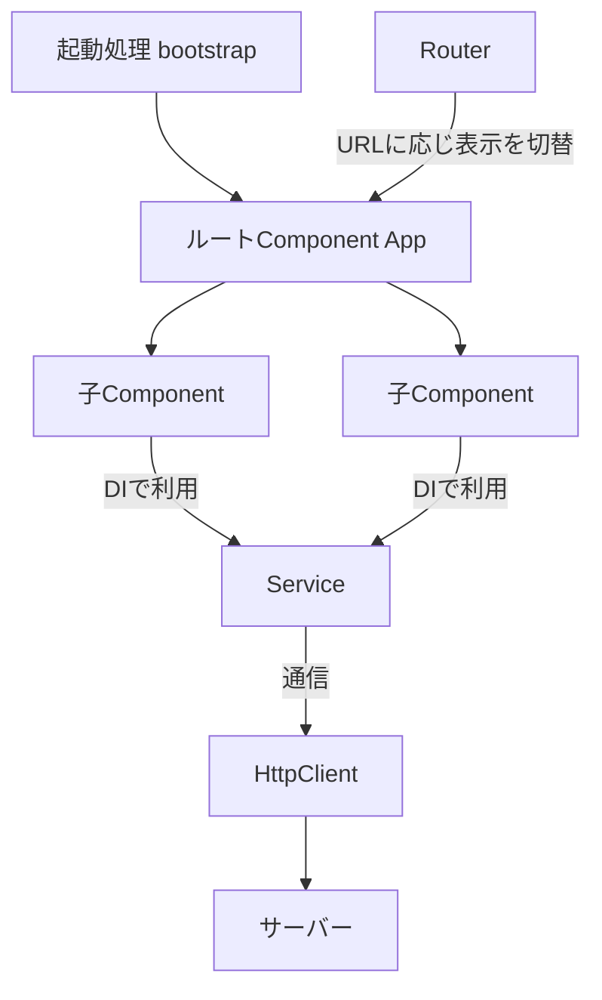
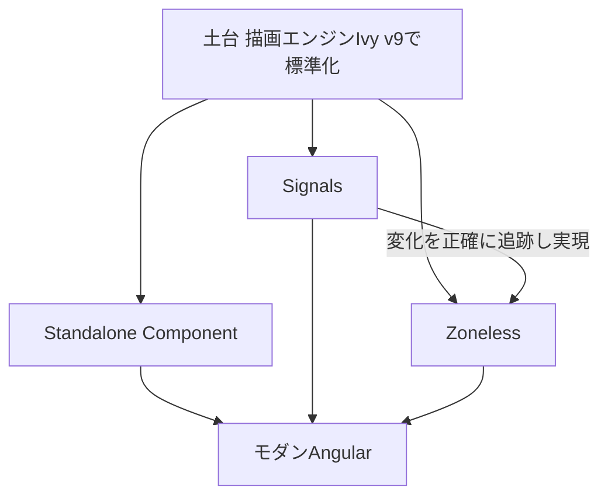

本書の最初に、Angularがどのようなフレームワークで、どのような経緯でいまの姿になったのかを押さえます。Angularの全体像と、モダンAngularへの変化の流れをつかみましょう。

:::message
**この章で学ぶこと**

- Angularがどのようなフレームワークなのか
- Angularがどのような課題を解決するのか
- AngularJSからAngularへの移り変わり
- 定期リリースとバージョン番号の意味
:::

## Angularとは何か

Angularは、Googleを中心に開発されている、TypeScriptベースのWebアプリケーションフレームワークです。この節では、そもそもAngularがどのようなものなのか、どのような課題を解決するために作られたのかを、全体像として押さえます。

個々のAPIの使い方は次章以降で順に扱います。ここではまず、「Angularとは何か」という問いに自分の言葉で答えられるようになることを目標にします。あわせて、Angularがどのような場面に向いているのかも整理します。

### Angularとは

Angularは、Googleとコミュニティによって開発されている、オープンソースのWebアプリケーションフレームワークです。おもに、ブラウザ上で動作するSPA（Single Page Application、単一ページアプリケーション）を構築するために使われます。

SPAとは、最初に1つのHTMLを読み込んだあとは、ページ全体を再読み込みせず、JavaScriptで画面を書き換えていくタイプのWebアプリケーションです。ページ遷移のたびにサーバーからHTMLを取得する従来の作りに比べ、操作に対する反応が速く、デスクトップアプリケーションに近い使い心地を実現できます。その一方で、画面の状態管理・遷移・通信などをアプリケーション側で扱う必要があり、作りが複雑になりがちです。Angularは、この複雑さを整理するための仕組みを、フレームワークとして体系的に提供します。

Angularの大きな特徴は、アプリケーションの構築に必要な機能の多くを、フレームワーク自身が公式に備えている点です。画面遷移を扱うRouter、入力フォームを扱うForms、サーバーとの通信を扱うHttpClient、部品間の依存関係を管理する依存性の注入（Dependency Injection、DI）などが、最初から統合された形で提供されます。

### Angularが解決する課題

Angularが向き合っているのは、「アプリケーションが大きくなり、開発する人数が増えても、一貫した構造を保ちながら開発と保守を続けられるようにする」という課題です。

アプリケーションが小さいうちは、どのような書き方でも動きます。しかし規模が大きくなると、次のような問題が生まれます。

- 画面遷移・通信・状態管理などをどう実装するか、担当者ごとに書き方がばらつく
- 部品どうしの依存関係が複雑になり、どこを直すと何に影響するのかを追いにくくなる
- ライブラリの選定や組み合わせがプロジェクトごとに異なり、知識を共有しづらい

たとえば、複数の画面で使う入力フォームを考えてみます。フォームの検証ルールや、サーバーへの送信、エラーの表示方法が画面ごとにばらばらだと、仕様が変わるたびにすべての画面を確認して直さなければなりません。フォームや通信の標準的な仕組みがあらかじめ決まっていれば、同じ作法を全画面で使い回せて、修正の影響範囲も追いやすくなります。

Angularは、これらに対して「公式の標準的なやり方」を提供します。ルーティングや通信の仕組みが最初から決まっているため、チームの誰が書いても構造が揃いやすく、他のプロジェクトで得た知識もそのまま活かせます。この「決まっていること」の多さが、Angularの安心感につながっています。

### ライブラリとフレームワークの違い

Angularを理解するうえで、「ライブラリ」と「フレームワーク」の違いを押さえておくと役立ちます。

ライブラリは、特定の機能を提供する部品です。開発者が主導権を持ち、必要な場面でライブラリを呼び出します。一方フレームワークは、アプリケーション全体の骨組みを提供します。開発者はその骨組みに沿ってコードを書き、フレームワークが適切なタイミングでそのコードを呼び出します。

この「フレームワークが開発者のコードを呼び出す」という関係は、制御の反転（Inversion of Control）と呼ばれます。ライブラリでは開発者がライブラリを呼び出しますが、フレームワークでは主導権がフレームワーク側にあり、開発者はあらかじめ決められた場所に処理を書いておきます。Angularを学ぶことの多くは、「どこに何を書けば、フレームワークがそれを適切に呼び出してくれるのか」を身につけることだといえます。

たとえばReactは、画面の描画を担うライブラリです。ルーティングや通信、状態管理といった機能は、別のライブラリを選んで組み合わせます。これに対してAngularは、それらを公式に統合したフレームワークです。両者の違いは、次のように整理できます。

| 観点 | ライブラリ型 | フレームワーク型（Angular） |
|---|---|---|
| 標準で備える範囲 | 画面の描画が中心 | ルーティング・フォーム・通信・DIなどを内包 |
| 技術の選定 | 機能ごとに都度選ぶ | 公式の標準が用意されている |
| 学びはじめ | 小さく始めやすい | 覚えることは多いが構成が一貫する |
| 向いている規模 | 小〜中規模でも柔軟 | 中〜大規模で強みが出る |

どちらが優れているという話ではなく、性質が異なります。自由に組み合わせたいならライブラリ型、統一された土台の上で一貫して開発したいならフレームワーク型が向いています。

### 他のフレームワークとの位置づけ

Webのフロントエンド開発では、ReactやVueも広く使われています。それぞれ設計思想が異なり、優劣を一概に決めることはできませんが、大まかな傾向は次のように整理できます。

- **React**: 画面の描画に特化したライブラリ。ルーティングや状態管理は、豊富なエコシステムから選んで組み合わせます。自由度が高い反面、構成の判断は開発者に委ねられます。
- **Vue**: ライブラリとフレームワークの中間的な位置づけ。小さく始めて、必要に応じて公式の機能を足していけます。
- **Angular**: 最初から機能が統合されたフルフレームワーク。決まりごとが多い反面、構成の一貫性を保ちやすくなっています。

Angularの「決まりごとの多さ」は、小さく始めたい場面では重く感じられます。しかし、長期にわたって大人数で開発する場面では、チームの認識を揃えるための共通の土台として働きます。どれを選ぶかは、作るものの規模やチームの状況によって変わります。本書はAngularを扱いますが、他のフレームワークを知っておくと、Angularの特徴をより客観的にとらえられます。

### Angularの主な特徴

Angularを特徴づける要素を、順に見ていきます。

**TypeScriptファースト**

Angularは、TypeScriptを前提に設計されています。型によって、部品どうしのやり取りや設定の誤りを、実行前に見つけやすくなります。大規模なアプリケーションほど、この恩恵は大きくなります。

**Component指向**

Angularでは、画面を「Component」という部品の組み合わせで構築します。Componentは、見た目を定義するテンプレートと、振る舞いを定義するクラスをひとまとめにしたものです。次のコードは、ボタンを押すと数が増える小さなComponentの例です。

```ts:src/app/counter.ts
import { Component, signal } from '@angular/core';

@Component({
  selector: 'app-counter',
  template: `
    <p>カウント: {{ count() }}</p>
    <button (click)="increment()">+1</button>
  `,
})
export class Counter {
  protected readonly count = signal(0);

  protected increment(): void {
    this.count.update((value) => value + 1);
  }
}
```

いまはコードの細部を理解する必要はありません。「テンプレートと振る舞いが、ひとつのクラスにまとまっている」という感覚だけつかめれば十分です。Componentの詳細は、[『TypeScriptとComponentの基本』の章](./04-component-basics)から順に解説します。

**依存性の注入（DI）**

DIは、ある部品が必要とする別の部品を、外側から渡す仕組みです。部品どうしが直接お互いを作り合うのではなく、フレームワークが依存関係を解決して渡します。これにより、部品を差し替えやすくなり、テストも書きやすくなります。DIはAngularの中核をなす仕組みで、[『ServiceとDependency Injection』の章](./10-service-and-di)で詳しく扱います。

**リアクティブな状態管理**

Angularには、状態の変化を扱うための仕組みが2つあります。ひとつは、Angular自身が備えるSignalsです。もうひとつは、非同期の値の流れを扱うRxJSというライブラリです。先ほどのコード例で使った`signal()`が、Signalsの基本のAPIです。Signalsは[『SignalsとZoneless』の章](./13-signals-and-zoneless)で、RxJSは[『RxJSの基礎』の章](./16-rxjs-basics)で本格的に解説します。

**Angular CLIによる開発体験**

Angularには、Angular CLIという公式のコマンドラインツールが付属します。プロジェクトの作成、開発サーバーの起動、部品の生成、ビルド、テストといった作業を、統一されたコマンドで実行できます。開発の入り口から本番のビルドまでを、公式のツールでまかなえます。

**公式が提供するエコシステム**

Angular本体の外側にも、公式が保守するライブラリやツールがあります。Angular Materialは、Googleのデザイン指針にもとづくUIコンポーネント集で、ボタンやダイアログ、テーブルといった部品をすぐに利用できます。その土台となるCDK（Component Dev Kit）は、見た目を持たず振る舞いだけを提供する部品群で、オーバーレイやドラッグ＆ドロップ、アクセシビリティ対応などを、独自のUIを組み立てるときにも再利用できます。また、Angular DevToolsはブラウザの拡張機能で、Componentの階層や状態、変更検知の様子を可視化し、開発中の調査を助けます。これらも公式が保守しているため、本体のバージョンアップに追従しやすいという利点があります。

**定期リリースと後方互換性**

Angularは、年に2回のペースでメジャーバージョンを定期的にリリースしています。新機能が計画的に届く一方で、古い書き方も一定期間サポートされ、公式の移行ツールも提供されます。長期にわたって運用するアプリケーションを、少しずつ新しい形へ更新していける点は、実務上の大きな強みです。

### Angularアプリケーションの全体像

ここまでに登場した要素が、アプリケーションの中でどう組み合わさるのかを、簡単な見取り図として示します。細かな役割はこの先の各章で解説しますが、全体像を持っておくと、この先の学習で自分がどこを触っているのかを見失いにくくなります。

- **Component**: 画面を構成する部品。テンプレートと振る舞いを持ち、組み合わせて画面を作ります
- **Service**: 画面に依存しないロジックやデータを担う部品。複数のComponentから共有できます
- **DI**: ComponentやServiceに、必要な部品を渡す仕組みです
- **Router**: URLに応じて、表示するComponentを切り替える仕組みです
- **HttpClient**: サーバーとデータをやり取りする仕組みです
- **SignalsとRxJS**: 状態の変化や、非同期の値の流れを扱う仕組みです
- **SSRとHydration**: サーバー側で描画したHTMLをまず配信し、ブラウザ側でそれを引き継いで動かす仕組みです

大まかには、Componentが画面を組み立て、Serviceがその裏側のロジックを担い、DIが両者をつなぎます。そこにRouterやHttpClientが加わって、ひとつのアプリケーションになります。本書は、これらをこの順に近い形で、章を追って解説していきます。

次の図は、これらの要素がどうつながって、ひとつのアプリケーションになるのかを表したものです。



### Angularが向いている場面

これらの特徴から、Angularは次のような場面に向いています。

- 画面数や機能が多い、中規模から大規模のアプリケーション
- 複数人・複数チームで、長期にわたって開発・保守するプロジェクト
- 一貫した構造や標準的なやり方を、チーム全体で共有したい場面

反対に、ごく小さなページや、一度作って終わりの単純なサイトでは、Angularの仕組みが過剰に感じられることもあります。フレームワークの規模と、作るものの規模を見合わせて選ぶことが大切です。

## Angularの歴史とモダンAngularへの変化

Angularを学び始めると、同じことをするのに複数の書き方が見つかり、どれが正しいのか戸惑うことがあります。これは、Angularが長い年月をかけて大きく進化してきた結果です。この節では、Angularの歴史をたどりながら、なぜいまの形になったのか、そしてなぜ新旧の情報が混在しているのかを整理します。

歴史を知ることには、実務上の意味があります。既存のコードには古い書き方が残っていますし、Web上の記事も執筆時期によって内容が異なります。変化の流れを押さえておくと、目の前のコードや記事が「いつの時代のものか」を見分けられるようになります。

### AngularJSからAngularへ

Angularの歴史は、2010年ごろに登場した「AngularJS」から始まります。AngularJSはバージョン1系を指す呼び名で、当時としては画期的な双方向データバインディングなどで広く普及しました。

しかし、Webを取り巻く環境が変化する中で、AngularJSの設計は限界を迎えます。そこでチームは、後方互換を捨てて一から作り直すという決断をしました。こうして2016年9月に登場したのが、「Angular 2」です。

Angular 2は、AngularJSとは別物といえるほど大きく変わりました。おもな変更点は次のとおりです。

- 言語をTypeScriptに刷新した
- 画面をComponentの組み合わせで構築する、Component指向の設計を採用した
- 非同期処理を扱うライブラリとしてRxJSを標準に取り込んだ

このAngular 2以降を、単に「Angular」と呼びます。AngularJS（1系）とAngular（2以降）は名前こそ似ていますが、別のフレームワークとして区別されます。本書が扱うのは、後者のAngularです。

### 定期リリースとバージョン番号

Angularは、Angular 2以降、セマンティックバージョニングという方式にもとづいて、年に2回のペースでメジャーバージョンをリリースしています。バージョン番号が短期間で大きくなるのはこのためで、番号が大きいこと自体は、劇的な作り直しを意味しません。

セマンティックバージョニングでは、バージョンを「メジャー.マイナー.パッチ」の3つの数字で表します。パッチは不具合の修正、マイナーは後方互換性を保った機能追加、メジャーは後方互換性を壊す可能性のある変更を意味します。たとえば`22.1.3`であれば、メジャーが22、マイナーが1、パッチが3です。Angularではおおむね、メジャーを半年ごと、マイナーを月に1回程度、パッチを毎週のペースで公開します。番号の増え方が速く見えても、日々届く更新の多くは互換性を保ったマイナーやパッチであり、書き方を大きく変える必要はありません。

各メジャーバージョンには、およそ18か月のサポート期間が設けられています。リリース直後の約6か月は、新機能や不具合修正が届くアクティブサポート期間です。続く約12か月は、重大な不具合とセキュリティの修正のみが提供されるLTS（Long-Term Support、長期サポート）期間になります。実務では、この期間を目安に更新の計画を立てます。つねに最新へ追従する必要はありませんが、サポートが切れたバージョンを使い続けると、セキュリティ修正を受け取れなくなります。サポート期間が終わる前に次のメジャーへ上げることを目標にすると、一度に飛び越える差分が小さくなり、更新の負担を抑えられます。この移行作業は、公式が提供する`ng update`コマンドが支援します。

:::message
バージョンがAngular 2から4へ飛んでいるのは、当時のRouterパッケージがすでにバージョン3だったからです。全体のバージョンを揃えるため、Angular 3は採番されませんでした。
:::

この定期リリースにあわせて、Angularは新機能を段階的に導入します。多くの機能は、次のような段階を踏んで成熟していきます。

1. **実験的（Experimental）**: 試験的に導入され、仕様が変わる可能性がある段階
2. **開発者プレビュー（Developer Preview）**: おおむね固まったが、正式にはまだ安定版でない段階
3. **安定版（Stable）**: 正式に推奨され、後方互換が保証される段階

新旧の書き方が混在して見えるのは、ひとつの機能がこの段階を経て少しずつ標準化されてきたからです。ある記事が「実験的」な時期に書かれたのか、「安定版」になったあとに書かれたのかで、内容が変わります。

### モダンAngularを形づくった3つの変化

近年のAngularは、コードの書き方そのものを大きく変える3つの変化を経て、現在の姿になりました。本書ではこの現在の姿を「モダンAngular」と呼びます。

これら3つの変化の土台には、Angular 9（2020年）でデフォルトになった「Ivy」という新しい描画エンジンがあります。Ivyは、生成されるコードを小さく・速くし、デバッグもしやすくしました。表面からは見えにくい変化ですが、のちのStandaloneやSignalsといった仕組みは、このIvyという土台があって初めて実現できたものです。歴史を振り返るときは、目に見える機能の裏で、こうした基盤の刷新が進んでいたことも意識すると、変化のつながりが見えてきます。

**Standalone Component**

かつてのAngularでは、Component・Directive・Pipeを「NgModule」という仕組みでまとめて登録する必要がありました。NgModuleは、関連する部品をひとまとめにし、どれを外部に公開し、どれを内部だけで使うのかを管理する仕組みです。中規模以上のアプリケーションを整理するうえでは役立ちました。

しかし、小さなComponentを1つ作るだけでもNgModuleへの登録が必要で、初学者にとっては「なぜこの記述がいるのか」がわかりにくいという問題を抱えていました。また、ある部品を使うために、どのNgModuleをimportすればよいのかを追う手間もありました。NgModuleは、便利さと同時に、理解と記述の負担も生んでいたのです。

そこで導入されたのが、NgModuleを介さずに単体で成立するStandalone Componentです。Standalone Componentは、自身が必要とする依存を直接宣言します。Angular 14（2022年）でプレビューとして登場し、Angular 17（2023年11月）で新規プロジェクトの標準的な生成形式になりました。さらにAngular 19（2024年11月）では、`standalone: true`という指定すら不要になり、Standaloneが暗黙のデフォルトになりました。

**Signals**

Signalsは、状態の変化をきめ細かく追跡するための、Angular自身が備える仕組みです。値が変わったときに、その値に依存している箇所だけを効率よく更新できます。Angular 16（2023年5月）でプレビューとして登場し、Angular 20（2025年5月）で関連APIが軒並み安定版になりました。

Signalsは単なる状態管理の道具ではなく、後述するZonelessや変更検知の仕組みと深く結びついています。この関係は、[『変更検知の仕組み』の章](./12-change-detection)や『SignalsとZoneless』の章で詳しく解説します。

**Zoneless**

従来のAngularは、`Zone.js`というライブラリを使って「いつ画面を更新すべきか」を検知していました。`Zone.js`は、`setTimeout`やクリックイベントといったブラウザの非同期処理を裏側で書き換え、それらが起きるたびにAngularへ「何かが変わったかもしれない」と知らせる仕組みです。おかげで開発者はタイミングを意識せずにすみました。しかし、実際に変化があったかどうかにかかわらず画面全体を確認しにいくため、大規模なアプリケーションでは無駄が生じやすく、エラーの追跡もしづらいという課題がありました。

Signalsの登場により、Angularは`Zone.js`に頼らずに更新のタイミングを判断できるようになりました。この`Zone.js`に依存しない方式をZonelessと呼びます。Angular 18（2024年5月）で実験的に導入され、Angular 20.2で安定版となり、Angular 21（2025年11月）で新規プロジェクトのデフォルトになりました。

この3つの変化は、それぞれ独立しているようでいて、たがいに結びついています。Signalsによって「どこが変わったのか」を正確に追えるようになったことが、`Zone.js`に頼らないZonelessを可能にしました。そしてStandaloneによって、NgModuleという中間層なしにComponentを組み立てられるようになりました。結果として、モダンAngularは以前よりも見通しがよく、必要な部分だけを効率よく更新できるフレームワークになっています。本書の後半では、これらの仕組みを一つずつ掘り下げていきます。

次の図は、描画エンジンIvyという土台の上に3つの変化が乗り、たがいに結びついてモダンAngularを形づくる関係を表したものです。



### 主要バージョンの歩み

ここまでの流れを、主要なバージョンとともに一覧にまとめます。

| バージョン | 時期 | おもなトピック |
|---|---|---|
| AngularJS（1系） | 2010年〜 | 最初のAngular。双方向データバインディング |
| Angular 2 | 2016年9月 | フルリライト。TypeScript・Component指向・RxJS |
| Angular 9 | 2020年2月 | 新しい描画エンジンIvyがデフォルトに |
| Angular 14 | 2022年 | Standalone Component（プレビュー）、`inject()` |
| Angular 16 | 2023年5月 | Signals（プレビュー）、SSRの刷新 |
| Angular 17 | 2023年11月 | 制御フロー`@if`/`@for`、Deferrable Views、Standaloneが標準の生成形式に |
| Angular 18 | 2024年5月 | 制御フローが安定版に、Zoneless（実験的） |
| Angular 19 | 2024年11月 | `standalone: true`が不要に、Incremental Hydration |
| Angular 20 | 2025年5月 | Signals関連APIが安定版に、Zonelessが安定版に |
| Angular 21 | 2025年11月 | Zonelessが新規プロジェクトのデフォルトに |
| Angular 22 | 2026年6月 | Signal Formsが安定版に、新規ComponentのOnPushがデフォルトに、テストがVitestに |

本書は、いちばん下のAngular 22を基準に解説します。

### なぜ情報が新旧混在するのか

ここまでの歴史から、Web上の情報が新旧混在する理由が見えてきます。Angularは定期的にリリースを重ね、機能を段階的に成熟させてきました。そのため、記事やサンプルコードは、書かれた時期のAngularを反映しています。

学習の際は、次の点を意識すると混乱を避けられます。

- 記事やドキュメントの執筆時期・対象バージョンを確認する
- `*ngIf`や`@Input()`、NgModuleといった書き方を見かけたら、それが以前の標準だった可能性を疑う
- 迷ったら、公式ドキュメント（angular.dev）で現在の推奨を確認する

具体的には、次のような対応関係があります。本書では、各章でこれらを対比しながら解説します。いまはすべてを理解する必要はありません。「こういう新旧の対応がある」という地図として眺めてください。

| 旧来の書き方 | モダンAngularの書き方 | 解説する章 |
|---|---|---|
| NgModule | Standalone Component | 『TypeScriptとComponentの基本』の章 |
| `*ngIf` / `*ngFor` | `@if` / `@for` | [『テンプレートの記法とDirective概論』の章](./06-template-and-directive-intro) |
| `@Input()` | `input()` | [『データフローとinput()・output()』の章](./08-data-flow-io) |
| `@Output()` | `output()` | 『データフローとinput()・output()』の章 |
| コンストラクターによる注入 | `inject()` | [『inject()とProvider・Injectorの階層』の章](./11-inject-and-providers) |
| `Zone.js`による変更検知 | Zoneless・Signals | 『SignalsとZoneless』の章 |

本書は、このように新旧を対比しながら解説していきます。古い書き方を知ることは、既存コードを読み解き、移行を進めるうえで欠かせない力になります。

## まとめ

- Angularは、GoogleとコミュニティによるTypeScriptベースのWebアプリケーションフレームワークです
- ルーティング・フォーム・通信・DIなどを公式に統合しているため、技術選定に迷わず、一貫した構造を保てます
- ライブラリではなくフレームワークであり、覚えることは多い一方で、大規模・長期の開発で強みを発揮します
- AngularJS（1系）とAngular（2以降）は、名前は似ていますが別のフレームワークです
- Angularは年2回の定期リリースを重ねており、バージョン番号の大きさは作り直しを意味しません
- モダンAngularは、Standalone Component・Signals・Zonelessという3つの変化を経て現在の姿になりました

次章では、実際に手を動かすための開発環境とプロジェクト構成を見ていきます。
