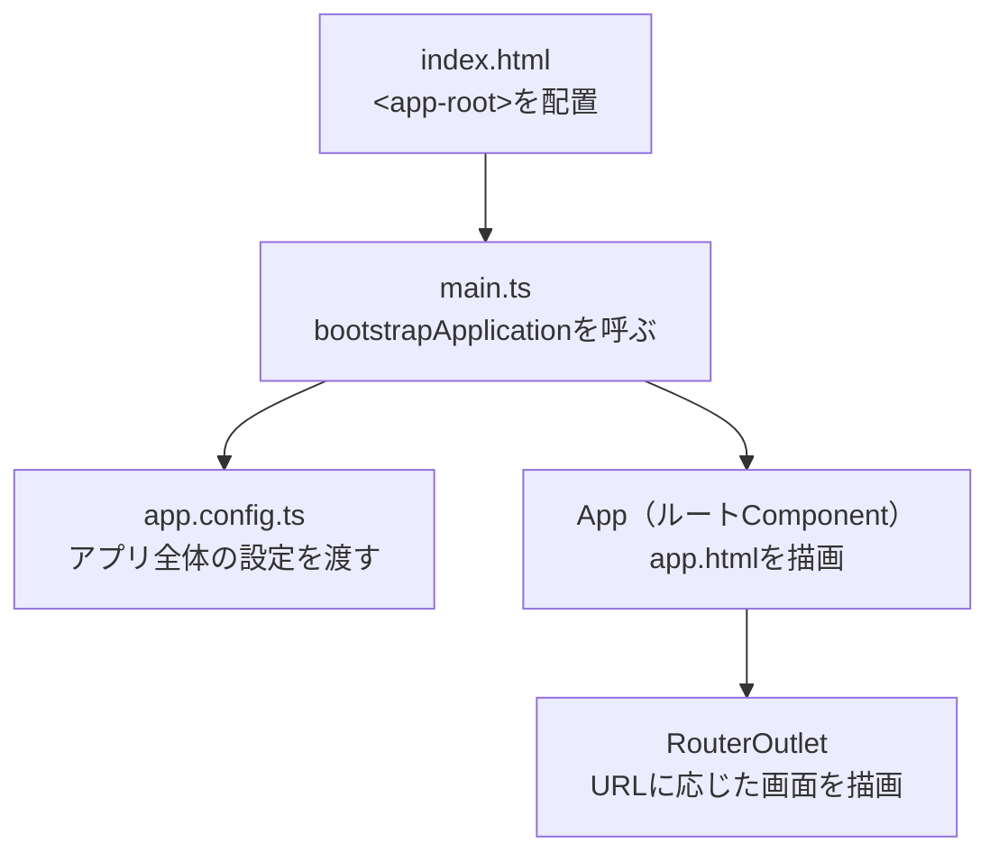

この章では、Angular開発を始めるための準備を整えます。開発環境とAngular CLIの使い方、そして生成されるプロジェクトの構成と、アプリが起動するまでの流れを学びます。

:::message
**この章で学ぶこと**

- Angular開発に必要なもの
- Angular CLIの役割とインストール方法
- 生成されるおもなファイルとフォルダの役割
- アプリケーションが起動して画面が表示されるまでの流れ
:::

## 開発環境とAngular CLI

前章までで、Angularがどのようなフレームワークで、どのように進化してきたのかを見てきました。この節では、実際にAngularを動かすための開発環境を整え、公式ツールであるAngular CLIの使い方を学びます。

Angular CLIは、Angular開発の中心にあるコマンドラインツールです。プロジェクトの作成から、開発サーバーの起動、コードの生成、ビルド、テスト、バージョンの更新まで、開発に必要な作業の多くをこのツールでまかなえます。まずは全体像をつかみ、この章の後半で作られたプロジェクトの中身を見ていきます。

### 開発に必要なもの

Angularの開発を始めるには、次のものを用意します。

- **Node.js**: Angular CLIやビルドツールはNode.js上で動作します。長期サポート（LTS）版を使うのが基本です。
- **npm**: パッケージ管理ツールで、Node.jsに同梱されています。ライブラリの取得やコマンドの実行に使います。
- **エディタ**: Visual Studio Codeが広く使われています。拡張機能「Angular Language Service」を入れると、テンプレート内でも補完や型チェック、エラー表示が効くようになり、開発が快適になります。
- **モダンなブラウザ**: 開発中の画面を確認するために使います。

:::message
Angularは、バージョンごとに対応するNode.jsの範囲が決まっています。新しいバージョンのAngularでは、古いNode.jsがサポート対象外になることがあります。導入前に、公式のバージョン互換表で対応するNode.jsのバージョンを確認してください。
:::

Node.jsが導入済みかどうかは、次のコマンドで確認できます。

```bash
node --version
npm --version
```

それぞれバージョン番号が表示されれば、準備ができています。

### Angular CLIとは

Angular CLIは、Angularプロジェクトを扱うための公式コマンドラインツールです。`ng`というコマンドを通じて、次のような作業を実行できます。

- 新規プロジェクトの作成
- 開発サーバーの起動
- Component・Service・Pipeなどのコード生成
- 本番向けのビルド
- テストの実行
- Angularのバージョン更新

これらを手作業で設定しようとすると、多くの知識と手間が必要になります。Angular CLIは、推奨される設定をあらかじめ用意してくれるため、開発者は本来の実装に集中できます。

### Angular CLIのインストール

Angular CLIは、npmを使ってインストールします。次のコマンドで、パソコン全体で使えるようにグローバルインストールします。

```bash
npm install -g @angular/cli
```

インストールが終わったら、バージョンを確認します。

```bash
ng version
```

AngularのバージョンやNode.jsのバージョンなどが一覧で表示されれば、インストールは成功です。

### 新規プロジェクトの作成

プロジェクトを作成するには、`ng new`コマンドに、プロジェクト名を続けて実行します。

```bash
ng new my-app
```

実行すると、いくつかの質問が対話形式で表示されます。おもな質問は次のとおりです。

- **スタイルシートの形式**: CSSやSCSSなどから選びます。迷う場合はCSSで問題ありません。
- **SSR（サーバーサイドレンダリング）を有効にするか**: 有効にすると、サーバー側でHTMLを生成する構成が追加されます。本書の学習段階では無効のままで構いません。

質問に答えると、必要なファイルが生成され、ライブラリのインストールまで自動で行われます。生成される各ファイルの役割は、本章の後半で詳しく解説します。

対話形式の質問は、オプションとして`ng new`のコマンドラインに直接指定することもできます。手順を手順書やCIスクリプトに残す場合は、対話に頼らないこちらの書き方のほうが再現性が高くなります。主要なオプションは次のとおりです。

| オプション | 役割 |
|---|---|
| `--style` | スタイルシートの形式を指定する（`css`・`scss`・`sass`・`less`） |
| `--routing` | ルーティング機能付きで生成するかどうか（既定は有効） |
| `--ssr` | SSR構成を含めて生成するかどうか |
| `--skip-install` | 依存ライブラリの自動インストールを行わない |
| `--package-manager` | 使用するパッケージマネージャーを指定する（`npm`・`yarn`・`pnpm`など） |
| `--dry-run` | 実際にはファイルを作らず、生成される内容だけを確認する |

たとえば、SCSSを使い、SSRなしのプロジェクトを対話なしで作成するには、次のように実行します。

```bash
ng new my-app --style=scss --ssr=false
```

:::message
本書が基準とするAngular 22では、新規プロジェクトは`Zone.js`に依存しないZoneless構成で生成されます。以前のAngularで作られたプロジェクトとは、初期設定が一部異なります。
:::

### ワークスペースとプロジェクト

`ng new`で作られるのは、正確には「ワークスペース」と呼ばれる単位です。ワークスペースは、1つ以上のプロジェクト（アプリケーションやライブラリ）をまとめて管理する入れ物です。多くの場合、ワークスペースには同じ名前のアプリケーションが1つ入った状態で作られます。

ワークスペース全体の設定は、`angular.json`というファイルに記述されます。1つのワークスペースに複数のアプリケーションや、共通で使うライブラリを加えることもでき、大規模な開発ではこの仕組みが役立ちます。当面は、「`ng new`はアプリケーション1つ分の入れ物を作る」と理解しておけば十分です。ファイルごとの役割は、本章の後半で改めて解説します。

### 開発サーバーの起動

作成したプロジェクトのフォルダに移動し、開発サーバーを起動します。

```bash
cd my-app
ng serve
```

起動すると、ローカルの開発用URL（既定では`http://localhost:4200/`）が表示されます。ブラウザでこのURLを開くと、初期画面が表示されます。開発サーバーは、ソースコードの変更を検知して自動で再ビルドし、ブラウザの表示も更新します。

ブラウザを自動で開きたい場合は、`--open`オプション（短縮形は`-o`）を付けます。

```bash
ng serve --open
```

開発サーバーを停止するには、ターミナルで`Ctrl + C`を押します。

### Angular DevTools

ブラウザには、Angular専用の開発者ツール拡張機能「Angular DevTools」を追加できます。ChromeやEdgeの拡張機能ストアから導入でき、`ng serve`で起動したアプリケーションを開いた状態でブラウザの開発者ツールを開くと、専用のタブとして表示されます。

Angular DevToolsでは、画面を構成するComponentのツリー構造と、各Componentが持つ状態をリアルタイムに確認できます。さらにProfiler機能を使うと、変更検知のサイクルごとにどのComponentが再描画されたかを可視化できます。どのComponentが何回描画されているかを目で追えるようになるため、後の章で扱う変更検知の仕組みやパフォーマンスの最適化を学ぶ際にも役立ちます。導入は必須ではありませんが、環境構築の段階で入れておくと、以降の章での動作確認がしやすくなります。

### npmスクリプトからの実行

`ng`コマンドの多くは、`package.json`に「npmスクリプト」としても登録されています。たとえば`npm start`は`ng serve`に、`npm test`は`ng test`に対応します。

```bash
npm start
```

`ng`コマンドとnpmスクリプトのどちらを使っても構いません。チームで実行方法を揃えたい場合は、`package.json`にスクリプトを定義しておくと、`npm run`で統一的に呼び出せます。

### よく使うCLIコマンド

Angular CLIには多くのコマンドがありますが、まずは次のものを覚えておけば十分です。

| コマンド | 役割 |
|---|---|
| `ng new <名前>` | 新規プロジェクトを作成する |
| `ng serve` | 開発サーバーを起動する |
| `ng generate component <名前>` | Componentを生成する（`ng g c <名前>`と短縮できる） |
| `ng build` | 本番向けにビルドする |
| `ng test` | テストを実行する |
| `ng update` | Angularや依存ライブラリを更新する |

たとえば、`user-profile`という名前のComponentを生成するには、次のように実行します。

```bash
ng generate component user-profile
```

これだけで、Componentのファイル一式（クラス・テンプレート・スタイル、そしてテスト用の`.spec.ts`）が生成され、必要な初期コードも用意されます。こうした生成は「スキマティクス（Schematics）」という仕組みにもとづいており、命名や配置が公式の推奨に沿って自動的に統一されます。手作業でファイルを作る場合に比べ、書き方のばらつきを防げます。

Componentだけでなく、Service・Pipe・Directive・Guardなども同じ形式で生成できます。生成する前に「何が作られるのか」を確認したいときは、`--dry-run`（短縮形は`-d`）オプションを付けます。実際にはファイルを作らず、作られる予定のファイルだけを一覧で表示してくれます。

```bash
ng generate service user --dry-run
```

各コマンドにどんなオプションがあるかは、`--help`で確認できます。

```bash
ng generate component --help
```

:::message
Angular 22では、新規プロジェクトのテストツールとしてVitestが標準になりました。`ng test`は、このVitestを使ってテストを実行します。
:::

### 本番向けのビルド

アプリケーションを公開するときは、`ng build`で本番向けにビルドします。

```bash
ng build
```

実行すると、`dist/`フォルダに、最適化されたファイル一式が出力されます。このとき、使われていないコードの削除やファイルの圧縮といった最適化が自動で行われます。あとは出力されたファイルをWebサーバーに配置すれば、アプリケーションを公開できます。

Angular CLIは、v17以降、`esbuild`と`Vite`を内部のビルドエンジンとして採用しています。`esbuild`はGoで実装された高速なバンドラーで、TypeScriptのコンパイルとモジュールのバンドルを短時間でこなします。`ng serve`が保存のたびにすばやく画面を更新できるのは、このesbuildによる差分ビルドと、Viteが提供する開発サーバーの仕組みによるものです。以前のAngular CLIはWebpackを内部エンジンとしており、プロジェクトの規模が大きくなるほどビルドや起動に時間がかかる傾向がありました。

開発時の`ng serve`と、この`ng build`の違いを押さえておきましょう。`ng serve`は、変更をすばやく画面に反映するために、成果物をメモリ上に持って動きます。一方`ng build`は、配布用の成果物をディスク（`dist/`）に書き出します。日々の開発では`ng serve`を、公開の準備では`ng build`を使う、と考えておけば十分です。

`dist/`フォルダの中身は、実際には次のような構成になります（ファイル名のハッシュ値は実行のたびに変わります）。

```text
dist/my-app/
└── browser/
    ├── index.html
    ├── main-XG4J2K3L.js       … アプリケーション本体のコード
    ├── polyfills-7HK3M1QZ.js  … ブラウザ間の差異を吸収するコード
    ├── styles-9F2A8B1C.css    … グローバルスタイル
    └── chunk-Q3R8T1WY.js      … 遅延読み込みされる部分のコード
```

`main-XG4J2K3L.js`のように、ファイル名に含まれる英数字はファイルの内容から算出したハッシュ値です。内容が変わらなければ同じ値のままで、内容が変わると別の値になります。Webサーバーやブラウザにファイルを長期間キャッシュさせても、更新されたファイルだけ違う名前で配信されるため、キャッシュを安全に効かせられます。

ビルド結果のサイズが大きくなりすぎると、`ng build`は警告やエラーを表示します。これは`angular.json`の`budgets`設定にもとづくもので、生成直後のプロジェクトにも既定値が設定済みです。初期バンドル（`initial`）は500KBを超えると警告、1MBを超えるとエラーになり、Component単体のスタイルシート（`anyComponentStyle`）は2KBで警告、4KBでエラーになります。警告が出たら、意図しないライブラリを読み込んでいないか、遅延読み込みで分割できる部分がないかを確認する合図と考えましょう。

### Angularを最新に保つ

前章で見たとおり、Angularは年に2回、定期的にリリースされます。`ng update`コマンドは、この更新を安全に進めるためのものです。

```bash
ng update
```

引数なしで実行すると、更新可能なパッケージの一覧が表示されます。Angular本体を更新する場合は、対象を指定して実行します。`ng update`は、単にバージョンを上げるだけでなく、古い書き方を新しい書き方へ自動で変換する移行処理も行ってくれます。この仕組みがあるため、長期にわたって運用するアプリケーションでも、少しずつ最新の形へ追従していけます。

### 開発環境とAngular CLIでよくあるつまずき

環境構築やCLIの実行でつまずきやすい点を、いくつか挙げておきます。

- **Node.jsのバージョンが合わない**: `ng`コマンドの実行時にバージョンに関する警告やエラーが出る場合、Node.jsが対象外のバージョンである可能性があります。対応バージョンを確認し、必要であればNode.jsを入れ直します。
- **`ng`コマンドが見つからない**: グローバルインストールしたのに`ng`が使えないときは、コマンドの実行パスが通っていないことがあります。ターミナルを開き直すか、パスの設定を確認します。
- **ポートが使用中**: `ng serve`で「ポート4200が使用中」と表示されたら、別のプロセスが同じポートを使っています。`ng serve --port 4300`のように、別のポートを指定して起動できます。
- **インストールに時間がかかる・失敗する**: ネットワークの状態や、社内プロキシの設定が影響していることがあります。時間をおいて試すか、npmのプロキシ設定を確認します。

つまずいたときは、まずエラーメッセージをそのまま読むことが解決の近道です。Angular CLIのメッセージは、原因と対処のヒントを含んでいることが多くあります。

## プロジェクト構成とAngularアプリが起動するまで

前節では、Angular CLIでプロジェクトを作成し、開発サーバーで初期画面を表示しました。この節では、そのとき生成されたファイルがそれぞれ何を担っているのか、そしてブラウザでURLを開いてから画面が表示されるまでに、内部で何が起きているのかを追います。

「アプリが起動する流れ」を一度つかんでおくと、この先どの章を学ぶときも、自分がアプリケーション全体のどこを触っているのかを見失わずにすみます。細部の理解は後の章に任せ、ここでは全体のつながりを把握することを目標にします。

### 生成されるファイルとフォルダ

`ng new`で生成されるプロジェクトは、おおよそ次のような構成になっています（一部を抜粋しています）。

```text
my-app/
├── src/
│   ├── app/
│   │   ├── app.ts          … ルートComponentのクラス
│   │   ├── app.html        … ルートComponentのテンプレート
│   │   ├── app.css         … ルートComponentのスタイル
│   │   ├── app.config.ts   … アプリケーションの設定
│   │   └── app.routes.ts   … ルーティングの定義
│   ├── main.ts             … アプリケーションの起動地点
│   ├── index.html          … 最初に読み込まれるHTML
│   └── styles.css          … アプリ全体のスタイル
├── public/                 … 画像などの静的ファイル
├── angular.json            … Angular CLIの設定
├── package.json            … 依存ライブラリとスクリプトの定義
└── tsconfig.json           … TypeScriptの設定
```

このうち、実際にアプリケーションを作り込んでいくのは、おもに`src/app/`フォルダの中です。

:::message
Angular 20以降のスタイルガイドでは、ファイル名に`.component`のような種類を表す接尾辞を付けません。ルートComponentのファイルは`app.ts`、クラス名は`App`となります。以前のAngularで作られたプロジェクトでは、`app.component.ts`・`AppComponent`という名前になっていることがあります。指しているものは同じです。
:::

### アプリケーションが起動するまで

ブラウザでアプリケーションを開いてから画面が表示されるまでの流れは、次のように進みます。



順番に見ていきます。

**index.html — 出発点となるHTML**

`index.html`は、ブラウザが最初に読み込むHTMLです。この中に、`<app-root>`という見慣れないタグが置かれています。

```html:src/index.html
<body>
  <app-root></app-root>
</body>
```

この`<app-root>`が、Angularアプリケーションを描画する場所です。起動後、この要素の内側にルートComponentの内容が差し込まれます。

**main.ts — アプリケーションの起動地点**

`main.ts`は、アプリケーションを起動する入口です。ここで`bootstrapApplication()`を呼び、どのComponentを起点にするか、どの設定を使うかを指定します。

```ts:src/main.ts
import { bootstrapApplication } from '@angular/platform-browser';
import { appConfig } from './app/app.config';
import { App } from './app/app';

bootstrapApplication(App, appConfig);
```

ここで指定した`App`が、アプリケーションの最上位に立つ「ルートComponent」です。そして`appConfig`が、アプリケーション全体に渡す設定です。

`bootstrapApplication()`は、内部でいくつかの準備を順に行います。まず、`appConfig`に登録された機能（プロバイダー）を使える状態にします。次に、ルートComponentである`App`を生成し、`index.html`の`<app-root>`の位置に描画します。この関数の呼び出しが、アプリケーション全体の処理が始まる起点になります。ここから先は、Componentの描画やイベント処理といったAngularの世界が動き出します。

**app.config.ts — アプリケーション全体の設定**

`app.config.ts`は、アプリケーション全体で使う機能を登録する場所です。ルーティングや通信などの機能は、ここで`providers`に登録することで有効になります。生成される内容は、次のようになります（バージョンにより多少異なります）。

```ts:src/app/app.config.ts
import { ApplicationConfig, provideBrowserGlobalErrorListeners, provideZonelessChangeDetection } from '@angular/core';
import { provideRouter } from '@angular/router';
import { routes } from './app.routes';

export const appConfig: ApplicationConfig = {
  providers: [
    provideBrowserGlobalErrorListeners(),
    provideZonelessChangeDetection(),
    provideRouter(routes),
  ],
};
```

`provideRouter(routes)`はルーティングを、`provideZonelessChangeDetection()`はZonelessの変更検知を有効にしています。かつてはこうした設定を`NgModule`に記述していましたが、モダンAngularでは、このように`provide〜`という関数を並べて設定します。ルーティングの詳細は[『Routerの基礎』の章](./14-router-basics)、Zonelessの変更検知については[『SignalsとZoneless』の章](./13-signals-and-zoneless)で扱います。

**App — ルートComponent**

`App`は、画面に最初に描画されるルートComponentです。`ng new`直後は、次のような形になっています。

```ts:src/app/app.ts
import { Component, signal } from '@angular/core';
import { RouterOutlet } from '@angular/router';

@Component({
  selector: 'app-root',
  imports: [RouterOutlet],
  templateUrl: './app.html',
  styleUrl: './app.css',
})
export class App {
  protected readonly title = signal('my-app');
}
```

注目したいのは`selector: 'app-root'`です。これが、先ほど`index.html`にあった`<app-root>`と対応しています。Angularは、このセレクターを手がかりに、`<app-root>`の位置へこのComponentを描画します。また`imports`には、テンプレートで使う`RouterOutlet`が宣言されています。Standalone Componentは、このように自身が必要とする依存を直接宣言します。

**RouterOutlet — 画面の切り替え地点**

ルートComponentのテンプレート（`app.html`）には、`RouterOutlet`が置かれています。

```html:src/app/app.html
<router-outlet></router-outlet>
```

`RouterOutlet`は、現在のURLに対応する画面を描画する場所です。URLが変わると、`app.routes.ts`に定義したルート設定にしたがって、この位置に表示するComponentが切り替わります。ルーティングの仕組みは『Routerの基礎』の章で詳しく扱います。

### 主要な設定ファイル

`src/`の外にある設定ファイルも、それぞれ役割を持っています。ふだん頻繁に編集するものではありませんが、役割を知っておくと安心です。

| ファイル | 役割 |
|---|---|
| `angular.json` | Angular CLIの設定。ビルドや開発サーバーの動作を定義する |
| `package.json` | 依存ライブラリと、`npm`で実行するスクリプトを定義する |
| `tsconfig.json` | TypeScriptのコンパイル設定を定義する |

TypeScriptの設定は、実際には1つのファイルで完結していません。`tsconfig.json`がプロジェクト全体に共通するコンパイラオプションを定義し、用途ごとの`tsconfig.app.json`・`tsconfig.spec.json`が`extends`でそれを継承したうえで、それぞれに必要な設定を追加します。

| ファイル | 対象 | 役割 |
|---|---|---|
| `tsconfig.json` | プロジェクト全体 | strictモードなど、共通のコンパイラオプションを定義する基本設定 |
| `tsconfig.app.json` | `src/main.ts`以下 | アプリケーション本体のビルド対象を定義する。`types`を`[]`にし、不要な型定義の自動読み込みを防いでいる |
| `tsconfig.spec.json` | `*.spec.ts` | テストのビルド対象を定義する。`types`に`vitest/globals`を含め、`describe`・`it`・`expect`をimportなしで使えるようにしている |

設定を分けているのは、アプリケーション本体とテストコードとで、必要になる型定義やコンパイル対象が異なるためです。共通のルールは`tsconfig.json`に一本化し、差分だけを`tsconfig.app.json`・`tsconfig.spec.json`に持たせています。

`angular.json`も、中を覗くと単なるビルド設定以上の構造を持っています。`projects`の下に、ワークスペースに含まれるアプリケーションやライブラリがプロジェクト名をキーとして並び、各プロジェクトは`architect`に、`build`・`serve`・`test`といったターゲットごとの設定を持ちます。ターゲットには実行する「ビルダー」（実体は`@angular/build`などのパッケージ）と、そのオプションが指定されています。

さらに各ターゲットは`configurations`で、環境ごとに異なるオプションを切り替えられます。生成直後から用意されている`production`構成では最適化が有効になっており、`ng build`は既定でこの構成を使ってビルドします。ステージング環境向けの設定を増やしたい場合も、この`configurations`に構成を追加する形で対応できます。

### 旧来のNgModule構成との違い

以前のAngularで作られたプロジェクトを開くと、ここまで見てきた構成とは違う形になっていることがあります。モダンAngularがStandalone構成で起動するのに対し、旧来は「NgModule構成」で起動していたためです。既存のプロジェクトを引き継ぐ場面もあるので、対応関係を押さえておきましょう。

旧来の構成では、`main.ts`が`AppModule`というNgModuleを起点に起動していました。

```ts:旧来の書き方（NgModule構成のmain.ts）
import { platformBrowserDynamic } from '@angular/platform-browser-dynamic';
import { AppModule } from './app/app.module';

platformBrowserDynamic().bootstrapModule(AppModule);
```

そして`app.module.ts`に、アプリケーションで使う部品や設定をまとめて登録していました。モダンAngularでは、この`AppModule`が担っていた役割が、次のように置き換わったと考えると理解しやすくなります。

| 旧来（NgModule構成） | モダンAngular（Standalone構成） |
|---|---|
| `main.ts`が`bootstrapModule(AppModule)`を呼ぶ | `main.ts`が`bootstrapApplication(App, appConfig)`を呼ぶ |
| `app.module.ts`に部品や設定を登録する | 各Componentの`imports`と`app.config.ts`の`providers`に分けて記述する |

この対応関係を手がかりにすると、`app.module.ts`が残っている古いプロジェクトを開いたときも、「いまのどの部分にあたるのか」を読み解きやすくなります。

## まとめ

- Angularの開発には、Node.js（LTS版）とnpm、エディタ、ブラウザを用意します
- Angular CLIは、プロジェクト作成からビルド・テスト・更新までを担う公式ツールです
- `ng new`でプロジェクトを作成し、`ng serve`で開発サーバーを起動します
- 実装の中心となるのは`src/app/`フォルダで、`main.ts`が起動の入口です
- `index.html`の`<app-root>`に、ルートComponentである`App`が描画されます
- `main.ts`が`bootstrapApplication()`を呼び、`app.config.ts`の設定とともにアプリケーションを起動します

次章からは、Angularの画面を組み立てる主役であるComponentに入ります。
