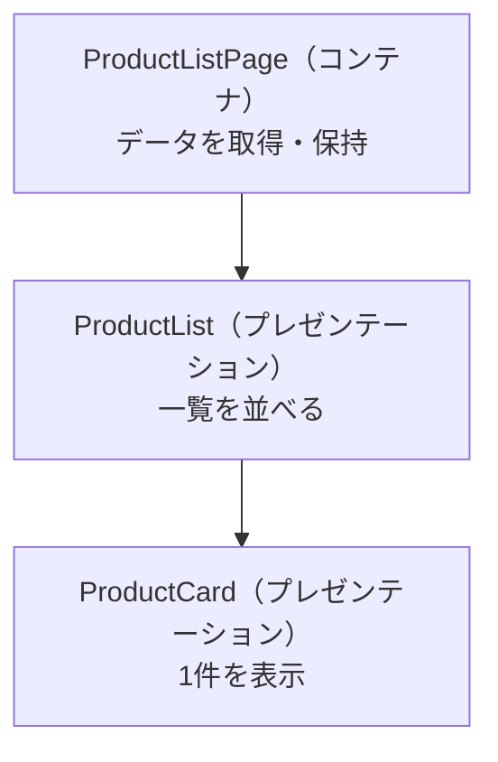

この章では、Componentをより実践的に扱う技法を学びます。コンテンツ投影とクエリ、スタイルのカプセル化、そしてComponentの分割と責務の設計を順に見ていきます。

:::message
**この章で学ぶこと**

- `ng-content`によるコンテンツ投影の仕組み
- 複数スロットとフォールバックコンテンツ
- Componentのスタイルがスコープされる仕組み
- View Encapsulationの3つのモード
- Componentを分割する目的
- 単一責任という考え方
:::

## コンテンツ投影とクエリ — ng-contentとviewChild()・contentChild()

前章までで、Componentを作り、組み合わせる方法を学びました。この節では、Componentをより柔軟に再利用するための2つの仕組みを扱います。ひとつは、Componentの外側から中身を差し込む「コンテンツ投影」。もうひとつは、Component内の子要素をクラスから参照する「クエリ」です。

この2つは、一見すると別々の話題に見えますが、深く関わっています。コンテンツ投影で差し込まれた要素を、クエリで参照する、という場面がよくあるためです。まずコンテンツ投影から見ていきましょう。

### コンテンツ投影とは

カードやダイアログのような「枠」を作ることを考えます。枠の見た目は共通で、中身だけが場面ごとに異なる、という部品です。このとき、中身をComponentの外側から渡せると便利です。この仕組みがコンテンツ投影で、`ng-content`を使います。

次の`Card`は、外から渡された内容を、枠の中に差し込むComponentです。

```ts:src/app/card.ts
import { Component } from '@angular/core';

@Component({
  selector: 'app-card',
  template: `
    <div class="card">
      <ng-content />
    </div>
  `,
  styleUrl: './card.css',
})
export class Card {}
```

この`Card`を使う側は、開始タグと終了タグの間に中身を書きます。その中身が、`<ng-content />`の位置に差し込まれます。

```html
<app-card>
  <p>ここに書いた内容がカードの中に表示されます</p>
</app-card>
```

`Card`自身は中身を知りません。中身を決めるのは使う側です。これにより、枠は共通のまま、中身だけを場面ごとに変えられます。

### 複数のスロットに振り分ける

差し込み先を複数に分けたいこともあります。たとえば「見出し」と「本文」を別々の位置に置きたい場合です。このときは、`ng-content`に`select`属性を付けて、どの内容をどこに差し込むかを指定します。

```ts:src/app/card.ts
@Component({
  selector: 'app-card',
  template: `
    <div class="card">
      <header><ng-content select="[card-title]" /></header>
      <div class="body"><ng-content /></div>
    </div>
  `,
})
export class Card {}
```

`select="[card-title]"`は、「`card-title`属性を持つ要素をここに差し込む」という指定です。`select`はComponentのセレクターと同じCSSセレクターを使えるため、属性・要素名・クラスなどで振り分けられます。使う側は、次のように書きます。

```html
<app-card>
  <h2 card-title>お知らせ</h2>
  <p>本文がここに入ります</p>
</app-card>
```

`card-title`属性が付いた`<h2>`は見出しの位置へ、それ以外の`<p>`は`select`のない`ng-content`（本文）へ振り分けられます。

:::message
`select`のない`<ng-content />`が1つもない場合、どのスロットにも一致しなかった内容は、画面に表示されません。振り分けと「その他」の受け皿を意識して設計してください。
:::

### フォールバックコンテンツ

外から何も渡されなかったときに備えて、既定の内容を用意できます。`ng-content`の中に書いた内容が、そのフォールバック（代替）になります。

```ts
@Component({
  selector: 'app-card',
  template: `
    <div class="card">
      <ng-content select="[card-title]">タイトルなし</ng-content>
    </div>
  `,
})
export class Card {}
```

使う側が`card-title`の要素を渡さなかった場合、「タイトルなし」が代わりに表示されます。渡された場合は、そちらが優先されます。この`ng-content`内にフォールバックを書ける仕組みは、Angular 18で導入されました。

### ngProjectAsと投影の注意点

要素を、実際のタグとは別のセレクターとして振り分けたいときは、`ngProjectAs`属性を使います。

```html
<app-card>
  <h2 ngProjectAs="[card-title]">見出し</h2>
</app-card>
```

これで`<h2>`は、`card-title`属性を持つものとして扱われ、見出しのスロットへ差し込まれます。

コンテンツ投影で注意したいのは、`ng-content`はビルド時に処理され、投影はComponentの生成時に一度だけ行われるという点です。`ng-content`自体を`@if`で囲んで出し分けるような使い方は想定されていません。表示を条件で切り替えたい場合は、投影された内容ではなく、枠側の構造で工夫します。

### 子要素を参照する — クエリ

ここからは、Componentのクラスから、テンプレート内の子要素を参照する「クエリ」を扱います。モダンAngularでは、Signalとして結果を受け取る`viewChild()`・`contentChild()`などの関数を使います。

参照先には、2つの種類があります。この違いがクエリを理解する鍵です。

- **ビュー（view）**: そのComponent自身のテンプレートに書かれた要素
- **コンテンツ（content）**: 外から`ng-content`に差し込まれた要素

自身のテンプレート内を参照するのが`viewChild()`、投影された内容を参照するのが`contentChild()`です。

**viewChild() — 自身のテンプレートを参照する**

`viewChild()`は、そのComponentのテンプレートにある子Componentや要素を参照します。結果はSignalなので、`()`を付けて値を取り出します。

```ts:src/app/card-list.ts
import { Component, viewChild, computed } from '@angular/core';
import { CardHeader } from './card-header';

@Component({
  selector: 'app-card-list',
  imports: [CardHeader],
  template: `<app-card-header />`,
})
export class CardList {
  header = viewChild(CardHeader);
  headerText = computed(() => this.header()?.text);
}
```

結果は「まだ見つかっていない」状態もありうるため、値は`undefined`の可能性を含みます。必ず存在すると保証したい場合は、`.required()`を使います。見つからなければAngularがエラーを報告し、戻り値から`undefined`が除かれます。

```ts
header = viewChild.required(CardHeader);
```

**contentChild() — 投影された内容を参照する**

`contentChild()`は、`ng-content`を通して外から差し込まれた要素を参照します。書き方は`viewChild()`とまったく同じで、参照する対象が「投影されたコンテンツ」である点だけが異なります。

```ts:src/app/card.ts
import { Component, contentChild } from '@angular/core';
import { CardTitle } from './card-title';

@Component({
  selector: 'app-card',
  template: `<div class="card"><ng-content /></div>`,
})
export class Card {
  title = contentChild(CardTitle);
}
```

複数の要素をまとめて参照したいときは、`viewChildren()`・`contentChildren()`を使います。これらは配列のSignalを返します。参照範囲を孫要素まで広げたい場合は、`contentChildren(CardTitle, { descendants: true })`のようにオプションを指定します。

**旧来の@ViewChild・@ContentChildとの違い**

Signalベースのクエリが登場する前は、`@ViewChild`・`@ContentChild`というデコレーターを使っていました。

```ts:旧来の書き方（デコレーター）
export class CardList {
  @ViewChild(CardHeader) header!: CardHeader;

  ngAfterViewInit(): void {
    console.log(this.header.text);
  }
}
```

旧来の書き方では、参照結果を安全に扱えるのが`ngAfterViewInit`のようなライフサイクルの後になる、という制約がありました。結果を取り出すタイミングを、開発者が意識する必要があったのです。

一方、Signalベースの`viewChild()`は結果をSignalとして返すため、`computed()`や`effect()`と自然に組み合わせられ、ライフサイクルを意識せずに扱えます。`viewChild()`はAngular 17.2でプレビュー導入され、Angular 19で安定版になりました。

**よくある混同 — viewとcontentの取り違え**

`viewChild()`と`contentChild()`は書き方がそっくりなので、取り違えやすい点に注意してください。判断の基準は「その要素が、自分のテンプレートに直接書かれているか、それとも`ng-content`を通して外から差し込まれたか」です。自分のテンプレートに書いた子Componentは`viewChild()`で、`<app-card>ここ</app-card>`のように外から渡された内容は`contentChild()`で参照します。`contentChild()`で自分のテンプレート内を探しても、`viewChild()`で投影された内容を探しても、対象は見つかりません。参照したい要素が「どちら側にあるか」を意識すると、迷わなくなります。

## スタイリングとView Encapsulation

Componentには、テンプレートやクラスと並んで、スタイル（CSS）も付属します。この節では、Componentに書いたスタイルがどのように扱われるのか、なぜ他のComponentに影響しないのかを学びます。その鍵となるのが、View Encapsulation（ビューのカプセル化）という仕組みです。

CSSは本来、書いたスタイルがページ全体に及びます。あるComponentのために書いた`p { color: red; }`が、アプリケーション中のすべての`<p>`を赤くしてしまう、といったことが起こりえます。Angularは、この問題を既定で防いでくれます。その仕組みを理解しておくと、スタイルが「効かない」「漏れる」といったつまずきに、落ち着いて対処できます。

### Componentのスタイルはスコープされる

Componentにスタイルを付けるには、`@Component`の`styleUrl`で別ファイルを指定するか、`styles`に直接書きます。

```ts:src/app/greeting.ts
@Component({
  selector: 'app-greeting',
  template: `<p>こんにちは</p>`,
  styleUrl: './greeting.css',
})
export class Greeting {}
```

```css:src/app/greeting.css
p {
  color: red;
}
```

この`p { color: red; }`は、`Greeting`のテンプレート内の`<p>`だけを赤くします。ほかのComponentにある`<p>`には影響しません。CSS本来のふるまいと違い、スタイルがComponentの中に閉じ込められているのです。この「スタイルがComponentの範囲に限定される」性質を、スコープと呼びます。

### View Encapsulationの仕組み

なぜスタイルがComponentの中に閉じるのでしょうか。その正体が、View Encapsulationです。

既定のモードでは、Angularはビルド時に、Componentの要素へ特別な属性（たとえば`_ngcontent-abc`のようなもの）を付け足します。そして、書いたCSSセレクターにも同じ属性を自動で付け加えます。結果として、`p { color: red; }`は内部的に「その属性を持つ`<p>`だけ」に限定され、他のComponentには届かなくなります。

開発者がこの属性を意識して書く必要はありません。Angularが自動で行うため、私たちはふつうにCSSを書くだけで、スコープされたスタイルを得られます。

実際に生成されるHTMLとCSSは、たとえば次のようなイメージです（属性名は自動で決まります）。

```html
<p _ngcontent-abc>こんにちは</p>
```

```css
p[_ngcontent-abc] {
  color: red;
}
```

`<p>`と、それに対応するCSSセレクターの両方に、同じ目印（`_ngcontent-abc`）が付いています。この目印が一致する要素にしかスタイルが当たらないため、他のComponentの`<p>`には影響しないのです。ブラウザの開発者ツールで要素を調べると、こうした属性が付いているのを実際に確認できます。

### 3つのカプセル化モード

View Encapsulationには、3つのモードがあります。`@Component`の`encapsulation`で指定します。

| モード | 挙動 |
|---|---|
| `Emulated`（既定） | 属性を付与してスコープを模倣する。他のComponentに漏れない |
| `None` | カプセル化しない。スタイルがアプリ全体に及ぶ |
| `ShadowDom` | ブラウザ標準のShadow DOMで、本物の分離を行う |

ふだんは、既定の`Emulated`のままで問題ありません。次のように書けば、明示的に指定することもできます。

```ts
import { Component, ViewEncapsulation } from '@angular/core';

@Component({
  selector: 'app-greeting',
  templateUrl: './greeting.html',
  styleUrl: './greeting.css',
  encapsulation: ViewEncapsulation.Emulated,
})
export class Greeting {}
```

`None`は、あえてスタイルを全体に効かせたいときに使いますが、他のComponentへ意図せず漏れる危険があります。`ShadowDom`は、ブラウザのShadow DOMを使って完全に分離しますが、外側からのスタイル調整が難しくなるなどの制約があります。いずれも、必要な理由があるときにだけ選ぶモードです。

たとえば`ShadowDom`は、Angularで作ったComponentを、Angular以外の環境でも使えるWeb Componentとして配布する、といった場面で選ばれます。逆に、アプリ内で完結する通常のComponentでは、既定の`Emulated`がもっとも扱いやすく、無理にモードを変える必要はありません。まずは既定のまま使い、明確な理由ができたときにだけ変更する、と考えておけば十分です。

### :hostでホスト要素を指定する

Componentのスタイルは、テンプレートの中身には効きますが、Component自身のタグ（ホスト要素）には、そのままでは効きません。たとえば`<app-greeting>`そのものに枠線を付けたいときは、`:host`という特別なセレクターを使います。

```css:src/app/greeting.css
:host {
  display: block;
  border: 1px solid #ccc;
  padding: 16px;
}
```

`:host`は、そのComponentのホスト要素自身を指します。Componentに余白や表示形式を与えたいときによく使います。

さらに、外側の状況に応じてスタイルを変えたいときは、`:host-context`を使います。たとえば、祖先に`dark`クラスがあるときだけ配色を変える、といった指定ができます。

```css
:host-context(.dark) {
  background: #222;
  color: #fff;
}
```

これは、アプリ全体のテーマ（明るい／暗い）に応じてComponentの見た目を切り替える、といった場面で役立ちます。

なお、`:host`は括弧を使って`:host(.active)`のように書くこともできます。これは「ホスト要素が`active`クラスを持つときだけ適用する」という条件付きの指定です。Component自身の状態に応じて、枠の色や背景を切り替えたいときに便利です。状態を表すクラスの付け外しは、第3部で学ぶクラスバインディングで行います。

### グローバルスタイルとの使い分け

Componentのスタイルがスコープされる一方で、アプリケーション全体に効かせたいスタイルもあります。フォントや配色の基本、リセットCSSなどです。これらは、プロジェクト直下の`src/styles.css`に書きます。ここに書いたスタイルは、カプセル化されず、アプリ全体に適用されます。

使い分けの目安は次のとおりです。

- **Componentのスタイル**: そのComponentだけに関わる見た目。大半のスタイルはこちら
- **グローバルスタイル（`styles.css`）**: アプリ全体で共通の土台となる見た目

迷ったら、まずComponentのスタイルに書き、本当に全体で共通のものだけをグローバルへ出す、と考えるとよいでしょう。

### ::ng-deepとその注意

子Componentの内部にまでスタイルを届かせたい、という要望が出ることがあります。このために`::ng-deep`という記法が使えますが、これはカプセル化の壁を越えてスタイルを漏らすもので、非推奨とされています。多用すると、どこからスタイルが効いているのかが追いにくくなり、カプセル化の利点を損ないます。

```css
/* 非推奨: カプセル化の壁を越えてしまう */
:host ::ng-deep .child-title {
  color: red;
}
```

子Componentの見た目を変えたい場合は、`::ng-deep`に頼るのではなく、子Component側にスタイルの入り口を用意するのが、より安全な方法です。まずはカプセル化を尊重する、という姿勢を基本にしてください。

### CSS変数でスタイルを受け渡す

子Componentの見た目を外から調整したいとき、`::ng-deep`に頼らない安全な方法のひとつが、CSSカスタムプロパティ（CSS変数）です。CSS変数は、カプセル化の壁を越えて受け渡せる性質を持っています。

子Component側では、変数を使ってスタイルを定義しておきます。第2引数に既定値を書けるので、外から指定がなくても破綻しません。

```css:src/app/badge.css
:host {
  background: var(--badge-bg, #eee); /* 既定は #eee */
}
```

使う側は、その変数に値を与えるだけで、見た目を変えられます。

```css
app-badge {
  --badge-bg: tomato;
}
```

この方法なら、子Componentが「どこを変更してよいか」を`--badge-bg`という形で明示できます。カプセル化を壊さずに、必要な部分だけを外から調整できるため、`::ng-deep`より見通しよく、安全にスタイルをカスタマイズできます。CSS変数は、テーマの切り替えにも便利です。アプリ全体で使う色を変数で定義しておけば、その変数の値を切り替えるだけで、配色を一括で変えられます。

### よくあるつまずき

スタイル周りでつまずきやすい点を挙げておきます。

- **書いたスタイルが効かない**: セレクターがテンプレートの構造と合っているかを確認します。Componentのスタイルは、そのテンプレート内の要素にしか当たりません。
- **子Componentの中身にスタイルが届かない**: これはView Encapsulationによる正しい挙動です。子側にCSS変数などの入り口を用意するか、子Component自身のスタイルとして書きます。
- **グローバルに書いたスタイルが効きすぎる**: `src/styles.css`はアプリ全体に及びます。特定のComponentだけに効かせたいスタイルは、そのComponent側に書きます。

## Componentの分割と責務

ここまでで、Componentの作り方と、それを支える仕組みを学んできました。第2部の最後となるこの節では、視点を少し上げて、「Componentをどう分割し、それぞれに何を担わせるか」という設計の話をします。

Componentは、1つにまとめることも、細かく分けることもできます。どちらが正解というわけではありませんが、分け方を誤ると、見通しが悪く、再利用しづらく、テストしにくいコードになります。この節では、分割の目的と指針を整理し、実際に画面を分割する例を通して、設計の勘所をつかみます。

### Componentを分割する理由

なぜComponentを分割するのでしょうか。おもな理由は3つあります。

- **再利用**: 小さく独立した部品は、別の画面でも使い回せます
- **見通し**: 1つのComponentが小さいほど、何をしているかを理解しやすくなります
- **テスト**: 責務が限定された部品ほど、テストの対象が明確になります

逆に、1つのComponentにすべてを詰め込むと、テンプレートは長大になり、クラスはさまざまな処理を抱え込み、どこを直せば何に影響するのかがわからなくなります。分割は、この複雑さを抑えるための基本的な手段です。加えて、責務が分かれていれば、複数人での開発時に担当を分けやすくなる利点もあります。あるComponentを直しても、ほかのComponentへの影響が及びにくいためです。

### 単一責任という考え方

分割の指針としてまず押さえたいのが、「1つのComponentは、1つの関心事に集中する」という考え方です。ソフトウェア設計で広く知られる、単一責任の原則にもとづくものです。

たとえば「商品一覧画面」を考えます。この画面には、次のような関心事が混在しています。

- 商品データを取得する
- 商品を一覧として並べる
- 個々の商品の見た目を整える
- 並び替えや絞り込みを操作する

これらをすべて1つのComponentに書くと、Componentは「データ取得も、一覧表示も、見た目も、操作も」担う、責務のはっきりしない部品になります。関心事ごとにComponentを分ければ、それぞれが何のための部品なのかが明確になります。

判断の目安として、あるComponentを説明するときに「〜と〜と〜をする」と『と』でいくつもつながるなら、責務が多すぎるサインです。「商品を一覧表示する」のように、ひとことで言い切れる状態を目指します。ひとことで説明できるComponentは、名前も付けやすく、テストの対象も明確になります。

### 状態を持つComponentと持たないComponent

分割の考え方として広く使われるのが、Componentを2種類に分ける方法です。

- **状態を持つComponent（コンテナ）**: データの取得や保持、全体の取りまとめを担う
- **状態を持たないComponent（プレゼンテーション）**: 受け取ったデータを表示し、操作を外へ伝えることに徹する

コンテナは「何を表示するか」を決め、プレゼンテーションは「どう表示するか」に集中します。プレゼンテーションComponentは、自分ではデータを取りにいかず、外から渡されたものを表示するだけなので、独立して再利用しやすく、テストも容易です。

先ほどの商品一覧なら、次のように分けられます。

- `ProductListPage`（コンテナ）: 商品データを取得し、一覧Componentに渡す
- `ProductList`（プレゼンテーション）: 受け取った商品の配列を並べる
- `ProductCard`（プレゼンテーション）: 個々の商品を表示する



コンテナから子へデータを渡し、子から親へ操作を伝える具体的な仕組み、すなわち入力（input）と出力（output）は、第4部で詳しく扱います。ここでは「データを持つ側と、見た目を担う側を分ける」という設計の発想をつかんでください。

### コードで見る分割

先ほどの商品一覧を、コードの形でも見てみましょう。コンテナは、データを取得し、それをプレゼンテーションComponentに渡します。

```ts:src/app/product-list-page.ts
@Component({
  selector: 'app-product-list-page',
  imports: [ProductList],
  template: `<app-product-list [products]="products()" />`,
})
export class ProductListPage {
  private readonly service = inject(ProductService);
  protected readonly products = this.service.getProducts();
}
```

プレゼンテーション側は、渡された商品を受け取って並べるだけです。自分ではデータを取りにいきません。

```ts:src/app/product-list.ts
@Component({
  selector: 'app-product-list',
  imports: [ProductCard],
  template: `
    @for (product of products(); track product.id) {
      <app-product-card [product]="product" />
    }
  `,
})
export class ProductList {
  products = input<Product[]>([]);
}
```

逆に、プレゼンテーション側での操作を、コンテナへ伝えることもできます。たとえば、商品カードがクリックされたことを親に知らせるには、出力（output）を使います。

```ts:src/app/product-card.ts
@Component({
  selector: 'app-product-card',
  template: `
    <button (click)="selected.emit(product())">{{ product().name }}</button>
  `,
})
export class ProductCard {
  product = input.required<Product>();
  selected = output<Product>();
}
```

プレゼンテーションは「クリックされた」という事実だけを外へ伝え、それをどう扱うか（画面を遷移するのか、選択状態にするのか）はコンテナが決めます。このように、上から下へはデータを、下から上へは出来事を流すのが、見通しのよい設計の基本です。データを渡す`[products]`や、受け取る`input()`、繰り返しの`@for`といった記法は、第3部と第4部で詳しく扱います。ここでは、責務がきれいに分かれている形をつかんでください。

### 分割したComponentの置き場所

Componentを分割すると、ファイルが増えます。関連するComponentは、機能ごとのフォルダにまとめておくと見通しがよくなります。たとえば商品まわりのComponentは、`product/`フォルダにまとめます。

```text
src/app/
├── product/
│   ├── product-list-page.ts   … コンテナ
│   ├── product-list.ts        … 一覧
│   └── product-card.ts        … 1件
└── ...
```

どこに何があるかがフォルダ構成から読み取れると、規模が大きくなっても迷いにくくなります。アプリケーション全体のフォルダ設計は、第11部でも改めて扱います。

### 分割の指針

では、どこで分割すればよいのでしょうか。次のような兆候が、分割を考える目安になります。

- テンプレートが長くなり、全体を一目で追えなくなってきた
- 同じ見た目のまとまりが、複数の場所で繰り返し登場している
- 1つのComponentが、データ取得も表示も操作も担っている
- 一部分だけを、別の画面でも使い回したくなった

こうした兆候が見えたら、関心事のまとまりを切り出して、別のComponentにすることを検討します。

切り出す作業自体は、あとからでも行えます。最初から完璧な分割を目指す必要はありません。まず動くものを作り、重複や肥大化が見えてきた段階で、`ng generate component`で新しいComponentを作り、そこへ切り出す、という進め方が現実的です。設計は一度で決めきるものではなく、開発を進めながら少しずつ整えていくものだと考えてください。

### 分けすぎにも注意する

一方で、分割は万能ではありません。何でも細かく分ければよいわけではないのです。

意味のまとまりがないのに機械的に分割すると、Component間で受け渡すデータが増え、かえって全体像を追いにくくなります。ごく小さく、単独では意味をなさない部品を大量に作ると、ファイルばかり増えて、どこで何が起きているのかが見えなくなります。

分割の判断は、「そのまとまりに名前を付けられるか」を目安にするとよいでしょう。`ProductCard`のように役割を言い表せるなら、分割する価値があります。うまく名前が付けられないなら、まだ分けるべきまとまりになっていない、というサインかもしれません。適切な粒度は経験でつかめてくるので、まずは大きく作り、必要に応じて切り出す、という順番で進めるのが安全です。

### よくある設計の失敗

分割にまつわる典型的な失敗を、両極として押さえておきましょう。

- **神Component**: 1つのComponentに、データ取得・表示・操作をすべて詰め込んだ状態です。テンプレートが長大になり、修正の影響範囲が読めなくなります。関心事ごとに切り出すのが対処です。
- **過度な分割**: 意味のまとまりがないのに、細かく分けすぎた状態です。Component間の受け渡しばかりが増え、かえって全体を追いにくくなります。
- **深いバケツリレー**: 親から子、孫へとデータを渡し続ける状態です。階層が深いと、途中のComponentが中身に関心がないのにデータを素通しすることになります。これは、状態管理（第10部）で扱う仕組みによって緩和できます。

いずれの極端も避け、「名前を付けられるまとまり」を単位に分ける、というバランスを意識してください。

## まとめ

- コンテンツ投影は`ng-content`で実現し、Componentの外側から中身を差し込めます
- `select`属性で複数スロットに振り分け、`ng-content`内にフォールバックを書けます
- クエリには、自身のテンプレートを見る`viewChild()`と、投影された内容を見る`contentChild()`があります
- Componentのスタイルは既定でスコープされ、他のComponentに影響しません
- その仕組みがView Encapsulationで、既定の`Emulated`は属性を付与してスコープを模倣します
- モードには`Emulated`・`None`・`ShadowDom`があり、ふだんは既定のままで問題ありません
- Componentの分割は、再利用・見通し・テストのしやすさを高めるための手段です
- 1つのComponentは1つの関心事に集中させる、という単一責任の考え方が指針になります
- データを持つコンテナと、表示に徹するプレゼンテーションに分けると、責務が明確になります

次章からは、テンプレートの中身、すなわち画面を動かす仕組みに踏み込みます。
