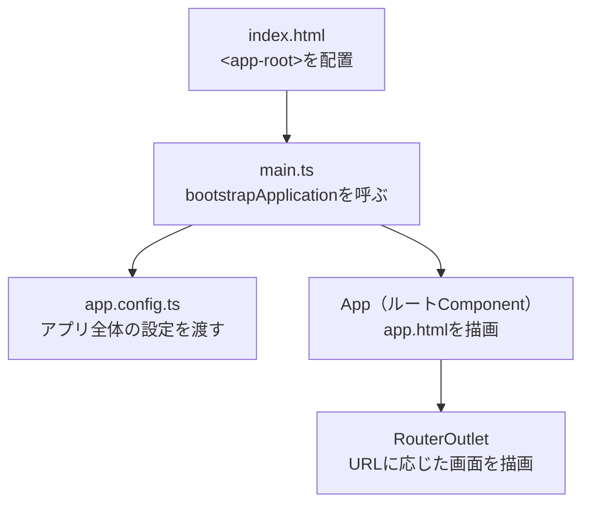

前章では、Angular CLIでプロジェクトを作成し、開発サーバーで初期画面を表示しました。この章では、そのとき生成されたファイルがそれぞれ何を担っているのか、そしてブラウザでURLを開いてから画面が表示されるまでに、内部で何が起きているのかを追います。

「アプリが起動する流れ」を一度つかんでおくと、この先どの章を学ぶときも、自分がアプリケーション全体のどこを触っているのかを見失わずにすみます。細部の理解は後の章に任せ、ここでは全体のつながりを把握することを目標にします。

:::message
**この章で学ぶこと**

- 生成されるおもなファイルとフォルダの役割
- アプリケーションが起動して画面が表示されるまでの流れ
- ルートComponentと設定ファイルの関係
:::

## 生成されるファイルとフォルダ

`ng new`で生成されるプロジェクトは、おおよそ次のような構成になっています（一部を抜粋しています）。

```text
my-app/
├── src/
│   ├── app/
│   │   ├── app.ts          … ルートComponentのクラス
│   │   ├── app.html        … ルートComponentのテンプレート
│   │   ├── app.css         … ルートComponentのスタイル
│   │   ├── app.config.ts   … アプリケーションの設定
│   │   └── app.routes.ts   … ルーティングの定義
│   ├── main.ts             … アプリケーションの起動地点
│   ├── index.html          … 最初に読み込まれるHTML
│   └── styles.css          … アプリ全体のスタイル
├── public/                 … 画像などの静的ファイル
├── angular.json            … Angular CLIの設定
├── package.json            … 依存ライブラリとスクリプトの定義
└── tsconfig.json           … TypeScriptの設定
```

このうち、実際にアプリケーションを作り込んでいくのは、おもに`src/app/`フォルダの中です。

:::message
Angular 20以降のスタイルガイドでは、ファイル名に`.component`のような種類を表す接尾辞を付けません。ルートComponentのファイルは`app.ts`、クラス名は`App`となります。以前のAngularで作られたプロジェクトでは、`app.component.ts`・`AppComponent`という名前になっていることがあります。指しているものは同じです。
:::

## アプリケーションが起動するまで

ブラウザでアプリケーションを開いてから画面が表示されるまでの流れは、次のように進みます。



順番に見ていきます。

### index.html — 出発点となるHTML

`index.html`は、ブラウザが最初に読み込むHTMLです。この中に、`<app-root>`という見慣れないタグが置かれています。

```html:src/index.html
<body>
  <app-root></app-root>
</body>
```

この`<app-root>`が、Angularアプリケーションを描画する場所です。起動後、この要素の内側にルートComponentの内容が差し込まれます。

### main.ts — アプリケーションの起動地点

`main.ts`は、アプリケーションを起動する入口です。ここで`bootstrapApplication()`を呼び、どのComponentを起点にするか、どの設定を使うかを指定します。

```ts:src/main.ts
import { bootstrapApplication } from '@angular/platform-browser';
import { appConfig } from './app/app.config';
import { App } from './app/app';

bootstrapApplication(App, appConfig);
```

ここで指定した`App`が、アプリケーションの最上位に立つ「ルートComponent」です。そして`appConfig`が、アプリケーション全体に渡す設定です。

`bootstrapApplication()`は、内部でいくつかの準備を順に行います。まず、`appConfig`に登録された機能（プロバイダー）を使える状態にします。次に、ルートComponentである`App`を生成し、`index.html`の`<app-root>`の位置に描画します。この関数の呼び出しが、アプリケーション全体の処理が始まる起点になります。ここから先は、Componentの描画やイベント処理といったAngularの世界が動き出します。

### app.config.ts — アプリケーション全体の設定

`app.config.ts`は、アプリケーション全体で使う機能を登録する場所です。ルーティングや通信などの機能は、ここで`providers`に登録することで有効になります。生成される内容は、次のようになります（バージョンにより多少異なります）。

```ts:src/app/app.config.ts
import { ApplicationConfig, provideBrowserGlobalErrorListeners, provideZonelessChangeDetection } from '@angular/core';
import { provideRouter } from '@angular/router';
import { routes } from './app.routes';

export const appConfig: ApplicationConfig = {
  providers: [
    provideBrowserGlobalErrorListeners(),
    provideZonelessChangeDetection(),
    provideRouter(routes),
  ],
};
```

`provideRouter(routes)`はルーティングを、`provideZonelessChangeDetection()`はZonelessの変更検知を有効にしています。かつてはこうした設定を`NgModule`に記述していましたが、モダンAngularでは、このように`provide〜`という関数を並べて設定します。それぞれの機能の詳細は、対応する部で解説します。

### App — ルートComponent

`App`は、画面に最初に描画されるルートComponentです。`ng new`直後は、次のような形になっています。

```ts:src/app/app.ts
import { Component, signal } from '@angular/core';
import { RouterOutlet } from '@angular/router';

@Component({
  selector: 'app-root',
  imports: [RouterOutlet],
  templateUrl: './app.html',
  styleUrl: './app.css',
})
export class App {
  protected readonly title = signal('my-app');
}
```

注目したいのは`selector: 'app-root'`です。これが、先ほど`index.html`にあった`<app-root>`と対応しています。Angularは、このセレクターを手がかりに、`<app-root>`の位置へこのComponentを描画します。また`imports`には、テンプレートで使う`RouterOutlet`が宣言されています。Standalone Componentは、このように自身が必要とする依存を直接宣言します。

### RouterOutlet — 画面の切り替え地点

ルートComponentのテンプレート（`app.html`）には、`RouterOutlet`が置かれています。

```html:src/app/app.html
<router-outlet></router-outlet>
```

`RouterOutlet`は、現在のURLに対応する画面を描画する場所です。URLが変わると、`app.routes.ts`に定義したルート設定にしたがって、この位置に表示するComponentが切り替わります。ルーティングの仕組みは第7部で詳しく扱います。

## 主要な設定ファイル

`src/`の外にある設定ファイルも、それぞれ役割を持っています。ふだん頻繁に編集するものではありませんが、役割を知っておくと安心です。

| ファイル | 役割 |
|---|---|
| `angular.json` | Angular CLIの設定。ビルドや開発サーバーの動作を定義する |
| `package.json` | 依存ライブラリと、`npm`で実行するスクリプトを定義する |
| `tsconfig.json` | TypeScriptのコンパイル設定を定義する |

## 旧来のNgModule構成との違い

以前のAngularで作られたプロジェクトを開くと、ここまで見てきた構成とは違う形になっていることがあります。モダンAngularがStandalone構成で起動するのに対し、旧来は「NgModule構成」で起動していたためです。既存のプロジェクトを引き継ぐ場面もあるので、対応関係を押さえておきましょう。

旧来の構成では、`main.ts`が`AppModule`というNgModuleを起点に起動していました。

```ts:旧来の書き方（NgModule構成のmain.ts）
import { platformBrowserDynamic } from '@angular/platform-browser-dynamic';
import { AppModule } from './app/app.module';

platformBrowserDynamic().bootstrapModule(AppModule);
```

そして`app.module.ts`に、アプリケーションで使う部品や設定をまとめて登録していました。モダンAngularでは、この`AppModule`が担っていた役割が、次のように置き換わったと考えると理解しやすくなります。

| 旧来（NgModule構成） | モダンAngular（Standalone構成） |
|---|---|
| `main.ts`が`bootstrapModule(AppModule)`を呼ぶ | `main.ts`が`bootstrapApplication(App, appConfig)`を呼ぶ |
| `app.module.ts`に部品や設定を登録する | 各Componentの`imports`と`app.config.ts`の`providers`に分けて記述する |

この対応関係を手がかりにすると、`app.module.ts`が残っている古いプロジェクトを開いたときも、「いまのどの部分にあたるのか」を読み解きやすくなります。

## まとめ

- 実装の中心となるのは`src/app/`フォルダで、`main.ts`が起動の入口です
- `index.html`の`<app-root>`に、ルートComponentである`App`が描画されます
- `main.ts`が`bootstrapApplication()`を呼び、`app.config.ts`の設定とともにアプリケーションを起動します
- アプリ全体の設定は、`NgModule`ではなく`provide〜`という関数を`app.config.ts`に並べて行います
- `RouterOutlet`の位置に、URLに応じた画面が描画されます

以上で第1部は終わりです。次の第2部では、Componentを本格的に扱う前提として、まずAngularで使うTypeScriptを整理します。
