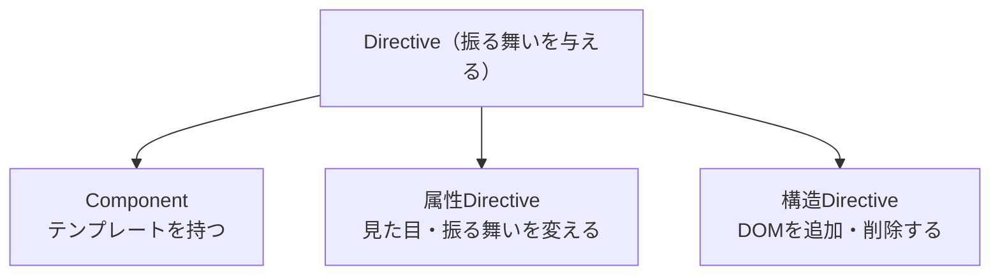

この章では、テンプレートで画面を動かす記法を学びます。データバインディングと制御フロー（`@if`・`@for`）を押さえ、さらに要素を拡張するDirectiveの全体像をつかみます。

:::message
**この章で学ぶこと**

- データバインディングの4つの種類と、それぞれの向き
- 補間・プロパティバインディング・イベントバインディングの書き方
- `@if`・`@for`・`@switch`による制御フロー
- `@for`の`track`と、繰り返しのコンテキスト変数
- Directiveが何をするものか
- Directiveの3つの種類
:::

## データバインディングとイベント処理

『TypeScriptとComponentの基本』の章では、Componentがテンプレート・クラス・スタイルの3要素からなることを学びました。その「Componentとは何か」の節で「クラスとテンプレートは連携する」と述べましたが、その連携の具体的な仕組みには踏み込みませんでした。この節で、その中身を明らかにします。

クラスの持つデータを画面に映し、画面での操作をクラスへ返す。この双方向のやり取りを担うのが、データバインディングです。AngularのテンプレートがただのHTMLと違うのは、この仕組みを備えているからです。バインディングには4つの種類があり、それぞれ書き方と向きが決まっています。ここを押さえれば、動的な画面づくりの土台が固まります。

### データバインディングの全体像

データバインディングとは、クラスとテンプレートの間でデータを結びつける仕組みです。結びつきには向きがあり、大きく次の4種類に整理できます。

| 種類 | 記法 | 向き |
|---|---|---|
| 補間（interpolation） | `{{ value }}` | クラス → テンプレート |
| プロパティバインディング | `[prop]="value"` | クラス → テンプレート |
| イベントバインディング | `(event)="handler()"` | テンプレート → クラス |
| 双方向バインディング | `[(model)]="value"` | 双方向 |

記号の形が、そのまま向きを表しています。角括弧`[ ]`は「クラスからテンプレートへ流し込む」入力、丸括弧`( )`は「テンプレートからクラスへ返す」出力です。両方を組み合わせた`[( )]`が双方向、というわけです。この対応を覚えておくと、記法の意味を迷わず読み取れます。

### 補間 — クラスの値を表示する

もっとも基本的なのが、二重波括弧による補間です。クラスのプロパティやメソッドの戻り値を、テキストとしてテンプレートに埋め込みます。

```ts:src/app/greeting.ts
import { Component, signal } from '@angular/core';

@Component({
  selector: 'app-greeting',
  template: `<p>こんにちは、{{ name() }}さん</p>`,
})
export class Greeting {
  protected readonly name = signal('山田');
}
```

`{{ name() }}`の部分が、`name`の値に置き換わって表示されます。ここで`name`はSignalなので、`name()`と関数呼び出しの形で値を取り出しています。Signalの値が変われば、表示も自動で更新されます。

補間の中には、式を書くこともできます。`{{ price() * 1.1 }}`のような計算や、`{{ user().firstName + user().lastName }}`のような連結が可能です。ただし、テンプレートに複雑な式を書くと見通しが悪くなるため、込み入った計算はクラス側の`computed()`に切り出すのが望ましい書き方です。

### プロパティバインディング — 要素の性質を設定する

補間がテキストを埋め込むのに対し、プロパティバインディングは、HTML要素やComponentの「プロパティ」に値を設定します。角括弧`[ ]`で属性を囲みます。

```ts:src/app/avatar.ts
import { Component, signal } from '@angular/core';

@Component({
  selector: 'app-avatar',
  template: `
    
    <button [disabled]="isLoading()">送信</button>
  `,
})
export class Avatar {
  protected readonly imageUrl = signal('/avatar.png');
  protected readonly userName = signal('山田さんのアバター');
  protected readonly isLoading = signal(false);
}
```

`[src]="imageUrl()"`は、`img`要素の`src`プロパティに`imageUrl`の値を設定します。`[disabled]="isLoading()"`のように、真偽値のプロパティを制御できるのも特徴です。`isLoading`が`true`ならボタンが無効になります。

補間との違いに注意してください。`src="{{ imageUrl() }}"`と書くこともできますが、これは文字列として組み立てる書き方です。真偽値や数値、オブジェクトをそのまま渡したいときは、角括弧のプロパティバインディングを使います。とくに`[disabled]`のような真偽値は、補間では正しく扱えません。文字列の`"false"`も真とみなされてしまうためです。

### イベントバインディング — 操作を受け取る

利用者の操作をクラスで受け取るのが、イベントバインディングです。丸括弧`( )`でイベント名を囲み、発生時に呼ぶ処理を書きます。

```ts:src/app/counter.ts
import { Component, signal } from '@angular/core';

@Component({
  selector: 'app-counter',
  template: `
    <p>現在値: {{ count() }}</p>
    <button (click)="increment()">増やす</button>
  `,
})
export class Counter {
  protected readonly count = signal(0);

  protected increment(): void {
    this.count.update((n) => n + 1);
  }
}
```

`(click)="increment()"`は、ボタンがクリックされたときに`increment`メソッドを呼びます。`click`のほかにも、`input`・`submit`・`keyup`など、DOMのイベントを幅広く扱えます。

イベントの詳細情報は、`$event`という特別な変数で受け取れます。たとえば入力欄の値を取得するには、次のように書きます。

```html
<input (input)="onInput($event)" />
```

```ts
protected onInput(event: Event): void {
  const value = (event.target as HTMLInputElement).value;
  console.log(value);
}
```

`$event`には、発生したイベントのオブジェクトが入ります。DOMイベントの場合は`Event`型、後の章で扱う`output()`によるカスタムイベントの場合は、送出された値そのものが入ります。

イベント名には、特定のキー入力に絞り込む修飾子を付けられます。たとえば入力欄でEnterキーが押されたときだけ処理を実行したい場合、`keyup`イベントに`.enter`を続けます。

```html
<input (keyup.enter)="submit()" placeholder="検索キーワード" />
```

`(keyup.enter)`と書くと、キーを離した瞬間のイベントのうち、Enterキーによるものだけを受け取ります。`if`文で`event.key === 'Enter'`を判定するコードを書かずに済むため、入力欄の確定操作や検索フォームの送信でよく使われます。`.escape`・`.tab`のように他のキー名も指定でき、`(keydown.control.s)`のように修飾キーを重ねることもできます。

### 属性・クラス・スタイルのバインディング

プロパティバインディングの応用として、要素のクラスやスタイルを動的に切り替える書き方があります。状態に応じた見た目の変化は、これで表現します。

```html
<!-- 条件が真のときだけ active クラスを付ける -->
<div [class.active]="isActive()">...</div>

<!-- スタイルを直接指定する -->
<div [style.color]="textColor()">...</div>

<!-- 単位が必要なスタイルは、プロパティ名に単位を続ける -->
<div [style.width.px]="width()">...</div>

<!-- 属性そのものを設定する（ARIA属性など） -->
<button [attr.aria-label]="label()">×</button>
```

`[class.active]`は、`isActive()`が`true`のときだけ`active`クラスを付与します。前章『Componentの構成技法と分割設計』で触れた`:host(.active)`のような状態依存のスタイルは、このクラスバインディングと組み合わせて実現します。`[style.color]`はスタイルを直接、`[attr.]`は`aria-label`のようにプロパティを持たない属性を設定するときに使います。要素が対応するプロパティを持つなら`[prop]`を、持たない純粋な属性なら`[attr.名前]`を使う、と区別してください。`[style.width.px]`のように、プロパティ名の後ろに`.px`・`.em`・`.%`などの単位を続けると、数値に単位が自動で付きます。`width()`が`200`を返すと、`width: 200px`というスタイルが設定されます。

複数のクラスやスタイルを一度に切り替えたいときは、単一のプロパティにオブジェクトを渡す書き方も使えます。

```html
<!-- クラス名をキー、真偽値を値にしたオブジェクトを渡す -->
<div [class]="{ active: isActive(), disabled: isDisabled() }">...</div>

<!-- CSSプロパティ名をキー、値を文字列にしたオブジェクトを渡す -->
<div [style]="{ color: textColor(), fontSize: '14px' }">...</div>
```

`[class.active]`のように名前を1つずつ指定する書き方は、切り替えるクラスが1つか2つのときに向いています。切り替え対象が増えてきたら、`[class]`・`[style]`にオブジェクトをまとめて渡すほうが見通しよく書けます。

### テンプレート参照変数

テンプレート内の要素に名前を付けて、同じテンプレートの別の場所から参照できます。これがテンプレート参照変数で、`#`を付けて宣言します。

```html
<input #nameInput placeholder="名前" />
<button (click)="save(nameInput.value)">保存</button>
```

`#nameInput`と名前を付けると、その入力欄のDOM要素を`nameInput`として参照できます。ボタンのクリック時に`nameInput.value`で入力値を取り出す、といった使い方が可能です。要素だけでなく、子ComponentやDirectiveを参照することもできます。

### @letでテンプレート内に変数を作る

Angular 18.1（2024年）で導入された`@let`を使うと、テンプレートの中でローカル変数を宣言できます。同じ値を何度も使う場面や、長い式に名前を付けたい場面で役立ちます。

```html
@let fullName = user().firstName + ' ' + user().lastName;

<h2>{{ fullName }}</h2>
<p>{{ fullName }}さん、ようこそ</p>
```

`@let`で宣言した変数は、式が変わると自動で更新されます。ただし、JavaScriptの`let`とは違い、宣言後に代入し直すことはできません（読み取り専用です）。また、変数が使える範囲は宣言した場所とその内側に限られ、親側からは参照できません。同じ計算をテンプレート内で繰り返さずに済むため、可読性の向上に役立ちます。

### よくあるつまずき

データバインディングでつまずきやすい点を挙げておきます。

- **Signalの呼び出し忘れ**: `{{ name }}`と書くと、Signalの値ではなく関数そのものが表示されてしまいます。`{{ name() }}`と括弧を付けて呼び出します。
- **真偽値を補間で渡す**: `disabled="{{ isLoading() }}"`は文字列になり、意図どおり動きません。`[disabled]="isLoading()"`とプロパティバインディングを使います。
- **`[prop]`と`[attr.]`の混同**: 多くの標準属性はプロパティを持つため`[prop]`で足りますが、`aria-*`やSVG関連など一部は`[attr.名前]`が必要です。バインディングが効かないときは、この区別を疑います。

## 条件分岐と繰り返し表示の新旧比較

前節では、クラスの値をテンプレートに表示する方法を学びました。しかし実際の画面では、「ログイン済みなら名前を、未ログインならログインボタンを表示する」「商品の配列を一覧として並べる」といった、条件や繰り返しに応じた表示が欠かせません。

Angularには、テンプレートの中で条件分岐や繰り返しを書くための制御フロー構文が用意されています。現在の標準は`@if`・`@for`・`@switch`という組み込み構文です。一方、少し前のコードでは`*ngIf`・`*ngFor`という別の書き方が使われていました。この節では、新しい制御フローを主に、旧来の書き方と比較しながら学びます。両方を知っておくと、既存コードを読む力も身につきます。同じ制御フロー構文の仲間には、表示のタイミングを遅らせる`@defer`もあり、こちらは『セキュリティ・アクセシビリティ・パフォーマンス』の章の「パフォーマンス最適化と@defer」の節で扱います。

### @ifによる条件分岐

条件に応じて表示を切り替えるには、`@if`を使います。JavaScriptの`if`文によく似た書き方です。

```html
@if (isLoggedIn()) {
  <p>こんにちは、{{ userName() }}さん</p>
} @else {
  <button (click)="login()">ログイン</button>
}
```

`@if`の丸括弧に条件式を書き、真のときは最初のブロックを、偽のときは`@else`のブロックを表示します。条件が3つ以上に分かれるときは、`@else if`をはさみます。

```html
@if (status() === 'loading') {
  <p>読み込み中</p>
} @else if (status() === 'error') {
  <p>エラーが発生しました</p>
} @else {
  <p>{{ data() }}</p>
}
```

条件式の結果を、ブロックの中で使い回したいこともあります。その場合は`as`で名前を付けられます。

```html
@if (user() as u) {
  <p>{{ u.name }}（{{ u.email }}）</p>
}
```

`user()`の値を`u`という名前で受け、ブロック内で繰り返し呼び出さずに参照できます。Signalの呼び出しを1回にまとめられるため、見通しがよくなります。

### @forによる繰り返し

配列などを繰り返し表示するには、`@for`を使います。ここで重要なのが、`track`の指定が必須である点です。

```html
@for (product of products(); track product.id) {
  <app-product-card [product]="product" />
} @empty {
  <p>商品がありません</p>
}
```

`product of products()`で配列の各要素を取り出し、`track product.id`で「各要素を何で見分けるか」を指定します。`@empty`ブロックは、配列が空のときに表示される内容です。一覧が空のときのメッセージを、自然に書けます。

`track`は、Angularが要素の増減や並び替えを効率よく画面へ反映するための目印です。商品の`id`のような、要素を一意に識別できる値を指定します。適切な`track`があると、変化のあった要素だけを更新でき、描画のむだを抑えられます。一意なIDがない場合は、`track $index`のように繰り返しの位置を使うこともできますが、可能なら意味のあるIDを使うのが望ましい書き方です。

`@for`の中では、繰り返しの状態を表すコンテキスト変数を使えます。

| 変数 | 意味 |
|---|---|
| `$index` | 0から始まる要素の位置 |
| `$count` | 要素の総数 |
| `$first` / `$last` | 最初／最後の要素か |
| `$even` / `$odd` | 位置が偶数／奇数か |

```html
@for (item of items(); track item.id; let i = $index) {
  <p>{{ i + 1 }}番目: {{ item.name }}</p>
}
```

`let i = $index`のように別名を付けて使うこともできます。行番号の表示や、偶数行だけ背景色を変える、といった処理に役立ちます。

### @switchによる分岐

とりうる値が決まっている分岐には、`@switch`が向いています。JavaScriptの`switch`文に対応します。

```html
@switch (role()) {
  @case ('admin') {
    <app-admin-panel />
  }
  @case ('member') {
    <app-member-view />
  }
  @default {
    <app-guest-view />
  }
}
```

`role()`の値に応じて、一致する`@case`のブロックを表示します。どれにも一致しなければ`@default`が使われます。比較は厳密等価（`===`）で行われ、`@if`の`@else if`を連ねるより意図が明確になります。

### 旧来の書き方との比較

これらの組み込み制御フローは、Angular 17（2023年）で導入され、Angular 18（2024年）で安定版になりました。それ以前は、`*ngIf`・`*ngFor`・`*ngSwitch`というDirectiveを使っていました。同じ条件分岐を、旧来の書き方で示します。

```html
<!-- 旧来の書き方（*ngIf） -->
<p *ngIf="isLoggedIn(); else loginBlock">こんにちは</p>
<ng-template #loginBlock>
  <button (click)="login()">ログイン</button>
</ng-template>
```

```html
<!-- 旧来の書き方（*ngFor） -->
<app-product-card
  *ngFor="let product of products(); trackBy: trackById"
  [product]="product"
/>
```

`*ngFor`で使う`trackBy`は、`track`と同じ役割を果たしますが、コンポーネント側に関数を用意する必要がありました。

```ts
// 旧来の書き方：trackBy 関数をクラスに定義
protected trackById(index: number, product: Product): number {
  return product.id;
}
```

新しい`@for`では、`track product.id`と式を直接書けるため、この関数が不要になりました。`@else`の分岐先を`ng-template`で別途用意する必要もなく、記述量が減っています。

`*ngSwitch`も、同じように書き換えられます。

```html
<!-- 旧来の書き方（*ngSwitch） -->
<div [ngSwitch]="role()">
  <app-admin-panel *ngSwitchCase="'admin'" />
  <app-member-view *ngSwitchCase="'member'" />
  <app-guest-view *ngSwitchDefault />
</div>
```

`[ngSwitch]`で分岐対象の値を指定し、`*ngSwitchCase`を分岐先の要素それぞれに、`*ngSwitchDefault`をどれにも一致しない場合の要素に付けます。3つの属性を別々の要素に分けて書く必要があった旧来の書き方に対し、新しい`@switch`は`@case`・`@default`をひとつのブロックにまとめて書ける分、分岐の全体像を追いやすくなっています。

### なぜ組み込み制御フローへ変わったのか

新しい制御フローには、旧来の書き方に対して明確な利点があります。

- **`CommonModule`のimportが不要**: `*ngIf`・`*ngFor`は`CommonModule`をimportして初めて使えました。組み込み構文は、importなしでどのテンプレートでも使えます。
- **読みやすさ**: `@if`・`@for`はJavaScriptの構文に近く、条件と繰り返しの構造が一目で追えます。`*`記法や`ng-template`の知識がなくても書けます。
- **パフォーマンス**: 組み込み構文はAngularが最適化しやすく、とくに`@for`は差分更新の効率が改善されています。
- **型安全**: `@if (user() as u)`のように絞り込んだ値の型が、ブロック内で正しく扱われます。

これらの理由から、モダンAngularでは組み込み制御フローが標準になりました。`CommonModule`への依存が消えたことは、Standalone Componentとの相性という点でも大きな意味を持ちます。

### 既存コードの移行

`*ngIf`・`*ngFor`で書かれた既存プロジェクトは、公式の移行ツールで組み込み制御フローへ自動変換できます。

```bash
ng generate @angular/core:control-flow
```

このコマンドは、テンプレート内の`*ngIf`・`*ngFor`・`*ngSwitch`を、対応する`@if`・`@for`・`@switch`へ書き換えます。`trackBy`関数も`track`式へ移し替えられます。大量のテンプレートを一括で変換できるため、移行の手間を大きく減らせます。

:::message
旧来の`*ngIf`・`*ngFor`は、現在も動作します。ただちに書き換える必要はありませんが、新規に書くコードは組み込み制御フローを使い、既存分は移行ツールで段階的に置き換えるのがよいでしょう。
:::

### 制御フローを組み合わせる

`@if`と`@for`は、入れ子にして組み合わせられます。実際の画面では、「一覧を並べつつ、条件に応じて各項目の表示を変える」といった場面が多く、その多くはこの組み合わせで表現できます。

```html
@for (task of tasks(); track task.id) {
  <div class="task">
    <span>{{ task.title }}</span>
    @if (task.done) {
      <span class="badge">完了</span>
    } @else {
      <button (click)="complete(task)">完了にする</button>
    }
  </div>
} @empty {
  <p>タスクはありません</p>
}
```

`@for`でタスクを並べ、その中の`@if`で完了状態に応じた表示を切り替えています。旧来の`*ngFor`と`*ngIf`は、同じ要素に一緒に付けられないという制約がありました。組み込み制御フローにはその制約がなく、素直に入れ子で書けます。

### よくあるつまずき

制御フローでつまずきやすい点を挙げておきます。

- **`track`の指定を忘れる**: `@for`では`track`が必須です。省略するとコンパイルエラーになります。一意なIDがあればそれを、なければ`track $index`を指定します。
- **`track`に不適切な値を指定する**: `track $index`を使うと、要素の並び替えや挿入が起きたときに、Angularが要素を取り違えて再描画のむだが生じることがあります。可能なら`track item.id`のように、要素を一意に識別できる値を選びます。
- **`@`をテキストとして書きたい**: メールアドレスなど、テンプレートに`@`を文字として出したい場合は、制御フローと誤解されないよう`&#64;`と書くか、補間`{{ '@' }}`を使います。

## Directiveとは何か

ここまで、Componentを中心にAngularを見てきました。しかしAngularには、Componentと並ぶもうひとつの重要な部品があります。それがDirective（ディレクティブ）です。前節で使った`@if`や`@for`、そして`[class.active]`のようなバインディングの背後にも、実はDirectiveの考え方が関わっています。

Directiveは、要素に振る舞いを付け加える仕組みです。Componentが「見た目と振る舞いを持つ独立した部品」であるのに対し、Directiveは「既存の要素を拡張する」役割を担います。この節では、Directiveとは何か、どのような種類があるのか、そしてComponentとの関係を整理します。次章以降で自作のDirectiveを作る前の、全体像をつかむ回です。

### Directiveとは — 要素を拡張するクラス

Directiveは、HTML要素やComponentに対して、追加の振る舞いを与えるクラスです。たとえば「この要素にマウスが乗ったら色を変える」「条件が偽なら要素を消す」といった処理を、要素に付ける属性やタグの形で表現します。

Componentとの違いを、ひとことで言えば「自前のテンプレートを持つかどうか」です。Componentは、`<app-greeting>`のように、自分のテンプレートを持つ独立した部品でした。一方Directiveは、自前のテンプレートを持たず、すでにある要素に振る舞いだけを足します。既存の`<p>`や`<button>`に機能を追加する、いわば装飾者のような存在です。

### Directiveの3つの種類

AngularのDirectiveは、大きく3種類に分けられます。

| 種類 | 役割 | 例 |
|---|---|---|
| Component | テンプレートを持つ部品 | `<app-greeting>` |
| 属性Directive | 要素の見た目や振る舞いを変える | `[appHighlight]` |
| 構造Directive | DOM要素を追加・削除する | 旧`*ngIf`・`*ngFor` |

意外に思うかもしれませんが、**ComponentもDirectiveの一種**です。Componentは「テンプレートを持つ特別なDirective」と位置づけられています。実際、`@Component`は`@Directive`を土台に、テンプレートを扱う機能を足したものです。このため、Componentで学んだセレクターやライフサイクル、`input()`といった仕組みは、Directiveでもそのまま通用します。この関係を図にすると、次のようになります。



Directiveという大きな枠の中に、Componentが特別な一種として含まれる、という関係です。残りの2つ、属性Directiveと構造Directiveが、狭い意味での「Directive」です。この節では、この2種類の概観を押さえます。

### 属性Directive

属性Directiveは、既存の要素に付けて、その見た目や振る舞いを変えます。要素の属性のような形で書くため、「属性」Directiveと呼ばれます。

身近な例が、Angularに組み込まれている`ngClass`と`ngStyle`です。これらは、クラスやスタイルを動的に切り替えるためのDirectiveです。

```html
<!-- ngClass: 条件に応じて複数のクラスを付ける -->
<div [ngClass]="{ active: isActive(), disabled: isDisabled() }">...</div>

<!-- ngStyle: 複数のスタイルをまとめて指定する -->
<div [ngStyle]="{ color: textColor(), fontSize: size() + 'px' }">...</div>
```

もっとも、本章の最初の節で見た`[class.active]`や`[style.color]`を使えば、単純な切り替えは`ngClass`・`ngStyle`なしでも書けます。複数のクラスやスタイルをオブジェクトでまとめて扱いたいときに、これらのDirectiveが選択肢になります。

属性Directiveは、自分で作ることもできます。「マウスが乗ったら背景色を変える」「クリックで折りたたむ」といった、要素への振る舞いの追加は、自作の属性Directiveで実現します。その具体的な作り方は、次章『Directiveの実装とPipe』の「属性Directiveを作成する」節で扱います。

### 構造Directive

構造Directiveは、DOMの構造そのものを変えます。つまり、要素を追加したり削除したりします。名前のとおり、画面の「構造」を操作するDirectiveです。

もっとも有名な構造Directiveが、旧来の`*ngIf`と`*ngFor`でした。前節で学んだとおり、これらは現在では`@if`・`@for`という組み込み制御フローに置き換わっています。

```html
<!-- 旧来の構造Directive -->
<p *ngIf="isVisible()">表示される段落</p>
```

先頭の`*`が、構造Directiveの目印です。この`*`記法は、実は`ng-template`という仕組みの短縮形です。構造Directiveは、条件に応じてテンプレートの断片をDOMに差し込んだり、取り除いたりしています。この仕組みと、自作の構造Directiveの作り方は、次章『Directiveの実装とPipe』の「構造Directiveとng-templateの仕組み」節で詳しく扱います。

ここで、要素をCSSで隠す方法との違いを押さえておきましょう。`[hidden]`や`display: none`は、要素をDOMに残したまま、見えなくするだけです。一方、構造Directiveや`@if`は、要素そのものをDOMから取り除きます。取り除かれた要素は、内部のComponentも破棄され、処理も止まります。頻繁に切り替わる表示はCSSで隠すほうが軽く、めったに表示しない重い部分はDOMごと消すほうが有利、という使い分けがあります。構造Directiveが「構造」を変えるとは、こういうことです。

現在では、条件分岐や繰り返しといった典型的な用途は、組み込み制御フローが担うようになりました。そのため、構造Directiveを自作する機会は以前より減っています。とはいえ、その仕組みを理解しておくと、`ng-template`を使った高度なテンプレート操作や、既存コードの読解に役立ちます。

### ComponentとDirectiveの使い分け

自分で部品を作るとき、Componentにすべきか、Directiveにすべきか迷うことがあります。判断の目安は、「独自の見た目（テンプレート）を持たせたいか」です。

- **Componentを選ぶ**: 新しいUIのまとまりを作りたいとき。ボタン、カード、フォームなど、テンプレートを伴う部品。
- **Directiveを選ぶ**: 既存の要素やComponentに、振る舞いだけを足したいとき。ツールチップ、ドラッグ操作、権限に応じた表示制御など。

たとえば「ボタンにローディング表示を足したい」場合を考えます。ボタン自体を新しく作り直すならComponentですが、既存のあらゆるボタンに後付けで機能を足したいなら、属性Directiveのほうが柔軟です。Directiveは、対象の要素を選ばずに振る舞いを付けられる点が強みです。

具体的な例で比べてみます。「入力欄に自動でフォーカスを当てる」機能を考えます。これをComponentで作ると、`<app-auto-focus-input>`のように専用のタグが必要になり、既存の`<input>`を置き換えることになります。一方、Directiveで作れば、次のようにどんな入力欄にも属性を足すだけで機能します。

```html
<!-- 既存のinputに、属性を1つ足すだけ -->
<input appAutoFocus placeholder="名前" />
<input appAutoFocus type="email" placeholder="メール" />
```

要素の種類を問わず、後付けで振る舞いを差し込めるのが、Directiveならではの利点です。見た目のまとまりを作るのはComponent、既存要素の拡張はDirective、という役割分担を意識してください。

### 組み込みDirectiveと自作Directive

ここまで見てきたように、Angularには`ngClass`・`ngStyle`のような組み込みDirectiveが用意されています。これらは日常的に使う便利な道具です。一方で、アプリケーション固有の振る舞いは、自作のDirectiveとして切り出せます。

Directiveを自作する利点は、Component間で共通する振る舞いを、1か所にまとめて再利用できることです。「フォーカス時に枠を光らせる」「外側をクリックしたら閉じる」といった処理を、複数のComponentに書き散らす代わりに、1つのDirectiveにまとめられます。これは、前章『Componentの構成技法と分割設計』の「Componentの分割と責務」節で学んだ「関心事を分けて再利用する」という設計の考え方を、振る舞いのレベルで実践するものです。

なお、`ngClass`・`ngStyle`以外にも、Angularや周辺機能が提供するDirectiveは数多くあります。たとえば、後の『Routerの基礎』の章で扱うルーティングでは、ページ遷移のリンクを表す`routerLink`が属性Directiveとして提供されます。『Forms（Template-driven・Reactive・Signal Forms）』の章で使う`ngModel`もDirectiveです。私たちが日常的に書いているテンプレートの多くの部分が、実はDirectiveに支えられているのです。こうした背景を知っておくと、Angularの各機能がどのように組み立てられているのかを、より深く理解できます。

### よくあるつまずき

Directiveを学び始めるときに、混乱しやすい点を挙げておきます。

- **Componentと別物だと思い込む**: ComponentもDirectiveの一種です。両者は敵対する概念ではなく、テンプレートを持つか持たないかの違いだと捉えると、理解がすっきりします。
- **構造Directiveを自作しようとしすぎる**: 条件分岐や繰り返しは、現在は`@if`・`@for`という制御フローが担います。構造Directiveの自作が必要な場面は限られます。まずは属性Directiveから慣れるのがよいでしょう。
- **何でもDirectiveにしたくなる**: 独自の見た目を伴うまとまりは、Componentのほうが適します。Directiveは、あくまで既存要素への振る舞いの追加に向く、という役割を意識します。

## まとめ

- データバインディングには、補間・プロパティ・イベント・双方向の4種類があります
- 角括弧`[ ]`はクラスからテンプレートへの入力、丸括弧`( )`はテンプレートからクラスへの出力を表します
- クラスやスタイルは`[class.名前]`・`[style.名前]`で、属性は`[attr.名前]`で動的に切り替えられます
- 条件分岐は`@if`・`@else if`・`@else`、繰り返しは`@for`、値による分岐は`@switch`で書きます
- `@for`は`track`の指定が必須で、`@empty`で空のときの表示、コンテキスト変数で位置などを扱えます
- 旧来の`*ngIf`・`*ngFor`は`CommonModule`が必要でしたが、組み込み構文はimportなしで使えます
- Directiveは、要素に振る舞いを付け加える仕組みで、自前のテンプレートを持ちません
- Directiveには、Component・属性Directive・構造Directiveの3種類があります
- ComponentはテンプレートをもつDirectiveの特別な形で、両者は同じ土台を共有します

次章では、Directiveを実際に自作し、Pipeとあわせてテンプレートの表現力を広げます。
