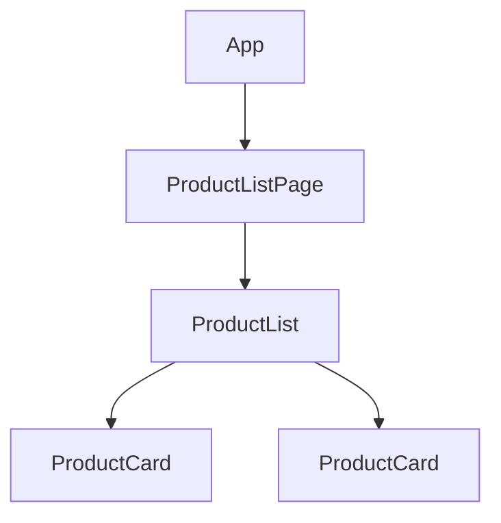

この章では、Component間で状態を伝える仕組みを学びます。Angularのデータフローの原則を押さえたうえで、親から子への`input()`、子から親への`output()`を扱います。

:::message
**この章で学ぶこと**

- 親子Component間のデータの流れ
- 単方向データフローという原則
- `input()`による入力の宣言
- 必須入力・既定値・別名・変換
- `output()`による出力の宣言
- `emit()`による値の送出
:::

## Angularのデータフロー

個々のAPIを学ぶ前の土台として、Angularにおけるデータの流れ方を整理します。複数のComponentが組み合わさったとき、データはどの向きに、どうやって流れるのか。この原則を先に押さえておくと、続く`input()`・`output()`・`model()`が、なぜその形をしているのかが腑に落ちます。

Angularのデータフローには、明確な方向性があります。この方向性を守ることが、予測しやすく、追いやすいアプリケーションを作る鍵になります。この節では、その原則と、原則を外れたときに何が起きるのかを見ていきます。

### Componentは階層をなす

Angularのアプリケーションは、Componentの入れ子によって、木のような階層構造をとります。[『TypeScriptとComponentの基本』の章](./04-component-basics)で学んだように、あるComponentのテンプレートの中に、別のComponentを置けるためです。頂点には`App`があり、その下にページ、さらにその下に部品が連なります。



この階層の中で、Componentどうしはデータをやり取りします。親が持っているデータを子に見せたり、子で起きた操作を親に知らせたりします。問題は、「どの向きに流すか」です。

### 単方向データフロー

Angularが採用しているのは、単方向データフローという考え方です。データは、親から子へ、一方向に流れます。上位のComponentが持つデータが、下位のComponentへと下っていく、という流れが基本です。

なぜ一方向に限るのでしょうか。もし親も子も、たがいのデータを自由に書き換えられたら、ある値がどこで変わったのかを追うのが困難になります。「この表示がおかしいのは、どのComponentのせいなのか」が、わからなくなるのです。データの流れる向きを一方向に定めておけば、値の出どころは常に上位にある、と決まります。原因を上へたどれば、必ず発生源にたどり着けます。

この原則のもとで、親子間のやり取りは、次の2種類に整理されます。

- **入力（下向き）**: 親が持つデータを子に渡します。プロパティバインディング`[prop]`で行います。
- **出力（上向き）**: 子で起きた出来事を親に伝えます。イベントバインディング`(event)`で行います。

注意したいのは、上向きの「出力」も、データを直接書き換えるものではない点です。子は「こういうことが起きた」と親に通知するだけで、それを受けて実際にデータを変えるのは親です。データの変更権は、常にデータを所有する側にあります。

### 入力 — 親から子へ渡す

親が持つデータを子に見せるには、子側に「受け取り口」を用意し、親のテンプレートからバインディングで渡します。受け取り口が、この章の次の節で学ぶ`input()`です。

```ts:src/app/product-card.ts
import { Component, input } from '@angular/core';

export interface Product {
  id: number;
  name: string;
}

@Component({
  selector: 'app-product-card',
  template: `<p>{{ product().name }}</p>`,
})
export class ProductCard {
  readonly product = input.required<Product>();
}
```

```html
<!-- 親のテンプレート：子にproductを渡す -->
<app-product-card [product]="selectedProduct()" />
```

親の`selectedProduct()`が、子の`product`入力へと流れ込みます。親の値が変われば、子の表示も自動で更新されます。子は、渡された値を表示することに徹し、自分でそのデータを書き換えようとはしません。

### 出力 — 子から親へ伝える

一方、子で起きた操作を親に伝えるには、子側に「通知口」を用意します。それが、この章の後半で学ぶ`output()`です。子は、ボタンが押されたなどの出来事を、この通知口から送り出します。

```ts:src/app/product-card.ts
import { Component, input, output } from '@angular/core';

@Component({
  selector: 'app-product-card',
  template: `<button (click)="selected.emit(product())">選ぶ</button>`,
})
export class ProductCard {
  readonly product = input.required<Product>();
  readonly selected = output<Product>();
}
```

```html
<!-- 親のテンプレート：子の通知を受け取る -->
<app-product-card [product]="p" (selected)="onSelect($event)" />
```

子はクリックという出来事を`selected`から送り出すだけで、その後どうするかは決めません。受け取った親の`onSelect`が、選択状態を変えるのか、画面を遷移するのかを決めます。出来事の発生と、それへの対応が、きれいに分かれています。

### データフローを意識する利点

入力は下へ、出力は上へ。この流れを徹底すると、いくつもの利点が生まれます。

- **追いやすさ**: ある値がどこで生まれ、どこで変わるのかが、階層をたどれば分かります。
- **再利用性**: 子は「渡されたら表示する」「操作を通知する」だけなので、どの親の下でも同じように使えます。[『Componentの構成技法と分割設計』の章](./05-component-composition)で扱ったプレゼンテーションComponentが、まさにこの形です。
- **テストのしやすさ**: 入力を与え、出力を確認する、という明快な形でテストできます。

同じ章で「上から下へはデータを、下から上へは出来事を流す」と述べたのは、この単方向データフローのことでした。設計の指針として語ったものが、`input()`・`output()`という具体的なAPIとして実現されているのです。

### 一連の流れを1つの例で見る

入力と出力を組み合わせた、往復の流れを1つの例で追ってみましょう。親が「選ばれた商品」を管理し、子のカードがクリックされたらそれを親に伝え、親が選択を更新する、という場面です。

```ts:src/app/product-list-page.ts
import { Component, computed, signal } from '@angular/core';
import { ProductCard, Product } from './product-card';

@Component({
  selector: 'app-product-list-page',
  imports: [ProductCard],
  template: `
    @for (p of products(); track p.id) {
      <app-product-card [product]="p" (selected)="select($event)" />
    }
    <p>選択中: {{ selectedName() }}</p>
  `,
})
export class ProductListPage {
  protected readonly products = signal<Product[]>([/* 省略 */]);
  private readonly selectedItem = signal<Product | null>(null);
  protected readonly selectedName = computed(
    () => this.selectedItem()?.name ?? '未選択',
  );

  protected select(product: Product): void {
    this.selectedItem.set(product); // 出力を受けて、親が状態を更新する
  }
}
```

流れを言葉にすると、次のようになります。親の`products`が各カードの`product`入力へ下る（下向き）。カードがクリックされ`selected`が発火する（上向き）。親の`select`がそれを受け、`selectedItem`を更新する。更新は`computed`の`selectedName`に伝わり、表示が変わる。データは常に、渡す・通知する・所有者が更新する、という一定のリズムで動いています。子は一度も、親の状態を直接書き換えていません。この規律が、流れの追いやすさを生みます。

### データフローと変更検知

単方向データフローは、Angularが画面をいつ更新するか、という「変更検知」の仕組みとも深く関わります。データが上から下へ整然と流れることを前提にできるため、Angularは効率よく変更を検知し、必要な箇所だけを描画し直せます。もし双方向に値が飛び交うと、この見通しが崩れ、更新の順序が予測しづらくなります。変更検知そのものは[『変更検知の仕組み』の章](./12-change-detection)で詳しく扱いますが、単方向データフローが、その効率と予測可能性を支える土台になっている、と押さえておいてください。

### Angularのデータフローでよくあるつまずき

データフローにまつわる、つまずきやすい点を挙げます。

- **子から親のデータを直接書き換えようとする**: 子に渡ってきたオブジェクトの中身を、子が書き換えてしまうと、流れの向きが崩れます。変更は出力で親へ通知し、親に更新してもらいます。
- **出力で値を送らずに済ませようとする**: 「子が持つ最新の値を親が知りたい」ときは、出力で明示的に伝えます。親が子の内部をのぞきにいく設計は、単方向の原則から外れます。
- **深い階層で入力・出力を延々と中継する**: 3階層、4階層とバケツリレーが続くなら、それは単方向データフローの限界のサインです。[『ServiceとDependency Injection』の章](./10-service-and-di)で学ぶServiceや、状態管理の章で扱う仕組みを検討する合図と捉えます。

### 親子以外のやり取りはどうするか

単方向データフローは、親子という直接の関係を前提としています。では、親子でないComponent、たとえば遠く離れたComponentどうしや、兄弟Componentの間で状態を共有したいときは、どうすればよいのでしょうか。

`input()`・`output()`だけで無理につなごうとすると、間にあるComponentが、自分には関係のないデータをただ受け渡す「バケツリレー」に陥ります。『Componentの構成技法と分割設計』の章で触れた、深いバケツリレーの問題です。こうした、階層を越えた状態の共有には、別の仕組みが必要になります。それが、『ServiceとDependency Injection』の章で学ぶServiceと、状態管理の章で扱う仕組みです。

この節では、まず親子間の基本的なデータフローを、しっかり押さえておいてください。多くのやり取りは、この単方向の流れで素直に表現できます。階層を越える共有は、その基本を理解したうえで、必要になったときに学べば十分です。どの手段を選ぶ場合でも、「データの変更権は所有者にあり、それ以外は通知で伝える」という単方向の考え方は共通の土台になります。ここで身につけた原則は、Serviceや状態管理を学ぶときにも、そのまま生きてきます。

## @Inputからinput()へ

前節で、親から子へデータを渡す「入力」の役割を確認しました。この節では、その入力を宣言する具体的なAPIを学びます。現在の標準は、Signalベースの`input()`関数です。一方、少し前のコードでは`@Input`デコレーターが使われていました。両者を比較しながら、`input()`の書き方と利点を掘り下げます。

`input()`は、Angular 17.1（2024年）で安定版になった、比較的新しいAPIです。Signalとして入力を扱えるため、値の変化に応じた処理が書きやすく、`@Input`が抱えていたいくつかの課題を解消しています。既存コードには`@Input`が数多く残っているため、両方を理解しておくことが大切です。

### input()で入力を宣言する

親からデータを受け取るには、`input()`で入力を宣言します。返ってくるのは読み取り専用のSignalです。

```ts:src/app/user-badge.ts
import { Component, input } from '@angular/core';

@Component({
  selector: 'app-user-badge',
  template: `<span>{{ name() }}</span>`,
})
export class UserBadge {
  readonly name = input('ゲスト');
}
```

`name = input('ゲスト')`で、`name`という入力を定義しています。引数の`'ゲスト'`は既定値で、親が値を渡さなかったときに使われます。テンプレートでは`name()`と、Signalとして`()`を付けて値を読み取ります。親からは、プロパティバインディングで渡します。

```html
<app-user-badge [name]="userName()" />
```

入力がSignalであることが、`input()`の核心です。値が変わると、それを使っている`computed()`やテンプレートが自動で反応します。Signalそのものの仕組みは、のちのSignalsを扱う章で詳しく学びます。その考え方は、そのまま入力にも通じます。

### 必須の入力

値が必ず渡されるべき入力は、`input.required()`で宣言します。既定値を持たず、親が渡さないとコンパイル時にエラーになります。

```ts:src/app/user-badge.ts
export class UserBadge {
  readonly userId = input.required<number>();
}
```

`required`には既定値がないため、型を型引数`<number>`で明示します。「このComponentは、この値がないと成り立たない」という前提を、型の力で保証できます。渡し忘れを実行前に検出できるため、安全性が高まります。

### 別名と変換

入力には、いくつかの調整用のオプションがあります。よく使うのが、別名（alias）と変換（transform）です。

別名は、テンプレートで使う名前を、クラスのプロパティ名と別にしたいときに使います。

```ts
readonly value = input(0, { alias: 'sliderValue' });
```

```html
<app-slider [sliderValue]="50" />
```

変換は、受け取った値をクラスに取り込む前に加工したいときに使います。たとえば、文字列の前後の空白を除く、といった処理です。

```ts:src/app/text-field.ts
function trimString(value: string | undefined): string {
  return value?.trim() ?? '';
}

export class TextField {
  readonly label = input('', { transform: trimString });
}
```

`transform`を指定すると、親から渡された値が`trimString`を通ってから`label`に格納されます。真偽値への変換など、定型的な変換はAngularが用意した関数（`booleanAttribute`・`numberAttribute`）も使えます。

`booleanAttribute`は、標準のHTML属性のように「属性が付いていれば`true`」という挙動を実現します。たとえば`disabled`のような入力を作るときに便利です。

```ts:src/app/action-button.ts
import { booleanAttribute, Component, input } from '@angular/core';

@Component({ selector: 'app-action-button', template: `...` })
export class ActionButton {
  readonly disabled = input(false, { transform: booleanAttribute });
}
```

こうすると、`<app-action-button disabled />`のように属性を書くだけで`true`とみなされ、標準のボタンと同じ感覚で扱えます。`numberAttribute`も同様に、文字列で渡された値を数値へ変換します。定型の変換は自前で書かず、これらの用意された関数を使うのが簡潔です。

### 入力から派生した値を作る

`input()`がSignalであることの利点が、もっともよく表れるのが、入力から別の値を導く場面です。のちのSignalsを扱う章で詳しく扱う`computed()`を使うと、入力の変化に追従する派生値を、宣言的に書けます。

```ts:src/app/price-tag.ts
import { Component, computed, input } from '@angular/core';

@Component({
  selector: 'app-price-tag',
  template: `<p>税込 {{ withTax() }} 円</p>`,
})
export class PriceTag {
  readonly price = input.required<number>();
  protected readonly withTax = computed(() => Math.floor(this.price() * 1.1));
}
```

`withTax`は、`price`が変わるたびに自動で再計算されます。`price`という入力Signalを`computed()`の中で読んでいるため、両者が連動するのです。これを`@Input`でやろうとすると、次に見るように、値の変化を検知するライフサイクルフックが必要でした。`input()`は、その手間をなくします。

### 旧来の@Inputとの比較

`input()`が登場する前は、`@Input`デコレーターで入力を宣言していました。同じ`name`入力を、旧来の書き方で示します。

```ts:旧来の書き方（@Inputデコレーター）
import { Component, Input } from '@angular/core';

@Component({ selector: 'app-user-badge', template: `<span>{{ name }}</span>` })
export class UserBadge {
  @Input() name = 'ゲスト';
}
```

`@Input()`を付けたプロパティが、そのまま入力になります。テンプレートでは`{{ name }}`と、ふつうのプロパティとして読みます。一見シンプルですが、いくつかの課題がありました。

- **変化の検知が面倒**: 入力が変わったときに処理をしたい場合、`ngOnChanges`というライフサイクルフックを実装する必要がありました。派生値の計算も、この中で手作業で行っていました。
- **必須の入力を保証しにくい**: `@Input`には、値が必ず渡されることを型で強制する手段が、標準ではありませんでした。
- **Signalと連携しにくい**: 値がただのプロパティなので、Signalベースの`computed()`や`effect()`と自然にはつながりませんでした。

変化を捉えるための、もう1つの旧来の書き方も見ておきましょう。入力をsetterで受け、その中で値の加工や副作用を行うパターンで、既存コードで頻繁に見かけます。

```ts
// 旧来の書き方: setterで@Inputをインターセプトする
private _userName = '';

@Input()
set userName(value: string) {
  this._userName = value.trim();
  this.greet(); // 値が届くたびに実行される
}
get userName(): string {
  return this._userName;
}
```

setterは値が届くたびに呼ばれるため、`ngOnChanges`を使わずに変化へ反応できます。ただし、値を保持する裏プロパティ（`_userName`）とsetter・getterが常にセットで必要になり、記述量が増えます。

`input()`は、これらをまとめて解決します。入力がSignalなので、変化の検知は`computed()`や`effect()`に任せられ、`ngOnChanges`が不要になります。必須入力は`input.required()`で型として保証できます。両者の違いを表に整理します。

| 観点 | 旧来の`@Input` | 現在の`input()` |
|---|---|---|
| 宣言 | `@Input() name = ''` | `name = input('')` |
| 値の読み取り | `this.name` | `this.name()`（Signal） |
| 必須の強制 | 標準では難しい | `input.required()` |
| 変化への追従 | `ngOnChanges`を実装 | `computed()`・`effect()`が自動追従 |
| 派生値 | フック内で手作業 | `computed()`で宣言的に |

表からわかるように、`input()`は「値がSignalである」という一点から、必須の保証や自動追従といった利点が生まれています。宣言そのものは`@Input`とほぼ同じ手軽さでありながら、後段の扱いやすさが大きく向上しているのです。

:::message
既存プロジェクトの`@Input`を`input()`へ書き換える、公式の移行スキマティクスも用意されています。`ng generate @angular/core:signal-input-migration`で実行でき、段階的な移行が可能です。
:::

### @Inputからinput()への移行でよくあるつまずき

`input()`を使い始めるときに、つまずきやすい点を挙げます。

- **`()`の付け忘れ**: `input()`はSignalを返すため、値を読むときは`name()`と括弧が必要です。`{{ name }}`と書くと、値ではなく関数が表示されてしまいます。
- **入力を書き換えようとする**: `input()`が返すのは読み取り専用のSignalです。子の側で値を変えることはできません。これは、前節の単方向データフローの原則に沿ったものです。書き換えたい場合は、次章で学ぶ`model()`を使います。
- **`required`に既定値を渡す**: `input.required()`は既定値を持てません。型引数で型だけを指定します。
- **コンストラクターで入力値を読む**: 入力の値は、コンストラクターの時点ではまだ設定されていないことがあります。入力に依存する処理は、`computed()`や`effect()`の中で読むと、値がそろってから安全に扱えます。

## @Outputからoutput()へ

前節では、親から子へデータを渡す入力を学びました。この節では、その逆、子から親へ出来事を伝える「出力」を扱います。ボタンが押された、項目が選ばれた、といった子の中で起きたことを、親に知らせる仕組みです。

現在の標準は、`output()`関数です。Angular 17.3（2024年）で導入されました。旧来は`@Output`デコレーターと`EventEmitter`を組み合わせて書いていました。この節では、`output()`の書き方を、旧来の方式と比較しながら学びます。入力の`input()`と対になる仕組みなので、あわせて理解すると、親子間のやり取りの全体像がつかめます。

### output()で出力を宣言する

子から親へ出来事を伝えるには、`output()`で出力を宣言します。

```ts:src/app/like-button.ts
import { Component, output } from '@angular/core';

@Component({
  selector: 'app-like-button',
  template: `<button (click)="liked.emit()">いいね</button>`,
})
export class LikeButton {
  readonly liked = output<void>();
}
```

`liked = output<void>()`で、`liked`という出力を定義しています。型引数の`<void>`は、この出力が値を伴わない、ただの通知であることを表します。ボタンがクリックされたら、`liked.emit()`で出来事を送り出します。親は、イベントバインディングで受け取ります。

```html
<app-like-button (liked)="onLiked()" />
```

子の`liked.emit()`が呼ばれると、親の`onLiked()`が実行されます。[『テンプレートの記法とDirective概論』の章](./06-template-and-directive-intro)で学んだイベントバインディング`(event)`が、標準のDOMイベントだけでなく、こうした自作の出力にも使える、というわけです。

### 値を伴う出力

出力には、値を添えて送ることもできます。型引数に、送りたい値の型を指定します。

```ts:src/app/rating.ts
@Component({
  selector: 'app-rating',
  template: `
    @for (star of stars; track star) {
      <button (click)="rated.emit(star)">★</button>
    }
  `,
})
export class Rating {
  protected readonly stars = [1, 2, 3, 4, 5];
  readonly rated = output<number>();
}
```

`rated = output<number>()`は、数値を伴う出力です。星がクリックされると、その数を`rated.emit(star)`で送ります。親側では、`$event`でその値を受け取れます。

```html
<app-rating (rated)="onRated($event)" />
```

```ts
protected onRated(value: number): void {
  console.log(`${value}が選ばれました`);
}
```

`$event`には、`emit`に渡した値がそのまま入ります。オブジェクトを送ることもでき、複数の情報をまとめて伝えられます。

実践的な例として、検索ボックスを考えます。入力された語を、確定のタイミングで親に伝える部品です。子は「検索語が確定した」という出来事だけを送り、その語で実際に何を検索するかは親が決めます。

```ts:src/app/search-box.ts
@Component({
  selector: 'app-search-box',
  template: `
    <input #box (keyup.enter)="search.emit(box.value)" />
    <button (click)="search.emit(box.value)">検索</button>
  `,
})
export class SearchBox {
  readonly search = output<string>();
}
```

```html
<!-- 親：検索語を受け取って一覧を絞り込む -->
<app-search-box (search)="applyFilter($event)" />
```

`SearchBox`は、検索の実行方法を何も知りません。語を送り出すことに徹しているため、商品一覧でもユーザー一覧でも、同じ部品を使い回せます。これが、本章の最初の節で述べた「出力は通知に徹する」設計の具体的な効き目です。

### 別名と命名の指針

出力にも、テンプレートで使う名前を変える別名（alias）を指定できます。

```ts
readonly changed = output<string>({ alias: 'valueChanged' });
```

命名にはいくつかの慣習があります。

- **キャメルケースで書く**: `valueChanged`のように、先頭を小文字にしたキャメルケースにします。
- **`on`を付けない**: `onLiked`のような`on`接頭辞は避けます。`on`は、受け取る親側のハンドラーに付ける習慣があるためです。出力名は、起きた出来事を表す`liked`・`saved`・`deleted`のような名前にします。
- **過去形が自然**: 出来事は「起きたこと」なので、`saved`・`closed`のような過去形がなじみます。

なお、Angularの出力は、標準のDOMイベントと違い、DOMツリーをさかのぼって伝わること（バブリング）はありません。あくまで、直接の親子の間で伝わる通知です。

### 旧来の@Outputとの比較

`output()`が登場する前は、`@Output`デコレーターと`EventEmitter`を組み合わせていました。同じ`liked`出力を、旧来の書き方で示します。

```ts:旧来の書き方（@OutputとEventEmitter）
import { Component, EventEmitter, Output } from '@angular/core';

@Component({
  selector: 'app-like-button',
  template: `<button (click)="liked.emit()">いいね</button>`,
})
export class LikeButton {
  @Output() liked = new EventEmitter<void>();
}
```

`@Output()`を付けたプロパティに、`EventEmitter`のインスタンスを代入します。`emit()`で送出する点は同じです。動作は`output()`版と変わりませんが、次のような違いがあります。

- **`EventEmitter`が不要**: `output()`は、`EventEmitter`をインスタンス化する必要がありません。`output<void>()`と関数を呼ぶだけです。
- **役割が明確**: `EventEmitter`は名前に「Emitter（送出するもの）」とありながら、内部的にはRxJSのObservableを継承しており、購読もできてしまう、あいまいな存在でした。`output()`は「出力を宣言する」という役割に絞られ、誤用しにくくなっています。
- **`input()`との一貫性**: 入力が`input()`、出力が`output()`と、関数呼び出しで揃います。宣言の形が統一され、読みやすくなります。

以上の違いを、入力側と同じ形式の表に整理します。

| 観点 | 旧来の`@Output` | 現在の`output()` |
|---|---|---|
| 宣言 | `@Output() liked = new EventEmitter<void>()` | `liked = output<void>()` |
| 必要なもの | `EventEmitter`のインスタンス化 | 関数呼び出しのみ |
| 送出 | `liked.emit(値)` | `liked.emit(値)`（同じ） |
| 役割 | Observableを継承し購読もできる二面性 | 出力の宣言に限定 |
| `input()`との対称性 | デコレーターと関数で不揃い | `input()`と揃う |

### ObservableをもとにするoutputFromObservable

補足として、RxJSのObservableから出力を作る`outputFromObservable()`という関数もあります。Observableが値を流すたびに、それを出力として送り出したいときに使います。RxJSについては[『RxJSの基礎』の章](./16-rxjs-basics)で扱うため、ここでは「Observableと出力をつなぐ手段がある」とだけ知っておけば十分です。

```ts
import { outputFromObservable } from '@angular/core/rxjs-interop';

// data$（Observable）が流す値を、そのまま出力にする
dataChanged = outputFromObservable(this.data$);
```

通常の用途では、`output()`と`emit()`で十分です。既存のObservableを出力に変換したい、という限られた場面のための道具だと捉えてください。

逆に、`output()`が送り出す値をObservableとして扱いたいときは、同じ`@angular/core/rxjs-interop`にある`outputToObservable()`を使います。出力をRxJSの演算子につなげて処理したい、といった場面のための道具です。

なお、`output()`が返すものは、親のイベントバインディングで受けるのが基本ですが、Componentを動的に生成する高度な場面では、`subscribe()`で購読することもできます。この場合は、不要になったときに購読を解除する責任が生じます。ふだんのテンプレート経由のバインディングでは、購読も解除もAngularが引き受けるため、こうした後始末を意識する必要はありません。この手軽さも、テンプレートでのやり取りを基本とすべき理由のひとつです。

### 複数の情報をまとめて送る

出来事に複数の情報が伴うときは、オブジェクトにまとめて送ると扱いやすくなります。たとえば、並べ替えの操作を「どの列を、どの向きで」という2つの情報とともに伝える場合です。

```ts:src/app/sort-header.ts
type SortEvent = { column: string; direction: 'asc' | 'desc' };

@Component({ selector: 'app-sort-header', template: `...` })
export class SortHeader {
  readonly sortChanged = output<SortEvent>();

  protected toggle(column: string): void {
    this.sortChanged.emit({ column, direction: 'asc' });
  }
}
```

型に名前（`SortEvent`）を付けておくと、親側で`$event`を受け取るときも、その形が明確になります。引数を増やしたいときにオブジェクトを1つ渡す形にしておけば、後から情報を足しやすい、という利点もあります。1つの出力で多くを伝えたい場面では、この「オブジェクトにまとめる」手法が有効です。

### @Outputからoutput()への移行でよくあるつまずき

- **出力を入力のように使おうとする**: 出力は、子から親への一方向の通知です。親から子へ値を渡したいなら、出力ではなく入力（`input()`）を使います。
- **`emit`の呼び忘れ**: 出力は宣言しただけでは何も起きません。出来事が起きたタイミングで`emit()`を呼んで、はじめて親に伝わります。
- **`on`接頭辞を出力名に付ける**: `onSave`のような名前は避け、`saved`とします。`on`は親のハンドラー側の習慣です。

## まとめ

- Angularのアプリケーションは、Componentが階層をなして構成されます
- データは親から子へ一方向に流れる、単方向データフローが原則です
- 親から子へは入力（`[prop]`）、子から親へは出力（`(event)`）で伝えます
- `input()`は、親から子へのデータを受け取る、Signalベースの入力宣言です
- `input.required()`で必須の入力を、`alias`で別名を、`transform`で変換を指定できます
- 入力から派生した値は`computed()`で宣言的に作れ、`ngOnChanges`が不要になります
- `output()`は、子から親へ出来事を伝える、出力の宣言です
- `emit()`で送出し、値を添えれば親は`$event`で受け取れます
- 出力名はキャメルケースで、`on`を付けず、起きた出来事を表す名前にします

次章では、双方向のやり取りと、Componentのライフサイクルを学びます。
