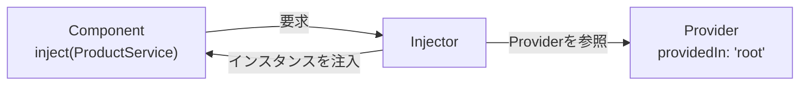

この章では、Componentから処理を切り出すServiceと、それをComponentへ届けるDependency Injection（DI）の考え方を学びます。

:::message
**この章で学ぶこと**

- Serviceとは何か、なぜ必要か
- `@Injectable`によるServiceの定義
- 依存とは何か、DIが解決する問題
- 「注入してもらう」という考え方
:::

## ServiceとComponentの責務

ここまでの章では、Componentの作り方から、テンプレートやDirective、Component間でのデータの受け渡しまでを学んできました。そこで扱ったアプリケーションは、いわばComponentだけで組み立てられていました。しかし、規模が大きくなると、Componentだけでは無理が生じます。データの取得、業務ルールの計算、複数のComponentで共有したい状態。こうした関心事を、画面を担うComponentに押し込めると、たちまち見通しが悪くなります。

そこで登場するのがServiceです。Serviceは、Componentから切り出した処理を受け持つ、ふつうのクラスです。この節では、Serviceとは何か、Componentとどのように責務を分ければよいのかを、具体例を通して整理します。責務の分け方は、アプリケーション全体の設計を左右する重要な判断です。

### Serviceとは何か

Serviceは、特定の役割を持った処理をまとめたクラスです。画面を持たない点が、Componentとの大きな違いです。Componentが「見た目と操作」を担うのに対し、Serviceは「その裏で動く処理」を担います。たとえば、次のような処理がServiceの担当です。

- サーバーとのデータのやり取り（API通信）
- 業務上の計算やルールの適用
- 複数のComponentで共有したいデータの保持
- ログの記録や、外部ライブラリの呼び出し

これらをComponentから切り離すと、Componentは「受け取って表示する」「操作を受け付ける」という本来の役割に集中できます。[『Componentの構成技法と分割設計』の章](./05-component-composition)で「1つのComponentは1つの関心事に集中する」と述べましたが、Serviceは、その関心事の分離を、画面の外側にまで広げる手段だといえます。

### なぜComponentから切り出すのか

処理をServiceへ切り出す理由は、大きく3つあります。

1つ目は、**再利用**です。たとえば「商品データを取得する処理」を`ProductService`に置けば、一覧画面でも詳細画面でも、同じServiceを使えます。もしこの処理を一覧Componentの中に書いてしまうと、詳細画面で使うために、同じコードをもう一度書くことになります。

2つ目は、**見通し**です。Componentがデータ取得も計算も抱えていると、テンプレートとの対応関係が読み取りにくくなります。処理をServiceへ追い出せば、Componentのクラスは「Serviceを呼び、結果を表示に橋渡しする」だけの、薄く読みやすいものになります。

3つ目は、**テストのしやすさ**です。業務ロジックがServiceに分かれていれば、画面を通さずに、そのロジック単体をテストできます。Componentのテストと、ロジックのテストを、それぞれの関心に応じて分けられます。テストについては[『アーキテクチャとテスト』の章](./23-architecture-and-testing)で詳しく扱いますが、責務の分離は、テスト容易性の土台になります。

### @InjectableでServiceを定義する

Serviceは、`@Injectable`デコレーターを付けたクラスとして定義します。Angular CLIで生成できます。

```bash
ng generate service product
```

生成される基本形は、次のようになります。

```ts:src/app/product.ts
import { Injectable } from '@angular/core';

@Injectable({
  providedIn: 'root',
})
export class ProductService {
  getProducts(): Product[] {
    // データを返す処理（詳細はHTTP通信の章で扱う）
    return [/* 省略 */];
  }
}
```

クラスに付いている`@Injectable`は、このクラスがDIの対象であることを示す印です。Serviceが自身の中で`inject()`を使ってほかの依存を受け取る場合には、この印が欠かせません。

あわせて注目したいのが、引数の`providedIn: 'root'`です。これは、「このServiceをアプリケーション全体で使えるように登録する」という指定です。この一行があると、Serviceはアプリのどこからでも受け取れるようになります。しかも、実際に使われている場合にだけ最終的な成果物に含まれるため、使わないServiceは自動的に取り除かれます。この仕組みは、本章の後半で詳しく扱うDIの一部です。

### Serviceはひとつのインスタンスが共有される

`providedIn: 'root'`で登録したServiceは、アプリケーション全体でひとつのインスタンスだけが作られ、それがすべての利用者で共有されます。あるComponentが受け取る`ProductService`も、別のComponentが受け取る`ProductService`も、同じひとつのインスタンスです。

この性質は、状態を共有したいときに役立ちます。たとえば、`ProductService`が取得済みの商品データを保持していれば、複数の画面がその同じデータを参照できます。[『データフローとinput()・output()』の章](./08-data-flow-io)で触れた、親子を越えた状態共有の課題を、Serviceが解決する糸口がここにあります。共有される単一のインスタンスを通じて、離れたComponentどうしが同じ状態を見られるのです。

一方で、共有されるということは、状態の扱いに注意が要るということでもあります。あるComponentがServiceの状態を変えれば、その変化はほかのすべての利用者に及びます。この点は、[『状態管理の基礎』の章](./20-state-management-basics)で、あらためて掘り下げます。

### ComponentとServiceの責務を分ける

では、具体的に何をComponentに残し、何をServiceへ切り出せばよいのでしょうか。目安を整理します。

| 担当 | Componentに残すもの | Serviceへ切り出すもの |
|---|---|---|
| 画面 | テンプレートとの橋渡し、表示用の状態 | — |
| データ | 表示に必要な値の保持 | データの取得・保存（API通信） |
| ロジック | 表示の出し分けなど画面固有の判断 | 業務ルール、共有される計算 |
| 状態 | そのComponentだけの一時的な状態 | 複数のComponentで共有する状態 |

判断に迷ったときの問いは、「この処理は、この画面だけのものか」です。その画面に固有のことならComponentに、ほかでも使う、あるいは画面と切り離せることならServiceに置く、と考えます。次のコードは、Componentが`ProductService`に取得を任せ、自分は表示への橋渡しに徹する例です。

```ts:src/app/product-list-page.ts
@Component({
  selector: 'app-product-list-page',
  template: `
    @for (p of products(); track p.id) {
      <p>{{ p.name }}</p>
    }
  `,
})
export class ProductListPage {
  private readonly service = inject(ProductService);
  protected readonly products = signal(this.service.getProducts());
}
```

Componentのクラスは、Serviceを受け取り、その結果を`products`として表示に渡すだけです。データをどこから、どうやって取ってくるかは、`ProductService`の関心事であり、Componentは知りません。この分担が、両者の見通しを保ちます。

### 状態を持つServiceと持たないService

Serviceは、大きく2種類に分けて考えると整理しやすくなります。

ひとつは、**状態を持たないService**です。渡された入力から結果を計算して返すだけで、自分ではデータを抱えません。税額の計算や、日付の整形といった、道具のようなServiceがこれにあたります。呼ぶたびに同じ入力なら同じ結果を返すため、扱いが単純で、テストも容易です。次は、価格の計算をまとめた状態を持たないServiceの例です。

```ts:src/app/pricing.ts
@Injectable({ providedIn: 'root' })
export class PricingService {
  withTax(price: number): number {
    return Math.floor(price * 1.1);
  }

  applyDiscount(price: number, rate: number): number {
    return Math.floor(price * (1 - rate));
  }
}
```

このServiceは、どのComponentから呼ばれても、渡された値だけで結果を決めます。内部に状態がないため、動きが予測しやすく、単体テストも「入力を渡して戻り値を確かめる」だけで済みます。業務ルールが各Componentに散らばるのを防ぎ、計算の根拠を一か所に集められる点も利点です。

もうひとつは、**状態を持つService**です。取得したデータや、アプリの現在の状態を、自身の中に保持します。共有される単一インスタンスという性質を活かし、複数のComponentから参照される「状態の置き場所」として働きます。『状態管理の基礎』の章で学ぶStore Serviceは、この発展形です。

どちらのServiceも役割がありますが、状態を持つServiceは、変化の伝わり方に注意が必要です。モダンAngularでは、Serviceが持つ状態をSignalで表現することで、その変化をComponentへ自然に伝えられます。Serviceの中で`signal()`を使って状態を保持し、Componentはそれを読み取るだけで、変化に追従した表示が得られるのです。

たとえば、買い物カゴの中身を保持する`CartService`は、次のように書けます。

```ts:src/app/cart.ts
import { Injectable, signal } from '@angular/core';

@Injectable({ providedIn: 'root' })
export class CartService {
  readonly items = signal<CartItem[]>([]);

  add(item: CartItem): void {
    this.items.update((current) => [...current, item]);
  }
}
```

`items`が、このServiceの抱える状態です。この`CartService`を注入したComponentは、`items()`を読むだけで現在のカゴの中身を表示できます。

```ts:src/app/cart-badge.ts
import { Component, inject, computed } from '@angular/core';

@Component({
  selector: 'app-cart-badge',
  template: `<span>カート: {{ count() }} 点</span>`,
})
export class CartBadge {
  private readonly cart = inject(CartService);
  protected readonly count = computed(() => this.cart.items().length);
}
```

`add()`でカゴに商品が加わると`items`が更新され、それを読んでいる`count`も自動で変わります。`CartService`は単一のインスタンスなので、別のComponentが商品を加えても、このバッジは同じ状態を映します。

この手法は、[『SignalsとZoneless』の章](./13-signals-and-zoneless)と、『状態管理の基礎』の章で詳しく扱います。まずは「状態を持つか持たないか」でServiceを見分ける視点を持っておくと、設計の判断がしやすくなります。

### ServiceとComponentの責務でよくあるつまずき

- **Componentに何でも書いてしまう**: 動くものを速く作ろうとすると、つい取得も計算もComponentに書きがちです。重複や肥大化が見えたら、Serviceへの切り出しを検討します。
- **Serviceを細かく分けすぎる**: 逆に、意味のまとまりがないのにServiceを乱立させると、全体像が追いにくくなります。関連する処理は、ひとつのServiceにまとめます。
- **`providedIn: 'root'`を書き忘れる**: これがないと、Serviceをどこで使えるようにするかを別途指定する必要があります。まずは`root`を基本と考えておくと迷いません。

## Dependency Injectionとは何か

前節で、処理をServiceへ切り出すことを学びました。では、切り出したServiceを、Componentはどうやって手に入れるのでしょうか。その答えが、この節のテーマであるDependency Injection（依存性の注入、以下DI）です。

DIは、Angularの設計を支える中心的な仕組みです。名前は難しそうですが、考え方はシンプルです。「必要なものを、自分で用意するのではなく、外から渡してもらう」。これだけです。この節では、DIがどんな問題を解決するのか、なぜAngularがこの仕組みを採用しているのかを、順を追って理解します。抽象的に見える概念ですが、具体例を通せば、その便利さが見えてきます。

### 依存とは何か

あるクラスが動くために、別のクラスを必要とすることを、「依存している」といいます。たとえば、`ProductListPage`が商品データを表示するために`ProductService`を必要とするなら、`ProductListPage`は`ProductService`に依存しています。この`ProductService`のような、動くために必要な相手を「依存（dependency）」と呼びます。

問題は、この依存をどうやって用意するかです。もっとも素朴な方法は、必要になった側が自分で作ることです。

```ts:DIを使わない書き方（自分で依存を作る）
export class ProductListPage {
  private readonly service = new ProductService();
}
```

`new ProductService()`で、自分でインスタンスを作っています。一見、問題なさそうです。しかし、この書き方にはいくつもの弱点が潜んでいます。

### 自分で依存を作ることの問題

自分で`new`する書き方には、次のような問題があります。

まず、**差し替えができません**。`ProductService`が、実際のサーバーと通信するとします。テストのときには、通信をせず、決まったデータを返す偽物のServiceに差し替えたくなります。しかし、`new ProductService()`とクラス名を直接書いていると、この差し替えができません。

次に、**共有ができません**。`ProductService`が状態を保持する場合、前節で見たように、複数のComponentで同じインスタンスを共有したいことがあります。ところが、各Componentがそれぞれ`new`すると、別々のインスタンスができてしまい、状態が共有されません。

さらに、**準備の連鎖が面倒です**。もし`ProductService`が、動くために`HttpClient`や設定オブジェクトを必要とするなら、`new ProductService()`の前に、それらも用意しなければなりません。依存が依存を持つと、この準備がどこまでも連鎖します。

これらの問題は、「必要な側が、依存を自分で用意している」ことに根ざしています。ならば、用意する役目を、外の誰かに任せてしまえばよい。それがDIの発想です。

### 注入してもらうという発想

DIでは、クラスは「自分が何を必要とするか」を宣言するだけで、その用意はAngularに任せます。Angularが、必要なインスタンスを作って（あるいは既存のものを見つけて）、渡してくれます。この「外から渡してもらう」ことを、注入（injection）と呼びます。

```ts:src/app/product-list-page.ts
import { inject } from '@angular/core';

export class ProductListPage {
  private readonly service = inject(ProductService);
}
```

`inject(ProductService)`は、「`ProductService`を注入してください」という宣言です。自分で`new`していない点に注目してください。どのインスタンスを渡すか、どう準備するかは、Angularが引き受けます。`ProductListPage`は、`ProductService`が手に入るという事実だけに関心を持ち、その出どころを気にしません。

このように、必要なものを用意する責任を、使う側から外部の仕組みへ移すことを、制御の反転（Inversion of Control）と呼びます。[『Angularとは何か』の章](./02-angular-intro)でフレームワークの特徴として触れた考え方が、DIという形で具体的に働いているのです。

### DIを支える3つの要素

AngularのDIは、3つの要素が連携して成り立っています。

- **Injector（インジェクター）**: 依存を管理し、要求に応じて提供する主体です。「注入してほしい」という要求を受け、該当するインスタンスを探して渡します。
- **Provider（プロバイダー）**: 「このトークンには、この方法でインスタンスを用意する」という登録情報です。前節の`providedIn: 'root'`は、`ProductService`をProviderとしてInjectorに登録する指定でした。
- **トークン**: 依存を識別する目印です。多くの場合、クラスそのもの（`ProductService`）がトークンになります。Injectorは、このトークンをたよりに、対応するProviderを探します。

流れを言葉にすると、こうです。Componentが「`ProductService`（トークン）がほしい」とInjectorに求める。Injectorは、そのトークンに対応するProviderを探す。Providerの登録どおりにインスタンスを用意し、Componentへ渡す。この一連の働きが、注入の正体です。



### DIがもたらす利点

依存を注入してもらう仕組みは、先ほど挙げた問題を、そのまま裏返した利点を生みます。

- **差し替えが容易**: テスト時に、本物のServiceの代わりに偽物を注入するよう、Providerの登録を変えるだけで済みます。使う側のコードは一切変えずに、中身を差し替えられます。
- **インスタンスの共有**: Injectorが単一のインスタンスを管理するため、複数のComponentが同じServiceを受け取れます。状態の共有が自然に実現します。
- **準備の連鎖を肩代わり**: Serviceがさらに別の依存を持っていても、Injectorが芋づる式に解決します。使う側は、末端の依存まで意識する必要がありません。
- **責務の分離**: 各クラスは「何を必要とするか」を宣言するだけでよく、「どう用意するか」から解放されます。関心事がきれいに分かれます。

これらの利点は、アプリケーションが大きくなるほど効いてきます。DIは、単なる便利機能ではなく、大規模なアプリケーションを見通しよく保つための、構造的な仕組みなのです。

### 差し替えの利点を具体的に見る

「差し替えが容易」という利点を、もう少し具体的に見てみましょう。`ProductListPage`が`ProductService`に依存しているとします。このComponentをテストするとき、本物の`ProductService`がサーバーと通信してしまうと、テストがネットワークの状態に左右され、不安定になります。

DIを使っていれば、テストのときだけ、通信をしない偽物のServiceを注入するよう指示できます。

```ts:テストでの差し替え（イメージ）
// 本物の代わりに、決まったデータを返す偽物を注入する
providers: [{ provide: ProductService, useValue: fakeProductService }]
```

`ProductListPage`のコードは、一文字も変える必要がありません。`inject(ProductService)`と書いてあるだけで、注入される中身が本物か偽物かは、外の登録が決めます。もし`new ProductService()`と自分で作っていたら、この差し替えはできず、テストのために本体のコードを書き換えるはめになっていたはずです。DIが、コードを変えずに振る舞いを差し替える柔軟さを生んでいるのです。この差し替えの仕組みは、次章のProviderの登録方法とあわせて、より詳しく扱います。

### DIは至るところで使われている

DIは、自分で作ったServiceだけのものではありません。Angularが提供する多くの機能も、DIを通して受け取ります。すでに本書に登場したものだけでも、次のように数多くあります。

- `ElementRef`（[『Directiveの実装とPipe』の章](./07-directive-and-pipe)）: ホスト要素への参照を`inject()`で受け取りました
- `TemplateRef`・`ViewContainerRef`（『Directiveの実装とPipe』の章）: 構造Directiveで注入しました
- これから学ぶ`HttpClient`（[『HTTP通信』の章](./19-http)）や`Router`（[『Routerの基礎』の章](./14-router-basics)）も、`inject()`で受け取ります

私たちが`inject(HttpClient)`と書けるのは、Angularが`HttpClient`をProviderとして登録しているからです。つまり、DIはAngularという枠組み全体を貫く共通の作法であり、フレームワークの機能も、自作のServiceも、同じ仕組みで手に入ります。この一貫性を理解すると、Angularのさまざまな機能が、なぜ`inject()`一つで使えるのかが腑に落ちます。

### どこで注入できるのか

`inject()`は、どこでも呼べるわけではありません。Angularが依存を解決できる文脈、いわゆる注入コンテキストの中でのみ使えます。具体的には、Component・Service・Directiveのクラスのフィールド初期化子や、コンストラクターの中が代表的な場所です。

```ts:src/app/product-list-page.ts
export class ProductListPage {
  // フィールドの初期化子で注入（注入コンテキスト内）
  private readonly service = inject(ProductService);
}
```

この「注入コンテキスト」の外、たとえばボタンクリックのハンドラーの中などで`inject()`を呼ぶと、エラーになります。依存の取得は、クラスの初期化のタイミングで行う、と覚えておけば、多くの場合つまずきません。詳しい仕組みは、次章の`inject()`の解説であらためて触れます。

### Dependency Injectionの理解でよくあるつまずき

- **interfaceをトークンにできると思い込む**: DIのトークンは、実行時に存在する値でなければなりません。TypeScriptの`interface`は型の情報でしかなく、コンパイルすると消えてしまうため、トークンには使えません。クラスはそれ自身が実行時の値なのでトークンになりますが、設定値やインターフェースで表される依存を注入したいときは、`InjectionToken`という専用のトークンを用意します。

## まとめ

- Serviceは、Componentから切り出した処理を受け持つ、画面を持たないクラスです
- データ取得・業務ロジック・共有状態などをServiceへ移すと、Componentが薄く保てます
- `@Injectable({ providedIn: 'root' })`で、アプリ全体で使えるServiceを定義します
- 依存とは、あるクラスが動くために必要とする別のクラスのことです
- 自分で`new`すると、差し替え・共有・準備の連鎖といった問題が生じます
- DIは、必要なものを外から注入してもらう仕組みで、制御の反転にもとづきます

次章では、依存を受け取る`inject()`と、Serviceが共有される仕組みであるProvider・Injectorの階層を扱います。
