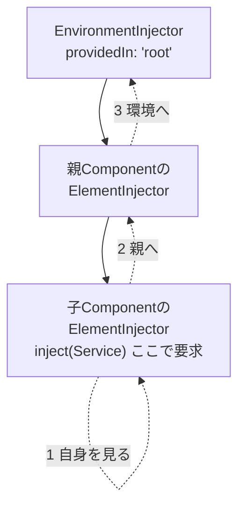

この章では、DIを実際に扱う書き方と仕組みを学びます。依存を受け取る`inject()`と、Serviceがどこで作られ共有されるのかを決めるProvider・Injectorの階層を扱います。

:::message
**この章で学ぶこと**

- Constructor Injectionによる依存の受け取り
- `inject()`関数による依存の受け取り
- Injectorの階層構造
- Serviceを提供する場所による違い
:::

## Constructor Injectionからinject()へ

前章で、依存を注入してもらうというDIの考え方を学びました。この節では、その注入を実際に受け取る書き方に踏み込みます。Angularには、依存を受け取る方法が2つあります。ひとつは、コンストラクターの引数で受け取るConstructor Injection。もうひとつが、現在の標準である`inject()`関数です。

`inject()`は、Angular 14（2022年）で導入されました。それ以前はConstructor Injectionが唯一の方法で、既存コードの多くはこの形で書かれています。両者は同じDIの仕組みを使っており、結果は変わりません。しかし、書き味と柔軟性に違いがあります。この節では、両方を比較しながら、なぜ現在は`inject()`が推奨されるのかを理解します。

### Constructor Injectionという書き方

まず、旧来のConstructor Injectionを見ます。依存を、コンストラクターの引数として宣言する方法です。

```ts:旧来の書き方（Constructor Injection）
import { Component } from '@angular/core';
import { ProductService } from './product';

@Component({ selector: 'app-product-list-page', template: `...` })
export class ProductListPage {
  constructor(private readonly service: ProductService) {}

  load(): void {
    this.service.getProducts();
  }
}
```

コンストラクターの引数に`private readonly service: ProductService`と書くと、Angularが`ProductService`を注入し、`this.service`として使えるようにします。引数に`private`などの修飾子を付けることで、そのままクラスのプロパティになる、というTypeScriptの機能を利用しています。

この書き方は長く標準でしたが、いくつかの不便がありました。依存が増えるとコンストラクターの引数が長くなること、クラスを継承したときに親のコンストラクター引数をすべて引き継いで書き直す必要があること、そして関数の中では使えないことです。

### inject()という書き方

同じ依存の受け取りを、`inject()`で書くと、次のようになります。

```ts:src/app/product-list-page.ts
import { Component, inject } from '@angular/core';
import { ProductService } from './product';

@Component({ selector: 'app-product-list-page', template: `...` })
export class ProductListPage {
  private readonly service = inject(ProductService);

  load(): void {
    this.service.getProducts();
  }
}
```

`inject(ProductService)`を、フィールドの初期化子として書きます。コンストラクターは不要です。受け取った依存は、ふつうのフィールドとして`this.service`で使えます。前章で触れたように、`inject()`は注入コンテキスト、すなわちクラスの初期化のタイミングで呼び出します。

見た目の違いはわずかですが、この違いが、いくつもの利点につながります。

### inject()の利点

`inject()`が現在推奨される理由は、Constructor Injectionの不便を解消するからです。

**コンストラクターが不要になる**。依存を受け取るためだけにコンストラクターを書く必要がなくなり、フィールドの宣言として自然に並べられます。依存が増えても、引数リストが長大になることはありません。

**継承が楽になる**。クラスを継承するとき、Constructor Injectionでは、親が受け取っている依存を子のコンストラクターでも書き、`super()`へ渡す必要がありました。`inject()`なら、親クラスの中で`inject()`しているため、子はコンストラクターに手を加えなくて済みます。

**関数の中でも使える**。これが特に大きな違いです。`inject()`は、クラスだけでなく、Angularが提供する関数の中でも呼べます。第7部で学ぶ関数型のRoute Guardや、第9部で学ぶ関数型のInterceptorは、この性質の上に成り立っています。たとえば、Guardを次のように関数として書き、その中で依存を注入できます。

```ts:src/app/auth-guard.ts
import { inject } from '@angular/core';
import { CanActivateFn } from '@angular/router';

export const authGuard: CanActivateFn = () => {
  const auth = inject(AuthService); // 関数の中で注入できる
  return auth.isLoggedIn();
};
```

Constructor Injectionは、コンストラクターを持つクラスでしか使えないため、こうした関数の中では依存を受け取れませんでした。`inject()`は、DIをクラスの外へ解き放ち、より柔軟な書き方を可能にしたのです。

**再利用しやすい**。複数のComponentで共通する注入と初期化の処理を、ひとつの関数にまとめて切り出せます。たとえば、`inject()`を内部で使うヘルパー関数を作り、各Componentのフィールド初期化子から呼ぶ、といった書き方ができます。これはConstructor Injectionでは難しいことでした。

### 新旧を並べて比べる

同じ依存を受け取るコードを、両者で並べます。

```ts:旧来の書き方（Constructor Injection）
export class UserPage {
  constructor(
    private readonly userService: UserService,
    private readonly logger: Logger,
  ) {}
}
```

```ts:src/app/user-page.ts（現在の書き方）
export class UserPage {
  private readonly userService = inject(UserService);
  private readonly logger = inject(Logger);
}
```

依存が増えたときの見やすさの差が分かります。`inject()`版は、各依存が独立した一行として並び、追加や削除も一行の操作で済みます。コンストラクターの引数リストを編集する必要がありません。

型の面でも`inject()`は素直です。Constructor Injectionは、引数の型注釈をAngularが読み取ってトークンを決める仕組みで、この解決はTypeScriptのコンパイル時の情報に依存していました。`inject(ProductService)`は、トークンを値として直接渡すため、何を注入しようとしているのかがコードから明快に読み取れます。戻り値の型も、渡したトークンから自動で決まるため、`this.service`の型は`ProductService`だと、型注釈を書かずとも正しく推論されます。宣言の簡潔さと型の正確さが、両立しているのです。

### 注入を細かく制御する

`inject()`には、注入のふるまいを調整するオプションを渡せます。よく使うのが、依存が見つからないときにエラーにせず`null`を許す`optional`です。

```ts
// 見つからなければ null（エラーにしない）
private readonly config = inject(AppConfig, { optional: true });
```

ほかにも、探索する範囲を制御するオプションがあります。

- **`optional`**: 見つからなければ`null`を返す（エラーにしない）
- **`self`**: 自身のInjectorだけを探す
- **`skipSelf`**: 自身を飛ばして、親のInjectorから探す
- **`host`**: 探索をホストの境界で止める

これらは、次章で学ぶInjectorの階層と関わります。ふだんは`inject(ProductService)`と書くだけで十分ですが、こうした細かな制御ができることも知っておくと、複雑な場面で役立ちます。旧来は、`@Optional()`・`@Self()`・`@SkipSelf()`といったデコレーターをコンストラクター引数に添えて、同じことを実現していました。`inject()`では、これらをオプションのオブジェクトとして渡せます。

### よくあるつまずき

- **注入コンテキストの外で`inject()`を呼ぶ**: `inject()`は、クラスの初期化時（フィールド初期化子やコンストラクター）に呼びます。ボタンクリックのハンドラーなど、初期化が終わった後の処理の中で呼ぶと、エラーになります。依存は初期化時に受け取り、フィールドに保持しておきます。
- **Constructor Injectionと混在させて混乱する**: 1つのクラスで両方を使うこともできますが、統一したほうが読みやすくなります。新規のコードは`inject()`に揃えるのがよいでしょう。
- **移行を急ぎすぎる**: 既存のConstructor Injectionは、そのままでも問題なく動きます。公式の移行スキマティクスもあるため、慌てて手作業で書き換える必要はありません。

:::message
既存プロジェクトのConstructor Injectionを`inject()`へ書き換える、公式の移行スキマティクスが用意されています。次のコマンドで実行でき、コンストラクター引数を`inject()`のフィールド宣言へ自動で変換します。

```bash
ng generate @angular/core:inject
```

差分を確認しながら段階的に進められるため、大きなプロジェクトでも安全に移行できます。
:::

## ProviderとInjectorの階層

前節までで、Serviceを定義し、それを`inject()`で受け取る流れを学びました。この節では、その裏側にもう一歩踏み込みます。注入されるインスタンスは、いったいどこで作られ、どの範囲で共有されるのでしょうか。その答えを握るのが、ProviderとInjectorの階層です。

`providedIn: 'root'`と書けば、Serviceはアプリ全体でひとつのインスタンスとして共有される、と第22章で述べました。しかし、Serviceの提供のしかたは、これだけではありません。特定のComponentとその子だけで共有したい、あるいはComponentごとに別々のインスタンスを持たせたい、といった調整もできます。それを可能にするのが、Injectorの階層構造です。この節を理解すると、Serviceの「範囲」を意図して設計できるようになります。

### 2種類のInjector

Angularには、性質の異なる2つのInjectorの階層があります。

ひとつは、**EnvironmentInjector（環境インジェクター）**です。アプリケーション全体にかかわるInjectorで、`app.config.ts`の`providers`や、`providedIn: 'root'`で登録したServiceを管理します。アプリの起動時に作られ、アプリが生きている間ずっと存在する、いちばん外側のInjectorです。

もうひとつは、**ElementInjector（要素インジェクター）**です。こちらは、ComponentやDirectiveごとに作られるInjectorです。`@Component`の`providers`に登録したServiceは、このElementInjectorが管理します。Componentが生成されるときに作られ、破棄されるときに消えます。

この2つが、Componentの階層に沿って積み重なり、ひとつの階層構造をなします。頂点にEnvironmentInjectorがあり、その下に、Componentのネストに対応してElementInjectorが連なる、というイメージです。

### Serviceを提供する場所

ServiceをどのInjectorに登録するかで、そのインスタンスが共有される範囲が変わります。おもな選択肢は2つです。

ひとつは、これまで使ってきた`providedIn: 'root'`です。EnvironmentInjectorに登録され、アプリ全体でひとつのインスタンスが共有されます。ほとんどのServiceは、これで十分です。

```ts:src/app/product.ts
@Injectable({ providedIn: 'root' })
export class ProductService {}
```

もうひとつは、Componentの`providers`に登録する方法です。この場合、そのComponentのElementInjectorにServiceが登録され、Componentのインスタンスごとに別々のServiceが作られます。

```ts:src/app/editor.ts
@Component({
  selector: 'app-editor',
  providers: [DraftService], // このComponentごとにインスタンスを作る
  template: `...`,
})
export class Editor {
  private readonly draft = inject(DraftService);
}
```

`Editor`が画面に3つあれば、`DraftService`も3つ作られます。それぞれの`Editor`が、自分専用の`DraftService`を持つわけです。編集中の下書きのように、Componentごとに独立していてほしい状態を保持するのに向いています。ひとつのタブの編集内容が、別のタブに混ざらないようにしたい、といった場面が典型です。逆に、全体で共有したい状態なら`providedIn: 'root'`を選びます。提供する場所の選択が、そのまま状態の独立と共有の境界を決めるのです。

| 提供の場所 | 共有範囲 | 用途 |
|---|---|---|
| `providedIn: 'root'` | アプリ全体で単一 | 共有される状態・共通処理。大半はこちら |
| Componentの`providers` | そのComponentと子孫 | Componentごとに独立させたい状態 |

### 依存はどう解決されるか

`inject(SomeService)`が呼ばれると、Angularはどうやって該当するインスタンスを見つけるのでしょうか。答えは「下から上へ探す」です。

まず、注入を要求したComponent自身のElementInjectorを見ます。そこに登録がなければ、親のElementInjectorへ、さらにその親へと、階層を上へたどっていきます。それでも見つからなければ、最後にEnvironmentInjectorを調べます。そこにもなければ、エラーになります。



この「近いところから探し、なければ上へ」という仕組みが、Serviceの範囲を階層で制御できる理由です。あるComponentの`providers`に登録すれば、そのComponentと子孫は、上位の同名Serviceより先に、その登録を見つけます。近いInjectorの登録が優先されるのです。前節で触れた`self`や`skipSelf`といったオプションは、この探索の起点や範囲を調整するものでした。

### Providerの種類

ここまで、Serviceのクラスをそのまま登録してきました。実は、`providers`への登録には、いくつかの書き方（Provider）があります。「このトークンに対して、何を、どう用意するか」を指定するものです。

- **`useClass`**: 指定したクラスのインスタンスを用意する。クラス名だけを書く通常の登録は、この省略形です。
- **`useValue`**: あらかじめ用意した値（オブジェクトや定数）を、そのまま提供する。
- **`useFactory`**: 関数を呼び、その戻り値を提供する。生成に条件や計算が必要なときに使う。
- **`useExisting`**: 既存のトークンの別名を作る。あるトークンへの要求を、別のトークンへ振り向ける。

たとえば、あるインターフェースの実装を差し替えたいときは、`useClass`が使えます。テスト時に本物のServiceを偽物に差し替える、という第23章の話は、この仕組みで実現します。

```ts
// 本番ではRealLoggerを、テストではFakeLoggerを注入する
providers: [{ provide: Logger, useClass: RealLogger }]
```

`provide`が要求されるトークン、`useClass`が実際に用意するクラスです。使う側は`inject(Logger)`と書くだけで、登録を`RealLogger`から`FakeLogger`に変えれば、中身が差し替わります。使う側のコードは、まったく変わりません。

### クラスでない依存とInjectionToken

依存は、いつもクラスとは限りません。設定オブジェクトや、APIのURLといった文字列など、クラスでない値を注入したいこともあります。しかし、そうした値はトークンとして使えません。`inject('https://...')`のような指定は成り立たないためです。

この問題を解くのが、`InjectionToken`です。クラスでない依存のために、一意な目印を作る仕組みです。

```ts:src/app/config.ts
import { InjectionToken } from '@angular/core';

export const API_BASE_URL = new InjectionToken<string>('API_BASE_URL');
```

```ts:src/app/app.config.ts
export const appConfig: ApplicationConfig = {
  providers: [{ provide: API_BASE_URL, useValue: 'https://api.example.com' }],
};
```

`API_BASE_URL`というトークンを作り、`useValue`で実際のURLを登録しています。使う側は、このトークンで注入します。

```ts
private readonly baseUrl = inject(API_BASE_URL);
```

`InjectionToken`により、文字列や設定オブジェクトのような、クラスでない値も、型安全にDIの仕組みへ載せられます。名前の衝突を避けつつ、値を注入できるのです。環境ごとに異なるAPIのURLや、機能のオン・オフを切り替える設定などを、この方法でアプリ全体に配る、といった使い方が典型です。ハードコードを避け、設定を一か所に集められるため、環境の切り替えや設定変更に強い構成になります。

### よくあるつまずき

- **どこに提供すべきか迷う**: まずは`providedIn: 'root'`を基本と考えます。Componentごとに独立したインスタンスが必要な、明確な理由があるときだけ、Componentの`providers`を使います。
- **意図せず複数インスタンスができる**: `providedIn: 'root'`のServiceを、さらにComponentの`providers`にも登録すると、そのComponent配下では別インスタンスになります。共有したいServiceを二重に登録していないか、確認します。
- **`NullInjectorError`が出る**: 「Providerが見つからない」というエラーです。Serviceに`providedIn: 'root'`が付いているか、あるいは適切なInjectorに登録されているかを確認します。エラーメッセージには、どのトークンが解決できなかったかが示されるため、その名前を手がかりに登録漏れを探します。

## まとめ

- 依存を受け取る方法には、Constructor Injectionと`inject()`があります
- `inject()`はAngular 14で導入され、フィールド初期化子として依存を受け取ります
- `inject()`は、コンストラクター不要・継承が楽・関数内でも使える、という利点があります
- Injectorには、アプリ全体のEnvironmentInjectorと、ComponentごとのElementInjectorがあります
- `providedIn: 'root'`はアプリ全体で単一、Componentの`providers`はComponentごとに別インスタンスです
- 依存は、要求元から上へInjectorをたどって解決され、近い登録が優先されます

次章からは、Angularが画面をいつ更新するのかという変更検知と、その中心にあるSignalsに入ります。
