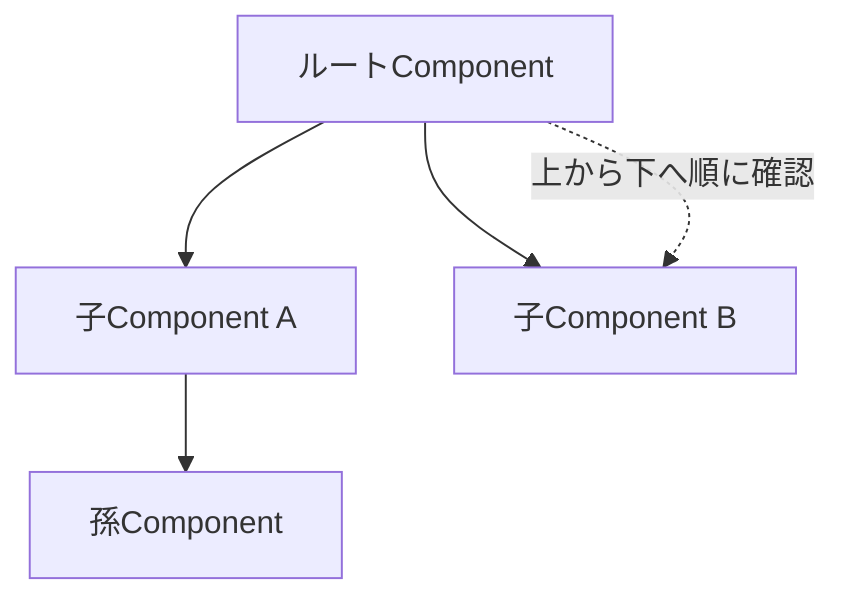
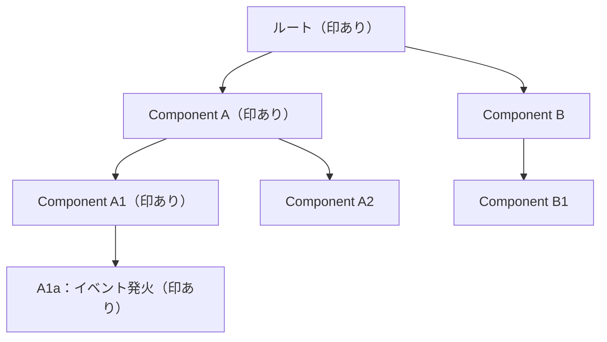
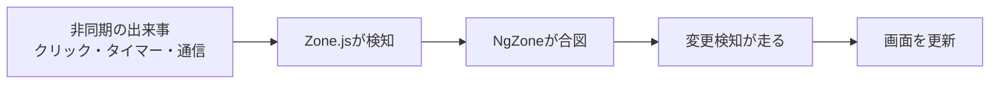

この章では、Angularが画面を更新する仕組みである変更検知を学びます。その基本と、2つの戦略（Default／OnPush）、そして長らく起点を担ってきたZone.jsを扱います。

:::message
**この章で学ぶこと**

- 変更検知とは何をする仕組みか
- 変更検知がいつ実行されるのか
- 2つの変更検知戦略の違い
- OnPushが変更検知を走らせる条件
- Zone.jsが何をしていたか
- NgZoneの役割
:::

## Angularの変更検知を理解する

これまで、クラスのデータを変えれば画面が更新される、という動きを当然のものとして使ってきました。`signal()`の値を`set()`で変えれば、表示が切り替わる。ボタンを押してプロパティを書き換えれば、画面に反映される。しかし、なぜそれが起きるのでしょうか。誰かが「データが変わったから、画面を描き直そう」と判断しているはずです。その判断を担う仕組みが、変更検知（Change Detection）です。

変更検知は、ふだんは意識せずに済む、縁の下の力持ちです。しかし、その仕組みを理解しておくと、「なぜか画面が更新されない」「表示は正しいのに動作が重い」といった問題に、根拠を持って対処できます。この節では、変更検知とは何か、いつ動くのか、何をしているのかを、基礎から丁寧に見ていきます。

### 変更検知とは何か

変更検知とは、「クラスが持つデータ（状態）」と「画面に表示されている内容（DOM）」を一致させ続ける仕組みです。

『テンプレートの記法とDirective概論』の章で学んだデータバインディングを思い出してください。`{{ name() }}`と書けば、`name`の値が画面に表示されます。では、`name`の値が後から変わったとき、その新しい値を画面に反映するのは誰でしょうか。ブラウザは、JavaScriptの変数が変わったことを自動では知りません。誰かが「`name`が変わったから、対応する部分のDOMを書き換えよう」と動く必要があります。

この「状態を見て、変わっていたらDOMを更新する」という一連の処理が、変更検知です。Angularは、状態とテンプレートの対応関係を把握しているので、状態の変化を検知しさえすれば、画面のどこを更新すべきかを判断できます。変更検知は、状態と画面のずれを埋め、常に整合した表示を保つための仕組みなのです。

### いつ変更検知が必要になるのか

状態は、何もないところで勝手に変わることはありません。必ず、何らかのきっかけがあって変わります。アプリケーションの状態が変わりうるのは、おもに次のような非同期の出来事が起きたときです。

- 利用者の操作（クリック、入力、送信など）
- タイマー（`setTimeout`・`setInterval`）の発火
- サーバーからの応答（API通信の完了）
- その他の非同期イベント

たとえば、ボタンをクリックしてカウンターを増やすなら、状態が変わるのは「クリックされた瞬間」です。API通信でデータを取得するなら、「応答が返ってきた瞬間」です。つまり、こうした出来事の後には、状態が変わっている可能性があり、変更検知を走らせて画面を更新する必要が生じます。

逆にいえば、こうした出来事が何も起きていないあいだは、状態は変わりようがないため、変更検知を走らせる必要もありません。「いつ変更検知を動かすか」は、「いつ状態が変わりうるか」と同じ問いなのです。この問いにどう答えるかが、本章後半で扱うZone.jsと、次章のZonelessの違いの核心になります。

### Componentツリーをたどる

変更検知が走ると、Angularは何をするのでしょうか。基本的には、Componentのツリーを上から下へたどりながら、各Componentのテンプレートを確認していきます。

『データフローとinput()・output()』の章で見たように、アプリケーションはComponentの階層、すなわちツリー構造をなしています。変更検知は、そのツリーの頂点（ルート）から始まり、親から子へと順に降りていきます。各Componentで、テンプレートに書かれたバインディング（`{{ }}`や`[prop]`）の値を、前回の値と比べます。値が変わっていれば、対応するDOMを更新します。変わっていなければ、何もしません。



この、一つひとつのバインディングの値を前回と比べて差分を見つける方式を、変更検知の基本的な動作と考えてください。ツリー全体を一度たどりきることで、画面のどこかに生じた変化を、もれなく反映できます。この一巡りを、変更検知のサイクルと呼びます。

### 具体例で流れを追う

抽象的な説明を、具体的な動きに落としてみましょう。カウンターを1つ持つ画面を考えます。

```ts:src/app/counter.ts
@Component({
  selector: 'app-counter',
  template: `
    <p>{{ count() }}</p>
    <button (click)="increment()">増やす</button>
  `,
})
export class Counter {
  protected readonly count = signal(0);

  protected increment(): void {
    this.count.update((n) => n + 1);
  }
}
```

このボタンを押したとき、何が起きるかを順にたどります。まず、利用者がボタンをクリックします。これが、状態が変わりうる「きっかけ」です。次に、クリックのハンドラー`increment`が実行され、`count`が`0`から`1`に変わります。ここで、状態と画面にずれが生じます。画面はまだ`0`を表示しているためです。そこでAngularが変更検知を走らせます。テンプレートの`{{ count() }}`を評価すると`1`が得られ、前回の`0`と違うため、Angularはこの箇所のDOMを`1`に書き換えます。こうして、状態と画面が再び一致します。

私たちが書いたのは、`count`を1増やす処理だけです。「画面を書き換えよ」とはどこにも書いていません。にもかかわらず表示が更新されるのは、この変更検知が、クリックをきっかけに自動で走っているからです。ふだん意識しない動きの裏で、こうしたサイクルが回っています。

### 変更検知の歴史的な進化

変更検知の方式は、Angularの歴史とともに変わってきました。『Angularとは何か』の章で触れた流れを、変更検知の視点から振り返ると、モダンAngularの位置づけが見えてきます。

初代のAngular（AngularJS）は、ダイジェストサイクルと呼ばれる仕組みで、監視対象の値を総当たりで比較していました。次の世代（Angular 2以降）では、本節で見たComponentツリーをたどる方式になり、Zone.jsが変更検知の起動を担うようになりました。そしてモダンAngularは、Signalによって「どの状態がどこで使われているか」を追跡し、変わった箇所だけを狙って更新する方向へ進んでいます。

大きな流れとしては、「広く総当たりで確認する」方式から、「変化した箇所を正確に狙う」方式へと、一貫して効率を高めてきた、といえます。この進化の到達点が、次章で学ぶSignalsとZonelessです。本節で学ぶ基本の仕組みは、その進化の土台をなすものです。

### 手動で変更検知に関わる

ふだん変更検知は自動ですが、まれに手動で関わることがあります。そのための窓口が`ChangeDetectorRef`で、`inject()`で取得できます。代表的なメソッドを挙げます。

- **`markForCheck()`**: このComponentを次回の変更検知で確認するよう印を付けます。後の節で扱うOnPushと深く関わります。
- **`detectChanges()`**: その場で、このComponent以下の変更検知を即座に実行します。
- **`detach()`／`reattach()`**: 変更検知の対象から外す／戻します。

これらは、通常の開発ではほとんど使いません。SignalとOnPushで書いていれば、変更検知は自動で適切に働くためです。手動の制御が必要になったときは、まず「なぜ自動で検知されないのか」を考えるのが先決です。多くの場合、原因は状態の持ち方にあり、Signalへ移すことで手動制御が不要になります。

### 値の比較のしかた

変更検知が値を比べるとき、その比較は「同一かどうか」の単純な比較です。プリミティブな値（数値や文字列）なら、値そのものを比べます。オブジェクトや配列なら、中身ではなく、参照（それが同じインスタンスを指しているか）を比べます。

この「参照で比べる」という点は、本章の後の節で重要になります。たとえば、配列の中身を書き換えても、配列そのもの（参照）が同じであれば、変更検知は「変わっていない」と判断することがあります。逆に、新しい配列を作って差し替えれば、参照が変わるため、変化として検知されます。ここでは、比較が参照ベースで行われることがある、という点を頭の片隅に置いておいてください。本章の次の節のOnPushで、この性質が効いてきます。

### 変更検知を理解する意義

変更検知は、ふだんは自動で動くため、意識しなくてもアプリケーションは動きます。それでも、その仕組みを理解しておく意義は大きいものです。

ひとつは、**表示が更新されない問題への対処**です。「データを変えたのに画面が変わらない」というつまずきは、多くの場合、変更検知が走っていないか、変化として検知されていないことが原因です。仕組みを知っていれば、原因を切り分けられます。

もうひとつは、**パフォーマンスの理解**です。変更検知は、走るたびにツリーをたどるため、規模が大きくなると、その回数と範囲がアプリの速度に影響します。不要な変更検知を減らす工夫が、パフォーマンス改善の柱になります。その工夫の入り口が、本章の次の節のOnPushであり、さらにその先、次章で学ぶSignalsとZonelessです。

そして、モダンAngularがSignalsへ舵を切った理由も、変更検知の視点から見ると腑に落ちます。従来の方式は、「状態が変わったかもしれない」タイミングでツリー全体を確認していました。Signalは、「どの状態が、どこで使われているか」をAngularに正確に伝えます。これにより、変わった箇所だけを狙って更新できるようになります。変更検知の効率化こそ、Signalsがもたらす最大の恩恵のひとつなのです。

### Angular DevToolsで変更検知を観察する

ここまで説明してきた変更検知のサイクルは、Angular DevToolsを使うと実際に目で確かめられます。Angular DevToolsは、ChromeやEdgeに追加できる公式のブラウザ拡張です。開発ビルドのアプリを開くと、ブラウザの開発者ツールに「Angular」タブが現れます。

変更検知を観察するには、その中の「Profiler」を使います。手順は次のとおりです。

1. Profilerタブを開き、記録を開始します
2. アプリを操作します（ボタンを押す、テキストを入力するなど）
3. 記録を止めると、その間に走った変更検知のサイクルが、棒グラフの一覧として表示されます

各サイクルをクリックすると、そのサイクルでどのComponentが確認され、それぞれに何ミリ秒かかったかがわかります。時間のかかったComponentほど濃い色で表示されるため、どこが重いのかを目で特定できます。操作していないのに変更検知が何度も走っていないか、特定のComponentだけ確認に時間がかかっていないか、といった点を、推測ではなく計測で確かめられます。OnPushの効果を検証したいときも、確認されるComponentの数がサイクルごとに減る様子を、このProfilerで見て取れます。

### ExpressionChangedAfterItHasBeenCheckedErrorという試金石

変更検知の理解度を映す、よく知られたエラーがあります。`ExpressionChangedAfterItHasBeenCheckedError`です。開発モードのときだけ現れます。

開発モードのAngularは、1回の変更検知が終わったあと、確認のためにもう一度変更検知を走らせます。1回目と2回目とでバインディングの値が食い違っていると、このエラーを投げます。「変更検知が終わったはずなのに、値がさらに書き換わった」という状態を知らせているわけです。多くは、あるComponentの変更検知の最中に、すでに確認し終えた親などの値を書き換えてしまったときに起こります。

このエラーに出会ったら、変更検知の途中で状態を変えていないかを疑います。値の準備を`ngOnInit`のような早い段階へ移す、あるいは状態をSignalで持つことで、多くは解消します。本番ビルドでは2回目の確認は行われないため、これは開発中に不整合へ気づかせるための仕組みだと捉えてください。

### よくあるつまずき

- **画面が更新されない**: データを変えたのに表示が変わらないときは、変更検知が走っていないか、変化として検知されていないことを疑います。状態をSignalで持てば、変化が確実に通知され、この種の問題の多くを避けられます。
- **オブジェクトの中身を書き換えて検知されない**: 配列やオブジェクトは参照で比較される場面があります。中身だけを書き換えると変化とみなされないことがあるため、新しい値に差し替えます。
- **変更検知が重い**: 大規模なアプリで動作が重いときは、変更検知の回数と範囲を疑います。OnPush（本章の次の節）やSignals、Zoneless（次章）が、その対処の柱になります。「重い処理をテンプレートやメソッドで毎回実行していないか」も確認します。

## Default Change DetectionとOnPush

前節で、変更検知がComponentツリーを上から下へたどって画面を更新することを学びました。この「どのようにツリーを確認するか」には、実は2つの戦略があります。すべてのComponentを毎回確認する戦略と、必要なComponentだけを確認する戦略です。前者を長らくDefault（既定）と呼び、後者をOnPushと呼んできました。

この2つの戦略の違いは、アプリケーションのパフォーマンスに直結します。そして重要なことに、Angular 22（2026年）で、この既定が切り替わりました。新しく作るComponentは、OnPushが標準になったのです。この節では、2つの戦略の違いと、なぜOnPushが標準になったのかを掘り下げます。

### 2つの変更検知戦略

まず、従来から標準だった戦略を見ます。この戦略では、変更検知のサイクルが走るたびに、原則としてすべてのComponentを確認します。どこかで何かが起きて変更検知が始まると、ツリー全体をたどり、一つひとつのComponentのバインディングを検査するのです。

この戦略は、確実です。どこで状態が変わっても、必ず全体を確認するため、更新のもれが起きません。その代わり、確認の対象が常にツリー全体なので、無駄も生じます。実際には何も変わっていないComponentまで、毎回検査することになるためです。小さなアプリケーションでは問題になりませんが、Componentが数百に及ぶ規模では、この無駄が積み重なって、動作の重さにつながります。

もうひとつの戦略が、OnPushです。OnPushを指定したComponentは、「特定の条件が満たされたときだけ」確認の対象になります。何も起きていないなら、たとえ変更検知のサイクルが走っても、そのComponentは検査をとばされます。確認の範囲を絞ることで、無駄を大きく減らせるのです。

### OnPushが変更検知を走らせる条件

では、OnPushのComponentは、どんなときに確認されるのでしょうか。おもな条件は次の4つです。

- **入力（`input`）の参照が変わったとき**: 親から渡される入力が、新しい値（新しい参照）に変わった場合
- **Component自身やその子でイベントが起きたとき**: クリックなど、そのComponent内のイベントが発火した場合
- **テンプレート内の`async`パイプが新しい値を受け取ったとき**: 『Directiveの実装とPipe』の章で学んだ`async`パイプが値を流した場合
- **明示的に更新を要求したとき**: `ChangeDetectorRef`の`markForCheck()`を呼んだ場合

これらはいずれも、「そのComponentの状態が実際に変わった可能性が高い」タイミングです。OnPushは、この確度の高いタイミングだけに確認を絞ります。逆にいえば、これらの条件を満たさずに状態を変えても、OnPushのComponentは更新されません。ここが、OnPushを使ううえで理解しておくべき勘所です。

とくに1つ目の「入力の参照が変わったとき」は重要です。前節で、オブジェクトや配列は参照で比較されると述べました。OnPushのComponentに配列を渡している場合、その配列の中身を書き換えても、参照が同じなら「変わっていない」とみなされ、更新されません。中身ではなく、新しい配列に差し替えることで、はじめて参照が変わり、更新が起きます。

この挙動を、具体例で確かめます。OnPushの子Componentに、商品の配列を渡すとします。

```ts:src/app/product-list.ts
@Component({
  selector: 'app-product-list',
  template: `@for (p of products(); track p.id) { <p>{{ p.name }}</p> }`,
})
export class ProductList {
  products = input.required<Product[]>();
}
```

親側で、次のように配列の中身を直接書き換えても、OnPushの子は更新されません。

```ts
// 更新されない：同じ配列の参照のまま中身を足している
addProduct(): void {
  this.items().push(newProduct);
}
```

一方、新しい配列に差し替えれば、参照が変わり、子が更新されます。

```ts
// 更新される：新しい配列に差し替えて参照を変える
addProduct(): void {
  this.items.update((list) => [...list, newProduct]);
}
```

`items`をSignalで持ち、`update()`で新しい配列に差し替えているため、参照が変わり、変化が確実に伝わります。OnPushと不変な更新、そしてSignalが、いかに噛み合っているかが見て取れます。「中身を書き換える」のではなく「新しい値に差し替える」という習慣が、OnPush時代の基本作法です。

### スキップと印がツリーを伝わる仕組み

OnPushの条件は、1つのComponentの中だけで完結する話ではありません。あるComponentを確認するかどうかは、そのComponentより下のツリー全体を左右します。押さえておきたい規則が2つあります。

1つ目は、**スキップは配下のサブツリーごと起こる**という規則です。OnPushのComponentが確認の対象から外れると、その下にある子や孫のComponentも、まとめて確認をとばされます。仮に子がDefault（Eager）で書かれていても、親がスキップされれば、変更検知はその親で降りるのをやめます。OnPushのComponentは、自分の下へ向かう変更検知の門番のように働くわけです。

2つ目は、**イベントの発火や`markForCheck()`は、そのComponentから祖先をたどってルートまで印を付ける**という規則です。あるComponentでイベントが起きたり`markForCheck()`が呼ばれたりすると、そのComponentからルートまでの経路上にあるComponentすべてに、「次の変更検知で確認する」印が付きます。この印がないと、途中の祖先がOnPushでスキップされ、肝心のComponentまで変更検知が降りてこられません。

次の図は、深い位置にある子Componentでイベントが起きたとき、ルートまで印が付く経路を表したものです。



印が付いた経路（ルート → A → A1 → A1a）だけが、次の変更検知でたどられます。印のないBやA2の側は、OnPushであれば確認をとばされます。イベントの起きた場所からルートまでを一筋に通し、その周囲には手を付けない。この「必要な経路だけを通す」動きが、OnPushで無駄が減る仕組みの中身です。

### Angular 22での既定の変化

ここまで「従来の標準」「OnPush」と呼び分けてきましたが、Angular 22で、この関係が変わりました。

Angular 22より前は、Componentに変更検知戦略を指定しないと、全体を確認する戦略（`ChangeDetectionStrategy.Default`）が適用されていました。OnPushを使うには、明示的に指定する必要がありました。

```ts:Angular 22より前の書き方（明示的にOnPushを指定）
import { ChangeDetectionStrategy, Component } from '@angular/core';

@Component({
  selector: 'app-user-card',
  changeDetection: ChangeDetectionStrategy.OnPush,
  template: `...`,
})
export class UserCard {}
```

Angular 22では、この既定が逆転しました。戦略を指定しないComponentは、OnPushとして扱われます。つまり、上記のような`changeDetection`の明示は、新規Componentでは不要になったのです。より効率のよいOnPushが、標準の振る舞いになりました。

これにともない、従来の「全体を確認する戦略」の名前も整理されました。この常時確認の戦略は`ChangeDetectionStrategy.Eager`という名前になり、`Default`は非推奨（deprecated）として残されつつ、`Eager`の別名という位置づけになりました。もし、あえて従来どおりの常時確認をさせたい場合は、`Eager`を明示します。

```ts:src/app/legacy-widget.ts
import { ChangeDetectionStrategy, Component } from '@angular/core';

@Component({
  selector: 'app-legacy-widget',
  changeDetection: ChangeDetectionStrategy.Eager, // 従来の常時確認
  template: `...`,
})
export class LegacyWidget {}
```

:::message
既存のアプリケーションをAngular 22へ更新するときは、互換性のために、明示的な戦略のないComponentへ自動で`Eager`が付与されます。これにより、更新しても従来の挙動が保たれます。新しく書くComponentは、既定のOnPushをそのまま活かすのがよいでしょう。
:::

### OnPushとSignal・不変性

OnPushは、状態の扱い方に一定の規律を求めます。「参照が変わったら更新する」という性質のため、状態を変えるときは、既存のオブジェクトを書き換えるのではなく、新しいオブジェクトに差し替える、という書き方が基本になります。この「変更のたびに新しい値を作る」考え方を、不変性（イミュータビリティ）と呼びます。

```ts
// OnPushと相性の悪い書き方（同じ配列の中身を書き換える）
this.items.push(newItem);

// OnPushと相性のよい書き方（新しい配列に差し替える）
this.items = [...this.items, newItem];
```

そして、この不変性を自然に扱えるのがSignalです。Signalの値を`set()`や`update()`で変えると、Angularは「そのSignalが変わった」ことを正確に把握します。参照の比較に頼らずとも、変化が確実に伝わるのです。Signalを使えば、OnPushのComponentでも、状態の変化が漏れなく画面に反映されます。

実のところ、OnPushが標準になった背景には、Signalの普及があります。Signalで状態を管理していれば、変更検知は「変わったSignalを使っているComponent」だけを、的確に更新できます。OnPushの「必要なところだけ確認する」という発想と、Signalの「どこで何が使われているかを追跡する」という性質は、非常に相性がよいのです。この組み合わせが、次章で学ぶZonelessへの道を開きます。

かつては、OnPushは「上級者が性能のために選ぶ、少し扱いの難しい戦略」と見られていました。参照の比較を意識せねばならず、慣れないうちは表示が更新されない不具合を招きやすかったためです。しかしSignalの登場で状況が変わりました。状態をSignalで持てば、参照の比較を意識せずとも変化が正しく伝わります。OnPushの難しさの多くが、Signalによって解消されたのです。OnPushが標準になったのは、こうしてOnPushが「特別な最適化」から「無理なく使える既定」へと変わったことの表れでもあります。

### よくあるつまずき

- **OnPushで表示が更新されない**: 多くは、オブジェクトや配列の中身を書き換えて、参照を変えていないことが原因です。新しい値に差し替えるか、Signalで状態を持つと解決します。
- **`Default`をそのまま使い続ける**: `Default`は非推奨になりました。従来の挙動が必要なら`Eager`を明示し、可能ならOnPush（既定）へ寄せていきます。
- **`markForCheck()`に頼りすぎる**: 手動で更新を要求する`markForCheck()`は最終手段です。まずはSignalや不変な更新で、自然に検知される形を目指します。手動呼び出しが増えてきたら、状態の持ち方を見直す合図だと捉えてください。

## Zone.jsとNgZone時代のAngular

前の2つの節で、変更検知が「状態が変わりうるタイミングで走る」ことを学びました。では、Angularはどうやって、そのタイミングを知っていたのでしょうか。クリックやタイマー、通信の完了といった非同期の出来事を、フレームワークはどのようにして察知していたのか。その長年の答えが、Zone.jsという仕組みでした。

Zone.jsは、Angularが誕生初期から変更検知の起点として使われてきた仕組みです。私たちが`setTimeout`のあとに何もしなくても画面が更新されたのは、Zone.jsのおかげでした。しかしこの仕組みには、便利さと引き換えの課題もありました。この節では、Zone.jsとNgZoneが何をしていたのか、そしてなぜモダンAngularがそこから離れようとしているのかを理解します。次章のZonelessへの転換を理解するための、重要な前提です。

### Zone.jsとは何か

Zone.jsは、ブラウザの非同期APIを「監視」するためのライブラリです。ここでいう非同期APIとは、`setTimeout`・`setInterval`・`addEventListener`・`fetch`やXHRといった、「あとで何かが起きる」たぐいの機能を指します。

Zone.jsは、これらのAPIに細工をします。本来のAPIを、自前の処理で包み込むのです。この「既存の機能を包んで差し替える」手法を、モンキーパッチと呼びます。たとえば`setTimeout`なら、Zone.jsが用意した`setTimeout`が代わりに呼ばれるようになり、その中で本来の`setTimeout`を呼びつつ、「タイマーが発火した」ことをZone.jsが知れるようにします。

こうしてZone.jsは、アプリケーションの中で起きるあらゆる非同期の出来事を、横から把握できるようになります。「いつ、何の非同期処理が完了したか」を知る監視役、それがZone.jsの正体です。

### モンキーパッチを具体的にイメージする

モンキーパッチの発想を、具体的にイメージしてみましょう。次のような、ごくふつうのコードがあるとします。

```ts
setTimeout(() => {
  this.message = 'こんにちは';
}, 1000);
```

Zone.jsがない世界では、1秒後に`message`が書き換わっても、それだけです。Angularは、この書き換えを知るすべがありません。ところがZone.jsがあると、この`setTimeout`は、Zone.jsが差し替えた`setTimeout`に置き換わっています。その中では、本来のタイマー処理を実行したうえで、「タイマーのコールバックが終わった」ことをZone.jsが記録します。そしてAngularへ「非同期処理がひと区切りした」と合図を送ります。

つまり、開発者は標準の`setTimeout`を書いているつもりでも、実際にはZone.jsに包まれたものが動いていた、というわけです。この見えない仕掛けがあったからこそ、`message`を書き換えるだけで画面が更新される、という魔法のような体験が成り立っていました。裏を返せば、この魔法はZone.jsという大きな仕掛けの上に乗っていた、ということでもあります。

### すべての非同期が対象になるとは限らない

Zone.jsは多くの非同期APIを監視しますが、Zone.jsが認識できない方法で状態が変わった場合は、自動検知が働きません。たとえば、Zone.jsがパッチしていない特殊なAPIや、Angularの外側で動くサードパーティのライブラリのコールバックなどです。

こうした場合、従来は変更検知が走らず、画面が更新されないという問題が起きました。その対処として、`NgZone`の`run`メソッドで明示的にAngularのゾーンに処理を戻したり、`ChangeDetectorRef`で手動検知を促したりする必要がありました。「Zone.jsが検知してくれるはず」という前提が崩れる場面が、確かに存在したのです。これも、Zone.js方式のわかりにくさのひとつでした。状態の変化が、暗黙の監視に依存していたためです。

### NgZoneの役割

Angularは、このZone.jsを土台に、`NgZone`という独自の仕組みを用意しました。`NgZone`は、Angularアプリケーション専用のゾーン（監視区画）です。アプリの処理は、この`NgZone`の中で実行されます。

`NgZone`は、監視している非同期の出来事が「ひと区切りついた」ことを検知すると、Angularに合図を送ります。この合図を受けて、Angularは`ApplicationRef.tick()`を呼び出します。これが、ルートから変更検知のサイクルを1回走らせる実体です。この一連が、変更検知の起点でした。つまり、次のような流れです。



この仕組みのおかげで、開発者は変更検知を意識する必要がありませんでした。ボタンのクリックハンドラーでプロパティを書き換えれば、クリックという出来事をZone.jsが検知し、`NgZone`が合図を送り、変更検知が走って画面が更新される。この一連が、すべて自動で起きていたのです。「状態を変えれば画面が変わる」という当たり前の体験は、Zone.jsと`NgZone`が支えていました。

### Zone.jsによる変更検知の起動

ここで、前節までの内容とつながります。本章の最初の節で「状態が変わりうるタイミングで変更検知が走る」と述べ、先ほどの節で「従来の戦略はツリー全体を確認する」と述べました。この2つを結ぶのがZone.jsです。

Zone.jsが非同期の出来事を検知するたびに、Angularは変更検知を起動し、ツリーをたどって画面を更新していました。クリック1回、タイマー1回ごとに、変更検知のサイクルが1回走る、というイメージです。開発者が何も書かなくても画面が同期され続けたのは、この自動起動があったからにほかなりません。

### Zone.jsが抱えていた課題

長年アプリを支えてきたZone.jsですが、いくつかの課題も抱えていました。モダンAngularがそこから離れようとしているのは、これらの課題があるためです。

第一に、**過剰な変更検知**です。Zone.jsは、「状態が変わったかどうか」までは判断できません。あくまで「非同期の出来事が起きた」ことを検知するだけです。そのため、状態が実際には何も変わっていない出来事に対しても、変更検知が走ってしまいます。たとえば、画面のどことも関係のないタイマーが動くたびに、ツリー全体の確認が走る、といった無駄が生じえます。前節のOnPushは、この無駄を各Componentの単位で抑える工夫でしたが、起動そのものはZone.jsが握っていました。

第二に、**バンドルサイズ**です。Zone.jsは、それ自体がそれなりの大きさを持つライブラリです。アプリケーションの一部として読み込まれるため、最初にダウンロードするコードの量を増やし、起動を遅くする一因になっていました。

第三に、**デバッグの難しさ**です。Zone.jsは非同期APIをモンキーパッチするため、エラーが起きたときのスタックトレース（処理の呼び出し履歴）に、Zone.js由来の複雑な情報が混ざります。これが、問題の原因を追う際の見通しを悪くすることがありました。

第四に、**エコシステムとの相性**です。ブラウザAPIを書き換えるという性質上、ほかのライブラリと予期しない干渉を起こすことがありました。標準的なブラウザの挙動を前提とするコードと、かみ合わない場面があったのです。

### NgZoneを意識する場面

ふだんZone.jsや`NgZone`を直接触ることはありませんが、従来のアプリでは、あえて`NgZone`を操作する場面もありました。代表的なのが、`runOutsideAngular`です。

```ts:NgZoneの外で処理を実行する（従来の最適化手法）
import { NgZone, inject } from '@angular/core';

export class ScrollTracker {
  private readonly zone = inject(NgZone);

  start(): void {
    // 頻発するイベントを、変更検知の外で処理する
    this.zone.runOutsideAngular(() => {
      window.addEventListener('scroll', () => this.onScroll());
    });
  }
}
```

スクロールのように高頻度で発火するイベントを、変更検知の外で処理し、必要なときだけ`NgZone`の中に戻る、という最適化です。これは、Zone.jsが「あらゆる非同期を検知して変更検知を起動する」ことの裏返しでした。過剰な起動を、開発者が手作業で抑えていたわけです。こうした工夫が必要だったこと自体が、Zone.js方式の限界を示していました。

### Zone.jsは「悪」ではない

ここまでZone.jsの課題を並べましたが、Zone.jsが悪い仕組みだったわけではありません。むしろ、長らくAngularの開発体験を支えた、優れた発明でした。「状態を変えれば画面が変わる」という直感的な体験は、Zone.jsがあってこそ実現していました。開発者は変更検知をまったく意識せずに、アプリを書けたのです。これは初学者にとって、大きな助けでした。

問題は、時代とともに、アプリケーションが大規模化し、パフォーマンスへの要求が高まったことにあります。Zone.jsの「念のため広く確認する」方式は、小規模なうちは十分でしたが、規模が大きくなると無駄が目立ちます。また、Signalという、より精密な変化追跡の手段が登場したことで、「Zone.jsに頼らなくても、変化を正確に捉えられる」道が開けました。Zone.jsからの移行は、Zone.jsの否定ではなく、より良い手段への発展と捉えるのが正確です。『Angularとは何か』の章で述べた「新旧を否定的に語らない」という本書の姿勢は、ここにも当てはまります。

### よくあるつまずき

- **Zone.jsの検知に暗黙的に頼る**: `setTimeout`のコールバック内でプロパティを書き換え、自動更新に頼るコードは、Zonelessでは動きません。状態はSignalで持つのが、将来にわたって安全です。
- **`runOutsideAngular`の戻し忘れ**: `runOutsideAngular`の中で状態を変えても、変更検知は走りません。表示を更新したいときは、`NgZone`の`run`で明示的にゾーンへ戻す必要がありました。
- **Zone.jsを闇雲に取り除く**: 既存アプリからZone.jsを外すと、自動検知に頼っていた箇所が動かなくなることがあります。先にSignalへ移してから取り除くのが安全です。

## まとめ

- 変更検知は、クラスの状態と画面のDOMを一致させ続ける仕組みです
- 状態は、操作・タイマー・通信などの非同期の出来事をきっかけに変わります
- 変更検知は、Componentツリーを上から下へたどり、バインディングの値を確認します
- 変更検知には、全体を確認する戦略と、必要な箇所だけを確認するOnPushがあります
- OnPushは、入力の参照変化・イベント・`async`パイプ・`markForCheck()`で更新されます
- Angular 22では、新規Componentの既定がOnPushになり、従来の常時確認は`Eager`に改称されました
- Zone.jsは、ブラウザの非同期APIをモンキーパッチして監視するライブラリです
- `NgZone`はAngular専用のゾーンで、非同期の区切りを検知して変更検知を起動していました
- この仕組みにより、開発者は変更検知を意識せず、自動的な画面更新を得ていました

次章では、変更検知の新しい主役であるSignalsと、Zone.jsに依存しないZonelessを学びます。
