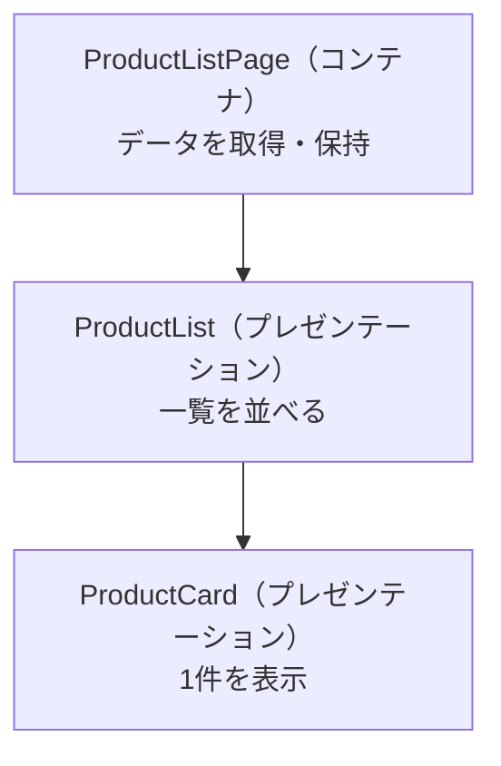

ここまでで、Componentの作り方と、それを支える仕組みを学んできました。第2部の最後となるこの章では、視点を少し上げて、「Componentをどう分割し、それぞれに何を担わせるか」という設計の話をします。

Componentは、1つにまとめることも、細かく分けることもできます。どちらが正解というわけではありませんが、分け方を誤ると、見通しが悪く、再利用しづらく、テストしにくいコードになります。この章では、分割の目的と指針を整理し、実際に画面を分割する例を通して、設計の勘所をつかみます。

:::message
**この章で学ぶこと**

- Componentを分割する目的
- 単一責任という考え方
- 状態を持つComponentと持たないComponentの分離
- 分割の指針と、分けすぎの弊害
:::

## Componentを分割する理由

なぜComponentを分割するのでしょうか。おもな理由は3つあります。

- **再利用**: 小さく独立した部品は、別の画面でも使い回せます
- **見通し**: 1つのComponentが小さいほど、何をしているかを理解しやすくなります
- **テスト**: 責務が限定された部品ほど、テストの対象が明確になります

逆に、1つのComponentにすべてを詰め込むと、テンプレートは長大になり、クラスはさまざまな処理を抱え込み、どこを直せば何に影響するのかがわからなくなります。分割は、この複雑さを抑えるための基本的な手段です。加えて、責務が分かれていれば、複数人での開発時に担当を分けやすくなる利点もあります。あるComponentを直しても、ほかのComponentへの影響が及びにくいためです。

## 単一責任という考え方

分割の指針としてまず押さえたいのが、「1つのComponentは、1つの関心事に集中する」という考え方です。ソフトウェア設計で広く知られる、単一責任の原則にもとづくものです。

たとえば「商品一覧画面」を考えます。この画面には、次のような関心事が混在しています。

- 商品データを取得する
- 商品を一覧として並べる
- 個々の商品の見た目を整える
- 並び替えや絞り込みを操作する

これらをすべて1つのComponentに書くと、Componentは「データ取得も、一覧表示も、見た目も、操作も」担う、責務のはっきりしない部品になります。関心事ごとにComponentを分ければ、それぞれが何のための部品なのかが明確になります。

判断の目安として、あるComponentを説明するときに「〜と〜と〜をする」と『と』でいくつもつながるなら、責務が多すぎるサインです。「商品を一覧表示する」のように、ひとことで言い切れる状態を目指します。ひとことで説明できるComponentは、名前も付けやすく、テストの対象も明確になります。

## 状態を持つComponentと持たないComponent

分割の考え方として広く使われるのが、Componentを2種類に分ける方法です。

- **状態を持つComponent（コンテナ）**: データの取得や保持、全体の取りまとめを担う
- **状態を持たないComponent（プレゼンテーション）**: 受け取ったデータを表示し、操作を外へ伝えることに徹する

コンテナは「何を表示するか」を決め、プレゼンテーションは「どう表示するか」に集中します。プレゼンテーションComponentは、自分ではデータを取りにいかず、外から渡されたものを表示するだけなので、独立して再利用しやすく、テストも容易です。

先ほどの商品一覧なら、次のように分けられます。

- `ProductListPage`（コンテナ）: 商品データを取得し、一覧Componentに渡す
- `ProductList`（プレゼンテーション）: 受け取った商品の配列を並べる
- `ProductCard`（プレゼンテーション）: 個々の商品を表示する



コンテナから子へデータを渡し、子から親へ操作を伝える具体的な仕組み、すなわち入力（input）と出力（output）は、第4部で詳しく扱います。ここでは「データを持つ側と、見た目を担う側を分ける」という設計の発想をつかんでください。

## コードで見る分割

先ほどの商品一覧を、コードの形でも見てみましょう。コンテナは、データを取得し、それをプレゼンテーションComponentに渡します。

```ts:src/app/product-list-page.ts
@Component({
  selector: 'app-product-list-page',
  imports: [ProductList],
  template: `<app-product-list [products]="products()" />`,
})
export class ProductListPage {
  private readonly service = inject(ProductService);
  protected readonly products = this.service.getProducts();
}
```

プレゼンテーション側は、渡された商品を受け取って並べるだけです。自分ではデータを取りにいきません。

```ts:src/app/product-list.ts
@Component({
  selector: 'app-product-list',
  imports: [ProductCard],
  template: `
    @for (product of products(); track product.id) {
      <app-product-card [product]="product" />
    }
  `,
})
export class ProductList {
  products = input<Product[]>([]);
}
```

逆に、プレゼンテーション側での操作を、コンテナへ伝えることもできます。たとえば、商品カードがクリックされたことを親に知らせるには、出力（output）を使います。

```ts:src/app/product-card.ts
@Component({
  selector: 'app-product-card',
  template: `
    <button (click)="selected.emit(product())">{{ product().name }}</button>
  `,
})
export class ProductCard {
  product = input.required<Product>();
  selected = output<Product>();
}
```

プレゼンテーションは「クリックされた」という事実だけを外へ伝え、それをどう扱うか（画面を遷移するのか、選択状態にするのか）はコンテナが決めます。このように、上から下へはデータを、下から上へは出来事を流すのが、見通しのよい設計の基本です。データを渡す`[products]`や、受け取る`input()`、繰り返しの`@for`といった記法は、第3部と第4部で詳しく扱います。ここでは、責務がきれいに分かれている形をつかんでください。

## 分割したComponentの置き場所

Componentを分割すると、ファイルが増えます。関連するComponentは、機能ごとのフォルダにまとめておくと見通しがよくなります。たとえば商品まわりのComponentは、`product/`フォルダにまとめます。

```text
src/app/
├── product/
│   ├── product-list-page.ts   … コンテナ
│   ├── product-list.ts        … 一覧
│   └── product-card.ts        … 1件
└── ...
```

どこに何があるかがフォルダ構成から読み取れると、規模が大きくなっても迷いにくくなります。アプリケーション全体のフォルダ設計は、第11部でも改めて扱います。

## 分割の指針

では、どこで分割すればよいのでしょうか。次のような兆候が、分割を考える目安になります。

- テンプレートが長くなり、全体を一目で追えなくなってきた
- 同じ見た目のまとまりが、複数の場所で繰り返し登場している
- 1つのComponentが、データ取得も表示も操作も担っている
- 一部分だけを、別の画面でも使い回したくなった

こうした兆候が見えたら、関心事のまとまりを切り出して、別のComponentにすることを検討します。

切り出す作業自体は、あとからでも行えます。最初から完璧な分割を目指す必要はありません。まず動くものを作り、重複や肥大化が見えてきた段階で、`ng generate component`で新しいComponentを作り、そこへ切り出す、という進め方が現実的です。設計は一度で決めきるものではなく、開発を進めながら少しずつ整えていくものだと考えてください。

## 分けすぎにも注意する

一方で、分割は万能ではありません。何でも細かく分ければよいわけではないのです。

意味のまとまりがないのに機械的に分割すると、Component間で受け渡すデータが増え、かえって全体像を追いにくくなります。ごく小さく、単独では意味をなさない部品を大量に作ると、ファイルばかり増えて、どこで何が起きているのかが見えなくなります。

分割の判断は、「そのまとまりに名前を付けられるか」を目安にするとよいでしょう。`ProductCard`のように役割を言い表せるなら、分割する価値があります。うまく名前が付けられないなら、まだ分けるべきまとまりになっていない、というサインかもしれません。適切な粒度は経験でつかめてくるので、まずは大きく作り、必要に応じて切り出す、という順番で進めるのが安全です。

## よくある設計の失敗

分割にまつわる典型的な失敗を、両極として押さえておきましょう。

- **神Component**: 1つのComponentに、データ取得・表示・操作をすべて詰め込んだ状態です。テンプレートが長大になり、修正の影響範囲が読めなくなります。関心事ごとに切り出すのが対処です。
- **過度な分割**: 意味のまとまりがないのに、細かく分けすぎた状態です。Component間の受け渡しばかりが増え、かえって全体を追いにくくなります。
- **深いバケツリレー**: 親から子、孫へとデータを渡し続ける状態です。階層が深いと、途中のComponentが中身に関心がないのにデータを素通しすることになります。これは、状態管理（第10部）で扱う仕組みによって緩和できます。

いずれの極端も避け、「名前を付けられるまとまり」を単位に分ける、というバランスを意識してください。

## まとめ

- Componentの分割は、再利用・見通し・テストのしやすさを高めるための手段です
- 1つのComponentは1つの関心事に集中させる、という単一責任の考え方が指針になります
- データを持つコンテナと、表示に徹するプレゼンテーションに分けると、責務が明確になります
- 分割はテンプレートの肥大化や重複が兆候で、分けすぎるとかえって見通しが悪くなります
- **まずは大きく作り、名前を付けられるまとまりを必要に応じて切り出すのが安全な進め方です**

以上で第2部は終わりです。次の第3部では、テンプレートの中身に踏み込み、データバインディングやDirective、Pipeといった、画面を動かす仕組みを学びます。
