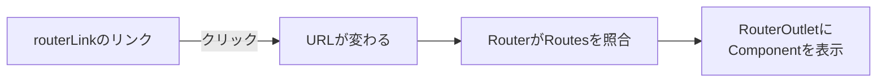

この章では、URLと画面を結びつけるAngular Routerの基礎を学びます。SPAの考え方、`provideRouter()`による設定、そしてページ遷移とルートパラメーターを扱います。

:::message
**この章で学ぶこと**

- SPAと従来のWebサイトの違い
- SPAが抱える「画面遷移」の課題
- Routesによるルート定義
- `provideRouter()`によるルーティングの登録
- `routerLink`によるリンク遷移
- `routerLinkActive`による現在地の強調
:::

## SPAとAngular Router

Angularで作るアプリケーションは、その多くがSPA（Single Page Application、シングルページアプリケーション）と呼ばれる形式をとります。この節では、SPAとは何か、従来のWebサイトとどのように仕組みが異なるのかをつかみ、そのうえでAngular Routerがどんな役割を果たすのかを理解します。

Routerは、URLと画面を結びつける仕組みです。しかし、なぜそんな仕組みがわざわざ必要なのでしょうか。その答えは、SPAというアプリケーションの成り立ちにあります。まずSPAの考え方を押さえることで、Routerが解決している課題が見えてきます。この節は、この先のルーティングの解説の土台となる、概念を整理する内容です。

### 従来のWebサイトの仕組み

まず、SPAでない従来のWebサイトを振り返ります。従来のサイトでは、ページを移動するたびに、ブラウザがサーバーへ新しいHTMLを要求していました。トップページから商品ページへ移るなら、ブラウザは商品ページのHTMLをサーバーからまるごと受け取り、画面全体を描き直します。

この方式は素直ですが、いくつかの弱点があります。ページを移るたびに画面が真っ白になり、全体を読み込み直すため、動きがぎこちなくなりがちです。また、ページ間で共通の部分（ヘッダーやサイドバーなど）まで、毎回受け取って描き直すことになり、無駄も生じます。利用者から見ると、操作のたびに待たされる、重い体験になりやすいのです。

### SPAという考え方

SPAは、この課題への答えとして生まれました。SPAでは、最初に一度だけ、アプリケーションの本体（HTMLとJavaScript）を読み込みます。以降のページ遷移では、サーバーへHTMLを取りにいくのではなく、JavaScriptが画面の一部だけを書き換えます。

たとえば商品一覧から商品詳細へ移るとき、SPAは画面全体を捨てて作り直すのではなく、変わる部分（一覧の領域を詳細の領域に）だけを差し替えます。ヘッダーやサイドバーはそのまま残ります。結果として、遷移がなめらかで速く、まるでデスクトップアプリケーションのような操作感が得られます。[『Angularとは何か』の章](./02-angular-intro)で「Angularは動的なWebアプリケーションを作るためのフレームワーク」と述べましたが、そのアプリケーションの多くが、このSPAの形をとります。

一方で、SPAには独自の課題も生まれます。それが、次に述べる「画面遷移とURL」の問題です。

### SPAが抱える画面遷移の課題

SPAでは、JavaScriptが画面を書き換えるだけなので、放っておくとURLが変わりません。どのページを見ていても、ブラウザのアドレス欄は最初のURLのまま、ということが起こりえます。これは、いくつもの不都合を生みます。

- **ブックマークできない**: いま見ている商品詳細ページを、あとで開き直したくても、URLが変わっていないため、ブックマークしても最初の画面に戻ってしまいます。
- **戻る・進むが効かない**: ブラウザの戻るボタンは、URLの履歴をたどる機能です。URLが変わらなければ、戻る操作でひとつ前の画面に戻れません。
- **URLを共有できない**: 「この商品のページを見て」とURLを送っても、受け取った相手は目的のページにたどり着けません。

つまり、SPAは操作感を良くする代わりに、Webの基本である「URLが画面を表す」という性質を失いがちなのです。この問題を解決し、SPAでもURLと画面をきちんと対応させる。それがRouterの仕事です。

### Angular Routerの役割

Angular Routerは、URLとComponentを結びつける仕組みです。「このURLのときは、このComponentを表示する」という対応づけを管理します。

Routerがあると、SPAでありながら、URLが画面を正しく表すようになります。商品詳細ページを開けばURLが`/products/42`のように変わり、そのURLをブックマークすれば、あとで同じページを開けます。戻るボタンを押せば、URLの履歴に沿って前の画面に戻れます。URLを共有すれば、相手も同じページを開けます。SPAのなめらかさを保ちながら、Webの基本的な使い勝手を取り戻せるのです。

しかも、実際のページ遷移では、サーバーへHTMLを取りにいきません。RouterがURLの変化を捉え、対応するComponentに表示を差し替えます。ブラウザの再読み込みは起きず、SPAならではの速い遷移が保たれます。RouterはURLを操作しますが、それはブラウザの履歴の仕組みを使ったもので、サーバーへの再要求ではないのです。

### RouterはどうやってURLを操作するのか

「再読み込みせずにURLだけを変える」というのは、少し不思議に思えるかもしれません。これを可能にしているのが、ブラウザが備えるHistory API（履歴API）という仕組みです。History APIを使うと、JavaScriptから、ページを再読み込みせずにアドレス欄のURLと履歴を書き換えられます。

Angular Routerは、内部でこのHistory APIを使っています。`routerLink`のリンクがクリックされると、Routerはページ遷移をブラウザに任せず、自分で受け止めます。そして、History APIでURLを書き換えつつ、対応するComponentを`RouterOutlet`に表示します。ブラウザから見ると、URLと履歴だけが更新され、ページの再読み込みは起きていません。だからこそ、戻るボタンや進むボタンも、ふつうのWebサイトと同じように機能します。ブラウザの履歴には、遷移のたびにエントリーが積まれていくためです。

この仕組みのおかげで、私たちはHistory APIを直接触ることなく、`routerLink`や`Router`を使うだけで、URLと画面が正しく連動するSPAを作れます。低レベルの複雑さを、Routerが引き受けてくれているのです。

### SPAの弱点と、その先の話題

SPAには多くの利点がありますが、弱点もあります。代表的なのが、最初の読み込みです。SPAは、最初にアプリ本体（JavaScript）を読み込んでから画面を組み立てるため、この初回の読み込みが大きいと、最初の表示までに時間がかかります。次章『ルーティング応用』で学ぶLazy Loadingは、この弱点をやわらげる手段のひとつです。

もうひとつの弱点が、検索エンジンやSNSへの対応です。SPAは、JavaScriptが実行されて初めて画面が組み上がります。JavaScriptを実行しない相手（一部の検索エンジンのクローラーや、SNSのリンク展開など）には、中身のない空のページに見えることがあります。この課題への対処が、[『SSRとモダンAngularへの移行』の章](./25-ssr-and-migration)で扱うSSR（サーバーサイドレンダリング）です。サーバー側であらかじめHTMLを組み立てて返すことで、SPAの利点を保ちつつ、初回表示や検索対応を改善します。

ここでは、SPAが万能ではなく、初回表示と検索対応という弱点を持つこと、そしてそれぞれに対処法が用意されていることを、頭の片隅に置いておいてください。

### ルーティングを構成する基本要素

Angularでルーティングを行うとき、登場する基本的な要素を先に紹介しておきます。詳しくは本章の次の節で扱いますが、全体像として押さえておくと理解がスムーズになります。

- **Routes（ルート定義）**: 「どのURLで、どのComponentを表示するか」の対応表です。ルーティングの設計図にあたります。
- **`provideRouter()`**: そのRoutesをアプリケーションに登録する関数です。[『開発環境・CLIとプロジェクト構成』の章](./03-setup-and-structure)で見た`app.config.ts`に書きます。
- **`RouterOutlet`**: 表示するComponentが差し込まれる場所です。テンプレートに`<router-outlet />`と置きます。
- **`routerLink`**: ページ遷移のためのリンクを作るDirectiveです。`<a>`タグに付けて使います。

これらが連携して、URLと画面の対応が実現します。おおまかな流れは、こうです。利用者が`routerLink`のリンクをクリックする。URLが変わる。RouterがRoutesを見て、対応するComponentを見つける。そのComponentを`RouterOutlet`の位置に表示する。この一連が、ページ遷移のたびに繰り返されます。



### SPAとMPAの使い分け

SPAが常に最適とは限りません。従来型の、ページごとにサーバーからHTMLを返す方式は、MPA（Multi Page Application）と呼ばれます。それぞれに向き不向きがあります。

SPAは、ダッシュボードや業務アプリのように、利用者が長く操作し、画面遷移が頻繁に起きるアプリケーションに向きます。一度読み込めば、その後の操作がなめらかだからです。一方、記事を読むだけのブログや、商品を眺める程度のサイトなど、ページ間の移動が少なく、内容の表示が主目的なら、MPAでも十分なことがあります。

もっとも、Angularは『SSRとモダンAngularへの移行』の章で扱うSSRによって、SPAとMPAの利点を組み合わせることもできます。サーバーで初期HTMLを生成しつつ、その後はSPAとして動く、という構成です。「SPAかMPAか」は白黒はっきり分かれるものではなく、要件に応じて選び、組み合わせるものだと理解しておくとよいでしょう。本書が扱うのは主にSPAとしてのAngularですが、その位置づけを知っておくと、技術選定の視野が広がります。

### SPAとAngular Routerでよくあるつまずき

- **URLの変化を軽視する**: SPAでも、画面の状態はできるだけURLに表すのがよい設計です。URLに状態が表れていれば、ブックマークや共有、戻る操作が自然に機能します。
- **Routerなしで画面を切り替えようとする**: `@if`だけで画面全体を出し分けることもできますが、URLと連動しないため、ブックマークや戻る操作が効きません。ページ単位の切り替えは、Routerに任せるのが基本です。一方、同じページ内での小さな表示の出し分けは、`@if`で十分です。ページ遷移はRouter、画面内の分岐は`@if`、と使い分けを意識してください。

## RouterModuleからprovideRouter()へ

前節で、ルーティングがRoutes・`provideRouter()`・`RouterOutlet`・`routerLink`で構成されることを見ました。この節では、その設定を実際に書いていきます。中心となるのが、Routesの定義と、それをアプリケーションに登録する`provideRouter()`です。

ルーティングの設定方法は、Angularの歴史の中で変わってきました。かつては`RouterModule`というNgModuleを使っていましたが、現在は`provideRouter()`という関数を使います。これは、[『TypeScriptとComponentの基本』の章](./04-component-basics)で学んだ「モジュールから関数へ」という流れの、ルーティング版です。この節では、現在の`provideRouter()`を主に、旧来の`RouterModule`と比較しながら、ルーティングの基本設定を身につけます。

### Routesを定義する

ルーティングの出発点は、Routesの定義です。「どのURLのときに、どのComponentを表示するか」を、配列で書きます。

```ts:src/app/app.routes.ts
import { Routes } from '@angular/router';
import { Home } from './home';
import { About } from './about';
import { NotFound } from './not-found';

export const routes: Routes = [
  { path: '', component: Home },
  { path: 'about', component: About },
  { path: '**', component: NotFound },
];
```

各要素は、`path`（URLの一部）と`component`（表示するComponent）の組です。`path: ''`は、何も付かないトップのURLを表します。`path: 'about'`は`/about`に対応します。最後の`path: '**'`は、どのルートにも一致しなかったときの受け皿で、404ページの表示によく使います。この定義が、URLと画面の対応表になります。ルート定義は、アプリケーションのページ構成をそのまま映す設計図でもあり、これを見れば、どんな画面が存在するのかを一望できます。

ルート定義には、`path`と`component`以外にも、いくつかのプロパティが使えます。よく使うものを挙げます。

- **`redirectTo`**: 別のパスへ転送します。`{ path: '', redirectTo: 'home', pathMatch: 'full' }`のように使います。
- **`pathMatch`**: パスの一致のしかたを指定します。`'full'`はURL全体の一致、`'prefix'`（既定）は前方一致です。
- **`title`**: そのページのタイトル（ブラウザのタブに表示される文字列）を指定します。
- **`children`**: 子のルートを定義します。次章『ルーティング応用』で扱います。

### provideRouterで登録する

定義したRoutesを、アプリケーションに登録します。`app.config.ts`の`providers`に、`provideRouter(routes)`を加えます。

```ts:src/app/app.config.ts
import { ApplicationConfig } from '@angular/core';
import { provideRouter, withComponentInputBinding } from '@angular/router';
import { routes } from './app.routes';

export const appConfig: ApplicationConfig = {
  providers: [
    provideRouter(routes, withComponentInputBinding()),
  ],
};
```

`provideRouter(routes)`だけでも動きますが、ここでは`withComponentInputBinding()`という機能を一緒に渡しています。これは、URLのパラメーターを、Componentの`input()`へ自動で結びつける機能です。この章の後半で活用するので、いまは「あとで役立つ設定を加えた」と捉えてください。`provideRouter()`は、こうした機能を`with〜`という関数で、必要な分だけ追加できる作りになっています。

主な`with〜`機能には、次のようなものがあります。

- **`withComponentInputBinding()`**: ルートパラメーターをComponentの入力に結びつけます。
- **`withHashLocation()`**: URLを`/#/about`のようなハッシュ形式にします。
- **`withInMemoryScrolling()`**: 画面遷移時のスクロール位置を制御します。
- **`withPreloading()`**: 遅延読み込みするコードを、先読みします（次章『ルーティング応用』で扱います）。

### スクロール位置を復元する

SPAには、見落とされがちな課題があります。長いページをスクロールして別のページへ移り、ブラウザの戻るボタンで戻ってきたとき、スクロール位置が先頭に戻ってしまうのです。従来のWebサイトなら、戻ると元の位置が保たれます。しかしSPAでは、Routerが画面を差し替えるだけなので、何も設定しなければスクロール位置は管理されません。

この課題は、`withInMemoryScrolling()`で解決できます。

```ts:src/app/app.config.ts
import { ApplicationConfig } from '@angular/core';
import { provideRouter, withComponentInputBinding, withInMemoryScrolling } from '@angular/router';
import { routes } from './app.routes';

export const appConfig: ApplicationConfig = {
  providers: [
    provideRouter(
      routes,
      withComponentInputBinding(),
      withInMemoryScrolling({
        scrollPositionRestoration: 'enabled',
        anchorScrolling: 'enabled',
      }),
    ),
  ],
};
```

`scrollPositionRestoration: 'enabled'`は、戻る・進むの操作でスクロール位置を復元し、新しいページへ移るときは先頭へスクロールします。`anchorScrolling: 'enabled'`は、`/about#profile`のように末尾にアンカーの付いたURLへ遷移したとき、その`id`を持つ要素まで自動でスクロールさせます。どちらも既定では無効なので、必要に応じて明示的に有効にします。縦に長いページを持つアプリケーションでは、有効にしておくと利用者の体感が大きく改善します。

### RouterOutletで表示する

Routesを登録しただけでは、まだ画面には何も現れません。表示するComponentを差し込む場所を、テンプレートに用意する必要があります。それが`RouterOutlet`です。ルートのComponent（多くは`App`）のテンプレートに、`<router-outlet />`を置きます。

```ts:src/app/app.ts
import { Component } from '@angular/core';
import { RouterOutlet, RouterLink } from '@angular/router';

@Component({
  selector: 'app-root',
  imports: [RouterOutlet, RouterLink],
  template: `
    <nav>
      <a routerLink="/">ホーム</a>
      <a routerLink="/about">概要</a>
    </nav>
    <router-outlet />
  `,
})
export class App {}
```

`<router-outlet />`の位置に、現在のURLに対応するComponentが表示されます。URLが`/about`なら`About`が、`/`なら`Home`が、この位置に描かれます。ヘッダーの`<nav>`は`RouterOutlet`の外にあるので、ページを移っても残り続けます。これが、SPAで「共通部分は保ちつつ、一部だけ差し替える」という動きの正体です。

なお、`RouterOutlet`や`routerLink`も、Standaloneの部品なので、使うComponentの`imports`に宣言します。『TypeScriptとComponentの基本』の章で学んだ`imports`の考え方が、ここでも通じます。

### 旧来のRouterModuleとの比較

`provideRouter()`が登場する前は、`RouterModule`というNgModuleでルーティングを設定していました。同じRoutesを、旧来の書き方で登録すると、次のようになります。

```ts:旧来の書き方（RouterModule）
import { NgModule } from '@angular/core';
import { RouterModule, Routes } from '@angular/router';

const routes: Routes = [
  { path: '', component: Home },
  { path: 'about', component: About },
];

@NgModule({
  imports: [RouterModule.forRoot(routes)],
  exports: [RouterModule],
})
export class AppRoutingModule {}
```

ルートのアプリでは`RouterModule.forRoot(routes)`を、機能ごとのモジュールでは`RouterModule.forChild(routes)`を使い分ける必要がありました。専用のモジュール（`AppRoutingModule`）を作り、それをアプリのモジュールにimportする、という手順も要りました。

現在の`provideRouter()`は、こうした手順を大幅に簡略化します。専用のモジュールは不要で、`app.config.ts`に一行加えるだけです。`forRoot`と`forChild`の区別もありません。Standalone Componentへの移行で確認した「モジュールをimportする書き方から、`provide〜`関数を並べる書き方へ」という流れが、ルーティングにもはっきり表れています。機能ごとのルートも、後の章で見るように、ただの`Routes`配列として定義し、`loadChildren`で読み込むだけです。モジュールという中間層が消えたぶん、ルート定義とその読み込みの関係が、まっすぐ見通せるようになりました。

:::message
既存プロジェクトの`RouterModule`ベースの設定も、そのまま動作します。Standaloneへの移行スキマティクス（『TypeScriptとComponentの基本』の章）を使うと、`provideRouter()`ベースへの変換も進められます。
:::

### RouterModuleからprovideRouter()への移行でよくあるつまずき

- **`RouterOutlet`の置き忘れ**: Routesを定義してもComponentが表示されないときは、テンプレートに`<router-outlet />`があるかを確認します。表示する場所がなければ、何も現れません。
- **`imports`への宣言忘れ**: `RouterOutlet`・`routerLink`をテンプレートで使うには、Componentの`imports`への宣言が必要です。
- **ワイルドカードの位置**: `path: '**'`は、必ず配列の最後に置きます。前方一致で先に評価されるため、途中に置くと、以降のルートが無視されます。
- **ルートの順序**: Routesは上から順に照合され、最初に一致したものが使われます。より具体的なパスを先に、汎用的なパスを後に並べるのが原則です。順序を誤ると、意図しないルートに一致してしまいます。

## ページ遷移とルートパラメーター

前節で、ルーティングの基本設定を整えました。この節では、実際にページを遷移する方法と、URLに埋め込まれた値、すなわちルートパラメーターの受け取り方を学びます。

「商品一覧から、特定の商品の詳細ページへ移る」という動きを考えてみましょう。ここには2つの要素があります。ひとつは、リンクやボタンで詳細ページへ移ること。もうひとつは、「どの商品か」という情報をURLで伝え、詳細ページ側でそれを受け取ることです。前者が画面遷移、後者がルートパラメーターです。この節では、両方を扱い、モダンAngularらしい受け取り方まで踏み込みます。

### routerLinkでリンク遷移する

もっとも基本的な遷移は、`routerLink`によるリンクです。前節でも触れたとおり、`<a>`タグに`routerLink`を付けます。

```html
<a routerLink="/about">概要ページへ</a>
```

`href`ではなく`routerLink`を使う点が肝心です。`href`で書くと、ブラウザはサーバーへ新しいページを要求し、SPAの利点が失われます。`routerLink`なら、Routerが遷移を引き受け、再読み込みなしで画面を切り替えます。

遷移先が固定ではなく、値を組み込む場合は、配列の形で書きます。

```html
<a [routerLink]="['/products', product.id]">詳細を見る</a>
```

この書き方は、`product.id`が`42`なら`/products/42`というURLを組み立てます。配列の各要素が、URLのセグメント（区切り）に対応します。値を含むリンクは、この配列形式で書くのが基本です。角括弧`[routerLink]`とすることで、中身が式として評価される点にも注意してください。

### routerLinkActiveで現在地を示す

ナビゲーションでは、「いまどのページにいるか」を見た目で示したいことがよくあります。そのための機能が`routerLinkActive`です。現在のURLがそのリンク先と一致するとき、指定したCSSクラスを付与します。

```html
<a routerLink="/about" routerLinkActive="active">概要</a>
```

`/about`を表示しているあいだ、このリンクには`active`クラスが付きます。あとはCSSで`.active`のスタイルを定義すれば、現在地のリンクだけを強調できます。ナビゲーションメニューの「選択中」の表現に、そのまま使えます。

ここでひとつ、`routerLink="/"`のようなトップページへのリンクには注意が必要です。`routerLinkActive`は既定で前方一致で判定するため、`/`はすべてのURLの先頭に一致します。その結果、どのページを開いていても、トップページへのリンクがactive扱いになってしまいます。

これを防ぐには、`[routerLinkActiveOptions]`で完全一致を指定します。

```html
<a routerLink="/" routerLinkActive="active" [routerLinkActiveOptions]="{ exact: true }">ホーム</a>
<a routerLink="/about" routerLinkActive="active">概要</a>
```

`{ exact: true }`を付けると、URLがちょうど`/`のときだけactiveになります。ナビゲーションの先頭に置くトップページへのリンクでは、この指定をほぼ必ず使うことになります。

### プログラムから遷移する

リンクだけでなく、処理の中からページを遷移させたいこともあります。「保存ボタンを押したら、保存してから一覧へ戻る」といった場面です。このときは、`Router`を注入し、その`navigate`メソッドを使います。

```ts:src/app/product-edit.ts
import { Component, inject } from '@angular/core';
import { Router } from '@angular/router';

@Component({ selector: 'app-product-edit', template: `...` })
export class ProductEdit {
  private readonly router = inject(Router);

  async save(): Promise<void> {
    // 保存処理（省略）
    await this.router.navigate(['/products']);
  }
}
```

`this.router.navigate(['/products'])`で、一覧ページへ遷移します。引数は`routerLink`と同じ配列形式です。値を含めるなら`['/products', id]`のように書きます。URL文字列をそのまま渡したい場合は、`navigateByUrl('/products')`も使えます。処理の流れの中で遷移を制御したいときは、この`Router`による方法を用います。

`navigate()`は、第2引数に`NavigationExtras`というオプションを取り、遷移の細かな挙動を指定できます。

```ts
// NavigationExtras で遷移の挙動を指定する
await this.router.navigate(['edit'], {
  relativeTo: this.route,          // 現在のルートを基準にした相対遷移
  queryParams: { tab: 'detail' },  // ?tab=detail を付ける
  fragment: 'top',                 // 末尾に #top を付ける
  replaceUrl: true,                // 履歴に積まず、現在のエントリーを置き換える
  state: { from: 'list' },         // 履歴の state に任意のデータを載せる
});
```

- **`relativeTo`**: `inject(ActivatedRoute)`で得たルートを渡すと、それを基準にした相対パスで遷移先を解決します。指定しなければ、ルートからの絶対パスとして扱われます。
- **`queryParams`・`fragment`**: URLのクエリパラメーター（`?`以降）とフラグメント（`#`以降）を付けます。
- **`replaceUrl`**: `true`にすると、履歴に新しいエントリーを積まず、現在のエントリーを置き換えます。ログイン後のリダイレクトなど、戻るボタンで戻ってほしくない遷移に向きます。
- **`state`**: 履歴の`state`に任意のデータを載せます。遷移先では`history.state`から読み取れます。

`navigate()`の戻り値は`Promise<boolean>`です。この真偽値は遷移の結果を表し、`true`は遷移が完了したこと、`false`はGuardなどによって遷移が中断されたことを意味します。遷移できたかどうかで後続の処理を分けたいときは、この戻り値を確認します。

```ts
const success = await this.router.navigate(['/products']);
if (!success) {
  // Guard などで遷移が拒否されたときの処理
}
```

### ルートパラメーターを定義する

次に、URLに値を埋め込む「ルートパラメーター」を扱います。商品詳細ページのように、「同じ形のページで、対象だけが違う」場面で使います。まず、ルート定義でパラメーターの位置を`:名前`で示します。

```ts:src/app/app.routes.ts
export const routes: Routes = [
  { path: 'products', component: ProductList },
  { path: 'products/:id', component: ProductDetail },
];
```

`products/:id`の`:id`が、パラメーターです。`/products/42`なら`id`が`42`に、`/products/99`なら`id`が`99`になります。ひとつのルート定義で、あらゆる商品の詳細ページを表せるわけです。あとは、詳細ページ側でこの`id`を受け取れば、対象の商品を特定できます。

### パラメーターをinputで受け取る

受け取り方には、新旧2つの方法があります。まず、モダンAngularらしい方法から見ます。前節で`provideRouter(routes, withComponentInputBinding())`を設定したことを思い出してください。この`withComponentInputBinding()`があると、ルートパラメーターが、Componentの`input()`へ自動で結びつきます。

```ts:src/app/product-detail.ts
import { Component, computed, inject, input } from '@angular/core';
import { ProductService } from './product';

@Component({
  selector: 'app-product-detail',
  template: `<h1>{{ product()?.name }}</h1>`,
})
export class ProductDetail {
  private readonly service = inject(ProductService);

  // パラメーター :id が、この input に結びつく
  readonly id = input.required<string>();
  protected readonly product = computed(() => this.service.findById(this.id()));
}
```

`id = input.required<string>()`と宣言するだけで、URLの`:id`の値が`id`に入ります。パラメーター名（`id`）と入力名（`id`）を合わせるのがポイントです。しかも入力はSignalなので、`computed()`と組み合わせれば、URLが変わるたびに商品が自動で切り替わります。[『データフローとinput()・output()』の章](./08-data-flow-io)で学んだ入力の仕組みが、ルートパラメーターにもそのまま活きるのです。購読のコードは一切要りません。これが、現在もっとも簡潔な受け取り方です。

### パラメーターをActivatedRouteで受け取る

もうひとつの方法が、`ActivatedRoute`を使うものです。`withComponentInputBinding()`が登場する前から使われてきた、従来からの方法です。

```ts:src/app/product-detail.ts（ActivatedRouteを使う方法）
import { Component, inject } from '@angular/core';
import { ActivatedRoute } from '@angular/router';

@Component({ selector: 'app-product-detail', template: `...` })
export class ProductDetail {
  private readonly route = inject(ActivatedRoute);

  constructor() {
    this.route.paramMap.subscribe((params) => {
      const id = params.get('id');
      // idを使った処理
    });
  }
}
```

`ActivatedRoute`は、現在のルートに関する情報を持つオブジェクトです。その`paramMap`を購読すると、パラメーターの変化を受け取れます。`paramMap`がObservableである理由は、同じComponentのまま`id`だけが変わる遷移（`/products/42`から`/products/99`へ）に対応するためです。この場合Componentは再生成されず、`paramMap`が新しい値を流します。

`withComponentInputBinding()`による`input()`方式は、この`ActivatedRoute`の購読を、内部で肩代わりしてくれるものだと考えるとよいでしょう。新規に書くなら`input()`方式が簡潔ですが、既存コードには`ActivatedRoute`が多く登場するため、両方を知っておくことが大切です。

### クエリパラメーターとその他の情報

URLには、`:id`のようなパスパラメーターのほかに、`?keyword=angular&page=2`のようなクエリパラメーターもあります。検索条件やページ番号など、任意の付加情報を表すのに使います。これらも、`ActivatedRoute`の`queryParamMap`や、`withComponentInputBinding()`による入力で受け取れます。

```html
<!-- クエリパラメーター付きのリンク -->
<a [routerLink]="['/search']" [queryParams]="{ keyword: 'angular' }">検索</a>
```

受け取り側は、`ActivatedRoute`の`queryParamMap`を購読して読み取ります。

```ts:src/app/search-page.ts
import { Component, inject } from '@angular/core';
import { ActivatedRoute } from '@angular/router';

@Component({ selector: 'app-search-page', template: `...` })
export class SearchPage {
  private readonly route = inject(ActivatedRoute);

  constructor() {
    this.route.queryParamMap.subscribe((params) => {
      const keyword = params.get('keyword') ?? '';
      const page = Number(params.get('page') ?? '1');
      // keyword・page を使って検索する
    });
  }
}
```

パスパラメーターと同じく、`withComponentInputBinding()`を設定していれば、クエリパラメーターもComponentの`input()`へ結びつきます。`keyword = input<string>('')`と宣言すれば、`?keyword=angular`の値がそのまま`keyword()`で読めます。購読を書かずに済むぶん、こちらのほうが簡潔です。

遷移時にクエリパラメーターをどう扱うかは、`queryParamsHandling`で制御します。既定では、別のページへ遷移すると、それまでのクエリパラメーターは破棄されます。検索結果の一覧から詳細へ移り、また一覧へ戻るときに検索条件を残したい、といった場面では、この挙動を変えます。

- **`merge`**: 遷移先で指定したクエリパラメーターを、現在のものにマージします。一部だけ上書きしたいときに使います。
- **`preserve`**: 現在のクエリパラメーターをそのまま引き継ぎます（遷移先での指定は無視されます）。

```html
<a [routerLink]="['/products', product.id]" queryParamsHandling="preserve">詳細</a>
```

パスパラメーターが「どのリソースか」を表すのに対し、クエリパラメーターは「どう絞り込むか・並べるか」といった、表示の調整に向きます。用途に応じて使い分けます。たとえば、商品`42`の詳細はパスパラメーター（`/products/42`）で、その一覧の検索条件やページ番号はクエリパラメーター（`/products?keyword=本&page=2`）で表す、という具合です。パスパラメーターは「そのページが何を指すか」の一部であり、クエリパラメーターは「同じページの見せ方の違い」だと捉えると、迷いにくくなります。

## まとめ

- SPAは、最初に一度だけ本体を読み込み、以降は画面の一部だけを書き換える方式です
- SPAはなめらかな操作感を得る一方、放置するとURLが画面を表さなくなる課題を抱えます
- Angular Routerは、URLとComponentを結びつけ、その課題を解決します
- Routesは、`path`と`component`の対応でルートを定義する配列です
- `provideRouter(routes)`を`app.config.ts`に加えて、ルーティングを登録します
- `with〜`関数で、入力への結びつけや先読みなどの機能を追加できます
- ページ遷移は、テンプレートでは`routerLink`、処理内では`Router`の`navigate`で行います
- 値を含むリンクは`[routerLink]="['/products', id]"`のように配列で書きます
- `routerLinkActive`で、現在地のリンクを強調できます

次章では、ネストや遅延読み込み、アクセス制御といったルーティングの応用を学びます。
