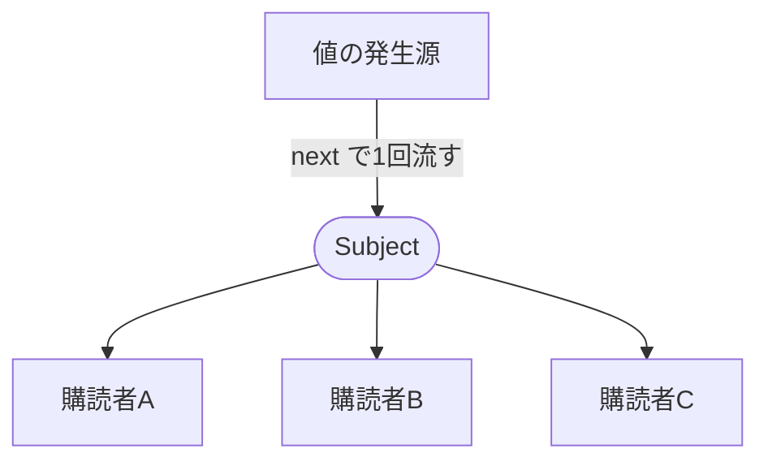
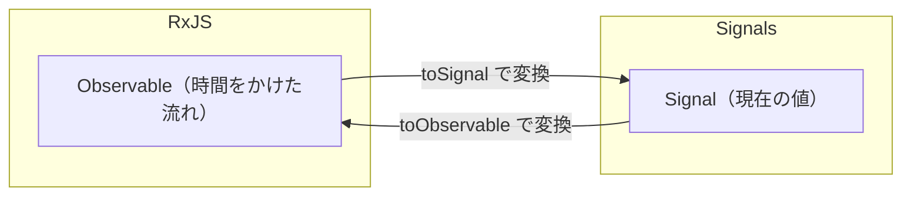

この章では、RxJSをさらに実践的に扱います。値を流し込めるSubject、RxJSとSignalの共存、そしてRouter・状態管理と組み合わせた設計を学びます。

:::message
**この章で学ぶこと**

- Subjectの二重の性質
- BehaviorSubjectとReplaySubjectの違い
- RxJSとSignalの得意分野の違い
- `toSignal()`でObservableをSignalに変換する
- URLの変化に応じたデータ取得の流れ
- RouterのパラメーターとRxJSの組み合わせ
:::

## Subject・BehaviorSubject・ReplaySubject

これまで扱ってきたObservableは、値を「流してくる」側でした。私たちは、それを`subscribe`して受け取るだけでした。しかしときには、自分の好きなタイミングで値を「流し込みたい」こともあります。それを可能にするのが、Subject（サブジェクト）です。

Subjectは、Observableでありながら、同時に値を流し込めるという、二重の性質を持ちます。この性質から、複数の購読者へ同じ値を配る「放送局」のような使い方や、Component間で状態を共有する仕組みの土台として使われてきました。この節では、Subjectと、その性質を少しずつ変えた仲間たち（BehaviorSubject・ReplaySubject）を学びます。あわせて、モダンAngularでこれらがSignalとどう関係するのかにも触れます。

### Subjectとは

Subjectは、ObservableとObserverの両方の性質を持つ、特別なオブジェクトです。Observableとして`subscribe`できると同時に、Observerとして`next`で値を流し込めます。

```ts
import { Subject } from 'rxjs';

const subject = new Subject<string>();

// 購読する（Observableとして）
subject.subscribe((value) => console.log('受信:', value));

// 値を流し込む（Observerとして）
subject.next('こんにちは');
subject.next('さようなら');
```

`subject.next('こんにちは')`と、外から値を流し込めるのが、通常のObservableとの違いです。`interval`のようなObservableは、値をいつ流すかをObservable自身が決めていました。Subjectは、私たちが好きなタイミングで値を流せます。

もうひとつの重要な性質が、マルチキャストです。ひとつのSubjectを複数の購読者が`subscribe`すると、`next`で流した値は、すべての購読者に同時に届きます。放送局が電波を流し、複数の受信機がそれを受け取るイメージです。この性質から、Subjectは「複数の場所へ、同じ出来事を知らせる」用途に向きます。

次の図は、ひとつのSubjectに`next`で流し込んだ1つの値が、購読しているすべての購読者へ同時に配られる様子を表します。購読ごとに独立して実行される通常のObservableと違い、値の発生源が1つに束ねられているのがSubjectの特徴です。



### BehaviorSubject

Subjectには、いくつかの派生があります。もっともよく使うのが、BehaviorSubjectです。

通常のSubjectには、弱点があります。値を流した後で購読を始めた購読者は、それ以前に流れた値を受け取れません。放送に途中から参加しても、それまでの内容は聞けない、というわけです。しかし多くの場面では、「いま現在の値」を、後から参加した購読者にも渡したいものです。

BehaviorSubjectは、この課題を解決します。「現在の値」をひとつ保持し、新しく購読した人には、まずその現在の値を即座に渡します。初期値が必須なのも、この性質のためです。

```ts
import { BehaviorSubject } from 'rxjs';

const count = new BehaviorSubject<number>(0); // 初期値0

count.next(5);

// 後から購読しても、現在の値5を受け取れる
count.subscribe((value) => console.log('現在値:', value)); // 5

// 現在の値を、その場で取り出すこともできる
console.log(count.value); // 5
```

BehaviorSubjectは「現在の値を持つストリーム」なので、状態の保持にうってつけです。[『ServiceとDependency Injection』の章](./10-service-and-di)で触れた「状態を持つService」の実装として、長らくこのBehaviorSubjectが使われてきました。Serviceの中でBehaviorSubjectに状態を保持し、Componentがそれを購読する、という形です。

### ReplaySubjectとAsyncSubject

もうひとつの派生が、ReplaySubjectです。これは、過去に流した値を、指定した個数だけ記憶しておき、新しい購読者に再生（replay）します。

```ts
import { ReplaySubject } from 'rxjs';

const recent = new ReplaySubject<string>(2); // 直近2件を記憶

recent.next('A');
recent.next('B');
recent.next('C');

// 後から購読すると、直近2件（B, C）を受け取れる
recent.subscribe((value) => console.log(value)); // B, C
```

BehaviorSubjectが「現在の1つ」を渡すのに対し、ReplaySubjectは「直近の複数」を渡せます。履歴を少し遡って伝えたいときに使います。

さらに、AsyncSubjectという派生もあります。これは、完了（complete）したときに、最後の値だけを購読者に渡します。使う場面は限られますが、「最終結果だけが必要」なときに用います。まとめると、Subjectの仲間は「いつ、どの値を、購読者に渡すか」の振る舞いが少しずつ違う、と理解すればよいでしょう。実務でよく使うのは`Subject`と`BehaviorSubject`の2つで、残りは「そういうものもある」と知っておけば十分です。とくに状態を扱うなら`BehaviorSubject`、単なる通知なら`Subject`、という選び方が基本になります。

| 種類 | 新しい購読者に渡すもの |
|---|---|
| `Subject` | 購読後に流れた値のみ |
| `BehaviorSubject` | 現在の値（初期値が必須） |
| `ReplaySubject` | 記憶した直近N件 |
| `AsyncSubject` | 完了時の最後の値のみ |

### Subjectの使いどころ

Subjectは、おもに2つの用途で使われてきました。

ひとつは、**Component間のイベント伝達**です。[『データフローとinput()・output()』の章](./08-data-flow-io)で、親子を越えた通信にはServiceが要ると述べました。Serviceの中にSubjectを持ち、あるComponentが`next`でイベントを流し、別のComponentがそれを購読する、という形で、離れたComponent間の連絡ができます。「通知」を配る用途です。

もうひとつは、**状態の共有**です。BehaviorSubjectに状態を保持し、複数のComponentがその状態を購読して、同じ値を共有します。これが、[『状態管理の基礎』の章](./20-state-management-basics)で扱うStore Serviceの、古典的な実装でした。具体的には、次のような形です。

```ts:src/app/cart.ts（BehaviorSubjectによるStore Service）
@Injectable({ providedIn: 'root' })
export class CartService {
  // 外へは読み取り専用のObservableとして公開する
  private readonly itemsSubject = new BehaviorSubject<Item[]>([]);
  readonly items$ = this.itemsSubject.asObservable();

  add(item: Item): void {
    const current = this.itemsSubject.value;
    this.itemsSubject.next([...current, item]); // 新しい配列に差し替える
  }
}
```

ここで重要なのが、`asObservable()`です。`itemsSubject`そのものを外へ公開すると、どのComponentからでも`next`で値を流し込めてしまい、状態の変更経路がばらばらになります。`asObservable()`で読み取り専用にして公開すれば、状態を変えられるのは`CartService`の`add`のようなメソッドだけに限定できます。変更の窓口を絞ることが、状態を追いやすく保つ鍵です。Componentは`items$`を`async`パイプで購読し、`add`を呼んで変更を依頼します。単方向データフロー（『データフローとinput()・output()』の章）の考え方が、状態管理にも通じているのがわかります。

### SignalとBehaviorSubjectの関係

ここで、[『SignalsとZoneless』の章](./13-signals-and-zoneless)で学んだSignalを思い出してください。「現在の値を持ち、変化を購読者に伝える」というBehaviorSubjectの役割は、Signalの役割とよく似ています。実際、モダンAngularでは、状態の保持という用途において、BehaviorSubjectをSignalで置き換えられる場面が多くあります。

```ts:BehaviorSubjectによる状態（旧）
private readonly count$ = new BehaviorSubject(0);
```

```ts:Signalによる状態（モダン）
private readonly count = signal(0);
```

どちらも「現在の値を持ち、変化を伝える」点で共通します。Signalのほうが、テンプレートでの読み取りが簡潔で、購読解除の心配もありません。そのため、単純な状態の保持なら、Signalが第一の選択肢になりつつあります。

ただし、RxJSが不要になるわけではありません。`debounceTime`や`switchMap`のような、時間的な制御や非同期の合成は、依然としてRxJSの得意分野です。「現在の値の保持」はSignal、「複雑な非同期の流れ」はRxJS、という役割分担が、モダンAngularの姿です。この共存については、この章の次の節で詳しく扱います。

### Subject・BehaviorSubject・ReplaySubjectでよくあるつまずき

- **通常のSubjectで現在値を期待する**: 通常の`Subject`は、購読前に流れた値を渡しません。現在の値が必要なら`BehaviorSubject`を使います。
- **Subjectを無闇に公開する**: Serviceの外へSubjectをそのまま公開すると、どこからでも`next`で値を流せてしまい、流れの出どころが追えなくなります。外へは`asObservable()`で読み取り専用にして渡すのが安全です。
- **何でもSubjectで状態管理する**: 単純な状態の保持は、Signalのほうが簡潔で安全な場面が増えています。まずSignalで足りないかを考えます。
- **`BehaviorSubject`の`value`に頼りすぎる**: `value`で現在値を同期的に取り出せますが、これに頼った命令的なコードが増えると、リアクティブに書く利点が薄れます。購読や`async`パイプ、あるいはSignalで、変化に反応する形を基本にします。

## RxJSとSignalsの共存

ここまで、RxJSのObservableと、『SignalsとZoneless』の章で学んだSignalという2つのリアクティブな仕組みを学んできました。どちらも「値の変化に反応する」という点で似ていますが、得意分野が異なります。モダンAngularでは、この2つを対立するものとしてどちらか一方を選ぶのではなく、それぞれの強みを活かして共存させます。

この節では、RxJSとSignalをつなぐ橋渡しの仕組みと、どちらをどの場面で使うべきかの指針を学びます。橋渡しには、Angularがrxjs-interopとして提供する`toSignal()`と`toObservable()`を使います。この2つを理解すれば、既存のRxJSベースのコードと、新しいSignalベースのコードを、無理なく組み合わせられるようになります。

次の図は、この橋渡しの全体像を表します。左のRxJS（時間をかけた非同期の流れ）と、右のSignals（現在の値）を、`toSignal()`と`toObservable()`が双方向につないでいます。



### RxJSとSignalの得意分野

まず、2つの仕組みの違いを整理します。似ているようで、主眼が異なります。

Signalは、「現在の値」を扱うのが得意です。いつ読んでも、その時点の値が同期的に得られます。テンプレートとの相性がよく、変更検知とも直結しています（『SignalsとZoneless』の章）。状態を保持し、それをUIに反映する、という用途に向いています。読み取りが同期的で、購読の解除も要らず、扱いが単純です。

RxJSは、「時間をかけて流れる値」を扱うのが得意です。値がいつ、どの順で流れるかという時間的な側面を、細かく制御できます。`debounceTime`で待ち、`switchMap`で切り替え、`catchError`で回復する、といった非同期の複雑な流れは、RxJSの独壇場です。その代わり、購読の管理が必要で、現在の値を同期的に取り出すのは苦手です。

| 観点 | Signal | RxJS（Observable） |
|---|---|---|
| 主眼 | 現在の値 | 時間をかけた値の流れ |
| 読み取り | 同期的（`()`で即座に） | 購読が必要 |
| 得意 | 状態の保持・UI反映 | 非同期の合成・時間制御 |
| 後始末 | 不要 | 購読解除が必要 |

この違いから、「状態はSignal、非同期の流れはRxJS」という役割分担が自然に導かれます。そして、その境界をまたぐための橋が、これから学ぶ変換関数です。

### toSignalでObservableをSignalに変換する

`toSignal()`は、ObservableをSignalに変換します。RxJSで組み立てた非同期の流れの結果を、Signalとして受け取り、テンプレートで扱いやすくする、という使い方が典型です。Angular 16で導入され、v17で安定版になりました。

```ts:src/app/clock.ts
import { Component } from '@angular/core';
import { toSignal } from '@angular/core/rxjs-interop';
import { interval, map } from 'rxjs';

@Component({
  selector: 'app-clock',
  template: `<p>経過秒数: {{ seconds() }}</p>`,
})
export class Clock {
  // Observableを、初期値0のSignalに変換
  protected readonly seconds = toSignal(interval(1000), { initialValue: 0 });
}
```

`toSignal(interval(1000))`で、1秒ごとに値を流すObservableを、Signalに変えています。テンプレートでは`seconds()`と、ふつうのSignalとして読めます。`toSignal()`の利点は2つあります。ひとつは、テンプレートで`async`パイプを使わずに、Signalとして直接読めること。もうひとつは、購読の解除を自動でやってくれることです。Componentが破棄されると、内部の購読も解除されます。`initialValue`は、Observableが最初の値を流す前の値を指定するオプションです。

HTTP通信の結果を`toSignal()`でSignalにすれば、RxJSベースの通信と、Signalベースの画面を、きれいにつなげます。[『HTTP通信』の章](./19-http)でも、この組み合わせが登場します。

`toSignal()`には、いくつかのオプションがあります。`initialValue`のほかに、`requireSync`は、`BehaviorSubject`のように購読と同時に値を流すObservableに対して、初期値なしでも同期的に値を得られるようにするものです。同期的に必ず値があるとわかっているなら、これを使うと`undefined`を扱わずに済みます。これらのオプションは、変換元のObservableの性質に応じて選びます。多くの場合は`initialValue`を指定しておけば十分です。

`async`パイプに慣れていると戸惑いやすい点も、いくつかあります。

- **購読は呼び出した瞬間に始まります**: `async`パイプがテンプレートに現れて初めて購読するのに対し、`toSignal()`は呼び出した時点ですぐに購読を始めます（eager）。フィールドの初期化で一度だけ実行される、と考えるとよいでしょう。
- **エラーはSignalを読んだときに投げられます**: 変換元のObservableがエラーで終わると、そのエラーは`seconds()`のようにSignalを読んだ瞬間に投げられます。画面でエラーを扱いたいなら、変換する前に`catchError`で捕まえておきます。
- **injection contextの外では`injector`が必要です**: `toSignal()`は購読解除をそのContextの破棄に結びつけるため、原則としてComponentのフィールド初期化やコンストラクターなど、injection context内で呼びます。それ以外の場所で使うときは、`injector`オプションでInjectorを明示的に渡します。
- **購読はInjectorが破棄されるまで生きます**: 自動で解除されるのは、属するInjector（多くはComponent）が破棄されたときです。この寿命の感覚は、`takeUntilDestroyed()`と同じだと考えてください。

### toObservableでSignalをObservableに変換する

逆方向の変換が、`toObservable()`です。SignalをObservableに変換します。Signalで持っている状態を、RxJSの強力なOperatorで加工したいときに使います。

```ts:src/app/search.ts
import { Component, signal } from '@angular/core';
import { toObservable, toSignal } from '@angular/core/rxjs-interop';
import { debounceTime, distinctUntilChanged, switchMap } from 'rxjs';

@Component({ selector: 'app-search', template: `...` })
export class Search {
  protected readonly query = signal('');

  // Signalを Observable にして、RxJSで加工し、再びSignalに戻す
  private readonly query$ = toObservable(this.query);
  protected readonly results = toSignal(
    this.query$.pipe(
      debounceTime(300),
      distinctUntilChanged(),
      switchMap((q) => this.api.search(q)),
    ),
    { initialValue: [] },
  );
}
```

この例は、検索の実装です。検索語を`query`というSignalで持ち、`toObservable()`でObservableに変換します。そこに、前節で学んだ`debounceTime`・`distinctUntilChanged`・`switchMap`を適用して、無駄のない検索の流れを作ります。最後に`toSignal()`で結果を再びSignalに戻し、テンプレートで表示します。

ここに、共存の理想的な形が表れています。入力と結果という「状態」はSignalで持ち、その間の「時間制御と非同期合成」はRxJSに任せる。両者の境界を`toObservable()`と`toSignal()`が橋渡ししています。Signalの手軽さと、RxJSの表現力を、同時に得られるのです。

### toObservableが値を流すタイミング

`toObservable()`にも、おさえておきたい癖があります。値の発行が**非同期**である点です。内部ではeffectがSignalの変化を追いかけ、そのeffectが実行されたときに現在の値を流します。effectは同期処理が一段落してから動くため、同じ流れの中でSignalを続けて`set()`すると、途中の値はスキップされ、最後の値だけがObservableに届きます。

```ts
const count = signal(0);
const count$ = toObservable(count);
count$.subscribe((v) => console.log(v));

count.set(1);
count.set(2);
count.set(3);
// 出力されるのは 3 だけ（途中の 1・2 は流れない）
```

`set()`のたびに1回ずつ値を流したい、という用途には向きません。`toObservable()`は「現在の値が変わったことを、非同期の流れへ橋渡しする」道具であり、すべての中間状態を漏れなく届けるものではない、と理解しておきます。

### どちらを使うべきか

では、実際の開発で、どちらを選べばよいのでしょうか。判断の指針を示します。

- **状態を持ち、UIに表示する**: Signalを使います。Componentの状態、Serviceが保持する状態は、Signalが第一の選択肢です。
- **単純な非同期（1回の通信など）**: Signalへの変換（`toSignal()`）や、`async`パイプで素直に扱えます。
- **複雑な非同期（入力制御・連鎖・キャンセル）**: RxJSを使います。`debounceTime`や`switchMap`が必要な場面は、RxJSの出番です。
- **既存のRxJSベースのAPI**: HttpClientやForms、Routerが返すObservableは、そのまま使うか、`toSignal()`でSignalに変換して扱います。

本書が推奨するのは、「状態管理の中心はSignalに寄せ、RxJSは非同期の流れの制御に用いる」という方針です。かつてはRxJSが状態管理まで広く担っていましたが、Signalの登場で、その役割分担が整理されました。RxJSを捨てるのではなく、その得意分野に集中させる、と考えてください。

### RxJSはこれからも必要か

Signalが状態管理の主役になると、「RxJSはもう不要では」と思うかもしれません。しかし、そうではありません。RxJSは、Signalには置き換えられない領域を持っています。

複数の非同期処理を合成する、値の流れを時間的に制御する、キャンセルや再試行を扱う。こうした「イベントの流れ」を宣言的に組み立てる力は、依然としてRxJSにしかありません。また、HttpClientやRouter、Formsといったフレームワークの機能が、Observableを返す以上、RxJSの理解は欠かせません。Signalとの共存を前提に、RxJSは今後もAngular開発の重要な柱であり続けます。[『Angularとは何か』の章](./02-angular-intro)で述べた「新旧を対立させない」姿勢は、ここでも当てはまります。新しいSignalと既存のRxJSは、競合ではなく分担の関係にあるのです。

### RxJSとSignalsの共存でよくあるつまずき

- **何でもRxJSで書こうとする**: 単純な状態の保持までObservableで書くと、購読管理が増え、コードが複雑になります。状態はSignalに寄せ、RxJSは非同期の流れに絞ります。
- **何でもSignalで書こうとする**: 逆に、`debounceTime`や`switchMap`が必要な処理を、Signalと`effect()`で無理に書こうとすると、かえって煩雑になります。時間的な制御は、素直にRxJSを使います。
- **`toSignal()`の初期値を忘れる**: 非同期のObservableを`toSignal()`する際、`initialValue`を指定しないと、最初の値が来るまで`undefined`になります。テンプレート側でその状態を考慮するか、初期値を与えます。
- **変換を過剰に往復させる**: `toObservable()`と`toSignal()`を無闇に何度も往復させると、流れが追いにくくなります。境界は必要な箇所に絞り、変換の回数を最小限にします。

## RouterとRxJS・Signals・状態管理

この章の締めくくりとして、これまで学んできた要素を組み合わせた、実践的な設計を扱います。Router、RxJS、Signals、そしてService。これらは、実際のアプリケーションでは単独ではなく、連携して働きます。この節では、それらがどう噛み合うのかを、具体的な場面を通して確認します。

とくに焦点を当てるのは、「URLの変化に応じてデータを取得し、画面に反映する」という、どのアプリにも現れる基本的な流れです。ここには、Routerのパラメーター、RxJSの非同期合成、Signalによる状態保持が、すべて登場します。この一連の流れを設計できるようになることが、この章の到達点のひとつです。次に控える『状態管理の基礎』の章で状態管理を本格的に学ぶ前の、橋渡しにあたります。

### 典型的な流れ — URLからデータへ

多くのアプリに共通する流れを考えます。「商品詳細ページ（`/products/:id`）を開くと、その商品のデータを取得して表示する」というものです。この流れには、いくつもの要素が関わります。

1. URLの`:id`が決まる、または変わる（Router）
2. その`id`をもとに、サーバーへデータを要求する（RxJS・HttpClient）
3. 取得したデータを、画面に表示する（Signal）

[『Routerの基礎』の章](./14-router-basics)で、`withComponentInputBinding()`により、`:id`が`input()`に結びつくことを学びました。ここに、RxJSとSignalを組み合わせると、URLの変化に追従してデータを取得する流れを、宣言的に書けます。

### Signal入力を起点に組み立てる

もっともモダンな書き方は、ルートパラメーターの`input()`（Signal）を起点にすることです。`id`が変わったら、それに応じてデータを取得し直したい。この「変化に応じて」を、`toObservable()`と`switchMap`で表現します。

```ts:src/app/product-detail.ts
import { Component, inject, input } from '@angular/core';
import { toObservable, toSignal } from '@angular/core/rxjs-interop';
import { switchMap } from 'rxjs';
import { ProductService } from './product';

@Component({
  selector: 'app-product-detail',
  template: `
    @if (product(); as p) {
      <h1>{{ p.name }}</h1>
    } @else {
      <p>読み込み中</p>
    }
  `,
})
export class ProductDetail {
  private readonly service = inject(ProductService);

  readonly id = input.required<string>(); // URLの :id が結びつく

  protected readonly product = toSignal(
    toObservable(this.id).pipe(
      switchMap((id) => this.service.findById(id)),
    ),
  );
}
```

流れを追ってみましょう。URLが`/products/42`なら、`id`は`'42'`になります。`toObservable(this.id)`が、この`id`の変化をObservableにします。`switchMap`が、`id`ごとにデータ取得を行い、`id`が変われば前の取得を打ち切って新しい取得に切り替えます。最後に`toSignal()`が、結果を`product`というSignalに変え、テンプレートで表示します。

`/products/42`から`/products/99`へ移ったときも、この流れが自動で働きます。`id`が変わり、`switchMap`が古い通信を打ち切って新しい通信を始め、`product`が更新されます。Router・RxJS・Signalが、それぞれの役割を果たしながら、ひとつの流れとして噛み合っているのがわかります。

ただし、切り替えの瞬間には落とし穴があります。`id`が変わってから新しいデータが届くまでの間、`product()`は**前の商品の値を保持したまま**になります。`toSignal()`は最後に流れた値を覚えているため、`/products/42`から`/products/99`へ移った直後は、99のデータが届くまで42の内容が画面に残り、`@else`の読み込み表示には切り替わりません。

この間を「読み込み中」に見せたいなら、`id`が変わった時点でいったん値を空に戻します。`switchMap`の内側で`startWith(undefined)`を挟むと、切り替えのたびにまず`undefined`を流し、続けて新しいデータを流せます。

```ts
protected readonly product = toSignal(
  toObservable(this.id).pipe(
    switchMap((id) =>
      this.service.findById(id).pipe(startWith(undefined)),
    ),
  ),
);
```

これで`id`が変わるたびに`product()`が一度`undefined`に戻り、テンプレートは`@else`側の読み込み表示に切り替わります。新しいデータが届けば、また`@if`側の表示に戻ります。

なお、この「URLの変化をきっかけにデータを取得する」流れは頻出するため、Angular自身も専用の仕組みを用意しつつあります。v19で導入された`resource()`と、そのHTTP版の`httpResource()`は、Signalで表した入力（ここでは`id`）が変わると自動でデータを取得し直し、結果・読み込み中・エラーといった状態をまとめて扱えるAPIです。v22世代では実用に使える段階まで成熟してきました。`toObservable()`と`switchMap`で手組みしていた部分を、より宣言的に置き換えられる場面が増えています。詳しくは『HTTP通信』の章で扱います。ここでは、その下地となる考え方として、Router・RxJS・Signalの連携を理解しておけば十分です。

### 各要素の役割分担

この設計を、役割の視点で整理します。ひとつの流れの中で、各技術が担っている部分が明確に分かれています。

- **Router**: URLと`:id`を管理し、`withComponentInputBinding()`で`input()`に橋渡しする
- **Signal入力**: URLの現在の`id`を、Componentの状態として保持する
- **RxJS**: `id`の変化をきっかけに、非同期のデータ取得を制御する（`switchMap`による切り替え）
- **Signal（結果）**: 取得したデータを、テンプレートで扱いやすい形で保持する

前の節で述べた「状態はSignal、非同期はRxJS」という分担が、ここでも貫かれています。URLという入力も、データという結果も、Signalとして扱い、その間の非同期の制御だけをRxJSに任せています。この一貫した方針が、コードの見通しを保ちます。

### Routerのイベントを扱う

Routerは、パラメーター以外にも、遷移に関するさまざまな情報をObservableで提供します。`Router`の`events`は、遷移の開始や完了といった出来事を流すObservableです。これを購読すると、「ページ遷移のたびに何かをする」といった処理が書けます。

```ts:src/app/analytics.ts
import { Injectable, inject } from '@angular/core';
import { Router, NavigationEnd } from '@angular/router';
import { filter } from 'rxjs';
import { takeUntilDestroyed } from '@angular/core/rxjs-interop';

@Injectable({ providedIn: 'root' })
export class Analytics {
  private readonly router = inject(Router);

  constructor() {
    this.router.events
      .pipe(
        filter((e) => e instanceof NavigationEnd), // 遷移完了だけに絞る
        takeUntilDestroyed(),
      )
      .subscribe(() => {
        // ページ遷移が完了するたびの処理（アクセス記録など）
      });
  }
}
```

ここでも、これまで学んだ道具が総動員されています。`Router.events`というObservableを、`filter`で遷移完了（`NavigationEnd`）だけに絞り、`takeUntilDestroyed()`で購読解除を自動化しています。RxJSのOperatorとinteropが、Routerのイベント処理を簡潔にしているのです。

このクラスに`@Injectable({ providedIn: 'root' })`が付いている点が重要です。`inject()`と`takeUntilDestroyed()`は、どちらもinjection context（Angularが依存を解決できる文脈）でしか呼び出せません。Serviceのコンストラクターはこのinjection contextにあたるため、そこでの`inject()`や購読が成立します。デコレーターのない素のクラスをどこかで`new`しただけでは、この文脈が存在せず、`inject()`も`takeUntilDestroyed()`も実行時にエラーになります。

もうひとつ意識したいのが、いつこのコンストラクターが動くかです。`providedIn: 'root'`のServiceは、どこかで初めて注入された時点で生成されます。アプリ起動と同時に記録を始めたいなら、ルートのComponentで`inject(Analytics)`を一度呼ぶなどして、生成のきっかけを用意します。いったん生成されれば、コンストラクターで張った購読が、`takeUntilDestroyed()`によってこのService（ルート提供なのでアプリ）が破棄されるまで、遷移イベントを拾い続けます。

### 状態管理へのつながり

この節で見たのは、ひとつのComponentの中で完結する範囲の連携でした。しかし、アプリが大きくなると、状態は複数のComponentにまたがり、より本格的な管理が必要になります。「取得した商品データを、詳細ページとカートページで共有したい」といった要求です。

こうした、Componentを越えた状態の管理は、『状態管理の基礎』の章の主題です。そこでは、この節で使ったSignalやRxJSを土台に、Store Serviceや、NgRxといった、より大規模な状態管理の仕組みを扱います。この節で学んだ「Router・RxJS・Signalの連携」は、その状態管理の基礎体力になります。個々の技術がどう噛み合うかを理解していれば、大規模な仕組みも、その延長として捉えられます。

### Serviceに状態を集約する

ひとつのComponentで完結しない例として、一覧ページと詳細ページで、選択中の商品を共有する場面を考えます。この場合、状態をComponentではなく、Serviceに置きます。『ServiceとDependency Injection』の章で学んだ「状態を持つService」を、Signalで実装します。

```ts:src/app/product-store.ts
import { Injectable, computed, inject, signal } from '@angular/core';
import { ProductService } from './product';

@Injectable({ providedIn: 'root' })
export class ProductStore {
  private readonly selectedId = signal<string | null>(null);
  private readonly service = inject(ProductService);

  // 選択中の商品を、派生状態として公開する
  readonly selected = computed(() => {
    const id = this.selectedId();
    return id ? this.service.findByIdSync(id) : null;
  });

  select(id: string): void {
    this.selectedId.set(id);
  }
}
```

一覧ページで`select`を呼べば、詳細ページの`selected`も自動で更新されます。両ページが同じ`ProductStore`のインスタンス（`providedIn: 'root'`により単一）を共有しているためです。ここでも、状態はSignal、というモダンAngularの方針が貫かれています。かつてBehaviorSubjectで書いていたこうしたStore Serviceが、Signalによってより簡潔に書けるようになりました。この発想を発展させたものが、『状態管理の基礎』の章で学ぶ状態管理です。

ひとつ補足すると、`computed()`が再計算されるのは、その中で読んでいるSignalが変わったときだけです。この例では`selectedId()`を読んでいるので、`select()`でIDを変えれば`selected`も更新されます。一方、`findByIdSync()`が返すデータそのものが後から変わっても、それがSignalでない限り`selected`は追従しません。`computed()`の中で頼れるのは、同期的に取得できてSignalとして保持しているデータに限られる、と考えてください。サーバーから非同期に取得するデータを扱うなら、前の節の`toSignal()`のように、非同期の結果そのものをSignalにしておく必要があります。

### RouterとRxJS・Signals・状態管理でよくあるつまずき

- **Component間の共有を`input`／`output`で無理につなぐ**: 離れたページ間の状態共有を、バケツリレーで実現しようとすると破綻します。共有したい状態は、Serviceに置くのが基本です。
- **URLに表すべき状態をComponentに閉じ込める**: 「どの商品を見ているか」のような、共有・復元したい状態は、Componentの内部ではなくURLで表すと、ブックマークや戻る操作と自然に噛み合います。
- **非同期の合成を手続き的に書く**: URLの変化に応じた取得を、`subscribe`のネストで書くと追いにくくなります。`toObservable()`と`switchMap`で、宣言的な流れとして組み立てます。

### ここまでの集大成としての位置づけ

この節は、Signals・RxJS・Routerを扱ってきた各章の集大成にあたります。Signal（状態）、RxJS（非同期）、Router（URL）という3つの柱が、実際のアプリケーションではひとつの流れとして協調することを見てきました。それぞれを個別に学んだときには見えなかった、技術どうしのつながりが、具体的なコードを通して立ち上がってきたはずです。この「組み合わせて設計する」感覚こそ、中級から上級へ進むうえで欠かせないものです。

## まとめ

- Subjectは、Observableでありながら`next`で値を流し込める二重の性質を持ちます
- 複数の購読者へ同時に値を配るマルチキャストが特徴です
- BehaviorSubjectは現在の値を保持し、ReplaySubjectは直近N件を再生します
- Signalは現在の値の保持に、RxJSは時間をかけた非同期の流れに強みがあります
- `toSignal()`はObservableをSignalに変換し、購読解除も自動化します
- `toObservable()`はSignalをObservableに変換し、RxJSのOperatorで加工できます
- 「URLの変化に応じてデータを取得し表示する」流れは、多くのアプリに共通します
- ルートパラメーターの`input()`を起点に、`toObservable()`と`switchMap`で組み立てられます
- Routerが橋渡し、RxJSが非同期制御、Signalが状態保持、と役割が分かれます

次章からは、入力を扱うFormsと、サーバーと通信するHTTPに進みます。
