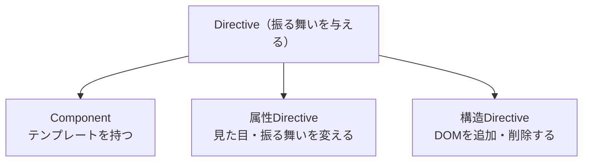

ここまで、Componentを中心にAngularを見てきました。しかしAngularには、Componentと並ぶもうひとつの重要な部品があります。それがDirective（ディレクティブ）です。前章で使った`@if`や`@for`、そして`[class.active]`のようなバインディングの背後にも、実はDirectiveの考え方が関わっています。

Directiveは、要素に振る舞いを付け加える仕組みです。Componentが「見た目と振る舞いを持つ独立した部品」であるのに対し、Directiveは「既存の要素を拡張する」役割を担います。この章では、Directiveとは何か、どのような種類があるのか、そしてComponentとの関係を整理します。次章以降で自作のDirectiveを作る前の、全体像をつかむ回です。

:::message
**この章で学ぶこと**

- Directiveが何をするものか
- Directiveの3つの種類
- 組み込みDirectiveの例
- ComponentとDirectiveの関係
:::

## Directiveとは何か

Directiveは、HTML要素やComponentに対して、追加の振る舞いを与えるクラスです。たとえば「この要素にマウスが乗ったら色を変える」「条件が偽なら要素を消す」といった処理を、要素に付ける属性やタグの形で表現します。

Componentとの違いを、ひとことで言えば「自前のテンプレートを持つかどうか」です。Componentは、`<app-greeting>`のように、自分のテンプレートを持つ独立した部品でした。一方Directiveは、自前のテンプレートを持たず、すでにある要素に振る舞いだけを足します。既存の`<p>`や`<button>`に機能を追加する、いわば装飾者のような存在です。

## Directiveの3つの種類

Angularのディレクティブは、大きく3種類に分けられます。

| 種類 | 役割 | 例 |
|---|---|---|
| Component | テンプレートを持つ部品 | `<app-greeting>` |
| 属性Directive | 要素の見た目や振る舞いを変える | `[appHighlight]` |
| 構造Directive | DOM要素を追加・削除する | 旧`*ngIf`・`*ngFor` |

意外に思うかもしれませんが、**ComponentもDirectiveの一種**です。Componentは「テンプレートを持つ特別なDirective」と位置づけられています。実際、`@Component`は`@Directive`を土台に、テンプレートを扱う機能を足したものです。このため、Componentで学んだセレクターやライフサイクル、`input()`といった仕組みは、Directiveでもそのまま通用します。この関係を図にすると、次のようになります。



Directiveという大きな枠の中に、Componentが特別な一種として含まれる、という関係です。残りの2つ、属性Directiveと構造Directiveが、狭い意味での「Directive」です。この章では、この2種類の概観を押さえます。

## 属性Directive

属性Directiveは、既存の要素に付けて、その見た目や振る舞いを変えます。要素の属性のような形で書くため、「属性」Directiveと呼ばれます。

身近な例が、Angularに組み込まれている`ngClass`と`ngStyle`です。これらは、クラスやスタイルを動的に切り替えるためのDirectiveです。

```html
<!-- ngClass: 条件に応じて複数のクラスを付ける -->
<div [ngClass]="{ active: isActive(), disabled: isDisabled() }">...</div>

<!-- ngStyle: 複数のスタイルをまとめて指定する -->
<div [ngStyle]="{ color: textColor(), fontSize: size() + 'px' }">...</div>
```

もっとも、前章と前々章で見た`[class.active]`や`[style.color]`を使えば、単純な切り替えは`ngClass`・`ngStyle`なしでも書けます。複数のクラスやスタイルをオブジェクトでまとめて扱いたいときに、これらのDirectiveが選択肢になります。

属性Directiveは、自分で作ることもできます。「マウスが乗ったら背景色を変える」「クリックで折りたたむ」といった、要素への振る舞いの追加は、自作の属性Directiveで実現します。その具体的な作り方は、次の第14章で扱います。

## 構造Directive

構造Directiveは、DOMの構造そのものを変えます。つまり、要素を追加したり削除したりします。名前のとおり、画面の「構造」を操作するDirectiveです。

もっとも有名な構造Directiveが、旧来の`*ngIf`と`*ngFor`でした。前章で学んだとおり、これらは現在では`@if`・`@for`という組み込み制御フローに置き換わっています。

```html
<!-- 旧来の構造Directive -->
<p *ngIf="isVisible()">表示される段落</p>
```

先頭の`*`が、構造Directiveの目印です。この`*`記法は、実は`ng-template`という仕組みの短縮形です。構造Directiveは、条件に応じてテンプレートの断片をDOMに差し込んだり、取り除いたりしています。この仕組みと、自作の構造Directiveの作り方は、第15章で詳しく扱います。

ここで、要素をCSSで隠す方法との違いを押さえておきましょう。`[hidden]`や`display: none`は、要素をDOMに残したまま、見えなくするだけです。一方、構造Directiveや`@if`は、要素そのものをDOMから取り除きます。取り除かれた要素は、内部のComponentも破棄され、処理も止まります。頻繁に切り替わる表示はCSSで隠すほうが軽く、めったに表示しない重い部分はDOMごと消すほうが有利、という使い分けがあります。構造Directiveが「構造」を変えるとは、こういうことです。

現在では、条件分岐や繰り返しといった典型的な用途は、組み込み制御フローが担うようになりました。そのため、構造Directiveを自作する機会は以前より減っています。とはいえ、その仕組みを理解しておくと、`ng-template`を使った高度なテンプレート操作や、既存コードの読解に役立ちます。

## ComponentとDirectiveの使い分け

自分で部品を作るとき、Componentにすべきか、Directiveにすべきか迷うことがあります。判断の目安は、「独自の見た目（テンプレート）を持たせたいか」です。

- **Componentを選ぶ**: 新しいUIのまとまりを作りたいとき。ボタン、カード、フォームなど、テンプレートを伴う部品。
- **Directiveを選ぶ**: 既存の要素やComponentに、振る舞いだけを足したいとき。ツールチップ、ドラッグ操作、権限に応じた表示制御など。

たとえば「ボタンにローディング表示を足したい」場合を考えます。ボタン自体を新しく作り直すならComponentですが、既存のあらゆるボタンに後付けで機能を足したいなら、属性Directiveのほうが柔軟です。Directiveは、対象の要素を選ばずに振る舞いを付けられる点が強みです。

具体的な例で比べてみます。「入力欄に自動でフォーカスを当てる」機能を考えます。これをComponentで作ると、`<app-auto-focus-input>`のように専用のタグが必要になり、既存の`<input>`を置き換えることになります。一方、Directiveで作れば、次のようにどんな入力欄にも属性を足すだけで機能します。

```html
<!-- 既存のinputに、属性を1つ足すだけ -->
<input appAutoFocus placeholder="名前" />
<input appAutoFocus type="email" placeholder="メール" />
```

要素の種類を問わず、後付けで振る舞いを差し込めるのが、Directiveならではの利点です。見た目のまとまりを作るのはComponent、既存要素の拡張はDirective、という役割分担を意識してください。

## 組み込みDirectiveと自作Directive

ここまで見てきたように、Angularには`ngClass`・`ngStyle`のような組み込みDirectiveが用意されています。これらは日常的に使う便利な道具です。一方で、アプリケーション固有の振る舞いは、自作のDirectiveとして切り出せます。

Directiveを自作する利点は、Component間で共通する振る舞いを、1か所にまとめて再利用できることです。「フォーカス時に枠を光らせる」「外側をクリックしたら閉じる」といった処理を、複数のComponentに書き散らす代わりに、1つのDirectiveにまとめられます。これは、第10章で学んだ「関心事を分けて再利用する」という設計の考え方を、振る舞いのレベルで実践するものです。

なお、`ngClass`・`ngStyle`以外にも、Angularや周辺機能が提供するDirectiveは数多くあります。たとえば、後の第7部で扱うルーティングでは、ページ遷移のリンクを表す`routerLink`が属性Directiveとして提供されます。第9部のフォームで使う`ngModel`もDirectiveです。私たちが日常的に書いているテンプレートの多くの部分が、実はDirectiveに支えられているのです。こうした背景を知っておくと、Angularの各機能がどのように組み立てられているのかを、より深く理解できます。

## よくあるつまずき

Directiveを学び始めるときに、混乱しやすい点を挙げておきます。

- **Componentと別物だと思い込む**: ComponentもDirectiveの一種です。両者は敵対する概念ではなく、テンプレートを持つか持たないかの違いだと捉えると、理解がすっきりします。
- **構造Directiveを自作しようとしすぎる**: 条件分岐や繰り返しは、現在は`@if`・`@for`という制御フローが担います。構造Directiveの自作が必要な場面は限られます。まずは属性Directiveから慣れるのがよいでしょう。
- **何でもDirectiveにしたくなる**: 独自の見た目を伴うまとまりは、Componentのほうが適します。Directiveは、あくまで既存要素への振る舞いの追加に向く、という役割を意識します。

## まとめ

- Directiveは、要素に振る舞いを付け加える仕組みで、自前のテンプレートを持ちません
- ディレクティブには、Component・属性Directive・構造Directiveの3種類があります
- ComponentはテンプレートをもつDirectiveの特別な形で、両者は同じ土台を共有します
- 属性Directiveは要素の見た目や振る舞いを変え、構造DirectiveはDOMを追加・削除します
- 独自の見た目が必要ならComponent、既存要素への振る舞いの追加ならDirectiveを選びます

次章では、この属性Directiveを実際に自分で作りながら、要素の操作やホストへのバインディングの仕組みを学びます。
