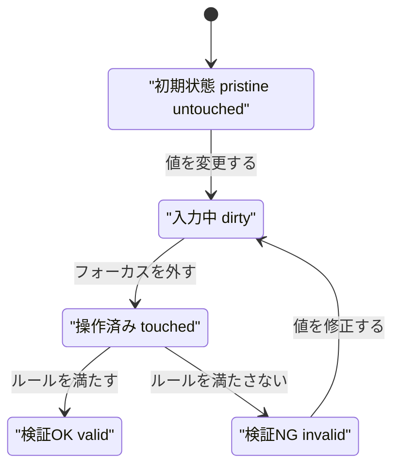
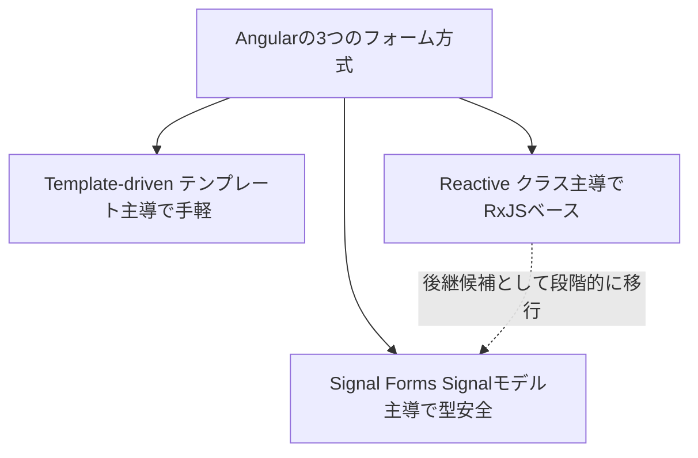

この章では、利用者からの入力を扱うFormsを学びます。伝統的なTemplate-driven・Reactiveの2方式に加え、v22で安定化したSignal Formsを扱います。

:::message
**この章で学ぶこと**

- Angularの3つのフォーム方式（Template-driven・Reactive・Signal Forms）
- Template-driven Formsの書き方
- Typed Formsによる型安全なReactive Forms
- Signal Formsの考え方
:::

## Template-driven FormsとReactive Forms

フォームは、利用者からの入力を受け取る、アプリケーションの重要な入り口です。名前の入力、ログイン、検索、設定の変更。これらはすべてフォームです。Angularは、フォームを扱うための仕組みを複数用意しています。この節では、伝統的な2つの方式、Template-driven FormsとReactive Formsを学びます。

この2つは、長らくAngularのフォームの二本柱でした。Template-drivenは手軽で、Reactiveは堅牢です。それぞれに向き不向きがあり、どちらを使うかは、フォームの複雑さによって判断します。この章の後半では、これらに加えてSignal Formsという新しい方式も扱いますが、まずは既存の2方式を理解することが、フォーム全体を捉える土台になります。

### 2つのフォーム方式

Angularには、伝統的に2つのフォーム方式があります。

- **Template-driven Forms**: テンプレート側を主役に、フォームを組み立てる方式です。`ngModel`を使い、テンプレートに書いた指定から、Angularがフォームの構造を読み取ります。手軽さが特徴です。
- **Reactive Forms**: クラス側を主役に、フォームを組み立てる方式です。`FormControl`や`FormGroup`をクラスで定義し、それをテンプレートに結びつけます。構造が明示的で、堅牢さが特徴です。

大きな違いは、「フォームの定義が、テンプレートとクラスのどちらにあるか」です。Template-drivenはテンプレートに、Reactiveはクラスに、フォームの中心があります。順に見ていきましょう。

### Template-driven Forms

Template-driven Formsは、手軽にフォームを作れる方式です。使うには、`FormsModule`をimportします。中心となるのが、`ngModel`です。[「双方向バインディングとライフサイクル」の章](./09-two-way-and-lifecycle)で双方向バインディングに触れましたが、`ngModel`はその代表例で、入力欄とデータを双方向に結びつけます。

```ts:src/app/login-form.ts
import { Component } from '@angular/core';
import { FormsModule } from '@angular/forms';

@Component({
  selector: 'app-login-form',
  imports: [FormsModule],
  template: `
    <form (ngSubmit)="submit()">
      <input name="email" [(ngModel)]="email" required />
      <input name="password" type="password" [(ngModel)]="password" required />
      <button type="submit">ログイン</button>
    </form>
  `,
})
export class LoginForm {
  protected email = '';
  protected password = '';

  protected submit(): void {
    console.log(this.email, this.password);
  }
}
```

`[(ngModel)]="email"`で、入力欄と`email`プロパティが双方向に結びつきます。利用者が入力すれば`email`が変わり、`email`を変えれば入力欄も変わります。`required`のような検証も、HTMLの属性のように書けます。`(ngSubmit)`は、フォームが送信されたときに呼ばれるイベントです。

Template-drivenは、直感的で、少ないコードで書けます。単純なフォーム、たとえば項目が少ない設定画面やログインフォームには十分です。一方、フォームが複雑になると、ロジックがテンプレートに散らばり、扱いにくくなる面があります。

### Reactive Forms

Reactive Formsは、フォームの構造をクラス側で明示的に定義する方式です。使うには、`ReactiveFormsModule`をimportします。中心となるのが、`FormControl`（1つの入力）と`FormGroup`（入力のまとまり）です。

```ts:src/app/login-form.ts
import { Component, inject } from '@angular/core';
import { FormBuilder, ReactiveFormsModule, Validators } from '@angular/forms';

@Component({
  selector: 'app-login-form',
  imports: [ReactiveFormsModule],
  template: `
    <form [formGroup]="form" (ngSubmit)="submit()">
      <input formControlName="email" />
      <input formControlName="password" type="password" />
      <button type="submit" [disabled]="form.invalid">ログイン</button>
    </form>
  `,
})
export class LoginForm {
  private readonly fb = inject(FormBuilder);

  protected readonly form = this.fb.group({
    email: ['', [Validators.required, Validators.email]],
    password: ['', Validators.required],
  });

  protected submit(): void {
    console.log(this.form.value);
  }
}
```

`FormBuilder`の`group`で、フォームの構造をクラス側に定義しています。各項目には、初期値と検証ルール（`Validators`）を指定します。テンプレートでは、`[formGroup]`でフォーム全体を、`formControlName`で各入力を結びつけます。フォームの構造も検証も、すべてクラス側にあるため、見通しがよく、テストもしやすくなります。

Reactive Formsは、複雑なフォームに向きます。項目が多い、動的に項目が増減する、複雑な検証がある、といった場合に、その堅牢さが活きます。実務の込み入ったフォームでは、Reactiveが選ばれることが多くなります。

## フォームの検証

どちらの方式でも、入力値の検証（バリデーション）ができます。「必須である」「メールアドレスの形式である」「文字数が範囲内である」といったルールを課し、満たさなければエラーとして扱います。

Reactive Formsでは、先ほどの`Validators.required`や`Validators.email`のように、検証ルールをクラス側で指定しました。フォームやコントロールは、`valid`・`invalid`・`errors`といった状態を持ち、これをテンプレートで使って、エラーメッセージの表示や送信ボタンの制御を行います。

```html
@if (form.controls.email.invalid && form.controls.email.touched) {
  <p>正しいメールアドレスを入力してください</p>
}
```

`touched`は、その項目が一度でも操作されたかを表します。「操作された後で、かつ無効なとき」にだけエラーを出す、という自然な制御が、これで書けます。検証は、フォームの使い勝手を左右する重要な要素です。入力していないうちからエラーを出すと、利用者を不快にさせます。`touched`や`dirty`（値が変更されたか）を使い、適切なタイミングでエラーを見せる配慮が大切です。

次の図は、フォームコントロールが未入力の状態から、値の変更・フォーカス移動・検証を経てたどる状態の移り変わりを表します。



このように、`pristine`から`dirty`へ、`untouched`から`touched`へと状態が移り、`valid`か`invalid`かが定まります。エラー表示を`touched`まで待つと、操作を終えた項目にだけエラーが出て、自然な使い心地になります。

なお、`Validators`には標準の検証がひととおり揃っています。`required`（必須）、`email`（メール形式）、`minLength`／`maxLength`（文字数）、`min`／`max`（数値の範囲）、`pattern`（正規表現）などです。標準にない独自の検証は、次に見るカスタムバリデーターとして書けます。

### カスタムバリデーターを自作する

標準の`Validators`で足りないルールは、自分で検証関数を書いて補います。Reactive Formsのバリデーターは、`ValidatorFn`という型の関数です。`AbstractControl`を受け取り、問題がなければ`null`を、問題があれば`{ エラーキー: 値 }`という形の`ValidationErrors`を返します。

```ts:src/app/validators/no-whitespace.ts
import { AbstractControl, ValidationErrors, ValidatorFn } from '@angular/forms';

// 値に空白を含んでいたらエラーとする同期バリデーター
export function noWhitespaceValidator(): ValidatorFn {
  return (control: AbstractControl): ValidationErrors | null => {
    const value = (control.value ?? '') as string;
    return value.includes(' ') ? { whitespace: true } : null;
  };
}
```

作った関数は、標準の`Validators`と同じ場所に並べて渡します。

```ts:src/app/signup-form.ts
protected readonly form = this.fb.group({
  username: ['', [Validators.required, noWhitespaceValidator()]],
});
```

複数の項目にまたがる検証は、個々のコントロールではなく`FormGroup`に対して掛けます。パスワードと確認用の一致チェックが典型です。グループを受け取り、子コントロールの値を`get()`で読んで突き合わせます。

```ts:src/app/validators/password-match.ts
import { AbstractControl, ValidationErrors, ValidatorFn } from '@angular/forms';

export const passwordMatchValidator: ValidatorFn = (
  group: AbstractControl,
): ValidationErrors | null => {
  const password = group.get('password')?.value;
  const confirm = group.get('confirm')?.value;
  return password === confirm ? null : { passwordMismatch: true };
};
```

このグループ用バリデーターは、`group`の第2引数に渡します。

```ts:src/app/signup-form.ts
protected readonly form = this.fb.group(
  {
    password: ['', Validators.required],
    confirm: ['', Validators.required],
  },
  { validators: passwordMatchValidator },
);
```

エラーは、`form.errors?.['passwordMismatch']`のようにグループ側の`errors`から読み取ります。まとまり全体にエラーが付く点が、単一項目の検証との違いです。

### 非同期バリデーション

「このユーザー名はすでに使われていないか」のように、サーバーへ問い合わせないと判定できない検証もあります。この場合は、同期用の`ValidatorFn`に代えて`AsyncValidatorFn`を使います。戻り値が`Observable<ValidationErrors | null>`（またはPromise）になる点だけが異なります。

```ts:src/app/signup-form.ts
import { Component, inject } from '@angular/core';
import { AsyncValidatorFn, FormBuilder, ReactiveFormsModule, Validators } from '@angular/forms';
import { map } from 'rxjs';
import { UserApi } from './user-api';

@Component({
  selector: 'app-signup-form',
  imports: [ReactiveFormsModule],
  template: `
    <form [formGroup]="form">
      <input formControlName="username" />
      @if (form.controls.username.pending) {
        <p>確認中...</p>
      }
      @if (form.controls.username.hasError('usernameTaken')) {
        <p>このユーザー名は既に使われています</p>
      }
    </form>
  `,
})
export class SignupForm {
  private readonly fb = inject(FormBuilder);
  private readonly api = inject(UserApi);

  protected readonly form = this.fb.group({
    username: this.fb.control('', {
      validators: [Validators.required],
      asyncValidators: [this.usernameValidator()],
      updateOn: 'blur',
    }),
  });

  private usernameValidator(): AsyncValidatorFn {
    return (control) =>
      this.api
        .isTaken(control.value)
        .pipe(map((taken) => (taken ? { usernameTaken: true } : null)));
  }
}
```

非同期バリデーターは、同期の検証をすべて通過したあとにだけ実行されます。空欄のうちからサーバーへ問い合わせる無駄が起きない、という設計です。問い合わせ中は、コントロールの状態が`PENDING`になり、`control.pending`が`true`を返します。この`pending`を使えば、「確認中...」の表示を出せます。上の例では`updateOn: 'blur'`を指定し、フォーカスが外れた時点でだけ検証を走らせて、入力中のリクエストを抑えています。

## 動的なフォームとカスタム入力部品

### FormArrayで項目を動的に増減する

「タグを好きなだけ追加できる」「明細行を増やせる」といった、項目数が固定でないフォームには、`FormArray`を使います。`FormBuilder`の`array`で作り、`push`で項目を追加、`removeAt`で削除します。

```ts:src/app/tags-form.ts
import { Component, inject } from '@angular/core';
import { FormArray, FormBuilder, ReactiveFormsModule, Validators } from '@angular/forms';

@Component({
  selector: 'app-tags-form',
  imports: [ReactiveFormsModule],
  template: `
    <form [formGroup]="form">
      <div formArrayName="tags">
        @for (tag of tags.controls; track $index) {
          <div>
            <input [formControlName]="$index" />
            <button type="button" (click)="removeTag($index)">削除</button>
          </div>
        }
      </div>
      <button type="button" (click)="addTag()">タグを追加</button>
    </form>
  `,
})
export class TagsForm {
  private readonly fb = inject(FormBuilder);

  protected readonly form = this.fb.group({
    tags: this.fb.array([this.fb.control('', Validators.required)]),
  });

  // tags を FormArray として取り出す
  protected get tags(): FormArray {
    return this.form.controls.tags;
  }

  protected addTag(): void {
    this.tags.push(this.fb.control('', Validators.required));
  }

  protected removeTag(index: number): void {
    this.tags.removeAt(index);
  }
}
```

テンプレート側では、`formArrayName`で配列全体を指し、`@for`で各コントロールを回します。ループの添字`$index`を`[formControlName]`に渡すことで、配列の何番目の入力かを結びつけます。`push`と`removeAt`でコントロール自体が増減するため、表示も検証もそれに追従します。動的なフォームがReactiveの得意分野だといわれるのは、この`FormArray`の存在が大きな理由です。

### ControlValueAccessorでカスタム入力部品を作る

星による評価や、独自のトグルスイッチなど、標準の`<input>`では表現しにくい入力部品を、自分で作りたいことがあります。作った部品を`ngModel`や`formControlName`とそのまま結びつけるための橋渡し役が、`ControlValueAccessor`です。カスタム部品でこのインターフェースを実装すると、Angularのフォームからは通常の入力欄と同じように扱えます。

実装のポイントは、`NG_VALUE_ACCESSOR`というトークンに`multi: true`で自分自身を登録し、4つのメソッドを用意することです。

```ts:src/app/counter-input.ts
import { Component, forwardRef, signal } from '@angular/core';
import { ControlValueAccessor, NG_VALUE_ACCESSOR } from '@angular/forms';

@Component({
  selector: 'app-counter-input',
  template: `
    <button type="button" (click)="update(value() - 1)" [disabled]="disabled()">-</button>
    <span>{{ value() }}</span>
    <button type="button" (click)="update(value() + 1)" [disabled]="disabled()">+</button>
  `,
  providers: [
    {
      provide: NG_VALUE_ACCESSOR,
      useExisting: forwardRef(() => CounterInput),
      multi: true,
    },
  ],
})
export class CounterInput implements ControlValueAccessor {
  protected readonly value = signal(0);
  protected readonly disabled = signal(false);

  private onChange: (value: number) => void = () => {};
  private onTouched: () => void = () => {};

  // フォーム側の値を、この部品に反映する
  writeValue(value: number): void {
    this.value.set(value ?? 0);
  }

  // 値が変わったことをフォームへ伝える関数を受け取る
  registerOnChange(fn: (value: number) => void): void {
    this.onChange = fn;
  }

  // 操作済みであることをフォームへ伝える関数を受け取る
  registerOnTouched(fn: () => void): void {
    this.onTouched = fn;
  }

  // フォーム側から無効化されたときの処理
  setDisabledState(isDisabled: boolean): void {
    this.disabled.set(isDisabled);
  }

  protected update(next: number): void {
    this.value.set(next);
    this.onChange(next);
    this.onTouched();
  }
}
```

4つのメソッドは、それぞれ役割が明確です。`writeValue`はフォームから部品への一方向、`registerOnChange`と`registerOnTouched`は部品からフォームへ変化を伝えるコールバックの受け取り、`setDisabledState`は無効化への追従です。この橋渡しさえ実装すれば、`<app-counter-input formControlName="quantity" />`のように、標準の入力欄と区別なく使えます。`forwardRef`を挟むのは、クラスの定義が完了する前にトークン登録を参照する必要があるためです。

### 動的なフォームとカスタム入力部品でよくあるつまずき

- **`FormsModule`と`ReactiveFormsModule`の混同**: Template-drivenは`FormsModule`、Reactiveは`ReactiveFormsModule`をimportします。使う方式に応じて、正しいほうを宣言します。
- **`formControlName`の綴り違い**: `FormGroup`で定義した名前と、テンプレートの`formControlName`が一致していないと、結びつきません。名前の綴りを確認します。
- **入力前からエラーを出す**: 検証結果をそのまま表示すると、まだ入力していない項目にもエラーが出ます。`touched`と組み合わせ、操作後にだけ表示します。
- **非同期バリデーターを毎入力で走らせる**: `updateOn: 'blur'`やデバウンスを挟まないと、キー入力のたびにサーバーへ問い合わせてしまいます。実行頻度を抑える工夫が要ります。
- **単純なフォームにReactiveを持ち込む**: 項目が1つ2つのフォームにまで`FormGroup`を用意すると、かえって大げさです。フォームの規模に見合った方式を選びます。逆に、複雑なフォームをTemplate-drivenで押し通すと、テンプレートが肥大化します。フォームの複雑さに応じて、方式を見直す柔軟さも大切です。

## Template-driven FormsとReactive Formsを使い分ける

Template-drivenとReactiveの使い分けの目安を、表に整理します。

| 観点 | Template-driven | Reactive |
|---|---|---|
| フォームの定義 | テンプレート | クラス |
| 手軽さ | 高い | やや手間 |
| 複雑なフォーム | 苦手 | 得意 |
| テスト | しにくい | しやすい |
| 動的なフォーム | 苦手 | 得意 |

一般には、単純なフォームならTemplate-driven、複雑なフォームならReactive、という使い分けが基本でした。ただし、この章の後半で学ぶSignal Formsという新しい選択肢が加わったことで、この構図も変わりつつあります。まずは、この2方式が「テンプレート主役か、クラス主役か」で分かれることを押さえてください。

## Typed FormsとSignal Forms

前節で、Template-drivenとReactiveという2つのフォーム方式を学びました。この節では、その先の進化を扱います。ひとつは、Reactive Formsを型安全にしたTyped Forms。もうひとつは、Angular 22で安定版となった、まったく新しいSignal Formsです。

フォームは、Angularが継続的に改善を重ねてきた領域です。Typed Formsは型の穴を塞ぎ、Signal Formsは、これまで学んだSignalの考え方をフォームに持ち込みました。とくにSignal Formsは、モダンAngularのフォームの中心となることが期待される、重要な新機能です。この節では、両者の考え方と書き方を、これまでの方式と比較しながら学びます。

### Typed Forms

Reactive Formsは、長らく型の面に弱点を抱えていました。フォームから取り出した値の型が、必ずしも正確でなく、思わぬ実行時エラーを招くことがあったのです。この問題を解決したのが、Angular 14（2022年）で導入されたTyped Formsです。

Typed Formsでは、フォームの構造から、値の型が正確に導かれます。前節の`FormBuilder`による定義は、実はすでにTyped Formsとして動いています。

```ts:src/app/profile-form.ts
import { Component, inject } from '@angular/core';
import { FormBuilder, ReactiveFormsModule, Validators } from '@angular/forms';

@Component({
  selector: 'app-profile-form',
  imports: [ReactiveFormsModule],
  template: `...`,
})
export class ProfileForm {
  private readonly fb = inject(FormBuilder);

  protected readonly form = this.fb.group({
    name: ['', Validators.required],
    age: [0],
  });

  protected save(): void {
    const value = this.form.value;
    // value.name は string | undefined、value.age は number | undefined と型付く
    const raw = this.form.getRawValue();
    // raw.name は string、raw.age は number（undefined を含まない）
  }
}
```

`form.value`の型が、定義した構造（`name`は文字列、`age`は数値）から自動で導かれます。存在しない項目にアクセスしようとすれば、コンパイル時にエラーになります。[「TypeScriptとComponentの基本」の章](./04-component-basics)で学んだTypeScriptの型の恩恵が、フォームにも及ぶわけです。

ここで気になるのが、`value.name`に`string | undefined`という型が付く点です。一見すると型の不備に思えますが、これはAngularの仕様です。Angularは、`disable()`で無効化されたコントロールを`value`から除外します。無効化された項目は、実行時に`value`へ現れないため、型としても「存在しないかもしれない」ことを表す`undefined`が付きます。無効なコントロールも含めた完全な値がほしいときは、`getRawValue()`を使います。こちらは除外を行わないため、`raw.name`は`string`と、`undefined`のない型で得られます。

もうひとつ、初期値に`''`を与えても、`reset()`はコントロールを`null`に戻すのが既定の挙動です。そのため各コントロールの値の型には`null`が混じります。これを避けたいときは、`NonNullableFormBuilder`を使います。`fb.nonNullable.group(...)`で作ると、コントロールが非nullになり、`reset()`は初期値へ戻ります。

```ts:src/app/profile-form.ts
protected readonly form = this.fb.nonNullable.group({
  name: ['', Validators.required],
});
// name コントロールの型は string（null を含まない）。reset() は初期値 '' に戻る
```

現在のReactive Formsは、標準でこのTyped Formsとして動くため、特別な設定は要りません。型の安全性が、最初から得られます。

## Signal Formsの登場

Reactive Formsは堅牢ですが、RxJSベースであり、値の変化は`valueChanges`というObservableで受け取ります。[「SignalsとZoneless」の章](./13-signals-and-zoneless)で見たように、モダンAngularの状態管理はSignalへ移りつつあります。フォームだけがObservableのままでは、アプリ全体の一貫性が損なわれます。

そこで登場したのが、Signal Formsです。Angular 22（2026年）で安定版になった、Signalを土台とする新しいフォームの仕組みです。フォームの状態がSignalとして表現されるため、これまで学んできたSignalの考え方が、そのままフォームに通用します。`@angular/forms/signals`から機能をimportして使います。

Signal Formsの核心は、フォームのデータを、ふつうのSignalとして持つことです。そのSignalモデルから、`form()`関数でフォームを組み立てます。

### form()でフォームを作る

Signal Formsでは、まずフォームのデータをSignalで定義します。次に、それを`form()`に渡し、第2引数のスキーマ関数で検証ルールを宣言します。

```ts:src/app/login-form.ts
import { Component, signal } from '@angular/core';
import { form, required, email } from '@angular/forms/signals';

@Component({ selector: 'app-login-form', template: `...` })
export class LoginForm {
  // フォームのデータを、ふつうのSignalで持つ
  protected readonly loginModel = signal({ email: '', password: '' });

  // モデルとスキーマから、フォームを組み立てる
  protected readonly loginForm = form(this.loginModel, (path) => {
    required(path.email, { message: 'メールアドレスは必須です' });
    email(path.email, { message: '正しい形式で入力してください' });
    required(path.password, { message: 'パスワードは必須です' });
  });
}
```

`form(this.loginModel, ...)`の第1引数が、データを持つSignalです。第2引数のスキーマ関数は、`path`を受け取り、各項目に検証ルールを適用します。`required(path.email)`のように、どの項目にどの検証を課すかを、宣言的に書きます。検証ルール（`required`・`email`など）は、組み合わせられる関数として提供されます。

### テンプレートとの結びつけと状態

作ったフォームは、`[formField]`ディレクティブで入力欄に結びつけます。

```html
<form>
  <input type="email" [formField]="loginForm.email" />
  @if (loginForm.email().invalid() && loginForm.email().touched()) {
    @for (e of loginForm.email().errors(); track e.kind) {
      <p>{{ e.message }}</p>
    }
  }

  <input type="password" [formField]="loginForm.password" />

  <button [disabled]="loginForm().invalid()">ログイン</button>
</form>
```

`[formField]="loginForm.email"`で、フォームの`email`項目と入力欄が結びつきます。双方向の同期は、Signal Formsが自動で行います。各項目の状態は、その項目を関数として呼び出して読み取ります。`loginForm.email()`で項目の状態にアクセスし、さらに`.value()`で現在値、`.invalid()`で検証結果、`.touched()`で操作済みかを、いずれもSignalとして取得できます。

ここで注意したいのが`errors()`です。返り値は、`{ kind, message }`という形のオブジェクトの配列です。`kind`はエラーの種類、`message`は表示用の文言を表します。エラーを表示するときは、`@for`で配列を回し、1件ずつ`message`を出します。ひとつの項目に複数のエラーが同時に付くこともあるため、この形が理にかなっています。

すべてがSignalなので、テンプレートでの表示も、これまでのSignalとまったく同じ感覚で書けます。`valueChanges`の購読も、その解除も要りません。フォームの状態が、アプリのほかの状態と同じ土俵に乗るのです。これが、Signal Formsの最大の利点です。

### Signal Formsの検証パターン

Signal Formsの検証は、すべてスキーマ関数の中で宣言します。ここに、Signal Formsの表現力の多くが詰まっています。順に見ていきましょう。

まず、組み込みバリデーターです。Reactive Formsの`Validators`に相当するものが、スキーマ関数内で呼ぶ関数として用意されています。いずれも第1引数に対象のパス、続けて条件やメッセージを渡します。

```ts:src/app/signup-form.ts
import { Component, signal } from '@angular/core';
import {
  form, required, email, min, max, minLength, maxLength, pattern,
} from '@angular/forms/signals';

@Component({ selector: 'app-signup-form', template: `...` })
export class SignupForm {
  protected readonly model = signal({
    email: '',
    password: '',
    age: 0,
    phone: '',
    bio: '',
  });

  protected readonly signupForm = form(this.model, (path) => {
    required(path.email, { message: 'メールアドレスは必須です' });
    email(path.email, { message: '正しい形式で入力してください' });
    minLength(path.password, 8, { message: '8文字以上で入力してください' });
    maxLength(path.bio, 500, { message: '500文字以内で入力してください' });
    min(path.age, 18, { message: '18歳以上が対象です' });
    max(path.age, 120, { message: '入力値を確認してください' });
    pattern(path.phone, /^\d{3}-\d{4}-\d{4}$/, { message: 'ハイフン区切りで入力してください' });
  });
}
```

これらの組み込みバリデーターは、いずれも第2（または第3）引数に`{ message, when? }`というオプションを取ります。`when`を使えば、「別の項目がこの値のときだけ必須にする」といった条件付きの検証も表せます。

組み込みにないルールは、`validate()`で書きます。対象のパスと、判定を行う関数を渡します。関数は`FieldContext`を受け取り、その`value()`で現在値を読めます。問題がなければ`null`を、あれば`{ kind, message }`を返します。

```ts
validate(path.website, ({ value }) =>
  value().startsWith('https://')
    ? null
    : { kind: 'https', message: 'httpsで始まるURLを入力してください' },
);
```

パスワードと確認用の一致のように、複数の項目を突き合わせる検証は`validateTree()`を使います。フォーム全体（またはサブツリー）を対象に取り、`valueOf()`で各項目の値を読んで比べます。エラーをどの項目に紐付けるかは、`fieldTree`で指定します。

```ts
validateTree(path, (ctx) =>
  ctx.valueOf(path.password) === ctx.valueOf(path.confirm)
    ? null
    : {
        kind: 'mismatch',
        message: 'パスワードが一致しません',
        fieldTree: ctx.fieldTree.confirm,
      },
);
```

配列の各項目に同じ検証を掛けたいときは、`applyEach()`が便利です。項目のパスを受け取り、その中で各要素向けの検証を宣言します。

```ts
protected readonly model = signal({ items: [{ name: '' }] });

protected readonly f = form(this.model, (path) => {
  applyEach(path.items, (itemPath) => {
    required(itemPath.name, { message: '名前は必須です' });
  });
});
```

サーバーへの問い合わせが必要な非同期検証は、`validateHttp()`で書きます。`request`でリクエスト先を組み立て、`onSuccess`で応答をエラー有無に変換します。

```ts
validateHttp(path.username, {
  request: ({ value }) => `/api/check?u=${value()}`,
  onSuccess: (res) =>
    res.taken ? { kind: 'taken', message: 'このユーザー名は使われています' } : null,
  onError: (e) => ({ kind: 'net', message: '確認できませんでした' }),
});
```

非同期検証は、同期の検証をすべて通過したあとにだけ走ります。実行中は`path.username().pending()`が`true`を返すため、テンプレートで「確認中...」を出せます。

```html
@if (signupForm.username().pending()) {
  <p>確認中...</p>
}
@for (e of signupForm.username().errors(); track e.kind) {
  <p>{{ e.message }}</p>
}
```

すでにZodのようなスキーマライブラリで検証定義を持っている場合は、`validateStandardSchema()`でそのまま流用できます。Standard Schemaという共通仕様に沿ったスキーマを、Signal Formsの検証として組み込めます。

```ts
import { validateStandardSchema } from '@angular/forms/signals';
import { z } from 'zod';

const schema = z.object({
  email: z.string().email(),
  age: z.number().min(18),
});

protected readonly f = form(this.model, (path) => {
  validateStandardSchema(path, schema);
});
```

このように、単純な必須チェックから、クロスフィールド、配列、非同期、外部スキーマ連携まで、検証の宣言を1か所のスキーマ関数に集約できるのが、Signal Formsの検証の強みです。

## 3つのフォーム方式を使い分ける

これで、フォームの方式が3つになりました。それぞれの位置づけを整理します。

次の図は、3つの方式がそれぞれ何を軸足に置くか、そしてReactiveからSignal Formsへという新旧の関係を表します。



Template-drivenはテンプレートに、Reactiveはクラスに、Signal FormsはSignalモデルに軸足を置きます。点線は、Reactive Formsの後継候補としてSignal Formsが位置づけられ、段階的な移行が見据えられていることを表します。

| 方式 | 中心 | 特徴 |
|---|---|---|
| Template-driven | テンプレート | 手軽。単純なフォーム向け |
| Reactive | クラス（RxJSベース） | 堅牢。従来の複雑なフォームの定番 |
| Signal Forms | Signalモデル | 型安全でSignal一貫。v22の新標準候補 |

Signal Formsは、Reactive Formsの堅牢さと型安全性を保ちながら、Signalベースである点で、モダンAngularとの一貫性に優れます。Angularは、既存のReactive Formsからの段階的な移行も見据えており、両者を併存させながら移していけるよう配慮されています。

3つのうちどれを選ぶかは、次の観点で判断します。

- **新規プロジェクトか、既存プロジェクトか**: 新規で複雑なフォームを作るなら、Signal Formsが第一の候補です。一方、既存プロジェクトがReactive Formsで統一されているなら、無理に混在させず、既存方式に合わせるほうが保守しやすくなります。
- **フォームの複雑さ**: 項目が1つ2つで検証も単純なら、Template-drivenで十分です。項目が多い、動的に増減する、複雑な検証がある場合は、ReactiveかSignal Formsを選びます。
- **チームの習熟度**: Signal Formsは登場して間もないため、チームがSignalの考え方に慣れているかどうかが導入の分かれ目になります。RxJSの資産や知見が厚いチームでは、当面Reactiveを続ける判断も妥当です。

本書では、新規に複雑なフォームを作るなら、Signalベースで書けるSignal Formsを第一の選択肢として推奨します。ただし、Signal Formsは登場して間もないため、既存プロジェクトの多くはReactive Formsで書かれています。当面は、両方を理解しておくことが実務上は重要です。単純なフォームであれば、Template-drivenも引き続き有効です。

### なぜSignal Formsが重要なのか

Signal Formsが重要なのは、フォームの状態を、アプリケーションのほかの状態と同じ「Signal」という土俵に載せる点にあります。「SignalsとZoneless」の章で見たように、モダンAngularは状態管理をSignalに統一する方向へ進んでいます。ところが、フォームだけがRxJSベースのままだと、フォームの値をほかのSignalと組み合わせるたびに、変換（`toSignal()`など）が必要でした。

Signal Formsでは、フォームの値も検証状態も、最初からSignalです。`computed()`でフォームの値から別の値を導いたり、`effect()`でフォームの変化に反応したりが、変換なしに、そのまま書けます。フォームが、アプリの状態管理に自然に溶け込むのです。この一貫性は、書き方の違い以上に大きな利点です。「SignalsとZoneless」の章から一貫して見てきた「状態はSignalで持つ」という流れの、フォームにおける到達点が、Signal Formsだといえます。

### 3つのフォーム方式の使い分けでよくあるつまずき

- **フォームの状態の読み方を間違える**: Signal Formsでは、項目を関数として呼んでから状態を読みます。`loginForm.email().value()`のように、二段階になる点に注意します。
- **エラーを配列として扱わない**: `errors()`は`{ kind, message }`の配列です。`{{ loginForm.email().errors() }}`と直接補間せず、`@for`で回して`message`を1件ずつ表示します。
- **方式を混同する**: Template-driven（`ngModel`）、Reactive（`formControlName`）、Signal Forms（`[formField]`）は、それぞれ結びつけ方が違います。1つのフォームでは、方式を統一します。
- **新しさだけで飛びつく**: Signal Formsは有望ですが、既存プロジェクトがReactiveで統一されているなら、無理に混在させず、方針を決めて選びます。
- **検証を検証関数の外に書く**: Signal Formsの検証は、スキーマ関数の中で`required(path.email)`のように宣言します。テンプレート側で条件分岐を駆使して検証を模倣すると、Signal Formsの利点が薄れます。ルールはスキーマに集約します。

## まとめ

- Angularには伝統的に、Template-drivenとReactiveの2つのフォーム方式があります
- Template-drivenは`ngModel`を使い、テンプレートを主役に手軽に組み立てます
- Reactiveは`FormControl`・`FormGroup`をクラスで定義し、堅牢に組み立てます
- カスタムバリデーター・非同期バリデーション・`FormArray`・`ControlValueAccessor`で、複雑な要件にも対応できます
- Typed Formsは、Reactive Formsの値に正確な型を与える仕組みで、v14以降は標準です
- Signal Formsは、v22で安定化した、Signalを土台とする新しいフォーム方式です
- `form(model, スキーマ関数)`でフォームを作り、`[formField]`で入力欄に結びつけます
- **新規に複雑なフォームを作るならSignal Formsを第一の選択肢とするのが現在の推奨です。既存のReactive Formsも引き続き有効なため、当面は両方を理解しておくことが実務では重要です**

次章では、サーバーとデータをやり取りするHTTP通信を学びます。
