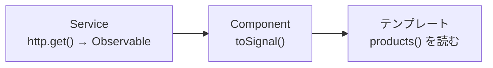

この章では、サーバーとの通信を学びます。HttpClientによる基本、Signalベースの`resource()`・`httpResource()`、そして通信を横断的に扱うInterceptorや認証・エラー設計を扱います。

:::message
**この章で学ぶこと**

- `provideHttpClient()`による準備
- GET・POSTなどの基本的な通信
- 手作業での状態管理の課題
- `httpResource()`によるデータ取得
- Interceptorによる通信への割り込み
- 認証トークンの付与
:::

## HttpClientとAPI通信

アプリケーションの多くは、サーバーとデータをやり取りします。商品一覧をサーバーから取得する、入力されたデータをサーバーへ保存する。こうした通信を担うのが、AngularのHttpClientです。この節では、HttpClientの基本的な使い方を学びます。

HttpClientは、サーバーへの要求の結果を、Observableで返します。第8部で学んだRxJSが、ここで実際に活きてきます。通信は非同期処理の代表例であり、いつ応答が返るかわからない、失敗するかもしれない、という性質を持ちます。Observableは、まさにこうした処理を扱うためのものでした。この節で、通信とRxJS、そしてSignalが、どう結びつくのかを見ていきます。

### HttpClientを準備する

HttpClientを使うには、アプリケーションに登録する必要があります。第4章で見た`app.config.ts`の`providers`に、`provideHttpClient()`を加えます。

```ts:src/app/app.config.ts
import { ApplicationConfig } from '@angular/core';
import { provideHttpClient } from '@angular/common/http';

export const appConfig: ApplicationConfig = {
  providers: [provideHttpClient()],
};
```

この一行で、アプリのどこからでもHttpClientを注入できるようになります。これは、第7章で触れた「モジュールから関数へ」の流れの一例です。かつては`HttpClientModule`をimportしていましたが、現在は`provideHttpClient()`という関数を使います。

### 基本的な通信

HttpClientは、`inject()`で受け取って使います。HTTPのメソッド（GET、POSTなど）に対応するメソッドが用意されています。

```ts:src/app/product.ts
import { inject, Injectable } from '@angular/core';
import { HttpClient } from '@angular/common/http';
import { Observable } from 'rxjs';

@Injectable({ providedIn: 'root' })
export class ProductService {
  private readonly http = inject(HttpClient);

  getProducts(): Observable<Product[]> {
    return this.http.get<Product[]>('/api/products');
  }
}
```

`this.http.get(...)`は、サーバーへGET要求を送り、その結果をObservableで返します。ここで重要なのは、このメソッドを呼んだだけでは、まだ通信は起きないことです。第37章で学んだとおり、Observableは`subscribe`されて初めて動きます。HttpClientのObservableも同じで、購読されたときに通信が始まります。

購読は、Component側で行います。ただし、第38章で学んだように、手動の`subscribe`より、`async`パイプや`toSignal()`を使うほうが安全です。

```ts:src/app/product-list.ts
export class ProductList {
  private readonly service = inject(ProductService);
  // 通信結果をSignalとして受け取る
  protected readonly products = toSignal(this.service.getProducts(), {
    initialValue: [],
  });
}
```

`toSignal()`を使えば、通信結果をSignalとして受け取れ、購読の解除も自動です。テンプレートでは`products()`と、ふつうのSignalとして扱えます。第41章で学んだ、RxJSとSignalの橋渡しが、通信で実際に役立つ場面です。

### 型付きのレスポンス

HttpClientのメソッドには、型引数を指定できます。先ほどの`get<Product[]>`のように、レスポンスの型を指定すると、返ってくるObservableの型が定まります。

```ts
this.http.get<Product[]>('/api/products'); // Observable<Product[]>
this.http.get<Product>('/api/products/42'); // Observable<Product>
```

ただし、注意が必要です。この型指定は、「サーバーがこの型のデータを返すはずだ」という、開発者による宣言にすぎません。HttpClientが、実際のレスポンスがその型と一致するかを検証するわけではありません。サーバーが想定と違う形のデータを返せば、型は`Product`なのに中身は違う、という食い違いが起こりえます。型指定は開発を助けますが、サーバーとの取り決めを守ることは、別途必要だと覚えておいてください。

### POSTなどの通信

データを送る通信も、同様に書けます。POSTは、新しいデータの作成によく使います。

```ts:src/app/product.ts
createProduct(product: NewProduct): Observable<Product> {
  return this.http.post<Product>('/api/products', product);
}
```

`post`の第1引数がURL、第2引数が送信するデータ（本体）です。同様に、`put`（更新）、`patch`（部分更新）、`delete`（削除）も用意されています。いずれもObservableを返すので、扱い方は`get`と同じです。データを送る通信は、送信後にComponentの状態を更新したり、画面を遷移したりすることが多く、その場合は結果を購読して後続の処理を行います。

### 通信オプション

通信には、さまざまなオプションを指定できます。メソッドの最後の引数に、オプションのオブジェクトを渡します。

```ts
this.http.get<Product[]>('/api/products', {
  params: { category: 'book', page: 1 }, // クエリパラメーター
  headers: { 'X-Custom': 'value' },        // ヘッダー
});
```

`params`は、URLに付くクエリパラメーター（`?category=book&page=1`）になります。`headers`は、要求に添えるHTTPヘッダーです。認証トークンを添える、といった用途で使いますが、こうした全通信に共通する処理は、第47章で学ぶInterceptorでまとめて扱うのが定石です。

### 通信をServiceにまとめる

通信は、Componentに直接書くのではなく、Serviceにまとめるのが定石です。第22章で学んだ責務の分離が、ここでも当てはまります。「商品に関する通信は`ProductService`に集約する」という形です。

こうすると、通信の詳細（URLやオプション）が一か所にまとまり、複数のComponentから同じ通信を使い回せます。Componentは、Serviceのメソッドを呼ぶだけで、通信の中身を気にせずにデータを得られます。URLの変更やエラー処理の追加も、Service側の修正で済みます。通信をServiceに閉じ込めることは、保守性の高いアプリケーションの基本です。

### エラーへの備え

通信は、必ず成功するとは限りません。ネットワークの不調、サーバーのエラー、権限の不足など、失敗の原因はさまざまです。通信を扱うときは、エラーへの備えが欠かせません。第39章で学んだ`catchError`が、ここで役立ちます。

```ts:src/app/product.ts
import { catchError, of } from 'rxjs';

getProducts(): Observable<Product[]> {
  return this.http.get<Product[]>('/api/products').pipe(
    catchError((error) => {
      console.error('取得に失敗:', error);
      return of([]); // 失敗時は空の配列を返して、画面を壊さない
    }),
  );
}
```

`catchError`でエラーを捉え、代わりの値（ここでは空の配列）を返せば、通信が失敗しても画面が壊れずに済みます。また、一時的な失敗に備えて、`retry`という演算子で自動的に再試行することもできます。ただし、こうしたエラー処理を各通信メソッドに個別に書くと繰り返しが増えます。全通信に共通するエラー処理は、第47章で学ぶInterceptorにまとめるのが定石です。ここでは、通信にはエラー処理が伴う、という点を押さえてください。

### 通信結果を画面につなぐ流れ

通信からデータ取得、そして表示までの流れを、あらためて整理します。Serviceが通信メソッド（Observableを返す）を提供し、Componentがそれを`toSignal()`でSignalに変換し、テンプレートが`async`なしでそのSignalを読む。この一連が、モダンAngularでの基本形です。



この流れでは、購読の管理をAngularに任せられ、後始末の心配がありません。第41章で学んだRxJSとSignalの橋渡しが、通信という具体的な場面で、いかに役立つかがよくわかります。次章では、この流れをさらに簡潔にする`httpResource()`を扱いますが、その土台となるのが、この基本形です。

### よくあるつまずき

- **通信が起きない**: HttpClientのメソッドは、`subscribe`されるまで通信しません。`toSignal()`や`async`パイプ、あるいは購読をしているかを確認します。呼び出しただけでは通信は始まりません。
- **エラーでアプリが止まる**: エラー処理を書かないと、通信の失敗がそのまま伝播します。`catchError`やInterceptorで、失敗に備えます。
- **通信をComponentに直接書く**: 通信をComponentに書くと、再利用できず、テストもしにくくなります。通信はServiceにまとめます。

## HttpClientからresource()・httpResource()へ

前節で、HttpClientによる通信を学びました。通信そのものは`get`や`post`で行えますが、実際のアプリケーションでは、それだけでは足りません。「読み込み中」の表示、エラー時の表示、そして「入力が変わったら再取得する」といった処理を、自分で組み立てる必要があります。これらを手作業で書くと、意外に煩雑です。

この課題に応えるのが、Angularの新しいデータ取得のAPI、`resource()`と`httpResource()`です。これらは、Signalを土台に、非同期のデータ取得と、それにまつわる状態（読み込み中・エラー・結果）を、ひとまとめに扱います。この節では、従来のHttpClientによる書き方と比較しながら、これらの新しいAPIの考え方を学びます。

### 手作業での状態管理の課題

まず、従来のHttpClientで、実用的なデータ取得を書くと、どうなるかを見ます。「読み込み中」と「エラー」の状態を、自分で管理する必要があります。

```ts:従来の書き方（状態を手作業で管理）
export class UserProfile {
  private readonly http = inject(HttpClient);
  protected readonly user = signal<User | null>(null);
  protected readonly loading = signal(false);
  protected readonly error = signal<string | null>(null);

  load(id: string): void {
    this.loading.set(true);
    this.error.set(null);
    this.http.get<User>(`/api/users/${id}`).subscribe({
      next: (u) => { this.user.set(u); this.loading.set(false); },
      error: () => { this.error.set('取得に失敗しました'); this.loading.set(false); },
    });
  }
}
```

`user`・`loading`・`error`という3つの状態を、自分で用意し、通信の各段階で手作業で更新しています。成功したら`loading`を下げて`user`を設定し、失敗したら`error`を設定して`loading`を下げる。この定型的な処理を、通信のたびに書くのは、繰り返しが多く、間違いも起きやすいものです。`loading`を下げ忘れる、といったミスもよく起こります。

### httpResource()によるデータ取得

`httpResource()`は、この定型処理を、ひとまとめにします。通信と、それにまつわる状態を、ひとつのオブジェクトとして提供します。

```ts:src/app/user-profile.ts
import { Component, inject, input } from '@angular/core';
import { httpResource } from '@angular/common/http';

@Component({
  selector: 'app-user-profile',
  template: `
    @if (userResource.hasValue()) {
      <h1>{{ userResource.value().name }}</h1>
    } @else if (userResource.isLoading()) {
      <p>読み込み中</p>
    } @else if (userResource.error()) {
      <p>取得に失敗しました</p>
    }
  `,
})
export class UserProfile {
  readonly id = input.required<string>();

  // URLを返す関数を渡す。状態はすべてSignalで提供される
  protected readonly userResource = httpResource<User>(
    () => `/api/users/${this.id()}`,
  );
}
```

`httpResource(() => URL)`は、URLを返す関数を受け取ります。そして、通信の状態を、Signalとして提供します。

- `value()`: 取得したデータ
- `isLoading()`: 読み込み中かどうか
- `error()`: エラー情報
- `hasValue()`: 値があるかの安全な確認

先ほど手作業で管理していた3つの状態が、すべて`httpResource()`の中に用意されています。自分で`loading`を上げ下げする必要も、`subscribe`する必要もありません。テンプレートは、これらのSignalを読むだけで、読み込み中・エラー・成功の表示を出し分けられます。

### Signalに反応する再取得

`httpResource()`のもうひとつの強みが、Signalへの反応です。URLを返す関数の中でSignalを読んでいると、そのSignalが変わるたびに、自動で再取得が走ります。

先ほどの例では、URLの中で`this.id()`というSignal（ルートパラメーターの入力）を読んでいました。そのため、`id`が変わると、`httpResource()`は自動的に新しいURLで再取得します。第42章で`toObservable()`と`switchMap`を組み合わせて実現した「URLの変化に応じた再取得」が、`httpResource()`では、URLの関数を書くだけで実現するのです。古い通信の打ち切りも、内部で適切に扱われます。

この宣言的な書き味は、`computed()`に似ています。`computed()`が「依存するSignalから値を導く」のに対し、`httpResource()`は「依存するSignalから非同期のデータを導く」といえます。Signalの考え方が、非同期のデータ取得にまで拡張されたものだと捉えると、理解しやすくなります。

第42章では、URLの変化に応じた再取得を、`toObservable()`・`switchMap`・`toSignal()`という3つの道具を組み合わせて実現しました。`httpResource()`は、その一連を、URLを返す関数ひとつに凝縮したものだと見ることもできます。RxJSの知識がなくても、「依存するSignalを読むURL関数を書けば、変化に応じて取得し直される」という直感的な形で、リアクティブなデータ取得が書けます。もちろん、その裏側ではRxJSと同等の制御が働いており、両者は対立するものではありません。単純な取得は`httpResource()`で簡潔に、複雑な制御はRxJSで、という住み分けです。

### resource()との関係

`httpResource()`は、より汎用的な`resource()`という仕組みの、HTTP専用版です。`resource()`は、HTTPに限らず、あらゆる非同期処理（Promiseを返す処理など）を、Signalベースの状態として扱えます。

```ts:resource()の例（HTTP以外の非同期にも使える）
import { resource } from '@angular/core';

userResource = resource({
  params: () => ({ id: this.id() }),
  loader: ({ params }) => fetchUser(params.id), // Promiseを返す処理
});
```

`resource()`は`loader`にPromiseを返す関数を渡し、`httpResource()`はHTTP通信に特化してURLを渡す、という違いがあります。つまり`httpResource()`は、`resource()`のうちHTTP通信という頻出のケースを、より書きやすくしたものです。HTTP通信なら`httpResource()`が簡潔で、それ以外の非同期には`resource()`を使う、と考えるとよいでしょう。RxJSベースで書きたい場合は、第41章で触れた`rxResource()`もあります。

### 新旧の位置づけと使い分け

これらのAPIの登場時期を整理します。`resource()`はAngular 19（2024年）で、`httpResource()`はAngular 19.2（2025年）で、いずれも実験的に導入されました。その後、フィードバックを経て、v22世代で実用段階へと成熟してきています。比較的新しいAPIであるため、既存のプロジェクトの多くは、まだ従来のHttpClientを直接使っています。

使い分けの指針は、次のとおりです。

- **画面表示のためのデータ取得**: `httpResource()`が向きます。読み込み中・エラーの状態が自動で得られ、Signalへの反応で再取得も宣言的に書けます。
- **データの送信（POST・PUT・DELETE）**: これらは`httpResource()`ではなく、従来どおりHttpClientのメソッドを使います。`httpResource()`は、主に取得（GET）のための仕組みです。
- **複雑な非同期の制御**: `debounceTime`や込み入った合成が必要なら、RxJSと`toSignal()`の組み合わせが依然として有力です。

### よくあるつまずき

- **`httpResource()`で送信しようとする**: `httpResource()`は主にデータ取得（GET）のための仕組みです。データの作成・更新・削除は、従来どおりHttpClientの`post`・`put`・`delete`を使います。
- **URLの関数内でSignalを読まない**: 再取得は、URLを返す関数の中でSignalを読むことで働きます。Signalを外で固定値として展開してしまうと、変化に反応しなくなります。
- **`value()`をそのまま読む**: 値がまだ来ていない段階で`value()`を読むと、期待した値が得られないことがあります。`hasValue()`で確認してから読むのが安全です。
- **実験的な段階を軽視する**: これらのAPIは比較的新しく、細かな仕様が変わる可能性があります。採用時は、使っているAngularのバージョンでのAPIの状態を確認します。

## Interceptor・認証・エラー・ローディング設計

第9部の締めくくりとして、通信にまつわる横断的な設計を学びます。個々の通信そのものは、前節までで扱いました。しかし実務では、「すべての通信に認証トークンを添える」「通信の失敗を一か所でまとめて処理する」「通信中はローディングを表示する」といった、通信全体に共通する処理が必要になります。

これらを、通信のたびに個別に書くのは、繰り返しが多く、書き忘れも生じます。そこで役立つのが、Interceptor（インターセプター）です。Interceptorは、すべてのHTTP通信の途中に割り込み、共通の処理を差し込む仕組みです。この節では、Interceptorを軸に、認証・エラー・ローディングという、通信設計の定番テーマを扱います。

### Interceptorとは

Interceptorは、アプリケーションが送るすべてのHTTP通信の途中に割り込む仕組みです。要求がサーバーへ送られる前、あるいは応答が返ってきた後に、共通の処理を差し込めます。「通信の関所」のようなものだと考えてください。すべての通信が、この関所を通ります。

モダンAngularのInterceptorは、関数として書きます。第24章で学んだ`inject()`があるおかげで、関数の中で依存を受け取れます。`HttpInterceptorFn`という型の関数を定義します。

```ts:src/app/logging-interceptor.ts
import { HttpInterceptorFn } from '@angular/common/http';

export const loggingInterceptor: HttpInterceptorFn = (req, next) => {
  console.log('送信:', req.url);
  return next(req); // 次の処理へ要求を渡す
};
```

`req`が送られる要求、`next`が次の処理へ渡す関数です。`next(req)`を呼ぶことで、要求が次へ進みます。ここでは、送信前にログを出しています。作ったInterceptorは、`provideHttpClient()`に`withInterceptors()`で登録します。

```ts:src/app/app.config.ts
import { provideHttpClient, withInterceptors } from '@angular/common/http';

export const appConfig: ApplicationConfig = {
  providers: [
    provideHttpClient(withInterceptors([loggingInterceptor])),
  ],
};
```

これで、すべての通信が`loggingInterceptor`を通るようになります。複数のInterceptorを配列で登録でき、順に適用されます。かつてはクラスとして書いていましたが、関数型のほうが簡潔で、`inject()`とも自然になじむため、現在は関数型が標準です。

### 認証トークンを付与する

Interceptorのもっとも典型的な用途が、認証です。多くのAPIは、ログイン済みであることを示すトークンを、要求のヘッダーに添えることを求めます。これをすべての通信に手作業で付けるのは大変ですが、Interceptorなら一か所で済みます。

```ts:src/app/auth-interceptor.ts
import { inject } from '@angular/core';
import { HttpInterceptorFn } from '@angular/common/http';
import { AuthService } from './auth';

export const authInterceptor: HttpInterceptorFn = (req, next) => {
  const auth = inject(AuthService);
  const token = auth.getToken();

  if (token) {
    // トークンをヘッダーに添えた要求を作り直す
    const authReq = req.clone({
      setHeaders: { Authorization: `Bearer ${token}` },
    });
    return next(authReq);
  }
  return next(req);
};
```

`inject(AuthService)`で認証Serviceを受け取り、トークンを取り出します。要求は変更できないため、`req.clone()`で、ヘッダーを添えた新しい要求を作り、それを`next`へ渡します。これで、すべての通信に自動でトークンが付きます。認証の仕組みを一か所に集約でき、各通信のコードは認証を意識せずに済みます。

### エラーを共通で処理する

通信は失敗することがあります。ネットワークの問題、サーバーのエラー、認証切れなど、原因はさまざまです。これらのエラー処理を、通信ごとに書くのではなく、Interceptorでまとめて扱えます。第39章で学んだ`catchError`を、ここで使います。

```ts:src/app/error-interceptor.ts
import { inject } from '@angular/core';
import { HttpInterceptorFn, HttpErrorResponse } from '@angular/common/http';
import { Router } from '@angular/router';
import { catchError, throwError } from 'rxjs';

export const errorInterceptor: HttpInterceptorFn = (req, next) => {
  const router = inject(Router);

  return next(req).pipe(
    catchError((error: HttpErrorResponse) => {
      if (error.status === 401) {
        router.navigate(['/login']); // 認証切れならログインへ
      }
      return throwError(() => error);
    }),
  );
};
```

`next(req)`が返すObservableに`catchError`をつなぎ、エラーを捉えます。ここでは、認証切れを示す`401`なら、ログインページへ遷移させています。共通のエラー処理を一か所に集約でき、個々の通信は、それぞれ固有のエラー処理だけに集中できます。ログの記録や、利用者への通知も、この場所で共通化できます。

### ローディング状態を管理する

「通信中はローディング表示を出す」という要求も、よくあります。これも、Interceptorで、進行中の通信の数を数えることで実現できます。通信が始まったら数を増やし、終わったら減らす。数が0より大きいあいだ、ローディング中とみなします。

```ts:src/app/loading-interceptor.ts
import { inject } from '@angular/core';
import { HttpInterceptorFn } from '@angular/common/http';
import { finalize } from 'rxjs';
import { LoadingService } from './loading';

export const loadingInterceptor: HttpInterceptorFn = (req, next) => {
  const loading = inject(LoadingService);
  loading.start(); // 通信開始：カウントを増やす

  return next(req).pipe(
    finalize(() => loading.stop()), // 成否によらず終了：カウントを減らす
  );
};
```

第38章で学んだ`finalize`が、ここで活きます。通信が成功しても失敗しても、`finalize`で確実にカウントを減らせるため、ローディングが消えずに残る、という不具合を防げます。`LoadingService`は、進行中の数をSignalで持ち、画面はそのSignalを見てローディング表示を出す、という設計にすれば、モダンAngularらしくまとまります。

### 通信設計の全体像

ここまでの要素を組み合わせると、通信の横断的な関心事が、Interceptorという一か所に整理されます。

- 認証トークンの付与（`authInterceptor`）
- エラーの共通処理（`errorInterceptor`）
- ローディングの管理（`loadingInterceptor`）

これらをそれぞれ独立したInterceptorとして書き、`withInterceptors([...])`に並べて登録します。各Interceptorが単一の関心事に集中するため、見通しがよく、テストもしやすくなります。第22章で学んだ責務の分離が、通信の設計にも貫かれているのがわかります。個々の通信コードは本来の目的だけに集中でき、共通処理はInterceptorが引き受ける。この分業が、保守しやすい通信層を作ります。

### よくあるつまずき

- **`next(req)`の呼び忘れ**: Interceptorの中で`next(req)`を呼ばないと、要求が次へ進まず、通信が止まります。処理の最後に、必ず`next`の結果を返します。
- **要求を直接書き換えようとする**: 要求（`req`）は変更できません。ヘッダーなどを足すときは、`req.clone()`で新しい要求を作ります。
- **Interceptorに多くを詰め込む**: 1つのInterceptorに認証もエラーもローディングも書くと、見通しが悪くなります。関心事ごとに分け、`withInterceptors([...])`に並べます。
- **登録順を意識しない**: Interceptorは登録した順に適用されます。処理の順序が重要な場合（例えばトークン付与とログ出力の順）は、配列の並び順に注意します。

### 通信設計とSignalの調和

最後に、この節の設計が、本書で学んできたモダンAngularの考え方と、いかに調和しているかを確認します。Interceptorは関数型で`inject()`を使い、ローディング状態は`LoadingService`がSignalで持ち、通信結果は`httpResource()`や`toSignal()`でSignalとして扱う。関数中心・Signal中心という一貫した方針が、通信という実務的な領域にも貫かれています。個々の技術がばらばらにあるのではなく、ひとつの設計思想のもとで噛み合っていることを感じ取ってください。この一貫性こそ、モダンAngularを学ぶ価値のひとつです。

## まとめ

- HttpClientは`provideHttpClient()`で登録し、`inject()`で受け取って使います
- `get`・`post`などのメソッドは、結果をObservableで返し、購読されて通信が始まります
- 通信結果は`toSignal()`や`async`パイプで受け取ると、購読解除が自動で安全です
- 従来のHttpClientでは、読み込み中・エラーの状態を手作業で管理する必要がありました
- `httpResource()`は、通信と状態（`value`・`isLoading`・`error`）をSignalでひとまとめにします
- URLの関数内でSignalを読むと、その変化に応じて自動で再取得されます
- Interceptorは、すべてのHTTP通信に割り込んで共通処理を差し込む仕組みです
- 関数型（`HttpInterceptorFn`）で書き、`withInterceptors()`で登録します
- 認証トークンの付与は、`req.clone()`でヘッダーを添えて実現します

次章からは、アプリケーション全体の状態管理に進みます。
