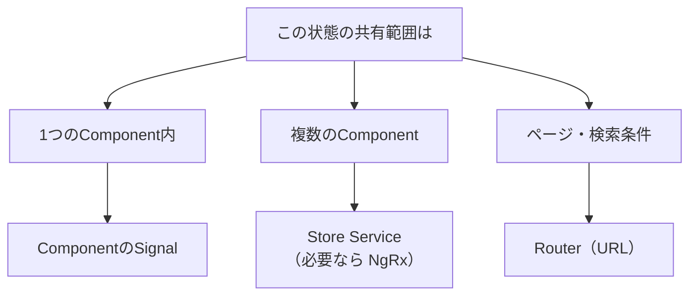

この章では、状態管理の土台を学びます。まず状態を分類する視点を持ち、続いてBehaviorSubjectとSignalによるStore Serviceの実装を扱います。

:::message
**この章で学ぶこと**

- 状態とは何か
- 状態を分類する観点
- Store Serviceの基本構造
- BehaviorSubjectによる状態の保持と公開
- SignalによるStore Serviceの実装
- `computed()`による派生状態
:::

## Angularアプリケーションの状態を分類する

状態管理を学ぶ前に、そもそも「状態」とは何かを整理しておきましょう。状態管理の道具（Store ServiceやNgRx）に飛びつく前に、自分のアプリケーションがどんな状態を持っているのかを見極めることが、適切な設計の第一歩です。状態を分類できれば、「この状態には、どの管理方法が向いているか」を判断できるようになります。

状態管理でよくある失敗は、あらゆる状態を、ひとつの大きな仕組みに詰め込んでしまうことです。単純な画面の開閉状態まで、大掛かりな状態管理ライブラリで扱うのは、過剰です。逆に、アプリ全体で共有すべきデータを、あちこちのComponentに散らばらせるのも問題です。状態を種類ごとに見分け、それぞれにふさわしい置き場所を与える。この節では、その分類の観点を身につけます。

### 状態とは何か

状態とは、アプリケーションが「いまどうなっているか」を表すデータのことです。もう少し具体的にいえば、時間とともに変わりうる、アプリの現在の様子を表す値です。

たとえば、次のようなものはすべて状態です。

- 入力欄に、いま入力されている文字
- ログインしているユーザーの情報
- サーバーから取得した商品の一覧
- モーダルダイアログが、開いているか閉じているか
- どのタブが選択されているか

これらは、利用者の操作や通信によって変化します。そして、その変化を画面に反映する必要があります。『変更検知の仕組み』の章で学んだ変更検知は、この状態の変化を画面に映す仕組みでした。状態管理とは、こうした状態を、どこに置き、どう変更し、どう共有するかを設計することです。言い換えれば、状態管理は「データの置き場所と、その出し入れのルール」を決める営みです。この設計がうまくいけば、アプリは予測しやすく、変更にも強くなります。逆に、状態が無秩序に散らばると、小さな変更が思わぬ場所に波及し、保守が困難になります。

### 状態を分類する観点

状態は、いくつかの観点で分類できます。もっとも重要なのが、「その状態は、どこまでの範囲で共有されるか」という観点です。共有の範囲によって、状態は大きく次のように分けられます。

- **ローカルな状態**: ひとつのComponentの中だけで使う状態。入力途中の値、開閉フラグなど。
- **共有される状態**: 複数のComponentにまたがって使う状態。ログインユーザー、カートの中身など。
- **サーバー由来の状態**: サーバーから取得したデータ。商品一覧、ユーザーのプロフィールなど。
- **URLに表れる状態**: 現在のページや、検索条件など。RouterがURLで管理する状態。

これらは性質が異なり、ふさわしい管理方法も違います。ひとくくりに「状態管理」と言っても、実際には、種類ごとに手段を選び分けるのが適切です。

それぞれを、具体例とともに見てみましょう。ローカルな状態の典型は、モーダルの開閉フラグです。`isOpen = signal(false)`のように、そのComponentの中だけで完結します。共有される状態の典型は、ログインユーザーです。ヘッダー、マイページ、権限判定など、多くの場所が同じユーザー情報を参照します。サーバー由来の状態の典型は、商品一覧です。サーバーから取得し、クライアントはそれを表示します。URLに表れる状態の典型は、検索ページのキーワードやページ番号です。これらはURLに載せることで、共有や復元が可能になります。同じ「状態」でも、これだけ性質が異なるのです。

### サーバー状態とクライアント状態

もうひとつ、重要な分類の観点があります。「その状態は、サーバーとクライアントの、どちらが正なのか」という観点です。

**サーバー状態**は、サーバーにある本体を、クライアントが取得して一時的に持っているものです。商品一覧やユーザー情報がこれにあたります。この種の状態で難しいのは、「クライアントが持っているコピーが、古くなっているかもしれない」という点です。いつ再取得するか、どうキャッシュするか、といった鮮度の管理が課題になります。『HTTP通信』の章の`httpResource()`は、このサーバー状態を扱う手段のひとつでした。

**クライアント状態**は、クライアント側で生まれ、クライアントが正であるものです。モーダルの開閉、選択中のタブ、フォームの入力途中の値などです。この種の状態は、サーバーとの同期を気にする必要がなく、扱いは比較的単純です。

この2つを混同すると、設計を誤ります。サーバー状態を、まるでクライアント状態のように扱って、鮮度の管理を怠ると、古いデータを表示し続けてしまいます。逆に、単純なクライアント状態に、サーバー状態向けの重厚な仕組みを持ち込むと、過剰になります。「サーバーが正か、クライアントが正か」を見極めることは、共有範囲と並ぶ、重要な分類の軸です。

### 種類ごとの置き場所

分類した状態を、それぞれどこに置くべきか、指針を示します。

**ローカルな状態**は、そのComponentの中に、Signalで持つのが基本です。『SignalsとZoneless』の章で学んだ`signal()`が、まさにこの用途に向きます。ほかのComponentと共有しないなら、外に出す必要はありません。モーダルの開閉や、フォームの入力途中の値などが、これにあたります。

**共有される状態**は、Serviceに置きます。『ServiceとDependency Injection』の章で学んだ「状態を持つService」です。複数のComponentが、同じServiceのインスタンスを通じて、同じ状態を参照します。これが、この章で扱うStore Serviceの領域です。

**サーバー由来の状態**は、取得と保持をServiceにまとめます。『HTTP通信』の章の`httpResource()`や、Store Serviceが担います。サーバーが正となるデータなので、いつ取得し、どうキャッシュするかも設計の対象になります。

**URLに表れる状態**は、Routerに任せます。『Routerの基礎』の章で学んだように、現在のページや検索条件は、URLで表すのが適切です。これを独自の状態管理に抱え込む必要はありません。

### すべてを状態管理ライブラリに入れない

ここで強調したいのは、「すべての状態を、NgRxのような大掛かりな仕組みに入れる必要はない」ということです。状態管理ライブラリは強力ですが、導入すると、それなりの記述量と学習コストがかかります。単純なローカル状態にまで適用すると、かえって複雑になります。

本書が推奨する考え方は、「状態は、必要最小限のスコープに置く」というものです。ローカルで済むならComponentのSignalに、共有が必要ならService（Store）に、と段階的に広げます。そして、アプリが本当に大規模で複雑な共有状態を抱えるようになって初めて、NgRxのような本格的な仕組みを検討します。小さく始め、必要に応じて育てるのです。



### 状態管理の設計の第一歩

状態管理の設計は、道具選びから始めるものではありません。まず、自分のアプリケーションが持つ状態を洗い出し、それぞれを分類することから始めます。「この状態は、どこまで共有されるのか」「サーバーが正なのか、クライアントが正なのか」を見極める。そのうえで、種類ごとにふさわしい置き場所を与える。この順序が大切です。

道具（Store ServiceやNgRx）は、あくまで手段です。手段から入ると、過剰な設計や、不適切な状態配置を招きます。状態の性質を理解してから、それに見合う手段を選ぶ。この節で身につけた分類の観点は、この章の次の節から具体的な道具を学ぶときの、判断の土台になります。

### 実際の画面で分類してみる

具体的な画面で、状態の分類を練習してみましょう。「商品検索ページ」を考えます。この画面には、次のような状態があります。

- **検索キーワード・並び順**: URLに表れる状態。ブックマークや共有のため、Routerに任せます。
- **検索結果の商品一覧**: サーバー由来の状態。取得と保持をServiceにまとめます。
- **読み込み中かどうか**: サーバー状態に付随する状態。一覧とあわせてServiceで管理します。
- **絞り込みパネルの開閉**: ローカルなクライアント状態。そのComponentのSignalで持ちます。
- **ログインユーザー**: 共有される状態。ヘッダーなど他の画面でも使うため、共有Storeに置きます。

同じ画面の中に、これだけ性質の異なる状態が混在しています。もしこれらをすべて「ひとつの状態管理」に詰め込もうとすると、無理が生じます。絞り込みパネルの開閉のような些細な状態まで、共有Storeに載せる必要はありません。逆に、ログインユーザーをそのComponentに閉じ込めると、他の画面と共有できません。状態ごとに、ふさわしい置き場所は異なるのです。

### 状態管理は育てるもの

最後に、状態管理は、最初にすべてを決めきるものではない、という点を強調しておきます。アプリケーションは、開発が進むにつれて成長します。当初はローカルで済んでいた状態が、あとで複数の画面で必要になることもあります。そのときに、ローカルのSignalから共有のServiceへと、置き場所を移せばよいのです。

大切なのは、その時々で、状態の性質に合った最小限の手段を選ぶことです。最初から将来を見越して大掛かりな仕組みを入れると、多くの場合、その予測は外れ、複雑さだけが残ります。必要になってから育てる。この姿勢が、状態管理を健全に保ちます。どの道具を使うかは、常にこの「いま本当に必要な範囲は何か」という問いから判断してください。道具の豊富さに惑わされず、状態の性質に立ち返ることが、遠回りに見えて、もっとも確実な設計の道です。

### よくあるつまずき

- **ローカルな状態を共有Storeに入れる**: モーダルの開閉のような、そのComponentだけの状態を、共有のStoreに入れると、無関係なComponentから触れる状態が増え、複雑になります。ローカルはローカルに閉じます。
- **サーバー状態を二重に持つ**: サーバーから取得したデータを、複数の場所でそれぞれ取得・保持すると、どれが最新かわからなくなります。サーバー状態は、取得と保持の場所を一本化します。
- **URLで表せる状態を抱え込む**: 検索条件やページ番号を、Storeだけで持ってURLに反映しないと、ブックマークや共有ができません。URLに表れるべき状態は、Routerに任せます。
- **最初から大きな仕組みを選ぶ**: 「本格的なアプリだから」とNgRxから始めると、単純な状態にまで重い仕組みがかかります。分類してから、必要な範囲で選びます。

### 道具を選ぶときの目安

状態を分類できたら、共有される状態に対して、どの道具で管理するかを判断します。代表的な選択肢を、規模・チーム・状態変化の追跡性・学習コストの観点で並べると、次のようになります。まずは全体像をつかんでください。Store Serviceはこの章で、NgRxはこのあとのNgRxの章で、それぞれ具体的に扱います。

| 道具 | 向く規模 | チーム規模 | 状態変化の追跡性 | 学習コスト |
|---|---|---|---|---|
| Component Signal | 1つのComponent内で完結する状態 | 問わない | 局所的で追いやすい | 低 |
| Store Service（BehaviorSubject / Signal） | 小〜中規模の共有状態 | 小〜中 | 更新メソッド経由で追える | 低〜中 |
| NgRx SignalStore | 中〜大規模の共有状態 | 中〜大 | 規約に沿って追いやすい | 中 |
| NgRx Store | 大規模で複雑な共有状態 | 大 | Action履歴で厳密に追える | 高 |

この表は上から下へ、扱える規模と引き換えに、記述量と学習コストが増える順に並んでいます。下ほど状態変化を厳密に追えますが、そのぶん定型のコードや規約も増えます。迷ったときは背伸びをせず、いま必要な範囲を満たす最小の道具から始め、手狭になってから引き上げるのが安全です。本書では、共有状態の出発点としてStore Serviceを、多人数開発で変更履歴を厳密に追いたい大規模アプリでNgRxを推奨します。

## BehaviorSubjectによるStore Service

前節で、共有される状態はServiceに置くと整理しました。この節では、その古典的な実装である、BehaviorSubjectを使ったStore Serviceを学びます。『SubjectとSignal連携・実践』の章でBehaviorSubjectの基本に触れましたが、ここでは状態管理の観点から、あらためて体系的に扱います。

BehaviorSubjectによるStore Serviceは、NgRxのような大掛かりなライブラリを導入せずに、共有状態を管理する定番の手法でした。RxJSさえあれば実装でき、多くのプロジェクトで使われてきました。モダンAngularでは、この章の次の節で扱うSignalベースの手法が主流になりつつありますが、既存コードには本手法が数多く残っており、状態管理の考え方を学ぶうえでも重要です。まずは、この古典から押さえましょう。

### Store Serviceの考え方

Store Serviceとは、アプリケーションの共有状態を保持し、その読み取りと更新の窓口を提供するServiceのことです。「Store（貯蔵庫）」の名のとおり、状態を一か所に集めて管理します。

基本的な構造は、次の3つの要素からなります。

- **状態の保持**: 現在の状態を、Serviceの中に持つ
- **状態の公開**: 状態を、外から読み取れる形で提供する
- **状態の更新**: 状態を変更するためのメソッドを提供する

重要なのは、状態を直接書き換えさせず、必ず更新用のメソッドを通させることです。これにより、状態がいつ、どこで変わるのかを、Serviceの中に限定できます。『データフローとinput()・output()』の章で学んだ単方向データフローの考え方が、状態管理にも貫かれます。Componentは状態を読むことと、更新を「依頼する」ことはできても、直接書き換えることはできない。この制約が、状態の変更経路を明確に保ち、「なぜこの値になったのか」を追いやすくします。制約は不自由に見えて、実は見通しのよさをもたらすのです。

### BehaviorSubjectで状態を保持する

BehaviorSubjectは、「現在の値を持つObservable」でした。この性質が、状態の保持にうってつけです。カートの状態を管理する`CartService`を例に、実装を見ていきます。

```ts:src/app/cart.ts
import { Injectable } from '@angular/core';
import { BehaviorSubject } from 'rxjs';

@Injectable({ providedIn: 'root' })
export class CartService {
  // 状態を保持する（外からは触れない）
  private readonly itemsSubject = new BehaviorSubject<CartItem[]>([]);

  // 状態を読み取り専用で公開する
  readonly items$ = this.itemsSubject.asObservable();

  add(item: CartItem): void {
    const current = this.itemsSubject.value;
    this.itemsSubject.next([...current, item]);
  }

  remove(id: string): void {
    const next = this.itemsSubject.value.filter((i) => i.id !== id);
    this.itemsSubject.next(next);
  }
}
```

`itemsSubject`は`private`にして、外から直接触れないようにします。外へは`asObservable()`で読み取り専用の`items$`として公開します。『SubjectとSignal連携・実践』の章で触れたこの使い分けが、状態の変更経路を守る鍵です。状態を変えられるのは、`add`や`remove`といったメソッドだけになります。

### 派生した状態を作る

状態から計算して求まる値、たとえば「カートの合計金額」や「商品数」も、Observableとして公開できます。『RxJSの基礎』の章で学んだ`map`を使います。

```ts:src/app/cart.ts
import { map } from 'rxjs';

// items$ から派生する状態
readonly totalCount$ = this.items$.pipe(
  map((items) => items.reduce((sum, i) => sum + i.quantity, 0)),
);

readonly totalPrice$ = this.items$.pipe(
  map((items) => items.reduce((sum, i) => sum + i.price * i.quantity, 0)),
);
```

`items$`が変わるたびに、`totalCount$`や`totalPrice$`も自動で新しい値を流します。派生した状態を、そのつど計算するのではなく、宣言的に定義できるのが、RxJSベースのStoreの特徴です。

### Componentから使う

Componentは、このServiceを注入し、公開されたObservableを`async`パイプで表示します。状態を変えたいときは、Serviceのメソッドを呼びます。

```ts:src/app/cart-view.ts
import { AsyncPipe } from '@angular/common';
import { Component, inject } from '@angular/core';

@Component({
  selector: 'app-cart-view',
  imports: [AsyncPipe], // テンプレートでasyncパイプを使うため取り込む
  template: `
    <p>合計: {{ totalPrice$ | async }}円</p>
    @for (item of items$ | async; track item.id) {
      <div>
        {{ item.name }}
        <button (click)="cart.remove(item.id)">削除</button>
      </div>
    }
  `,
})
export class CartView {
  protected readonly cart = inject(CartService);
  protected readonly items$ = this.cart.items$;
  protected readonly totalPrice$ = this.cart.totalPrice$;
}
```

`async`パイプは`@Component`の`imports`に`AsyncPipe`を加えて初めて使えます。Standalone Componentでは、テンプレートで使うPipeやDirectiveを自分で宣言する必要があるためです。Componentは、状態を`async`パイプで表示し、`cart.remove()`で更新を依頼するだけです。状態そのものを保持したり、書き換えたりはしません。この役割分担により、複数のComponentが同じカートの状態を共有し、どこかで変更すれば、すべてに反映されます。

### この手法の利点と課題

BehaviorSubjectによるStore Serviceには、明確な利点があります。追加のライブラリが不要で、RxJSだけで実装できること。仕組みが単純で、理解しやすいこと。中小規模のアプリには、これで十分なことが多いものです。

一方、課題もあります。状態が増えると、`asObservable()`や`map`の記述が増え、定型的なコードがかさみます。また、`async`パイプでの購読が前提となり、テンプレートやロジックにObservableが多く登場します。さらに、状態が複雑に絡み合うと、更新の流れを追いにくくなることもあります。

これらの課題のうち、記述の煩雑さと購読の手間は、この章の次の節で学ぶSignalベースのStore Serviceが解消します。そして、大規模で複雑な状態の追いにくさは、NgRxのような、より構造化された仕組みが解決します。BehaviorSubjectによるStoreは、その出発点として、状態管理の基本形を教えてくれます。

### 非同期をStoreに取り込む

実際のStoreでは、サーバーからのデータ取得が絡むことがよくあります。BehaviorSubjectによるStoreでは、通信の結果を受け取って、状態を更新します。『HTTP通信』の章で学んだHttpClientと組み合わせます。通信そのものは、`CartService`とは別の、API通信を担うServiceに任せます。ここでは、そのServiceを`CartApi`とします。

```ts:src/app/cart.ts
import { inject } from '@angular/core';

// 通信はAPI専用の別Serviceに任せる（自己注入は循環になる）
private readonly cartApi = inject(CartApi);

load(): void {
  this.cartApi.fetchItems().subscribe((items) => {
    this.itemsSubject.next(items); // 取得結果で状態を更新
  });
}
```

通信結果を`next`で状態に反映します。ここで通信を`CartService`自身に持たせず`CartApi`に分けているのは、`CartService`が自分自身を注入すると依存が循環してしまうためです。状態を保持するStoreと、サーバーと通信するAPI用のServiceは、役割を分けておきます。ここで、読み込み中やエラーの状態も、あわせて管理したくなります。そうなると、`itemsSubject`のほかに`loadingSubject`や`errorSubject`も必要になり、Subjectの数が増えていきます。この管理の煩雑さが、この章の次の節のSignalベース、さらにはNgRxのような仕組みが求められる背景のひとつです。小さなStoreでは問題になりませんが、状態が増えると、この煩雑さは無視できなくなります。

### よくあるつまずき

- **Subjectをそのまま公開する**: `itemsSubject`を`public`にすると、どこからでも`next`で状態を書き換えられ、変更経路が追えなくなります。必ず`asObservable()`で読み取り専用にして公開します。
- **状態を直接書き換える**: `this.itemsSubject.value.push(item)`のように現在の配列を直接書き換えると、変化が正しく伝わらないことがあります。新しい配列を作って`next`します。
- **購読の解除を忘れる**: Store内で他のObservableを購読する場合、その解除を忘れるとメモリリークになります。`takeUntilDestroyed()`などで対処します。

なお、`providedIn: 'root'`のStore Serviceは、アプリ全体でひとつのインスタンスが共有される（『inject()とProvider・Injectorの階層』の章で扱いました）点も、あらためて意識しておきましょう。だからこそ、複数のComponentが同じ状態を見られます。逆に、Componentごとに独立した状態がほしい場合は、Componentの`providers`にStore Serviceを登録します。共有の範囲を、提供の場所で制御できるのです。この使い分けは、状態管理の設計において重要な選択肢になります。たとえば、アプリ全体で共有するカートは`providedIn: 'root'`で、特定の編集画面だけで使う一時的な状態はComponentの`providers`で、と選び分けます。状態の「寿命」と「共有範囲」を、提供の場所が決めると考えると、設計の見通しがよくなります。

Componentスコープに限定したStoreは、次のように書きます。この例では、商品ごとの下書き状態を持つ`ProductDraftStore`を、編集画面のComponentだけに提供します。

```ts:src/app/product-editor.ts
import { Component, inject } from '@angular/core';
import { ProductDraftStore } from './product-draft-store';

@Component({
  selector: 'app-product-editor',
  // このComponentとその子だけで共有する専用インスタンス
  providers: [ProductDraftStore],
  template: `...`,
})
export class ProductEditor {
  protected readonly draft = inject(ProductDraftStore);
}
```

`providers`に登録すると、このComponentが生成されるたびに専用の`ProductDraftStore`が作られ、Componentの破棄とともに消えます。`providedIn: 'root'`のときのようにアプリ全体で共有されるのではなく、編集画面ごとに独立した下書き状態を持てます。同じStore Serviceでも、提供の場所を変えるだけで、共有範囲と寿命を切り替えられるのです。

## SignalsによるStore Service

前節で、BehaviorSubjectによるStore Serviceを学びました。この節では、それをSignalで書き換えます。『SignalsとZoneless』の章で学んだSignalは、「現在の値を持ち、変化を伝える」という点で、状態管理と相性が抜群です。BehaviorSubjectが担ってきた役割の多くを、Signalはより簡潔に果たせます。

モダンAngularでは、共有状態の管理も、Signalで書くのが主流になりつつあります。購読の管理が不要になり、テンプレートでの扱いも単純になります。この節では、前節と同じカートの例をSignalで書き換え、両者を比較しながら、Signalベースの状態管理の利点を確かめます。あわせて、この延長線上にある、NgRxのSignalStoreへの橋渡しにも触れます。

### Signalで状態を保持する

前節のカートを、Signalで書き換えます。状態は`signal()`で持ち、外へは読み取り専用の形で公開します。

```ts:src/app/cart.ts
import { computed, Injectable, signal } from '@angular/core';

@Injectable({ providedIn: 'root' })
export class CartService {
  // 状態を保持する（書き換え可能なのはService内だけ）
  private readonly itemsState = signal<CartItem[]>([]);

  // 読み取り専用で公開する
  readonly items = this.itemsState.asReadonly();

  add(item: CartItem): void {
    this.itemsState.update((items) => [...items, item]);
  }

  remove(id: string): void {
    this.itemsState.update((items) => items.filter((i) => i.id !== id));
  }
}
```

`itemsState`を`private`にして、書き換えられるのをService内に限定します。外へは`asReadonly()`で読み取り専用のSignalとして公開します。前節の`asObservable()`に対応する考え方です。更新は`update()`で、新しい配列に差し替えます。『変更検知の仕組み』の章で学んだ、不変な更新の作法がここでも活きます。

### computed()で派生状態を作る

合計金額や商品数といった派生状態は、`computed()`で定義します。前節では`map`を使いましたが、Signalでは`computed()`がその役割を担います。

```ts:src/app/cart.ts
readonly totalCount = computed(() =>
  this.items().reduce((sum, i) => sum + i.quantity, 0),
);

readonly totalPrice = computed(() =>
  this.items().reduce((sum, i) => sum + i.price * i.quantity, 0),
);
```

`items()`が変わるたびに、`totalCount`と`totalPrice`が自動で再計算されます。『SignalsとZoneless』の章で学んだ`computed()`の遅延評価とメモ化により、無駄な計算も避けられます。`items$.pipe(map(...))`と比べると、`computed()`のほうが直感的で、パイプの記述も要りません。

`computed()`が表せるのは、常にソースから計算される読み取り専用の派生です。一方、「ソースが変わったらリセットしたいが、ユーザー操作でも書き換えたい」状態には、『SignalsとZoneless』の章で紹介した`linkedSignal()`が向きます。たとえば、商品一覧を再取得するたびに選択商品を初期状態へ戻しつつ、ユーザーが別の商品を選んだらその選択を保持したい、といったStore内の選択状態です。`computed()`は書き換えられませんが、`linkedSignal()`は`.set()`で上書きできる点が異なります。

### Componentから使う

Componentでの利用は、さらに簡潔になります。`async`パイプが不要になるためです。

```ts:src/app/cart-view.ts
import { Component, inject } from '@angular/core';

@Component({
  selector: 'app-cart-view',
  // Signalはテンプレートで直接呼び出すため、AsyncPipeは不要
  template: `
    <p>合計: {{ cart.totalPrice() }}円</p>
    @for (item of cart.items(); track item.id) {
      <div>
        {{ item.name }}
        <button (click)="cart.remove(item.id)">削除</button>
      </div>
    }
  `,
})
export class CartView {
  protected readonly cart = inject(CartService);
}
```

テンプレートでは、`cart.totalPrice()`や`cart.items()`と、Signalをそのまま呼び出すだけです。`async`パイプも、購読の管理も要りません。ローカルの中間プロパティを用意する必要すらなく、Serviceを直接テンプレートから使えます。コードが目に見えて減っているのがわかります。

### BehaviorSubject版との比較

前節のBehaviorSubject版と、本節のSignal版を比べます。

| 観点 | BehaviorSubject版 | Signal版 |
|---|---|---|
| 状態の保持 | `new BehaviorSubject(初期値)` | `signal(初期値)` |
| 読み取り公開 | `asObservable()` | `asReadonly()` |
| 派生状態 | `pipe(map(...))` | `computed(...)` |
| テンプレート | `items$ \| async` | `items()` |
| 購読の管理 | `async`パイプが担う | 不要 |

構造は対応していますが、Signal版のほうが、記述が簡潔で、購読の概念が表に出てきません。とくにテンプレートでの扱いやすさは、大きな違いです。単純な共有状態の管理であれば、現在はSignalベースが第一の選択肢になります。

ただし、非同期の複雑な流れ（`switchMap`による連鎖など）が絡む場合は、RxJSの出番です。その場合は、『SubjectとSignal連携・実践』の章で学んだ`toSignal()`などで橋渡しし、状態の保持はSignal、非同期の制御はRxJS、と役割分担します。

### NgRx SignalStoreへの橋渡し

このSignalベースのStore Serviceを、さらに構造化し、機能を追加していくと、状態管理ライブラリの領域に近づきます。実は、次章以降で扱うNgRxのSignalStoreは、まさにこの「SignalによるStore Service」を、より体系的に、再利用しやすくしたものです。

自前のSignal Store Serviceは、小〜中規模の共有状態には十分です。しかし、多数の状態、複雑な派生、共通のパターンの再利用が必要になると、自前の実装では限界が見えてきます。そこで、SignalStoreのような専用の仕組みが選択肢になります。この節で書いた自前のStoreは、そうしたライブラリが何を自動化してくれるのかを理解するための、よい出発点です。まず自分で書いてみることで、ライブラリの価値がわかります。

### 非同期とローディング状態を扱う

サーバーからのデータ取得を、Signal Storeに取り込む例も見ておきましょう。読み込み中やエラーの状態も、Signalで一緒に持ちます。

```ts:src/app/product-store.ts
import { inject, Injectable, signal } from '@angular/core';
import { firstValueFrom } from 'rxjs';

@Injectable({ providedIn: 'root' })
export class ProductStore {
  private readonly productApi = inject(ProductApi);

  private readonly itemsState = signal<Product[]>([]);
  private readonly loadingState = signal(false);

  readonly items = this.itemsState.asReadonly();
  readonly loading = this.loadingState.asReadonly();

  async load(): Promise<void> {
    this.loadingState.set(true);
    try {
      const products = await firstValueFrom(this.productApi.getProducts());
      this.itemsState.set(products);
    } finally {
      // 成功・失敗にかかわらず、読み込み中フラグは必ず戻す
      this.loadingState.set(false);
    }
  }
}
```

`load()`では、`loadingState`を`true`にしてから通信し、`try`/`finally`で必ず`false`へ戻します。`finally`を使わないと、通信が失敗して例外が投げられたとき、`loadingState`が`true`のまま残り、ローディング表示が消えなくなります。読み込み中フラグのような、開始と終了が対になる状態は、`finally`で確実に閉じるのが定石です。

`items`と`loading`を、それぞれSignalで持ちます。Componentは、`store.loading()`が`true`のあいだローディングを表示し、`store.items()`でデータを表示します。『HTTP通信』の章の`httpResource()`が、こうした「データ・読み込み中・エラー」の管理を自動化してくれたことを思い出すと、Storeが担う仕事の一部が見えてきます。単純な取得なら`httpResource()`を、状態を集約して共有したいならこうしたStoreを、と使い分けます。取得したデータを、複数の画面で共有し、さらに加工や更新も行うなら、Storeにまとめる価値があります。逆に、ある画面が表示するだけのデータなら、`httpResource()`で十分なことが多いでしょう。

### よくあるつまずき

- **公開する状態を書き換え可能にする**: `signal()`をそのまま公開すると、外から`set`できてしまいます。`asReadonly()`で読み取り専用にし、変更はメソッド経由に限定します。
- **`computed()`で済む派生を状態として持つ**: 合計金額のような派生値を、別のSignalとして持って手動更新すると、整合性が崩れます。派生は`computed()`で定義し、自動で追従させます。
- **オブジェクトの中身を書き換える**: `update()`を使わずに状態オブジェクトの中身を直接変えると、変更が伝わらないことがあります。新しい値に差し替えます。
- **RxJSが必要な処理まで無理にSignalで書く**: `debounceTime`や`switchMap`が要る非同期は、RxJSを使い、`toSignal()`で橋渡しします。Signalと`effect()`だけで複雑な非同期を組もうとすると、かえって複雑になります。
- **状態を細切れのSignalに分けすぎる**: 関連する状態は、ひとつのオブジェクトのSignalにまとめるか、意味のある単位で分けます。無闇に多数のSignalに分割すると、整合性のある更新が難しくなります。

## まとめ

- 状態とは、アプリケーションの「いまどうなっているか」を表す、変化するデータです
- 状態は、共有の範囲（ローカル・共有・サーバー由来・URL）で分類できます
- ローカルはSignal、共有はService、URLはRouterと、種類ごとに置き場所が異なります
- Store Serviceは、共有状態の保持・公開・更新の窓口を担うServiceです
- BehaviorSubjectで状態を保持し、`asObservable()`で読み取り専用に公開します
- 状態の更新はメソッドに限定し、単方向データフローを保ちます
- SignalによるStore Serviceは、`signal()`で状態を持ち、`asReadonly()`で公開します
- 更新は`update()`で不変に行い、派生状態は`computed()`で定義します
- `async`パイプや購読の管理が不要になり、BehaviorSubject版より簡潔です
- **新規開発では、共有状態の管理にSignalベースのStore Serviceを使うのが現在の推奨です。BehaviorSubjectによる実装は、既存コードを読み解く場面と、複雑な非同期処理をRxJSで扱う場面で活きます**

次章では、大規模な状態管理のライブラリNgRxの基礎を学びます。
