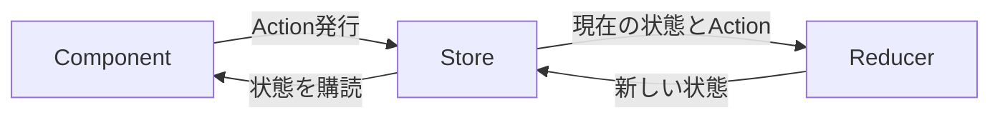

この章では、NgRxの基礎を学びます。土台にあるReduxパターンの考え方、中核となるAction・Reducer・Selector、そして副作用を扱うEffectsを順に見ていきます。

:::message
**この章で学ぶこと**

- 大規模な状態管理が抱える課題
- Reduxパターンの考え方
- `createAction`によるActionの定義
- `createReducer`によるReducerの実装
- Effectsが解決する課題
- `createEffect`と`ofType`によるEffectの実装
:::

## NgRxとReduxパターン

ここまで、自前のStore Serviceで共有状態を管理する方法を学びました。中小規模のアプリなら、それで十分です。しかし、状態が大量にあり、複雑に絡み合い、多くの場所から変更される大規模なアプリケーションでは、自前のStoreでは管理が難しくなります。「この状態は、いつ、どこで、なぜ変わったのか」を追うのが困難になるのです。

この課題に応えるのが、NgRxです。NgRxは、Reduxというパターンにもとづく、Angular向けの状態管理ライブラリです。この節では、まずNgRxの土台にあるReduxパターンの思想を理解します。個々のAPIを学ぶ前に、「なぜこういう仕組みになっているのか」をつかむことが、NgRxを使いこなす鍵になります。NgRxは学習コストが高いと言われますが、その根底にある考え方はシンプルです。

### 大規模な状態管理の課題

自前のStore Serviceは、状態を変更するメソッド（`add`や`remove`）を、自由に増やせました。この自由さは、小規模なうちは便利ですが、大規模になると裏目に出ます。

状態を変更する経路が、あちこちに増えていくと、「この状態が、なぜこの値になったのか」を追うのが難しくなります。複数のComponentやServiceが、それぞれの都合で状態を書き換えると、変更の全体像が見えなくなるのです。さらに、状態の変更にともなう副作用（通信やログなど）が絡むと、複雑さはいっそう増します。

大規模なアプリケーションに必要なのは、「状態の変更を、予測可能で、追跡可能にする」仕組みです。どんな変更も、決まった手順を通してのみ行われる。そうすれば、変更の履歴をたどり、原因を突き止められます。この「規律ある状態変更」を実現するのが、Reduxパターンです。自由に状態を書き換えられる手軽さを、あえて手放し、決まった経路に絞る。その代わりに、変更の全体像を見渡せる力を得る。これがReduxパターンの基本的な発想です。

### Reduxパターンの考え方

Reduxパターンは、状態管理に厳格な規律を課す設計です。その核心は、次の3つの原則にあります。

- **状態は、ひとつの場所にまとめる**: アプリの状態を、単一のStore（ストア）に集約します。状態が散らばらないため、全体像を把握しやすくなります。
- **状態は、直接変更しない**: 状態を書き換えるには、「何が起きたか」を表すAction（アクション）を発行します。直接の代入は行いません。
- **変更は、純粋な関数で行う**: Actionを受けて新しい状態を計算するのは、Reducer（リデューサー）という純粋な関数です。同じ状態とActionからは、常に同じ結果が得られます。

この仕組みでは、状態を変えたいとき、まず「何が起きたか」をActionとして発行します。すると、Reducerがそれを受け取り、現在の状態から新しい状態を計算します。状態の変更は、必ずこの「Action → Reducer」という一方向の流れを通ります。この一方向性は、[『データフローとinput()・output()』の章](./08-data-flow-io)で学んだ単方向データフローの考え方を、アプリケーション全体の状態管理へと拡張したものだと捉えられます。Componentの間だけでなく、状態そのものの変更にも、一定の向きと規律を与えるのです。



変更が必ずこの流れを通るため、「いつ、どんなActionで、状態がどう変わったか」がすべて追跡できます。これが、Reduxパターンがもたらす予測可能性です。

### なぜこんなに回りくどいのか

初めてこの仕組みを見ると、「状態を変えるだけなのに、なぜこんなに手間がかかるのか」と感じるかもしれません。自前のStoreなら、メソッドを呼んで直接書き換えれば済んだことです。

この回りくどさには、理由があります。Reduxパターンは、あえて変更の経路を1本に絞ることで、規律と追跡可能性を得ています。「何が起きたか」がすべてActionとして記録されるため、状態の変更履歴を時系列で追えます。開発ツールを使えば、Actionを巻き戻して過去の状態を再現する、といったことも可能になります。この強力なデバッグ性と予測可能性は、大規模で複雑なアプリケーションほど、価値を発揮します。

つまり、Reduxパターンの手間は、小規模なアプリには過剰ですが、大規模なアプリには必要なコストなのです。この見極めが、後で述べる「NgRxを使うべきか」の判断につながります。

### 不変性という土台

Reduxパターンを支える、もうひとつの重要な原則が、不変性（イミュータビリティ）です。Reducerは、既存の状態を書き換えず、必ず新しい状態オブジェクトを作って返します。[『変更検知の仕組み』の章](./12-change-detection)のOnPushや、[『SignalsとZoneless』の章](./13-signals-and-zoneless)のSignalでも登場した、あの考え方です。

なぜ不変性が必要なのでしょうか。状態を直接書き換えてしまうと、「変更前」と「変更後」を比較できなくなります。新しいオブジェクトとして状態を作れば、前の状態はそのまま残り、参照の比較で変化を検知でき、履歴として保持することもできます。Reduxパターンの追跡可能性は、この不変性の上に成り立っています。状態を「上書きする」のではなく、「新しい状態に置き換える」。この規律が、時間を巻き戻すようなデバッグを可能にするのです。

### 開発ツールによる可視化

Reduxパターンの実利を、もっともよく体感できるのが、開発ツール（DevTools）です。NgRxには、ブラウザの拡張機能と連携する仕組みがあり、これを使うと、発行されたすべてのActionが時系列で一覧表示されます。

各Actionの時点で、状態がどうなっていたかを確認でき、Actionを選んでその時点まで状態を巻き戻す、といった操作もできます。「この画面がおかしくなったのは、どのActionのせいか」を、履歴をたどって突き止められるのです。この強力なデバッグ体験は、すべての状態変更がActionとして記録される、Reduxパターンだからこそ実現します。自前のStore Serviceでは、こうした一元的な可視化は簡単には得られません。大規模なアプリでバグを追うとき、この可視化は大きな助けになります。

DevToolsを使うには、2つの準備をします。ひとつは、ブラウザにReduxの開発拡張機能（Redux DevTools）を入れること。もうひとつは、アプリ側で`@ngrx/store-devtools`パッケージを導入し、`provideStoreDevtools`を登録することです。

```ts:src/app/app.config.ts
import { provideStore } from '@ngrx/store';
import { provideStoreDevtools } from '@ngrx/store-devtools';
import { counterReducer } from './counter.reducer';

export const appConfig: ApplicationConfig = {
  providers: [
    provideStore({ counter: counterReducer }),
    provideStoreDevtools({ maxAge: 25 }),
  ],
};
```

`provideStoreDevtools`は、後述の`provideStore`と並べて登録します。`maxAge`は保持するAction履歴の件数で、ここでは直近25件に絞っています。履歴を無制限に保持するとメモリを圧迫するため、上限を設けておきます。DevToolsは開発時のデバッグを目的とした仕組みのため、本番ビルドでは無効化する構成にするのが一般的です。登録すると、拡張機能のパネルにActionの一覧と各時点の状態が表示され、前述の巻き戻し（タイムトラベルデバッグ）が行えます。

### 自前のStoreとの違い

前章『状態管理の基礎』で学んだ自前のStore Serviceと、NgRx（Reduxパターン）の違いを、あらためて整理します。自前のStoreは、状態を変更するメソッドを自由に定義でき、手軽でした。その代わり、変更経路が増えると追跡が難しくなります。NgRxは、変更を必ずAction経由に強制することで、この追跡可能性を確保します。

言い換えれば、両者は「自由と規律」のトレードオフの関係にあります。自前のStoreは自由で手軽、NgRxは規律が強く追跡しやすい。小規模なら自由の恩恵が勝り、大規模になるほど規律の価値が高まります。どちらが優れているという話ではなく、アプリの規模と複雑さに応じて、必要な規律の強さを選ぶ、と考えるのが正確です。

### NgRxを構成する要素

NgRxは、このReduxパターンをAngular向けに実装したものです。この章で扱う、次のいくつかの要素からなります。

- **Store**: 状態を保持する、単一の場所です。
- **Action**: 「何が起きたか」を表すオブジェクトです。
- **Reducer**: Actionを受けて、新しい状態を計算する純粋な関数です。
- **Selector**: Storeから、必要な状態を取り出す関数です。
- **Effects**: 通信などの副作用を扱う仕組みです。RxJSを活用します。

これらが連携して、Reduxパターンを実現します。ComponentはActionを発行（dispatch）し、Selectorで状態を読み取ります。状態の変更ロジックはReducerに、副作用はEffectsに、それぞれ分離されます。NgRxはRxJSの上に構築されており、[『RxJSの基礎』の章](./16-rxjs-basics)で学んだ知識が、ここで大いに役立ちます。

### 単一の情報源という考え方

Reduxパターンの根底には、「単一の情報源（Single Source of Truth）」という考え方があります。アプリの状態を、あちこちに分散させず、ひとつのStoreに集約する、という原則です。

なぜ、これが重要なのでしょうか。状態が複数の場所に散らばっていると、「同じ情報の、別々のコピー」が生まれ、それらの間で食い違いが起きます。たとえば、ログインユーザーの情報を、複数のComponentがそれぞれ保持していたら、片方だけが更新されて、表示が食い違う、といった不具合が起こります。状態をひとつのStoreに集約すれば、どこから見ても同じ状態を参照するため、こうした食い違いが原理的に起きません。

この「単一の情報源」は、大規模なアプリケーションで、状態の一貫性を保つための強力な原則です。ただし、すべての状態を単一のStoreに集める必要はありません。前章『状態管理の基礎』で分類したように、ローカルな状態まで集約するのは過剰です。共有され、一貫性が重要な状態を、集約の対象と考えます。「共有すべきものは一か所に集める」という原則として捉えてください。

### NgRxを使うべき場面

重要なのは、「NgRxは、いつでも使うべき道具ではない」ということです。NgRxは強力ですが、Action・Reducer・Selectorといった要素を定義するため、記述量が増え、学習コストもかかります。小規模なアプリに導入すると、その手間が利点を上回ってしまいます。

本書が推奨する判断の目安は、次のとおりです。NgRxが向くのは、状態が多く複雑で、多数のComponentから参照・変更され、副作用が絡み、変更の追跡が重要になる大規模なアプリケーションです。逆に、状態が少なく、共有範囲も限られるなら、前章までのSignalベースのStore Serviceで十分です。前章で述べた「小さく始め、必要に応じて育てる」という原則を、ここでも思い出してください。NgRxは、その「育てた先」にある選択肢のひとつです。

また、NgRxには学習コストとチームの習熟という側面もあります。Reduxパターンは、慣れるまでは回りくどく感じられ、チーム全員がその流儀を理解している必要があります。個人開発や小さなチームでは、この習熟コストが負担になることもあります。技術選定は、アプリの規模だけでなく、チームの状況も含めて判断するものです。「大規模だから機械的にNgRx」ではなく、「この規模と体制で、Reduxパターンの規律が本当に見合うか」を問うのが、健全な判断です。なお、次章『NgRxの実務』で学ぶNgRxのSignalStoreは、この学習コストを下げた選択肢でもあり、Reduxほどの厳格さを求めない場合の中間的な選択肢になります。

## Action・Reducer・Selectorの設計

前節で、NgRxの土台にあるReduxパターンの思想を学びました。この節では、その具体的な実装、すなわちAction・Reducer・Selectorの書き方を見ていきます。これらは、NgRx Storeの中核をなす3つの要素です。

Actionは「何が起きたか」を、Reducerは「それを受けて状態をどう変えるか」を、Selectorは「状態からどう読み取るか」を、それぞれ担います。この3つの役割分担が、Reduxパターンの規律を形にします。コード量は増えますが、一つひとつの要素の役割は明確です。この節では、カウンターという単純な例を通して、それぞれの書き方と、連携のしかたを学びます。

### Actionを定義する

Actionは、「アプリの中で何が起きたか」を表すオブジェクトです。`createAction`で定義します。Actionには、それを識別する文字列（type）を与えます。

```ts:src/app/counter.actions.ts
import { createAction, props } from '@ngrx/store';

export const increment = createAction('[Counter] Increment');
export const decrement = createAction('[Counter] Decrement');
export const add = createAction('[Counter] Add', props<{ amount: number }>());
```

`'[Counter] Increment'`のように、`[機能名] 出来事`という形式で名付けるのが慣習です。どの機能で何が起きたかが、一目でわかります。`add`のように、追加の情報（ここでは`amount`）を伴うActionは、`props`で、その情報の型を指定します。Actionは、あくまで「起きたこと」を表すだけで、状態をどう変えるかは決めません。

関連するActionが増えてきたら、`createActionGroup`でまとめて定義する書き方もあります。機能名（`source`）と各イベント（`events`）をまとめて宣言すると、`counterActions.increment()`のようにグループ経由で呼び出せます。

```ts:src/app/counter.actions.ts
import { createActionGroup, emptyProps, props } from '@ngrx/store';

export const counterActions = createActionGroup({
  source: 'Counter',
  events: {
    Increment: emptyProps(),
    Decrement: emptyProps(),
    Add: props<{ amount: number }>(),
  },
});
```

`'[Counter] Increment'`のようなtypeは、`source`とイベント名から自動で組み立てられます。追加情報を持たないActionは`emptyProps()`を使います。個別に`createAction`を並べるより、関連するActionのまとまりが見通しやすくなります。

### Reducerを実装する

Reducerは、Actionを受けて、現在の状態から新しい状態を計算する純粋な関数です。`createReducer`と`on`で定義します。

```ts:src/app/counter.reducer.ts
import { createReducer, on } from '@ngrx/store';
import { increment, decrement, add } from './counter.actions';

export interface CounterState {
  count: number;
}

const initialState: CounterState = { count: 0 };

export const counterReducer = createReducer(
  initialState,
  on(increment, (state) => ({ count: state.count + 1 })),
  on(decrement, (state) => ({ count: state.count - 1 })),
  on(add, (state, { amount }) => ({ count: state.count + amount })),
);
```

`createReducer`の第1引数が初期状態、続く`on`が、各Actionに対する状態の変化です。`on(increment, (state) => ...)`は、「`increment`が来たら、状態をこう変える」という定義です。ここで重要なのは、既存の状態を書き換えず、新しい状態オブジェクトを返していることです。『変更検知の仕組み』の章で学んだ不変性の原則が、Reducerでは必須です。Reducerは純粋な関数であり、同じ入力からは常に同じ出力を返し、副作用（通信など）を持ちません。

### Storeに登録する

定義したReducerは、アプリケーションに登録します。Standalone構成で標準となった`provide`関数の流儀で、`app.config.ts`に`provideStore`を加えます。

```ts:src/app/app.config.ts
import { provideStore } from '@ngrx/store';
import { counterReducer } from './counter.reducer';

export const appConfig: ApplicationConfig = {
  providers: [
    provideStore({ counter: counterReducer }),
  ],
};
```

`provideStore({ counter: counterReducer })`で、`counter`という名前で状態を登録します。これで、アプリ全体でこの状態が使えるようになります。機能ごとに状態を分けて登録する`provideState`もあり、遅延読み込みする機能の状態は、そちらで登録します。

### Selectorで状態を読み取る

Selectorは、Storeから必要な状態を取り出す関数です。`createSelector`で定義します。派生した状態も、Selectorで計算できます。

```ts:src/app/counter.selectors.ts
import { createFeatureSelector, createSelector } from '@ngrx/store';
import { CounterState } from './counter.reducer';

// counter という状態全体を選ぶ
const selectCounter = createFeatureSelector<CounterState>('counter');

// そこから count を取り出す
export const selectCount = createSelector(selectCounter, (state) => state.count);

// 派生した状態（2倍の値）
export const selectDoubled = createSelector(selectCount, (count) => count * 2);
```

`createFeatureSelector`で状態全体を選び、`createSelector`でそこから必要な部分を取り出します。Selectorには、`createSelector`によるメモ化が働き、もとの状態が変わらなければ再計算されません。『SignalsとZoneless』の章の`computed()`と同じ発想です。状態の読み取りをSelectorに集約すると、状態の内部構造が変わっても、Selectorだけを直せば済みます。

### Componentから使う

Componentは、`Store`を注入し、Selectorで状態を読み取り、Actionを発行（dispatch）して状態を変更します。

```ts:src/app/counter.ts
import { Component, inject } from '@angular/core';
import { Store } from '@ngrx/store';
import { increment, add } from './counter.actions';
import { selectCount } from './counter.selectors';

@Component({
  selector: 'app-counter',
  template: `
    <p>{{ count() }}</p>
    <button (click)="store.dispatch(increment())">増やす</button>
  `,
})
export class Counter {
  protected readonly store = inject(Store);
  // Selectorの結果をSignalで受け取る
  protected readonly count = this.store.selectSignal(selectCount);
}
```

`store.selectSignal(selectCount)`で、状態をSignalとして読み取ります。状態を変えるときは、`store.dispatch(increment())`のように、Actionを発行します。Component自身は状態を書き換えず、「増やす、という出来事が起きた」と伝えるだけです。

かつては、状態をObservableとして受け取り、テンプレートで`async`パイプ（AsyncPipe）を使って表示していました。新旧を並べると、次のようになります。

```ts:旧来の書き方（store.select() と async パイプ）
import { Component, inject } from '@angular/core';
import { AsyncPipe } from '@angular/common';
import { Store } from '@ngrx/store';
import { selectCount } from './counter.selectors';

@Component({
  selector: 'app-counter',
  imports: [AsyncPipe],
  // count$ を async パイプで購読する
  template: `<p>{{ count$ | async }}</p>`,
})
export class Counter {
  private readonly store = inject(Store);
  protected readonly count$ = this.store.select(selectCount); // Observable<number>
}
```

`store.select()`が返すのはObservableで、テンプレートでは`async`パイプを通して購読と自動解除を行っていました。モダンNgRxでは`selectSignal`により、`async`パイプを介さず、Signalとして直接扱えます。これまでの章で見てきた、状態の読み取りをSignalへ統一する流れが、NgRxにも及んでいます。

### 役割分担のまとめ

3つの要素の役割を、あらためて整理します。

| 要素 | 役割 | 例える |
|---|---|---|
| Action | 何が起きたかを表す | 「注文が入った」という伝票 |
| Reducer | 状態をどう変えるか | 伝票を見て在庫を更新する係 |
| Selector | 状態をどう読むか | 帳簿から必要な数字を読む係 |

この分業により、状態の変更は必ず「Action発行 → Reducerで計算」という経路を通り、読み取りはSelectorに集約されます。記述は増えますが、それぞれの責務が明確なため、大規模なアプリでも、変更と読み取りの流れを追いやすく保てます。これがReduxパターンの規律の、具体的な姿です。

### createFeatureでまとめる

機能ごとに、状態・Reducer・Selectorを定義していくと、関連するコードが分散しがちです。モダンNgRxには、これらをひとまとめにする`createFeature`という仕組みがあります。機能の名前・Reducerをまとめて定義すると、基本的なSelectorが自動で生成されます。

```ts:src/app/counter.feature.ts
import { createFeature, createReducer, on } from '@ngrx/store';
import { increment, decrement, add } from './counter.actions';

interface CounterState {
  count: number;
}
const initialState: CounterState = { count: 0 };

export const counterFeature = createFeature({
  name: 'counter',
  reducer: createReducer(
    initialState,
    on(increment, (state) => ({ count: state.count + 1 })),
    // decrement・add に対する on は省略
  ),
});

// selectCount などが自動生成される
export const { selectCount } = counterFeature;
```

`createFeature`を使うと、`createFeatureSelector`や、状態の各プロパティに対応するSelectorを、自分で書かずに済みます。定型的なコードが減り、機能ごとのまとまりも明確になります。新しくNgRx Storeを書くなら、`createFeature`を使うのが簡潔です。

### Action・Reducer・Selectorの設計でよくあるつまずき

- **Reducerで状態を直接書き換える**: `state.count++`のように既存の状態を変更すると、変更検知や追跡が壊れます。必ず新しいオブジェクトを返します。
- **Reducerに副作用を書く**: Reducerの中で通信やログ出力をしてはいけません。純粋な関数に保ち、副作用は次の節で扱うEffectsに任せます。
- **ComponentでSelectorを使わず状態を直接読む**: 状態の読み取りは、Selectorに集約します。Componentが状態の内部構造に直接依存すると、構造変更に弱くなります。
- **Actionを状態の「命令」として書く**: Actionは「何が起きたか」という事実を表します。「countをセットせよ」ではなく「増やされた」のように、出来事として名付けます。

## EffectsとRxJSによる非同期処理

前節で学んだReducerは、純粋な関数でした。同じ入力からは同じ出力を返し、通信のような副作用は持ちません。しかし、実際のアプリケーションでは、「保存ボタンが押されたらサーバーへ送信する」「一覧を開いたらデータを取得する」といった副作用が欠かせません。この副作用を、Reduxパターンの規律の中でどう扱うか。その答えが、NgRxのEffects（エフェクト）です。

Effectsは、Actionをきっかけに副作用を実行し、その結果をまた別のActionとして発行する仕組みです。ここで、『RxJSの基礎』の章で学んだRxJSが本領を発揮します。Effectsは、Actionの流れをObservableとして受け取り、`switchMap`や`catchError`といったOperatorで、非同期処理を組み立てます。この節では、Effectsの考え方と書き方を、通信の例を通して学びます。

### なぜEffectsが必要か

Reducerは純粋な関数でなければならない、という制約がありました。この制約は、状態変更を予測可能に保つために重要です。しかし、通信のような副作用は、純粋ではありません。同じActionでも、サーバーの状態次第で結果が変わりますし、時間もかかります。これをReducerに書くことはできません。

そこで、副作用を担う専用の場所として、Effectsが用意されています。Effectsは、Storeの外側で、Actionの流れを監視します。特定のActionが発行されたら、それに反応して副作用（通信など）を実行し、その結果を新しいActionとして発行します。状態の変更（Reducer）と、副作用（Effects）を、きれいに分離するのです。

流れを整理すると、こうです。Componentが「データ取得を要求する」Actionを発行する。Effectsがそれを捉え、通信を実行する。通信が成功したら「取得成功」Action（データ入り）を、失敗したら「取得失敗」Actionを発行する。Reducerがその結果のActionを受けて、状態を更新する。副作用はEffectsに閉じ込められ、Reducerは純粋なまま保たれます。

### Effectを実装する

Effectは、`createEffect`で定義します。中身は、Actionの流れ（Observable）を受け取り、Operatorで処理する、RxJSのパイプラインです。商品一覧の取得を例に見ます。

```ts:src/app/product.effects.ts
import { inject } from '@angular/core';
import { Actions, createEffect, ofType } from '@ngrx/effects';
import { catchError, map, of, switchMap } from 'rxjs';
import { ProductService } from './product.service';
import { loadProducts, loadProductsSuccess, loadProductsFailure } from './product.actions';

export const loadProductsEffect = createEffect(
  () => {
    const actions$ = inject(Actions);
    const service = inject(ProductService);

    return actions$.pipe(
      ofType(loadProducts),                       // このActionだけに反応する
      switchMap(() =>
        service.getProducts().pipe(
          map((products) => loadProductsSuccess({ products })), // 成功Action
          catchError((error) => of(loadProductsFailure({ error }))), // 失敗Action
        ),
      ),
    );
  },
  { functional: true },
);
```

`inject(Actions)`で、アプリ全体のActionの流れを受け取ります。`ofType(loadProducts)`で、その中から`loadProducts`というActionだけを拾います。そのActionが来たら、`switchMap`で通信を実行します。『RxJSの基礎』の章で学んだとおり、`switchMap`は、新しい要求が来たら前の通信を打ち切ります。通信が成功すれば`map`で成功Actionに、失敗すれば`catchError`で失敗Actionに変換します。同章で学んだ`catchError`の使い方が、そのまま活きています。

このEffectは、`{ functional: true }`を付けた関数型で書いています。関数型の`inject()`や関数型Guardで見たのと同じ、関数型APIの流れが、Effectsにも及んでいます。

### 成功と失敗をActionで表す

Effectsの設計で大切なのは、通信の結果（成功・失敗）を、必ずActionとして表すことです。先ほどの例では、`loadProductsSuccess`と`loadProductsFailure`という2つのActionを用意しました。

```ts:src/app/product.actions.ts
export const loadProducts = createAction('[Product] Load');
export const loadProductsSuccess = createAction(
  '[Product] Load Success',
  props<{ products: Product[] }>(),
);
export const loadProductsFailure = createAction(
  '[Product] Load Failure',
  props<{ error: unknown }>(),
);
```

「要求」「成功」「失敗」の3つのActionを1組にするのが、NgRxの定番のパターンです。Reducer側では、これらを受けて状態を更新します。状態には、データ本体に加えて、読み込み中かどうかを表す`loading`と、失敗時の`error`を持たせておくのが定番です。

```ts:src/app/product.reducer.ts
import { createReducer, on } from '@ngrx/store';
import { loadProducts, loadProductsSuccess, loadProductsFailure } from './product.actions';
import { Product } from './product';

export interface ProductState {
  items: Product[];
  loading: boolean;
  error: unknown | null;
}

const initialState: ProductState = { items: [], loading: false, error: null };

export const productReducer = createReducer(
  initialState,
  // 要求: 読み込み中フラグを立て、前のエラーを消す
  on(loadProducts, (state) => ({ ...state, loading: true, error: null })),
  // 成功: データを保存し、読み込み中フラグを下げる
  on(loadProductsSuccess, (state, { products }) => ({ ...state, items: products, loading: false })),
  // 失敗: エラーを記録し、読み込み中フラグを下げる
  on(loadProductsFailure, (state, { error }) => ({ ...state, error, loading: false })),
);
```

`loadProducts`（要求）で`loading`を立て、`loadProductsSuccess`（成功）でデータを保存して`loading`を下ろし、`loadProductsFailure`（失敗）で`error`を記録します。こうしておくと、Componentは`loading`を見てローディング表示を、`error`を見てエラー表示を出せます。通信の各段階が、すべてActionとして記録されるため、本章の最初の節で述べた追跡可能性が保たれます。「いつデータ取得を要求し、いつ成功・失敗したか」が、Actionの履歴として残るのです。

### Effectから状態を参照する

Effectの中で、現在の状態を参照したいことがあります。たとえば「保存するとき、Storeが持っている入力内容を読みたい」といった場合です。このとき、`@ngrx/operators`の`concatLatestFrom`を使うと、Actionと一緒に、Selectorで選んだ状態を受け取れます。

```ts:src/app/product.effects.ts
import { concatLatestFrom } from '@ngrx/operators';
import { Store } from '@ngrx/store';
// import は省略

export const saveProductsEffect = createEffect(
  () => {
    const actions$ = inject(Actions);
    const store = inject(Store);
    const service = inject(ProductService);

    return actions$.pipe(
      ofType(saveProducts),
      concatLatestFrom(() => store.select(selectProducts)), // Actionに状態を添える
      switchMap(([action, products]) => service.save(products).pipe(/* 省略 */)),
    );
  },
  { functional: true },
);
```

`concatLatestFrom`は、対象のActionが来たときにだけ状態を読み取ります（引数を関数で渡すため、遅延評価されます）。Selectorの購読を常時抱え込まずに済むのが利点です。

### Actionを発行しないEffect

Effectは、必ずしも新しいActionを発行するとはかぎりません。画面遷移や通知の表示のように、副作用を起こすだけで状態を変えないEffectもあります。この場合は、`createEffect`の第2引数で`dispatch: false`を指定します。

```ts:src/app/product.effects.ts
import { tap } from 'rxjs';
import { Router } from '@angular/router';
// import は省略

export const redirectAfterSaveEffect = createEffect(
  () => {
    const actions$ = inject(Actions);
    const router = inject(Router);

    return actions$.pipe(
      ofType(saveProductsSuccess),
      tap(() => router.navigate(['/products'])), // 遷移するだけ
    );
  },
  { functional: true, dispatch: false },
);
```

`dispatch: false`を付け忘れると、NgRxはEffectの戻り値を新しいActionとして扱おうとし、警告やエラーの原因になります。「結果のActionを返さないEffectには`dispatch: false`」と覚えておきます。

### Effectsを登録する

作ったEffectsは、`app.config.ts`に`provideEffects`で登録します。

```ts:src/app/app.config.ts
import { provideStore } from '@ngrx/store';
import { provideEffects } from '@ngrx/effects';
import { productReducer } from './product.reducer';
import * as productEffects from './product.effects';

export const appConfig: ApplicationConfig = {
  providers: [
    provideStore({ product: productReducer }),
    provideEffects(productEffects),
  ],
};
```

関数型で定義したEffectは、Effectをまとめたファイルを`import * as productEffects`のように名前空間オブジェクトとして取り込み、それを`provideEffects`に渡して登録します。`createEffect`で公開した各Effectが、このオブジェクトのプロパティとして拾われます。クラスとして定義したEffectの場合は`provideEffects(ProductEffects)`のようにクラスを渡しますが、関数型Effectを`provideEffects([loadProductsEffect])`と配列に入れて渡す形では登録されないので注意してください。これで、対象のActionが発行されたときに、Effectが働くようになります。StoreとEffectsを両方登録することで、状態管理と副作用の仕組みがそろいます。

### Effectsを使ううえでの注意

Effectsは強力ですが、いくつか注意点があります。まず、高階Operatorの選択です。『RxJSの基礎』の章で学んだとおり、`switchMap`（最新優先）・`concatMap`（順番）・`mergeMap`（並行）・`exhaustMap`（先着優先）を、処理の性質に応じて選びます。一覧取得なら`switchMap`、保存の連続なら`concatMap`、二重送信を防ぐ保存ボタンなら`exhaustMap`、といった判断が必要です。

もうひとつは、Effect内でのエラー処理です。`catchError`は、`switchMap`に渡す内側のObservableの中に置きます。もし外側の`actions$`のパイプラインでエラーを捉えてしまうと、そのEffect全体が停止し、以降のActionに反応しなくなります。エラーは内側で捉え、失敗Actionに変換して、外側の流れは止めない。これがEffectsの鉄則です。この点は、実務でつまずきやすいので、意識しておいてください。

### SignalとEffectsの関係

『SignalsとZoneless』の章で学んだSignalの`effect()`と、NgRxのEffectsは、名前が似ていますが、別のものです。混同しないよう整理しておきます。Signalの`effect()`は、Signalの変化に反応して副作用を実行する、Angular本体の機能でした。NgRxのEffectsは、Actionの流れに反応して副作用を実行する、NgRx固有の仕組みです。

両者は目的が異なります。Signalの`effect()`は、主にComponent内の、状態変化に応じた局所的な副作用に使います。NgRxのEffectsは、アプリ全体の状態変更（Action）に紐づく、大きな副作用（通信など）を扱います。NgRxを使う場面では、副作用はEffectsに集約するのが基本です。名前の類似に惑わされず、「Signalの変化に反応するのが`effect()`、Actionに反応するのがEffects」と区別してください。

### EffectsとRxJSによる非同期処理でよくあるつまずき

- **`catchError`を外側に置く**: 前述のとおり、`catchError`を`actions$`の外側パイプラインに置くと、一度のエラーでEffect全体が止まります。内側のObservableに置きます。
- **Effect内で状態を直接書き換える**: Effectsの役割は副作用の実行と、結果のAction発行です。状態を直接変えるのではなく、結果をActionとして発行し、Reducerに任せます。
- **高階Operatorの選び違い**: 保存の連打を`switchMap`で書くと、前の保存が打ち切られてしまいます。処理の性質に応じて`concatMap`や`exhaustMap`を選びます。
- **成功Actionを発行し忘れる**: 通信しただけで結果のActionを発行しないと、状態が更新されません。成功・失敗を必ずActionで表します。

## まとめ

- 大規模な状態管理では、変更を予測可能・追跡可能にする仕組みが必要です
- Reduxパターンは、状態の集約・Actionによる変更・純粋な関数での計算を原則とします
- 変更は「Action → Reducer」の一方向を通るため、履歴を追跡できます
- Actionは`createAction`で定義し、「何が起きたか」を表します
- Reducerは`createReducer`と`on`で実装し、Actionを受けて新しい状態を返す純粋な関数です
- Reducerでは状態を書き換えず、不変な更新を行います
- Effectsは、Actionをきっかけに副作用を実行し、結果を別のActionとして発行します
- 副作用をEffectsに分離することで、Reducerを純粋なまま保てます
- `createEffect`と`ofType`で、特定のActionに反応するパイプラインを書きます

次章では、NgRxを実務で使うためのEntity・Facade、そしてSignalStoreを学びます。
