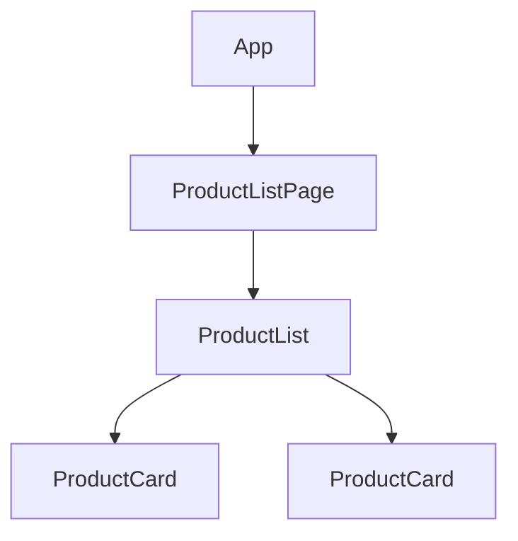

第4部の最初に、個々のAPIを学ぶ前の土台として、Angularにおけるデータの流れ方を整理します。複数のComponentが組み合わさったとき、データはどの向きに、どうやって流れるのか。この原則を先に押さえておくと、続く`input()`・`output()`・`model()`が、なぜその形をしているのかが腑に落ちます。

Angularのデータフローには、明確な方向性があります。この方向性を守ることが、予測しやすく、追いやすいアプリケーションを作る鍵になります。この章では、その原則と、原則を外れたときに何が起きるのかを見ていきます。

:::message
**この章で学ぶこと**

- 親子Component間のデータの流れ
- 単方向データフローという原則
- 入力（下向き）と出力（上向き）の役割分担
- データフローを意識した設計の利点
:::

## Componentは階層をなす

Angularのアプリケーションは、Componentの入れ子によって、木のような階層構造をとります。第6章で学んだように、あるComponentのテンプレートの中に、別のComponentを置けるためです。頂点には`App`があり、その下にページ、さらにその下に部品が連なります。



この階層の中で、Componentどうしはデータをやり取りします。親が持っているデータを子に見せたり、子で起きた操作を親に知らせたりします。問題は、「どの向きに流すか」です。

## 単方向データフロー

Angularが採用しているのは、単方向データフローという考え方です。データは、親から子へ、一方向に流れます。上位のComponentが持つデータが、下位のComponentへと下っていく、という流れが基本です。

なぜ一方向に限るのでしょうか。もし親も子も、たがいのデータを自由に書き換えられたら、ある値がどこで変わったのかを追うのが困難になります。「この表示がおかしいのは、どのComponentのせいなのか」が、わからなくなるのです。データの流れる向きを一方向に定めておけば、値の出どころは常に上位にある、と決まります。原因を上へたどれば、必ず発生源にたどり着けます。

この原則のもとで、親子間のやり取りは、次の2種類に整理されます。

- **入力（下向き）**: 親が持つデータを、子に渡す。プロパティバインディング`[prop]`で行う。
- **出力（上向き）**: 子で起きた出来事を、親に伝える。イベントバインディング`(event)`で行う。

注意したいのは、上向きの「出力」も、データを直接書き換えるものではない点です。子は「こういうことが起きた」と親に通知するだけで、それを受けて実際にデータを変えるのは親です。データの変更権は、常にデータを所有する側にあります。

## 入力 — 親から子へ渡す

親が持つデータを子に見せるには、子側に「受け取り口」を用意し、親のテンプレートからバインディングで渡します。受け取り口が、次章で学ぶ`input()`です。

```ts:src/app/product-card.ts
@Component({
  selector: 'app-product-card',
  template: `<p>{{ product().name }}</p>`,
})
export class ProductCard {
  product = input.required<Product>();
}
```

```html
<!-- 親のテンプレート：子にproductを渡す -->
<app-product-card [product]="selectedProduct()" />
```

親の`selectedProduct()`が、子の`product`入力へと流れ込みます。親の値が変われば、子の表示も自動で更新されます。子は、渡された値を表示することに徹し、自分でそのデータを書き換えようとはしません。

## 出力 — 子から親へ伝える

一方、子で起きた操作を親に伝えるには、子側に「通知口」を用意します。それが第19章で学ぶ`output()`です。子は、ボタンが押されたなどの出来事を、この通知口から送り出します。

```ts:src/app/product-card.ts
@Component({
  selector: 'app-product-card',
  template: `<button (click)="selected.emit(product())">選ぶ</button>`,
})
export class ProductCard {
  product = input.required<Product>();
  selected = output<Product>();
}
```

```html
<!-- 親のテンプレート：子の通知を受け取る -->
<app-product-card [product]="p" (selected)="onSelect($event)" />
```

子はクリックという出来事を`selected`から送り出すだけで、その後どうするかは決めません。受け取った親の`onSelect`が、選択状態を変えるのか、画面を遷移するのかを決めます。出来事の発生と、それへの対応が、きれいに分かれています。

## データフローを意識する利点

入力は下へ、出力は上へ。この流れを徹底すると、いくつもの利点が生まれます。

- **追いやすさ**: ある値がどこで生まれ、どこで変わるのかが、階層をたどれば分かります。
- **再利用性**: 子は「渡されたら表示する」「操作を通知する」だけなので、どの親の下でも同じように使えます。第10章のプレゼンテーションComponentが、まさにこの形です。
- **テストのしやすさ**: 入力を与え、出力を確認する、という明快な形でテストできます。

第10章で「上から下へはデータを、下から上へは出来事を流す」と述べたのは、この単方向データフローのことでした。設計の指針として語ったものが、`input()`・`output()`という具体的なAPIとして実現されているのです。

## 一連の流れを1つの例で見る

入力と出力を組み合わせた、往復の流れを1つの例で追ってみましょう。親が「選ばれた商品」を管理し、子のカードがクリックされたらそれを親に伝え、親が選択を更新する、という場面です。

```ts:src/app/product-list-page.ts
@Component({
  selector: 'app-product-list-page',
  imports: [ProductCard],
  template: `
    @for (p of products(); track p.id) {
      <app-product-card [product]="p" (selected)="select($event)" />
    }
    <p>選択中: {{ selectedName() }}</p>
  `,
})
export class ProductListPage {
  protected readonly products = signal<Product[]>([/* 省略 */]);
  private readonly selectedItem = signal<Product | null>(null);
  protected readonly selectedName = computed(
    () => this.selectedItem()?.name ?? '未選択',
  );

  protected select(product: Product): void {
    this.selectedItem.set(product); // 出力を受けて、親が状態を更新する
  }
}
```

流れを言葉にすると、次のようになります。親の`products`が各カードの`product`入力へ下る（下向き）。カードがクリックされ`selected`が発火する（上向き）。親の`select`がそれを受け、`selectedItem`を更新する。更新は`computed`の`selectedName`に伝わり、表示が変わる。データは常に、渡す・通知する・所有者が更新する、という一定のリズムで動いています。子は一度も、親の状態を直接書き換えていません。この規律が、流れの追いやすさを生みます。

## データフローと変更検知

単方向データフローは、Angularが画面をいつ更新するか、という「変更検知」の仕組みとも深く関わります。データが上から下へ整然と流れることを前提にできるため、Angularは効率よく変更を検知し、必要な箇所だけを描画し直せます。もし双方向に値が飛び交うと、この見通しが崩れ、更新の順序が予測しづらくなります。変更検知そのものは第6部で詳しく扱いますが、単方向データフローが、その効率と予測可能性を支える土台になっている、と押さえておいてください。

## よくあるつまずき

データフローにまつわる、つまずきやすい点を挙げます。

- **子から親のデータを直接書き換えようとする**: 子に渡ってきたオブジェクトの中身を、子が書き換えてしまうと、流れの向きが崩れます。変更は出力で親へ通知し、親に更新してもらいます。
- **出力で値を送らずに済ませようとする**: 「子が持つ最新の値を親が知りたい」ときは、出力で明示的に伝えます。親が子の内部をのぞきにいく設計は、単方向の原則から外れます。
- **深い階層で入力・出力を延々と中継する**: 3階層、4階層とバケツリレーが続くなら、それは単方向データフローの限界のサインです。第5部のServiceや第10部の状態管理を検討する合図と捉えます。

## 親子以外のやり取りはどうするか

単方向データフローは、親子という直接の関係を前提としています。では、親子でないComponent、たとえば遠く離れたComponentどうしや、兄弟Componentの間で状態を共有したいときは、どうすればよいのでしょうか。

`input()`・`output()`だけで無理につなごうとすると、間にあるComponentが、自分には関係のないデータをただ受け渡す「バケツリレー」に陥ります。第10章で触れた、深いバケツリレーの問題です。こうした、階層を越えた状態の共有には、別の仕組みが必要になります。それが、第5部で学ぶServiceと、第10部で学ぶ状態管理です。

この章では、まず親子間の基本的なデータフローを、しっかり押さえておいてください。多くのやり取りは、この単方向の流れで素直に表現できます。階層を越える共有は、その基本を理解したうえで、必要になったときに学べば十分です。どの手段を選ぶ場合でも、「データの変更権は所有者にあり、それ以外は通知で伝える」という単方向の考え方は共通の土台になります。ここで身につけた原則は、Serviceや状態管理を学ぶときにも、そのまま生きてきます。

## まとめ

- Angularのアプリケーションは、Componentが階層をなして構成されます
- データは親から子へ一方向に流れる、単方向データフローが原則です
- 親から子へは入力（`[prop]`）、子から親へは出力（`(event)`）で伝えます
- 出力は通知であり、データを実際に変えるのは所有者である親です
- 親子を越えた状態共有は、Service（第5部）や状態管理（第10部）で扱います

次章では、親から子へデータを渡す入力を、旧来の`@Input`と現在の`input()`を比較しながら詳しく学びます。
