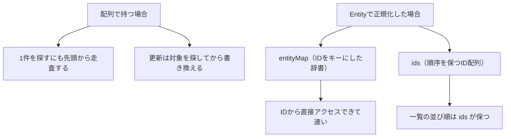
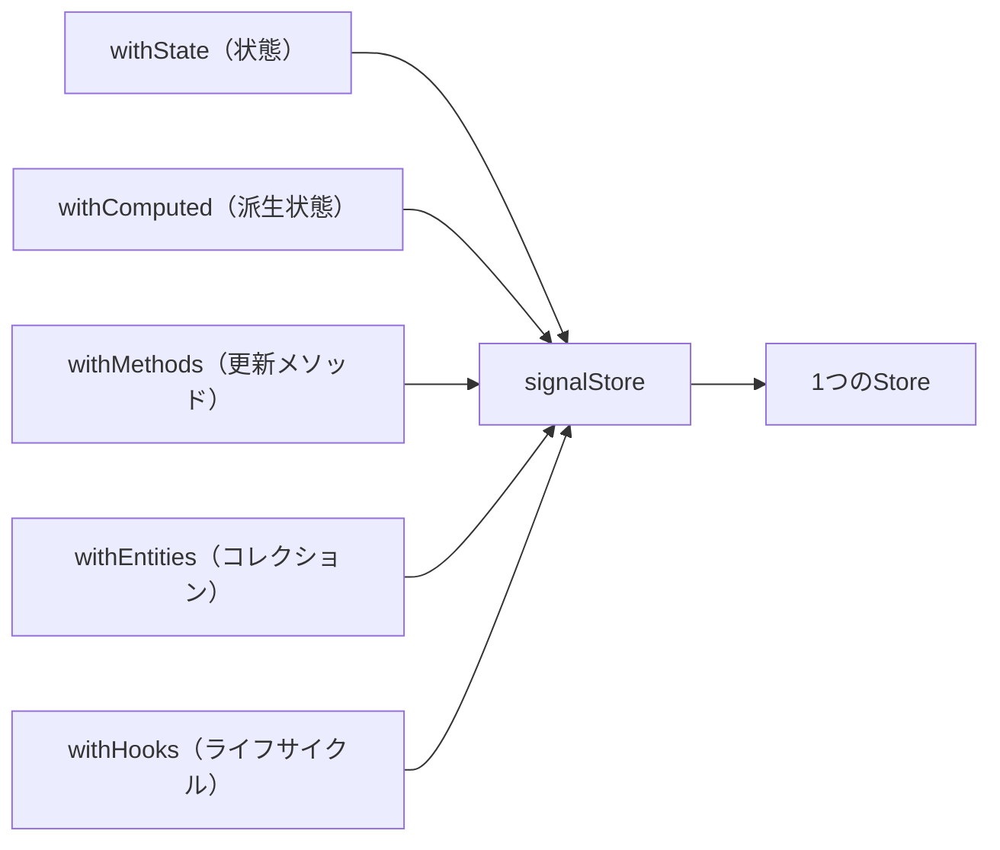

この章では、NgRxを実務で使うための設計を学びます。コレクションを扱うEntity、利用を簡素化するFacadeやRouter Store、そして新しいSignalStoreとの使い分けを扱います。

:::message
**この章で学ぶこと**

- `@ngrx/entity`によるコレクション管理
- Facadeパターンによる利用の簡素化
- NgRx SignalStoreの書き方
- SignalStoreとNgRx Storeの違い
:::

## Entity・Facade・Router Storeによる実務設計

前章までで、NgRxの基本要素（Action・Reducer・Selector・Effects）を学びました。この節では、それらを実務で使うときに役立つ、いくつかの設計パターンを扱います。NgRxを大規模に使うと、定型的なコードが増えたり、Componentからの利用が煩雑になったりします。これらを整理するのが、Entity・Facade・Router Storeといった仕組みです。

これらは、NgRxを「使える」段階から、「うまく設計できる」段階へ進むための道具立てです。すべてを常に使う必要はありませんが、それぞれが何を解決するのかを知っておくと、大規模なアプリの状態管理を、より見通しよく組み立てられます。この節では、それぞれの役割と、いつ使うべきかを解説します。

### Entityによるコレクション管理

アプリでは、「商品の一覧」「ユーザーの一覧」のように、同じ種類のデータの集まり（コレクション）を扱うことがよくあります。こうしたコレクションを、配列で持つと、「特定のIDのものを更新する」「1件を削除する」といった操作を、そのつど自分で書くことになります。これは定型的で、間違いも起きやすい作業です。

`@ngrx/entity`は、このコレクション管理を助ける仕組みです。`createEntityAdapter`が、追加・更新・削除といった定型操作を提供します。

```ts:src/app/product.reducer.ts
import { createEntityAdapter, EntityState } from '@ngrx/entity';
import { createReducer, on } from '@ngrx/store';
import { Product } from './product';
import { loadProductsSuccess, updateProduct } from './product.actions';

export interface ProductState extends EntityState<Product> {
  loading: boolean;
}

export const adapter = createEntityAdapter<Product>();
const initialState: ProductState = adapter.getInitialState({ loading: false });

export const productReducer = createReducer(
  initialState,
  on(loadProductsSuccess, (state, { products }) =>
    adapter.setAll(products, { ...state, loading: false }),
  ),
  on(updateProduct, (state, { product }) =>
    adapter.updateOne({ id: product.id, changes: product }, state),
  ),
);
```

`adapter.setAll`や`adapter.updateOne`が、コレクションの操作を引き受けます。データは、内部的にはIDをキーにした効率的な形で保持されます。自分で配列を操作するより、簡潔で、間違いが減ります。コレクションを扱うNgRxの状態には、Entityを使うのが定石です。

次の図は、コレクションを配列で持つ場合と、Entityで正規化して持つ場合の違いを表します。



Adapterが提供する更新関数は、次のように役割ごとに揃っています。用途に合うものを選んでReducerで呼び出します。

| 更新関数 | 役割 |
|---|---|
| `addOne` / `addMany` | 1件・複数件を追加する（IDが既存なら無視） |
| `setOne` / `setMany` / `setAll` | 1件・複数件を上書き、または全件を置き換える |
| `upsertOne` / `upsertMany` | あれば更新、なければ追加する |
| `updateOne` / `updateMany` | 既存の一部プロパティだけを変更する |
| `removeOne` / `removeMany` / `removeAll` | 指定IDを削除、または全件削除する |

IDの取り出し方や並び順は、`createEntityAdapter`に渡すオプションで変えられます。IDが`id`以外のプロパティなら`selectId`で指定し、一覧の並び順を固定したいなら`sortComparer`を渡します。

```ts
// createEntityAdapter にオプションを渡す例
const adapter = createEntityAdapter<Product>({
  selectId: (product) => product.sku, // IDに使うプロパティ（既定は id）
  sortComparer: (a, b) => a.name.localeCompare(b.name), // 一覧の並び順（省略時は挿入順）
});
```

一覧や件数を取り出すSelectorも、Adapterが`getSelectors()`で提供します。自分で配列を組み立てる必要はありません。

```ts:src/app/product.selectors.ts
import { createFeatureSelector, createSelector } from '@ngrx/store';
import { ProductState, adapter } from './product.reducer';

const selectProductState = createFeatureSelector<ProductState>('products');

// Adapterが基本の4つのSelectorを返す
const { selectAll, selectEntities, selectIds, selectTotal } = adapter.getSelectors();

export const selectAllProducts = createSelector(selectProductState, selectAll);
export const selectProductCount = createSelector(selectProductState, selectTotal);
```

`getSelectors()`が返すのは、次の4つです。

| Selector | 返す値 |
|---|---|
| `selectAll` | 全エンティティの配列（`sortComparer`の順） |
| `selectEntities` | IDをキーにした辞書（`{ [id]: entity }`） |
| `selectIds` | IDの配列 |
| `selectTotal` | 件数 |

これらを`createFeatureSelector`と組み合わせれば、状態のスライスから一覧・件数・特定IDのエンティティを、一貫した形で取り出せます。

## FacadeとRouter Storeで利用側を簡素化する

### Facadeパターンによる簡素化

NgRxをそのまま使うと、Componentは`Store`を注入し、Selectorで読み取り、Actionをdispatchする、という一連を自分で書きます。これは、NgRxの詳細（どんなActionやSelectorがあるか）を、Componentが知っていることを意味します。Componentが多いと、この知識があちこちに散らばります。

Facade（ファサード）パターンは、この複雑さを、ひとつのServiceの裏に隠します。Facadeは、NgRxのStoreをラップし、Componentにわかりやすいメソッドとプロパティを提供します。

```ts:src/app/product.facade.ts
import { Injectable, inject } from '@angular/core';
import { Store } from '@ngrx/store';
import { selectAllProducts, selectLoading } from './product.selectors';
import { loadProducts } from './product.actions';

@Injectable({ providedIn: 'root' })
export class ProductFacade {
  private readonly store = inject(Store);

  // 状態は、わかりやすい名前のSignalで公開する
  readonly products = this.store.selectSignal(selectAllProducts);
  readonly loading = this.store.selectSignal(selectLoading);

  // 操作は、わかりやすいメソッドで公開する
  load(): void {
    this.store.dispatch(loadProducts());
  }
}
```

Componentは、`ProductFacade`を注入し、`facade.products()`で状態を読み、`facade.load()`で操作します。NgRxのActionやSelectorを、直接は知りません。これにより、Componentが単純になり、NgRxの実装を変えても、Facadeの中だけを直せば済みます。ただし、Facadeは層を1つ増やすため、小規模なうちは過剰になることもあります。規模とチームの状況を見て採り入れます。

### Router Storeによるルーティング状態

[『Routerの基礎』の章](./14-router-basics)で、現在のページや検索条件はURLで表す、と学びました。`@ngrx/router-store`は、そのルーティングの状態を、NgRxのStoreと結びつける仕組みです。これを使うと、現在のURLやルートパラメーターを、Selectorで読み取れるようになります。

```ts:src/app/app.config.ts
import { ApplicationConfig } from '@angular/core';
import { provideStore } from '@ngrx/store';
import { provideRouterStore } from '@ngrx/router-store';

export const appConfig: ApplicationConfig = {
  providers: [
    provideStore({ /* ... */ }),
    provideRouterStore(), // ルーティング状態をStoreに統合
  ],
};
```

これにより、「現在のルートパラメーターに応じたデータを、Selectorで組み立てる」といった設計ができます。ルーティングの状態と、アプリの状態を、ひとつのStoreの上で一貫して扱えるのが利点です。ただし、多くの場合は『Routerの基礎』の章で学んだRouterの標準機能で十分であり、Router Storeが必要になるのは、ルーティング状態を他の状態と密に組み合わせたい、限られた場面です。

### パターンの使いどころ

これらのパターンは、いずれも「必要になったら使う」ものです。最初からすべてを導入する必要はありません。判断の目安を示します。

- **Entity**: 同じ種類のデータのコレクションを扱うなら、ほぼ常に有用です。早い段階から使う価値があります。
- **Facade**: Componentが多く、NgRxの詳細を隠したいときに有用です。小規模では過剰になりえます。
- **Router Store**: ルーティング状態を他の状態と密に組み合わせる、特定の要件があるときに使います。

[『状態管理の基礎』の章](./20-state-management-basics)の「小さく始め、必要に応じて育てる」という原則は、NgRxの内部でも当てはまります。基本のAction・Reducer・Selectorから始め、コレクションが増えたらEntityを、利用が煩雑になったらFacadeを、と段階的に採り入れるのが、健全な進め方です。パターンは、複雑さに対処するための道具であって、複雑さを増やすために使うものではありません。

### ファイル構成の指針

NgRxを使うと、ひとつの機能に対して、Action・Reducer・Selector・Effectsと、複数のファイルができます。これらをどう配置するかも、実務では大切です。一般には、機能ごとのフォルダにまとめるのがよいでしょう。

```text
src/app/product/
├── product.actions.ts
├── product.reducer.ts
├── product.selectors.ts
├── product.effects.ts
└── product.facade.ts
```

このように、`product`という機能に関するNgRxのファイルを、ひとつのフォルダに集めます。[『ルーティング応用』の章](./15-router-advanced)で学んだFeature単位の分割と、同じ発想です。機能ごとにまとまっていれば、その機能の状態管理の全体を、一か所で把握できます。遅延読み込みする機能なら、その機能の状態を`provideState`で、機能のルート定義とともに登録します。状態管理のコードも、アプリケーションのFeature構造に沿って整理するのが、大規模開発では重要です。

### Entity・Facade・Router Storeによる実務設計でよくあるつまずき

- **コレクションを素の配列で持つ**: 同種のデータの集まりを配列で持って手作業で更新すると、間違いが増えます。`@ngrx/entity`を使い、定型操作を任せます。
- **最初からFacadeを作る**: 小規模なうちからFacadeを挟むと、層が増えるだけで利点が薄いことがあります。Componentが増え、NgRxの詳細を隠したくなってから導入します。
- **何でもRouter Storeに載せる**: ルーティング状態は、多くの場合Routerの標準機能で足ります。他の状態と密に組み合わせる明確な理由があるときだけ、Router Storeを使います。
- **ファイルを役割別に分けすぎる**: すべてのActionを1ファイル、すべてのReducerを別ファイル、と役割で束ねると、機能をまたいで探し回ることになります。機能ごとにまとめます。

### SignalStoreとの関係

ここで紹介したEntityやFacadeは、主に従来のNgRx Store（Reduxパターン）を前提としたものです。この章の次の節で扱うNgRx SignalStoreでは、状況が少し変わります。SignalStoreは、状態とメソッドをひとつのStoreにまとめる作りのため、Facadeのような「Storeを隠す層」を、多くの場合そもそも必要としません。Store自体が、Componentにとって使いやすいインターフェースになっているからです。

Entityに相当するコレクション管理も、SignalStore向けの部品として提供されています。`@ngrx/signals/entities`の`withEntities`が、それです。この章のタイトルにある「Entity」と「SignalStore」は、ここで合流します。`withEntities<T>()`をStoreに組み込むと、コレクション用のSignal（`entities`）と、IDをキーにした辞書（`entityMap`）、IDの配列（`ids`）が自動で追加されます。

```ts:src/app/book.store.ts
import { signalStore, withState, withMethods, patchState } from '@ngrx/signals';
import {
  withEntities,
  setAllEntities,
  addEntity,
  updateEntity,
  removeEntity,
} from '@ngrx/signals/entities';
import { inject } from '@angular/core';
import { Book } from './book';
import { BookApi } from './book-api';

export const BookStore = signalStore(
  { providedIn: 'root' },
  withState({ loading: false }),
  withEntities<Book>(), // entities・entityMap・ids が追加される
  withMethods((store, api = inject(BookApi)) => ({
    async loadAll(): Promise<void> {
      const books = await api.getAll();
      patchState(store, setAllEntities(books)); // コレクションを丸ごと差し替え
    },
    add(book: Book): void {
      patchState(store, addEntity(book));
    },
    rename(id: string, name: string): void {
      patchState(store, updateEntity({ id, changes: { name } }));
    },
    remove(id: string): void {
      patchState(store, removeEntity(id));
    },
  })),
);
```

`@ngrx/entity`のReducerでは`adapter.setAll`のようにAdapter経由で操作しましたが、SignalStoreでは`@ngrx/signals/entities`が用意する更新関数を`patchState`に渡します。`setAllEntities`（全件置き換え）、`addEntity`／`addEntities`（追加）、`updateEntity`（一部変更）、`removeEntity`（削除）、`setEntity`（1件上書き）が揃っており、`patchState(store, setAllEntities(books))`のように書きます。Componentからは`store.entities()`で一覧のSignalを、そのまま読めます。

IDが`id`以外のときや、1つのStoreで複数のコレクションを持ちたいときは、`entityConfig`で設定します。`selectId`でIDのプロパティを、`collection`でコレクション名を指定すると、`booksEntities`のように接頭辞の付いたSignalが生成されます。

```ts
// entityConfig でIDとコレクション名を設定する例
import { entityConfig } from '@ngrx/signals/entities';
import { type } from '@ngrx/signals';

const bookConfig = entityConfig({
  entity: type<Book>(),
  collection: 'books',           // entities → booksEntities のように分離される
  selectId: (book) => book.isbn, // IDに isbn を使う
});
// signalStore の中で withEntities(bookConfig) のように渡す
```

つまり、ここで学んだパターンの「考え方」は、SignalStoreでも通じますが、その「実現手段」は、選んだStoreの種類によって変わります。パターンの本質（コレクションを効率的に扱う、詳細を隠して使いやすくする）を理解しておけば、どちらのStoreでも応用できます。この章の次の節で、その2つのStoreの選択を、あらためて整理します。

## NgRx SignalStoreとNgRx Storeの使い分け

この章の締めくくりとして、NgRxが提供する2つの状態管理の仕組み、SignalStoreとStoreの使い分けを学びます。ここまで学んできたAction・Reducer・Selectorによる状態管理は、正確には「NgRx Store」と呼ばれる、伝統的な仕組みです。これに対し、NgRxには近年、Signalを土台とした「NgRx SignalStore」という新しい選択肢が加わりました。

SignalStoreは、『状態管理の基礎』の章で自前で書いたSignalベースのStore Serviceを、体系的に、再利用しやすくしたものだと考えると、理解しやすくなります。Reduxパターンの厳格さよりも、簡潔さと使いやすさを重視した設計です。この節では、両者の違いと、どちらをいつ選ぶべきかを整理し、この章を締めくくります。

### NgRx SignalStoreの書き方

SignalStoreは、`signalStore`関数で定義します。状態・派生・メソッドを、`with〜`という部品を組み合わせて宣言します。『状態管理の基礎』の章の自前Store Serviceと、同じカウンターを書いてみます。

次の図は、`signalStore`に`with〜`の部品を合成して、1つのStoreを組み立てる様子を表します。`withEntities`と`withHooks`は、この章の後半で扱う部品です。



```ts:src/app/counter.store.ts
import { signalStore, withState, withComputed, withMethods, patchState } from '@ngrx/signals';
import { computed } from '@angular/core';

export const CounterStore = signalStore(
  { providedIn: 'root' },
  withState({ count: 0 }),
  withComputed(({ count }) => ({
    doubled: computed(() => count() * 2),
  })),
  withMethods((store) => ({
    increment(): void {
      patchState(store, { count: store.count() + 1 });
    },
    add(amount: number): void {
      patchState(store, { count: store.count() + amount });
    },
  })),
);
```

要素を順に見ましょう。`withState`が状態を定義します。`withComputed`が派生状態を、`computed()`で定義します。`withMethods`が、状態を更新するメソッドを定義します。状態の更新は、`patchState`で行います。`patchState(store, { count: ... })`は、指定した部分だけを新しい値に差し替えます。

`{ providedIn: 'root' }`により、このStoreはServiceとして、アプリ全体で共有されます。Componentごとに独立させたい場合は、Componentの`providers`に登録することもできます。[『inject()とProvider・Injectorの階層』の章](./11-inject-and-providers)で学んだ提供の仕組みが、そのまま使えます。

### Componentから使う

SignalStoreは、ふつうのServiceと同じように注入して使います。状態も派生も、Signalとして直接読めます。

```ts:src/app/counter.ts
import { Component, inject } from '@angular/core';
import { CounterStore } from './counter.store';

@Component({
  selector: 'app-counter',
  template: `
    <p>{{ store.count() }}（2倍: {{ store.doubled() }}）</p>
    <button (click)="store.increment()">増やす</button>
  `,
})
export class Counter {
  protected readonly store = inject(CounterStore);
}
```

`store.count()`で状態を、`store.doubled()`で派生状態を、`store.increment()`で更新を行います。NgRx Storeのように、ActionをdispatchしたりSelectorを定義したりする必要はありません。『状態管理の基礎』の章の自前Store Serviceと、使い勝手はほとんど同じです。それでいて、`withComputed`や、通信を扱う`rxMethod`といった部品が用意されており、機能を宣言的に組み立てられます。共通の機能は、`signalStoreFeature`で部品化し、複数のStoreで再利用することもできます。

### SignalStoreで非同期を扱う

SignalStoreにも、非同期を扱う仕組みがあります。`rxMethod`を使うと、RxJSのOperatorを活かした非同期処理を、Storeのメソッドとして組み込めます。あわせて、Storeの生成時に初期ロードを起動する`withHooks`も使ってみます。

```ts:src/app/product.store.ts
import { signalStore, withState, withMethods, withHooks, patchState } from '@ngrx/signals';
import { rxMethod } from '@ngrx/signals/rxjs-interop';
import { tapResponse } from '@ngrx/operators';
import { pipe, switchMap, tap } from 'rxjs';
import { inject } from '@angular/core';
import { Product } from './product';
import { ProductService } from './product-service';

export const ProductStore = signalStore(
  { providedIn: 'root' },
  withState({ products: [] as Product[], loading: false, error: null as string | null }),
  withMethods((store, service = inject(ProductService)) => ({
    load: rxMethod<void>(
      pipe(
        tap(() => patchState(store, { loading: true })),
        switchMap(() =>
          service.getProducts().pipe(
            tapResponse({
              next: (products) => patchState(store, { products, loading: false }),
              error: (err: Error) =>
                patchState(store, { error: err.message, loading: false }),
            }),
          ),
        ),
      ),
    ),
    // 型引数を string にすると、値・Observable・Signal を渡せる
    search: rxMethod<string>(
      pipe(
        switchMap((keyword) =>
          service.search(keyword).pipe(
            tapResponse({
              next: (products) => patchState(store, { products }),
              error: (err: Error) => patchState(store, { error: err.message }),
            }),
          ),
        ),
      ),
    ),
  })),
  withHooks({
    onInit(store) {
      store.load(); // Store生成時に一覧を自動ロード
    },
  }),
);
```

`rxMethod`には、[『RxJSの基礎』の章](./16-rxjs-basics)で学んだ`switchMap`などのOperatorを、そのまま渡せます。NgRx Storeでは、この非同期処理をEffectsという別の仕組みに切り出す必要がありましたが、SignalStoreでは、Storeの中にメソッドとして書けます。ActionもReducerも介さず、状態と非同期処理が、ひとつのStoreにまとまるのです。この簡潔さが、SignalStoreの大きな魅力です。

末尾の`withHooks`は、Storeのライフサイクルに処理を差し込む部品です。`onInit`はStoreが生成された直後に一度だけ呼ばれ、`onDestroy`は破棄時に呼ばれます。初期データのロードを起動する定番の置き場所が、この`onInit`です。`onInit(store) { store.load(); }`と書けば、Storeを使い始めた時点で一覧が自動的に読み込まれます。フックの中はinjection contextのため、`inject()`で追加の依存を取得することもできます。

`rxMethod`のもう一つの特長は、引数にSignalを渡せる点です。Signalを渡すと、その値が変わるたびにメソッドが自動で再実行されます。検索キーワードのSignalを`search`に渡しておくと、キーワードの変化に追従して検索が走ります。手作業で`effect`や購読を書かなくても、入力と通信が連動します。

```ts:src/app/product-page.ts
import { Component, inject, signal } from '@angular/core';
import { ProductStore } from './product.store';

@Component({
  selector: 'app-product-page',
  template: `<!-- 省略 -->`,
})
export class ProductPage {
  private readonly store = inject(ProductStore);
  protected readonly products = this.store.products;
  protected readonly keyword = signal('');

  constructor() {
    // keyword が変わるたびに search が再実行される
    this.store.search(this.keyword);
  }
}
```

:::message
`rxMethod`の内側のストリームは、一度エラーが流れると購読が終了し、以降は呼び出しても反応しなくなります。これを避けるため、通信の`pipe`の中で必ずエラーを処理します。`@ngrx/operators`の`tapResponse`は、成功（`next`）と失敗（`error`）を1か所で受け取れて便利です。`catchError`でエラーを受け止め、ストリームを継続させる形でもかまいません。エラー処理を入れ忘れると、最初の通信失敗でStoreが沈黙する、気づきにくい不具合になります。
:::

### SignalStoreとNgRx Storeの違い

2つの仕組みの違いを、表に整理します。

| 観点 | NgRx Store | NgRx SignalStore |
|---|---|---|
| 土台 | RxJS・Reduxパターン | Signal |
| 状態変更 | Action → Reducer | `patchState` |
| 読み取り | Selector | Signalを直接読む |
| 記述量 | 多い | 少ない |
| 追跡可能性 | 高い（Action履歴） | 中程度 |
| 学習コスト | 高い | 低め |

NgRx Storeは、Action・Reducer・Selectorという厳格な構造により、変更の追跡可能性が高く、大規模で複雑な状態に強みがあります。その代わり、記述量が多く、学習コストも高めです。

SignalStoreは、Signalを直接扱う簡潔さが魅力です。記述量が少なく、Componentからの利用も単純です。Reduxほどの厳格な追跡可能性はありませんが、多くのアプリには、これで十分な構造化がもたらされます。

### それぞれが向く場面

では、どちらを選ぶべきでしょうか。判断の指針を示します。

**SignalStoreが向く場面**は、幅広くあります。中規模のアプリ、機能ごとのまとまった状態、Signalベースで一貫して書きたい場合です。記述が少なく、モダンAngularとの相性もよいため、新規開発では、まずSignalStoreを検討するのがよいでしょう。『状態管理の基礎』の章の自前Store Serviceで物足りなくなったら、その自然な発展先になります。

**NgRx Store（従来のStore）が向く場面**は、より限定的です。非常に大規模で、状態の変更を厳密に追跡する必要があり、Action履歴によるデバッグや、時間を巻き戻すような高度な開発体験が重要な場合です。また、すでにNgRx Storeで書かれた大規模な既存プロジェクトも、当然その延長で保守します。

本書が推奨するのは、「まずSignalベース（自前のStore ServiceやSignalStore）から検討し、Reduxパターンの厳格な追跡可能性が本当に必要なときに、NgRx Storeを選ぶ」という方針です。かつては大規模状態管理といえばNgRx Storeが定番でしたが、Signalの登場で、選択肢が広がりました。

### 状態管理全体のまとめ

状態管理を扱ってきたここまでの流れを通して、選択肢を段階的に見てきました。ここで全体を振り返り、選択の地図を示します。

- **ローカルな状態**: ComponentのSignal（『状態管理の基礎』の章）
- **共有される状態（小〜中規模）**: 自前のStore Service（Signalベース、『状態管理の基礎』の章）
- **共有される状態（中〜大規模）**: NgRx SignalStore（本節）
- **大規模で厳密な追跡が必要**: NgRx Store（前章『NgRxの基礎』と本章）

大切なのは、規模と要件に応じて選ぶことです。小さなアプリに大掛かりな仕組みを持ち込めば、複雑さだけが増します。逆に、大規模なアプリを自前のStoreで押し通せば、管理が破綻します。状態を分類し（『状態管理の基礎』の章）、その性質と規模に見合った手段を選ぶ。この判断こそ、状態管理の設計の核心です。

### NgRx SignalStoreとNgRx Storeの使い分けでよくあるつまずき

- **SignalStoreとNgRx Storeを混在させる**: ひとつのアプリで両方を使うと、状態管理の方針がぶれます。原則、どちらかに寄せます。
- **SignalStoreの状態を外から直接変える**: 状態の変更は、`withMethods`で定義したメソッドと`patchState`を通します。Storeの外から勝手に変えると、変更経路が追えなくなります。
- **不要なのにNgRx Storeを選ぶ**: 「大規模＝NgRx Store」と短絡せず、SignalStoreで足りないか、Action履歴による追跡が本当に要るかを見極めます。
- **状態管理を導入すること自体が目的になる**: 状態管理は手段です。まずComponentのSignalやServiceで足りないかを考え、必要になってから段階的に導入します。

## まとめ

- `@ngrx/entity`は、コレクションの追加・更新・削除を`createEntityAdapter`で簡潔に扱います
- Facadeパターンは、NgRxの詳細をServiceの裏に隠し、Componentを単純にします
- `@ngrx/router-store`は、ルーティング状態をStoreに統合します
- NgRx SignalStoreは、`signalStore`で状態・派生・メソッドを宣言的に組み立てます
- 状態は`patchState`で更新し、Signalとして直接読み取れます
- NgRx Storeは追跡可能性に優れ、SignalStoreは簡潔さに優れます

次章からは、実務的なAngular開発の総仕上げに入ります。
