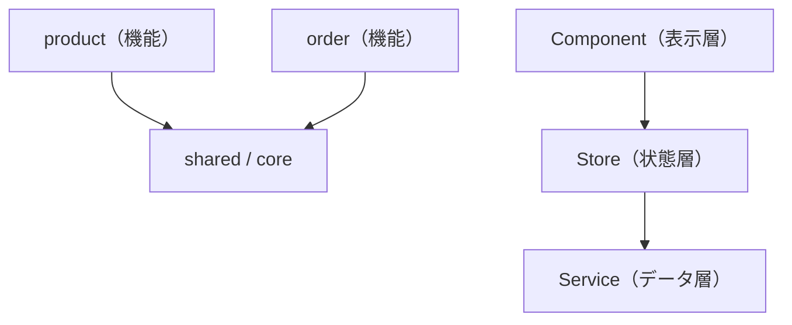

この章では、アプリケーション全体の構造と品質を扱います。アーキテクチャ設計の原則と、ComponentやService、そしてRxJS・NgRx・非同期処理のテスト戦略を学びます。

:::message
**この章で学ぶこと**

- 機能（Feature）単位の分割
- レイヤーによる責務の分離
- Angularのテスト環境（Vitest）
- Serviceのテスト
- Observableのテスト
- 非同期処理を待つ方法
:::

## Angularアプリケーションのアーキテクチャ設計

これまで、Component・Service・Router・状態管理と、アプリケーションを構成する部品を個別に学んできました。この節では、視点を最大限に引き上げ、それらを組み合わせてアプリケーション全体をどう構造化するか、というアーキテクチャ設計を扱います。

アーキテクチャとは、アプリケーションの骨格です。どこに何を置き、部品どうしがどう依存するかという、全体の秩序を定めます。よいアーキテクチャは、規模が大きくなっても見通しを保ち、変更を局所化し、複数人での開発を支えます。逆に、秩序のないアプリは、規模とともに複雑さが爆発し、やがて手がつけられなくなります。この節では、Angularアプリを健全に育てるための、設計の原則と実践を学びます。

### 機能単位で分割する

大規模なアプリケーションを構造化する、もっとも基本的な軸が、機能（Feature）単位の分割です。[『ルーティング応用』の章](./15-router-advanced)のLazy Loadingでも触れましたが、アプリを「商品」「注文」「管理」といった業務上のまとまりで分け、それぞれを独立したフォルダにまとめます。

```text
src/app/
├── product/      … 商品機能
├── order/        … 注文機能
├── admin/        … 管理機能
├── shared/       … 複数機能で共有する部品
└── core/         … アプリ全体の基盤（認証、設定など）
```

この分割の利点は、関連するものが一か所に集まることです。商品に関するComponent・Service・状態・ルートは、すべて`product/`の中にあります。ある機能を理解したいとき、そのフォルダだけを見ればよく、変更の影響範囲もその中に収まりやすくなります。『ルーティング応用』の章で学んだ`loadChildren`による遅延読み込みも、この機能単位の分割と、そのまま対応します。設計上の分割と、性能上の分割が一致するのです。

この「関連するものを近くに置く」という考え方は、コロケーションと呼ばれます。あるComponentと、それだけが使うServiceや型は、離れた共通フォルダに置くより、そのComponentのそばに置くほうが、見通しがよくなります。「一緒に変更されるものは、一緒に置く」という原則です。逆に、機能をまたいで役割別に分ける（すべてのServiceを一箇所、すべてのComponentを別の一箇所）と、ひとつの機能を追うのに、複数の場所を行き来することになります。役割ではなく、機能とまとまりで分けるのが、大規模開発では扱いやすい構成です。

`shared/`には、複数の機能で使い回す汎用的な部品を、`core/`には、認証やアプリ全体の設定といった、基盤となる仕組みを置きます。機能に属さないものの置き場所を、あらかじめ決めておくと、迷いが減ります。

### レイヤーで責務を分ける

機能という縦の分割に加えて、レイヤー（層）という横の分割も意識します。ひとつの機能の中でも、役割の異なる部品を、層として分けるのです。本書で学んできた要素は、おおむね次の層に整理できます。

- **表示層（Component）**: 画面の見た目と操作を担う。Component・テンプレート・データフローの章。
- **状態層（Store・Service）**: 状態を保持し、業務ロジックを担う。ServiceとDI・状態管理の章。
- **データアクセス層（Service・HttpClient）**: サーバーとの通信を担う。HTTP通信の章。

Componentは状態層に依存し、状態層はデータアクセス層に依存する。この層構造を意識すると、責務がきれいに分かれます。[『ServiceとDependency Injection』の章](./10-service-and-di)で学んだ「Componentは薄く、処理はServiceへ」という原則は、このレイヤー分割の一部です。表示・状態・データという層の分離が、アプリ全体を見通しよく保ちます。この層の考え方は、機能内でも機能をまたいでも一貫して適用でき、どの規模のアプリでも通用する基本になります。

### 依存の方向を整える

アーキテクチャで、機能分割やレイヤー分割と並んで重要なのが、依存の方向です。「どの部品が、どの部品に依存してよいか」を定め、その向きを守ります。

基本原則は、「依存は、内側（安定したもの）へ向ける」ことです。具体的には、表示層は状態層に依存してよいが、その逆はいけません。また、機能どうしは、原則として直接依存させず、共有が必要なら`shared/`や`core/`を介します。`product/`が`order/`に直接依存すると、両者が密結合になり、片方の変更がもう片方に波及します。



依存の方向が一定に保たれていると、変更の影響が予測できます。安定した基盤（`core/`）は、めったに変わらず、多くの部品から依存されます。個々の機能は、頻繁に変わるかもしれませんが、他の機能から依存されないため、安心して変更できます。この「変わりにくいものに依存し、変わりやすいものには依存されない」構造が、変更に強いアーキテクチャの核心です。

### 適切な粒度を保つ

分割は、細かすぎても粗すぎても問題です。[『Componentの構成技法と分割設計』の章](./05-component-composition)でComponentの分割について述べたのと同じ悩みが、アプリ全体の設計にも当てはまります。

機能を細かく分けすぎると、機能間のやり取りが増え、かえって複雑になります。逆に、ひとつの機能に何もかも詰め込むと、その機能が肥大化し、`shared/`のような共有領域が、雑多な置き場になってしまいます。目安は、その章と同じく「名前を付けられるまとまりか」です。`product`のように、役割を言い表せる単位で分けます。

そして、アーキテクチャも、最初にすべてを決めきる必要はありません。[『状態管理の基礎』の章](./20-state-management-basics)と同じく、小さく始め、規模の拡大に応じて構造を育てるのが現実的です。最初は`app/`直下に平らに置き、機能が増えてきたらフォルダに分ける、という進め方でも構いません。過剰な設計を避け、必要に応じて構造を整えていきます。

### スタイルガイドに沿う

Angularには、公式のスタイルガイドがあります。ファイルの命名、フォルダの構成、Componentの書き方など、推奨される慣習がまとめられています。本書がこれまで従ってきた、型サフィックスなしのファイル名（[『開発環境・CLIとプロジェクト構成』の章](./03-setup-and-structure)）や、セレクターの命名規則（[『TypeScriptとComponentの基本』の章](./04-component-basics)）も、このスタイルガイドにもとづくものです。

チームで開発するとき、こうした共通の規約に沿うことには、大きな価値があります。誰が書いても一定の形になり、他の人のコードも読みやすくなります。独自の流儀を編み出すより、広く知られた公式の慣習に従うほうが、長期的には保守しやすいアプリになります。アーキテクチャ設計も、この「共通の理解に沿う」という姿勢の延長線上にあります。

### 循環依存を避ける

依存の方向を整えるうえで、とくに避けたいのが、循環依存です。循環依存とは、「AがBに依存し、BもAに依存する」という、たがいに依存し合う状態です。こうなると、片方を理解するのに、もう片方が必要になり、切り離してテストすることも、片方だけを変更することも難しくなります。

循環依存は、多くの場合、責務の分担があいまいなことのサインです。たとえば、2つの機能が、たがいの内部を直接参照し合っているなら、その共通部分を`shared/`や`core/`に切り出すべきかもしれません。あるいは、状態層とデータ層が混ざっているなら、層の分離を見直します。循環依存が見つかったら、それを機械的に解消するのではなく、「なぜ循環が生まれたのか」という設計の問いに立ち返ることが大切です。依存の向きを一方向に保つ規律が、循環を未然に防ぎます。

### 状態の置き場所も設計の一部

状態管理の章で学んだ内容も、アーキテクチャ設計の重要な一部です。どの状態を、どの層・どの機能に置くかは、アプリ全体の構造に関わります。『状態管理の基礎』の章で状態を分類したように、ローカルな状態はComponentに、機能内で共有する状態はその機能のStoreに、アプリ全体で共有する状態は`core/`のStoreに、と配置します。

状態の置き場所が適切なら、依存の方向も自然に整います。共有すべき状態を末端のComponentに置いたり、ローカルで済む状態をアプリ全体のStoreに載せたりすると、依存が入り組みます。「この状態はどこが持つべきか」という問いは、アーキテクチャ設計そのものです。機能分割、レイヤー、依存の方向、状態配置は連動してアプリの構造を形づくります。

### 規模の拡大とチーム開発

アーキテクチャの真価は、アプリとチームが大きくなったときに表れます。開発者が数人から数十人に増えると、「誰がどこを触っても壊れない」構造が、決定的に重要になります。機能単位の分割は、この点で効きます。各開発者が、担当する機能フォルダの中で作業でき、他の機能への影響を心配せずに済むためです。

さらに大規模になると、ひとつのリポジトリで複数のアプリやライブラリを管理する、モノレポという構成が選ばれることもあります。Angularは、こうした大規模構成とも相性がよく、共通のライブラリを複数のアプリで共有する、といった設計が可能です。本書では詳しく立ち入りませんが、アーキテクチャの原則、すなわち「機能で分け、層で分け、依存の向きを整える」は、規模が大きくなるほど、その価値を増します。逆にいえば、小規模なうちに、これらの原則を意識して構造を保っておくことが、将来の拡大に備えることになります。設計は、いまのためだけでなく、将来の自分やチームのためにも行うものです。

### Angularアプリケーションのアーキテクチャ設計でよくあるつまずき

- **最初から作り込みすぎる**: 小さなアプリに、多層のフォルダや厳密な層分けを持ち込むと、かえって煩雑です。規模に見合った構造から始め、必要に応じて育てます。
- **`shared/`が雑多な置き場になる**: 「どこにも属さないもの」を安易に`shared/`へ入れ続けると、そこが巨大なゴミ箱になります。本当に共有されるものだけを置き、定期的に見直します。
- **機能どうしが直接依存する**: ある機能が別の機能の内部を直接参照すると、密結合になります。共有が必要なら、共通の場所を介します。
- **アーキテクチャを目的化する**: 立派な構造を作ること自体が目的になっては本末転倒です。構造は、変更のしやすさと見通しのための手段だと、常に意識します。
- **層をまたいで近道する**: Componentからデータ層を直接呼ぶなど、層を飛ばすと、一時的には楽でも、責務の境界が崩れます。層を通す規律を保ちます。
- **循環依存を放置する**: たがいに依存し合う関係は、責務のあいまいさのサインです。共通部分を切り出すなどして、依存の向きを一方向に整えます。

## テストの基礎とComponent・Serviceのテスト — TestBed・Harness・Vitest

アプリケーションを長く安全に育てるには、テストが欠かせません。テストは、コードが期待どおり動くことを自動で確認する仕組みです。手作業での確認と違い、何度でも、すばやく、もれなく実行できます。変更のたびにテストを走らせれば、それまで動いていた機能を壊していないかを、すぐに確かめられます。

この節では、Angularにおけるテストの基礎を学びます。テストの土台となるTestBed、Componentのテスト、Serviceのテスト、そしてComponent Harnessという道具を扱います。本書が基準とするv22では、テストの実行環境がVitestになりました。この新しい既定にも触れながら、テストの考え方と書き方を身につけます。

### テストの種類と実行環境

テストには、いくつかの種類があります。ひとつの関数やクラスを対象とする単体テスト（ユニットテスト）、複数の部品の連携を確かめる結合テスト、アプリ全体を通しで動かすE2E（エンドツーエンド）テストです。この節では、主に単体テストと、Componentの結合テストを扱います。

Angularでは、テストの実行環境（テストランナー）として、長らくKarmaとJasmineが使われてきました。しかし、Karmaはすでに非推奨となり、v22ではVitestが新規プロジェクトの既定になりました。Vitestは、高速で、設定も簡潔なモダンなテストランナーです。新規プロジェクトを`ng new`で作ると、Vitestとその実行に必要なものが用意されます。テストは、『開発環境・CLIとプロジェクト構成』の章で学んだCLIの`ng test`で実行します。

```bash
ng test
```

このコマンドで、アプリをテスト用にビルドし、Vitestがテストを実行します。既存のKarmaベースのプロジェクトも動きますが、新しく始めるならVitestが標準です。テストの書き方（`describe`や`it`、`expect`といった記法）は、Vitestでも従来とよく似ており、これまでの知識の多くがそのまま活きます。

Vitestには、テストダブルを作るための独自のAPIがあります。`vi.fn()`は、呼び出しを記録するモック関数を作り、`vi.spyOn(obj, 'method')`は既存メソッドの呼び出しを監視します。

```ts
const getUsers = vi.fn().mockReturnValue([{ id: '1', name: '山田' }]);
const saveSpy = vi.spyOn(service, 'save');

service.save({ id: '1' });
expect(saveSpy).toHaveBeenCalled();
```

`ng test`は既定でwatchモードで起動し、ファイルを保存するたびに関連するテストだけを再実行します。開発中は、この即時のフィードバックがテストを書く習慣を支えます。テストがコードのどれだけを実行したかを示すカバレッジの計測にも対応しており、テストが手薄な箇所を見つける手がかりになります。

### Serviceをテストする

もっとも書きやすいのが、Serviceのテストです。とくに、『ServiceとDependency Injection』の章で学んだ「状態を持たないService」は、入力に対する出力を確かめるだけなので、単純です。

```ts:src/app/pricing.spec.ts
import { PricingService } from './pricing';

describe('PricingService', () => {
  it('税込価格を計算する', () => {
    const service = new PricingService();
    expect(service.withTax(1000)).toBe(1100);
  });
});
```

`describe`でテストのまとまりを、`it`で個々のテストを表します。`expect(...).toBe(...)`で、「この値は、これと等しいはずだ」という期待を書きます。実際の値が期待と違えば、テストは失敗します。このServiceは依存を持たないため、`new`して直接テストできます。

依存を持つServiceは、その依存を偽物に差し替えてテストします。『ServiceとDependency Injection』の章で学んだDIの利点、「差し替えが容易」が、ここで活きます。本物の通信Serviceの代わりに、決まったデータを返す偽物を注入すれば、通信なしでロジックを確かめられます。

### TestBedでComponentをテストする

Componentのテストは、Serviceより少し複雑です。Componentは、テンプレートやDIと結びついているため、それらを含めた環境を用意する必要があります。その環境を作るのが、TestBedです。

```ts:src/app/greeting.spec.ts
import { TestBed } from '@angular/core/testing';
import { Greeting } from './greeting';

describe('Greeting', () => {
  it('名前を表示する', () => {
    const fixture = TestBed.createComponent(Greeting);
    fixture.componentRef.setInput('name', '山田');
    fixture.detectChanges(); // 変更検知を走らせる

    const text = fixture.nativeElement.textContent;
    expect(text).toContain('山田');
  });
});
```

`TestBed.createComponent`で、テスト対象のComponentを生成します。返ってくる`fixture`（フィクスチャ）は、そのComponentと、そのDOMへのアクセスを束ねたものです。`setInput`で入力を与え、`detectChanges()`で変更検知を走らせて、表示を更新します。そのうえで、`nativeElement`からDOMのテキストを取り出し、期待どおりかを確かめます。「入力を与え、表示を確認する」という、[『データフローとinput()・output()』の章](./08-data-flow-io)で学んだデータフローが、そのままテストの形になります。

要素を探す方法は、`nativeElement`のテキストを見るだけではありません。`fixture.debugElement`が返す`DebugElement`を使うと、`By.css()`のセレクターで特定の要素を絞り込めます。

```ts
import { By } from '@angular/platform-browser';

const title = fixture.debugElement.query(By.css('h1'));
expect(title.nativeElement.textContent).toContain('山田');
```

`query()`は最初に一致した1件、`queryAll()`は一致した全要素を返します。特定のボタンやリンクだけを対象にしたいときに役立ちます。

### Component Harnessで安定させる

Componentのテストで、DOMを直接調べると、ひとつ問題があります。テンプレートの構造（HTMLの組み立て方やクラス名）に、テストが依存してしまうことです。見た目を少し変えただけで、動作は同じなのにテストが壊れる、ということが起こります。

この問題を解決するのが、Component Harness（コンポーネントハーネス）です。`@angular/cdk/testing`が提供する仕組みで、Componentを、その内部構造ではなく、「役割」を通して操作します。たとえば、ボタンのHarnessなら、「そのボタンをクリックする」という操作を、DOMの詳細を知らずに行えます。

Harnessを使うと、テンプレートの構造が変わっても、役割が同じならテストは壊れません。テストが、実装の細部ではなく、振る舞いに向くようになります。Angular Materialのような部品ライブラリは、Harnessを提供しており、それらを使ったテストを安定して書けます。自作のComponentにも、Harnessを用意できます。DOMを直接調べるテストより、Harnessを使うほうが、長期的に壊れにくいテストになります。

Harnessは、テスト環境と結びつけて読み込みます。`@angular/cdk/testing/testbed`の`TestbedHarnessEnvironment`から`HarnessLoader`を取得し、そこから目的のHarnessを`getHarness()`で取り出します。次は、Angular Materialのボタンを`MatButtonHarness`経由でクリックする最小例です。

```ts:src/app/login-form.spec.ts
import { TestBed } from '@angular/core/testing';
import { TestbedHarnessEnvironment } from '@angular/cdk/testing/testbed';
import { HarnessLoader } from '@angular/cdk/testing';
import { MatButtonHarness } from '@angular/material/button/testing';
import { LoginForm } from './login-form';

it('送信ボタンを押すと送信済みになる', async () => {
  const fixture = TestBed.createComponent(LoginForm);
  const loader: HarnessLoader = TestbedHarnessEnvironment.loader(fixture);

  // 「送信」というテキストを持つボタンのHarnessを取得してクリックする
  const button = await loader.getHarness(MatButtonHarness.with({ text: '送信' }));
  await button.click();

  expect(fixture.componentInstance.submitted()).toBe(true);
});
```

Harnessの操作はいずれもPromiseを返す非同期処理のため、テストを`async`にし、`await`で待ちます。クラス名やDOMの階層に触れず、「送信ボタンをクリックする」という意図だけを書けるので、テンプレートを変えてもテストが壊れにくくなります。

### 何をテストすべきか

テストは、書けば書くほどよい、というものではありません。すべてを網羅しようとすると、テストの保守自体が負担になります。優先すべきは、次のようなものです。

- **業務ロジック**: 価格計算や、複雑な条件判断など、間違えると影響が大きい部分。
- **状態の変化**: Store（状態管理の章）の、Actionやメソッドによる状態変化。
- **重要な分岐**: エラー処理や、権限による表示の出し分けなど。

逆に、単純な表示だけのComponentや、フレームワークが保証している部分まで、細かくテストする必要は薄いものです。『ServiceとDependency Injection』の章で責務を分離し、業務ロジックをServiceに切り出しておくと、この「重要な部分」がテストしやすい形になります。テストのしやすさは、設計のよさと表裏一体なのです。

### Signalとテスト

Signalベースのコードは、テストがしやすいという特長もあります。Signalは、`()`で現在の値を同期的に読めるため、テストの中で状態を確認するのが簡単です。`computed()`による派生値も、依存するSignalをセットして、結果を読むだけで確かめられます。

```ts:src/app/cart.spec.ts
it('商品を追加すると合計が増える', () => {
  const store = new CartService();
  store.add({ id: '1', name: '本', price: 500, quantity: 1 });

  expect(store.totalPrice()).toBe(500);
});
```

`store.totalPrice()`を呼ぶだけで、派生した合計金額を確認できます。RxJSのObservableのように購読を管理する必要がなく、非同期の完了を待つ必要もありません。[『SignalsとZoneless』の章](./13-signals-and-zoneless)で学んだSignalが、状態管理だけでなく、テスト容易性の面でも利点をもたらすのです。モダンAngularのSignalファーストな書き方は、テストのしやすさという形でも報われます。

### 依存を差し替えてテストする

依存を持つComponentやServiceのテストでは、その依存を偽物に差し替えます。『ServiceとDependency Injection』の章で学んだDIの「差し替えが容易」という利点が、ここで具体的に活きます。TestBedの`providers`で、本物の代わりに偽物を登録します。

```ts:src/app/user-list.spec.ts
import { TestBed } from '@angular/core/testing';
import { UserList } from './user-list';
import { UserService } from './user';

it('ユーザー一覧を表示する', () => {
  // 本物のUserServiceの代わりに、決まったデータを返す偽物を登録する
  const fakeService = { getUsers: () => [{ id: '1', name: '山田' }] };

  TestBed.configureTestingModule({
    providers: [{ provide: UserService, useValue: fakeService }],
  });

  // UserListを生成する。内部で偽物のgetUsers()が呼ばれる
  const fixture = TestBed.createComponent(UserList);
  fixture.detectChanges();

  // 偽物が返したデータが、実際に画面へ描画されることを確認する
  expect(fixture.nativeElement.textContent).toContain('山田');
});
```

[『inject()とProvider・Injectorの階層』の章](./11-inject-and-providers)で学んだProviderの`useValue`が、テストで役立つ場面です。本物のServiceが通信をしたり、複雑な準備を要したりしても、偽物に差し替えれば、テスト対象のロジックだけに集中できます。こうした偽物は、テストダブルと呼ばれ、単に決まった値を返すもの、呼ばれたことを記録するものなど、目的に応じた種類があります。重要なのは、テスト対象の外側を偽物で固定し、対象そのものの振る舞いを、安定して確かめられるようにすることです。DIを前提に設計されたAngularは、この差し替えが自然に行えるよう作られています。

### Component・Serviceのテストでよくあるつまずき

- **`detectChanges()`を忘れる**: Componentの入力を変えても、`fixture.detectChanges()`を呼ばないと、テンプレートに反映されません。表示を確認する前に、変更検知を走らせます。
- **DOMの構造に依存しすぎる**: 特定のクラス名やHTML構造を前提にしたテストは、見た目の変更で壊れます。Component Harnessや、役割に着目した検証で、壊れにくくします。
- **何でもテストしようとする**: 網羅率を追い求めると、テストの保守が負担になります。重要なロジックや分岐を優先し、単純な表示は軽くします。
- **実際の通信やタイマーを使う**: テストで本物の通信や時間待ちをすると、遅く不安定になります。この章の次の節で学ぶ差し替えや`fakeAsync`で、速く安定させます。

## RxJS・NgRx・非同期処理のテスト戦略

前節で、テストの基礎を学びました。しかし、実際のアプリケーションには、テストが難しい部分があります。時間をかけて値が流れるRxJS、通信を伴うHTTP、そしてAction・Reducer・EffectsからなるNgRxです。これらは非同期であったり、複数の要素が絡んだりするため、単純な「入力と出力」の確認だけでは扱えません。

この節では、こうした難しい対象を、どうテストするかの戦略を学びます。非同期処理の完了を待つ方法、通信をテスト用に差し替える方法、そしてNgRxの各要素をテストする勘所を扱います。ここでも、これまで学んだ「純粋な関数はテストしやすい」「依存は差し替えられる」という原則が、指針になります。

### Observableをテストする

Observableのテストの基本は、購読して、流れてきた値を確かめることです。同期的に値を流すObservableなら、購読の中で`expect`を書けます。

```ts:src/app/example.spec.ts
import { map, of } from 'rxjs';

it('値を2倍にする', () => {
  const result: number[] = [];
  of(1, 2, 3).pipe(map((n) => n * 2)).subscribe((v) => result.push(v));
  expect(result).toEqual([2, 4, 6]);
});
```

`of`は同期的に値を流すため、`subscribe`の直後に結果を確かめられます。流れてきた値を配列に集め、期待と比較します。より複雑な、時間の絡むObservableのテストには、marble testing（マーブルテスト）という、時間の流れを図のように記述する高度な手法もあります。ただし、多くの場面では、この「購読して集めて確かめる」基本形で十分です。

### 非同期処理を待つ

`setTimeout`やPromiseのように、時間を要する非同期処理は、テストの中でその完了を待つ必要があります。Angularには、`fakeAsync`と`tick`という仕組みがあります。

```ts:src/app/timer.spec.ts
import { fakeAsync, tick } from '@angular/core/testing';

it('1秒後に値が更新される', fakeAsync(() => {
  const service = new TimerService();
  service.start();

  tick(1000); // 仮想的に1秒進める

  expect(service.value()).toBe(1);
}));
```

`fakeAsync`で囲んだテストの中では、時間を仮想的に操作できます。`tick(1000)`で「1秒経過した」ことにすると、その間に予約された非同期処理が実行されます。実際に1秒待つ必要がないため、テストは一瞬で終わります。時間に依存する処理を、確実に、すばやくテストできるのが利点です。Signalの非同期更新や、`debounceTime`を含む処理のテストに役立ちます。

### Zoneless環境でのテスト

前項の`fakeAsync`と`tick`は、Zone.jsが時間や非同期処理を横取りする仕組みに依存します。ところがv22では、Zone.jsを使わないZonelessが新規プロジェクトの既定になりました。そのため、テストで非同期の完了を待つ方法も、新旧で分けて考える必要があります。

既存のZone.jsベースのプロジェクトでは、これまでどおり`fakeAsync`と`tick`が使えます。仮想時間を進めて非同期処理を同期的に扱えるため、`debounceTime`やタイマーの検証に向きます。一方、Zoneless構成にはZone.jsがないため、`fakeAsync`と`tick`は前提を欠きます。代わりに、`fixture.whenStable()`で保留中の非同期処理が片づくのを待ちます。この関数はPromiseを返すので、テストを`async`にして`await`します。

```ts:src/app/search.spec.ts
import { TestBed } from '@angular/core/testing';
import { Search } from './search';

it('入力後に検索結果が表示される', async () => {
  const fixture = TestBed.createComponent(Search);
  fixture.componentRef.setInput('keyword', 'angular');

  await fixture.whenStable(); // 保留中の非同期処理の完了を待つ

  expect(fixture.nativeElement.textContent).toContain('angular');
});
```

さらに、Signalベースのコードでは値を`()`で同期的に読めるため、そもそも待つ必要のない場面が増えます。状態をSignalで持ち、`computed()`で派生させておけば、値をセットした直後に結果を読めます。Zonelessへの移行は、テストの待ち方を`fakeAsync`中心から、`whenStable()`とSignalの同期読み取り中心へと変えていきます。

整理すると、新規プロジェクト（Zoneless）では`whenStable()`とSignalの同期読み取りを基本とし、`fakeAsync`と`tick`は既存のZone.jsベースのプロジェクトで使う、と位置づけられます。

### HTTP通信をテストする

通信を含むServiceのテストで、実際にサーバーへ通信してしまうと、テストが不安定になります。そこで、通信をテスト用に差し替えます。Angularは、`provideHttpClientTesting`と`HttpTestingController`を提供します。

```ts:src/app/product.spec.ts
import { TestBed } from '@angular/core/testing';
import { provideHttpClient } from '@angular/common/http';
import { provideHttpClientTesting, HttpTestingController } from '@angular/common/http/testing';

it('商品一覧を取得する', () => {
  TestBed.configureTestingModule({
    providers: [provideHttpClient(), provideHttpClientTesting()],
  });
  const service = TestBed.inject(ProductService);
  const httpMock = TestBed.inject(HttpTestingController);

  let result: Product[] = [];
  service.getProducts().subscribe((products) => (result = products));

  // 通信を横取りし、テスト用の応答を返す
  const req = httpMock.expectOne('/api/products');
  req.flush([{ id: '1', name: '本' }]);

  expect(result.length).toBe(1);
});
```

`provideHttpClientTesting`により、実際の通信は行われず、`HttpTestingController`が横取りします。`expectOne`で「この通信が起きたはずだ」と確認し、`flush`でテスト用の応答を返します。これにより、サーバーなしで、通信の成功・失敗を含めた挙動を確かめられます。『ServiceとDependency Injection』の章のDIによる差し替えの、通信版だと考えるとよいでしょう。

### NgRxをテストする

NgRxは、要素ごとに責務が分かれているため、実はテストしやすい設計です。要素ごとに、テストの勘所を見ていきます。

**Reducer**は、純粋な関数です。[『NgRxの基礎』の章](./21-ngrx-basics)で学んだとおり、同じ状態とActionからは、常に同じ状態を返します。そのため、テストはもっとも単純です。状態とActionを与え、返る状態を確かめるだけです。

```ts:src/app/counter.reducer.spec.ts
it('incrementで count が1増える', () => {
  const state = { count: 0 };
  const next = counterReducer(state, increment());
  expect(next.count).toBe(1);
});
```

**Selector**も、純粋な関数としてテストできます。状態を渡し、取り出される値を確かめます。`createSelector`が作るSelectorは、状態を引数に取る関数として、直接呼び出せます。

**Effects**は、非同期を含むため、少し複雑です。Actionの流れを与え、期待するActionが発行されるかを確かめます。通信を伴う場合は、前述のHTTPテストの手法と組み合わせます。Effectsのテストは、「あるActionを流したら、通信の結果に応じて、成功Actionまたは失敗Actionが発行される」ことを確認するのが基本です。

Effectsへ流し込むActionは、`@ngrx/effects/testing`の`provideMockActions`で差し込みます。`ReplaySubject`などでActionを流し、Effectsが発行するActionを購読して確かめます。

```ts:src/app/user.effects.spec.ts
import { TestBed } from '@angular/core/testing';
import { provideMockActions } from '@ngrx/effects/testing';
import { ReplaySubject } from 'rxjs';
import { Action } from '@ngrx/store';
import { UserEffects } from './user.effects';

it('loadで成功Actionが発行される', () => {
  const actions$ = new ReplaySubject<Action>(1);

  TestBed.configureTestingModule({
    providers: [
      UserEffects,
      provideMockActions(() => actions$),
      // 偽のAPI Serviceなどを併せて登録する
    ],
  });
  const effects = TestBed.inject(UserEffects);

  effects.load$.subscribe((action) => {
    expect(action.type).toBe('[User] Load Success');
  });

  actions$.next({ type: '[User] Load' });
});
```

Storeを直接使うComponentやFacadeのテストでは、本物のStoreを動かす代わりに、`@ngrx/store/testing`の`provideMockStore`で偽のStoreを用意します。Selectorの返り値を固定できるため、状態を任意に組み立てられます。`overrideSelector()`でテストの途中から返り値を差し替えることもできます。

```ts:src/app/user-page.spec.ts
import { TestBed } from '@angular/core/testing';
import { provideMockStore, MockStore } from '@ngrx/store/testing';
import { selectUsers } from './user.selectors';

it('Storeのユーザーを表示する', () => {
  TestBed.configureTestingModule({
    providers: [
      provideMockStore({
        selectors: [{ selector: selectUsers, value: [{ id: '1', name: '山田' }] }],
      }),
    ],
  });
  const store = TestBed.inject(MockStore);

  // テストの途中でSelectorの返り値を差し替える
  store.overrideSelector(selectUsers, [{ id: '2', name: '田中' }]);
  store.refreshState();
});
```

このように、Reduxパターンの「純粋な関数への分離」は、テスト容易性という形でも報われます。状態変更ロジックがReducerに、副作用がEffectsに分かれているため、それぞれを独立してテストできるのです。

### テストしやすさは設計のよさ

この節と前節を通して見えてくるのは、「テストしやすいコードは、設計のよいコードである」ということです。純粋な関数、依存の注入、責務の分離。これらは、本書が繰り返し説いてきた設計原則であり、同時に、テストを容易にする条件でもあります。

もしテストが書きにくいと感じたら、それは設計を見直す合図かもしれません。Componentにロジックを詰め込みすぎていないか、依存を`new`で直接作っていないか、副作用と純粋な処理が混ざっていないか。テストの書きにくさは、設計の歪みを映す鏡です。テストを意識することは、よい設計へと導く力にもなります。テストは、品質を守るだけでなく、設計を磨く道具でもあるのです。

### SignalStoreのテスト

[『NgRxの実務』の章](./22-ngrx-practical)で学んだNgRx SignalStoreも、Signalベースであるため、テストしやすい部類です。Storeを注入（またはテスト用に生成）し、メソッドを呼んで、状態のSignalを確認します。

```ts:src/app/counter.store.spec.ts
it('incrementで count が増える', () => {
  TestBed.configureTestingModule({});
  const store = TestBed.inject(CounterStore);

  store.increment();

  expect(store.count()).toBe(1);
});
```

`store.increment()`を呼び、`store.count()`で結果を確かめるだけです。ActionをdispatchしてSelectorで読む従来のNgRx Storeより、テストの記述は素直になります。状態をSignalで扱うことの利点が、テストの場面でも一貫して表れます。非同期を含むメソッド（`rxMethod`）のテストは、本節で学んだHTTPの差し替えや`fakeAsync`と組み合わせます。

### テストの粒度を考える

前節で挙げた単体テスト・結合テスト・E2Eテストには、対象とする範囲の広さという粒度の違いがあります。すべてを同じ密度で書くのは非効率です。

一般には、細かい単体テストを土台に多く書き、結合テストをその上に、E2Eテストは要所に絞る、という配分が推奨されます。単体テストは速く、安定し、原因の特定も容易です。E2Eテストは、利用者の視点で全体を確かめられますが、遅く、壊れやすく、原因の特定も難しくなります。この配分の考え方は「テストピラミッド」として知られます。本書では詳しく立ち入りませんが、「速く安定したテストを多く、遅く壊れやすいテストは少なく」という原則を、頭に置いておくとよいでしょう。

### RxJS・NgRx・非同期処理のテスト戦略でよくあるつまずき

- **`fakeAsync`の外で非同期を待つ**: 時間の絡む処理は、`fakeAsync`と`tick`で仮想的に進めます。実時間を待つと、テストが遅く不安定になります。
- **`flush`や`expectOne`を忘れる**: HTTPテストで、`expectOne`と`flush`を呼ばないと、通信が完了せず、期待した結果になりません。通信の横取りと応答を、忘れずに書きます。
- **Effectsのエラー処理をテストしない**: 通信の成功だけでなく、失敗時に失敗Actionが発行されるかも確認します。エラー経路こそ、テストの価値が高い部分です。
- **実装の詳細をテストする**: 内部の細かい実装をテストすると、リファクタリングのたびに壊れます。外から見た振る舞い（入力と出力）を対象にします。

## まとめ

- アーキテクチャは、規模が大きくなっても見通しを保つための、アプリの骨格です
- アプリは、機能（Feature）単位の縦の分割で構造化するのが基本です
- 表示・状態・データという層（レイヤー）で、責務を横に分けます
- Angular 22では、テストランナーの既定がVitestになりました
- Serviceのテストは、入力に対する出力を`expect`で確かめる、単純な形です
- Componentは、TestBedで環境を作り、入力を与えて表示を確認します
- Observableは、購読して流れてきた値を集め、期待と比較してテストします
- `fakeAsync`と`tick`で、時間に依存する非同期処理を、待たずにテストできます
- HTTP通信は、`provideHttpClientTesting`で差し替え、サーバーなしでテストします

次章では、セキュリティ・アクセシビリティ・パフォーマンスという実務トピックを扱います。
