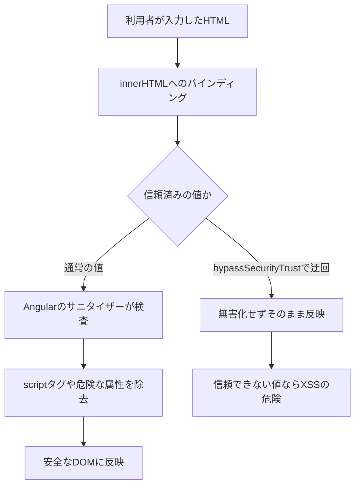
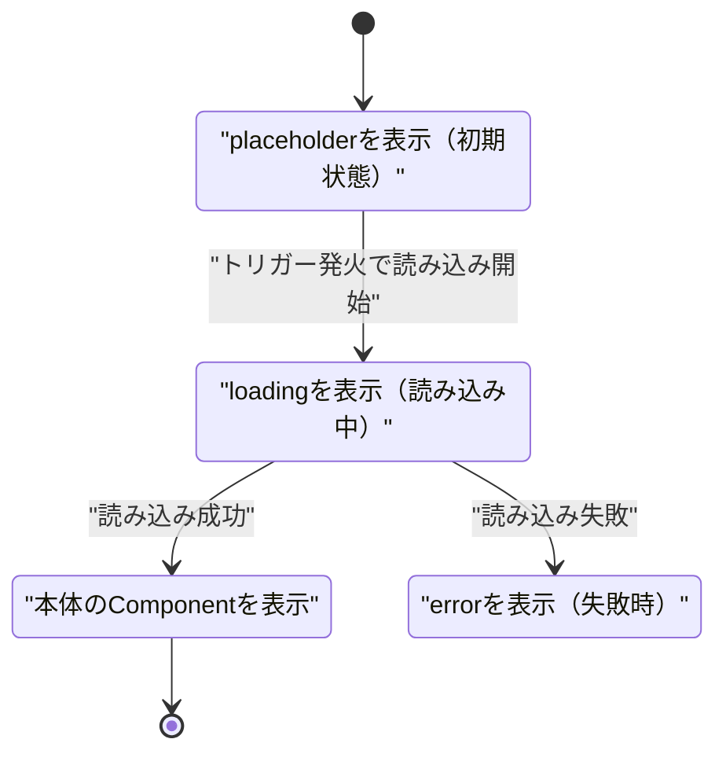

この章では、実務で欠かせない3つのトピックを扱います。XSS対策を中心としたセキュリティ、誰もが使えるためのアクセシビリティと国際化、そしてパフォーマンス最適化を学びます。

:::message
**この章で学ぶこと**

- XSSとはどのような攻撃か
- Angularの自動的なXSS対策
- アクセシビリティの基本
- セマンティックなHTMLとARIA
- パフォーマンスの2つの側面
- これまで学んだ最適化の振り返り
:::

## セキュリティ — XSS対策とサニタイゼーション

Webアプリケーションを公開する以上、セキュリティは避けて通れない責任です。この節では、フロントエンドでもっとも重要な脅威のひとつ、XSS（クロスサイトスクリプティング）と、Angularがそれをどう防ぐかを学びます。

XSSは、悪意のあるスクリプトを、Webページに埋め込ませる攻撃です。もし成功すれば、利用者になりすまして操作したり、機密情報を盗んだりできてしまいます。Angularは、既定で強力なXSS対策を備えています。しかし、その仕組みを理解せずにいると、対策をうっかり無効にしてしまうことがあります。この節では、Angularの防御の仕組みと、開発者が守るべき原則を学びます。安全なアプリを作るための、必須の知識です。

### XSSとはどのような攻撃か

XSSは、本来データであるべき場所に、実行可能なスクリプトを紛れ込ませる攻撃です。典型的な例を考えます。掲示板のようなアプリで、利用者が投稿した文章を、画面に表示するとします。もし、悪意のある利用者が、文章のふりをしてスクリプトを投稿し、それがそのまま画面に埋め込まれると、そのページを開いた他の利用者のブラウザで、スクリプトが実行されてしまいます。

実行されたスクリプトは、そのページでできることは何でもできます。ログイン情報を盗む、利用者になりすまして操作する、偽の入力欄を表示して情報を抜き取る。被害は深刻です。XSSの根本原因は、「利用者が入力したデータ」と「実行されるコード」の境界が、あいまいになることにあります。データとして扱うべきものが、コードとして解釈されてしまうのです。

### Angularの自動的なXSS対策

Angularは、この脅威に対して、既定で強力な防御を備えています。その中心が、テンプレートでの自動的なエスケープです。

『テンプレートの記法とDirective概論』の章で学んだ補間`{{ }}`を思い出してください。`{{ userInput }}`で値を表示するとき、Angularは、その値に含まれるHTMLとして特別な意味を持つ文字（`<`や`>`など）を、無害な文字に変換（エスケープ）します。これにより、たとえ利用者がスクリプトを含む文字列を入力しても、それはただの文字列として表示され、コードとして実行されることはありません。

```html
<!-- userInput が "<script>..." でも、文字列として安全に表示される -->
<p>{{ userInput }}</p>
```

この自動エスケープのおかげで、補間で値を表示している限り、XSSはまず起きません。開発者が特別なことをしなくても、Angularが守ってくれるのです。この「既定で安全」という設計は、Angularの大きな美点です。『Angularとは何か』の章で、フレームワークが安全性を高めると述べましたが、その具体例がこれです。

ここで、なぜプロパティバインディングも安全なのかを補足します。『テンプレートの記法とDirective概論』の章で、真偽値などを渡すときはプロパティバインディング`[prop]`を使うと学びました。このバインディングも、値をデータとして扱い、コードとして解釈させません。たとえば`[textContent]="userInput"`は、値をテキストとして設定するため、スクリプトが実行される余地がありません。文字列を組み立てて`innerHTML`に流し込む、といった危険な書き方を避け、バインディングを使う限り、Angularの防御の内側にとどまれます。「Angularの仕組みを通してデータを扱う」ことが、そのまま安全につながる設計になっているのです。

### サニタイゼーションの仕組み

補間だけでなく、プロパティバインディングでも、Angularは防御します。とくに、HTMLをそのまま挿入する`[innerHTML]`のような場面では、サニタイゼーション（無害化）が働きます。

サニタイゼーションとは、値から、危険な部分を取り除く処理です。`[innerHTML]`に値を渡すと、Angularはその中身を検査し、スクリプトや危険な属性を除去したうえで、安全な部分だけを挿入します。

```html
<!-- 危険なスクリプトは自動で除去され、安全なHTMLだけが挿入される -->
<div [innerHTML]="userHtml"></div>
```

具体的に、何がどう変わるかを見てみます。次のような値を`[innerHTML]`に渡したとします。

```ts
// サニタイゼーション前（利用者が投稿した、危険を含む文字列）
const userHtml = '<p>こんにちは</p><script>steal(document.cookie)</script>';
```

Angularはこれを検査し、`<script>`要素を取り除いたうえで挿入します。結果として、画面に入るのは次の安全な部分だけです。

```html
<!-- サニタイゼーション後（<script>が除去された） -->
<p>こんにちは</p>
```

同様に、`href`へ`javascript:alert(1)`のような危険なURLを渡した場合、その値は安全な形（先頭に`unsafe:`が付くなど）へ書き換えられ、スクリプトとしては実行されません。

Angularは、値が使われる文脈に応じて、サニタイゼーションの強さを変えます。この文脈は`SecurityContext`という区分で表され、`HTML`・`STYLE`・`SCRIPT`・`URL`・`RESOURCE_URL`の5種類があります。たとえば`[innerHTML]`はHTMLの文脈、`[href]`はURLの文脈として扱われ、それぞれに適した無害化が適用されます。これらはすべて自動で働くため、開発者が意識する必要はありません。HTMLを挿入する場合でも、既定では安全が保たれるのです。

次の図は、`[innerHTML]`に渡された値が、サニタイゼーションを経て安全なDOMに反映されるまでの流れを表します。この節の後半で扱う`bypassSecurityTrust`系のメソッドによって、無害化を迂回する分岐もあわせて示します。



### AoTコンパイルとテンプレートの安全性

Angularの既定であるAoT（Ahead-of-Time）コンパイルも、XSS対策の一部です。AoTでは、テンプレートをビルド時にJavaScriptへコンパイルします。このとき、値が入る場所がデータ（補間やバインディング）なのか、構造（要素や属性）なのかが、コンパイル時に確定します。利用者の入力は必ずデータの位置に収まり、テンプレートの構造そのものを書き換えることはできません。

ここから、ひとつの原則が導かれます。テンプレートを、文字列の連結で実行時に組み立ててはいけない、ということです。たとえば利用者の入力を混ぜてHTML文字列を作り、それをテンプレートとして評価するような書き方は、AoTの保証を捨て、テンプレートインジェクションの穴を開けます。テンプレートは静的に書き、変化する部分はバインディングで流し込む。これを守る限り、利用者の入力がコードとして解釈される経路は生まれません。

### 対策を無効にしない

ここまで見たとおり、Angularの対策は自動です。したがって、開発者がすべきことの多くは、「その対策を、うっかり無効にしないこと」です。

Angularには、サニタイゼーションを回避する仕組みも用意されています。`DomSanitizer`の`bypassSecurityTrust`系のメソッドです。これらは、「この値は安全だと私が保証するので、サニタイゼーションをせずに使ってよい」とAngularに伝えるものです。文脈ごとに、次の5つが用意されています。

| メソッド | 対応する文脈 |
|---|---|
| `bypassSecurityTrustHtml` | HTML（`[innerHTML]`など） |
| `bypassSecurityTrustStyle` | スタイル値 |
| `bypassSecurityTrustScript` | スクリプト |
| `bypassSecurityTrustUrl` | URL（`[href]`・`[src]`など） |
| `bypassSecurityTrustResourceUrl` | リソースURL（`<iframe>`のsrcなど） |

```ts
// 危険：サニタイゼーションを回避する。信頼できる値にのみ使う
const trusted = sanitizer.bypassSecurityTrustHtml(userHtml);
```

名前に`bypass`（回避）とあるとおり、これはAngularの防御を意図的に外す操作です。もし、利用者の入力など、信頼できない値をこれで通してしまうと、XSSの穴を自ら開けることになります。これらのメソッドは、値の出どころが完全に信頼できる場合に限って、慎重に使うべきものです。

正当な使いどころもあります。たとえば、自社が管理する動画配信サービスの埋め込みURLを、`<iframe>`に渡す場合です。このURLは開発者が定数として持っており、利用者の入力は混ざりません。`<iframe>`のsrcは既定で`RESOURCE_URL`の文脈として厳しく制限されるため、`bypassSecurityTrustResourceUrl`で「この定数URLは安全だ」と明示します。

```ts:src/app/video-embed.ts
import { Component, inject, computed, input } from '@angular/core';
import { DomSanitizer, SafeResourceUrl } from '@angular/platform-browser';

@Component({
  selector: 'app-video-embed',
  template: `<iframe [src]="safeUrl()" title="製品紹介"></iframe>`,
})
export class VideoEmbed {
  private readonly sanitizer = inject(DomSanitizer);
  readonly videoId = input.required<string>();

  // 埋め込み先は自社管理のドメインに固定し、可変部分はIDだけに絞る
  protected readonly safeUrl = computed<SafeResourceUrl>(() =>
    this.sanitizer.bypassSecurityTrustResourceUrl(
      `https://video.example.com/embed/${this.videoId()}`,
    ),
  );
}
```

ここで安全なのは、URLの組み立て元が自社管理のドメインに固定され、可変部分が想定内のIDに限られているからです。この前提が崩れる値、たとえば利用者が自由に入力したURLをそのまま通すと、たちまち危険になります。安易に使うと、Angularがせっかく守ってくれている安全を、自分で壊してしまいます。

:::message alert
`bypassSecurityTrust`系のメソッドは、Angularのセキュリティ対策を無効にします。利用者の入力や、外部から取得した信頼できないデータには、絶対に使わないでください。使うのは、値の安全性を確実に保証できる場合に限ります。
:::

### その他のセキュリティの心得

XSS以外にも、フロントエンドで意識すべきセキュリティの観点があります。要点だけ挙げておきます。

- **DOMの直接操作を避ける**: `ElementRef`の`nativeElement`を通じてDOMを直接書き換えると、Angularのサニタイゼーションを迂回してしまうことがあります。『Directiveの実装とPipe』の章でも触れたとおり、DOM操作は最小限にし、テンプレートとバインディングを基本にします。
- **信頼できないURLに注意する**: `href`や`src`に利用者由来の値を入れる場合、`javascript:`から始まる危険なURLに注意します。Angularはこれも検査しますが、仕組みを理解しておきます。
- **機密情報をフロントに置かない**: APIキーなどの秘密の情報を、フロントエンドのコードに埋め込むと、誰でも見られます。秘密は、サーバー側で管理します。
- **通信は暗号化する**: 通信はHTTPSで行い、盗聴を防ぎます。認証トークンの扱い（『HTTP通信』の章）も、この文脈で重要です。

これらは、Angular固有というより、Web開発全般の心得です。フレームワークが守ってくれる範囲を理解しつつ、開発者が担うべき責任も、あわせて意識してください。

### なぜ既定で安全なことが重要か

Angularが「既定で安全」であることの意義を、あらためて考えてみましょう。セキュリティ対策は、開発者が「忘れずに」行う限り、必ずどこかで抜けが生じます。人は間違えるものだからです。何百箇所もある表示のうち、たった一箇所でエスケープを忘れれば、そこがXSSの穴になります。

Angularは、この問題を、「対策を既定にする」ことで解決しています。開発者が何もしなくても、補間もサニタイゼーションも自動で働く。安全が既定であり、危険な操作（`bypassSecurityTrust`）だけが、明示的な意思表示を必要とする。この設計により、「うっかり忘れて危険になる」のではなく、「意図的に選ばない限り安全」という状態が保たれます。開発者がすべきことは、この安全な既定を、理由もなく破らないことです。危険な操作には、必ず`bypass`のような目立つ名前が付いているため、コードレビューでも発見しやすくなっています。安全性をフレームワークの既定に組み込むという思想は、Angularの信頼性の根幹です。

### XSS以外の脅威にも目を向ける

XSSはフロントエンドで最重要の脅威ですが、ほかにも知っておくべき攻撃があります。代表的なものを、概観として押さえておきましょう。

ひとつが、CSRF（クロスサイトリクエストフォージェリ）です。これは、利用者が意図しないリクエストを、別のサイトから送らせる攻撃です。対策は主にサーバー側で行いますが、AngularのHttpClientには、これを支援する仕組みがあります。`provideHttpClient(withXsrfConfiguration({ ... }))`を有効にすると、HttpClientは`XSRF-TOKEN`という名前のクッキーからトークンを読み取り、変更系のリクエストに`X-XSRF-TOKEN`ヘッダーとして自動で添えます。サーバーは、このヘッダーとセッションを突き合わせ、正規のリクエストかを検証します。

```ts:src/app/app.config.ts
import { ApplicationConfig } from '@angular/core';
import { provideHttpClient, withXsrfConfiguration } from '@angular/common/http';

export const appConfig: ApplicationConfig = {
  providers: [
    provideHttpClient(
      withXsrfConfiguration({
        cookieName: 'XSRF-TOKEN', // 読み取るクッキー名（既定値）
        headerName: 'X-XSRF-TOKEN', // 付与するヘッダー名（既定値）
      }),
    ),
  ],
};
```

もうひとつが、CSP（コンテンツセキュリティポリシー）です。これは、ページで読み込める資源やスクリプトを制限し、たとえXSSの穴があっても、被害を抑える防御層です。ポリシー自体はサーバーが返すヘッダーで設定しますが、Angularは厳格なCSPと共存するための仕組みを備えています。Angularが挿入するインラインスタイルにnonce（リクエストごとに変わる符牒）を付けるには、bootstrap時に`CSP_NONCE`トークンでnonceを渡すか、アプリのルート要素に`ngCspNonce`属性を指定します。

```ts:src/main.ts
import { bootstrapApplication } from '@angular/platform-browser';
import { CSP_NONCE } from '@angular/core';
import { App } from './app/app';
import { appConfig } from './app/app.config';

// サーバーがリクエストごとに発行したnonceを、metaタグから読み取って渡す
const nonce = document.querySelector('meta[name="csp-nonce"]')?.getAttribute('content') ?? '';

bootstrapApplication(App, {
  ...appConfig,
  providers: [...appConfig.providers, { provide: CSP_NONCE, useValue: nonce }],
});
```

これらは、Angularだけで完結するものではなく、サーバーやインフラと連携して実現します。フロントエンドの開発者も、こうした多層的な防御の存在を知り、自分の担当範囲を、全体像の中で理解しておくことが大切です。セキュリティは、どこか一箇所で完璧を目指すのではなく、複数の層で守るのが基本です。『HTTP通信』の章で学んだInterceptorは、CSRFトークンの付与のような、通信の共通処理を担う場所としても役立ちます。

### よくあるつまずき

- **`bypassSecurityTrust`を安易に使う**: 「サニタイゼーションでうまく表示されない」という理由で、安易に`bypass`を使うと、危険な穴を開けます。まず、そもそもHTMLを挿入する必要があるかを問い直します。
- **利用者入力を`bypass`に通す**: これは最も危険なパターンです。`bypass`系は、値の安全性を自分で保証できる場合に限ります。利用者や外部由来の値には絶対に使いません。
- **DOM直接操作で迂回する**: `nativeElement.innerHTML = ...`のように、Angularを介さずDOMを操作すると、サニタイゼーションが働きません。テンプレートとバインディングを使います。
- **セキュリティをフロントだけで完結させようとする**: フロントの対策は重要ですが、サーバー側の検証も不可欠です。最終的な安全性は、サーバーとフロントの両方で守ります。
- **依存ライブラリの脆弱性を放置する**: 使っているライブラリに脆弱性が見つかることがあります。定期的に更新し、警告に注意を払うことも、セキュリティの一部です。
- **エラーメッセージに機密情報を含める**: 詳細なエラー情報を画面に出すと、攻撃の手がかりを与えることがあります。利用者に見せる情報は、必要最小限にとどめます。

## アクセシビリティと国際化（i18n）

アプリケーションは、できるだけ多くの人に、使えるものであるべきです。この節では、そのための2つの重要なテーマ、アクセシビリティと国際化を学びます。アクセシビリティ（a11y）は、障害の有無にかかわらず、誰もがアプリを使えるようにする取り組みです。国際化（i18n）は、複数の言語や地域に対応できるようにする仕組みです。

これらは、後回しにされがちなテーマです。しかし、機能が完成してから対応しようとすると、大きな手戻りになります。設計の早い段階から意識しておくことが、結果的に近道です。この節では、Angularが提供する支援と、開発者が心がけるべき原則を学びます。すべてを網羅することはできませんが、重要な考え方と、学びの入り口を示します。

### アクセシビリティとは

アクセシビリティとは、さまざまな状況の利用者が、アプリを支障なく使えるようにすることです。ここでいう「さまざまな状況」には、視覚や聴覚、運動機能に障害のある人、一時的に手が使えない人、小さな画面や遅い回線の人などが含まれます。

たとえば、目の見えない利用者は、スクリーンリーダーという、画面の内容を読み上げるソフトを使います。このとき、画面が適切に作られていないと、読み上げが意味をなさず、アプリが使えません。また、マウスを使えない利用者は、キーボードだけで操作します。ボタンやリンクがキーボードで操作できなければ、その機能は使えません。アクセシビリティは、こうした利用者を排除しないための、基本的な配慮です。それは特別な人のためだけでなく、結果として、すべての利用者にとって使いやすいアプリにつながります。

### セマンティックなHTMLを使う

アクセシビリティの土台は、意味の正しいHTML、すなわちセマンティックなHTMLを使うことです。要素には、それぞれ意味があります。ボタンには`<button>`、リンクには`<a>`、見出しには`<h1>`〜`<h6>`、といった具合です。

たとえば、クリックできる要素を作るとき、`<div>`にクリックイベントを付けるより、`<button>`を使うべきです。`<button>`は、キーボードで操作でき、スクリーンリーダーにも「ボタン」として正しく伝わります。`<div>`では、これらを自分で補う必要があり、抜けが生じやすくなります。

```html
<!-- 避けたい：divをボタン代わりにする -->
<div (click)="save()">保存</div>

<!-- 望ましい：意味の正しいbuttonを使う -->
<button (click)="save()">保存</button>
```

意味の正しい要素を選ぶだけで、多くのアクセシビリティが自然に確保されます。凝った見た目のために意味を犠牲にするのではなく、正しい要素を選び、見た目はCSSで整える。これが基本の姿勢です。

見出しの構造も、セマンティックなHTMLの一部です。`<h1>`から`<h6>`は、文書の階層を表します。スクリーンリーダーの利用者は、この見出しをたどって、ページの構造を把握し、目的の箇所へ飛びます。見た目の大きさのためだけに見出しレベルを選ぶのではなく、内容の階層に沿って、順序よく使うことが大切です。同様に、フォームの入力欄には`<label>`を関連づけます。ラベルがあると、その入力欄が何を求めているかが、支援技術に正しく伝わり、ラベルをクリックして入力欄にフォーカスする、といった操作もできるようになります。こうした基本の積み重ねが、アクセシブルなアプリの土台です。

### ARIAで意味を補う

セマンティックなHTMLだけでは表現しきれない情報は、ARIA（アリア）という仕組みで補います。ARIAは、要素に「役割」や「状態」を、属性として付け加えるものです。『テンプレートの記法とDirective概論』の章で学んだ`[attr.]`によるバインディングで、動的に設定できます。

```html
<!-- 状態を支援技術に伝える -->
<button [attr.aria-expanded]="isOpen()" (click)="toggle()">
  メニュー
</button>

<!-- アイコンだけのボタンに、意味を与える -->
<button aria-label="閉じる" (click)="close()">×</button>
```

`aria-expanded`は「開いているか」という状態を、`aria-label`は、見た目のテキストがない要素（×だけのボタンなど）に、読み上げ用のラベルを与えます。ただし、ARIAは補助であり、まずセマンティックなHTMLを使うのが先です。「ARIAを足す前に、正しい要素を使えないか」を考えるのが原則です。Angularの`@angular/cdk/a11y`は、フォーカスの管理など、アクセシビリティの実装を助ける道具も提供しています。

### 国際化（i18n）とは

国際化（i18n）は、アプリを複数の言語や地域に対応させる仕組みです。「i18n」は、internationalization の頭文字「i」と末尾「n」の間に18文字あることからくる略称です。日本語だけでなく、英語や他の言語でも表示できるようにする、といった対応がこれにあたります。

国際化には、言語の翻訳だけでなく、日付・数値・通貨の書式（『Directiveの実装とPipe』の章のPipeが扱いました）、文章の語順、通貨記号など、地域ごとの違いへの対応が含まれます。世界中の利用者に向けたアプリでは、この対応が欠かせません。日本国内向けのアプリでも、多言語対応が求められる場面は増えています。

### @angular/localizeによる翻訳

Angularは、`@angular/localize`という公式の国際化の仕組みを提供します。翻訳したいテキストに`i18n`属性を付けて印を付け、そこを翻訳の対象とします。

```html
<!-- i18n属性で、翻訳対象として印を付ける -->
<h1 i18n>ようこそ</h1>
<p i18n="@@welcome-message">本書へようこそ</p>
```

`i18n`属性が付いたテキストは、`ng extract-i18n`コマンドで翻訳ファイル（`messages.xlf`など）に抽出できます。

```bash
# 印を付けたテキストを翻訳ファイルに抽出する
ng extract-i18n --output-path src/locale
```

抽出したファイルに、各言語の訳を用意すると、ビルド時に、言語ごとのアプリが生成されます。この方式は、翻訳がビルド時に埋め込まれるため、実行時の負荷がなく、表示が速いという利点があります。

一方で、ビルド時に言語が決まるため、利用者がその場で言語を切り替えるような用途には、別の工夫が要ります。実行時に翻訳を切り替えたい場合は、`@angular/localize`の実行時の機能や、サードパーティのライブラリ（実行時翻訳に対応したもの）を選ぶこともあります。要件に応じて、ビルド時と実行時のどちらの方式が合うかを判断します。プログラムのコード中の文字列には、`$localize`というタグ付きテンプレートを使って、同様に翻訳対象を印付けできます。

### ロケールの登録と複数形の扱い

ビルド時の翻訳とは別に、`date`や`number`のPipeが地域に応じた書式を出すには、その地域のロケールデータを登録しておく必要があります。既定では`en-US`のデータだけが含まれるため、たとえば日本語やフランス語の書式を使うなら、`registerLocaleData()`でデータを登録し、`LOCALE_ID`で既定のロケールを指定します。

```ts:src/app/app.config.ts
import { ApplicationConfig, LOCALE_ID } from '@angular/core';
import { registerLocaleData } from '@angular/common';
import localeJa from '@angular/common/locales/ja';

registerLocaleData(localeJa);

export const appConfig: ApplicationConfig = {
  providers: [{ provide: LOCALE_ID, useValue: 'ja' }],
};
```

翻訳では、数によって文言が変わる場面もあります。「メッセージはありません」「1件のメッセージ」「3件のメッセージ」のような出し分けです。これには、ICU（International Components for Unicode）のメッセージ構文を使います。`{ 変数, plural, ... }`の形で、数に応じた文言を指定します。

```html
<p i18n>{count, plural, =0 {メッセージはありません} =1 {1件のメッセージ} other {{{count}}件のメッセージ}}</p>
```

`plural`のほか、値によって出し分ける`select`もあり、状態や区分に応じた文言の切り替えに使えます。数や区分によって表現が変わる言語に対応するための、標準的な仕組みです。

### 早い段階から意識する

アクセシビリティも国際化も、あとから足すより、最初から意識するほうが、はるかに楽です。セマンティックなHTMLを使う習慣は、追加のコストなしにアクセシビリティを高めます。表示するテキストを、コードのあちこちに直書きせず、翻訳できる形にまとめておけば、後の国際化がしやすくなります。

これらは、地味で目立たない取り組みですが、アプリの品質を、確実に押し上げます。動くことだけを目指すのではなく、「誰もが、どこからでも使える」ことを目指す。その視点が、実務的なAngular開発を、一段上の水準に引き上げます。本節で示したのは入り口にすぎませんが、この意識を持つことが、まず何より大切です。

### キーボード操作とフォーカス

アクセシビリティで、見落とされがちなのがキーボード操作です。マウスを使わない利用者は、Tabキーで要素を移動し、EnterやSpaceで操作します。セマンティックなHTMLを使っていれば、`<button>`や`<a>`は最初からキーボードで操作できます。しかし、独自の対話的な部品を作るときは、キーボードでの操作を、自分で確保する必要があります。

また、フォーカスの管理も重要です。フォーカスとは、いまキーボード操作の対象になっている要素のことです。たとえば、モーダルダイアログを開いたら、フォーカスをその中へ移し、閉じたら元の位置へ戻す、といった配慮が求められます。これがないと、キーボード利用者は、開いたダイアログを操作できなかったり、迷子になったりします。

Angularの`@angular/cdk/a11y`（`A11yModule`）は、こうした実装を助ける道具を提供します。代表的なものが、フォーカスを一定の範囲に閉じ込める`cdkTrapFocus`という属性Directiveです。ダイアログのコンテナに付けると、Tabキーでの移動がその中だけを巡回し、外へ抜けなくなります。`cdkTrapFocusAutoCapture`を添えると、開いた瞬間に内側へフォーカスを移します。

```html
<!-- cdkTrapFocusでフォーカスをダイアログ内に閉じ込める -->
<div cdkTrapFocus cdkTrapFocusAutoCapture>
  <h2>確認</h2>
  <button (click)="ok()">OK</button>
  <button (click)="cancel()">キャンセル</button>
</div>
```

もうひとつが、スクリーンリーダーに動的な変化を読み上げさせる`LiveAnnouncer`です。「保存しました」といった通知は、画面には出ても、読み上げには伝わらないことがあります。`LiveAnnouncer`の`announce()`を呼ぶと、その文言が支援技術に通知されます。

```ts:src/app/save-button.ts
import { Component, inject } from '@angular/core';
import { LiveAnnouncer } from '@angular/cdk/a11y';

@Component({ /* 省略 */ })
export class SaveButton {
  private readonly announcer = inject(LiveAnnouncer);

  protected save(): void {
    // 保存処理のあと、結果を読み上げで通知する
    this.announcer.announce('保存しました');
  }
}
```

目に見えるマウス操作だけでなく、見えにくいキーボード操作や読み上げにも目を配ることが、アクセシビリティの実践です。

### 地域ごとの書式に対応する

国際化は、言葉の翻訳だけではありません。日付・数値・通貨の書き方は、地域によって異なります。同じ日付でも、日本では「2026年7月14日」、他の地域では別の並びや区切りで表します。数値の桁区切りや、通貨の記号・位置も、地域ごとに違います。

Angularは、こうした地域差を、『Directiveの実装とPipe』の章で学んだPipe（`date`・`currency`・`number`）で吸収します。これらのPipeは、設定された地域（ロケール）に応じて、適切な書式で表示します。アプリのロケールを切り替えれば、これらの表示も、その地域に合った形に変わります。国際化に対応するアプリでは、日付や金額を自前で文字列に組み立てるのではなく、これらのPipeに任せるのが基本です。そうすれば、地域が変わっても、表示は自動で適切になります。言葉の翻訳（`@angular/localize`）と、書式の地域対応（Pipe）を、あわせて考えることが、本当の意味での国際化です。

### よくあるつまずき

- **`<div>`をボタン代わりにする**: `<div>`にクリックイベントを付けても、キーボードで操作できず、支援技術にも伝わりません。対話的な要素には、`<button>`や`<a>`を使います。
- **アイコンだけのボタンにラベルがない**: ×やゴミ箱アイコンだけのボタンは、読み上げで意味が伝わりません。`aria-label`で、その役割を言葉で与えます。
- **色だけで情報を伝える**: 「赤字がエラー」のように色だけに頼ると、色を区別しにくい利用者に伝わりません。文言やアイコンも添えます。
- **表示テキストをコードに直書きする**: 国際化を後から行おうとすると、直書きされたテキストを探し回ることになります。翻訳の可能性があるなら、早めに`i18n`で印を付けておきます。
- **フォーム入力にラベルを付けない**: 入力欄に`<label>`を関連づけないと、何を入力する欄かが支援技術に伝わりません。ラベルは、見た目のためだけでなく、アクセシビリティのためにも必須です。
- **見出しレベルを見た目で選ぶ**: `<h1>`〜`<h6>`は、文字の大きさではなく、内容の階層で選びます。順序を飛ばすと、支援技術での構造把握が乱れます。大きさはCSSで調整します。
- **日付や金額を自前で組み立てる**: 地域ごとの書式は、`date`や`currency`のPipeに任せます。自前で文字列を組み立てると、地域対応が困難になります。

## パフォーマンス最適化と@defer

アプリケーションは、速くあるべきです。表示が遅い、操作の反応が鈍いアプリは、それだけで利用者を離れさせます。この節では、Angularアプリを速くするための、パフォーマンス最適化の技法を学びます。中心となるのが、必要になるまでコンテンツの読み込みを遅らせる`@defer`です。

本書でこれまで学んできたことの多くが、すでにパフォーマンスに貢献しています。OnPush（『変更検知の仕組み』の章）、Signals（『SignalsとZoneless』の章）、Zoneless（同じく『SignalsとZoneless』の章）、Lazy Loading（『ルーティング応用』の章）は、いずれも無駄を減らし、アプリを速く保つための仕組みでした。この節では、それらを振り返りつつ、`@defer`をはじめとする、さらなる最適化の手段を扱います。パフォーマンスは、特定の魔法ではなく、小さな配慮の積み重ねで得られます。

### パフォーマンスの2つの側面

Webアプリのパフォーマンスは、大きく2つの側面に分けられます。

ひとつは、**初期表示の速さ**です。利用者がページを開いてから、内容が表示されるまでの時間です。ここが遅いと、利用者は「重いアプリだ」と感じます。最初に読み込むコードやデータの量を減らすことが、この改善の鍵です。

もうひとつは、**操作の反応の速さ**です。ボタンを押す、スクロールする、入力する、といった操作に対する、画面の応答の速さです。ここが鈍いと、「もたつく」印象を与えます。無駄な処理や、無駄な再描画を減らすことが、この改善の鍵です。

この2つは、対策のアプローチが異なります。初期表示は「読み込む量を減らす」、操作の反応は「実行する処理を減らす」が基本です。以降で見る技法を、この2つの側面と結びつけて理解すると、整理しやすくなります。どちらの側面も、利用者の体験に直結します。初期表示が遅ければ利用者は離れ、操作の反応が鈍ければストレスを感じます。パフォーマンスは、単なる技術的な指標ではなく、利用者の満足度そのものだと捉えてください。

### これまでの最適化を振り返る

本書で学んできた仕組みが、パフォーマンスにどう効くかを整理します。

**操作の反応**の側面では、変更検知の最適化が効きます。OnPush（『変更検知の仕組み』の章）は、確認するComponentを絞ります。Signals（『SignalsとZoneless』の章）は、変わった箇所だけを更新します。Zoneless（同章）は、変更検知の起点を、実際の変化に限定します。これらはいずれも、無駄な再描画を減らし、操作の反応を速く保ちます。変更検知とSignalsを扱った章で学んだSignalsへの移行は、それ自体がパフォーマンス最適化だったのです。

**初期表示**の側面では、Lazy Loading（『ルーティング応用』の章）が効きます。最初に読み込むコードを、ページ単位に分割し、必要なときだけ読み込むことで、初回の読み込み量を減らします。そして、この初期表示の最適化を、ページ内のさらに細かい単位で行えるのが、これから学ぶ`@defer`です。

### @deferによる遅延読み込み

`@defer`は、テンプレートの一部を、必要になるまで読み込まない仕組みです。Deferrable Views（遅延可能ビュー）とも呼ばれ、Angular 18（2024年）で安定版になりました。

ページの中には、すぐには見えない部分があります。画面の下のほう、タブの裏、めったに開かない領域などです。こうした部分のComponentを、最初から読み込むのは無駄です。`@defer`で囲むと、その中身は初期の読み込みから除外され、指定した条件を満たしたときに、はじめて読み込まれます。

```html
@defer {
  <app-heavy-chart />
}
```

この`app-heavy-chart`は、重いグラフのComponentだとします。`@defer`で囲むことで、最初のページ読み込みには含まれず、既定ではブラウザが手すきになったときに、裏で読み込まれます。初期表示の負荷を、重い部分だけ後回しにできるのです。`@defer`で遅延できるのは、Standaloneの部品に限られます。『TypeScriptとComponentの基本』の章で学んだStandaloneが、ここでも土台になっています。

### トリガーで読み込みのタイミングを決める

`@defer`の中身を、いつ読み込むかは、トリガーで指定できます。用途に応じて、さまざまな条件を選べます。

| トリガー | 読み込むタイミング |
|---|---|
| `on idle` | ブラウザが手すきになったとき（既定） |
| `on viewport` | その部分が画面に入ってきたとき |
| `on interaction` | 利用者がクリックなどの操作をしたとき |
| `on hover` | マウスが乗ったとき |
| `on timer(3s)` | 指定した時間が経過したとき |
| `when 条件` | 指定した式が真になったとき |

たとえば、画面の下にあるグラフは、`on viewport`にすると、スクロールしてそこが見えたときに読み込まれます。見えない部分を、見えるまで読み込まないため、無駄がありません。

```html
@defer (on viewport) {
  <app-heavy-chart />
}
```

さらに、`prefetch`を組み合わせると、「表示は遅らせるが、読み込みは先にしておく」といった調整もできます。`@defer (on interaction; prefetch on idle)`なら、手すきのときに裏で先読みしておき、実際にクリックされたら即座に表示できます。『ルーティング応用』の章のLazy Loadingの先読みと、同じ発想です。

### 関連するブロック

`@defer`には、読み込みの各段階に対応する、関連ブロックがあります。『テンプレートの記法とDirective概論』の章で学んだ制御フローと、同じ記法の仲間です。

```html
@defer (on viewport) {
  <app-heavy-chart />
} @placeholder {
  <p>グラフはこちらに表示されます</p>
} @loading {
  <p>読み込み中</p>
} @error {
  <p>読み込みに失敗しました</p>
}
```

- `@placeholder`: 読み込みが始まる前に表示する内容
- `@loading`: 読み込み中に表示する内容
- `@error`: 読み込みに失敗したときに表示する内容

これらにより、遅延読み込みの各段階で、利用者に適切な表示を見せられます。何もない空白ではなく、プレースホルダーや読み込み表示があることで、体感的な速さも向上します。`@defer`は、単に読み込みを遅らせるだけでなく、その過程を丁寧に扱うための仕組みでもあるのです。

次の図は、`@defer`ブロックが、初期のプレースホルダー表示から、トリガーの発火による読み込みを経て、本体の表示や失敗時のエラー表示へと移る状態遷移を表します。それぞれの状態が、`@placeholder`・`@loading`・`@error`と、読み込み完了後の本体表示に対応します。



読み込みがごく短時間で終わると、`@loading`の表示が一瞬だけ現れてすぐ消え、かえってちらつきに見えることがあります。これを防ぐため、`@loading`と`@placeholder`には表示時間を制御するパラメーターがあります。`@loading`の`after`は「読み込みがこの時間より長くかかったときだけ表示する」、`minimum`は「一度出したら最低この時間は表示し続ける」を指定します。`@placeholder`の`minimum`も、最低表示時間を保ちます。

```html
@defer (on viewport) {
  <app-heavy-chart />
} @placeholder (minimum 500ms) {
  <p>グラフはこちらに表示されます</p>
} @loading (after 100ms; minimum 1s) {
  <p>読み込み中</p>
}
```

この指定では、読み込みが100ミリ秒以内に終われば`@loading`は出さず、出した場合は最低1秒間は表示し続けます。こうした調整で、表示の切り替わりがちらつくのを防げます。

### 画像を最適化する

画像は、しばしばページの重さの大部分を占めます。Angularの`NgOptimizedImage`というDirectiveを使うと、画像読み込みの最適化を、宣言的に行えます。`img`要素の`src`のかわりに`ngSrc`を使うのが基本です。

```ts:src/app/hero.ts
import { Component } from '@angular/core';
import { NgOptimizedImage } from '@angular/common';

@Component({
  selector: 'app-hero',
  imports: [NgOptimizedImage],
  template: `
    <!-- 最初に見える主役画像。priorityで優先的に読み込む -->
    

    <!-- 親要素いっぱいに広げる場合はfillを使う（width/heightは不要） -->
    <div class="thumb">
      
    </div>
  `,
})
export class Hero {}
```

`NgOptimizedImage`は、いくつもの最適化を自動で行います。指定サイズをもとにレスポンシブ画像の`srcset`を生成し、端末に合った解像度を配信します。画面外の画像は既定で遅延読み込み（`loading="lazy"`）にします。そのうえで、最初の表示に効く主役画像に`priority`を付けると、優先的に読み込まれ、LCP（後述）の改善につながります。`width`と`height`（または`fill`）の指定を必須とすることで、読み込み後に画像がずれて表示が飛ぶ現象（レイアウトシフト）も防ぎます。

### 大量のリストを仮想スクロールで描く

数千件におよぶ一覧をそのまま描画すると、それだけで大量のDOM要素が作られ、初期表示も操作の反応も重くなります。こうした場面では、`@angular/cdk/scrolling`の仮想スクロール（Virtual Scroll）が有効です。画面に見えている範囲の要素だけを実際に描画し、スクロールに合わせて中身を入れ替えることで、生成されるDOMの数を一定に保ちます。

```ts:src/app/log-list.ts
import { Component } from '@angular/core';
import { ScrollingModule } from '@angular/cdk/scrolling';

@Component({
  selector: 'app-log-list',
  imports: [ScrollingModule],
  template: `
    <cdk-virtual-scroll-viewport itemSize="48" class="viewport">
      <div *cdkVirtualFor="let item of items">{{ item }}</div>
    </cdk-virtual-scroll-viewport>
  `,
})
export class LogList {
  protected readonly items = Array.from({ length: 10000 }, (_, i) => `行 ${i}`);
}
```

`itemSize`は1項目あたりの高さの目安（ピクセル）です。`*cdkVirtualFor`は`@for`ではなくDirective形式ですが、繰り返し描画という役割は共通です。一万件を渡しても、実際に生成されるDOMは画面に映る数十件ほどに保たれ、スクロールしても軽快なままです。

### 計測してから最適化する

最後に、パフォーマンス最適化で、もっとも大切な原則を述べます。それは、「推測ではなく、計測にもとづいて最適化する」ことです。

どこが遅いのかを確かめずに、あてずっぽうで最適化すると、労力の割に効果が出なかったり、かえってコードを複雑にしたりします。ブラウザの開発者ツールや、Angularの提供する計測の仕組みを使い、実際にどこが遅いのかを特定してから、そこに手を入れます。多くの場合、ボトルネックは、思っていた場所とは違うところにあります。

また、早すぎる最適化も避けるべきです。動作に問題がないうちから、あらゆる箇所を`@defer`で包むような過剰な最適化は、コードを複雑にするだけです。まず素直に作り、計測して、本当に遅い部分だけを、適切な手段で最適化する。この順序を守ることが、健全なパフォーマンス改善につながります。

### その他の最適化の手がかり

`@defer`や変更検知の最適化のほかにも、パフォーマンスに効く手がかりがあります。いくつか挙げておきます。

- **画像の最適化**: 画像は、しばしばページの重さの大部分を占めます。Angularの`NgOptimizedImage`（`ngSrc`）を使うと、画像の読み込みを最適化できます。適切なサイズ、遅延読み込み、優先度の指定などが、簡単に行えます。
- **`@for`の`track`**: 『テンプレートの記法とDirective概論』の章で学んだとおり、`@for`の`track`に適切な値を指定すると、一覧の更新が効率化されます。大きな一覧では、この効果が大きくなります。
- **バンドルサイズの把握**: `ng build`の出力で、何がバンドルを大きくしているかを確認します。不要な依存や、大きすぎるライブラリが、初期表示を遅くしていることがあります。
- **不要な処理をテンプレートに書かない**: テンプレートの補間の中で重い計算やメソッド呼び出しをすると、変更検知のたびに実行されます。`computed()`やPipeで、計算を必要なときだけに抑えます。

これらは、いずれも「無駄を減らす」という共通の発想にもとづきます。派手な技法より、こうした基本的な配慮の積み重ねが、体感速度を大きく左右します。

### 何を計測するか

「計測してから最適化する」と述べましたが、では何を計測すればよいのでしょうか。手がかりとなる指標を、いくつか挙げておきます。

初期表示と操作性については、Core Web Vitalsと呼ばれる指標群が広く使われます。代表的なのは次の3つです。

- **LCP（Largest Contentful Paint）**: もっとも大きな内容が表示されるまでの時間。初期表示の速さの目安です
- **INP（Interaction to Next Paint）**: 操作してから画面が反応するまでの時間。操作性の目安です
- **CLS（Cumulative Layout Shift）**: 表示の途中で要素がずれる量。レイアウトの安定性の目安です

これらは、ブラウザの開発者ツール（LighthouseやPerformanceパネル）で確認できます。

バンドルの大きさは、`ng build`の出力でも概観できますが、内訳を詳しく見るには`ng build --stats-json`で統計ファイルを出力し、`source-map-explorer`や`esbuild-visualizer`といったツールで可視化します。どのライブラリがどれだけの容量を占めているかがわかり、初期の読み込みを重くしている原因を突き止められます。

操作の反応については、変更検知がどれだけ走っているかが目安になります。ブラウザ拡張の**Angular DevTools**には、変更検知サイクルを計測する**Profiler**があり、どのComponentの確認にどれだけ時間がかかっているかを可視化できます。もし、関係のない操作のたびに広範囲の再描画が走っているなら、OnPushやSignalsの導入を検討する合図です。こうした指標を手がかりに、憶測ではなく事実にもとづいて、改善すべき箇所を見定めます。数値で現状を把握し、改善の前後で比較する。この地道な計測こそが、効果的な最適化の土台です。

### よくあるつまずき

- **推測で最適化する**: 遅いと思い込んだ場所を、計測せずに最適化しても、効果が出ないことが多いものです。まず計測し、ボトルネックを特定します。
- **何でも`@defer`で包む**: すぐ見える主要な内容まで遅延させると、かえって表示が遅く感じられます。`@defer`は、すぐには不要な部分に絞ります。
- **`track`を軽視する**: `@for`の`track`に不適切な値（`$index`など）を使うと、一覧の更新で無駄な再描画が起きます。一意なIDを使います。
- **テンプレートで重い処理を呼ぶ**: 補間の中のメソッド呼び出しは、変更検知のたびに走ります。`computed()`に切り出して、再計算を抑えます。
- **画像を最適化しない**: 大きな画像をそのまま読み込むと、初期表示を大きく遅くします。適切なサイズと、`NgOptimizedImage`による最適化を検討します。

## まとめ

- XSSは、データに紛れたスクリプトが実行される、深刻な攻撃です
- Angularは、補間`{{ }}`で値を自動エスケープし、XSSを既定で防ぎます
- `[innerHTML]`などでは、サニタイゼーションが危険な部分を自動で除去します
- アクセシビリティは、状況を問わず誰もがアプリを使えるようにする取り組みです
- 土台は、意味の正しいセマンティックなHTML（`<button>`など）を使うことです
- 表現しきれない意味は、ARIA（`aria-label`など）で補います
- パフォーマンスには、初期表示の速さと、操作の反応の速さの2側面があります
- OnPush・Signal・Zoneless・Lazy Loadingは、すでに学んだ最適化の仕組みです
- `@defer`は、テンプレートの一部を必要になるまで読み込まない仕組みです

最後の章では、SSRとモダンAngularへの移行戦略を扱い、本書を締めくくります。
