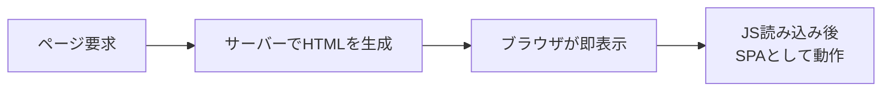

本書の最後に、SSR（サーバーサイドレンダリング）とHydration、そして既存アプリをモダンAngularへ移行する戦略を学びます。あわせて、本書全体を振り返ります。

:::message
**この章で学ぶこと**

- SSRが解決する課題
- SSRの仕組み
- 移行の基本的な考え方
- バージョンを上げる（`ng update`）
:::

## SSRとHydration

第31章で、SPAには「初期表示」と「検索対応」という弱点があると述べ、その対処がSSRだと予告しました。この節で、そのSSR（サーバーサイドレンダリング）と、それを支えるHydration（ハイドレーション）を学びます。

SSRは、サーバー側であらかじめHTMLを組み立ててから、ブラウザへ送る仕組みです。これにより、SPAの利点を保ちながら、初期表示を速くし、検索エンジンにも内容を伝えられます。近年のAngularは、SSRのセットアップを大きく簡素化し、`ng new`のオプションで手軽に始められるようになりました。この節では、SSRが何を解決するのか、そしてHydrationがどう働くのかを理解します。やや高度なテーマですが、実務で本格的なアプリを作るなら、知っておくべき内容です。

### SSRが解決する課題

まず、SSRがない通常のSPA（第31章）を振り返ります。SPAは、最初にほぼ空のHTMLと、JavaScriptを受け取り、ブラウザ上でJavaScriptが実行されて、はじめて画面が組み上がります。この方式には、2つの弱点がありました。

ひとつは、**初期表示の遅さ**です。JavaScriptを読み込み、実行し終えるまで、画面には何も表示されません。とくに、回線が遅い環境や、非力な端末では、この待ち時間が目立ちます。

もうひとつは、**検索エンジンやSNSへの対応**です。JavaScriptを実行しない相手からは、空のページに見えることがあります。検索結果に正しく表示されなかったり、SNSでリンクを共有したときに内容が展開されなかったり、という問題が起こりえます。

SSRは、これらを解決します。サーバー側で、あらかじめ内容の入ったHTMLを組み立てて返すため、ブラウザはそれをすぐ表示できます。JavaScriptの実行を待たずに、内容が見えるのです。検索エンジンも、そのHTMLから内容を読み取れます。加えて、SNSでリンクを共有したときの、内容の展開（タイトルや画像のプレビュー）も、サーバーが返すHTMLにもとづいて正しく行われます。公開されるWebサイトにとって、これらは集客や信頼性に関わる、無視できない要素です。

### SSRの仕組み

SSRでは、アプリケーションが、サーバーとブラウザの両方で動きます。流れを追ってみましょう。

まず、利用者がページを要求すると、サーバー側でAngularアプリが実行され、そのページのHTMLが組み立てられます。このHTMLは、内容が詰まった、完成した状態です。ブラウザは、これを受け取り、ただちに表示します。利用者は、この時点で、内容を見られます。JavaScriptの読み込みは、その裏で進みます。

そして、JavaScriptの読み込みが終わると、アプリはブラウザ上でも動き始め、以降は通常のSPAとして、なめらかに動作します。つまりSSRは、「最初はサーバーが作ったHTMLで速く表示し、その後SPAに引き継ぐ」という、両者のいいとこ取りを狙う仕組みです。



モダンAngularでは、`ng new`の際にSSRを選ぶか、後から`ng add @angular/ssr`で追加できます。起動設定では、サーバー側のレンダリングを有効にする`provideServerRendering`などが使われます。セットアップの詳細はバージョンによって変わるため、公式ドキュメントで最新の手順を確認するのがよいでしょう。

### Hydrationとは何か

ここで、ひとつ問題が生じます。サーバーが作ったHTMLが、すでにブラウザに表示されているところへ、JavaScriptのアプリが動き始めると、どうなるでしょうか。素朴に実装すると、アプリはブラウザ上で画面を最初から作り直し、サーバーが作ったHTMLを、いったん捨てて置き換えてしまいます。これでは、画面が一瞬ちらつき、無駄も生じます。

この問題を解決するのが、Hydrationです。Hydrationは、「サーバーが作った既存のHTMLを、捨てずに再利用する」仕組みです。アプリは、DOMを作り直すのではなく、すでにあるDOMに、イベントの結びつけや状態を「注ぎ込む」ように結びついていきます。水を注ぐ(hydrate)ように、静的なHTMLに命を吹き込む、というイメージから、この名がついています。

Hydrationを有効にするには、起動設定に`provideClientHydration()`を加えます。

```ts:src/app/app.config.ts
import { provideClientHydration } from '@angular/platform-browser';

export const appConfig: ApplicationConfig = {
  providers: [provideClientHydration()],
};
```

Hydrationは、Angular 17（2023年）で安定版になりました。これにより、SSRの弱点だった「ちらつき」や「作り直しの無駄」が解消され、SSRが実用的なものになりました。

### Hydrationの利点と注意点

Hydrationには、明確な利点があります。DOMを作り直さないため、表示のちらつきがなくなり、初期表示の体感が向上します。Webの表示性能の指標（Core Web Vitals）の改善にもつながります。SSRを使うなら、Hydrationは、あわせて有効にすべき仕組みです。

一方、注意点もあります。Hydrationは、「サーバーが作ったDOMと、ブラウザで作られるはずのDOMが、一致していること」を前提とします。もし両者が食い違うと、Hydrationがうまくいきません。食い違いの主な原因は、次のようなものです。

- **DOMの直接操作**: `nativeElement`を通じてDOMを直接いじると、サーバーとブラウザで差が出ます。第14章・第59章でDOM直接操作を避けるべきと述べたのは、ここにも関わります。
- **不正なHTML構造**: 仕様に反したHTMLの入れ子は、ブラウザが自動補正するため、サーバーとの差を生みます。
- **一部の外部ライブラリ**: DOMを激しく操作するライブラリは、Hydrationと相性が悪いことがあります。

こうした問題のあるComponentには、一時的な回避策として`ngSkipHydration`属性を付け、そのComponentだけHydrationの対象外にできます。ただし、これは応急処置であり、根本的には、DOMを直接操作しない、正しいHTMLを書く、という基本を守ることが大切です。

### 段階的なHydration

さらに進んだ仕組みとして、Incremental Hydration（段階的なハイドレーション）があります。これは、ページ全体を一度にHydrationするのではなく、必要な部分から段階的に行うものです。前章の`@defer`と組み合わせ、「この部分は、画面に入ってきたらHydrationする」といった、きめ細かい制御ができます。

これにより、最初にブラウザで動かすJavaScriptの量を、さらに減らせます。ページの大部分は静的なHTMLのまま表示し、操作が必要になった部分だけを、順にアプリとして動かす、という最適化です。Incremental Hydrationは、Angular 19（2024年）で導入された、比較的新しい機能です。大規模なアプリで、初期表示をぎりぎりまで速くしたい場面で、力を発揮します。まずは基本のHydrationを押さえ、こうした発展的な仕組みがあることを知っておくとよいでしょう。

### SSRを使うべきか

SSRは強力ですが、すべてのアプリに必要なわけではありません。導入すると、サーバー側の実行環境が必要になり、構成が複雑になります。サーバーとブラウザの両方で動くことを意識した、注意深い実装も求められます。この追加のコストに、見合う利点があるかを見極めることが大切です。

SSRが向くのは、初期表示の速さが重要なアプリ、検索エンジンに内容を見つけてもらいたい公開サイト、SNSでの共有が多いコンテンツなどです。ブログ、メディア、ECサイトの商品ページなどが典型例です。逆に、ログインした後の管理画面や、社内向けの業務アプリのように、検索対応が不要で、利用者も限られる場合は、通常のSPAで十分なことが多いものです。第31章で述べた「SPAかMPAか」の判断と同じく、要件に応じて選びます。「新しいから」「高機能だから」という理由だけで導入するのではなく、そのアプリに本当に必要かを問うのが、健全な技術選定です。

### サーバーとブラウザで重複させない

SSRで気をつけたいのが、データ取得の重複です。素朴に実装すると、サーバー側でデータを取得してHTMLを作り、ブラウザ側でも同じデータを、もう一度取得してしまうことがあります。これでは、通信が二重になり、せっかくのSSRの利点が薄れます。

この問題を防ぐのが、TransferState（トランスファーステート）という仕組みです。サーバー側で取得したデータを、HTMLに埋め込んでブラウザへ渡し、ブラウザ側では、その埋め込まれたデータを再利用します。これにより、同じデータの二度目の取得を避けられます。第9部で学んだ`httpResource()`やHttpClientを使ったデータ取得は、Hydrationと組み合わせるとき、この重複に配慮する必要があります。Angularは、こうした仕組みを提供しており、適切に使えば、サーバーとブラウザをまたいだ効率的なデータの受け渡しが実現します。SSRは、単に「サーバーで描画する」だけでなく、こうしたデータの流れまで含めて設計するものだと理解しておくとよいでしょう。

### よくあるつまずき

- **DOMを直接操作する**: `nativeElement`でDOMを直接いじると、サーバーとブラウザでDOMが食い違い、Hydrationが崩れます。テンプレートとバインディングで表現します。
- **ブラウザ専用のAPIを無防備に使う**: `window`や`document`は、サーバー側には存在しません。SSR環境では、これらを直接使うとエラーになります。実行環境を確認するか、ブラウザでのみ動く仕組み（`afterNextRender`など）を使います。
- **`ngSkipHydration`に頼りすぎる**: Hydrationの問題を、`ngSkipHydration`で回避し続けると、SSRの利点が薄れます。応急処置と捉え、根本原因を直します。
- **必要ないのにSSRを導入する**: 検索対応も初期表示の速さも重要でないアプリに、SSRを入れると、複雑さだけが増します。要件に照らして判断します。

## モダンAngularへの移行戦略

本書もいよいよ最終章です。ここまで、モダンAngularの機能を、基礎から体系的に学んできました。しかし、現実の世界には、少し前のAngularで書かれた既存のアプリケーションが数多く存在します。この節では、そうした既存アプリを、本書で学んだモダンな形へ移行する戦略を扱います。そして最後に、本書全体を振り返り、これからの学びへの指針を示して締めくくります。

移行は、一度にすべてを書き換える大工事ではありません。Angularは、新旧の書き方が共存でき、段階的に移行できるよう設計されています。公式の移行ツールも充実しています。この節では、移行の考え方と、本書で登場した各移行ツールを整理します。既存アプリを扱う読者にとっても、新しく学んだ知識を、現実のコードにどう活かすかの、道しるべになるはずです。

### 移行は段階的に

まず、移行にあたっての心構えです。既存のアプリを、一度にすべて新しい形へ書き換えるのは、危険で、現実的でもありません。大量の変更は、思わぬ不具合を招き、レビューも困難になります。

Angularの移行は、段階的に進めるのが基本です。幸い、Angularは新旧の書き方が共存できます。NgModuleとStandaloneは混在でき、`@Input`と`input()`も、`*ngIf`と`@if`も、同じアプリの中に併存できます。ですから、「新しく書く部分はモダンな書き方で、既存の部分は、機能ごとに少しずつ移行する」という進め方が可能です。第2章で「新旧を否定的に語らない」と述べたのは、この段階的移行を支える姿勢でもあります。旧APIは、移行を待つ有効なコードであり、一気に敵視して消し去るべきものではありません。

### バージョンを上げる

移行の出発点は、Angular自体のバージョンを上げることです。第3章で学んだ`ng update`を使います。

```bash
ng update @angular/core @angular/cli
```

`ng update`は、単にバージョンを上げるだけでなく、そのバージョンで必要になる変更を、自動で適用してくれます。Angularは、後方互換性を重視し、破壊的変更には移行ツールを用意する文化があります。そのため、`ng update`に沿って進めれば、多くの更新は安全に行えます。この、破壊的変更を自動移行で吸収するという姿勢は、Angularが長く支持されてきた理由のひとつです。フレームワークが大きく進化しても、既存のアプリが置き去りにされにくいのです。本書がv22を基準にしながらも、旧APIを丁寧に扱ってきたのは、この連続性を重んじるAngularの文化に沿うものでもあります。

重要なのは、バージョンを飛ばさず、一つずつ上げることです。いくつも飛ばして一気に上げると、途中の移行ツールが適用されず、問題が起きやすくなります。定期的に、こまめに更新するのが、結果的にもっとも楽な道です。第2章で触れた、半年ごとのメジャーリリースというAngularのリズムに、乗り続けるイメージです。

### 本書で登場した移行ツール

本書では、各所で公式の移行ツール（スキマティクス）を紹介してきました。ここで、あらためて整理します。これらは、既存コードをモダンな形へ、自動で変換してくれます。

| 移行対象 | コマンド | 扱った章 |
|---|---|---|
| Standaloneへ | `ng generate @angular/core:standalone` | 第7章 |
| 制御フローへ | `ng generate @angular/core:control-flow` | 第12章 |
| `input()`へ | `ng generate @angular/core:signal-input-migration` | 第18章 |
| `inject()`へ | `ng generate @angular/core:inject` | 第24章 |

これらの移行ツールは、対象を自動で検出し、変換します。自動で判断できない箇所には印（TODOコメント）が残されるため、そこは手作業で確認します。移行の前には変更をコミットしておき、差分を確認しながら進めるのが安全です。すべてを一度に適用するのではなく、ツールごとに、機能ごとに、段階的に進めるとよいでしょう。移行ツールを実行した後は、アプリが正しく動くことを、テスト（第57章・第58章）で確認します。テストが整備されていれば、移行による意図しない変化を、すぐに検出できます。移行とテストは、車の両輪です。

### 移行の順序

複数の移行を行う場合、順序にも指針があります。一般には、土台となるものから進めます。

まず、NgModuleからStandaloneへの移行が、多くの移行の前提になります。Standaloneが土台になって、遅延読み込みや、他のモダンな書き方が活きるためです。次に、制御フロー（`@if`・`@for`）への移行は、テンプレートを整理し、`CommonModule`への依存を減らします。そして、`input()`や`inject()`への移行で、Signalベースの書き方へ寄せていきます。状態管理をSignalへ移す（第6部）のは、これらの上に進める、より大きな取り組みです。

ただし、これはあくまで一般的な指針です。実際には、アプリの状況や、チームの優先順位に応じて、順序を調整します。大切なのは、無理のない単位で区切り、一つずつ確実に進めることです。移行そのものが目的化しないよう、「なぜ移行するのか」（保守性、性能、新機能の活用）を見失わないことも大切です。

### 本書のまとめ

最後に、本書全体を振り返りましょう。本書は、Angularを、基礎から体系的にたどってきました。

第1部・第2部で、Angularの全体像とComponentの基礎を築きました。第3部・第4部で、テンプレートの表現力と、Component間の状態伝播を学びました。第5部でServiceとDIを、第6部で変更検知とSignalsを学び、Angularの動作原理の核心に触れました。第7部から第9部で、Router・RxJS・Forms・HTTPという、実用的な機能を扱いました。第10部で状態管理を、そしてこの第11部で、設計・テスト・セキュリティ・性能といった、実務の総仕上げを学びました。

本書を貫いてきたのは、「新旧の比較」という軸です。NgModuleからStandaloneへ、`@Input`から`input()`へ、Zone.jsからZonelessへ、`RouterModule`から`provideRouter()`へ。Angularは、その本質を保ちながら、より簡潔で、より安全で、より高速な方向へ、絶えず進化してきました。その変化の「なぜ」を理解することが、モダンAngularを深く使いこなす鍵でした。そして、その進化の中心には、一貫してSignalと、関数ベースの簡潔なAPIがありました。

### これからの学び

本書は、Angularの体系を示しましたが、学びに終わりはありません。Angularは、これからも進化を続けます。本書が基準としたv22の先にも、新しい機能や改善が加わっていくでしょう。

その変化に追いつくために、いくつかの指針を示します。まず、公式ドキュメント（angular.dev）と公式ブログを、一次情報として大切にしてください。本書でも繰り返し、記憶ではなく一次情報にあたる姿勢を示してきました。次に、`ng update`でバージョンを追い続け、変化に少しずつ慣れていくことです。そして、本書で身につけた「なぜそうなっているのか」を問う姿勢を、持ち続けることです。新しい機能が登場したとき、それが「どんな課題を解決するのか」を考えれば、その本質をつかめます。

Angularは、大規模で堅牢なアプリケーションを、長く保守していくための、優れたフレームワークです。本書で学んだ体系的な理解と、進化を追い続ける姿勢があれば、これからのAngular開発を、自信を持って進められるはずです。本書が、その確かな土台となることを願っています。

### 移行のよくあるつまずき

最後に、移行にまつわる、よくあるつまずきを挙げておきます。

- **一度にすべてを移行しようとする**: 大量の変更は、不具合とレビューの困難を招きます。機能ごと、ツールごとに、小さく区切って進めます。
- **バージョンを飛ばして上げる**: 複数のメジャーバージョンを一気に飛び越えると、途中の移行ツールが適用されず、問題が起きます。一つずつ上げます。
- **移行前にコミットしない**: 移行ツールは自動で多くのファイルを変更します。事前にコミットしておかないと、差分の確認や取り消しが困難になります。
- **移行自体を目的にする**: 「新しいから移行する」のではなく、「保守性や性能の向上」という目的を見失わないようにします。動いている旧コードを、無理に急いで書き換える必要はありません。

### 学び続けるための情報源

進化を追い続けるために、頼りになる情報源を挙げておきます。もっとも重要なのは、公式ドキュメント（angular.dev）です。機能の正確な仕様、推奨される書き方、移行の手順が、つねに最新の状態で提供されます。本書でも、記憶に頼らず、この一次情報を確認する姿勢を貫いてきました。あわせて、Angular公式ブログは、各バージョンで何が変わったか、なぜその変更がなされたかを知るのに役立ちます。

また、Angularには、更新のたびに何をすべきかを教えてくれる、更新ガイドも用意されています。バージョンを上げるとき、このガイドに沿えば、必要な変更を漏れなく把握できます。コミュニティの記事や発表も参考になりますが、情報の鮮度には注意が必要です。第2章で触れたように、Angularは新旧の情報が混在しやすいため、古い記事の内容が、現在では推奨されていないこともあります。迷ったときは、必ず公式の一次情報に立ち返る。この習慣が、変化の速い世界で、正確な知識を保つ鍵になります。本書で学んだ「なぜ」を問う姿勢と、一次情報を大切にする態度が、これからの学びを支えます。

### 本書を終えるにあたって

本書は、Angularという広大なフレームワークを、一本の道筋として描くことを目指しました。個々の機能を、ばらばらの知識としてではなく、「なぜこの機能があり、どう進化してきたか」という文脈の中で理解できるよう、新旧比較を軸に構成しました。

Angularを学ぶことは、単一の技術を覚えることではありません。Component指向の設計、リアクティブなプログラミング、依存性の注入、状態管理といった、ソフトウェア開発に通じる普遍的な考え方を、Angularという具体を通して学ぶことでもあります。本書で身につけた考え方は、Angularがこの先どう変わっても、また別の技術を学ぶときにも、あなたの土台であり続けるはずです。ここまでの学びに、あらためて感謝します。よいアプリケーションづくりを。

## まとめ

- SSRは、サーバー側でHTMLを組み立て、初期表示の遅さと検索対応の弱点を解決します
- SSRでは、サーバーが作ったHTMLで即表示し、その後SPAとして動作します
- Hydrationは、サーバーが作ったDOMを捨てずに再利用する仕組みです
- 移行は一度にではなく、新旧を共存させながら段階的に進めます
- `ng update`で、バージョンを飛ばさず一つずつ、こまめに上げます
- Standalone・制御フロー・`input()`・`inject()`への移行ツールが用意されています

本書はこれで終わりです。ここまで読み進めてくださったことに感謝します。学んだ知識を土台に、よいアプリケーションづくりへと踏み出してください。
