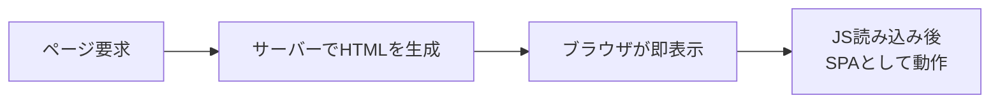

本書の最後に、SSR（サーバーサイドレンダリング）とHydration、そして既存アプリをモダンAngularへ移行する戦略を学びます。あわせて、本書全体を振り返ります。

:::message
**この章で学ぶこと**

- SSRが解決する課題
- SSRの仕組み
- 移行の基本的な考え方
- バージョンを上げる（`ng update`）
:::

## SSRとHydration

『Routerの基礎』の章で、SPAには「初期表示」と「検索対応」という弱点があると述べ、その対処がSSRだと予告しました。この節で、そのSSR（サーバーサイドレンダリング）と、それを支えるHydration（ハイドレーション）を学びます。

SSRは、サーバー側であらかじめHTMLを組み立ててから、ブラウザへ送る仕組みです。これにより、SPAの利点を保ちながら、初期表示を速くし、検索エンジンにも内容を伝えられます。近年のAngularは、SSRのセットアップを大きく簡素化し、`ng new`のオプションで手軽に始められるようになりました。この節では、SSRが何を解決するのか、そしてHydrationがどう働くのかを理解します。やや高度なテーマですが、実務で本格的なアプリを作るなら、知っておくべき内容です。

### SSRが解決する課題

まず、SSRがない通常のSPA（『Routerの基礎』の章で扱いました）を振り返ります。SPAは、最初にほぼ空のHTMLと、JavaScriptを受け取り、ブラウザ上でJavaScriptが実行されて、はじめて画面が組み上がります。この方式には、2つの弱点がありました。

ひとつは、**初期表示の遅さ**です。JavaScriptを読み込み、実行し終えるまで、画面には何も表示されません。とくに、回線が遅い環境や、非力な端末では、この待ち時間が目立ちます。

もうひとつは、**検索エンジンやSNSへの対応**です。JavaScriptを実行しない相手からは、空のページに見えることがあります。検索結果に正しく表示されなかったり、SNSでリンクを共有したときに内容が展開されなかったり、という問題が起こりえます。

SSRは、これらを解決します。サーバー側で、あらかじめ内容の入ったHTMLを組み立てて返すため、ブラウザはそれをすぐ表示できます。JavaScriptの実行を待たずに、内容が見えるのです。検索エンジンも、そのHTMLから内容を読み取れます。加えて、SNSでリンクを共有したときの、内容の展開（タイトルや画像のプレビュー）も、サーバーが返すHTMLにもとづいて正しく行われます。公開されるWebサイトにとって、これらは集客や信頼性に関わる、無視できない要素です。

### SSRの仕組み

SSRでは、アプリケーションが、サーバーとブラウザの両方で動きます。流れを追ってみましょう。

まず、利用者がページを要求すると、サーバー側でAngularアプリが実行され、そのページのHTMLが組み立てられます。このHTMLは、内容が詰まった、完成した状態です。ブラウザは、これを受け取り、ただちに表示します。利用者は、この時点で、内容を見られます。JavaScriptの読み込みは、その裏で進みます。

そして、JavaScriptの読み込みが終わると、アプリはブラウザ上でも動き始め、以降は通常のSPAとして、なめらかに動作します。つまりSSRは、「最初はサーバーが作ったHTMLで速く表示し、その後SPAに引き継ぐ」という、両者のいいとこ取りを狙う仕組みです。



SSRは、単に描画を速くするだけでなく、サーバーとブラウザという2つの実行環境を前提にした設計です。次に、このSSRを実際にどうセットアップし、どの方式で描画するのかを見ていきます。

### SSRをセットアップする

SSRの導入は、かつては手作業の設定が多く、つまずきやすい部分でした。モダンAngularでは、CLIが必要な設定をまとめて生成します。新規プロジェクトなら、`ng new`に`--ssr`オプションを付けます。

```bash
ng new my-app --ssr
```

すでにあるプロジェクトへあとから追加するときは、次のコマンドを実行します。

```bash
ng add @angular/ssr
```

これで、SSRに必要なファイルと設定が加わります。中心になるのは、Node.jsのサーバーでリクエストを受ける入り口の`server.ts`、サーバー側の起動設定をまとめる`app.config.server.ts`、そしてルートごとの描画方式を定義する`app.routes.server.ts`の3つです。起動設定は、ブラウザ用の`app.config.ts`とサーバー用の設定を`mergeApplicationConfig()`で束ねる形になります。

```ts:src/app/app.config.server.ts
import { mergeApplicationConfig, ApplicationConfig } from '@angular/core';
import { provideServerRendering, withRoutes } from '@angular/ssr';
import { appConfig } from './app.config';
import { serverRoutes } from './app.routes.server';

const serverConfig: ApplicationConfig = {
  providers: [
    provideServerRendering(withRoutes(serverRoutes)),
  ],
};

export const config = mergeApplicationConfig(appConfig, serverConfig);
```

`provideServerRendering()`が、サーバー側でHTMLを組み立てる機能を有効にします。`withRoutes()`には、次に説明するルートごとの描画方式を渡します。開発中は`ng serve`がSSRを含めて動かし、本番向けのビルドでは`ng build`がサーバー用の成果物もあわせて出力します。以前は自分で用意していたサーバーの雛形やビルド設定を、CLIが引き受けてくれるようになったのです。

### レンダリング方式を選ぶ（CSR・SSR・SSG）

SSRを入れると、すべてのページを必ずサーバーで描画しなければならない、というわけではありません。モダンAngularでは、ルートごとに描画方式を選べます。選択肢は3つです。

- **CSR（クライアントサイドレンダリング）**: 従来のSPAと同じく、ブラウザ側で描画します。ログイン後の管理画面のように、検索対応が要らず、利用者ごとに内容が変わる画面に向きます。
- **SSR（サーバーサイドレンダリング）**: リクエストのたびにサーバーでHTMLを組み立てます。内容が頻繁に変わり、かつ初期表示や検索対応が重要なページに向きます。
- **SSG（静的サイト生成、プリレンダリング）**: ビルド時にあらかじめHTMLを生成しておきます。内容がほとんど変わらないページ（会社紹介、規約、ドキュメントなど）に向き、リクエストごとのサーバー処理も不要です。

これらは、`app.routes.server.ts`で`ServerRoute[]`として、ルートごとに`RenderMode`で指定します。

```ts:src/app/app.routes.server.ts
import { RenderMode, ServerRoute } from '@angular/ssr';

export const serverRoutes: ServerRoute[] = [
  // トップページはビルド時に生成する（SSG）
  { path: '', renderMode: RenderMode.Prerender },
  // 商品詳細はリクエストごとにサーバーで描画する（SSR）
  { path: 'products/:id', renderMode: RenderMode.Server },
  // 管理画面はブラウザで描画する（CSR）
  { path: 'admin/**', renderMode: RenderMode.Client },
];
```

同じアプリの中でも、ページの性質に応じて方式を混在させられます。「SSRか、SPAか」という二択ではなく、「このページはSSG、このページはSSR、この画面はCSR」と、ルート単位で最適な方式を割り当てられるのが、モダンAngularの描画の考え方です。

### Hydrationとは何か

ここで、ひとつ問題が生じます。サーバーが作ったHTMLが、すでにブラウザに表示されているところへ、JavaScriptのアプリが動き始めると、どうなるでしょうか。素朴に実装すると、アプリはブラウザ上で画面を最初から作り直し、サーバーが作ったHTMLを、いったん捨てて置き換えてしまいます。これでは、画面が一瞬ちらつき、無駄も生じます。

この問題を解決するのが、Hydrationです。Hydrationは、「サーバーが作った既存のHTMLを、捨てずに再利用する」仕組みです。アプリは、DOMを作り直すのではなく、すでにあるDOMに、イベントの結びつけや状態を「注ぎ込む」ように結びついていきます。水を注ぐ（hydrate）ように、静的なHTMLに命を吹き込む、というイメージから、この名がついています。

Hydrationを有効にするには、起動設定に`provideClientHydration()`を加えます。

```ts:src/app/app.config.ts
import { ApplicationConfig } from '@angular/core';
import { provideClientHydration } from '@angular/platform-browser';

export const appConfig: ApplicationConfig = {
  providers: [provideClientHydration()],
};
```

Hydrationは、Angular 16（2023年）に開発者プレビューとして導入され、Angular 17で安定版になりました。これにより、SSRの弱点だった「ちらつき」や「作り直しの無駄」が解消され、SSRが実用的なものになりました。

### Hydrationの利点と注意点

Hydrationには、明確な利点があります。DOMを作り直さないため、表示のちらつきがなくなり、初期表示の体感が向上します。Webの表示性能の指標（Core Web Vitals）の改善にもつながります。SSRを使うなら、Hydrationは、あわせて有効にすべき仕組みです。

一方、注意点もあります。Hydrationは、「サーバーが作ったDOMと、ブラウザで作られるはずのDOMが、一致していること」を前提とします。もし両者が食い違うと、Hydrationがうまくいきません。食い違いの主な原因は、次のようなものです。

- **DOMの直接操作**: `nativeElement`を通じてDOMを直接いじると、サーバーとブラウザで差が出ます。『Directiveの実装とPipe』の章や『セキュリティ・アクセシビリティ・パフォーマンス』の章でDOMの直接操作を避けるべきと述べたのは、ここにも関わります。
- **不正なHTML構造**: 仕様に反したHTMLの入れ子は、ブラウザが自動補正するため、サーバーとの差を生みます。
- **一部の外部ライブラリ**: DOMを激しく操作するライブラリは、Hydrationと相性が悪いことがあります。

こうした問題のあるComponentには、一時的な回避策として`ngSkipHydration`属性を付け、そのComponentだけHydrationの対象外にできます。ただし、これは応急処置であり、根本的には、DOMを直接操作しない、正しいHTMLを書く、という基本を守ることが大切です。

### イベントリプレイでクリックを取りこぼさない

SSRには、古くから知られた罠があります。サーバーが作ったHTMLは、JavaScriptの読み込みが終わる前から画面に見えています。利用者は、それを「もう操作できる」と思ってボタンを押します。ところが、Hydrationが終わるまで、そのボタンにはまだイベントが結びついていません。結果として、Hydration前のクリックは、どこにも届かず、消えてしまいます。ページは見えているのに反応しない、という体験は、利用者を戸惑わせます。

これを解決するのが、イベントリプレイ（Event Replay）です。Hydrationが終わる前に起きたクリックなどの操作を記録しておき、Hydrationの完了後にあらためて再生（リプレイ）します。取りこぼしていた操作が、あとから正しく処理されるのです。有効にするには、`provideClientHydration()`に`withEventReplay()`を渡します。

```ts:src/app/app.config.ts
import { ApplicationConfig } from '@angular/core';
import { provideClientHydration, withEventReplay } from '@angular/platform-browser';

export const appConfig: ApplicationConfig = {
  providers: [
    provideClientHydration(withEventReplay()),
  ],
};
```

イベントリプレイは、Angular 18（2024年）で導入されました。SSRの「見えているのに押せない」時間帯を、利用者に意識させずに埋めてくれる仕組みです。

### 段階的なHydration

さらに進んだ仕組みとして、インクリメンタルHydration（Incremental Hydration、段階的なハイドレーション）があります。これは、ページ全体を一度にHydrationするのではなく、必要な部分から段階的に行うものです。前章で学んだ`@defer`と組み合わせ、`hydrate`トリガーで「この部分は、画面に入ってきたらHydrationする」といった、きめ細かい制御ができます。

```html
@defer (hydrate on viewport) {
  <shopping-cart />
} @placeholder {
  <cart-skeleton />
}
```

この例では、カートのComponentは、画面内に入ってくるまでHydrationされません。それまでは、サーバーが返した静的なHTMLがそのまま表示され、ブラウザはこの部分のJavaScriptを実行しません。`hydrate`トリガーには、`on viewport`のほかに、`on idle`（ブラウザが手すきになったら）、`on interaction`（クリックやキー操作があったら）、`on hover`、`on immediate`、`on timer(500ms)`、条件式で制御する`when`、そして永続的に静的なままにする`never`があります。前章で学んだ`@defer`の遅延読み込みトリガーと、考え方は同じです。

これにより、最初にブラウザで動かすJavaScriptの量を、さらに減らせます。ページの大部分は静的なHTMLのまま表示し、操作が必要になった部分だけを、順にアプリとして動かす、という最適化です。インクリメンタルHydrationは、Angular 19（2024年）で`withIncrementalHydration()`として導入され、v22では`provideClientHydration()`を使うだけで既定で有効になりました。インクリメンタルHydrationを使うと、先ほどのイベントリプレイは自動で有効になります。段階的にHydrationする以上、まだHydrationされていない部分への操作を記録し、あとから再生する必要があるためです。大規模なアプリで、初期表示をぎりぎりまで速くしたい場面で、力を発揮します。

### SSRを使うべきか

SSRは強力ですが、すべてのアプリに必要なわけではありません。導入すると、サーバー側の実行環境が必要になり、構成が複雑になります。サーバーとブラウザの両方で動くことを意識した、注意深い実装も求められます。この追加のコストに、見合う利点があるかを見極めることが大切です。

SSRが向くのは、初期表示の速さが重要なアプリ、検索エンジンに内容を見つけてもらいたい公開サイト、SNSでの共有が多いコンテンツなどです。ブログ、メディア、ECサイトの商品ページなどが典型例です。逆に、ログインした後の管理画面や、社内向けの業務アプリのように、検索対応が不要で、利用者も限られる場合は、通常のSPA（CSR）で十分なことが多いものです。

ここで大切なのは、判断が「SSRか、SPAか」の二択ではないことです。先ほど見たように、内容がほとんど変わらないページはSSG（プリレンダリング）でビルド時に生成し、動的なページだけをSSRにする、という組み合わせが選べます。すべてをサーバーで描画しなくても、必要なページにだけSSRを効かせられるのです。『Routerの基礎』の章で述べた「SPAかMPAか」の判断と同じく、ページごとの要件に応じて方式を選びます。「新しいから」「高機能だから」という理由だけで導入するのではなく、そのアプリに本当に必要かを問うのが、健全な技術選定です。

### サーバーとブラウザで重複させない

SSRで気をつけたいのが、データ取得の重複です。素朴に実装すると、サーバー側でデータを取得してHTMLを作り、ブラウザ側でも同じデータを、もう一度取得してしまうことがあります。これでは、通信が二重になり、せっかくのSSRの利点が薄れます。

この重複を防ぐのが、TransferState（トランスファーステート）という仕組みです。サーバー側で取得したデータを、HTMLに埋め込んでブラウザへ渡し、ブラウザ側では、その埋め込まれたデータを再利用します。同じデータの二度目の取得を避けられます。

ここで知っておきたいのは、この仕組みが自動で働くことです。`provideClientHydration()`を有効にしていれば、HttpClientによるGETリクエストの結果は、自動でキャッシュされ、サーバーからブラウザへ転送されます。『HTTP通信（HttpClient・resource・Interceptor）』の章で学んだHttpClientや`httpResource()`を使っていれば、TransferStateを自分で書かなくても、この重複はほとんど避けられます。かつては手作業だった転送が、Hydrationの標準機能になったのです。

挙動を細かく調整したいときは、`withHttpTransferCacheOptions()`を渡します。認証付きのリクエストは既定では転送されないため、必要ならここで明示します。

```ts:src/app/app.config.ts
import { ApplicationConfig } from '@angular/core';
import { provideClientHydration, withHttpTransferCacheOptions } from '@angular/platform-browser';

export const appConfig: ApplicationConfig = {
  providers: [
    provideClientHydration(
      withHttpTransferCacheOptions({
        // 認証付きリクエストも転送対象に含める場合
        includeRequestsWithAuthHeaders: true,
      }),
    ),
  ],
};
```

SSRは、単に「サーバーで描画する」だけでなく、こうしたデータの流れまで含めて設計するものだと理解しておくとよいでしょう。

### プラットフォームを判定する

SSRでは、同じコードがサーバーとブラウザの両方で動きます。ところが、`window`や`document`、`localStorage`といったブラウザ専用のAPIは、サーバー側（Node.js）には存在しません。サーバーでこれらを無防備に呼ぶと、実行時エラーになります。

そこで、いま自分がどちらの環境で動いているのかを判定します。`PLATFORM_ID`を注入し、`isPlatformBrowser()`で確かめます。

```ts:src/app/geolocation.ts
import { Injectable, PLATFORM_ID, inject } from '@angular/core';
import { isPlatformBrowser } from '@angular/common';

@Injectable({ providedIn: 'root' })
export class GeolocationService {
  private readonly platformId = inject(PLATFORM_ID);

  isSupported(): boolean {
    // サーバーには navigator が存在しないため、ブラウザでのみ判定する
    return isPlatformBrowser(this.platformId) && 'geolocation' in navigator;
  }
}
```

DOMを直接触る処理には、もうひとつ適した道具があります。`afterNextRender()`です。この中に書いた処理は、ブラウザでの描画が終わったあとにだけ実行され、サーバーでは動きません。DOMのサイズを測る、フォーカスを当てる、ブラウザ専用のライブラリを初期化するといった処理は、ここに置きます。

```ts:src/app/chart.ts
import { Component, ElementRef, afterNextRender, viewChild } from '@angular/core';

@Component({
  selector: 'app-chart',
  template: `<canvas #canvas></canvas>`,
})
export class Chart {
  private readonly canvas = viewChild<ElementRef<HTMLCanvasElement>>('canvas');

  constructor() {
    afterNextRender(() => {
      // ブラウザでのみ実行される。サーバーでは呼ばれない
      const ctx = this.canvas()?.nativeElement.getContext('2d');
      // ここでブラウザ専用の描画ライブラリなどを初期化する
    });
  }
}
```

判定して分岐する`isPlatformBrowser()`と、ブラウザでのみ実行する`afterNextRender()`は、役割が違います。DOM操作は、Hydrationの不一致を避けるためにも、できるだけ`afterNextRender()`に寄せるのがよいでしょう。

### Hydrationの不一致をデバッグする

Hydrationがうまくいかないとき、その多くは、サーバーが作ったDOMと、ブラウザが作ろうとするDOMの食い違い（hydration mismatch）です。開発モードで実行すると、Angularはこの食い違いをブラウザのコンソールに警告として出します。どのComponentの、どの要素で食い違いが起きたかが示されるため、原因の場所を絞り込めます。

警告を見つけたら、先に挙げた原因を疑います。DOMを直接操作していないか、`window`や`document`をサーバーでも呼んでいないか、HTMLの入れ子が仕様どおりかを確認します。原因のComponentが特定できたら、DOM操作を`afterNextRender()`へ移すなど、根本を直します。応急処置として`ngSkipHydration`で対象外にもできますが、警告は「設計を見直すサイン」と捉えるのが健全です。この警告は本番ビルドでは出ないため、開発中に気づいて直しておくことが大切です。

### よくあるつまずき

- **DOMを直接操作する**: `nativeElement`でDOMを直接いじると、サーバーとブラウザでDOMが食い違い、Hydrationが崩れます。テンプレートとバインディングで表現します。
- **ブラウザ専用のAPIを無防備に使う**: `window`や`document`は、サーバー側には存在しません。SSR環境では、これらを直接使うとエラーになります。実行環境を確認するか、ブラウザでのみ動く仕組み（`afterNextRender`など）を使います。
- **`ngSkipHydration`に頼りすぎる**: Hydrationの問題を、`ngSkipHydration`で回避し続けると、SSRの利点が薄れます。応急処置と捉え、根本原因を直します。
- **必要ないのにSSRを導入する**: 検索対応も初期表示の速さも重要でないアプリに、SSRを入れると、複雑さだけが増します。要件に照らして判断します。

## モダンAngularへの移行戦略

本書もいよいよ最終章です。ここまで、モダンAngularの機能を、基礎から体系的に学んできました。しかし、現実の世界には、少し前のAngularで書かれた既存のアプリケーションが数多く存在します。この節では、そうした既存アプリを、本書で学んだモダンな形へ移行する戦略を扱います。そして最後に、本書全体を振り返り、これからの学びへの指針を示して締めくくります。

移行は、一度にすべてを書き換える大工事ではありません。Angularは、新旧の書き方が共存でき、段階的に移行できるよう設計されています。公式の移行ツールも充実しています。この節では、移行の考え方と、本書で登場した各移行ツールを整理します。既存アプリを扱う読者にとっても、新しく学んだ知識を、現実のコードにどう活かすかの、道しるべになるはずです。

### 移行は段階的に

まず、移行にあたっての心構えです。既存のアプリを、一度にすべて新しい形へ書き換えるのは、危険で、現実的でもありません。大量の変更は、思わぬ不具合を招き、レビューも困難になります。

Angularの移行は、段階的に進めるのが基本です。幸い、Angularは新旧の書き方が共存できます。NgModuleとStandaloneは混在でき、`@Input`と`input()`も、`*ngIf`と`@if`も、同じアプリの中に併存できます。ですから、「新しく書く部分はモダンな書き方で、既存の部分は、機能ごとに少しずつ移行する」という進め方が可能です。『Angularとは何か』の章で「新旧を否定的に語らない」と述べたのは、この段階的移行を支える姿勢でもあります。旧APIは、移行を待つ有効なコードであり、一気に敵視して消し去るべきものではありません。

### バージョンを上げる

移行の出発点は、Angular自体のバージョンを上げることです。『開発環境・CLIとプロジェクト構成』の章で学んだ`ng update`を使います。

```bash
ng update @angular/core @angular/cli
```

`ng update`は、単にバージョンを上げるだけでなく、そのバージョンで必要になる変更を、自動で適用してくれます。Angularは、後方互換性を重視し、破壊的変更には移行ツールを用意する文化があります。そのため、`ng update`に沿って進めれば、多くの更新は安全に行えます。この、破壊的変更を自動移行で吸収するという姿勢は、Angularが長く支持されてきた理由のひとつです。フレームワークが大きく進化しても、既存のアプリが置き去りにされにくいのです。本書がv22を基準にしながらも、旧APIを丁寧に扱ってきたのは、この連続性を重んじるAngularの文化に沿うものでもあります。

重要なのは、バージョンを飛ばさず、一つずつ上げることです。いくつも飛ばして一気に上げると、途中の移行ツールが適用されず、問題が起きやすくなります。定期的に、こまめに更新するのが、結果的にもっとも楽な道です。『Angularとは何か』の章で触れた、半年ごとのメジャーリリースというAngularのリズムに、乗り続けるイメージです。

### 本書で登場した移行ツール

本書では、各所で公式の移行ツール（スキマティクス）を紹介してきました。ここで、あらためて整理します。これらは、既存コードをモダンな形へ、自動で変換してくれます。

| 移行対象 | コマンド | 扱った章 |
|---|---|---|
| Standaloneへ | `ng generate @angular/core:standalone` | 『TypeScriptとComponentの基本』の章 |
| 制御フローへ | `ng generate @angular/core:control-flow` | 『テンプレートの記法とDirective概論』の章 |
| `input()`へ | `ng generate @angular/core:signal-input-migration` | 『データフローとinput()・output()』の章 |
| `inject()`へ | `ng generate @angular/core:inject` | 『inject()とProvider・Injectorの階層』の章 |

これらの移行ツールは、対象を自動で検出し、変換します。自動で判断できない箇所には印（TODOコメント）が残されるため、そこは手作業で確認します。移行の前には変更をコミットしておき、差分を確認しながら進めるのが安全です。すべてを一度に適用するのではなく、ツールごとに、機能ごとに、段階的に進めるとよいでしょう。移行ツールを実行した後は、アプリが正しく動くことを、テスト（『アーキテクチャとテスト』の章）で確認します。テストが整備されていれば、移行による意図しない変化を、すぐに検出できます。移行とテストは、車の両輪です。

### 移行の順序

複数の移行を行う場合、順序にも指針があります。一般には、土台となるものから進めます。

まず、NgModuleからStandaloneへの移行が、多くの移行の前提になります。Standaloneが土台になって、遅延読み込みや、他のモダンな書き方が活きるためです。次に、制御フロー（`@if`・`@for`）への移行は、テンプレートを整理し、`CommonModule`への依存を減らします。そして、`input()`や`inject()`への移行で、Signalベースの書き方へ寄せていきます。状態管理をSignalsへ移すのは、これらの上に進める、より大きな取り組みです（`Signals`の考え方は『SignalsとZoneless』の章で扱いました）。

変更検知の土台をZone.jsからZonelessへ移すのも、大きな一歩です。Zonelessはv22の新規プロジェクトでは既定ですが、既存アプリでは起動設定に`provideZonelessChangeDetection()`を加えて切り替えます。

```ts:src/app/app.config.ts
import { ApplicationConfig, provideZonelessChangeDetection } from '@angular/core';

export const appConfig: ApplicationConfig = {
  providers: [
    provideZonelessChangeDetection(),
    // ほかのプロバイダーは省略
  ],
};
```

ただし、Zonelessへの移行には準備が要ります。`setTimeout`やPromiseの解決に頼って画面が更新されることを暗黙に期待しているコードは、Zonelessでは再描画されないことがあります。状態の変化をSignalsで表すよう整えてから切り替えるのが、安全な順序です。

もっとも、ここまでの順序はあくまで一般的な指針です。実際には、アプリの状況や、チームの優先順位に応じて、順序を調整します。大切なのは、無理のない単位で区切り、一つずつ確実に進めることです。移行そのものが目的化しないよう、「なぜ移行するのか」（保守性、性能、新機能の活用）を見失わないことも大切です。

### 本書のまとめ

最後に、本書全体を振り返りましょう。本書は、Angularを、基礎から体系的にたどってきました。

Componentの基礎から始まり、テンプレートの記法とDirective・Pipe、`input()`や`output()`によるComponent間のデータフローへと進みました。そこからServiceとDependency Injection、変更検知とSignalsへ踏み込み、Angularの動作原理の核心に触れました。続いて、Router、RxJS、Forms、HTTP通信という実用的な機能を一つずつ扱い、状態管理とNgRx、そしてアーキテクチャ設計・テスト・セキュリティ・パフォーマンスといった実務の総仕上げへとたどり着きました。

本書を貫いてきたのは、「新旧の比較」という軸です。NgModuleからStandaloneへ、`@Input`から`input()`へ、Zone.jsからZonelessへ、`RouterModule`から`provideRouter()`へ。Angularは、その本質を保ちながら、より簡潔で、より安全で、より高速な方向へ、絶えず進化してきました。その変化の「なぜ」を理解することが、モダンAngularを深く使いこなす鍵でした。そして、その進化の中心には、一貫してSignalと、関数ベースの簡潔なAPIがありました。

### 移行のよくあるつまずき

最後に、移行にまつわる、よくあるつまずきを挙げておきます。

- **一度にすべてを移行しようとする**: 大量の変更は、不具合とレビューの困難を招きます。機能ごと、ツールごとに、小さく区切って進めます。
- **バージョンを飛ばして上げる**: 複数のメジャーバージョンを一気に飛び越えると、途中の移行ツールが適用されず、問題が起きます。一つずつ上げます。
- **移行前にコミットしない**: 移行ツールは自動で多くのファイルを変更します。事前にコミットしておかないと、差分の確認や取り消しが困難になります。
- **移行自体を目的にする**: 「新しいから移行する」のではなく、「保守性や性能の向上」という目的を見失わないようにします。動いている旧コードを、無理に急いで書き換える必要はありません。

### これからの学び

本書はAngularの体系を示しましたが、学びに終わりはありません。Angularはこれからも進化を続け、本書が基準としたv22の先にも、新しい機能や改善が加わっていきます。その変化に追いつくために、いくつかの指針を示します。

もっとも大切にしてほしいのは、公式ドキュメント（angular.dev）と公式ブログという一次情報です。機能の正確な仕様、推奨される書き方、移行の手順が、つねに最新の状態で提供されます。公式ブログは、各バージョンで何が変わり、なぜその変更がなされたかを知るのに役立ちます。バージョンを上げるときは、更新ガイド（Update Guide）に沿えば、必要な変更を漏れなく把握できます。本書でも、記憶に頼らず一次情報を確認する姿勢を繰り返し示してきました。コミュニティの記事や発表も参考になりますが、情報の鮮度には注意が必要です。『Angularとは何か』の章で触れたように、Angularは新旧の情報が混在しやすく、古い記事の内容が現在では推奨されていないこともあります。迷ったときは、必ず公式の一次情報に立ち返ってください。

あわせて、`ng update`でバージョンを追い続け、変化に少しずつ慣れていくことです。そして、本書で身につけた「なぜそうなっているのか」を問う姿勢を、持ち続けることです。新しい機能が登場したとき、それが「どんな課題を解決するのか」を考えれば、その本質をつかめます。Angularは、大規模で堅牢なアプリケーションを長く保守していくための、優れたフレームワークです。本書で得た体系的な理解と、進化を追い続ける姿勢があれば、これからのAngular開発を、自信を持って進められるはずです。

### 本書を終えるにあたって

本書は、Angularという広大なフレームワークを、一本の道筋として描くことを目指しました。個々の機能を、ばらばらの知識としてではなく、「なぜこの機能があり、どう進化してきたか」という文脈の中で理解できるよう、新旧比較を軸に構成しました。

Angularを学ぶことは、単一の技術を覚えることではありません。Component指向の設計、リアクティブなプログラミング、依存性の注入、状態管理といった、ソフトウェア開発に通じる普遍的な考え方を、Angularという具体を通して学ぶことでもあります。本書で身につけた考え方は、Angularがこの先どう変わっても、また別の技術を学ぶときにも、あなたの土台であり続けるはずです。ここまでの学びに、あらためて感謝します。よいアプリケーションづくりを。

## まとめ

- SSRは、サーバー側でHTMLを組み立て、初期表示の遅さと検索対応の弱点を解決します
- SSRでは、サーバーが作ったHTMLで即表示し、その後SPAとして動作します
- Hydrationは、サーバーが作ったDOMを捨てずに再利用する仕組みです
- 移行は一度にではなく、新旧を共存させながら段階的に進めます
- `ng update`で、バージョンを飛ばさず一つずつ、こまめに上げます
- Standalone・制御フロー・`input()`・`inject()`への移行ツールが用意されています

本書はこれで終わりです。ここまで読み進めてくださったことに感謝します。学んだ知識を土台に、よいアプリケーションづくりへと踏み出してください。
