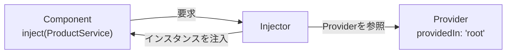

前章で、処理をServiceへ切り出すことを学びました。では、切り出したServiceを、Componentはどうやって手に入れるのでしょうか。その答えが、この章のテーマであるDependency Injection（依存性の注入、以下DI）です。

DIは、Angularの設計を支える中心的な仕組みです。名前は難しそうですが、考え方はシンプルです。「必要なものを、自分で用意するのではなく、外から渡してもらう」。これだけです。この章では、DIがどんな問題を解決するのか、なぜAngularがこの仕組みを採用しているのかを、順を追って理解します。抽象的に見える概念ですが、具体例を通せば、その便利さが見えてきます。

:::message
**この章で学ぶこと**

- 依存とは何か、DIが解決する問題
- 「注入してもらう」という考え方
- Injector・Provider・トークンという構成要素
- DIがもたらす利点
:::

## 依存とは何か

あるクラスが動くために、別のクラスを必要とすることを、「依存している」といいます。たとえば、`ProductListPage`が商品データを表示するために`ProductService`を必要とするなら、`ProductListPage`は`ProductService`に依存しています。この`ProductService`のような、動くために必要な相手を「依存（dependency）」と呼びます。

問題は、この依存をどうやって用意するかです。もっとも素朴な方法は、必要になった側が自分で作ることです。

```ts:DIを使わない書き方（自分で依存を作る）
export class ProductListPage {
  private readonly service = new ProductService();
}
```

`new ProductService()`で、自分でインスタンスを作っています。一見、問題なさそうです。しかし、この書き方にはいくつもの弱点が潜んでいます。

## 自分で依存を作ることの問題

自分で`new`する書き方には、次のような問題があります。

まず、**差し替えができません**。`ProductService`が、実際のサーバーと通信するとします。テストのときには、通信をせず、決まったデータを返す偽物のServiceに差し替えたくなります。しかし、`new ProductService()`とクラス名を直接書いていると、この差し替えができません。

次に、**共有ができません**。`ProductService`が状態を保持する場合、前章で見たように、複数のComponentで同じインスタンスを共有したいことがあります。ところが、各Componentがそれぞれ`new`すると、別々のインスタンスができてしまい、状態が共有されません。

さらに、**準備の連鎖が面倒です**。もし`ProductService`が、動くために`HttpClient`や設定オブジェクトを必要とするなら、`new ProductService()`の前に、それらも用意しなければなりません。依存が依存を持つと、この準備がどこまでも連鎖します。

これらの問題は、「必要な側が、依存を自分で用意している」ことに根ざしています。ならば、用意する役目を、外の誰かに任せてしまえばよい。それがDIの発想です。

## 注入してもらうという発想

DIでは、クラスは「自分が何を必要とするか」を宣言するだけで、その用意はAngularに任せます。Angularが、必要なインスタンスを作って（あるいは既存のものを見つけて）、渡してくれます。この「外から渡してもらう」ことを、注入（injection）と呼びます。

```ts:src/app/product-list-page.ts
import { Component, inject } from '@angular/core';

export class ProductListPage {
  private readonly service = inject(ProductService);
}
```

`inject(ProductService)`は、「`ProductService`を注入してください」という宣言です。自分で`new`していない点に注目してください。どのインスタンスを渡すか、どう準備するかは、Angularが引き受けます。`ProductListPage`は、`ProductService`が手に入るという事実だけに関心を持ち、その出どころを気にしません。

このように、必要なものを用意する責任を、使う側から外部の仕組みへ移すことを、制御の反転（Inversion of Control）と呼びます。第1章でフレームワークの特徴として触れた考え方が、DIという形で具体的に働いているのです。

## DIを支える3つの要素

AngularのDIは、3つの要素が連携して成り立っています。

- **Injector（インジェクター）**: 依存を管理し、要求に応じて提供する主体です。「注入してほしい」という要求を受け、該当するインスタンスを探して渡します。
- **Provider（プロバイダー）**: 「このトークンには、この方法でインスタンスを用意する」という登録情報です。前章の`providedIn: 'root'`は、`ProductService`をProviderとしてInjectorに登録する指定でした。
- **トークン**: 依存を識別する目印です。多くの場合、クラスそのもの（`ProductService`）がトークンになります。Injectorは、このトークンをたよりに、対応するProviderを探します。

流れを言葉にすると、こうです。Componentが「`ProductService`（トークン）がほしい」とInjectorに求める。Injectorは、そのトークンに対応するProviderを探す。Providerの登録どおりにインスタンスを用意し、Componentへ渡す。この一連の働きが、注入の正体です。



## DIがもたらす利点

依存を注入してもらう仕組みは、先ほど挙げた問題を、そのまま裏返した利点を生みます。

- **差し替えが容易**: テスト時に、本物のServiceの代わりに偽物を注入するよう、Providerの登録を変えるだけで済みます。使う側のコードは一切変えずに、中身を差し替えられます。
- **インスタンスの共有**: Injectorが単一のインスタンスを管理するため、複数のComponentが同じServiceを受け取れます。状態の共有が自然に実現します。
- **準備の連鎖を肩代わり**: Serviceがさらに別の依存を持っていても、Injectorが芋づる式に解決します。使う側は、末端の依存まで意識する必要がありません。
- **責務の分離**: 各クラスは「何を必要とするか」を宣言するだけでよく、「どう用意するか」から解放されます。関心事がきれいに分かれます。

これらの利点は、アプリケーションが大きくなるほど効いてきます。DIは、単なる便利機能ではなく、大規模なアプリケーションを見通しよく保つための、構造的な仕組みなのです。

## 差し替えの利点を具体的に見る

「差し替えが容易」という利点を、もう少し具体的に見てみましょう。`ProductListPage`が`ProductService`に依存しているとします。このComponentをテストするとき、本物の`ProductService`がサーバーと通信してしまうと、テストがネットワークの状態に左右され、不安定になります。

DIを使っていれば、テストのときだけ、通信をしない偽物のServiceを注入するよう指示できます。

```ts:テストでの差し替え（イメージ）
// 本物の代わりに、決まったデータを返す偽物を注入する
providers: [{ provide: ProductService, useValue: fakeProductService }]
```

`ProductListPage`のコードは、一文字も変える必要がありません。`inject(ProductService)`と書いてあるだけで、注入される中身が本物か偽物かは、外の登録が決めます。もし`new ProductService()`と自分で作っていたら、この差し替えはできず、テストのために本体のコードを書き換えるはめになっていたはずです。DIが、コードを変えずに振る舞いを差し替える柔軟さを生んでいるのです。この差し替えの仕組みは、次章以降のProviderの登録方法とあわせて、より詳しく扱います。

## DIは至るところで使われている

DIは、自分で作ったServiceだけのものではありません。Angularが提供する多くの機能も、DIを通して受け取ります。すでに本書に登場したものだけでも、次のように数多くあります。

- `ElementRef`（第14章）: ホスト要素への参照を`inject()`で受け取りました
- `TemplateRef`・`ViewContainerRef`（第15章）: 構造Directiveで注入しました
- これから学ぶ`HttpClient`（第9部）や`Router`（第7部）も、`inject()`で受け取ります

私たちが`inject(HttpClient)`と書けるのは、Angularが`HttpClient`をProviderとして登録しているからです。つまり、DIはAngularという枠組み全体を貫く共通の作法であり、フレームワークの機能も、自作のServiceも、同じ仕組みで手に入ります。この一貫性を理解すると、Angularのさまざまな機能が、なぜ`inject()`一つで使えるのかが腑に落ちます。

## どこで注入できるのか

`inject()`は、どこでも呼べるわけではありません。Angularが依存を解決できる文脈、いわゆる注入コンテキストの中でのみ使えます。具体的には、Component・Service・Directiveのクラスのフィールド初期化子や、コンストラクターの中が代表的な場所です。

```ts:src/app/product-list-page.ts
export class ProductListPage {
  // フィールドの初期化子で注入（注入コンテキスト内）
  private readonly service = inject(ProductService);
}
```

この「注入コンテキスト」の外、たとえばボタンクリックのハンドラーの中などで`inject()`を呼ぶと、エラーになります。依存の取得は、クラスの初期化のタイミングで行う、と覚えておけば、多くの場合つまずきません。詳しい仕組みは、次章の`inject()`の解説であらためて触れます。

## まとめ

- 依存とは、あるクラスが動くために必要とする別のクラスのことです
- 自分で`new`すると、差し替え・共有・準備の連鎖といった問題が生じます
- DIは、必要なものを外から注入してもらう仕組みで、制御の反転にもとづきます
- Injector・Provider・トークンが連携して、依存の解決を行います
- DIにより、差し替えの容易さ、インスタンスの共有、責務の分離が得られます

次章では、依存を実際に受け取る書き方を、旧来のConstructor Injectionと現在の`inject()`を比較しながら学びます。
