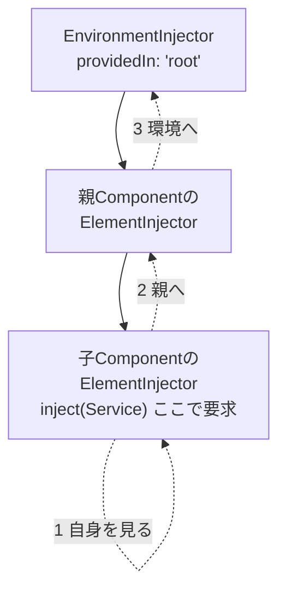

前章までで、Serviceを定義し、それを`inject()`で受け取る流れを学びました。この章では、その裏側にもう一歩踏み込みます。注入されるインスタンスは、いったいどこで作られ、どの範囲で共有されるのでしょうか。その答えを握るのが、ProviderとInjectorの階層です。

`providedIn: 'root'`と書けば、Serviceはアプリ全体でひとつのインスタンスとして共有される、と第22章で述べました。しかし、Serviceの提供のしかたは、これだけではありません。特定のComponentとその子だけで共有したい、あるいはComponentごとに別々のインスタンスを持たせたい、といった調整もできます。それを可能にするのが、Injectorの階層構造です。この章を理解すると、Serviceの「範囲」を意図して設計できるようになります。

:::message
**この章で学ぶこと**

- Injectorの階層構造
- Serviceを提供する場所による違い
- 依存が解決される仕組み
- さまざまなProviderの種類
:::

## 2種類のInjector

Angularには、性質の異なる2つのInjectorの階層があります。

ひとつは、**EnvironmentInjector（環境インジェクター）**です。アプリケーション全体にかかわるInjectorで、`app.config.ts`の`providers`や、`providedIn: 'root'`で登録したServiceを管理します。アプリの起動時に作られ、アプリが生きている間ずっと存在する、いちばん外側のInjectorです。

もうひとつは、**ElementInjector（要素インジェクター）**です。こちらは、ComponentやDirectiveごとに作られるInjectorです。`@Component`の`providers`に登録したServiceは、このElementInjectorが管理します。Componentが生成されるときに作られ、破棄されるときに消えます。

この2つが、Componentの階層に沿って積み重なり、ひとつの階層構造をなします。頂点にEnvironmentInjectorがあり、その下に、Componentのネストに対応してElementInjectorが連なる、というイメージです。

## Serviceを提供する場所

ServiceをどのInjectorに登録するかで、そのインスタンスが共有される範囲が変わります。おもな選択肢は2つです。

ひとつは、これまで使ってきた`providedIn: 'root'`です。EnvironmentInjectorに登録され、アプリ全体でひとつのインスタンスが共有されます。ほとんどのServiceは、これで十分です。

```ts:src/app/product.ts
@Injectable({ providedIn: 'root' })
export class ProductService {}
```

もうひとつは、Componentの`providers`に登録する方法です。この場合、そのComponentのElementInjectorにServiceが登録され、Componentのインスタンスごとに別々のServiceが作られます。

```ts:src/app/editor.ts
@Component({
  selector: 'app-editor',
  providers: [DraftService], // このComponentごとにインスタンスを作る
  template: `...`,
})
export class Editor {
  private readonly draft = inject(DraftService);
}
```

`Editor`が画面に3つあれば、`DraftService`も3つ作られます。それぞれの`Editor`が、自分専用の`DraftService`を持つわけです。編集中の下書きのように、Componentごとに独立していてほしい状態を保持するのに向いています。ひとつのタブの編集内容が、別のタブに混ざらないようにしたい、といった場面が典型です。逆に、全体で共有したい状態なら`providedIn: 'root'`を選びます。提供する場所の選択が、そのまま状態の独立と共有の境界を決めるのです。

| 提供の場所 | 共有範囲 | 用途 |
|---|---|---|
| `providedIn: 'root'` | アプリ全体で単一 | 共有される状態・共通処理。大半はこちら |
| Componentの`providers` | そのComponentと子孫 | Componentごとに独立させたい状態 |

## 依存はどう解決されるか

`inject(SomeService)`が呼ばれると、Angularはどうやって該当するインスタンスを見つけるのでしょうか。答えは「下から上へ探す」です。

まず、注入を要求したComponent自身のElementInjectorを見ます。そこに登録がなければ、親のElementInjectorへ、さらにその親へと、階層を上へたどっていきます。それでも見つからなければ、最後にEnvironmentInjectorを調べます。そこにもなければ、エラーになります。



この「近いところから探し、なければ上へ」という仕組みが、Serviceの範囲を階層で制御できる理由です。あるComponentの`providers`に登録すれば、そのComponentと子孫は、上位の同名Serviceより先に、その登録を見つけます。近いInjectorの登録が優先されるのです。前章で触れた`self`や`skipSelf`といったオプションは、この探索の起点や範囲を調整するものでした。

## Providerの種類

ここまで、Serviceのクラスをそのまま登録してきました。実は、`providers`への登録には、いくつかの書き方（Provider）があります。「このトークンに対して、何を、どう用意するか」を指定するものです。

- **`useClass`**: 指定したクラスのインスタンスを用意する。クラス名だけを書く通常の登録は、この省略形です。
- **`useValue`**: あらかじめ用意した値（オブジェクトや定数）を、そのまま提供する。
- **`useFactory`**: 関数を呼び、その戻り値を提供する。生成に条件や計算が必要なときに使う。
- **`useExisting`**: 既存のトークンの別名を作る。あるトークンへの要求を、別のトークンへ振り向ける。

たとえば、あるインターフェースの実装を差し替えたいときは、`useClass`が使えます。テスト時に本物のServiceを偽物に差し替える、という第23章の話は、この仕組みで実現します。

```ts
// 本番ではRealLoggerを、テストではFakeLoggerを注入する
providers: [{ provide: Logger, useClass: RealLogger }]
```

`provide`が要求されるトークン、`useClass`が実際に用意するクラスです。使う側は`inject(Logger)`と書くだけで、登録を`RealLogger`から`FakeLogger`に変えれば、中身が差し替わります。使う側のコードは、まったく変わりません。

## クラスでない依存とInjectionToken

依存は、いつもクラスとは限りません。設定オブジェクトや、APIのURLといった文字列など、クラスでない値を注入したいこともあります。しかし、そうした値はトークンとして使えません。`inject('https://...')`のような指定は成り立たないためです。

この問題を解くのが、`InjectionToken`です。クラスでない依存のために、一意な目印を作る仕組みです。

```ts:src/app/config.ts
import { InjectionToken } from '@angular/core';

export const API_BASE_URL = new InjectionToken<string>('API_BASE_URL');
```

```ts:src/app/app.config.ts
export const appConfig: ApplicationConfig = {
  providers: [{ provide: API_BASE_URL, useValue: 'https://api.example.com' }],
};
```

`API_BASE_URL`というトークンを作り、`useValue`で実際のURLを登録しています。使う側は、このトークンで注入します。

```ts
private readonly baseUrl = inject(API_BASE_URL);
```

`InjectionToken`により、文字列や設定オブジェクトのような、クラスでない値も、型安全にDIの仕組みへ載せられます。名前の衝突を避けつつ、値を注入できるのです。環境ごとに異なるAPIのURLや、機能のオン・オフを切り替える設定などを、この方法でアプリ全体に配る、といった使い方が典型です。ハードコードを避け、設定を一か所に集められるため、環境の切り替えや設定変更に強い構成になります。

## よくあるつまずき

- **どこに提供すべきか迷う**: まずは`providedIn: 'root'`を基本と考えます。Componentごとに独立したインスタンスが必要な、明確な理由があるときだけ、Componentの`providers`を使います。
- **意図せず複数インスタンスができる**: `providedIn: 'root'`のServiceを、さらにComponentの`providers`にも登録すると、そのComponent配下では別インスタンスになります。共有したいServiceを二重に登録していないか、確認します。
- **`NullInjectorError`が出る**: 「Providerが見つからない」というエラーです。Serviceに`providedIn: 'root'`が付いているか、あるいは適切なInjectorに登録されているかを確認します。エラーメッセージには、どのトークンが解決できなかったかが示されるため、その名前を手がかりに登録漏れを探します。

## まとめ

- Injectorには、アプリ全体のEnvironmentInjectorと、ComponentごとのElementInjectorがあります
- `providedIn: 'root'`はアプリ全体で単一、Componentの`providers`はComponentごとに別インスタンスです
- 依存は、要求元から上へInjectorをたどって解決され、近い登録が優先されます
- Providerには`useClass`・`useValue`・`useFactory`・`useExisting`があり、実装を差し替えられます
- クラスでない値は、`InjectionToken`を使ってDIに載せられます

以上で第5部は終わりです。次の第6部では、Angularが画面をいつ・どう更新するのかという変更検知の仕組みと、その中心にあるSignalsを学びます。
