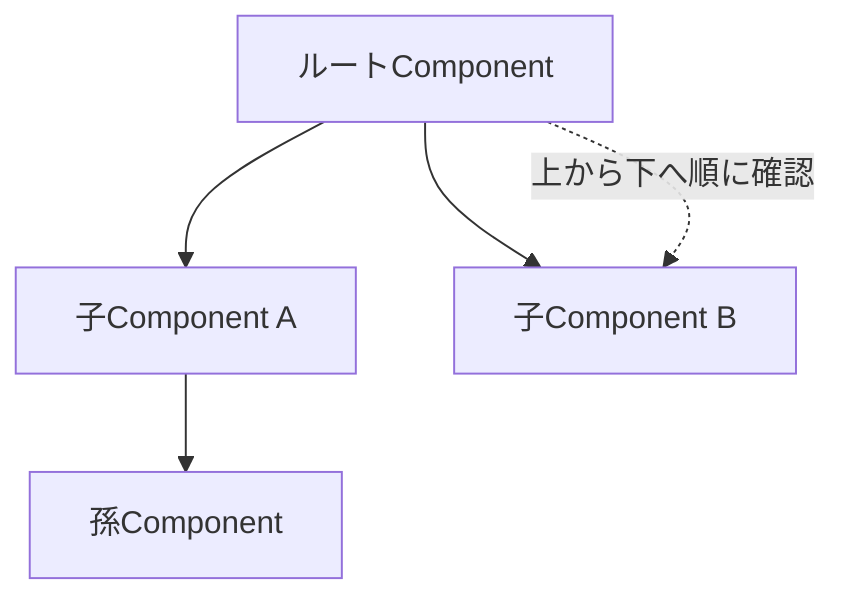

これまで、クラスのデータを変えれば画面が更新される、という動きを当然のものとして使ってきました。`signal()`の値を`set()`で変えれば、表示が切り替わる。ボタンを押してプロパティを書き換えれば、画面に反映される。しかし、なぜそれが起きるのでしょうか。誰かが「データが変わったから、画面を描き直そう」と判断しているはずです。その判断を担う仕組みが、変更検知（Change Detection）です。

変更検知は、ふだんは意識せずに済む、縁の下の力持ちです。しかし、その仕組みを理解しておくと、「なぜか画面が更新されない」「表示は正しいのに動作が重い」といった問題に、根拠を持って対処できます。この章では、変更検知とは何か、いつ動くのか、何をしているのかを、基礎から丁寧に見ていきます。

:::message
**この章で学ぶこと**

- 変更検知とは何をする仕組みか
- 変更検知がいつ実行されるのか
- Componentツリーをたどる検知の流れ
- 変更検知を理解する意義
:::

## 変更検知とは何か

変更検知とは、「クラスが持つデータ（状態）」と「画面に表示されている内容（DOM）」を一致させ続ける仕組みです。

第3部で学んだデータバインディングを思い出してください。`{{ name() }}`と書けば、`name`の値が画面に表示されます。では、`name`の値が後から変わったとき、その新しい値を画面に反映するのは誰でしょうか。ブラウザは、JavaScriptの変数が変わったことを自動では知りません。誰かが「`name`が変わったから、対応する部分のDOMを書き換えよう」と動く必要があります。

この「状態を見て、変わっていたらDOMを更新する」という一連の処理が、変更検知です。Angularは、状態とテンプレートの対応関係を把握しているので、状態の変化を検知しさえすれば、画面のどこを更新すべきかを判断できます。変更検知は、状態と画面のずれを埋め、常に整合した表示を保つための仕組みなのです。

## いつ変更検知が必要になるのか

状態は、何もないところで勝手に変わることはありません。必ず、何らかのきっかけがあって変わります。アプリケーションの状態が変わりうるのは、おもに次のような非同期の出来事が起きたときです。

- 利用者の操作（クリック、入力、送信など）
- タイマー（`setTimeout`・`setInterval`）の発火
- サーバーからの応答（API通信の完了）
- その他の非同期イベント

たとえば、ボタンをクリックしてカウンターを増やすなら、状態が変わるのは「クリックされた瞬間」です。API通信でデータを取得するなら、「応答が返ってきた瞬間」です。つまり、こうした出来事の後には、状態が変わっている可能性があり、変更検知を走らせて画面を更新する必要が生じます。

逆にいえば、こうした出来事が何も起きていないあいだは、状態は変わりようがないため、変更検知を走らせる必要もありません。「いつ変更検知を動かすか」は、「いつ状態が変わりうるか」と同じ問いなのです。この問いにどう答えるかが、後の章で扱うZone.jsとZonelessの違いの核心になります。

## Componentツリーをたどる

変更検知が走ると、Angularは何をするのでしょうか。基本的には、Componentのツリーを上から下へたどりながら、各Componentのテンプレートを確認していきます。

第17章で見たように、アプリケーションはComponentの階層、すなわちツリー構造をなしています。変更検知は、そのツリーの頂点（ルート）から始まり、親から子へと順に降りていきます。各Componentで、テンプレートに書かれたバインディング（`{{ }}`や`[prop]`）の値を、前回の値と比べます。値が変わっていれば、対応するDOMを更新します。変わっていなければ、何もしません。



この、一つひとつのバインディングの値を前回と比べて差分を見つける方式を、変更検知の基本的な動作と考えてください。ツリー全体を一度たどりきることで、画面のどこかに生じた変化を、もれなく反映できます。この一巡りを、変更検知のサイクルと呼びます。

## 具体例で流れを追う

抽象的な説明を、具体的な動きに落としてみましょう。カウンターを1つ持つ画面を考えます。

```ts:src/app/counter.ts
@Component({
  selector: 'app-counter',
  template: `
    <p>{{ count() }}</p>
    <button (click)="increment()">増やす</button>
  `,
})
export class Counter {
  protected readonly count = signal(0);

  protected increment(): void {
    this.count.update((n) => n + 1);
  }
}
```

このボタンを押したとき、何が起きるかを順にたどります。まず、利用者がボタンをクリックします。これが、状態が変わりうる「きっかけ」です。次に、クリックのハンドラー`increment`が実行され、`count`が`0`から`1`に変わります。ここで、状態と画面にずれが生じます。画面はまだ`0`を表示しているためです。そこでAngularが変更検知を走らせます。テンプレートの`{{ count() }}`を評価すると`1`が得られ、前回の`0`と違うため、Angularはこの箇所のDOMを`1`に書き換えます。こうして、状態と画面が再び一致します。

私たちが書いたのは、`count`を1増やす処理だけです。「画面を書き換えよ」とはどこにも書いていません。にもかかわらず表示が更新されるのは、この変更検知が、クリックをきっかけに自動で走っているからです。ふだん意識しない動きの裏で、こうしたサイクルが回っています。

## 変更検知の歴史的な進化

変更検知の方式は、Angularの歴史とともに変わってきました。第2章で触れた流れを、変更検知の視点から振り返ると、モダンAngularの位置づけが見えてきます。

初代のAngular（AngularJS）は、ダイジェストサイクルと呼ばれる仕組みで、監視対象の値を総当たりで比較していました。次の世代（Angular 2以降）では、本章で見たComponentツリーをたどる方式になり、Zone.jsが変更検知の起動を担うようになりました。そしてモダンAngularは、Signalによって「どの状態がどこで使われているか」を追跡し、変わった箇所だけを狙って更新する方向へ進んでいます。

大きな流れとしては、「広く総当たりで確認する」方式から、「変化した箇所を正確に狙う」方式へと、一貫して効率を高めてきた、といえます。この進化の到達点が、第29章のSignalsと第30章のZonelessです。本章で学ぶ基本の仕組みは、その進化の土台をなすものです。

## 手動で変更検知に関わる

ふだん変更検知は自動ですが、まれに手動で関わることがあります。そのための窓口が`ChangeDetectorRef`で、`inject()`で取得できます。代表的なメソッドを挙げます。

- **`markForCheck()`**: このComponentを次回の変更検知で確認するよう印を付けます。第27章で触れたOnPushと関わります。
- **`detectChanges()`**: その場で、このComponent以下の変更検知を即座に実行します。
- **`detach()`／`reattach()`**: 変更検知の対象から外す／戻します。

これらは、通常の開発ではほとんど使いません。SignalとOnPushで書いていれば、変更検知は自動で適切に働くためです。手動の制御が必要になったときは、まず「なぜ自動で検知されないのか」を考えるのが先決です。多くの場合、原因は状態の持ち方にあり、Signalへ移すことで手動制御が不要になります。

## よくあるつまずき

- **画面が更新されない**: データを変えたのに表示が変わらないときは、変更検知が走っていないか、変化として検知されていないことを疑います。状態をSignalで持てば、変化が確実に通知され、この種の問題の多くを避けられます。
- **オブジェクトの中身を書き換えて検知されない**: 配列やオブジェクトは参照で比較される場面があります。中身だけを書き換えると変化とみなされないことがあるため、新しい値に差し替えます。
- **変更検知が重い**: 大規模なアプリで動作が重いときは、変更検知の回数と範囲を疑います。OnPush（第27章）やSignal、Zoneless（第30章）が、その対処の柱になります。「重い処理をテンプレートやメソッドで毎回実行していないか」も確認します。

## 値の比較のしかた

変更検知が値を比べるとき、その比較は「同一かどうか」の単純な比較です。プリミティブな値（数値や文字列）なら、値そのものを比べます。オブジェクトや配列なら、中身ではなく、参照（それが同じインスタンスを指しているか）を比べます。

この「参照で比べる」という点は、後の章で重要になります。たとえば、配列の中身を書き換えても、配列そのもの（参照）が同じであれば、変更検知は「変わっていない」と判断することがあります。逆に、新しい配列を作って差し替えれば、参照が変わるため、変化として検知されます。ここでは、比較が参照ベースで行われることがある、という点を頭の片隅に置いておいてください。第27章のOnPushで、この性質が効いてきます。

## 変更検知を理解する意義

変更検知は、ふだんは自動で動くため、意識しなくてもアプリケーションは動きます。それでも、その仕組みを理解しておく意義は大きいものです。

ひとつは、**表示が更新されない問題への対処**です。「データを変えたのに画面が変わらない」というつまずきは、多くの場合、変更検知が走っていないか、変化として検知されていないことが原因です。仕組みを知っていれば、原因を切り分けられます。

もうひとつは、**パフォーマンスの理解**です。変更検知は、走るたびにツリーをたどるため、規模が大きくなると、その回数と範囲がアプリの速度に影響します。不要な変更検知を減らす工夫が、パフォーマンス改善の柱になります。その工夫の入り口が、次章のOnPushであり、さらにその先のSignalsとZonelessです。

そして、モダンAngularがSignalsへ舵を切った理由も、変更検知の視点から見ると腑に落ちます。従来の方式は、「状態が変わったかもしれない」タイミングでツリー全体を確認していました。Signalは、「どの状態が、どこで使われているか」をAngularに正確に伝えます。これにより、変わった箇所だけを狙って更新できるようになります。変更検知の効率化こそ、Signalsがもたらす最大の恩恵のひとつなのです。

## まとめ

- 変更検知は、クラスの状態と画面のDOMを一致させ続ける仕組みです
- 状態は、操作・タイマー・通信などの非同期の出来事をきっかけに変わります
- 変更検知は、Componentツリーを上から下へたどり、バインディングの値を確認します
- 値の比較は、オブジェクトや配列では参照ベースで行われることがあります
- 仕組みの理解は、表示更新の問題への対処と、パフォーマンス改善の土台になります

次章では、この変更検知に2つの戦略、Default（現在のEager）とOnPushがあることを学び、その違いを掘り下げます。
