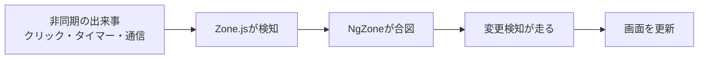

前の2つの章で、変更検知が「状態が変わりうるタイミングで走る」ことを学びました。では、Angularはどうやって、そのタイミングを知っていたのでしょうか。クリックやタイマー、通信の完了といった非同期の出来事を、フレームワークはどのようにして察知していたのか。その長年の答えが、Zone.jsという仕組みでした。

Zone.jsは、Angularが誕生初期から変更検知の起点として使ってきた、縁の下の力持ちです。私たちが`setTimeout`のあとに何もしなくても画面が更新されたのは、Zone.jsのおかげでした。しかしこの仕組みには、便利さと引き換えの課題もありました。この章では、Zone.jsとNgZoneが何をしていたのか、そしてなぜモダンAngularがそこから離れようとしているのかを理解します。次章のZonelessへの転換を理解するための、重要な前提です。

:::message
**この章で学ぶこと**

- Zone.jsが何をしていたか
- NgZoneの役割
- Zone.jsによる変更検知の起動
- Zone.jsが抱えていた課題
:::

## Zone.jsとは何か

Zone.jsは、ブラウザの非同期APIを「監視」するためのライブラリです。ここでいう非同期APIとは、`setTimeout`・`setInterval`・`addEventListener`・`fetch`やXHRといった、「あとで何かが起きる」たぐいの機能を指します。

Zone.jsは、これらのAPIに細工をします。本来のAPIを、自前の処理で包み込むのです。この「既存の機能を包んで差し替える」手法を、モンキーパッチと呼びます。たとえば`setTimeout`なら、Zone.jsが用意した`setTimeout`が代わりに呼ばれるようになり、その中で本来の`setTimeout`を呼びつつ、「タイマーが発火した」ことをZone.jsが知れるようにします。

こうしてZone.jsは、アプリケーションの中で起きるあらゆる非同期の出来事を、横から把握できるようになります。「いつ、何の非同期処理が完了したか」を知る監視役、それがZone.jsの正体です。

## モンキーパッチを具体的にイメージする

モンキーパッチの発想を、具体的にイメージしてみましょう。次のような、ごくふつうのコードがあるとします。

```ts
setTimeout(() => {
  this.message = 'こんにちは';
}, 1000);
```

Zone.jsがない世界では、1秒後に`message`が書き換わっても、それだけです。Angularは、この書き換えを知るすべがありません。ところがZone.jsがあると、この`setTimeout`は、Zone.jsが差し替えた`setTimeout`に置き換わっています。その中では、本来のタイマー処理を実行したうえで、「タイマーのコールバックが終わった」ことをZone.jsが記録します。そしてAngularへ「非同期処理がひと区切りした」と合図を送ります。

つまり、開発者は標準の`setTimeout`を書いているつもりでも、実際にはZone.jsに包まれたものが動いていた、というわけです。この見えない仕掛けがあったからこそ、`message`を書き換えるだけで画面が更新される、という魔法のような体験が成り立っていました。裏を返せば、この魔法はZone.jsという大きな仕掛けの上に乗っていた、ということでもあります。

## すべての非同期が対象になるとは限らない

Zone.jsは多くの非同期APIを監視しますが、Zone.jsが認識できない方法で状態が変わった場合は、自動検知が働きません。たとえば、Zone.jsがパッチしていない特殊なAPIや、Angularの外側で動くサードパーティのライブラリのコールバックなどです。

こうした場合、従来は変更検知が走らず、画面が更新されないという問題が起きました。その対処として、`NgZone`の`run`メソッドで明示的にAngularのゾーンに処理を戻したり、`ChangeDetectorRef`で手動検知を促したりする必要がありました。「Zone.jsが検知してくれるはず」という前提が崩れる場面が、確かに存在したのです。これも、Zone.js方式のわかりにくさのひとつでした。状態の変化が、暗黙の監視に依存していたためです。

## NgZoneの役割

Angularは、このZone.jsを土台に、`NgZone`という独自の仕組みを用意しました。`NgZone`は、Angularアプリケーション専用のゾーン（監視区画）です。アプリの処理は、この`NgZone`の中で実行されます。

`NgZone`は、監視している非同期の出来事が「ひと区切りついた」ことを検知すると、Angularに合図を送ります。この合図が、変更検知の起点でした。つまり、次のような流れです。



この仕組みのおかげで、開発者は変更検知を意識する必要がありませんでした。ボタンのクリックハンドラーでプロパティを書き換えれば、クリックという出来事をZone.jsが検知し、`NgZone`が合図を送り、変更検知が走って画面が更新される。この一連が、すべて自動で起きていたのです。「状態を変えれば画面が変わる」という当たり前の体験は、Zone.jsと`NgZone`が支えていました。

## Zone.jsによる変更検知の起動

ここで、前章までの内容とつながります。第26章で「状態が変わりうるタイミングで変更検知が走る」と述べ、第27章で「従来の戦略はツリー全体を確認する」と述べました。この2つを結ぶのがZone.jsです。

Zone.jsが非同期の出来事を検知するたびに、Angularは変更検知を起動し、ツリーをたどって画面を更新していました。クリック1回、タイマー1回ごとに、変更検知のサイクルが1回走る、というイメージです。開発者が何も書かなくても画面が同期され続けたのは、この自動起動があったからにほかなりません。

## Zone.jsが抱えていた課題

長年アプリを支えてきたZone.jsですが、いくつかの課題も抱えていました。モダンAngularがそこから離れようとしているのは、これらの課題があるためです。

第一に、**過剰な変更検知**です。Zone.jsは、「状態が変わったかどうか」までは判断できません。あくまで「非同期の出来事が起きた」ことを検知するだけです。そのため、状態が実際には何も変わっていない出来事に対しても、変更検知が走ってしまいます。たとえば、画面のどことも関係のないタイマーが動くたびに、ツリー全体の確認が走る、といった無駄が生じえます。第27章のOnPushは、この無駄を各Componentの単位で抑える工夫でしたが、起動そのものはZone.jsが握っていました。

第二に、**バンドルサイズ**です。Zone.jsは、それ自体がそれなりの大きさを持つライブラリです。アプリケーションの一部として読み込まれるため、最初にダウンロードするコードの量を増やし、起動を遅くする一因になっていました。

第三に、**デバッグの難しさ**です。Zone.jsは非同期APIをモンキーパッチするため、エラーが起きたときのスタックトレース（処理の呼び出し履歴）に、Zone.js由来の複雑な情報が混ざります。これが、問題の原因を追う際の見通しを悪くすることがありました。

第四に、**エコシステムとの相性**です。ブラウザAPIを書き換えるという性質上、ほかのライブラリと予期しない干渉を起こすことがありました。標準的なブラウザの挙動を前提とするコードと、かみ合わない場面があったのです。

## NgZoneを意識する場面

ふだんZone.jsや`NgZone`を直接触ることはありませんが、従来のアプリでは、あえて`NgZone`を操作する場面もありました。代表的なのが、`runOutsideAngular`です。

```ts:NgZoneの外で処理を実行する（従来の最適化手法）
import { NgZone, inject } from '@angular/core';

export class ScrollTracker {
  private readonly zone = inject(NgZone);

  start(): void {
    // 頻発するイベントを、変更検知の外で処理する
    this.zone.runOutsideAngular(() => {
      window.addEventListener('scroll', () => this.onScroll());
    });
  }
}
```

スクロールのように高頻度で発火するイベントを、変更検知の外で処理し、必要なときだけ`NgZone`の中に戻る、という最適化です。これは、Zone.jsが「あらゆる非同期を検知して変更検知を起動する」ことの裏返しでした。過剰な起動を、開発者が手作業で抑えていたわけです。こうした工夫が必要だったこと自体が、Zone.js方式の限界を示していました。

## Zone.jsは「悪」ではない

ここまでZone.jsの課題を並べましたが、Zone.jsが悪い仕組みだったわけではありません。むしろ、長らくAngularの開発体験を支えた、優れた発明でした。「状態を変えれば画面が変わる」という直感的な体験は、Zone.jsがあってこそ実現していました。開発者は変更検知をまったく意識せずに、アプリを書けたのです。これは初学者にとって、大きな助けでした。

問題は、時代とともに、アプリケーションが大規模化し、パフォーマンスへの要求が高まったことにあります。Zone.jsの「念のため広く確認する」方式は、小規模なうちは十分でしたが、規模が大きくなると無駄が目立ちます。また、Signalという、より精密な変化追跡の手段が登場したことで、「Zone.jsに頼らなくても、変化を正確に捉えられる」道が開けました。Zone.jsからの移行は、Zone.jsの否定ではなく、より良い手段への発展と捉えるのが正確です。第2章で述べた「新旧を否定的に語らない」という本書の姿勢は、ここにも当てはまります。

## よくあるつまずき

- **Zone.jsの検知に暗黙的に頼る**: `setTimeout`のコールバック内でプロパティを書き換え、自動更新に頼るコードは、Zonelessでは動きません。状態はSignalで持つのが、将来にわたって安全です。
- **`runOutsideAngular`の戻し忘れ**: `runOutsideAngular`の中で状態を変えても、変更検知は走りません。表示を更新したいときは、`NgZone`の`run`で明示的にゾーンへ戻す必要がありました。
- **Zone.jsを闇雲に取り除く**: 既存アプリからZone.jsを外すと、自動検知に頼っていた箇所が動かなくなることがあります。先にSignalへ移してから取り除くのが安全です。

## まとめ

- Zone.jsは、ブラウザの非同期APIをモンキーパッチして監視するライブラリです
- `NgZone`はAngular専用のゾーンで、非同期の区切りを検知して変更検知を起動していました
- この仕組みにより、開発者は変更検知を意識せず、自動的な画面更新を得ていました
- 一方で、過剰な変更検知・バンドルサイズ・デバッグの難しさといった課題がありました
- `runOutsideAngular`など、過剰な起動を手作業で抑える工夫も必要でした

次章では、Zone.jsに代わって変更検知の主役となるSignalsを、`signal()`・`computed()`・`effect()`の3本柱で体系的に学びます。
