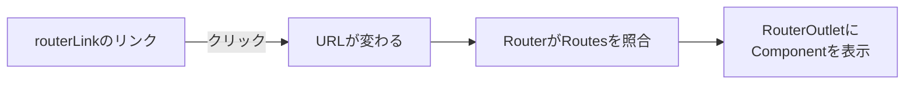

Angularで作るアプリケーションは、その多くがSPA（Single Page Application、シングルページアプリケーション）と呼ばれる形式をとります。この章では、SPAとは何か、従来のWebサイトとどうしくみがちがうのかをつかみ、そのうえでAngular Routerがどんな役割を果たすのかを理解します。

Routerは、URLと画面を結びつける仕組みです。しかし、なぜそんな仕組みがわざわざ必要なのでしょうか。その答えは、SPAというアプリケーションの成り立ちにあります。まずSPAの考え方を押さえることで、Routerが解決している課題が見えてきます。この章は、この先のRouter各章の土台となる、概念の整理回です。

:::message
**この章で学ぶこと**

- SPAと従来のWebサイトの違い
- SPAが抱える「画面遷移」の課題
- Angular Routerの役割
- ルーティングを構成する基本要素
:::

## 従来のWebサイトの仕組み

まず、SPAでない従来のWebサイトを振り返ります。従来のサイトでは、ページを移動するたびに、ブラウザがサーバーへ新しいHTMLを要求していました。トップページから商品ページへ移るなら、ブラウザは商品ページのHTMLをサーバーからまるごと受け取り、画面全体を描き直します。

この方式は素直ですが、いくつかの弱点があります。ページを移るたびに画面が真っ白になり、全体を読み込み直すため、動きがぎこちなくなりがちです。また、ページ間で共通の部分（ヘッダーやサイドバーなど）まで、毎回受け取って描き直すことになり、無駄も生じます。利用者から見ると、操作のたびに待たされる、重い体験になりやすいのです。

## SPAという考え方

SPAは、この課題への答えとして生まれました。SPAでは、最初に一度だけ、アプリケーションの本体（HTMLとJavaScript）を読み込みます。以降のページ遷移では、サーバーへHTMLを取りにいくのではなく、JavaScriptが画面の一部だけを書き換えます。

たとえば商品一覧から商品詳細へ移るとき、SPAは画面全体を捨てて作り直すのではなく、変わる部分（一覧の領域を詳細の領域に）だけを差し替えます。ヘッダーやサイドバーはそのまま残ります。結果として、遷移がなめらかで速く、まるでデスクトップアプリケーションのような操作感が得られます。第1章で「Angularは動的なWebアプリケーションを作るためのフレームワーク」と述べましたが、そのアプリケーションの多くが、このSPAの形をとります。

一方で、SPAには独自の課題も生まれます。それが、次に述べる「画面遷移とURL」の問題です。

## SPAが抱える画面遷移の課題

SPAでは、JavaScriptが画面を書き換えるだけなので、放っておくとURLが変わりません。どのページを見ていても、ブラウザのアドレス欄は最初のURLのまま、ということが起こりえます。これは、いくつもの不都合を生みます。

- **ブックマークできない**: いま見ている商品詳細ページを、あとで開き直したくても、URLが変わっていないため、ブックマークしても最初の画面に戻ってしまいます。
- **戻る・進むが効かない**: ブラウザの戻るボタンは、URLの履歴をたどる機能です。URLが変わらなければ、戻る操作でひとつ前の画面に戻れません。
- **URLを共有できない**: 「この商品のページを見て」とURLを送っても、受け取った相手は目的のページにたどり着けません。

つまり、SPAは操作感を良くする代わりに、Webの基本である「URLが画面を表す」という性質を失いがちなのです。この問題を解決し、SPAでもURLと画面をきちんと対応させる。それがRouterの仕事です。

## Angular Routerの役割

Angular Routerは、URLとComponentを結びつける仕組みです。「このURLのときは、このComponentを表示する」という対応づけを管理します。

Routerがあると、SPAでありながら、URLが画面を正しく表すようになります。商品詳細ページを開けばURLが`/products/42`のように変わり、そのURLをブックマークすれば、あとで同じページを開けます。戻るボタンを押せば、URLの履歴に沿って前の画面に戻れます。URLを共有すれば、相手も同じページを開けます。SPAのなめらかさを保ちながら、Webの基本的な使い勝手を取り戻せるのです。

しかも、実際のページ遷移では、サーバーへHTMLを取りにいきません。RouterがURLの変化を捉え、対応するComponentに表示を差し替えます。ブラウザの再読み込みは起きず、SPAならではの速い遷移が保たれます。RouterはURLを操作しますが、それはブラウザの履歴の仕組みを使ったもので、サーバーへの再要求ではないのです。

## RouterはどうやってURLを操作するのか

「再読み込みせずにURLだけを変える」というのは、少し不思議に思えるかもしれません。これを可能にしているのが、ブラウザが備えるHistory API（履歴API）という仕組みです。History APIを使うと、JavaScriptから、ページを再読み込みせずにアドレス欄のURLと履歴を書き換えられます。

Angular Routerは、内部でこのHistory APIを使っています。`routerLink`のリンクがクリックされると、Routerはページ遷移をブラウザに任せず、自分で受け止めます。そして、History APIでURLを書き換えつつ、対応するComponentを`RouterOutlet`に表示します。ブラウザから見ると、URLと履歴だけが更新され、ページの再読み込みは起きていません。だからこそ、戻るボタンや進むボタンも、ふつうのWebサイトと同じように機能します。ブラウザの履歴には、遷移のたびにエントリーが積まれていくためです。

この仕組みのおかげで、私たちはHistory APIを直接触ることなく、`routerLink`や`Router`を使うだけで、URLと画面が正しく連動するSPAを作れます。低レベルの複雑さを、Routerが引き受けてくれているのです。

## SPAの弱点と、その先の話題

SPAには多くの利点がありますが、弱点もあります。代表的なのが、最初の読み込みです。SPAは、最初にアプリ本体（JavaScript）を読み込んでから画面を組み立てるため、この初回の読み込みが大きいと、最初の表示までに時間がかかります。第35章で学ぶLazy Loadingは、この弱点をやわらげる手段のひとつです。

もうひとつの弱点が、検索エンジンやSNSへの対応です。SPAは、JavaScriptが実行されて初めて画面が組み上がります。JavaScriptを実行しない相手（一部の検索エンジンのクローラーや、SNSのリンク展開など）には、中身のない空のページに見えることがあります。この課題への対処が、第62章で扱うSSR（サーバーサイドレンダリング）です。サーバー側であらかじめHTMLを組み立てて返すことで、SPAの利点を保ちつつ、初回表示や検索対応を改善します。

ここでは、SPAが万能ではなく、初回表示と検索対応という弱点を持つこと、そしてそれぞれに対処法が用意されていることを、頭の片隅に置いておいてください。

## ルーティングを構成する基本要素

Angularでルーティングを行うとき、登場する基本的な要素を先に紹介しておきます。詳しくは次章以降で扱いますが、全体像として押さえておくと理解がスムーズになります。

- **Routes（ルート定義）**: 「どのURLで、どのComponentを表示するか」の対応表です。ルーティングの設計図にあたります。
- **`provideRouter()`**: そのRoutesをアプリケーションに登録する関数です。第4章で見た`app.config.ts`に書きます。
- **`RouterOutlet`**: 表示するComponentが差し込まれる場所です。テンプレートに`<router-outlet />`と置きます。
- **`routerLink`**: ページ遷移のためのリンクを作るDirectiveです。`<a>`タグに付けて使います。

これらが連携して、URLと画面の対応が実現します。おおまかな流れは、こうです。利用者が`routerLink`のリンクをクリックする。URLが変わる。RouterがRoutesを見て、対応するComponentを見つける。そのComponentを`RouterOutlet`の位置に表示する。この一連が、ページ遷移のたびに繰り返されます。

## SPAとMPAの使い分け

SPAが常に最適とは限りません。従来型の、ページごとにサーバーからHTMLを返す方式は、MPA（Multi Page Application）と呼ばれます。それぞれに向き不向きがあります。

SPAは、ダッシュボードや業務アプリのように、利用者が長く操作し、画面遷移が頻繁に起きるアプリケーションに向きます。一度読み込めば、その後の操作がなめらかだからです。一方、記事を読むだけのブログや、商品を眺める程度のサイトなど、ページ間の移動が少なく、内容の表示が主目的なら、MPAでも十分なことがあります。

もっとも、Angularは第62章で扱うSSRによって、SPAとMPAの利点を組み合わせることもできます。サーバーで初期HTMLを生成しつつ、その後はSPAとして動く、という構成です。「SPAかMPAか」は白黒はっきり分かれるものではなく、要件に応じて選び、組み合わせるものだと理解しておくとよいでしょう。本書が扱うのは主にSPAとしてのAngularですが、その位置づけを知っておくと、技術選定の視野が広がります。

## よくあるつまずき

- **内部リンクに`href`を使う**: アプリ内のページ遷移に`<a href>`を使うと、ページ全体が再読み込みされ、SPAの利点が失われます。内部遷移は`routerLink`を使います。
- **URLの変化を軽視する**: SPAでも、画面の状態はできるだけURLに表すのがよい設計です。URLに状態が表れていれば、ブックマークや共有、戻る操作が自然に機能します。
- **Routerなしで画面を切り替えようとする**: `@if`だけで画面全体を出し分けることもできますが、URLと連動しないため、ブックマークや戻る操作が効きません。ページ単位の切り替えは、Routerに任せるのが基本です。一方、同じページ内での小さな表示の出し分けは、`@if`で十分です。ページ遷移はRouter、画面内の分岐は`@if`、と使い分けを意識してください。

## まとめ

- SPAは、最初に一度だけ本体を読み込み、以降は画面の一部だけを書き換える方式です
- SPAはなめらかな操作感を得る一方、放置するとURLが画面を表さなくなる課題を抱えます
- Angular Routerは、URLとComponentを結びつけ、その課題を解決します
- Routerにより、ブックマーク・戻る進む・URL共有といったWebの使い勝手を保てます
- ルーティングは、Routes・`provideRouter()`・`RouterOutlet`・`routerLink`で構成されます

次章では、そのルーティングをアプリケーションに設定する方法を、旧来の`RouterModule`と現在の`provideRouter()`を比較しながら学びます。
