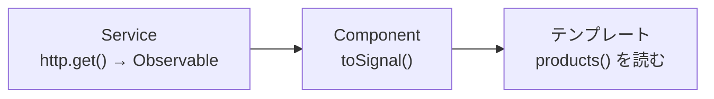

アプリケーションの多くは、サーバーとデータをやり取りします。商品一覧をサーバーから取得する、入力されたデータをサーバーへ保存する。こうした通信を担うのが、AngularのHttpClientです。この章では、HttpClientの基本的な使い方を学びます。

HttpClientは、サーバーへの要求の結果を、Observableで返します。第8部で学んだRxJSが、ここで実際に活きてきます。通信は非同期処理の代表例であり、いつ応答が返るかわからない、失敗するかもしれない、という性質を持ちます。Observableは、まさにこうした処理を扱うためのものでした。この章で、通信とRxJS、そしてSignalが、どう結びつくのかを見ていきます。

:::message
**この章で学ぶこと**

- `provideHttpClient()`による準備
- GET・POSTなどの基本的な通信
- 型付きレスポンスの受け取り
- 通信結果をServiceにまとめる設計
:::

## HttpClientを準備する

HttpClientを使うには、アプリケーションに登録する必要があります。第4章で見た`app.config.ts`の`providers`に、`provideHttpClient()`を加えます。

```ts:src/app/app.config.ts
import { ApplicationConfig } from '@angular/core';
import { provideHttpClient } from '@angular/common/http';

export const appConfig: ApplicationConfig = {
  providers: [provideHttpClient()],
};
```

この一行で、アプリのどこからでもHttpClientを注入できるようになります。これは、第7章で触れた「モジュールから関数へ」の流れの一例です。かつては`HttpClientModule`をimportしていましたが、現在は`provideHttpClient()`という関数を使います。

## 基本的な通信

HttpClientは、`inject()`で受け取って使います。HTTPのメソッド（GET、POSTなど）に対応するメソッドが用意されています。

```ts:src/app/product.ts
import { inject, Injectable } from '@angular/core';
import { HttpClient } from '@angular/common/http';
import { Observable } from 'rxjs';

@Injectable({ providedIn: 'root' })
export class ProductService {
  private readonly http = inject(HttpClient);

  getProducts(): Observable<Product[]> {
    return this.http.get<Product[]>('/api/products');
  }
}
```

`this.http.get(...)`は、サーバーへGET要求を送り、その結果をObservableで返します。ここで重要なのは、このメソッドを呼んだだけでは、まだ通信は起きないことです。第37章で学んだとおり、Observableは`subscribe`されて初めて動きます。HttpClientのObservableも同じで、購読されたときに通信が始まります。

購読は、Component側で行います。ただし、第38章で学んだように、手動の`subscribe`より、`async`パイプや`toSignal()`を使うほうが安全です。

```ts:src/app/product-list.ts
export class ProductList {
  private readonly service = inject(ProductService);
  // 通信結果をSignalとして受け取る
  protected readonly products = toSignal(this.service.getProducts(), {
    initialValue: [],
  });
}
```

`toSignal()`を使えば、通信結果をSignalとして受け取れ、購読の解除も自動です。テンプレートでは`products()`と、ふつうのSignalとして扱えます。第41章で学んだ、RxJSとSignalの橋渡しが、通信で実際に役立つ場面です。

## 型付きのレスポンス

HttpClientのメソッドには、型引数を指定できます。先ほどの`get<Product[]>`のように、レスポンスの型を指定すると、返ってくるObservableの型が定まります。

```ts
this.http.get<Product[]>('/api/products'); // Observable<Product[]>
this.http.get<Product>('/api/products/42'); // Observable<Product>
```

ただし、注意が必要です。この型指定は、「サーバーがこの型のデータを返すはずだ」という、開発者による宣言にすぎません。HttpClientが、実際のレスポンスがその型と一致するかを検証するわけではありません。サーバーが想定と違う形のデータを返せば、型は`Product`なのに中身は違う、という食い違いが起こりえます。型指定は開発を助けますが、サーバーとの取り決めを守ることは、別途必要だと覚えておいてください。

## POSTなどの通信

データを送る通信も、同様に書けます。POSTは、新しいデータの作成によく使います。

```ts:src/app/product.ts
createProduct(product: NewProduct): Observable<Product> {
  return this.http.post<Product>('/api/products', product);
}
```

`post`の第1引数がURL、第2引数が送信するデータ（本体）です。同様に、`put`（更新）、`patch`（部分更新）、`delete`（削除）も用意されています。いずれもObservableを返すので、扱い方は`get`と同じです。データを送る通信は、送信後にComponentの状態を更新したり、画面を遷移したりすることが多く、その場合は結果を購読して後続の処理を行います。

## 通信オプション

通信には、さまざまなオプションを指定できます。メソッドの最後の引数に、オプションのオブジェクトを渡します。

```ts
this.http.get<Product[]>('/api/products', {
  params: { category: 'book', page: 1 }, // クエリパラメーター
  headers: { 'X-Custom': 'value' },        // ヘッダー
});
```

`params`は、URLに付くクエリパラメーター（`?category=book&page=1`）になります。`headers`は、要求に添えるHTTPヘッダーです。認証トークンを添える、といった用途で使いますが、こうした全通信に共通する処理は、第47章で学ぶInterceptorでまとめて扱うのが定石です。

## 通信をServiceにまとめる

通信は、Componentに直接書くのではなく、Serviceにまとめるのが定石です。第22章で学んだ責務の分離が、ここでも当てはまります。「商品に関する通信は`ProductService`に集約する」という形です。

こうすると、通信の詳細（URLやオプション）が一か所にまとまり、複数のComponentから同じ通信を使い回せます。Componentは、Serviceのメソッドを呼ぶだけで、通信の中身を気にせずにデータを得られます。URLの変更やエラー処理の追加も、Service側の修正で済みます。通信をServiceに閉じ込めることは、保守性の高いアプリケーションの基本です。

## エラーへの備え

通信は、必ず成功するとは限りません。ネットワークの不調、サーバーのエラー、権限の不足など、失敗の原因はさまざまです。通信を扱うときは、エラーへの備えが欠かせません。第39章で学んだ`catchError`が、ここで役立ちます。

```ts:src/app/product.ts
import { catchError, of } from 'rxjs';

getProducts(): Observable<Product[]> {
  return this.http.get<Product[]>('/api/products').pipe(
    catchError((error) => {
      console.error('取得に失敗:', error);
      return of([]); // 失敗時は空の配列を返して、画面を壊さない
    }),
  );
}
```

`catchError`でエラーを捉え、代わりの値（ここでは空の配列）を返せば、通信が失敗しても画面が壊れずに済みます。また、一時的な失敗に備えて、`retry`という演算子で自動的に再試行することもできます。ただし、こうしたエラー処理を各通信メソッドに個別に書くと繰り返しが増えます。全通信に共通するエラー処理は、第47章で学ぶInterceptorにまとめるのが定石です。ここでは、通信にはエラー処理が伴う、という点を押さえてください。

## 通信結果を画面につなぐ流れ

通信からデータ取得、そして表示までの流れを、あらためて整理します。Serviceが通信メソッド（Observableを返す）を提供し、Componentがそれを`toSignal()`でSignalに変換し、テンプレートが`async`なしでそのSignalを読む。この一連が、モダンAngularでの基本形です。



この流れでは、購読の管理をAngularに任せられ、後始末の心配がありません。第41章で学んだRxJSとSignalの橋渡しが、通信という具体的な場面で、いかに役立つかがよくわかります。次章では、この流れをさらに簡潔にする`httpResource()`を扱いますが、その土台となるのが、この基本形です。

## よくあるつまずき

- **通信が起きない**: HttpClientのメソッドは、`subscribe`されるまで通信しません。`toSignal()`や`async`パイプ、あるいは購読をしているかを確認します。呼び出しただけでは通信は始まりません。
- **エラーでアプリが止まる**: エラー処理を書かないと、通信の失敗がそのまま伝播します。`catchError`やInterceptorで、失敗に備えます。
- **通信をComponentに直接書く**: 通信をComponentに書くと、再利用できず、テストもしにくくなります。通信はServiceにまとめます。

## まとめ

- HttpClientは`provideHttpClient()`で登録し、`inject()`で受け取って使います
- `get`・`post`などのメソッドは、結果をObservableで返し、購読されて通信が始まります
- 通信結果は`toSignal()`や`async`パイプで受け取ると、購読解除が自動で安全です
- 型引数でレスポンスの型を指定できますが、実際の一致は保証されません
- 通信はServiceにまとめ、Componentから使い回すのが保守性の高い設計です

次章では、この通信を、Signalベースでより宣言的に書く`resource()`・`httpResource()`を、新旧比較で学びます。
