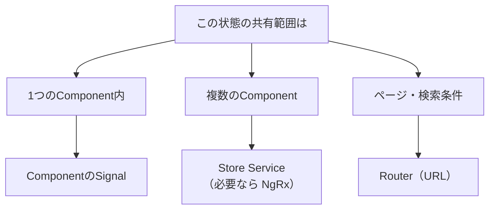

状態管理を学ぶ前に、そもそも「状態」とは何かを整理しておきましょう。状態管理の道具（Store ServiceやNgRx）に飛びつく前に、自分のアプリケーションがどんな状態を持っているのかを見極めることが、適切な設計の第一歩です。状態を分類できれば、「この状態には、どの管理方法が向いているか」を判断できるようになります。

状態管理でよくある失敗は、あらゆる状態を、ひとつの大きな仕組みに詰め込んでしまうことです。単純な画面の開閉状態まで、大掛かりな状態管理ライブラリで扱うのは、過剰です。逆に、アプリ全体で共有すべきデータを、あちこちのComponentに散らばらせるのも問題です。状態を種類ごとに見分け、それぞれにふさわしい置き場所を与える。この章では、その分類の観点を身につけます。

:::message
**この章で学ぶこと**

- 状態とは何か
- 状態を分類する観点
- 状態の種類ごとの適切な置き場所
- 状態管理の設計の第一歩
:::

## 状態とは何か

状態とは、アプリケーションが「いまどうなっているか」を表すデータのことです。もう少し具体的にいえば、時間とともに変わりうる、アプリの現在の様子を表す値です。

たとえば、次のようなものはすべて状態です。

- 入力欄に、いま入力されている文字
- ログインしているユーザーの情報
- サーバーから取得した商品の一覧
- モーダルダイアログが、開いているか閉じているか
- どのタブが選択されているか

これらは、利用者の操作や通信によって変化します。そして、その変化を画面に反映する必要があります。第26章で学んだ変更検知は、この状態の変化を画面に映す仕組みでした。状態管理とは、こうした状態を、どこに置き、どう変更し、どう共有するかを設計することです。言い換えれば、状態管理は「データの置き場所と、その出し入れのルール」を決める営みです。この設計がうまくいけば、アプリは予測しやすく、変更にも強くなります。逆に、状態が無秩序に散らばると、小さな変更が思わぬ場所に波及し、保守が困難になります。

## 状態を分類する観点

状態は、いくつかの観点で分類できます。もっとも重要なのが、「その状態は、どこまでの範囲で共有されるか」という観点です。共有の範囲によって、状態は大きく次のように分けられます。

- **ローカルな状態**: ひとつのComponentの中だけで使う状態。入力途中の値、開閉フラグなど。
- **共有される状態**: 複数のComponentにまたがって使う状態。ログインユーザー、カートの中身など。
- **サーバー由来の状態**: サーバーから取得したデータ。商品一覧、ユーザーのプロフィールなど。
- **URLに表れる状態**: 現在のページや、検索条件など。RouterがURLで管理する状態。

これらは性質が異なり、ふさわしい管理方法も違います。ひとくくりに「状態管理」と言っても、実際には、種類ごとに手段を選び分けるのが適切です。

それぞれを、具体例とともに見てみましょう。ローカルな状態の典型は、モーダルの開閉フラグです。`isOpen = signal(false)`のように、そのComponentの中だけで完結します。共有される状態の典型は、ログインユーザーです。ヘッダー、マイページ、権限判定など、多くの場所が同じユーザー情報を参照します。サーバー由来の状態の典型は、商品一覧です。サーバーから取得し、クライアントはそれを表示します。URLに表れる状態の典型は、検索ページのキーワードやページ番号です。これらはURLに載せることで、共有や復元が可能になります。同じ「状態」でも、これだけ性質が異なるのです。

## サーバー状態とクライアント状態

もうひとつ、重要な分類の観点があります。「その状態は、サーバーとクライアントの、どちらが正なのか」という観点です。

**サーバー状態**は、サーバーにある本体を、クライアントが取得して一時的に持っているものです。商品一覧やユーザー情報がこれにあたります。この種の状態で難しいのは、「クライアントが持っているコピーが、古くなっているかもしれない」という点です。いつ再取得するか、どうキャッシュするか、といった鮮度の管理が課題になります。第9部の`httpResource()`は、このサーバー状態を扱う手段のひとつでした。

**クライアント状態**は、クライアント側で生まれ、クライアントが正であるものです。モーダルの開閉、選択中のタブ、フォームの入力途中の値などです。この種の状態は、サーバーとの同期を気にする必要がなく、扱いは比較的単純です。

この2つを混同すると、設計を誤ります。サーバー状態を、まるでクライアント状態のように扱って、鮮度の管理を怠ると、古いデータを表示し続けてしまいます。逆に、単純なクライアント状態に、サーバー状態向けの重厚な仕組みを持ち込むと、過剰になります。「サーバーが正か、クライアントが正か」を見極めることは、共有範囲と並ぶ、重要な分類の軸です。

## 種類ごとの置き場所

分類した状態を、それぞれどこに置くべきか、指針を示します。

**ローカルな状態**は、そのComponentの中に、Signalで持つのが基本です。第6部で学んだ`signal()`が、まさにこの用途に向きます。ほかのComponentと共有しないなら、外に出す必要はありません。モーダルの開閉や、フォームの入力途中の値などが、これにあたります。

**共有される状態**は、Serviceに置きます。第22章で学んだ「状態を持つService」です。複数のComponentが、同じServiceのインスタンスを通じて、同じ状態を参照します。これが、この部で扱うStore Serviceの領域です。

**サーバー由来の状態**は、取得と保持をServiceにまとめます。第9部の`httpResource()`や、Store Serviceが担います。サーバーが正となるデータなので、いつ取得し、どうキャッシュするかも設計の対象になります。

**URLに表れる状態**は、Routerに任せます。第7部で学んだように、現在のページや検索条件は、URLで表すのが適切です。これを独自の状態管理に抱え込む必要はありません。

## すべてを状態管理ライブラリに入れない

ここで強調したいのは、「すべての状態を、NgRxのような大掛かりな仕組みに入れる必要はない」ということです。状態管理ライブラリは強力ですが、導入すると、それなりの記述量と学習コストがかかります。単純なローカル状態にまで適用すると、かえって複雑になります。

本書が推奨する考え方は、「状態は、必要最小限のスコープに置く」というものです。ローカルで済むならComponentのSignalに、共有が必要ならService（Store）に、と段階的に広げます。そして、アプリが本当に大規模で複雑な共有状態を抱えるようになって初めて、NgRxのような本格的な仕組みを検討します。小さく始め、必要に応じて育てるのです。

## 状態管理の設計の第一歩

状態管理の設計は、道具選びから始めるものではありません。まず、自分のアプリケーションが持つ状態を洗い出し、それぞれを分類することから始めます。「この状態は、どこまで共有されるのか」「サーバーが正なのか、クライアントが正なのか」を見極める。そのうえで、種類ごとにふさわしい置き場所を与える。この順序が大切です。

道具（Store ServiceやNgRx）は、あくまで手段です。手段から入ると、過剰な設計や、不適切な状態配置を招きます。状態の性質を理解してから、それに見合う手段を選ぶ。この章で身につけた分類の観点は、続く章で具体的な道具を学ぶときの、判断の土台になります。

## 実際の画面で分類してみる

具体的な画面で、状態の分類を練習してみましょう。「商品検索ページ」を考えます。この画面には、次のような状態があります。

- **検索キーワード・並び順**: URLに表れる状態。ブックマークや共有のため、Routerに任せます。
- **検索結果の商品一覧**: サーバー由来の状態。取得と保持をServiceにまとめます。
- **読み込み中かどうか**: サーバー状態に付随する状態。一覧とあわせてServiceで管理します。
- **絞り込みパネルの開閉**: ローカルなクライアント状態。そのComponentのSignalで持ちます。
- **ログインユーザー**: 共有される状態。ヘッダーなど他の画面でも使うため、共有Storeに置きます。

同じ画面の中に、これだけ性質の異なる状態が混在しています。もしこれらをすべて「ひとつの状態管理」に詰め込もうとすると、無理が生じます。絞り込みパネルの開閉のような些細な状態まで、共有Storeに載せる必要はありません。逆に、ログインユーザーをそのComponentに閉じ込めると、他の画面と共有できません。状態ごとに、ふさわしい置き場所は異なるのです。この分類ができれば、次章以降で学ぶ道具を、適材適所で使えるようになります。

## 状態管理は育てるもの

最後に、状態管理は、最初にすべてを決めきるものではない、という点を強調しておきます。アプリケーションは、開発が進むにつれて成長します。当初はローカルで済んでいた状態が、あとで複数の画面で必要になることもあります。そのときに、ローカルのSignalから共有のServiceへと、置き場所を移せばよいのです。

大切なのは、その時々で、状態の性質に合った最小限の手段を選ぶことです。最初から将来を見越して大掛かりな仕組みを入れると、多くの場合、その予測は外れ、複雑さだけが残ります。必要になってから育てる。この姿勢が、状態管理を健全に保ちます。次章から具体的な道具を学びますが、どれを使うかは、常にこの「いま本当に必要な範囲は何か」という問いから判断してください。道具の豊富さに惑わされず、状態の性質に立ち返ることが、遠回りに見えて、もっとも確実な設計の道です。

## よくあるつまずき

- **ローカルな状態を共有Storeに入れる**: モーダルの開閉のような、そのComponentだけの状態を、共有のStoreに入れると、無関係なComponentから触れる状態が増え、複雑になります。ローカルはローカルに閉じます。
- **サーバー状態を二重に持つ**: サーバーから取得したデータを、複数の場所でそれぞれ取得・保持すると、どれが最新かわからなくなります。サーバー状態は、取得と保持の場所を一本化します。
- **URLで表せる状態を抱え込む**: 検索条件やページ番号を、Storeだけで持ってURLに反映しないと、ブックマークや共有ができません。URLに表れるべき状態は、Routerに任せます。
- **最初から大きな仕組みを選ぶ**: 「本格的なアプリだから」とNgRxから始めると、単純な状態にまで重い仕組みがかかります。分類してから、必要な範囲で選びます。

## まとめ

- 状態とは、アプリケーションの「いまどうなっているか」を表す、変化するデータです
- 状態は、共有の範囲（ローカル・共有・サーバー由来・URL）で分類できます
- ローカルはSignal、共有はService、URLはRouterと、種類ごとに置き場所が異なります
- すべてを状態管理ライブラリに入れず、必要最小限のスコープに置くのが基本です
- 設計は道具選びからでなく、状態の分類から始めます
- 状態管理は最初に決めきるものではなく、必要に応じて育てるものです

次章では、共有される状態を扱う古典的な手段、BehaviorSubjectによるStore Serviceを学びます。
