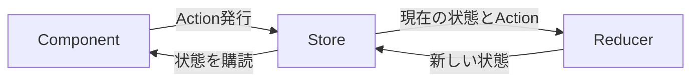

ここまで、自前のStore Serviceで共有状態を管理する方法を学びました。中小規模のアプリなら、それで十分です。しかし、状態が大量にあり、複雑に絡み合い、多くの場所から変更される大規模なアプリケーションでは、自前のStoreでは管理が難しくなります。「この状態は、いつ、どこで、なぜ変わったのか」を追うのが困難になるのです。

この課題に応えるのが、NgRxです。NgRxは、Reduxというパターンにもとづく、Angular向けの状態管理ライブラリです。この章では、まずNgRxの土台にあるReduxパターンの思想を理解します。個々のAPIを学ぶ前に、「なぜこういう仕組みになっているのか」をつかむことが、NgRxを使いこなす鍵になります。NgRxは学習コストが高いと言われますが、その根底にある考え方はシンプルです。

:::message
**この章で学ぶこと**

- 大規模な状態管理が抱える課題
- Reduxパターンの考え方
- NgRxを構成する要素
- NgRxを使うべき場面
:::

## 大規模な状態管理の課題

自前のStore Serviceは、状態を変更するメソッド（`add`や`remove`）を、自由に増やせました。この自由さは、小規模なうちは便利ですが、大規模になると裏目に出ます。

状態を変更する経路が、あちこちに増えていくと、「この状態が、なぜこの値になったのか」を追うのが難しくなります。複数のComponentやServiceが、それぞれの都合で状態を書き換えると、変更の全体像が見えなくなるのです。さらに、状態の変更にともなう副作用（通信やログなど）が絡むと、複雑さはいっそう増します。

大規模なアプリケーションに必要なのは、「状態の変更を、予測可能で、追跡可能にする」仕組みです。どんな変更も、決まった手順を通してのみ行われる。そうすれば、変更の履歴をたどり、原因を突き止められます。この「規律ある状態変更」を実現するのが、Reduxパターンです。自由に状態を書き換えられる手軽さを、あえて手放し、決まった経路に絞る。その代わりに、変更の全体像を見渡せる力を得る。これがReduxパターンの基本的な発想です。

## Reduxパターンの考え方

Reduxパターンは、状態管理に厳格な規律を課す設計です。その核心は、次の3つの原則にあります。

- **状態は、ひとつの場所にまとめる**: アプリの状態を、単一のStore（ストア）に集約します。状態が散らばらないため、全体像を把握しやすくなります。
- **状態は、直接変更しない**: 状態を書き換えるには、「何が起きたか」を表すAction（アクション）を発行します。直接の代入は行いません。
- **変更は、純粋な関数で行う**: Actionを受けて新しい状態を計算するのは、Reducer（リデューサー）という純粋な関数です。同じ状態とActionからは、常に同じ結果が得られます。

この仕組みでは、状態を変えたいとき、まず「何が起きたか」をActionとして発行します。すると、Reducerがそれを受け取り、現在の状態から新しい状態を計算します。状態の変更は、必ずこの「Action → Reducer」という一方向の流れを通ります。この一方向性は、第17章で学んだ単方向データフローの考え方を、アプリケーション全体の状態管理へと拡張したものだと捉えられます。Componentの間だけでなく、状態そのものの変更にも、一定の向きと規律を与えるのです。

変更が必ずこの流れを通るため、「いつ、どんなActionで、状態がどう変わったか」がすべて追跡できます。これが、Reduxパターンがもたらす予測可能性です。

## なぜこんなに回りくどいのか

初めてこの仕組みを見ると、「状態を変えるだけなのに、なぜこんなに手間がかかるのか」と感じるかもしれません。自前のStoreなら、メソッドを呼んで直接書き換えれば済んだことです。

この回りくどさには、理由があります。Reduxパターンは、あえて変更の経路を1本に絞ることで、規律と追跡可能性を得ています。「何が起きたか」がすべてActionとして記録されるため、状態の変更履歴を時系列で追えます。開発ツールを使えば、Actionを巻き戻して過去の状態を再現する、といったことも可能になります。この強力なデバッグ性と予測可能性は、大規模で複雑なアプリケーションほど、価値を発揮します。

つまり、Reduxパターンの手間は、小規模なアプリには過剰ですが、大規模なアプリには必要なコストなのです。この見極めが、後で述べる「NgRxを使うべきか」の判断につながります。

## 不変性という土台

Reduxパターンを支える、もうひとつの重要な原則が、不変性（イミュータビリティ）です。Reducerは、既存の状態を書き換えず、必ず新しい状態オブジェクトを作って返します。第27章のOnPushや、第29章のSignalでも登場した、あの考え方です。

なぜ不変性が必要なのでしょうか。状態を直接書き換えてしまうと、「変更前」と「変更後」を比較できなくなります。新しいオブジェクトとして状態を作れば、前の状態はそのまま残り、参照の比較で変化を検知でき、履歴として保持することもできます。Reduxパターンの追跡可能性は、この不変性の上に成り立っています。状態を「上書きする」のではなく、「新しい状態に置き換える」。この規律が、時間を巻き戻すようなデバッグを可能にするのです。

## 開発ツールによる可視化

Reduxパターンの実利を、もっともよく体感できるのが、開発ツール（DevTools）です。NgRxには、ブラウザの拡張機能と連携する仕組みがあり、これを使うと、発行されたすべてのActionが時系列で一覧表示されます。

各Actionの時点で、状態がどうなっていたかを確認でき、Actionを選んでその時点まで状態を巻き戻す、といった操作もできます。「この画面がおかしくなったのは、どのActionのせいか」を、履歴をたどって突き止められるのです。この強力なデバッグ体験は、すべての状態変更がActionとして記録される、Reduxパターンだからこそ実現します。自前のStore Serviceでは、こうした一元的な可視化は簡単には得られません。大規模なアプリでバグを追うとき、この可視化は大きな助けになります。

## 自前のStoreとの違い

第49章・第50章で学んだ自前のStore Serviceと、NgRx（Reduxパターン）の違いを、あらためて整理します。自前のStoreは、状態を変更するメソッドを自由に定義でき、手軽でした。その代わり、変更経路が増えると追跡が難しくなります。NgRxは、変更を必ずAction経由に強制することで、この追跡可能性を確保します。

言い換えれば、両者は「自由と規律」のトレードオフの関係にあります。自前のStoreは自由で手軽、NgRxは規律が強く追跡しやすい。小規模なら自由の恩恵が勝り、大規模になるほど規律の価値が高まります。どちらが優れているという話ではなく、アプリの規模と複雑さに応じて、必要な規律の強さを選ぶ、と考えるのが正確です。

## NgRxを構成する要素

NgRxは、このReduxパターンをAngular向けに実装したものです。次章以降で詳しく扱う、いくつかの要素からなります。

- **Store**: 状態を保持する、単一の場所です。
- **Action**: 「何が起きたか」を表すオブジェクトです。
- **Reducer**: Actionを受けて、新しい状態を計算する純粋な関数です。
- **Selector**: Storeから、必要な状態を取り出す関数です。
- **Effects**: 通信などの副作用を扱う仕組みです。RxJSを活用します。

これらが連携して、Reduxパターンを実現します。ComponentはActionを発行（dispatch）し、Selectorで状態を読み取ります。状態の変更ロジックはReducerに、副作用はEffectsに、それぞれ分離されます。NgRxはRxJSの上に構築されており、第8部で学んだ知識が、ここで大いに役立ちます。

## 単一の情報源という考え方

Reduxパターンの根底には、「単一の情報源（Single Source of Truth）」という考え方があります。アプリの状態を、あちこちに分散させず、ひとつのStoreに集約する、という原則です。

なぜ、これが重要なのでしょうか。状態が複数の場所に散らばっていると、「同じ情報の、別々のコピー」が生まれ、それらの間で食い違いが起きます。たとえば、ログインユーザーの情報を、複数のComponentがそれぞれ保持していたら、片方だけが更新されて、表示が食い違う、といった不具合が起こります。状態をひとつのStoreに集約すれば、どこから見ても同じ状態を参照するため、こうした食い違いが原理的に起きません。

この「単一の情報源」は、大規模なアプリケーションで、状態の一貫性を保つための強力な原則です。ただし、すべての状態を単一のStoreに集める必要はありません。第48章で分類したように、ローカルな状態まで集約するのは過剰です。共有され、一貫性が重要な状態を、集約の対象と考えます。「共有すべきものは一か所に集める」という原則として捉えてください。

## NgRxを使うべき場面

重要なのは、「NgRxは、いつでも使うべき道具ではない」ということです。NgRxは強力ですが、Action・Reducer・Selectorといった要素を定義するため、記述量が増え、学習コストもかかります。小規模なアプリに導入すると、その手間が利点を上回ってしまいます。

本書が推奨する判断の目安は、次のとおりです。NgRxが向くのは、状態が多く複雑で、多数のComponentから参照・変更され、副作用が絡み、変更の追跡が重要になる大規模なアプリケーションです。逆に、状態が少なく、共有範囲も限られるなら、前章までのSignalベースのStore Serviceで十分です。第48章で述べた「小さく始め、必要に応じて育てる」という原則を、ここでも思い出してください。NgRxは、その「育てた先」にある選択肢のひとつです。

また、NgRxには学習コストとチームの習熟という側面もあります。Reduxパターンは、慣れるまでは回りくどく感じられ、チーム全員がその流儀を理解している必要があります。個人開発や小さなチームでは、この習熟コストが負担になることもあります。技術選定は、アプリの規模だけでなく、チームの状況も含めて判断するものです。「大規模だから機械的にNgRx」ではなく、「この規模と体制で、Reduxパターンの規律が本当に見合うか」を問うのが、健全な判断です。なお、次章以降で学ぶNgRxのSignalStoreは、この学習コストを下げた選択肢でもあり、Reduxほどの厳格さを求めない場合の中間的な選択肢になります。

## まとめ

- 大規模な状態管理では、変更を予測可能・追跡可能にする仕組みが必要です
- Reduxパターンは、状態の集約・Actionによる変更・純粋な関数での計算を原則とします
- 変更は「Action → Reducer」の一方向を通るため、履歴を追跡できます
- NgRxは、Store・Action・Reducer・Selector・Effectsで、このパターンを実現します
- NgRxは大規模で複雑なアプリに向き、小規模ではSignalベースのStoreで十分です
- 選定は、アプリの規模だけでなく、チームの習熟や体制も含めて判断します

次章では、NgRxの中核であるAction・Reducer・Selectorの、具体的な書き方を学びます。
